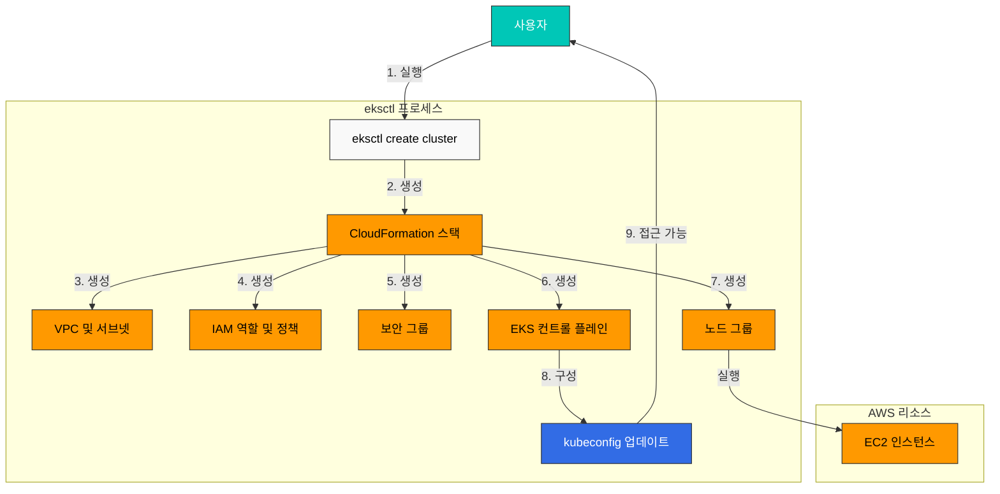
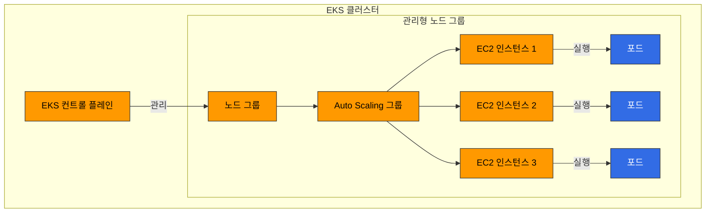
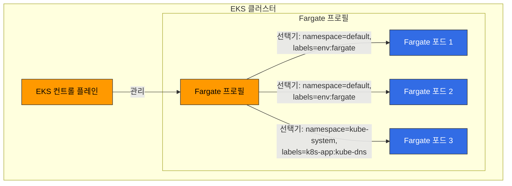

# EKS 클러스터 생성 - 2부

## eksctl을 사용한 클러스터 생성

eksctl은 EKS 클러스터를 생성하고 관리하기 위한 가장 간단한 방법입니다. eksctl은 CloudFormation을 사용하여 EKS 클러스터와 관련 리소스를 생성합니다.

다음 다이어그램은 eksctl을 사용한 EKS 클러스터 생성 프로세스를 보여줍니다:



### 기본 클러스터 생성

가장 기본적인 형태의 EKS 클러스터를 생성하려면 다음 명령을 실행합니다:

```bash
eksctl create cluster --name my-cluster --region us-west-2
```

이 명령은 다음과 같은 기본 설정으로 클러스터를 생성합니다:
- 2개의 m5.large 노드
- 새로운 VPC 및 서브넷
- 기본 Amazon Linux 2 AMI
- 최신 Kubernetes 버전

### 구성 파일을 사용한 클러스터 생성

더 복잡한 구성의 경우 YAML 파일을 사용하여 클러스터를 정의할 수 있습니다:

```yaml
# cluster.yaml
apiVersion: eksctl.io/v1alpha5
kind: ClusterConfig

metadata:
  name: my-eks-cluster
  region: us-west-2
  version: "1.26"

vpc:
  id: vpc-12345678
  subnets:
    private:
      us-west-2a:
        id: subnet-12345678
      us-west-2b:
        id: subnet-87654321
    public:
      us-west-2a:
        id: subnet-23456789
      us-west-2b:
        id: subnet-98765432

managedNodeGroups:
  - name: ng-1
    instanceType: m5.large
    desiredCapacity: 2
    minSize: 1
    maxSize: 3
    privateNetworking: true
    volumeSize: 80
    volumeType: gp3
    iam:
      withAddonPolicies:
        imageBuilder: true
        autoScaler: true
        externalDNS: true
        certManager: true
        appMesh: true
        ebs: true
        fsx: true
        efs: true
        albIngress: true
        xRay: true
        cloudWatch: true

  - name: ng-2
    instanceType: c5.xlarge
    desiredCapacity: 2
    privateNetworking: true
    spot: true

fargate:
  profiles:
    - name: fp-default
      selectors:
        - namespace: default
          labels:
            env: fargate
    - name: fp-kube-system
      selectors:
        - namespace: kube-system
          labels:
            k8s-app: kube-dns

cloudWatch:
  clusterLogging:
    enableTypes: ["api", "audit", "authenticator", "controllerManager", "scheduler"]
```

이 구성 파일을 사용하여 클러스터를 생성하려면 다음 명령을 실행합니다:

```bash
eksctl create cluster -f cluster.yaml
```

### 관리형 노드 그룹 생성

다음 다이어그램은 EKS 클러스터의 관리형 노드 그룹 아키텍처를 보여줍니다:



기존 클러스터에 관리형 노드 그룹을 추가하려면 다음 명령을 실행합니다:

```bash
eksctl create nodegroup \
  --cluster my-cluster \
  --region us-west-2 \
  --name my-nodegroup \
  --node-type m5.large \
  --nodes 3 \
  --nodes-min 1 \
  --nodes-max 5 \
  --ssh-access \
  --ssh-public-key my-key
```

또는 구성 파일을 사용할 수 있습니다:

```yaml
# nodegroup.yaml
apiVersion: eksctl.io/v1alpha5
kind: ClusterConfig

metadata:
  name: my-cluster
  region: us-west-2

managedNodeGroups:
  - name: my-nodegroup
    instanceType: m5.large
    desiredCapacity: 3
    minSize: 1
    maxSize: 5
    volumeSize: 80
    volumeType: gp3
    ssh:
      allow: true
      publicKeyName: my-key
```

```bash
eksctl create nodegroup -f nodegroup.yaml
```

### Fargate 프로필 생성

다음 다이어그램은 EKS Fargate 프로필 아키텍처를 보여줍니다:



Fargate 프로필을 생성하려면 다음 명령을 실행합니다:

```bash
eksctl create fargateprofile \
  --cluster my-cluster \
  --region us-west-2 \
  --name my-fargate-profile \
  --namespace default \
  --labels env=fargate
```

또는 구성 파일을 사용할 수 있습니다:

```yaml
# fargate.yaml
apiVersion: eksctl.io/v1alpha5
kind: ClusterConfig

metadata:
  name: my-cluster
  region: us-west-2

fargate:
  profiles:
    - name: my-fargate-profile
      selectors:
        - namespace: default
          labels:
            env: fargate
```

```bash
eksctl create fargateprofile -f fargate.yaml
```

### 클러스터 업데이트

eksctl을 사용하여 기존 클러스터를 업데이트할 수 있습니다:

```bash
# 클러스터 버전 업그레이드
eksctl upgrade cluster --name=my-cluster --version=1.27

# 노드 그룹 업그레이드
eksctl upgrade nodegroup --cluster=my-cluster --name=my-nodegroup
```

### 클러스터 삭제

eksctl을 사용하여 클러스터를 삭제할 수 있습니다:

```bash
eksctl delete cluster --name=my-cluster --region=us-west-2
```

## 퀴즈

이 장에서 배운 내용을 테스트하려면 [EKS 클러스터 생성 - 2부 퀴즈](../../quizzes/eks/02-eks-cluster-creation-part2-quiz.md)를 풀어보세요.
