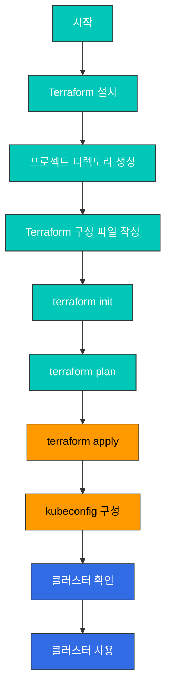
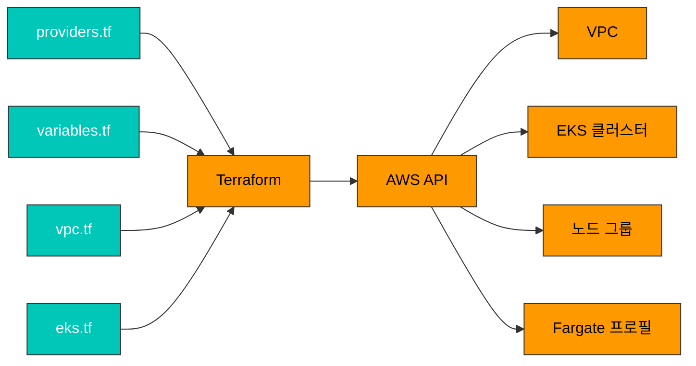
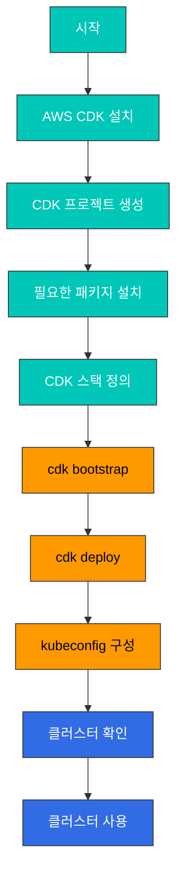
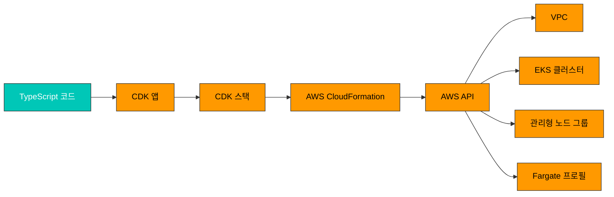
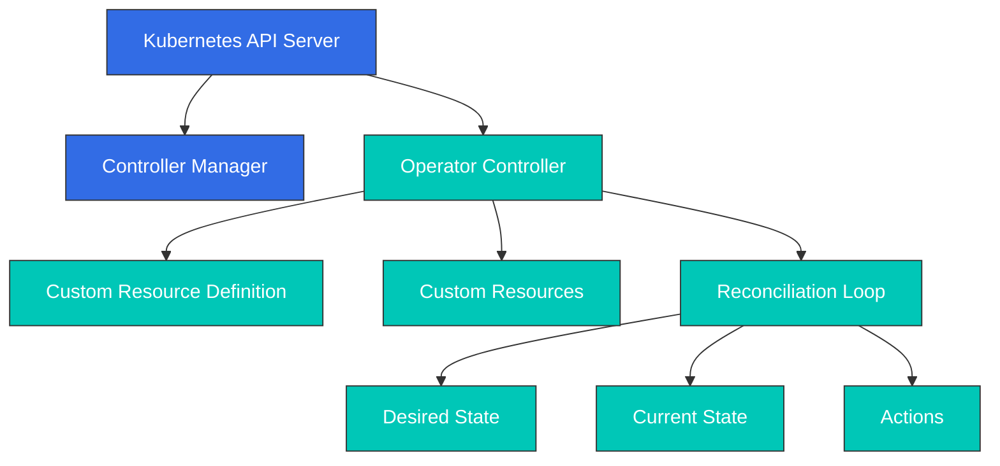
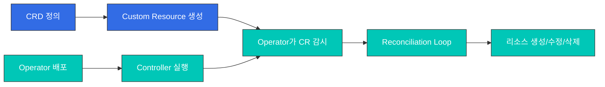

# EKS 클러스터 생성 - 4부: Terraform 및 CDK를 사용한 클러스터 생성

> **지원 버전**: Kubernetes 1.31, 1.32, 1.33  
> **마지막 업데이트**: 2025년 7월 25일

## 실습 환경 설정

이 문서의 예제를 따라하기 위해서는 다음과 같은 도구와 환경이 필요합니다:

### 필수 도구
- AWS CLI v2.0 이상
- Terraform v1.0.0 이상 (Terraform 예제용)
- AWS CDK v2.0 이상 (CDK 예제용)
- kubectl v1.31 이상
- Node.js v14 이상 (CDK 사용 시)

### AWS 계정 설정
1. AWS 계정이 필요합니다. 계정이 없는 경우 [AWS 계정 생성](https://aws.amazon.com/premiumsupport/knowledge-center/create-and-activate-aws-account/)을 참조하세요.
2. 다음 IAM 권한이 필요합니다:
   - AmazonEKSClusterPolicy
   - AmazonEKSServicePolicy
   - AmazonVPCFullAccess
   - IAMFullAccess

### AWS CLI 구성
```bash
aws configure
# AWS Access Key ID, Secret Access Key, 리전, 출력 형식을 입력합니다.
```

### 로컬 개발 환경 (선택 사항)
로컬에서 Kubernetes를 테스트하려면 다음 도구 중 하나를 사용할 수 있습니다:
- **minikube**: `brew install minikube` (macOS) 또는 [minikube 설치 가이드](https://minikube.sigs.k8s.io/docs/start/) 참조
- **kind**: `brew install kind` (macOS) 또는 [kind 설치 가이드](https://kind.sigs.k8s.io/docs/user/quick-start/) 참조

## Terraform을 사용한 클러스터 생성

Terraform은 인프라를 코드로 관리하는 도구로, EKS 클러스터를 생성하고 관리하는 데 사용할 수 있습니다. Terraform을 사용하면 인프라를 버전 관리하고 반복 가능한 방식으로 배포할 수 있습니다.

### Terraform을 사용한 EKS 클러스터 생성 프로세스



### Terraform 구성 요소 관계



### 1. Terraform 설치

먼저 Terraform을 설치해야 합니다:

**macOS**:
```bash
brew install terraform
```

**Linux**:
```bash
curl -fsSL https://apt.releases.hashicorp.com/gpg | sudo apt-key add -
sudo apt-add-repository "deb [arch=amd64] https://apt.releases.hashicorp.com $(lsb_release -cs) main"
sudo apt-get update && sudo apt-get install terraform
```

**Windows**:
```
https://www.terraform.io/downloads.html
```

### 2. 프로젝트 디렉토리 생성

Terraform 프로젝트를 위한 디렉토리를 생성합니다:

```bash
mkdir eks-terraform
cd eks-terraform
```

### 3. Terraform 구성 파일 작성

다음과 같은 Terraform 구성 파일을 작성합니다:

**providers.tf**:
```hcl
provider "aws" {
  region = "us-west-2"
}

terraform {
  required_providers {
    aws = {
      source  = "hashicorp/aws"
      version = "~> 4.0"
    }
  }
}
```

**variables.tf**:
```hcl
variable "cluster_name" {
  description = "Name of the EKS cluster"
  type        = string
  default     = "my-eks-cluster"
}

variable "cluster_version" {
  description = "Kubernetes version to use for the EKS cluster"
  type        = string
  default     = "1.26"
}

variable "vpc_cidr" {
  description = "CIDR block for the VPC"
  type        = string
  default     = "10.0.0.0/16"
}

variable "availability_zones" {
  description = "List of availability zones"
  type        = list(string)
  default     = ["us-west-2a", "us-west-2b"]
}

variable "private_subnets" {
  description = "List of private subnet CIDR blocks"
  type        = list(string)
  default     = ["10.0.1.0/24", "10.0.2.0/24"]
}

variable "public_subnets" {
  description = "List of public subnet CIDR blocks"
  type        = list(string)
  default     = ["10.0.101.0/24", "10.0.102.0/24"]
}

variable "node_groups" {
  description = "Map of EKS managed node group definitions"
  type        = map(any)
  default     = {
    ng1 = {
      name           = "node-group-1"
      instance_types = ["m5.large"]
      min_size       = 1
      max_size       = 3
      desired_size   = 2
      disk_size      = 80
    }
    ng2 = {
      name           = "node-group-2"
      instance_types = ["c5.xlarge"]
      min_size       = 1
      max_size       = 3
      desired_size   = 2
      disk_size      = 80
      capacity_type  = "SPOT"
    }
  }
}
```

**vpc.tf**:
```hcl
module "vpc" {
  source  = "terraform-aws-modules/vpc/aws"
  version = "~> 3.0"

  name = "${var.cluster_name}-vpc"
  cidr = var.vpc_cidr

  azs             = var.availability_zones
  private_subnets = var.private_subnets
  public_subnets  = var.public_subnets

  enable_nat_gateway   = true
  single_nat_gateway   = true
  enable_dns_hostnames = true

  public_subnet_tags = {
    "kubernetes.io/cluster/${var.cluster_name}" = "shared"
    "kubernetes.io/role/elb"                    = "1"
  }

  private_subnet_tags = {
    "kubernetes.io/cluster/${var.cluster_name}" = "shared"
    "kubernetes.io/role/internal-elb"           = "1"
  }

  tags = {
    Environment = "dev"
    Terraform   = "true"
  }
}
```

**eks.tf**:
```hcl
module "eks" {
  source  = "terraform-aws-modules/eks/aws"
  version = "~> 18.0"

  cluster_name    = var.cluster_name
  cluster_version = var.cluster_version

  vpc_id     = module.vpc.vpc_id
  subnet_ids = module.vpc.private_subnets

  cluster_endpoint_private_access = true
  cluster_endpoint_public_access  = true

  # EKS Managed Node Groups
  eks_managed_node_group_defaults = {
    disk_size      = 80
    instance_types = ["m5.large"]
  }

  eks_managed_node_groups = {
    for k, v in var.node_groups : k => {
      name           = v.name
      instance_types = v.instance_types
      min_size       = v.min_size
      max_size       = v.max_size
      desired_size   = v.desired_size
      disk_size      = v.disk_size
      capacity_type  = lookup(v, "capacity_type", "ON_DEMAND")
    }
  }

  # Fargate Profile
  fargate_profiles = {
    default = {
      name = "default"
      selectors = [
        {
          namespace = "default"
          labels = {
            env = "fargate"
          }
        }
      ]
    }
    kube-system = {
      name = "kube-system"
      selectors = [
        {
          namespace = "kube-system"
          labels = {
            k8s-app = "kube-dns"
          }
        }
      ]
    }
  }

  # Enable EKS Cluster CloudWatch Logging
  cluster_enabled_log_types = ["api", "audit", "authenticator", "controllerManager", "scheduler"]

  tags = {
    Environment = "dev"
    Terraform   = "true"
  }
}
```

**outputs.tf**:
```hcl
output "cluster_id" {
  description = "EKS cluster ID"
  value       = module.eks.cluster_id
}

output "cluster_endpoint" {
  description = "Endpoint for EKS control plane"
  value       = module.eks.cluster_endpoint
}

output "cluster_security_group_id" {
  description = "Security group ID attached to the EKS cluster"
  value       = module.eks.cluster_security_group_id
}

output "config_map_aws_auth" {
  description = "A kubernetes configuration to authenticate to this EKS cluster"
  value       = module.eks.aws_auth_configmap_yaml
}

output "region" {
  description = "AWS region"
  value       = "us-west-2"
}
```

### 4. Terraform 초기화 및 적용

Terraform 구성 파일을 작성한 후에는 다음 단계로 진행합니다:

> **중요**: 실행 전 모든 구성 파일이 올바르게 작성되었는지 확인하세요.

#### 4.1 Terraform 초기화

먼저 Terraform을 초기화하여 필요한 공급자와 모듈을 다운로드합니다:

```bash
terraform init
```

#### 4.2 계획 확인

변경 사항을 적용하기 전에 계획을 확인하여 어떤 리소스가 생성될지 미리 확인합니다:

```bash
terraform plan
```

이 명령은 생성될 리소스 목록과 변경 사항을 보여줍니다. 출력을 주의 깊게 검토하세요.

#### 4.3 인프라 생성

계획을 검토한 후 문제가 없으면 다음 명령으로 인프라를 생성합니다:

```bash
terraform apply
```

`terraform apply` 명령을 실행하면 Terraform은 계획을 다시 표시하고 확인을 요청합니다. `yes`를 입력하여 계획을 적용합니다.

> **참고**: EKS 클러스터 생성에는 약 15-20분이 소요될 수 있습니다.

`terraform apply` 명령을 실행하면 Terraform은 계획을 표시하고 확인을 요청합니다. `yes`를 입력하여 계획을 적용합니다.

### 5. kubeconfig 구성

Terraform 출력에서 클러스터 이름과 리전을 사용하여 kubeconfig를 구성합니다:

```bash
aws eks update-kubeconfig \
  --name $(terraform output -raw cluster_id) \
  --region $(terraform output -raw region)
```

### 6. 클러스터 확인

클러스터가 올바르게 구성되었는지 확인합니다:

```bash
kubectl get nodes
```

### 7. 클러스터 삭제

클러스터를 삭제하려면 다음 명령을 실행합니다:

```bash
terraform destroy
```

## AWS CDK를 사용한 클러스터 생성

AWS Cloud Development Kit(CDK)는 익숙한 프로그래밍 언어를 사용하여 클라우드 인프라를 정의하는 도구입니다. CDK를 사용하면 TypeScript, Python, Java 또는 C#과 같은 언어로 EKS 클러스터를 생성하고 관리할 수 있습니다.

### AWS CDK를 사용한 EKS 클러스터 생성 프로세스



### CDK 구성 요소 관계



### 1. AWS CDK 설치

먼저 AWS CDK를 설치해야 합니다:

```bash
npm install -g aws-cdk
```

### 2. CDK 프로젝트 생성

CDK 프로젝트를 생성합니다:

```bash
mkdir eks-cdk
cd eks-cdk
cdk init app --language typescript
```

### 3. 필요한 패키지 설치

EKS 클러스터를 생성하는 데 필요한 패키지를 설치합니다:

```bash
npm install @aws-cdk/aws-eks @aws-cdk/aws-ec2 @aws-cdk/aws-iam
```

### 4. CDK 스택 정의

`lib/eks-cdk-stack.ts` 파일을 다음과 같이 수정합니다:

```typescript
import * as cdk from '@aws-cdk/core';
import * as ec2 from '@aws-cdk/aws-ec2';
import * as eks from '@aws-cdk/aws-eks';
import * as iam from '@aws-cdk/aws-iam';

export class EksCdkStack extends cdk.Stack {
  constructor(scope: cdk.Construct, id: string, props?: cdk.StackProps) {
    super(scope, id, props);

    // VPC 생성
    const vpc = new ec2.Vpc(this, 'EksVpc', {
      cidr: '10.0.0.0/16',
      natGateways: 1,
      maxAzs: 2,
      subnetConfiguration: [
        {
          name: 'private',
          subnetType: ec2.SubnetType.PRIVATE_WITH_NAT,
          cidrMask: 24,
        },
        {
          name: 'public',
          subnetType: ec2.SubnetType.PUBLIC,
          cidrMask: 24,
        },
      ],
    });

    // EKS 클러스터 생성
    const cluster = new eks.Cluster(this, 'EksCluster', {
      vpc,
      version: eks.KubernetesVersion.V1_26,
      defaultCapacity: 0,
    });

    // 관리형 노드 그룹 추가
    cluster.addNodegroupCapacity('ManagedNodeGroup', {
      instanceTypes: [new ec2.InstanceType('m5.large')],
      minSize: 1,
      maxSize: 3,
      desiredSize: 2,
      diskSize: 80,
    });

    // Spot 인스턴스를 사용하는 노드 그룹 추가
    cluster.addNodegroupCapacity('SpotNodeGroup', {
      instanceTypes: [
        new ec2.InstanceType('c5.large'),
        new ec2.InstanceType('c5a.large'),
        new ec2.InstanceType('c5d.large'),
      ],
      minSize: 1,
      maxSize: 3,
      desiredSize: 2,
      capacityType: eks.CapacityType.SPOT,
      diskSize: 80,
    });

    // Fargate 프로필 추가
    cluster.addFargateProfile('DefaultProfile', {
      selectors: [
        { namespace: 'default', labels: { env: 'fargate' } },
      ],
    });

    // 출력
    new cdk.CfnOutput(this, 'ClusterName', {
      value: cluster.clusterName,
    });

    new cdk.CfnOutput(this, 'ClusterEndpoint', {
      value: cluster.clusterEndpoint,
    });

    new cdk.CfnOutput(this, 'ClusterArn', {
      value: cluster.clusterArn,
    });
  }
}
```

### 5. CDK 배포

CDK 스택을 배포합니다:

```bash
cdk bootstrap
cdk deploy
```

`cdk deploy` 명령을 실행하면 CDK는 변경 사항을 표시하고 확인을 요청합니다. `y`를 입력하여 배포를 진행합니다.

### 6. kubeconfig 구성

CDK 출력에서 클러스터 이름을 사용하여 kubeconfig를 구성합니다:

```bash
aws eks update-kubeconfig \
  --name $(aws cloudformation describe-stacks --stack-name EksCdkStack --query "Stacks[0].Outputs[?OutputKey=='ClusterName'].OutputValue" --output text) \
  --region us-west-2
```

### 7. 클러스터 확인

클러스터가 올바르게 구성되었는지 확인합니다:

```bash
kubectl get nodes
```

### 8. 클러스터 삭제

클러스터를 삭제하려면 다음 명령을 실행합니다:

```bash
cdk destroy
```

## Kubernetes Operator와 CRD를 사용한 EKS 확장

Kubernetes Operator와 Custom Resource Definition(CRD)은 Kubernetes의 기능을 확장하는 강력한 메커니즘입니다. 이를 통해 EKS 클러스터에서 사용자 정의 리소스를 생성하고 관리할 수 있습니다.

### Kubernetes Operator 개요



### Operator와 CRD의 관계



### 1. Operator란 무엇인가?

Kubernetes Operator는 애플리케이션별 운영 지식을 소프트웨어에 인코딩하여 Kubernetes API를 통해 서비스를 관리하는 소프트웨어 확장입니다. Operator는 복잡한 애플리케이션의 설치, 업데이트, 백업, 복구 등과 같은 작업을 자동화합니다.

Operator는 다음과 같은 구성 요소로 이루어집니다:

1. **Custom Resource Definition (CRD)**: 사용자 정의 리소스의 스키마를 정의합니다.
2. **Custom Resource (CR)**: CRD에 따라 생성된 리소스 인스턴스입니다.
3. **Controller**: CR의 상태를 모니터링하고 원하는 상태로 조정하는 컨트롤러입니다.

### 2. Custom Resource Definition (CRD)

CRD는 Kubernetes API를 확장하여 사용자 정의 리소스를 정의할 수 있게 해줍니다. CRD를 생성하면 새로운 리소스 유형이 Kubernetes API에 추가되며, 이를 통해 사용자 정의 리소스를 생성하고 관리할 수 있습니다.

CRD 예시:

```yaml
apiVersion: apiextensions.k8s.io/v1
kind: CustomResourceDefinition
metadata:
  name: databases.example.com
spec:
  group: example.com
  names:
    kind: Database
    listKind: DatabaseList
    plural: databases
    singular: database
    shortNames:
    - db
  scope: Namespaced
  versions:
  - name: v1
    served: true
    storage: true
    schema:
      openAPIV3Schema:
        type: object
        properties:
          spec:
            type: object
            properties:
              engine:
                type: string
              version:
                type: string
              storageSize:
                type: string
              replicas:
                type: integer
                minimum: 1
            required:
            - engine
            - version
            - storageSize
          status:
            type: object
            properties:
              phase:
                type: string
              message:
                type: string
```

### 3. EKS에서 Operator 사용하기

EKS에서 Operator를 사용하는 방법은 다음과 같습니다:

1. **Operator 설치**: Helm, YAML 매니페스트 또는 Operator Lifecycle Manager(OLM)를 사용하여 Operator를 설치합니다.
2. **CRD 생성**: Operator가 사용할 CRD를 생성합니다.
3. **Custom Resource 생성**: CRD에 따라 Custom Resource를 생성합니다.
4. **Operator 동작 확인**: Operator가 Custom Resource를 감지하고 필요한 작업을 수행하는지 확인합니다.

### 4. 인기 있는 Kubernetes Operator

EKS에서 사용할 수 있는 인기 있는 Operator는 다음과 같습니다:

1. **Prometheus Operator**: Prometheus 모니터링 스택을 관리합니다.
2. **Elasticsearch Operator**: Elasticsearch 클러스터를 관리합니다.
3. **PostgreSQL Operator**: PostgreSQL 데이터베이스를 관리합니다.
4. **Kafka Operator**: Kafka 클러스터를 관리합니다.
5. **Istio Operator**: Istio 서비스 메시를 관리합니다.

### 5. Operator 개발 도구

Operator를 개발하는 데 사용할 수 있는 도구는 다음과 같습니다:

1. **Operator SDK**: Operator를 빠르게 개발하고 배포하기 위한 프레임워크입니다.
2. **Kubebuilder**: Kubernetes API를 확장하는 프레임워크입니다.
3. **KUDO (Kubernetes Universal Declarative Operator)**: 선언적 방식으로 Operator를 생성하는 도구입니다.

### 6. Terraform과 CDK에서 CRD 및 Operator 관리

Terraform과 AWS CDK를 사용하여 EKS 클러스터에 CRD와 Operator를 배포할 수 있습니다.

**Terraform을 사용한 CRD 배포**:

```hcl
resource "kubernetes_manifest" "database_crd" {
  manifest = {
    apiVersion = "apiextensions.k8s.io/v1"
    kind       = "CustomResourceDefinition"
    metadata = {
      name = "databases.example.com"
    }
    spec = {
      group = "example.com"
      names = {
        kind     = "Database"
        listKind = "DatabaseList"
        plural   = "databases"
        singular = "database"
        shortNames = ["db"]
      }
      scope = "Namespaced"
      versions = [{
        name    = "v1"
        served  = true
        storage = true
        schema = {
          openAPIV3Schema = {
            type = "object"
            properties = {
              spec = {
                type = "object"
                properties = {
                  engine = {
                    type = "string"
                  }
                  version = {
                    type = "string"
                  }
                  storageSize = {
                    type = "string"
                  }
                  replicas = {
                    type = "integer"
                    minimum = 1
                  }
                }
                required = ["engine", "version", "storageSize"]
              }
              status = {
                type = "object"
                properties = {
                  phase = {
                    type = "string"
                  }
                  message = {
                    type = "string"
                  }
                }
              }
            }
          }
        }
      }]
    }
  }
}
```

**AWS CDK를 사용한 CRD 배포**:

```typescript
import * as cdk from '@aws-cdk/core';
import * as eks from '@aws-cdk/aws-eks';

export class EksCrdStack extends cdk.Stack {
  constructor(scope: cdk.Construct, id: string, props?: cdk.StackProps) {
    super(scope, id, props);

    // 기존 EKS 클러스터 참조
    const cluster = eks.Cluster.fromClusterAttributes(this, 'ImportedCluster', {
      clusterName: 'my-eks-cluster',
      kubectlRoleArn: 'arn:aws:iam::account:role/role-name',
    });

    // CRD 매니페스트 적용
    cluster.addManifest('DatabaseCRD', {
      apiVersion: 'apiextensions.k8s.io/v1',
      kind: 'CustomResourceDefinition',
      metadata: {
        name: 'databases.example.com',
      },
      spec: {
        group: 'example.com',
        names: {
          kind: 'Database',
          listKind: 'DatabaseList',
          plural: 'databases',
          singular: 'database',
          shortNames: ['db'],
        },
        scope: 'Namespaced',
        versions: [{
          name: 'v1',
          served: true,
          storage: true,
          schema: {
            openAPIV3Schema: {
              type: 'object',
              properties: {
                spec: {
                  type: 'object',
                  properties: {
                    engine: {
                      type: 'string',
                    },
                    version: {
                      type: 'string',
                    },
                    storageSize: {
                      type: 'string',
                    },
                    replicas: {
                      type: 'integer',
                      minimum: 1,
                    },
                  },
                  required: ['engine', 'version', 'storageSize'],
                },
                status: {
                  type: 'object',
                  properties: {
                    phase: {
                      type: 'string',
                    },
                    message: {
                      type: 'string',
                    },
                  },
                },
              },
            },
          },
        }],
      },
    });
  }
}
```

## 더 알아보기

이 문서에서는 Terraform과 AWS CDK를 사용하여 EKS 클러스터를 생성하는 방법과 Kubernetes Operator 및 CRD를 사용하여 EKS를 확장하는 방법에 대해 알아보았습니다. 다음 주제들을 통해 EKS에 대한 이해를 더욱 깊게 할 수 있습니다:

- [EKS 클러스터 생성 - 1부: 사전 요구 사항](./02-eks-cluster-creation-part1.md) - EKS 클러스터 생성을 위한 사전 준비 사항
- [EKS 클러스터 생성 - 2부: eksctl을 사용한 클러스터 생성](./02-eks-cluster-creation-part2.md) - eksctl을 사용한 EKS 클러스터 생성 방법
- [EKS 클러스터 생성 - 3부: AWS Management Console 및 CLI를 사용한 클러스터 생성](./02-eks-cluster-creation-part3.md) - AWS Management Console과 CLI를 사용한 EKS 클러스터 생성 방법
- [EKS 클러스터 생성 - 5부: 클러스터 액세스, 검증, 업그레이드 및 삭제](./02-eks-cluster-creation-part5.md) - EKS 클러스터 관리 방법
- [EKS 네트워킹 - 1부: 기본 개념 및 VPC 구성](./03-eks-networking-part1.md) - EKS 네트워킹의 기본 개념
- [EKS 보안](./05-eks-security.md) - EKS 클러스터의 보안 구성
- [Kubernetes 확장](../core/11-extending-kubernetes.md) - Kubernetes API 확장에 대한 자세한 내용

### 관련 도구 및 통합

- [ArgoCD](../tools/01-argocd.md) - GitOps를 위한 선언적 연속 배포 도구
- [AWS Controllers for Kubernetes (ACK)](../tools/03-ack.md) - Kubernetes에서 AWS 리소스 관리
- [Karpenter](../tools/06-karpenter.md) - Kubernetes 클러스터의 노드 프로비저닝 자동화

### 실습 환경 설정

이 문서의 예제를 따라하기 위해서는 다음과 같은 도구가 필요합니다:

- AWS CLI v2.0 이상
- Terraform v1.0.0 이상
- AWS CDK v2.0 이상
- kubectl v1.31 이상
- Node.js v14 이상 (CDK 사용 시)

AWS 계정에는 다음과 같은 IAM 권한이 필요합니다:
- AmazonEKSClusterPolicy
- AmazonEKSServicePolicy
- AmazonVPCFullAccess
- IAMFullAccess

로컬 개발 환경에서 테스트하려면 [minikube](https://minikube.sigs.k8s.io/) 또는 [kind](https://kind.sigs.k8s.io/)를 사용할 수 있습니다.

## 용어집

이 문서에서 사용된 주요 용어와 약어는 다음과 같습니다:

| 용어 | 설명 |
|------|------|
| **EKS** | Amazon Elastic Kubernetes Service의 약자로, AWS에서 제공하는 관리형 Kubernetes 서비스입니다. |
| **Kubernetes** | 컨테이너화된 애플리케이션의 배포, 확장 및 관리를 자동화하는 오픈소스 컨테이너 오케스트레이션 플랫폼입니다. |
| **클러스터** | Kubernetes의 기본 단위로, 컨트롤 플레인과 노드로 구성됩니다. |
| **노드** | Kubernetes 클러스터의 워커 머신으로, 컨테이너화된 애플리케이션을 실행합니다. |
| **파드(Pod)** | Kubernetes의 가장 작은 배포 단위로, 하나 이상의 컨테이너를 포함합니다. |
| **Terraform** | HashiCorp에서 개발한 인프라를 코드로 관리하는 도구입니다. |
| **CDK** | AWS Cloud Development Kit의 약자로, 익숙한 프로그래밍 언어를 사용하여 클라우드 인프라를 정의하는 도구입니다. |
| **Operator** | Kubernetes API를 확장하여 애플리케이션별 운영 지식을 소프트웨어에 인코딩하는 소프트웨어 확장입니다. |
| **CRD** | Custom Resource Definition의 약자로, Kubernetes API를 확장하여 사용자 정의 리소스를 정의할 수 있게 해주는 기능입니다. |
| **IAM** | Identity and Access Management의 약자로, AWS 리소스에 대한 액세스를 안전하게 제어하는 서비스입니다. |
| **VPC** | Virtual Private Cloud의 약자로, AWS 클라우드 내에서 논리적으로 격리된 가상 네트워크입니다. |

## 퀴즈

이 장에서 배운 내용을 테스트하려면 [EKS 클러스터 생성 - 4부 퀴즈](../../quizzes/eks/02-eks-cluster-creation-part4-quiz.md)를 풀어보세요.
