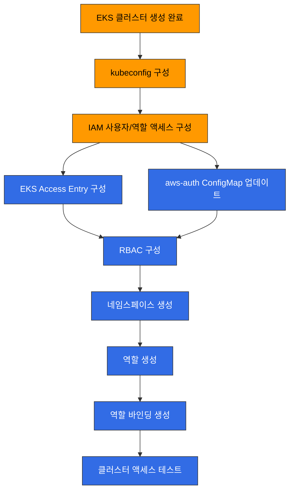
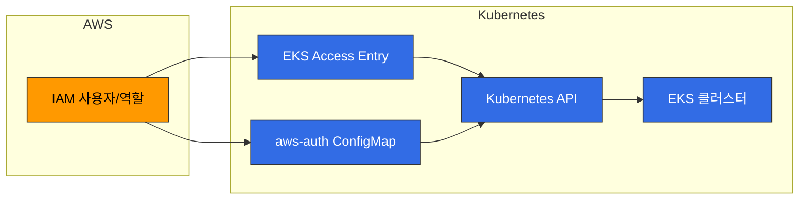
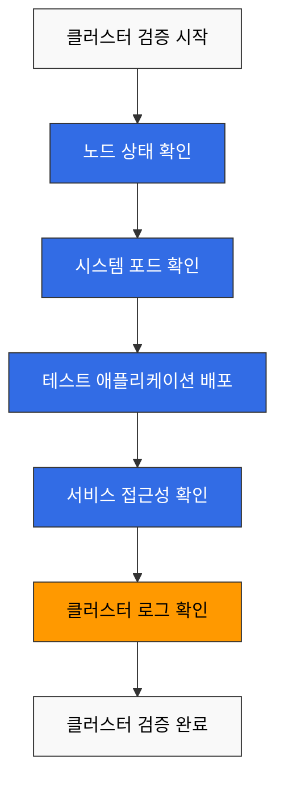
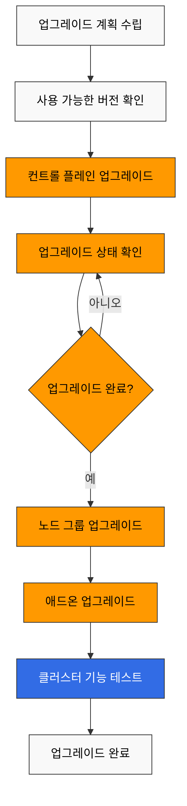
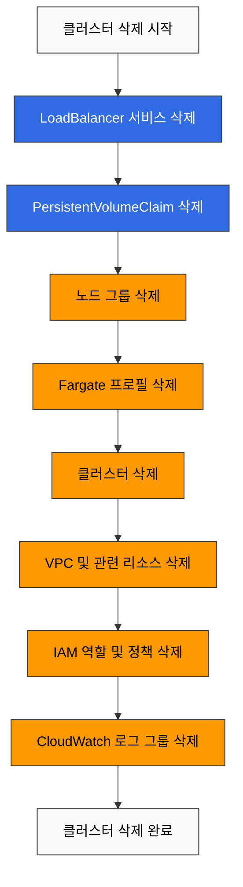

# EKS 클러스터 생성 - 5부

## 클러스터 액세스 구성

EKS 클러스터를 생성한 후에는 클러스터에 액세스하기 위한 구성이 필요합니다. 이 섹션에서는 클러스터 액세스를 구성하는 방법을 알아보겠습니다.

### 클러스터 액세스 구성 프로세스



### kubeconfig 구성

EKS 클러스터에 액세스하려면 kubeconfig 파일을 구성해야 합니다. AWS CLI를 사용하여 kubeconfig를 구성할 수 있습니다:

```bash
aws eks update-kubeconfig \
  --name my-cluster \
  --region us-west-2
```

이 명령은 `~/.kube/config` 파일을 업데이트하여 EKS 클러스터에 액세스할 수 있도록 합니다.

### IAM 사용자 및 역할 액세스 구성

기본적으로 EKS 클러스터를 생성한 IAM 엔터티(사용자 또는 역할)만 클러스터에 액세스할 수 있습니다. 다른 IAM 사용자 또는 역할에 클러스터 액세스 권한을 부여하는 방법에는 두 가지가 있습니다: 전통적인 aws-auth ConfigMap 방식과 새로운 EKS Access Entry 방식입니다.



#### 방법 1: EKS Access Entry (권장)

EKS Access Entry는 aws-auth ConfigMap을 대체하는 새로운 방식으로, 더 안정적이고 관리하기 쉬운 방법을 제공합니다.

1. 클러스터에 대한 Access Entry 활성화:

```bash
aws eks update-cluster-config \
  --name my-cluster \
  --region us-west-2 \
  --access-config authenticationMode=API_AND_CONFIG_MAP
```

2. IAM 역할에 대한 Access Entry 생성:

```bash
aws eks create-access-entry \
  --cluster-name my-cluster \
  --principal-arn arn:aws:iam::123456789012:role/MyRole \
  --username my-role \
  --kubernetes-groups system:masters
```

3. IAM 사용자에 대한 Access Entry 생성:

```bash
aws eks create-access-entry \
  --cluster-name my-cluster \
  --principal-arn arn:aws:iam::123456789012:user/my-user \
  --username my-user \
  --kubernetes-groups system:masters
```

4. Access Entry 목록 조회:

```bash
aws eks list-access-entries --cluster-name my-cluster
```

5. Access Entry 세부 정보 조회:

```bash
aws eks describe-access-entry \
  --cluster-name my-cluster \
  --principal-arn arn:aws:iam::123456789012:user/my-user
```

#### 방법 2: aws-auth ConfigMap (레거시)

aws-auth ConfigMap은 전통적인 방식으로, 여전히 지원되지만 새로운 클러스터에서는 Access Entry 사용을 권장합니다.

1. 현재 `aws-auth` ConfigMap 가져오기:

```bash
kubectl get configmap aws-auth -n kube-system -o yaml > aws-auth.yaml
```

2. `aws-auth.yaml` 파일을 편집하여 사용자 또는 역할을 추가합니다:

```yaml
apiVersion: v1
kind: ConfigMap
metadata:
  name: aws-auth
  namespace: kube-system
data:
  mapRoles: |
    - rolearn: arn:aws:iam::123456789012:role/EKSNodeRole
      username: system:node:{{EC2PrivateDNSName}}
      groups:
        - system:bootstrappers
        - system:nodes
    # 추가 역할
    - rolearn: arn:aws:iam::123456789012:role/MyRole
      username: my-role
      groups:
        - system:masters
  mapUsers: |
    # IAM 사용자
    - userarn: arn:aws:iam::123456789012:user/my-user
      username: my-user
      groups:
        - system:masters
```

3. 업데이트된 ConfigMap 적용:

```bash
kubectl apply -f aws-auth.yaml
```

> **참고**: EKS Access Entry는 2023년에 도입된 기능으로, 새로운 클러스터에서는 Access Entry 사용을 권장합니다. 기존 클러스터는 두 방식을 모두 지원하는 하이브리드 모드로 마이그레이션할 수 있습니다.

### RBAC 구성

Kubernetes 역할 기반 액세스 제어(RBAC)를 사용하여 클러스터 내 리소스에 대한 액세스를 제어할 수 있습니다.

1. 네임스페이스 생성:

```bash
kubectl create namespace dev
```

2. 역할 생성:

```yaml
# role.yaml
apiVersion: rbac.authorization.k8s.io/v1
kind: Role
metadata:
  namespace: dev
  name: developer
rules:
- apiGroups: [""]
  resources: ["pods", "services", "configmaps", "secrets"]
  verbs: ["get", "list", "watch", "create", "update", "patch", "delete"]
- apiGroups: ["apps"]
  resources: ["deployments", "statefulsets", "daemonsets"]
  verbs: ["get", "list", "watch", "create", "update", "patch", "delete"]
```

```bash
kubectl apply -f role.yaml
```

3. 역할 바인딩 생성:

```yaml
# rolebinding.yaml
apiVersion: rbac.authorization.k8s.io/v1
kind: RoleBinding
metadata:
  name: developer-binding
  namespace: dev
subjects:
- kind: User
  name: my-user
  apiGroup: rbac.authorization.k8s.io
roleRef:
  kind: Role
  name: developer
  apiGroup: rbac.authorization.k8s.io
```

```bash
kubectl apply -f rolebinding.yaml
```

## 클러스터 검증

EKS 클러스터를 생성한 후에는 클러스터가 올바르게 작동하는지 확인해야 합니다. 이 섹션에서는 클러스터를 검증하는 방법을 알아보겠습니다.

### 클러스터 검증 프로세스



### 노드 확인

클러스터의 노드를 확인합니다:

```bash
kubectl get nodes
```

모든 노드가 `Ready` 상태인지 확인합니다.

### 시스템 포드 확인

kube-system 네임스페이스의 포드를 확인합니다:

```bash
kubectl get pods -n kube-system
```

모든 시스템 포드가 `Running` 상태인지 확인합니다.

### 테스트 애플리케이션 배포

간단한 테스트 애플리케이션을 배포하여 클러스터가 올바르게 작동하는지 확인합니다:

```yaml
# nginx.yaml
apiVersion: apps/v1
kind: Deployment
metadata:
  name: nginx
spec:
  replicas: 3
  selector:
    matchLabels:
      app: nginx
  template:
    metadata:
      labels:
        app: nginx
    spec:
      containers:
      - name: nginx
        image: nginx:latest
        ports:
        - containerPort: 80
---
apiVersion: v1
kind: Service
metadata:
  name: nginx
spec:
  type: LoadBalancer
  ports:
  - port: 80
    targetPort: 80
  selector:
    app: nginx
```

```bash
kubectl apply -f nginx.yaml
```

배포 및 서비스 상태를 확인합니다:

```bash
kubectl get deployments
kubectl get pods
kubectl get services
```

LoadBalancer 서비스의 외부 IP를 사용하여 애플리케이션에 액세스할 수 있는지 확인합니다:

```bash
curl http://<EXTERNAL-IP>
```

### 클러스터 로그 확인

CloudWatch Logs에서 클러스터 로그를 확인합니다:

```bash
aws logs describe-log-groups \
  --log-group-name-prefix /aws/eks/my-cluster
```

## 클러스터 업그레이드

EKS 클러스터를 최신 상태로 유지하려면 정기적으로 업그레이드해야 합니다. 이 섹션에서는 클러스터를 업그레이드하는 방법을 알아보겠습니다.

### 클러스터 업그레이드 프로세스



### 컨트롤 플레인 업그레이드

EKS 컨트롤 플레인을 업그레이드하려면 다음 단계를 따릅니다:

1. 사용 가능한 Kubernetes 버전 확인:

```bash
aws eks describe-addon-versions \
  --kubernetes-version 1.27 \
  --query "addons[].addonVersions[].compatibilities[].clusterVersion"
```

2. 클러스터 업그레이드:

```bash
aws eks update-cluster-version \
  --name my-cluster \
  --kubernetes-version 1.27
```

3. 업그레이드 상태 확인:

```bash
aws eks describe-update \
  --name my-cluster \
  --update-id <UPDATE-ID>
```

### 노드 업그레이드

컨트롤 플레인을 업그레이드한 후에는 노드도 업그레이드해야 합니다:

#### 관리형 노드 그룹 업그레이드

```bash
aws eks update-nodegroup-version \
  --cluster-name my-cluster \
  --nodegroup-name my-nodegroup
```

#### 자체 관리형 노드 업그레이드

자체 관리형 노드의 경우 새 노드 그룹을 생성하고 워크로드를 마이그레이션한 후 이전 노드 그룹을 삭제해야 합니다.

### 애드온 업그레이드

EKS 애드온을 업그레이드하려면 다음 단계를 따릅니다:

1. 사용 가능한 애드온 버전 확인:

```bash
aws eks describe-addon-versions \
  --addon-name vpc-cni \
  --kubernetes-version 1.27
```

2. 애드온 업그레이드:

```bash
aws eks update-addon \
  --cluster-name my-cluster \
  --addon-name vpc-cni \
  --addon-version <VERSION>
```

## 클러스터 삭제

EKS 클러스터가 더 이상 필요하지 않은 경우 삭제하여 비용을 절약할 수 있습니다. 이 섹션에서는 클러스터를 삭제하는 방법을 알아보겠습니다.

### 클러스터 삭제 프로세스



### 리소스 정리

클러스터를 삭제하기 전에 클러스터에서 생성한 모든 리소스를 정리해야 합니다:

1. LoadBalancer 서비스 삭제:

```bash
kubectl get services --all-namespaces -o json | jq -r '.items[] | select(.spec.type == "LoadBalancer") | .metadata.name + " " + .metadata.namespace' | while read name namespace; do
  kubectl delete service $name -n $namespace
done
```

2. PersistentVolumeClaim 삭제:

```bash
kubectl delete pvc --all --all-namespaces
```

### eksctl을 사용한 클러스터 삭제

eksctl을 사용하여 클러스터를 생성한 경우 다음 명령을 사용하여 삭제할 수 있습니다:

```bash
eksctl delete cluster --name my-cluster --region us-west-2
```

### AWS CLI를 사용한 클러스터 삭제

AWS CLI를 사용하여 클러스터를 삭제하려면 다음 단계를 따릅니다:

1. 노드 그룹 삭제:

```bash
aws eks delete-nodegroup \
  --cluster-name my-cluster \
  --nodegroup-name my-nodegroup
```

2. Fargate 프로필 삭제:

```bash
aws eks delete-fargate-profile \
  --cluster-name my-cluster \
  --fargate-profile-name my-fargate-profile
```

3. 클러스터 삭제:

```bash
aws eks delete-cluster \
  --name my-cluster
```

### 관련 리소스 정리

EKS 클러스터를 삭제한 후에도 다음과 같은 관련 리소스가 남아 있을 수 있습니다:

1. VPC 및 관련 리소스:

```bash
aws ec2 delete-vpc --vpc-id vpc-xxxxxxxxxxxxxxxxx
```

2. IAM 역할 및 정책:

```bash
aws iam detach-role-policy \
  --role-name EKSClusterRole \
  --policy-arn arn:aws:iam::aws:policy/AmazonEKSClusterPolicy

aws iam delete-role --role-name EKSClusterRole

aws iam detach-role-policy \
  --role-name EKSNodeRole \
  --policy-arn arn:aws:iam::aws:policy/AmazonEKSWorkerNodePolicy

aws iam detach-role-policy \
  --role-name EKSNodeRole \
  --policy-arn arn:aws:iam::aws:policy/AmazonEKS_CNI_Policy

aws iam detach-role-policy \
  --role-name EKSNodeRole \
  --policy-arn arn:aws:iam::aws:policy/AmazonEC2ContainerRegistryReadOnly

aws iam delete-role --role-name EKSNodeRole
```

3. CloudWatch 로그 그룹:

```bash
aws logs delete-log-group \
  --log-group-name /aws/eks/my-cluster/cluster
```
