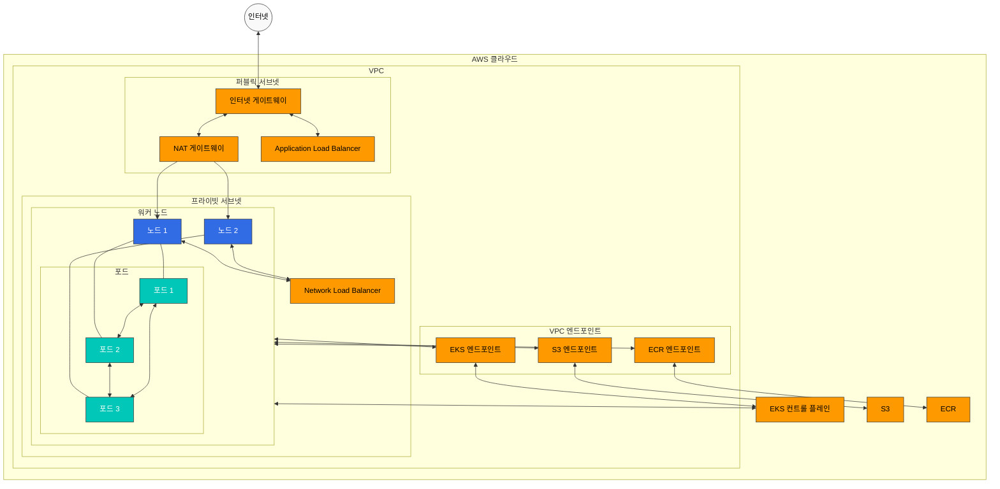
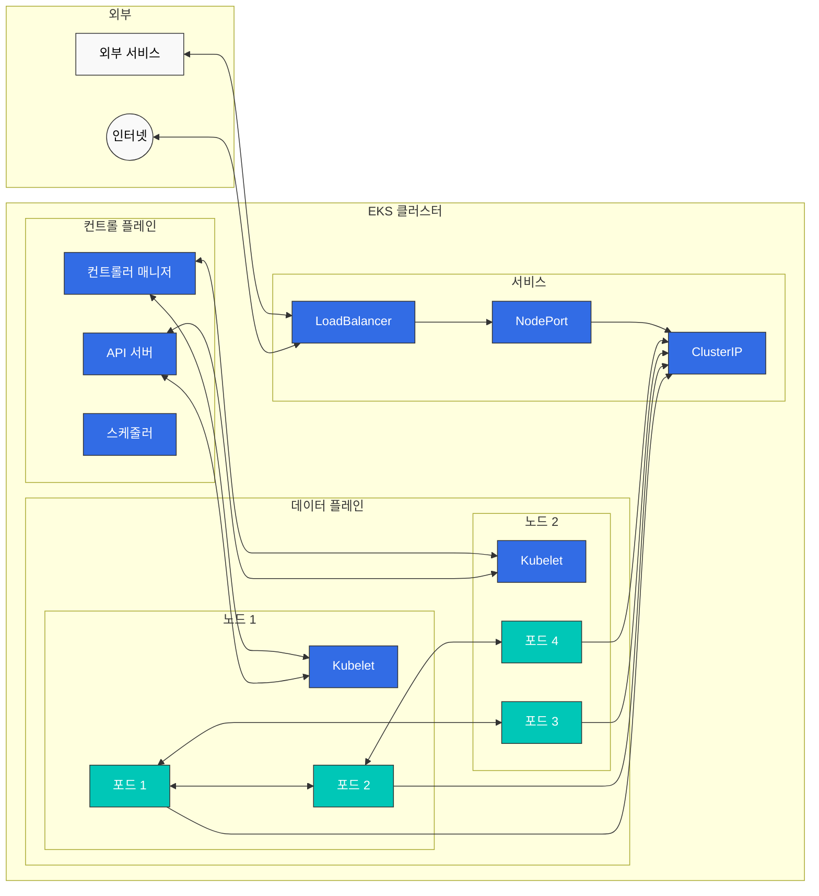
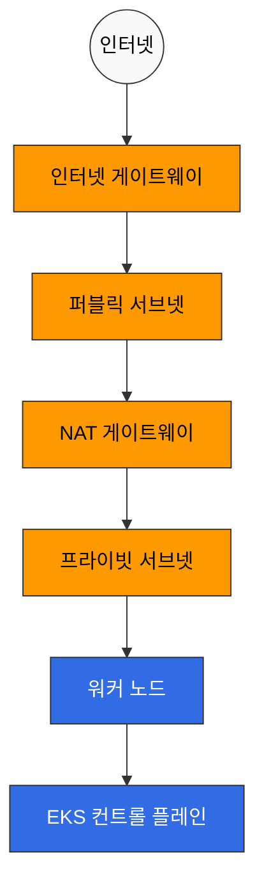
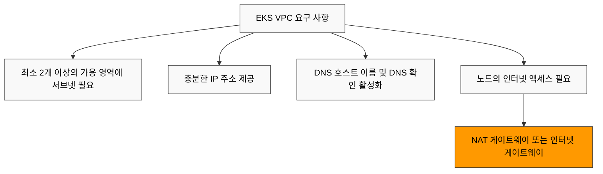
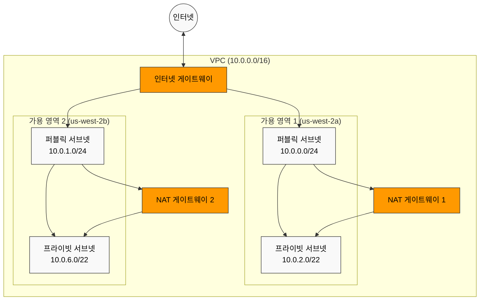
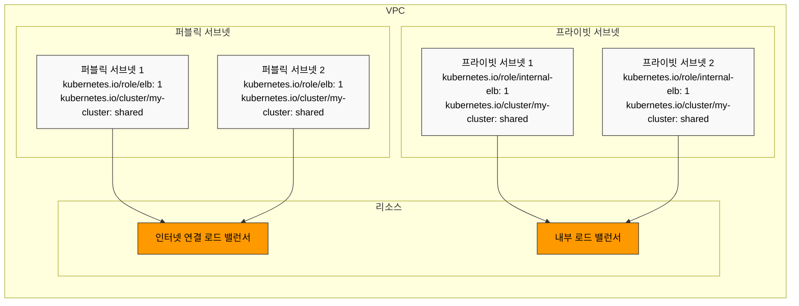
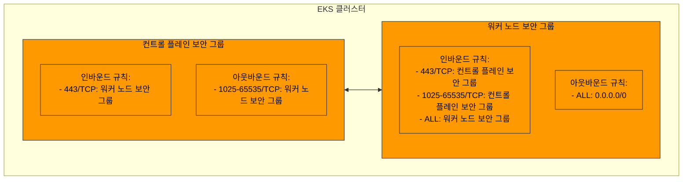

# EKS 네트워킹 - 1부: 기본 개념 및 VPC 구성

## 개요

Amazon EKS의 네트워킹은 Kubernetes 클러스터의 통신을 관리하는 핵심 구성 요소입니다. 이 문서에서는 EKS 네트워킹의 기본 개념, VPC 구성, 서브넷 설계, 보안 그룹 구성 등을 다룹니다.

## EKS 네트워킹 아키텍처

EKS 네트워킹 아키텍처는 다음과 같은 구성 요소로 이루어져 있습니다:



1. **VPC(Virtual Private Cloud)**: EKS 클러스터가 실행되는 격리된 네트워크 환경
2. **서브넷**: VPC 내의 IP 주소 범위를 나누는 단위
3. **라우팅 테이블**: 네트워크 트래픽의 경로를 결정하는 규칙 집합
4. **인터넷 게이트웨이**: VPC와 인터넷 간의 통신을 가능하게 하는 구성 요소
5. **NAT 게이트웨이**: 프라이빗 서브넷의 리소스가 인터넷에 액세스할 수 있게 하는 구성 요소
6. **보안 그룹**: 인스턴스 수준의 가상 방화벽
7. **네트워크 ACL**: 서브넷 수준의 가상 방화벽
8. **CNI(Container Network Interface)**: 컨테이너 네트워킹을 관리하는 플러그인

### EKS 네트워킹 흐름

EKS 클러스터에서 네트워크 트래픽은 다음과 같이 흐릅니다:



1. **포드 간 통신**: 동일한 노드 또는 다른 노드의 포드 간 통신
2. **포드와 서비스 간 통신**: 포드와 클러스터 내 서비스 간 통신
3. **클러스터 내부와 외부 간 통신**: 클러스터 내부 리소스와 외부 리소스 간 통신
4. **컨트롤 플레인과 노드 간 통신**: EKS 컨트롤 플레인과 워커 노드 간 통신

### EKS 네트워킹 구성 요소 간 관계



## VPC 요구 사항

EKS 클러스터를 위한 VPC는 다음 요구 사항을 충족해야 합니다:



1. **서브넷**: 최소 2개 이상의 가용 영역에 서브넷이 있어야 함
2. **IP 주소**: 충분한 수의 IP 주소를 제공해야 함
3. **DNS 호스트 이름**: DNS 호스트 이름 및 DNS 확인이 활성화되어 있어야 함
4. **인터넷 액세스**: 노드가 인터넷에 액세스할 수 있어야 함(NAT 게이트웨이 또는 인터넷 게이트웨이를 통해)

### VPC CIDR 계획

VPC CIDR 블록을 계획할 때 고려해야 할 사항:

```mermaid
flowchart TD
    A[VPC CIDR 계획 고려사항] --> B[클러스터 크기]
    A --> C[IP 주소 요구 사항]
    A --> D[향후 확장]
    A --> E[기존 네트워크와의 통합]
    
    B --> F[소규모: /24 (256개 IP)]
    B --> G[중간 규모: /20 (4,096개 IP)]
    B --> H[대규모: /16 (65,536개 IP)]
    
    %% 클래스 정의
    classDef awsService fill:#FF9900,stroke:#333,stroke-width:1px,color:black;
    classDef k8sComponent fill:#326CE5,stroke:#333,stroke-width:1px,color:white;
    classDef userApp fill:#00C7B7,stroke:#333,stroke-width:1px,color:white;
    classDef dataStore fill:#3B48CC,stroke:#333,stroke-width:1px,color:white;
    classDef default fill:#f9f9f9,stroke:#333,stroke-width:1px,color:black;
    
    %% 클래스 적용
    class A,B,C,D,E,F,G,H default;
```

1. **클러스터 크기**: 예상되는 노드 및 포드 수
2. **IP 주소 요구 사항**: 각 노드 및 포드에 필요한 IP 주소 수
3. **향후 확장**: 향후 확장을 위한 여유 공간
4. **기존 네트워크와의 통합**: 기존 네트워크와의 중복 방지

일반적인 VPC CIDR 블록 크기:
- 소규모 클러스터: /24 (256개 IP 주소)
- 중간 규모 클러스터: /20 (4,096개 IP 주소)
- 대규모 클러스터: /16 (65,536개 IP 주소)

### 서브넷 설계



EKS 클러스터를 위한 서브넷 설계 모범 사례:

1. **퍼블릭 서브넷**: 인터넷 게이트웨이에 직접 연결된 서브넷
   - 용도: 퍼블릭 로드 밸런서, NAT 게이트웨이, 바스티온 호스트
   - 일반적인 크기: /24 (256개 IP 주소)

2. **프라이빗 서브넷**: 인터넷 게이트웨이에 직접 연결되지 않은 서브넷
   - 용도: EKS 워커 노드, 내부 로드 밸런서
   - 일반적인 크기: /22 (1,024개 IP 주소)

3. **가용 영역 분산**: 서브넷을 여러 가용 영역에 분산
   - 최소 2개 이상의 가용 영역 사용
   - 각 가용 영역에 퍼블릭 및 프라이빗 서브넷 배치

예시 서브넷 설계:

| 서브넷 유형 | 가용 영역 | CIDR 블록 | 용도 |
|------------|---------|----------|------|
| 퍼블릭 | us-west-2a | 10.0.0.0/24 | 로드 밸런서, NAT 게이트웨이 |
| 퍼블릭 | us-west-2b | 10.0.1.0/24 | 로드 밸런서, NAT 게이트웨이 |
| 프라이빗 | us-west-2a | 10.0.2.0/22 | EKS 워커 노드 |
| 프라이빗 | us-west-2b | 10.0.6.0/22 | EKS 워커 노드 |

### 서브넷 태그



EKS는 서브넷에 특정 태그를 사용하여 리소스를 자동으로 검색합니다:

1. **퍼블릭 서브넷 태그**:
   - `kubernetes.io/role/elb`: 값을 `1`로 설정하여 인터넷 연결 로드 밸런서에 사용
   - `kubernetes.io/cluster/<cluster-name>`: 값을 `shared` 또는 `owned`로 설정

2. **프라이빗 서브넷 태그**:
   - `kubernetes.io/role/internal-elb`: 값을 `1`로 설정하여 내부 로드 밸런서에 사용
   - `kubernetes.io/cluster/<cluster-name>`: 값을 `shared` 또는 `owned`로 설정

예시:
```bash
aws ec2 create-tags \
  --resources subnet-xxxxxxxxxxxxxxxxx \
  --tags Key=kubernetes.io/cluster/my-cluster,Value=shared Key=kubernetes.io/role/elb,Value=1
```

### 보안 그룹 구성



EKS 클러스터에는 두 가지 주요 보안 그룹이 있습니다:

1. **클러스터 보안 그룹(컨트롤 플레인)**:
   - 인바운드 규칙:
     - 443/TCP: 워커 노드 보안 그룹에서 오는 트래픽 허용
   - 아웃바운드 규칙:
     - 1025-65535/TCP: 워커 노드 보안 그룹으로 가는 트래픽 허용

2. **노드 보안 그룹(워커 노드)**:
   - 인바운드 규칙:
     - 443/TCP: 클러스터 보안 그룹에서 오는 트래픽 허용
     - 1025-65535/TCP: 클러스터 보안 그룹에서 오는 트래픽 허용
     - ALL: 동일한 보안 그룹 내의 트래픽 허용
   - 아웃바운드 규칙:
     - ALL: 모든 대상으로의 트래픽 허용

## 결론

이 문서에서는 EKS 네트워킹의 기본 개념과 VPC 구성에 대해 알아보았습니다. 다음 문서에서는 서비스 및 로드 밸런싱, 네트워크 정책 등 더 고급 네트워킹 주제를 다룰 예정입니다.
