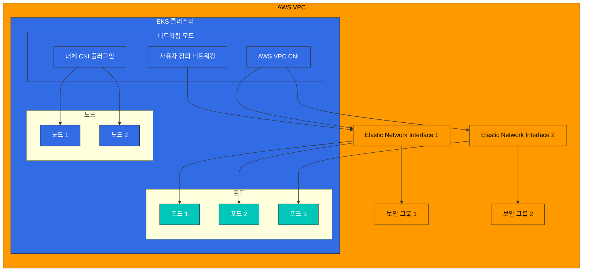
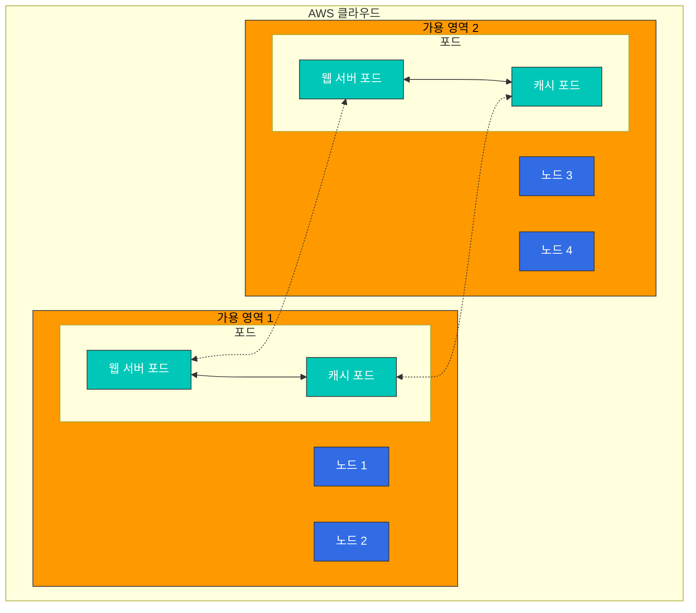
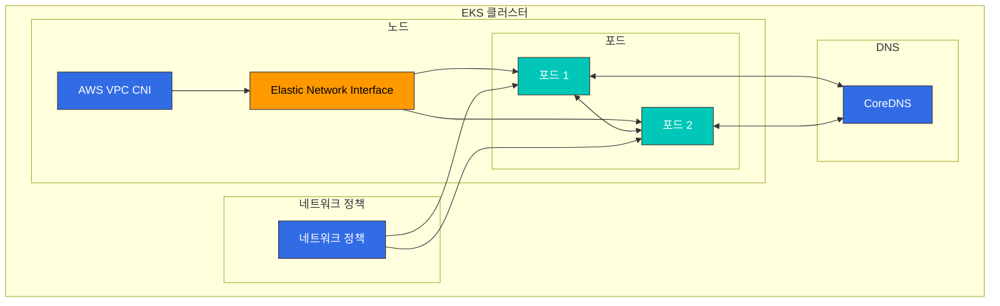
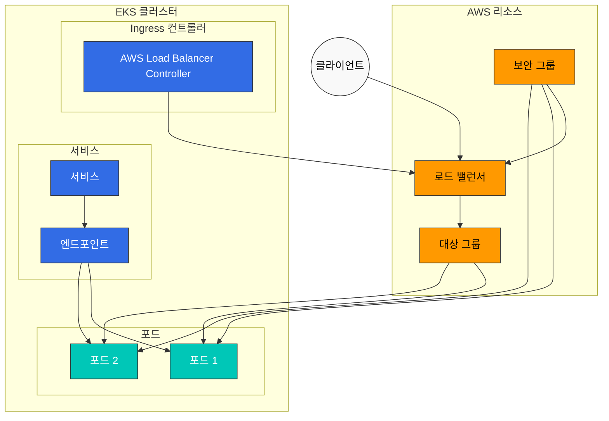

# EKS 네트워킹 - Part 3: 성능 최적화, 문제 해결, 고급 사용 사례

## 개요

이 문서에서는 Amazon EKS 네트워킹의 성능 최적화, 문제 해결 방법, 그리고 고급 사용 사례에 대해 알아보겠습니다. 네트워크 성능을 최적화하는 방법, 일반적인 네트워킹 문제를 해결하는 방법, 그리고 고급 네트워킹 기능을 활용하는 방법을 다룹니다.

## 네트워크 성능 최적화

EKS 클러스터의 네트워크 성능을 최적화하기 위한 여러 전략이 있습니다.

```mermaid
flowchart TD
    A[네트워크 성능 최적화] --> B[인스턴스 유형 선택]
    A --> C[클러스터 네트워킹 모드]
    A --> D[MTU 최적화]
    A --> E[TCP 최적화]
    A --> F[노드 배치 및 지역성]
    A --> G[네트워크 정책 최적화]
    
    B --> B1[향상된 네트워킹 지원 인스턴스]
    B --> B2[네트워크 대역폭]
    B --> B3[Elastic Network Adapter]
    
    C --> C1[AWS VPC CNI]
    C --> C2[사용자 정의 네트워킹]
    C --> C3[대체 CNI 플러그인]
    
    D --> D1[기본 MTU 설정]
    D --> D2[MTU 조정]
    D --> D3[점보 프레임]
    
    E --> E1[TCP 조기 역다중화]
    E --> E2[TCP keepalive 설정]
    E --> E3[TCP 버퍼 크기]
    
    F --> F1[가용 영역 지역성]
    F --> F2[노드 지역성]
    F --> F3[토폴로지 인식 힌트]
    
    G --> G1[정책 수 최소화]
    G --> G2[정책 범위 최적화]
    G --> G3[정책 평가 순서 고려]
    
    %% 클래스 정의
    classDef awsService fill:#FF9900,stroke:#333,stroke-width:1px,color:black;
    classDef k8sComponent fill:#326CE5,stroke:#333,stroke-width:1px,color:white;
    classDef userApp fill:#00C7B7,stroke:#333,stroke-width:1px,color:white;
    classDef dataStore fill:#3B48CC,stroke:#333,stroke-width:1px,color:white;
    classDef default fill:#f9f9f9,stroke:#333,stroke-width:1px,color:black;
    
    %% 클래스 적용
    class A,B,C,D,E,F,G default;
    class B1,B2,B3,C1,C2,C3,D1,D2,D3,E1,E2,E3,F1,F2,F3,G1,G2,G3 default;
```



### 인스턴스 유형 선택

네트워크 성능은 인스턴스 유형에 따라 크게 달라집니다. 네트워크 집약적인 워크로드에는 향상된 네트워킹을 지원하는 인스턴스 유형을 선택하는 것이 좋습니다.

1. **향상된 네트워킹 지원 인스턴스**: 
   - C5, M5, R5 등의 인스턴스 유형은 향상된 네트워킹을 지원합니다.
   - 이러한 인스턴스는 더 높은 대역폭, 낮은 지연 시간, 낮은 지터를 제공합니다.

2. **네트워크 대역폭**:
   - 인스턴스 크기가 클수록 더 높은 네트워크 대역폭을 제공합니다.
   - 예를 들어, m5.large는 최대 10Gbps, m5.24xlarge는 최대 25Gbps의 네트워크 대역폭을 제공합니다.

3. **Elastic Network Adapter(ENA)**:
   - ENA는 최대 100Gbps의 네트워크 대역폭을 지원합니다.
   - 대부분의 최신 인스턴스 유형은 ENA를 지원합니다.

### 클러스터 네트워킹 모드

EKS는 여러 네트워킹 모드를 지원하며, 각 모드는 성능 특성이 다릅니다.



1. **AWS VPC CNI(기본값)**:
   - 포드에 VPC IP 주소를 직접 할당합니다.
   - 네이티브 VPC 네트워킹을 사용하므로 성능이 우수합니다.
   - 각 노드는 할당할 수 있는 IP 주소 수에 제한이 있습니다.

2. **사용자 정의 네트워킹**:
   - 포드에 특정 서브넷의 IP 주소를 할당할 수 있습니다.
   - 보조 CIDR 블록을 사용하여 IP 주소 공간을 확장할 수 있습니다.
   - 네트워크 토폴로지를 더 세밀하게 제어할 수 있습니다.

3. **대체 CNI 플러그인**:
   - Calico, Cilium 등의 대체 CNI 플러그인을 사용할 수 있습니다.
   - 이러한 플러그인은 추가 기능(예: 네트워크 정책, 암호화)을 제공하지만, 성능 오버헤드가 있을 수 있습니다.

### MTU 최적화

MTU(Maximum Transmission Unit)는 네트워크 성능에 영향을 미치는 중요한 요소입니다.

1. **기본 MTU 설정**:
   - AWS VPC CNI의 기본 MTU는 9001입니다.
   - 일부 네트워크 경로는 더 작은 MTU를 요구할 수 있습니다.

2. **MTU 조정**:
   - AWS VPC CNI의 MTU 설정을 조정할 수 있습니다:

```bash
kubectl set env daemonset aws-node -n kube-system ENI_MTU=9001
```

3. **점보 프레임**:
   - 점보 프레임(MTU > 1500)을 사용하면 네트워크 성능이 향상될 수 있습니다.
   - VPC, 서브넷, 보안 그룹, 로드 밸런서 등 모든 네트워크 구성 요소가 점보 프레임을 지원해야 합니다.

### TCP 최적화

TCP 설정을 최적화하여 네트워크 성능을 향상시킬 수 있습니다.

1. **TCP 조기 역다중화**:
   - TCP 조기 역다중화는 성능을 향상시킬 수 있지만, 일부 네트워킹 모드에서는 문제를 일으킬 수 있습니다.
   - 필요한 경우 비활성화할 수 있습니다:

```bash
kubectl set env daemonset aws-node -n kube-system DISABLE_TCP_EARLY_DEMUX=true
```

2. **TCP keepalive 설정**:
   - TCP keepalive 설정을 조정하여 연결 유지 및 재사용을 최적화할 수 있습니다.
   - 이는 특히 많은 수의 짧은 연결을 처리하는 워크로드에 유용합니다.

```bash
# 시스템 수준 TCP keepalive 설정
sysctl -w net.ipv4.tcp_keepalive_time=60
sysctl -w net.ipv4.tcp_keepalive_intvl=15
sysctl -w net.ipv4.tcp_keepalive_probes=6
```

3. **TCP 버퍼 크기**:
   - TCP 버퍼 크기를 조정하여 처리량을 최적화할 수 있습니다.
   - 대역폭 지연 곱(BDP)에 따라 버퍼 크기를 설정하는 것이 좋습니다.

```bash
# 시스템 수준 TCP 버퍼 설정
sysctl -w net.core.rmem_max=16777216
sysctl -w net.core.wmem_max=16777216
sysctl -w net.ipv4.tcp_rmem="4096 87380 16777216"
sysctl -w net.ipv4.tcp_wmem="4096 65536 16777216"
```

### 노드 배치 및 지역성

노드 배치 및 지역성을 최적화하여 네트워크 성능을 향상시킬 수 있습니다.



1. **가용 영역 지역성**:
   - 통신이 빈번한 포드를 같은 가용 영역에 배치하여 지연 시간을 줄입니다.
   - 포드 어피니티 및 안티-어피니티를 사용하여 포드 배치를 제어합니다.

```yaml
apiVersion: apps/v1
kind: Deployment
metadata:
  name: web-server
spec:
  replicas: 3
  selector:
    matchLabels:
      app: web
  template:
    metadata:
      labels:
        app: web
    spec:
      affinity:
        podAffinity:
          preferredDuringSchedulingIgnoredDuringExecution:
          - weight: 100
            podAffinityTerm:
              labelSelector:
                matchExpressions:
                - key: app
                  operator: In
                  values:
                  - cache
              topologyKey: topology.kubernetes.io/zone
```

2. **노드 지역성**:
   - 통신이 빈번한 포드를 같은 노드에 배치하여 네트워크 홉을 줄입니다.
   - 이는 지연 시간에 민감한 애플리케이션에 특히 유용합니다.

```yaml
apiVersion: apps/v1
kind: Deployment
metadata:
  name: web-server
spec:
  replicas: 3
  selector:
    matchLabels:
      app: web
  template:
    metadata:
      labels:
        app: web
    spec:
      affinity:
        podAffinity:
          preferredDuringSchedulingIgnoredDuringExecution:
          - weight: 100
            podAffinityTerm:
              labelSelector:
                matchExpressions:
                - key: app
                  operator: In
                  values:
                  - cache
              topologyKey: kubernetes.io/hostname
```

3. **토폴로지 인식 힌트**:
   - 토폴로지 인식 힌트를 사용하여 서비스 트래픽을 같은 영역 내에서 유지합니다.
   - 이는 가용 영역 간 데이터 전송 비용을 줄이고 지연 시간을 개선합니다.

```yaml
apiVersion: v1
kind: Service
metadata:
  name: my-service
  annotations:
    service.kubernetes.io/topology-aware-hints: "auto"
spec:
  selector:
    app: my-app
  ports:
  - port: 80
    targetPort: 8080
  type: ClusterIP
```

### 네트워크 정책 최적화

네트워크 정책은 보안을 강화하지만, 성능에 영향을 미칠 수 있습니다.

1. **정책 수 최소화**:
   - 필요한 최소한의 네트워크 정책만 적용합니다.
   - 너무 많은 정책은 성능 저하를 일으킬 수 있습니다.

2. **정책 범위 최적화**:
   - 광범위한 정책보다 구체적인 정책을 사용합니다.
   - 레이블 선택기를 사용하여 정책 범위를 제한합니다.

3. **정책 평가 순서 고려**:
   - 네트워크 정책은 누적적으로 평가됩니다.
   - 가장 자주 사용되는 규칙을 먼저 정의하여 평가 성능을 최적화합니다.

## 네트워킹 문제 해결

EKS 클러스터에서 발생할 수 있는 일반적인 네트워킹 문제와 해결 방법을 알아보겠습니다.

```mermaid
flowchart TD
    A[네트워킹 문제 해결] --> B[포드 네트워킹 문제]
    A --> C[서비스 및 로드 밸런싱 문제]
    A --> D[VPC 및 서브넷 문제]
    A --> E[진단 도구 및 기법]
    
    B --> B1[포드 IP 할당 실패]
    B --> B2[포드 간 통신 문제]
    B --> B3[DNS 해결 문제]
    
    C --> C1[서비스 연결 문제]
    C --> C2[로드 밸런서 문제]
    C --> C3[Ingress 문제]
    
    D --> D1[IP 주소 부족]
    D --> D2[라우팅 문제]
    D --> D3[VPC 엔드포인트 문제]
    
    E --> E1[네트워크 진단 포드]
    E --> E2[tcpdump를 사용한 패킷 캡처]
    E --> E3[AWS VPC Flow Logs]
    E --> E4[AWS X-Ray]
    
    %% 클래스 정의
    classDef awsService fill:#FF9900,stroke:#333,stroke-width:1px,color:black;
    classDef k8sComponent fill:#326CE5,stroke:#333,stroke-width:1px,color:white;
    classDef userApp fill:#00C7B7,stroke:#333,stroke-width:1px,color:white;
    classDef dataStore fill:#3B48CC,stroke:#333,stroke-width:1px,color:white;
    classDef default fill:#f9f9f9,stroke:#333,stroke-width:1px,color:black;
    
    %% 클래스 적용
    class A,B,C,D,E default;
    class B1,B2,B3,C1,C2,C3,D1,D2,D3,E1,E2 default;
    class E3,E4 awsService;
```



### 포드 네트워킹 문제



1. **포드 IP 할당 실패**:
   - 증상: 포드가 `ContainerCreating` 상태에 멈춰 있음
   - 원인: 노드에 사용 가능한 IP 주소가 부족함
   - 해결 방법:
     - 노드 상태 확인: `kubectl describe node <node-name>`
     - AWS VPC CNI 로그 확인: `kubectl logs -n kube-system -l k8s-app=aws-node`
     - WARM_IP_TARGET 증가: `kubectl set env daemonset aws-node -n kube-system WARM_IP_TARGET=10`
     - 노드 인스턴스 유형 업그레이드: 더 많은 ENI와 IP 주소를 지원하는 인스턴스 유형으로 변경

2. **포드 간 통신 문제**:
   - 증상: 포드가 다른 포드와 통신할 수 없음
   - 원인: 네트워크 정책, 보안 그룹, 라우팅 문제 등
   - 해결 방법:
     - 네트워크 정책 확인: `kubectl get networkpolicy`
     - 보안 그룹 규칙 확인: AWS 콘솔 또는 AWS CLI 사용
     - 포드 내에서 네트워크 연결 테스트:
     
```bash
kubectl exec -it <pod-name> -- ping <target-pod-ip>
kubectl exec -it <pod-name> -- curl <target-service-name>
kubectl exec -it <pod-name> -- traceroute <target-pod-ip>
```

3. **DNS 해결 문제**:
   - 증상: 포드가 서비스 이름을 해결할 수 없음
   - 원인: CoreDNS 문제, 네트워크 정책, 보안 그룹 등
   - 해결 방법:
     - CoreDNS 포드 상태 확인: `kubectl get pods -n kube-system -l k8s-app=kube-dns`
     - CoreDNS 로그 확인: `kubectl logs -n kube-system -l k8s-app=kube-dns`
     - DNS 구성 확인: `kubectl exec -it <pod-name> -- cat /etc/resolv.conf`
     - DNS 쿼리 테스트:
     
```bash
kubectl exec -it <pod-name> -- nslookup kubernetes.default.svc.cluster.local
kubectl exec -it <pod-name> -- dig kubernetes.default.svc.cluster.local
```

### 서비스 및 로드 밸런싱 문제



1. **서비스 연결 문제**:
   - 증상: 서비스를 통해 포드에 연결할 수 없음
   - 원인: 서비스 선택기, 포드 상태, 엔드포인트 등
   - 해결 방법:
     - 서비스 상태 확인: `kubectl describe service <service-name>`
     - 엔드포인트 확인: `kubectl get endpoints <service-name>`
     - 포드 상태 확인: `kubectl get pods -l <selector-label>`
     - 서비스 DNS 확인: `kubectl exec -it <pod-name> -- nslookup <service-name>`

2. **로드 밸런서 문제**:
   - 증상: 외부에서 로드 밸런서에 연결할 수 없음
   - 원인: 보안 그룹, 서브넷 태그, 상태 확인 등
   - 해결 방법:
     - 로드 밸런서 상태 확인: AWS 콘솔 또는 AWS CLI 사용
     - 보안 그룹 규칙 확인: 인바운드 트래픽 허용 여부
     - 서브넷 태그 확인: 적절한 태그가 있는지 확인
     - 상태 확인 구성 확인: 상태 확인 경로, 포트 등

3. **Ingress 문제**:
   - 증상: Ingress를 통해 서비스에 연결할 수 없음
   - 원인: Ingress 컨트롤러, 주석, 인증서 등
   - 해결 방법:
     - Ingress 상태 확인: `kubectl describe ingress <ingress-name>`
     - Ingress 컨트롤러 로그 확인: `kubectl logs -n kube-system -l app.kubernetes.io/name=aws-load-balancer-controller`
     - ALB 상태 확인: AWS 콘솔 또는 AWS CLI 사용
     - 대상 그룹 상태 확인: 대상이 정상인지 확인

## 퀴즈

이 장에서 배운 내용을 테스트하려면 [주제 퀴즈](../quizzes/eks/03-eks-networking-part3-quiz.md)를 풀어보세요.
