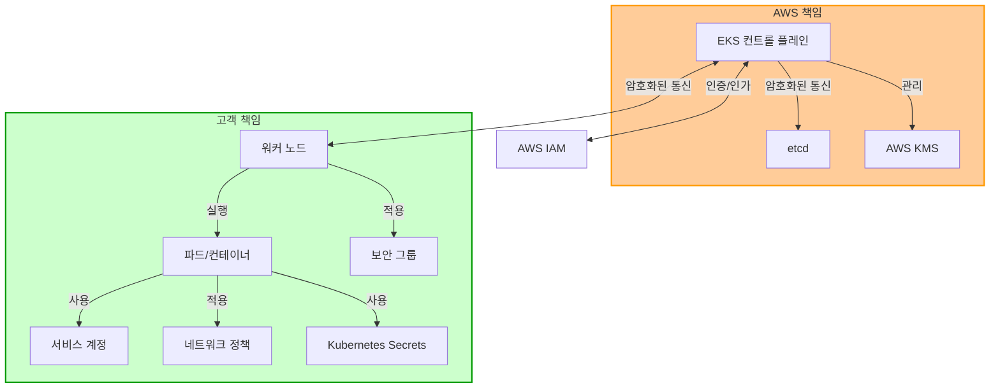
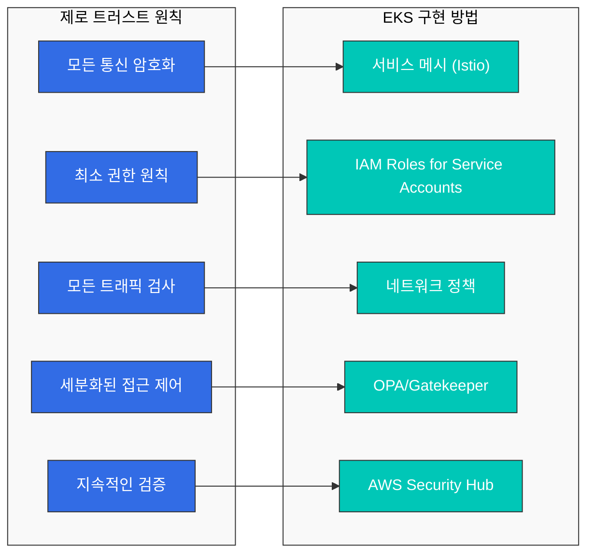
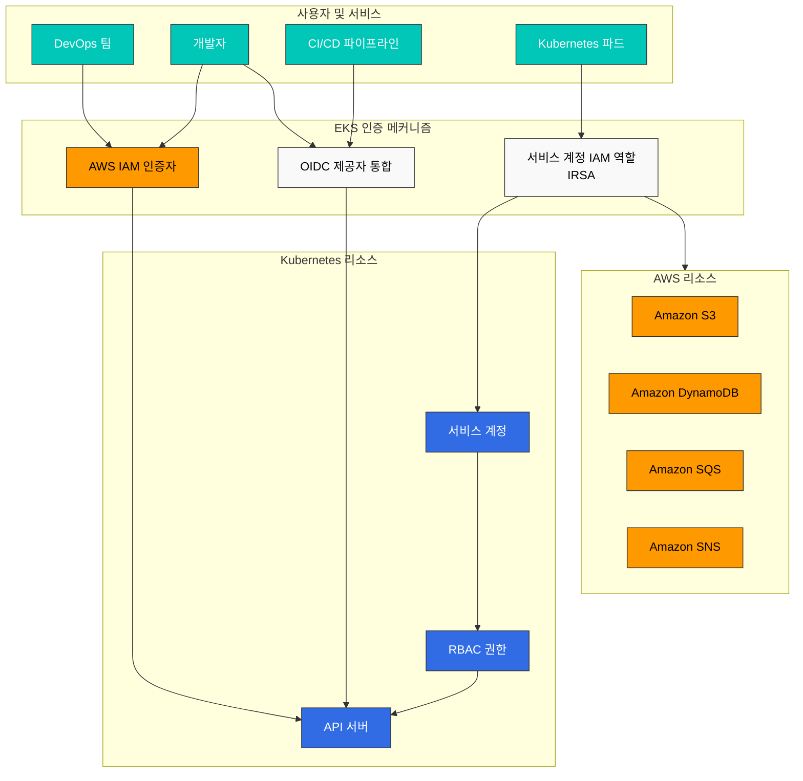
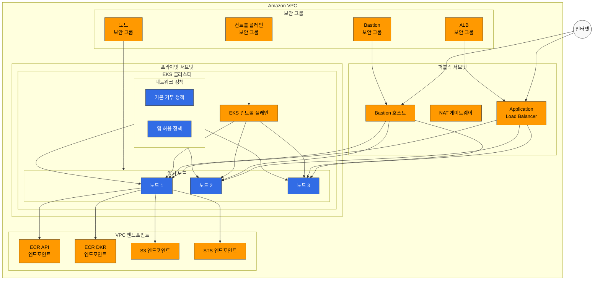
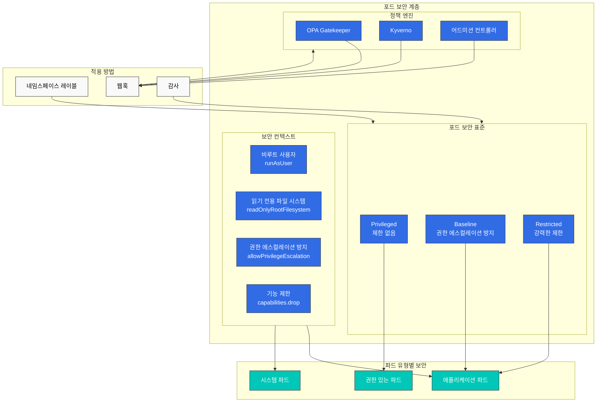
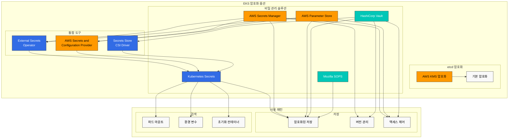
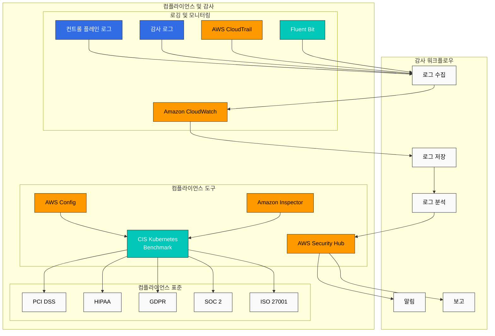
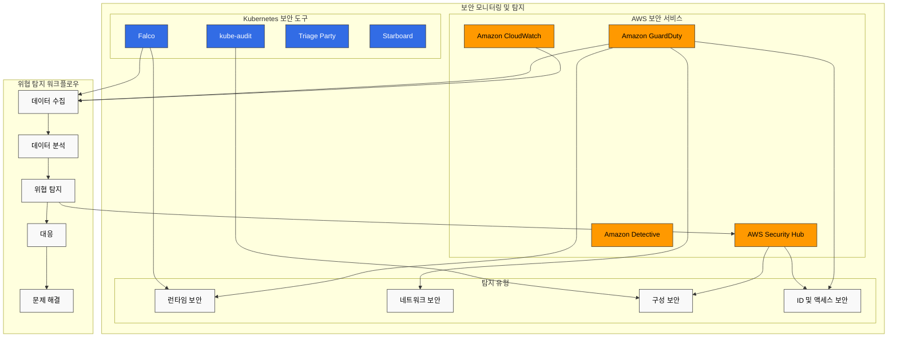
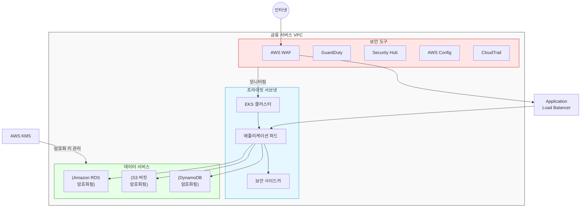

# Amazon EKS 보안

> **지원 버전**: Amazon EKS 1.31, 1.32, 1.33  
> **마지막 업데이트**: 2025년 7월 25일

Amazon EKS(Elastic Kubernetes Service)에서 워크로드를 안전하게 실행하기 위해서는 다양한 보안 계층과 모범 사례를 이해하고 구현해야 합니다. 이 문서에서는 EKS 클러스터의 보안을 강화하기 위한 주요 개념, 구성 요소 및 모범 사례를 다룹니다.

## 목차

1. [EKS 보안 개요](#eks-보안-개요)
2. [최신 보안 트렌드 (2023)](#최신-보안-트렌드-2023)
3. [IAM 및 인증](#iam-및-인증)
4. [네트워크 보안](#네트워크-보안)
5. [포드 보안](#포드-보안)
6. [암호화 및 비밀 관리](#암호화-및-비밀-관리)
7. [컴플라이언스 및 감사](#컴플라이언스-및-감사)
8. [보안 모니터링 및 탐지](#보안-모니터링-및-탐지)
9. [EKS 보안 모범 사례](#eks-보안-모범-사례)
10. [금융 서비스를 위한 EKS 보안 고려사항](#금융-서비스를-위한-eks-보안-고려사항)

## EKS 보안 개요

Amazon EKS는 AWS와 Kubernetes의 보안 기능을 결합하여 다층적인 보안 아키텍처를 제공합니다. EKS 보안은 다음과 같은 주요 영역으로 구성됩니다:

- **공동 책임 모델**: AWS는 EKS 컨트롤 플레인의 보안을 관리하고, 고객은 워커 노드, 컨테이너, 애플리케이션의 보안을 책임집니다.
- **인프라 보안**: VPC, 서브넷, 보안 그룹 등의 네트워크 인프라 보안
- **클러스터 보안**: Kubernetes API 서버 접근 제어, RBAC, 서비스 계정
- **워크로드 보안**: 컨테이너 이미지 보안, 런타임 보안, 네트워크 정책

### EKS 보안 아키텍처



## 최신 보안 트렌드 (2023)

Kubernetes 및 EKS 보안 영역에서의 최신 트렌드와 권장사항은 다음과 같습니다:

### 1. 제로 트러스트 아키텍처 (Zero Trust Architecture)

전통적인 경계 기반 보안 모델에서 벗어나, 모든 접근을 기본적으로 신뢰하지 않고 지속적으로 검증하는 접근 방식입니다.



EKS에서 제로 트러스트 구현:
- **서비스 메시**: Istio 또는 AWS App Mesh를 사용한 서비스 간 mTLS 통신
- **IAM Roles for Service Accounts (IRSA)**: 세분화된 권한 관리
- **네트워크 정책**: 필요한 통신만 허용하는 기본 거부 정책
- **OPA/Gatekeeper**: 정책 기반 접근 제어
- **AWS Security Hub**: 지속적인 보안 상태 모니터링

### 2. 공급망 보안 (Supply Chain Security)

소프트웨어 공급망 공격이 증가함에 따라, 컨테이너 이미지부터 배포까지 전체 파이프라인의 보안이 중요해졌습니다.

주요 구현 방법:
- **SLSA (Supply-chain Levels for Software Artifacts)** 프레임워크 채택
- **이미지 서명 및 검증**: Cosign, Notary v2
- **SBOM (Software Bill of Materials)** 생성 및 관리: Syft, Grype
- **이미지 스캐닝**: Amazon ECR 이미지 스캐닝, Trivy, Clair
- **GitOps 보안**: 서명된 커밋, 보안 파이프라인

### 3. 런타임 보안 및 위협 탐지

컨테이너 런타임 보안이 중요해지면서 다음과 같은 기술이 주목받고 있습니다:

- **eBPF 기반 보안 모니터링**: Cilium, Falco
- **AWS GuardDuty EKS Protection**: 런타임 위협 탐지
- **Kubernetes Audit 로그 분석**: CloudWatch Logs Insights
- **이상 행동 탐지**: Amazon Detective
- **컨테이너 이스케이프 방지**: gVisor, Kata Containers

### 4. 정책 기반 보안 (Policy as Code)

보안 정책을 코드로 관리하여 일관성과 자동화를 향상시키는 접근 방식입니다:

- **OPA (Open Policy Agent)**: 범용 정책 엔진
- **Kyverno**: Kubernetes 네이티브 정책 관리
- **AWS Config**: 규정 준수 모니터링
- **Terraform Sentinel**: IaC 정책 적용
- **AWS CloudFormation Guard**: IaC 정책 검증

## IAM 및 인증

### EKS의 인증 메커니즘

Amazon EKS는 다음과 같은 인증 메커니즘을 제공합니다:

1. **AWS IAM 인증자**: AWS IAM 자격 증명을 사용하여 Kubernetes API 서버에 인증합니다.
2. **OIDC 제공자 통합**: 외부 OIDC 제공자(예: Active Directory, Okta, Auth0)와 통합하여 사용자 인증을 관리합니다.
3. **서비스 계정 IAM 역할**: Kubernetes 서비스 계정에 AWS IAM 역할을 연결하여 파드가 AWS 서비스에 안전하게 액세스할 수 있게 합니다.



### IAM 역할 및 정책 구성

#### EKS 클러스터 역할

EKS 클러스터를 생성할 때 필요한 최소 권한:

```json
{
  "Version": "2012-10-17",
  "Statement": [
    {
      "Effect": "Allow",
      "Action": [
        "eks:CreateCluster",
        "eks:DescribeCluster",
        "eks:UpdateClusterConfig",
        "eks:DeleteCluster"
      ],
      "Resource": "*"
    },
    {
      "Effect": "Allow",
      "Action": "iam:PassRole",
      "Resource": "*",
      "Condition": {
        "StringEquals": {
          "iam:PassedToService": "eks.amazonaws.com"
        }
      }
    }
  ]
}
```

#### EKS Access Entry

EKS Access Entry는 aws-auth ConfigMap을 대체하는 새로운 방식으로, EKS 클러스터에 대한 IAM 사용자 및 역할 액세스를 관리합니다. Access Entry는 다음과 같은 장점을 제공합니다:

- AWS 관리형 솔루션으로 안정성 향상
- 선언적 API를 통한 관리
- 버전 관리 및 감사 기능
- 노드 IAM 역할과 사용자/역할 액세스 관리 분리

```bash
# 클러스터에 대한 Access Entry 활성화
aws eks update-cluster-config \
  --name my-cluster \
  --region us-west-2 \
  --access-config authenticationMode=API_AND_CONFIG_MAP

# IAM 역할에 대한 Access Entry 생성
aws eks create-access-entry \
  --cluster-name my-cluster \
  --principal-arn arn:aws:iam::123456789012:role/DevTeamRole \
  --username dev-team \
  --kubernetes-groups dev-team

# IAM 사용자에 대한 Access Entry 생성
aws eks create-access-entry \
  --cluster-name my-cluster \
  --principal-arn arn:aws:iam::123456789012:user/admin \
  --username admin \
  --kubernetes-groups system:masters

# Access Entry 목록 조회
aws eks list-access-entries --cluster-name my-cluster
```

> **참고**: EKS Access Entry는 2023년에 도입된 기능으로, aws-auth ConfigMap보다 더 안정적이고 관리하기 쉬운 방법을 제공합니다. 기존 클러스터는 두 방식을 모두 지원하는 하이브리드 모드로 마이그레이션할 수 있습니다.

### IRSA(IAM Roles for Service Accounts)

IRSA를 사용하면 Kubernetes 서비스 계정에 AWS IAM 역할을 연결하여 파드가 AWS 서비스에 안전하게 액세스할 수 있습니다.

#### IRSA 설정 단계

1. EKS 클러스터에 OIDC 제공자 생성:

```bash
eksctl utils associate-iam-oidc-provider --cluster my-cluster --approve
```

2. IAM 역할 및 정책 생성:

```bash
eksctl create iamserviceaccount \
  --name s3-reader \
  --namespace default \
  --cluster my-cluster \
  --attach-policy-arn arn:aws:iam::aws:policy/AmazonS3ReadOnlyAccess \
  --approve
```

3. 서비스 계정을 파드에 연결:

```yaml
apiVersion: v1
kind: Pod
metadata:
  name: s3-reader
spec:
  serviceAccountName: s3-reader
  containers:
  - name: app
    image: amazonlinux:2
    command: ['sh', '-c', 'aws s3 ls']
```

## 네트워크 보안

### 보안 그룹

EKS 클러스터의 노드와 파드에 대한 네트워크 트래픽을 제어하기 위해 AWS 보안 그룹을 사용할 수 있습니다.



#### 클러스터 보안 그룹

EKS 클러스터 보안 그룹은 컨트롤 플레인과 워커 노드 간의 통신을 허용합니다:

- 포트 443(HTTPS): 클러스터 API 서버 통신
- 포트 10250: kubelet API
- 포트 범위 1025-65535: 노드 간 통신

#### 노드 보안 그룹

워커 노드에 대한 보안 그룹 권장 구성:

- 인바운드: 클러스터 보안 그룹으로부터의 트래픽 허용
- 아웃바운드: 모든 트래픽 허용(필요에 따라 제한 가능)

### 네트워크 정책

Kubernetes 네트워크 정책을 사용하여 파드 간 통신을 제어할 수 있습니다. EKS에서는 Amazon VPC CNI, Calico, Cilium 등의 네트워크 플러그인을 통해 네트워크 정책을 구현할 수 있습니다.

#### 기본 거부 정책 예시

```yaml
apiVersion: networking.k8s.io/v1
kind: NetworkPolicy
metadata:
  name: default-deny
  namespace: default
spec:
  podSelector: {}
  policyTypes:
  - Ingress
  - Egress
```

#### 특정 애플리케이션 간 통신 허용 정책 예시

```yaml
apiVersion: networking.k8s.io/v1
kind: NetworkPolicy
metadata:
  name: api-allow
  namespace: default
spec:
  podSelector:
    matchLabels:
      app: api
  policyTypes:
  - Ingress
  ingress:
  - from:
    - podSelector:
        matchLabels:
          app: frontend
    ports:
    - protocol: TCP
      port: 8080
```

### VPC 엔드포인트

AWS 서비스에 대한 프라이빗 액세스를 위해 VPC 엔드포인트를 사용하여 인터넷 게이트웨이를 통하지 않고 AWS 서비스에 안전하게 액세스할 수 있습니다.

EKS 클러스터에 권장되는 VPC 엔드포인트:

- com.amazonaws.region.ecr.api
- com.amazonaws.region.ecr.dkr
- com.amazonaws.region.s3
- com.amazonaws.region.logs
- com.amazonaws.region.sts

## 포드 보안

### 포드 보안 표준(PSS)

Kubernetes 1.23부터 도입된 포드 보안 표준은 파드의 보안 컨텍스트를 제한하는 내장 메커니즘을 제공합니다. EKS에서는 다음과 같은 수준의 PSS를 적용할 수 있습니다:

- **Privileged**: 제한 없음
- **Baseline**: 알려진 권한 에스컬레이션 방지
- **Restricted**: 강력한 보안 제한 적용



네임스페이스에 PSS 적용 예시:

```yaml
apiVersion: v1
kind: Namespace
metadata:
  name: secure-ns
  labels:
    pod-security.kubernetes.io/enforce: restricted
    pod-security.kubernetes.io/audit: restricted
    pod-security.kubernetes.io/warn: restricted
```

### 보안 컨텍스트

파드 및 컨테이너 수준에서 보안 컨텍스트를 구성하여 권한을 제한할 수 있습니다:

```yaml
apiVersion: v1
kind: Pod
metadata:
  name: secure-pod
spec:
  securityContext:
    runAsUser: 1000
    runAsGroup: 3000
    fsGroup: 2000
  containers:
  - name: secure-container
    image: nginx
    securityContext:
      allowPrivilegeEscalation: false
      readOnlyRootFilesystem: true
      capabilities:
        drop:
        - ALL
```

### OPA Gatekeeper 및 Kyverno

OPA Gatekeeper 또는 Kyverno와 같은 정책 엔진을 사용하여 클러스터 전체에 보안 정책을 적용할 수 있습니다.

#### Kyverno 정책 예시 - 권한 있는 컨테이너 방지

```yaml
apiVersion: kyverno.io/v1
kind: ClusterPolicy
metadata:
  name: disallow-privileged-containers
spec:
  validationFailureAction: enforce
  rules:
  - name: privileged-containers
    match:
      resources:
        kinds:
        - Pod
    validate:
      message: "Privileged containers are not allowed"
      pattern:
        spec:
          containers:
          - name: "*"
            securityContext:
              privileged: false
```

## 암호화 및 비밀 관리

### EKS 암호화 옵션

#### etcd 암호화

EKS는 기본적으로 etcd에 저장된 Kubernetes 비밀을 암호화합니다. 추가적인 암호화 계층을 위해 AWS KMS를 사용할 수 있습니다:



```bash
eksctl create cluster --name my-cluster --region us-west-2 --encryption-provider-config-key arn:aws:kms:us-west-2:111122223333:key/1234abcd-12ab-34cd-56ef-1234567890ab
```

### AWS Secrets Manager 및 Parameter Store 통합

AWS Secrets Manager 또는 Parameter Store에 저장된 비밀을 Kubernetes 파드에 마운트하기 위해 External Secrets Operator 또는 AWS Secrets and Configuration Provider(ASCP)를 사용할 수 있습니다.

#### External Secrets Operator 설치

```bash
helm repo add external-secrets https://charts.external-secrets.io
helm install external-secrets external-secrets/external-secrets -n external-secrets --create-namespace
```

#### SecretStore 및 ExternalSecret 정의

```yaml
apiVersion: external-secrets.io/v1beta1
kind: SecretStore
metadata:
  name: aws-secretsmanager
spec:
  provider:
    aws:
      service: SecretsManager
      region: us-west-2
      auth:
        jwt:
          serviceAccountRef:
            name: external-secrets-sa
---
apiVersion: external-secrets.io/v1beta1
kind: ExternalSecret
metadata:
  name: db-credentials
spec:
  refreshInterval: 1h
  secretStoreRef:
    name: aws-secretsmanager
    kind: SecretStore
  target:
    name: db-credentials
  data:
  - secretKey: username
    remoteRef:
      key: db-credentials
      property: username
  - secretKey: password
    remoteRef:
      key: db-credentials
      property: password
```

### SOPS(Secrets OPerationS)

Mozilla SOPS를 사용하여 Git 저장소에 암호화된 비밀을 안전하게 저장하고 관리할 수 있습니다.

#### SOPS 설치 및 사용

```bash
# SOPS 설치
brew install sops

# AWS KMS 키를 사용하여 비밀 암호화
sops --encrypt --aws-profile default --kms arn:aws:kms:us-west-2:111122223333:key/1234abcd-12ab-34cd-56ef-1234567890ab secrets.yaml > secrets.enc.yaml

# 암호화된 비밀 복호화
sops --decrypt secrets.enc.yaml
```

## 컴플라이언스 및 감사

### EKS 감사 로깅

EKS 컨트롤 플레인 감사 로그를 활성화하여 클러스터에서 수행된 모든 API 호출을 기록할 수 있습니다:



```bash
aws eks update-cluster-config \
  --region us-west-2 \
  --name my-cluster \
  --logging '{"clusterLogging":[{"types":["api","audit","authenticator","controllerManager","scheduler"],"enabled":true}]}'
```

### AWS Config 규칙

AWS Config를 사용하여 EKS 클러스터의 규정 준수 상태를 모니터링할 수 있습니다:

- eks-cluster-logging-enabled
- eks-cluster-oldest-supported-version
- eks-endpoint-no-public-access
- eks-secrets-encrypted

### AWS Security Hub 통합

AWS Security Hub를 사용하여 EKS 클러스터의 보안 상태를 중앙에서 관리하고 모니터링할 수 있습니다. Security Hub는 CIS Kubernetes Benchmark와 같은 업계 표준에 대한 규정 준수를 확인합니다.

## 보안 모니터링 및 탐지

### GuardDuty EKS Protection

Amazon GuardDuty EKS Protection을 활성화하여 EKS 클러스터에서 잠재적인 보안 위협을 탐지할 수 있습니다:



```bash
aws guardduty update-detector \
  --detector-id 12abc34d567e8fa901bc2d34e56789f0 \
  --features '[{"Name": "EKS_RUNTIME_MONITORING", "Status": "ENABLED"}]'
```

### AWS Security Hub

AWS Security Hub를 사용하여 EKS 클러스터의 보안 상태를 중앙에서 관리하고 모니터링할 수 있습니다:

```bash
aws securityhub enable-security-hub
aws securityhub batch-enable-standards --standards-subscription-requests '[{"StandardsArn":"arn:aws:securityhub:us-west-2::standards/aws-foundational-security-best-practices/v/1.0.0"}]'
```

### Falco

Falco를 사용하여 런타임 보안 모니터링 및 이상 탐지를 수행할 수 있습니다:

```bash
helm repo add falcosecurity https://falcosecurity.github.io/charts
helm install falco falcosecurity/falco --namespace falco --create-namespace
```

Falco 규칙 예시:

```yaml
- rule: Terminal shell in container
  desc: A shell was spawned by a pod in the container
  condition: container and shell_procs and not container_entrypoint
  output: Shell spawned in a container (user=%user.name pod=%k8s.pod.name container=%container.name shell=%proc.name parent=%proc.pname cmdline=%proc.cmdline)
  priority: WARNING
```

## EKS 보안 모범 사례

### 클러스터 보안 강화

1. **최신 Kubernetes 버전 유지**: 정기적으로 EKS 클러스터를 최신 버전으로 업그레이드하여 보안 패치 적용
2. **프라이빗 API 엔드포인트 사용**: 퍼블릭 인터넷에서 API 서버에 대한 액세스 제한
3. **최소 권한 원칙 적용**: IAM 역할 및 RBAC에 최소 권한 원칙 적용
4. **보안 그룹 제한**: 필요한 포트만 허용하도록 보안 그룹 구성
5. **네트워크 정책 구현**: 파드 간 통신을 제한하는 네트워크 정책 적용

### 노드 및 컨테이너 보안

1. **최신 AMI 사용**: 최신 보안 패치가 적용된 EKS 최적화 AMI 사용
2. **컨테이너 이미지 스캔**: ECR 이미지 스캔 또는 Trivy와 같은 도구를 사용하여 취약점 스캔
3. **불변 인프라 사용**: 노드 업데이트 시 새 노드 그룹 생성 및 이전 노드 그룹 삭제
4. **비 루트 사용자로 컨테이너 실행**: 컨테이너를 비 루트 사용자로 실행하여 권한 제한
5. **읽기 전용 파일 시스템 사용**: 가능한 경우 컨테이너의 루트 파일 시스템을 읽기 전용으로 마운트

### 지속적인 보안 모니터링

1. **감사 로깅 활성화**: EKS 컨트롤 플레인 감사 로그 활성화
2. **GuardDuty EKS Protection 활성화**: 런타임 보안 모니터링을 위한 GuardDuty EKS Protection 활성화
3. **Security Hub 통합**: AWS Security Hub를 사용하여 보안 상태 중앙 관리
4. **정기적인 보안 평가**: CIS Kubernetes Benchmark를 기준으로 정기적인 보안 평가 수행
5. **인시던트 대응 계획 수립**: EKS 클러스터에 대한 보안 인시던트 대응 계획 수립 및 테스트

## 금융 서비스를 위한 EKS 보안 고려사항

금융 서비스 산업에서 EKS를 사용할 때 고려해야 할 추가 보안 요구사항:

### 규제 준수

1. **PCI DSS**: 카드 결제 데이터를 처리하는 워크로드에 대한 PCI DSS 요구사항 준수
2. **GDPR/CCPA**: 개인 식별 정보(PII)에 대한 데이터 보호 규정 준수
3. **금융 규제**: 국내 금융 규제 기관의 요구사항 준수(예: 금융감독원 지침)

### 데이터 보안

1. **전송 중 암호화**: TLS 1.2 이상을 사용하여 모든 네트워크 통신 암호화
2. **저장 데이터 암호화**: AWS KMS를 사용하여 저장 데이터 암호화
3. **데이터 분류**: 민감도에 따른 데이터 분류 및 적절한 보안 제어 적용
4. **데이터 액세스 로깅**: 모든 민감한 데이터 액세스에 대한 상세 로깅 및 모니터링

### 고가용성 및 재해 복구

1. **다중 가용 영역 배포**: 여러 가용 영역에 걸쳐 EKS 클러스터 배포
2. **재해 복구 계획**: 정기적인 백업 및 복구 테스트를 포함한 재해 복구 계획 수립
3. **비즈니스 연속성**: 금융 서비스에 적합한 RTO(Recovery Time Objective) 및 RPO(Recovery Point Objective) 정의

### 금융 서비스를 위한 EKS 보안 아키텍처 예시



## 결론

Amazon EKS의 보안은 여러 계층에 걸친 방어 전략을 통해 구현됩니다. IAM 및 RBAC를 통한 강력한 인증 및 권한 부여, 네트워크 정책 및 보안 그룹을 통한 네트워크 보안, 포드 보안 표준 및 보안 컨텍스트를 통한 워크로드 보안, 그리고 AWS의 다양한 보안 서비스와의 통합을 통해 EKS 클러스터를 안전하게 운영할 수 있습니다.

특히 금융 서비스와 같은 규제가 엄격한 산업에서는 추가적인 보안 제어 및 규정 준수 요구사항을 고려해야 합니다. 정기적인 보안 평가, 취약점 스캔, 그리고 지속적인 모니터링을 통해 EKS 환경의 보안 상태를 유지하는 것이 중요합니다.

## 참고 자료

- [Amazon EKS 보안 모범 사례](https://aws.github.io/aws-eks-best-practices/security/docs/)
- [Kubernetes 보안 모범 사례](https://kubernetes.io/docs/concepts/security/overview/)
- [CIS Kubernetes Benchmark](https://www.cisecurity.org/benchmark/kubernetes)
- [AWS Security Hub](https://aws.amazon.com/security-hub/)
- [Amazon GuardDuty](https://aws.amazon.com/guardduty/)

## 퀴즈

이 장에서 배운 내용을 테스트하려면 [주제 퀴즈](../../quizzes/eks/05-eks-security-quiz.md)를 풀어보세요.
