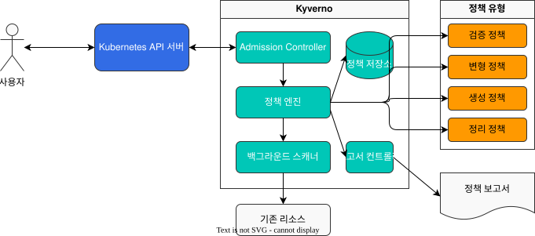

# Policy Management with Kyverno

> **Supported Versions**: Kubernetes 1.31, 1.32, 1.33
> **Last Updated**: November 24, 2025

Kyverno is a Kubernetes-native policy engine used to manage and enforce policies within clusters. In this chapter, we will learn how to manage policies in EKS clusters using Kyverno.

## Lab Environment Setup

To follow along with the examples in this document, you will need the following tools and environment:

### Required Tools
- kubectl v1.31 or higher
- Helm v3.10 or higher
- A working Kubernetes cluster (EKS, minikube, kind, etc.)

### Installing Kyverno

```bash
# Add Helm repository
helm repo add kyverno https://kyverno.github.io/kyverno/

# Update Helm repository
helm repo update

# Install Kyverno
helm install kyverno kyverno/kyverno -n kyverno --create-namespace
```

## Introduction to Kyverno

Kyverno is a policy engine that allows you to define and manage policies as Kubernetes resources. Kyverno provides the following capabilities:

1. **Validate**: Verify that resources comply with policies.
2. **Mutate**: Automatically modify resources.
3. **Generate**: Automatically create related resources.
4. **Clean up**: Automatically delete resources that are no longer needed.

> **Key Concept**: Kyverno uses a Kubernetes-native approach, so there's no need to learn a separate language or tool. Policies are defined as Kubernetes resources and can be managed using kubectl.

### Kyverno Architecture and How It Works



### Kyverno vs OPA Gatekeeper

Kyverno and OPA Gatekeeper are both tools for Kubernetes policy management, but there are some important differences:

| Feature | Kyverno | OPA Gatekeeper |
|---------|---------|----------------|
| Policy Language | Kubernetes YAML | Rego (dedicated language) |
| Learning Curve | Low (familiar to Kubernetes users) | High (requires learning Rego) |
| Mutation Policies | Native support | Limited support |
| Resource Generation | Supported | Not supported |
| Image Verification | Native support | Requires custom implementation |
| Policy Exceptions | Simple | Complex |
| Performance | Good | Very good (for large clusters) |

Kyverno operates as a Kubernetes Admission Controller, intercepting all requests to the API server and performing validation, mutation, generation, or cleanup operations according to defined policies. It also verifies policy compliance for existing resources through a background scanner and reports policy violations through a reporting controller.

## Installing Kyverno

### Installation Using Helm

Here's how to install Kyverno using Helm:

```bash
# Add Helm repository
helm repo add kyverno https://kyverno.github.io/kyverno/
helm repo update

# Install Kyverno
helm install kyverno kyverno/kyverno --namespace kyverno --create-namespace
```

### Installation Using YAML Manifests

Here's how to install Kyverno using YAML manifests:

```bash
# Create namespace
kubectl create namespace kyverno

# Install Kyverno
kubectl apply -f https://github.com/kyverno/kyverno/releases/download/v1.10.0/install.yaml
```

## Policy Types

Kyverno supports the following policy types:

### 1. Validation Policies

Validation policies verify that resources meet specific conditions. If conditions are not met, resource creation or update is rejected.

Example: A policy that ensures all pods have resource limits set

```yaml
apiVersion: kyverno.io/v1
kind: ClusterPolicy
metadata:
  name: require-resource-limits
spec:
  validationFailureAction: enforce
  rules:
  - name: check-resource-limits
    match:
      resources:
        kinds:
        - Pod
    validate:
      message: "Resource limits are required for all containers."
      pattern:
        spec:
          containers:
          - resources:
              limits:
                memory: "?*"
                cpu: "?*"
```

### 2. Mutation Policies

Mutation policies automatically modify resources. This allows you to set default values or add specific fields.

Example: A policy that adds default labels to all pods

```yaml
apiVersion: kyverno.io/v1
kind: ClusterPolicy
metadata:
  name: add-default-labels
spec:
  rules:
  - name: add-labels
    match:
      resources:
        kinds:
        - Pod
    mutate:
      patchStrategicMerge:
        metadata:
          labels:
            environment: "{{request.namespace}}"
            app.kubernetes.io/managed-by: kyverno
```

### 3. Generation Policies

Generation policies automatically create related resources when a resource is created.

Example: A policy that automatically creates a NetworkPolicy when a namespace is created

```yaml
apiVersion: kyverno.io/v1
kind: ClusterPolicy
metadata:
  name: generate-networkpolicy
spec:
  rules:
  - name: generate-default-networkpolicy
    match:
      resources:
        kinds:
        - Namespace
    generate:
      kind: NetworkPolicy
      name: default-deny-all
      namespace: "{{request.object.metadata.name}}"
      data:
        spec:
          podSelector: {}
          policyTypes:
          - Ingress
          - Egress
```

## Kyverno Use Cases in EKS

Using Kyverno in EKS clusters allows you to apply policies across various aspects including security, cost optimization, and compliance.

### EKS and Kyverno Integration Architecture

The following diagram shows how Kyverno integrates and operates within an EKS cluster:


In this architecture, Kyverno operates as an Admission Webhook within the EKS cluster, intercepting all requests to the API server and processing them according to defined policies. Policy violations can be sent to CloudWatch for monitoring and alerting.

### 1. Security Hardening

#### Preventing Privileged Containers

```yaml
apiVersion: kyverno.io/v1
kind: ClusterPolicy
metadata:
  name: disallow-privileged-containers
spec:
  validationFailureAction: enforce
  rules:
  - name: privileged-containers
    match:
      resources:
        kinds:
        - Pod
    validate:
      message: "Privileged containers are not allowed."
      pattern:
        spec:
          containers:
          - name: "*"
            securityContext:
              privileged: false
```

#### Preventing Root User Execution

```yaml
apiVersion: kyverno.io/v1
kind: ClusterPolicy
metadata:
  name: disallow-root-user
spec:
  validationFailureAction: enforce
  rules:
  - name: check-runAsNonRoot
    match:
      resources:
        kinds:
        - Pod
    validate:
      message: "Running as root is not allowed. Set runAsNonRoot to true."
      pattern:
        spec:
          containers:
          - securityContext:
              runAsNonRoot: true
```

### 2. Cost Optimization

#### Setting Resource Limits

```yaml
apiVersion: kyverno.io/v1
kind: ClusterPolicy
metadata:
  name: set-default-resources
spec:
  rules:
  - name: set-default-resources
    match:
      resources:
        kinds:
        - Pod
    mutate:
      patchStrategicMerge:
        spec:
          containers:
          - (name): "*"
            resources:
              limits:
                memory: "512Mi"
                cpu: "500m"
              requests:
                memory: "256Mi"
                cpu: "250m"
```

#### Enforcing Specific Instance Types

```yaml
apiVersion: kyverno.io/v1
kind: ClusterPolicy
metadata:
  name: restrict-node-types
spec:
  validationFailureAction: enforce
  rules:
  - name: check-node-type
    match:
      resources:
        kinds:
        - Pod
    validate:
      message: "Pod must be scheduled on approved node types."
      pattern:
        spec:
          nodeSelector:
            node.kubernetes.io/instance-type: "?*"
          affinity:
            nodeAffinity:
              requiredDuringSchedulingIgnoredDuringExecution:
                nodeSelectorTerms:
                - matchExpressions:
                  - key: node.kubernetes.io/instance-type
                    operator: In
                    values:
                    - m5.large
                    - c5.large
                    - r5.large
```

### 3. Compliance

#### Automatic PodDisruptionBudget Generation

```yaml
apiVersion: kyverno.io/v1
kind: ClusterPolicy
metadata:
  name: generate-pdb
spec:
  rules:
  - name: generate-pdb-for-deployment
    match:
      resources:
        kinds:
        - Deployment
    generate:
      kind: PodDisruptionBudget
      name: "{{request.object.metadata.name}}-pdb"
      namespace: "{{request.object.metadata.namespace}}"
      synchronize: true
      data:
        spec:
          minAvailable: 1
          selector:
            matchLabels:
              app: "{{request.object.metadata.labels.app}}"
```

#### Automatic Namespace ResourceQuota Generation

```yaml
apiVersion: kyverno.io/v1
kind: ClusterPolicy
metadata:
  name: generate-resourcequota
spec:
  rules:
  - name: generate-resourcequota
    match:
      resources:
        kinds:
        - Namespace
    generate:
      kind: ResourceQuota
      name: default-resourcequota
      namespace: "{{request.object.metadata.name}}"
      synchronize: true
      data:
        spec:
          hard:
            requests.cpu: "10"
            requests.memory: 10Gi
            limits.cpu: "20"
            limits.memory: 20Gi
            pods: "50"
```

## Policy Testing and Validation

Kyverno provides tools for testing and validating policies.

### Policy Application Workflow

The following diagram shows the typical development and application workflow for Kyverno policies:


### Policy Simulation

You can simulate policies using the `kyverno test` command:

```bash
# Install Kyverno CLI
curl -LO https://github.com/kyverno/kyverno/releases/download/v1.10.0/kyverno-cli_v1.10.0_linux_x86_64.tar.gz
tar -xvf kyverno-cli_v1.10.0_linux_x86_64.tar.gz
sudo mv kyverno /usr/local/bin/

# Test policy
kyverno test ./policy.yaml --resource=./resource.yaml
```

### Policy Validation

You can validate policies using the `kubectl kyverno` plugin:

```bash
# Install kubectl kyverno plugin
kubectl krew install kyverno

# Validate policy
kubectl kyverno apply ./policy.yaml --cluster
```

## Policy Monitoring and Reporting

Kyverno provides tools for monitoring and reporting policy violations.

### Policy Reports

Kyverno creates the following report resources:

1. **ClusterPolicyReport**: Reports cluster-level policy violations.
2. **PolicyReport**: Reports namespace-level policy violations.

```bash
# View cluster policy reports
kubectl get clusterpolicyreport

# View namespace policy reports
kubectl get policyreport -n <namespace>
```

### Prometheus Metrics

Kyverno provides Prometheus metrics for monitoring policy violations:

```yaml
apiVersion: v1
kind: Service
metadata:
  name: kyverno-svc-metrics
  namespace: kyverno
  labels:
    app: kyverno
spec:
  ports:
  - port: 8000
    targetPort: 8000
    name: metrics
  selector:
    app: kyverno
---
apiVersion: monitoring.coreos.com/v1
kind: ServiceMonitor
metadata:
  name: kyverno-svc-metrics
  namespace: monitoring
  labels:
    release: prometheus
spec:
  selector:
    matchLabels:
      app: kyverno
  endpoints:
  - port: metrics
```

## Best Practices

### 1. Gradual Rollout

When introducing new policies, it's recommended to first set `validationFailureAction: audit` mode to monitor violations, then switch to `enforce` mode when ready.

```yaml
apiVersion: kyverno.io/v1
kind: ClusterPolicy
metadata:
  name: require-resource-limits
spec:
  validationFailureAction: audit  # Start with audit mode first
  rules:
  - name: check-resource-limits
    match:
      resources:
        kinds:
        - Pod
    validate:
      message: "Resource limits are required for all containers."
      pattern:
        spec:
          containers:
          - resources:
              limits:
                memory: "?*"
                cpu: "?*"
```

### 2. Exception Handling

To handle exceptions for specific namespaces or resources, use the `exclude` section:

```yaml
apiVersion: kyverno.io/v1
kind: ClusterPolicy
metadata:
  name: require-resource-limits
spec:
  validationFailureAction: enforce
  rules:
  - name: check-resource-limits
    match:
      resources:
        kinds:
        - Pod
    exclude:
      resources:
        namespaces:
        - kube-system
        - kyverno
    validate:
      message: "Resource limits are required for all containers."
      pattern:
        spec:
          containers:
          - resources:
              limits:
                memory: "?*"
                cpu: "?*"
```

### 3. Policy Organization

It's recommended to organize policies by purpose and use clear names:

```
policies/
├── security/
│   ├── disallow-privileged-containers.yaml
│   ├── require-pod-probes.yaml
│   └── restrict-image-registries.yaml
├── cost-optimization/
│   ├── require-resource-limits.yaml
│   └── restrict-node-types.yaml
└── compliance/
    ├── generate-pdb.yaml
    └── generate-resourcequota.yaml
```

## Conclusion

Kyverno is a powerful tool for managing policies using a Kubernetes-native approach. Using Kyverno in EKS clusters allows you to apply policies across various aspects including security, cost optimization, and compliance. It's important to introduce policies gradually, handle exceptions, and organize them well.

## Quiz

To test what you've learned in this chapter, try the [Kyverno Policy Management Quiz](../quizzes/advanced/01-kyverno-policy-management-quiz.md).
