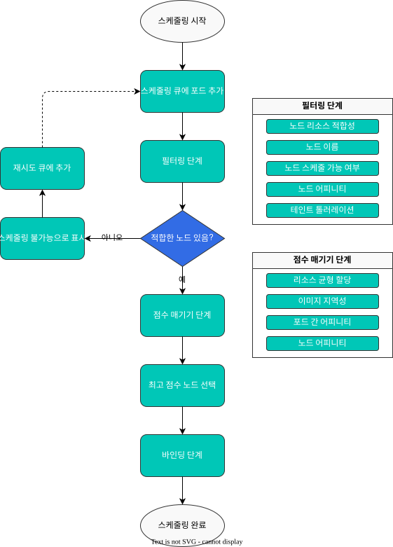
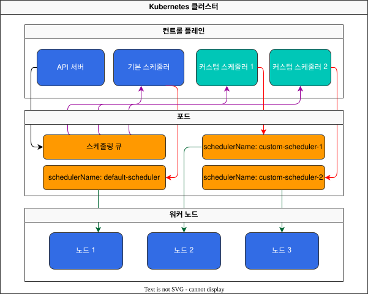
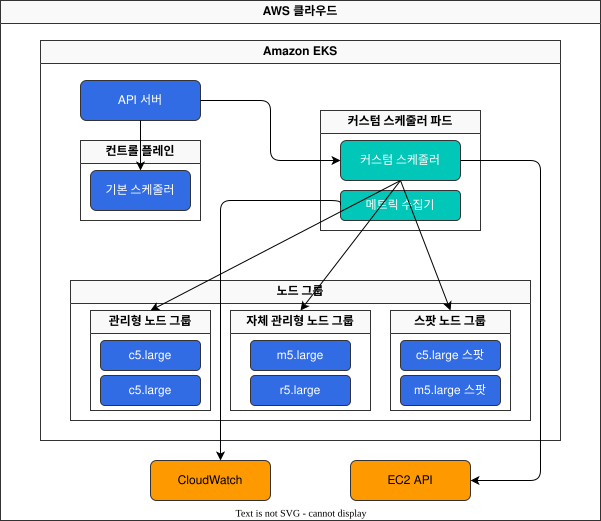

# Part 1: Custom Scheduler Fundamentals

> **Supported Versions**: Kubernetes 1.31, 1.32, 1.33
> **Last Updated**: November 24, 2025

The Kubernetes scheduler is a critical component that decides which node a pod should be placed on. While the default scheduler works well in most cases, you can implement a custom scheduler for specific requirements. In this chapter, we will learn how to implement a custom scheduler in EKS.

## Lab Environment Setup

To follow along with the examples in this document, you will need the following tools and environment:

### Required Tools
- kubectl v1.31 or higher
- Go 1.19 or higher (for custom scheduler development)
- A working Kubernetes cluster (EKS, minikube, kind, etc.)

### Development Environment Setup

```bash
# Go development environment setup
mkdir -p $HOME/go/src/custom-scheduler
cd $HOME/go/src/custom-scheduler

# Initialize Go module
go mod init custom-scheduler

# Install required Kubernetes packages
go get k8s.io/kubernetes@v1.26.0
go get k8s.io/client-go@v0.26.0
go get k8s.io/klog/v2
```

## Scheduling Overview

### Kubernetes Scheduling Process

The Kubernetes scheduling process consists of the following stages:



### Detailed Explanation of Scheduling Stages

1. **Filtering Phase**
   - The stage where suitable nodes for running the pod are identified
   - Each filter plugin determines whether a node can host the pod
   - If any filter fails, that node is excluded from candidates

2. **Scoring Phase**
   - The stage where filtered nodes are assigned scores
   - Each scoring plugin assigns a score between 0-100 to nodes
   - Final scores are calculated by applying weights

3. **Binding Phase**
   - The stage where the pod is assigned to the highest-scoring node
   - Pod-node binding information is updated through the Kubernetes API

## When Custom Schedulers Are Needed

Consider a custom scheduler in the following cases:

1. **Special Hardware Requirements**: GPUs, FPGAs, special network devices, etc.
2. **Complex Workload Placement Rules**: Placing specific workloads on specific node groups
3. **Cost Optimization**: Optimal placement between spot and on-demand instances
4. **Locality Requirements**: Workload placement considering data locality
5. **Multi-Scheduler Scenarios**: Using multiple schedulers for different workload types

### Real-World Use Cases

| Industry | Use Case | Custom Scheduler Benefits |
|----------|----------|---------------------------|
| Finance | High-frequency trading systems | Network topology-aware placement for latency minimization |
| Healthcare | Medical image processing | GPU resource optimization and data locality guarantee |
| Telecommunications | 5G network functions | Proximity guarantee to specific network devices |
| Retail | Seasonal traffic handling | Cost-effective spot instance utilization optimization |
| Media | Video transcoding | CPU/GPU node selection based on workload characteristics |

1. **Filtering**: Identifies nodes where the pod can run. This stage considers resource requirements, node selectors, node affinity, taints and tolerations, etc.
2. **Scoring**: Scores the filtered nodes. This stage considers node resource usage, inter-pod affinity, node affinity, etc.
3. **Binding**: Assigns the pod to the highest-scoring node.

### Limitations of the Default Scheduler

The default scheduler may have the following limitations:

1. **Specific Hardware Requirements**: Advanced scheduling logic may be needed for special hardware like GPUs, FPGAs.
2. **Complex Affinity Rules**: There may be complex placement constraints that are difficult to express with basic affinity rules.
3. **Custom Metrics**: Scheduling may need to be based on custom metrics that the default scheduler doesn't consider.
4. **Domain-Specific Knowledge**: Scheduling logic specialized for specific application domains may be required.

## Custom Scheduler Implementation Methods

There are three main approaches to implementing a custom scheduler:

1. **Multiple Scheduler Approach**: Run a custom scheduler alongside the default scheduler.
2. **Scheduler Extender Approach**: Extend the default scheduler to provide additional filtering and priority functions.
3. **Scheduler Framework Plugins**: Develop plugins using the scheduler framework introduced in Kubernetes 1.15.

### Multiple Scheduler Approach

In the multiple scheduler approach, a custom scheduler runs alongside the default scheduler. When creating a pod, you can specify which scheduler to use with the `schedulerName` field.



#### Custom Scheduler Implementation

You can implement a custom scheduler using the Go language. Here's a simple example:

```go
package main

import (
    "context"
    "fmt"
    "time"

    v1 "k8s.io/api/core/v1"
    metav1 "k8s.io/apimachinery/pkg/apis/meta/v1"
    "k8s.io/client-go/kubernetes"
    "k8s.io/client-go/rest"
)

func main() {
    // Create Kubernetes client
    config, err := rest.InClusterConfig()
    if err != nil {
        panic(err.Error())
    }
    clientset, err := kubernetes.NewForConfig(config)
    if err != nil {
        panic(err.Error())
    }

    // Scheduling loop
    for {
        // Find unscheduled pods
        pods, err := clientset.CoreV1().Pods("").List(context.TODO(), metav1.ListOptions{
            FieldSelector: "spec.schedulerName=custom-scheduler,spec.nodeName=",
        })
        if err != nil {
            fmt.Printf("Error listing pods: %v\n", err)
            time.Sleep(5 * time.Second)
            continue
        }

        // Schedule each pod
        for _, pod := range pods.Items {
            // Select node
            node, err := selectNode(clientset, &pod)
            if err != nil {
                fmt.Printf("Error selecting node for pod %s/%s: %v\n", pod.Namespace, pod.Name, err)
                continue
            }

            // Bind pod to node
            err = bindPod(clientset, &pod, node)
            if err != nil {
                fmt.Printf("Error binding pod %s/%s to node %s: %v\n", pod.Namespace, pod.Name, node, err)
                continue
            }

            fmt.Printf("Successfully scheduled pod %s/%s to node %s\n", pod.Namespace, pod.Name, node)
        }

        time.Sleep(1 * time.Second)
    }
}

// Node selection function
func selectNode(clientset *kubernetes.Clientset, pod *v1.Pod) (string, error) {
    // Get node list
    nodes, err := clientset.CoreV1().Nodes().List(context.TODO(), metav1.ListOptions{})
    if err != nil {
        return "", err
    }

    // Simple example: select the first Ready node
    for _, node := range nodes.Items {
        for _, condition := range node.Status.Conditions {
            if condition.Type == v1.NodeReady && condition.Status == v1.ConditionTrue {
                return node.Name, nil
            }
        }
    }

    return "", fmt.Errorf("no ready nodes available")
}

// Function to bind pod to node
func bindPod(clientset *kubernetes.Clientset, pod *v1.Pod, node string) error {
    binding := &v1.Binding{
        ObjectMeta: metav1.ObjectMeta{
            Name:      pod.Name,
            Namespace: pod.Namespace,
        },
        Target: v1.ObjectReference{
            Kind:       "Node",
            Name:       node,
            APIVersion: "v1",
        },
    }

    return clientset.CoreV1().Pods(pod.Namespace).Bind(context.TODO(), binding, metav1.CreateOptions{})
}
```

#### Custom Scheduler Deployment

Build the custom scheduler as a container image and deploy it to Kubernetes:

```yaml
apiVersion: apps/v1
kind: Deployment
metadata:
  name: custom-scheduler
  namespace: kube-system
spec:
  replicas: 1
  selector:
    matchLabels:
      app: custom-scheduler
  template:
    metadata:
      labels:
        app: custom-scheduler
    spec:
      serviceAccountName: custom-scheduler
      containers:
      - name: custom-scheduler
        image: your-registry/custom-scheduler:latest
        resources:
          requests:
            cpu: "100m"
            memory: "100Mi"
          limits:
            cpu: "200m"
            memory: "200Mi"
---
apiVersion: v1
kind: ServiceAccount
metadata:
  name: custom-scheduler
  namespace: kube-system
---
apiVersion: rbac.authorization.k8s.io/v1
kind: ClusterRole
metadata:
  name: custom-scheduler
rules:
- apiGroups: [""]
  resources: ["pods"]
  verbs: ["get", "list", "watch", "update", "patch"]
- apiGroups: [""]
  resources: ["pods/binding"]
  verbs: ["create"]
- apiGroups: [""]
  resources: ["nodes"]
  verbs: ["get", "list", "watch"]
---
apiVersion: rbac.authorization.k8s.io/v1
kind: ClusterRoleBinding
metadata:
  name: custom-scheduler
subjects:
- kind: ServiceAccount
  name: custom-scheduler
  namespace: kube-system
roleRef:
  kind: ClusterRole
  name: custom-scheduler
  apiGroup: rbac.authorization.k8s.io
```

#### Using the Custom Scheduler

When creating a pod, use the `schedulerName` field to specify the custom scheduler:

```yaml
apiVersion: v1
kind: Pod
metadata:
  name: nginx
spec:
  schedulerName: custom-scheduler
  containers:
  - name: nginx
    image: nginx:latest
```

## Custom Scheduler Implementation in EKS

When implementing a custom scheduler in Amazon EKS, consider the following:

1. **IAM Permissions**: Appropriate IAM permissions are required for the custom scheduler to interact with the EKS cluster.
2. **Node Group Management**: Scheduling logic must account for various node groups (managed, self-managed, Fargate).
3. **Availability Zone Awareness**: Scheduling logic may be needed to maintain balance across availability zones.
4. **Instance Type Awareness**: Scheduling logic may be needed for various instance types.

### EKS Custom Scheduler Architecture

The following diagram shows how to implement a custom scheduler in an EKS cluster:



### EKS-Specific Scheduling Considerations

#### 1. Instance Type-Aware Scheduling

Various instance types can be used in EKS clusters. The custom scheduler can select instance types that match workload characteristics.

```go
// Function to calculate score based on instance type
func scoreNodeByInstanceType(node *v1.Node) int {
    instanceType, exists := node.Labels["node.kubernetes.io/instance-type"]
    if !exists {
        return 0
    }

    // Assign scores to instance types based on workload characteristics
    switch {
    case strings.HasPrefix(instanceType, "c5"):
        return 10  // Compute-optimized instances
    case strings.HasPrefix(instanceType, "m5"):
        return 5   // General-purpose instances
    case strings.HasPrefix(instanceType, "r5"):
        return 3   // Memory-optimized instances
    default:
        return 1
    }
}
```

#### 2. Availability Zone Distribution Scheduling

You can implement scheduling logic to distribute pods across multiple availability zones for high availability in EKS clusters.

```go
// Function to calculate score for availability zone distribution
func scoreNodeByAZ(node *v1.Node, pod *v1.Pod, clientset *kubernetes.Clientset) int {
    // Check node's availability zone
    zone, exists := node.Labels["topology.kubernetes.io/zone"]
    if !exists {
        return 0
    }

    // Query running pods in the current pod's namespace
    pods, err := clientset.CoreV1().Pods(pod.Namespace).List(context.TODO(), metav1.ListOptions{
        FieldSelector: "status.phase=Running",
    })
    if err != nil {
        return 0
    }

    // Calculate the number of pods in each availability zone
    azPodCount := make(map[string]int)
    for _, p := range pods.Items {
        if p.Spec.NodeName == "" {
            continue
        }

        node, err := clientset.CoreV1().Nodes().Get(context.TODO(), p.Spec.NodeName, metav1.GetOptions{})
        if err != nil {
            continue
        }

        if az, exists := node.Labels["topology.kubernetes.io/zone"]; exists {
            azPodCount[az]++
        }
    }

    // Assign higher score to availability zones with fewer pods
    totalAZs := len(azPodCount)
    if totalAZs == 0 {
        return 10
    }

    // Assign higher score if current AZ has fewer pods than average
    totalPods := 0
    for _, count := range azPodCount {
        totalPods += count
    }
    averagePods := float64(totalPods) / float64(totalAZs)

    if float64(azPodCount[zone]) < averagePods {
        return 10
    } else {
        return 5
    }
}
```

#### 3. Spot Instance-Aware Scheduling

You can differentiate between spot and on-demand instances for scheduling to optimize costs.

```go
// Spot instance-aware scheduling function
func scoreNodeByLifecycle(node *v1.Node, pod *v1.Pod) int {
    // Check node's lifecycle
    lifecycle, exists := node.Labels["node.kubernetes.io/lifecycle"]
    if !exists {
        return 5  // Middle score if no lifecycle info
    }

    // Check if pod has specific lifecycle requirements
    if pod.Labels["lifecycle-preference"] == "on-demand" {
        // Prefer on-demand instances
        if lifecycle == "on-demand" {
            return 10
        } else {
            return 1
        }
    } else if pod.Labels["lifecycle-preference"] == "spot" {
        // Prefer spot instances
        if lifecycle == "spot" {
            return 10
        } else {
            return 1
        }
    } else {
        // Default: prefer spot instances for cost optimization
        if lifecycle == "spot" {
            return 8
        } else {
            return 5
        }
    }
}
```

#### 4. GPU Workload Scheduling

You can implement logic to efficiently schedule GPU workloads in EKS clusters.

```go
// GPU workload scheduling function
func scoreNodeByGPU(node *v1.Node, pod *v1.Pod) int {
    // Check pod's GPU request
    gpuRequested := false
    for _, container := range pod.Spec.Containers {
        if _, exists := container.Resources.Requests["nvidia.com/gpu"]; exists {
            gpuRequested = true
            break
        }
    }

    // Check node's GPU availability
    gpuCapacity := 0
    if capacity, exists := node.Status.Capacity["nvidia.com/gpu"]; exists {
        gpuCapacity, _ = capacity.AsInt64()
    }

    // For GPU requests, assign higher score to nodes with GPUs
    if gpuRequested {
        if gpuCapacity > 0 {
            return 10
        } else {
            return 0  // Don't schedule on nodes without GPUs
        }
    } else {
        if gpuCapacity > 0 {
            return 1  // Lower score for non-GPU workloads on GPU nodes
        } else {
            return 5  // Higher score for non-GPU workloads on non-GPU nodes
        }
    }
}
```

## Conclusion

In this chapter, we covered an overview of the Kubernetes scheduling process and how to implement a custom scheduler using the multiple scheduler approach. We also explored considerations for implementing custom schedulers in EKS clusters.

In the next chapter, we will learn about implementing custom schedulers using the scheduler extender approach and scheduler framework plugins.

## Quiz

To test what you've learned in this chapter, try the [Topic Quiz](../quizzes/advanced/02-custom-scheduler-part1-quiz.md).
