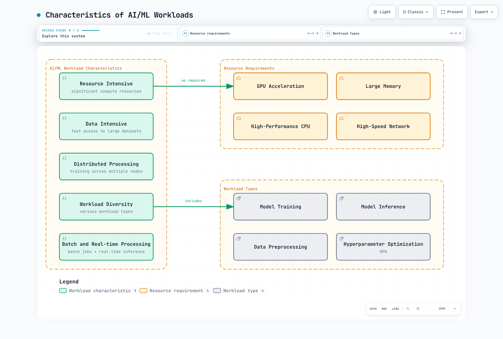
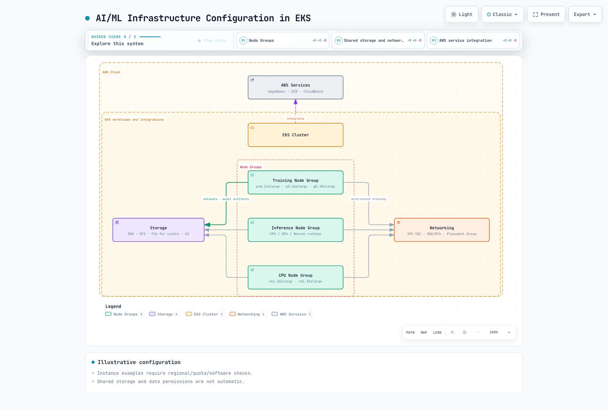
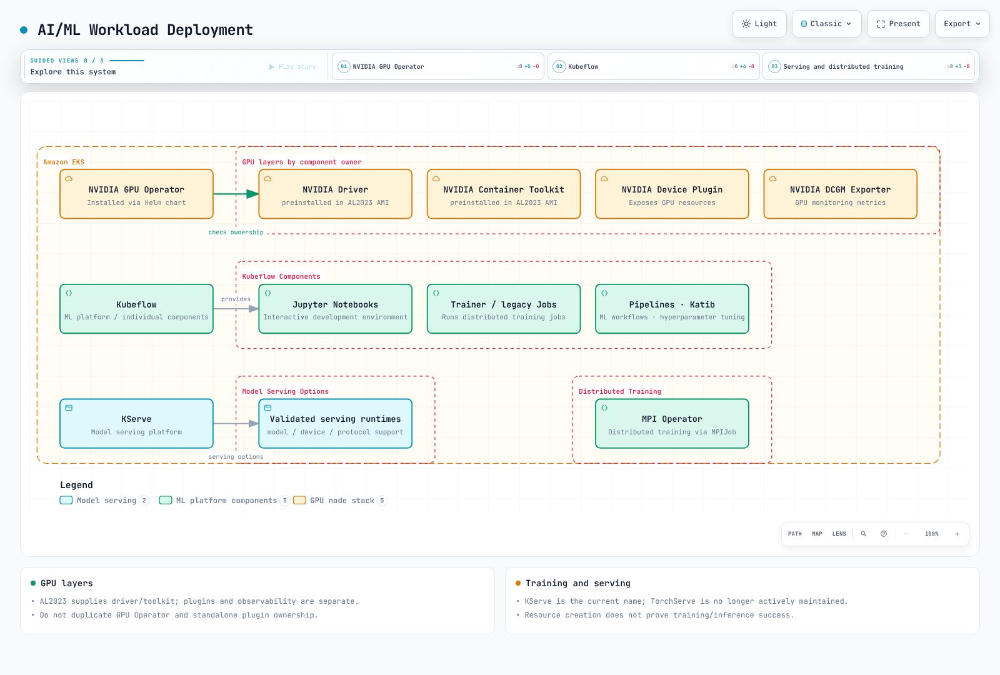

# AI/ML Workloads

> **Review baseline**: GPU Operator 26.7.0 / NVIDIA device plugin 0.20.0 / FSx CSI 1.10.0
> **Last Updated**: September 12, 2026

Kubernetes is a powerful platform for running AI/ML workloads. In this chapter, we will learn how to run AI/ML workloads on EKS and explore best practices.

## Characteristics of AI/ML Workloads

AI/ML workloads have different characteristics compared to typical application workloads:



[🔍 View interactive diagram](https://www.atomai.click/kubernetes-docs/archmaps/en-ai-ml-01-ai-ml-workloads-0.html)

1. **Resource Intensive**: Requires significant computing resources including GPUs, high-performance CPUs, and large memory.
2. **Data Intensive**: Requires fast access to large datasets.
3. **Distributed Processing**: Requires distributed processing across multiple nodes for large-scale model training.
4. **Workload Diversity**: Includes various types of workloads such as training, inference, and data preprocessing.

## Distinctions for AI/ML Design

Verify support against the selected framework, image, device and Kubernetes version:

### 1. Large Language Model (LLM) Deployment

Large Language Models (LLMs) are one of the most prominent technologies in AI recently. Key considerations for efficiently deploying LLMs on Kubernetes:

- **Model Sharding**: Distributing large models across multiple GPUs
- **Precision selection**: Distinguish FP16/BF16 computation from INT8/INT4 quantization and validate accuracy/device support
- **Inference Optimization**: Improving inference performance using vLLM, TensorRT, ONNX Runtime, etc.
- **Scaling Strategy**: Increasing throughput through horizontal scaling

### 2. AI Orchestration Frameworks

Specialized orchestration frameworks for managing AI/ML workloads on Kubernetes:

- **Kubeflow**: Comprehensive platform for machine learning workflows
- **Ray on Kubernetes**: Distributed computing framework
- **KServe**: Inference management with Knative/Standard and other paths
- **Seldon Core**: Model serving and monitoring

### 3. GPU Sharing and Optimization

Technologies for efficiently utilizing GPU resources:

- **MIG (Multi-Instance GPU)**: Partitioning of NVIDIA A100/H100 GPUs
- **Sharing approaches**: MPS and time-slicing differ from each other and from MIG in isolation/support
- **Dynamic Allocation**: Dynamic allocation of GPU resources as needed
- **GPU Operator**: Automating GPU management in Kubernetes

### 4. MLOps and GitOps Integration

Applying DevOps principles for AI/ML lifecycle management:

- **Model Version Control**: Model versioning integrated with Git
- **CI/CD Pipelines**: Automating model training and deployment
- **A/B tests and canaries**: Experimental comparison and gradual rollout have different goals/metrics
- **Monitoring and Feedback Loops**: Model performance monitoring and retraining

### 5. Vector Database Integration

Vector database integration for embeddings and semantic search:

- **Pinecone**: Managed vector search
- **Milvus**: Open-source vector database
- **Faiss**: Facebook AI's efficient similarity search library
- **OpenSearch**: Search engine with vector search capabilities

Batch and online inference have different latency/throughput goals.

## AI/ML Infrastructure Configuration in EKS



[🔍 View interactive diagram](https://www.atomai.click/kubernetes-docs/archmaps/en-ai-ml-01-ai-ml-workloads-1.html)

### Node Type Selection

These are capacity examples, not an exhaustive current catalog or ranking. Check regional availability, quotas, CPU architecture, GPU memory and software compatibility:

1. **GPU Instances**:
   - p4d.24xlarge: 8x NVIDIA A100 GPU, 320GB GPU memory
   - p3.16xlarge: 8x NVIDIA V100 GPU, 128GB GPU memory
   - g5.xlarge~g5.48xlarge: NVIDIA A10G GPU, up to 8 GPUs
   - g4dn.12xlarge: 4 T4 GPUs; g4dn.16xlarge: 1 T4 GPU — size and GPU count do not increase monotonically

2. **CPU Optimized Instances**:
   - c6i.32xlarge: 128 vCPU, 256GB memory
   - c7g.16xlarge: 64 vCPU (AWS Graviton3), 128GB memory

3. **Memory Optimized Instances**:
   - r6i.32xlarge: 128 vCPU, 1024GB memory
   - x2gd.16xlarge: 64 vCPU, 1024GB memory

4. **Inferentia Instances**:
   - inf1.24xlarge: 16 AWS Inferentia chips, 96 vCPU, 192GB memory

5. **Trainium Instances**:
   - trn1.32xlarge: 16 AWS Trainium chips, 128 vCPU, 512GB memory

### Storage Configuration

AI/ML workloads require high-performance storage:

1. **Amazon EBS**:
   - gp3: Default general-purpose SSD storage
   - io2: High-performance SSD storage
   - st1: Throughput-optimized HDD storage

2. **Amazon EFS**:
   - Useful when multiple nodes need access to shared data
   - Performance mode: General Purpose is recommended; previous-generation Max I/O is incompatible with Elastic throughput
   - Throughput modes: Elastic, Provisioned and Bursting — compare workload needs, pricing and limits

3. **Amazon FSx for Lustre**:
   - High-performance parallel file system
   - Provides fast access to large datasets
   - Simplifies data import and export through S3 integration

4. **Amazon S3**:
   - Stores large datasets
   - Stores training data and model artifacts

### Networking Configuration

Networking configuration for distributed training:

1. **Cluster Placement Groups**:
   - Minimizes latency between nodes
   - Places nodes within the same availability zone

2. **Enhanced Networking**:
   - Elastic Network Adapter (ENA)
   - ENA Express
   - Elastic Fabric Adapter (EFA)

3. **VPC CNI Configuration**:
   - IP address management for large-scale pod deployments
   - Secondary IP address range configuration

## AI/ML Workload Deployment



[🔍 View interactive diagram](https://www.atomai.click/kubernetes-docs/archmaps/en-ai-ml-01-ai-ml-workloads-2.html)

### NVIDIA GPU Operator and Device Allocation

EKS AL2023 NVIDIA AMIs already contain drivers and Container Toolkit, so disable their installation by GPU Operator. They do not contain the device plugin/DRA driver, which requires configuration. Bottlerocket NVIDIA AMIs include the device plugin. Avoid installing duplicate owners.

This command **renders locally** the reviewed Operator chart. Inspect ClusterPolicy/RBAC and actual installation requirements before deployment.

```bash
# AL2023 NVIDIA AMI profile: host driver/toolkit are already installed.
helm repo add nvidia https://helm.ngc.nvidia.com/nvidia
helm repo update nvidia
helm template gpu-operator nvidia/gpu-operator \
  --version v26.7.0 --namespace gpu-operator \
  --set driver.enabled=false --set toolkit.enabled=false \
  > gpu-operator.rendered.yaml
```

The NVIDIA extended resource is `nvidia.com/gpu`. Integer limits imply an equal request; if both are specified they must match. `0.5` is not valid GPU allocation. This CUDA 12.8 image is illustrative; verify host-driver/architecture compatibility and pin the image digest before deployment. No GPU execution was performed in this review.

```yaml
apiVersion: v1
kind: Pod
metadata:
  name: gpu-allocation-check
spec:
  restartPolicy: Never
  containers:
    - name: check
      image: nvidia/cuda:12.8.1-base-ubuntu22.04
      command: ["nvidia-smi", "-L"]
      resources:
        requests:
          cpu: "100m"
          memory: 128Mi
        limits:
          memory: 256Mi
          nvidia.com/gpu: 1
```

### Kubeflow and Distributed Training

Use the pinned [26.03.1 installation guide](kubeflow/01-architecture-installation.md) for dependencies, identity and storage instead of a master-branch one-line installation. The serving project is KServe; KFServing is its historical name.

Distributed execution can use [Trainer](kubeflow/05-training-operator.md), legacy TFJob/PyTorchJob or the separate MPI Operator. Distinguish the MPI Operator API from legacy Training Operator by installed CRDs/version. Job controllers create Pods; an MPI launcher or torchrun starts processes.

A single Pod cannot fulfill torchrun --nnodes=2, and an invented Pod DNS name does not provide rendezvous. Supply actual training code/image, worker count, Service/DNS, ranks/backend, data sharding and checkpoint/timeout/retry behavior. Gang scheduling needs separate policy/scheduler support.


[🔍 Interactive diagram](https://www.atomai.click/kubernetes-docs/archmaps/en-ai-ml-01-ai-ml-workloads-3.html)

For NCCL over EFA the path is AWS OFI NCCL plugin → libfabric → EFA. MPI can launch processes without being NCCL's mandatory transport layer. Verify ENA/EFA, GPUDirect, security groups, AMI and libraries separately. Multus/SR-IOV or device hostPath mounts alone do not configure EFA/GPUDirect on EKS.

### Model Serving

Check [KServe](kubeflow/06-kserve.md) Knative/Standard mode, runtime/model format, URI access, protocol and GPU device configuration. A GPU request alone does not enable GPU inference. Triton needs a model repository, backend configuration and readiness validation too.

TorchServe announces no active maintenance or planned security fixes, so it is not a maintained default for new deployments. Do not publish inference, management and metrics ports together through an unauthenticated LoadBalancer. Configure authenticated ingress and appropriate internal management access.


[🔍 Interactive diagram](https://www.atomai.click/kubernetes-docs/archmaps/en-ai-ml-01-ai-ml-workloads-4.html)

## AI/ML Workload Optimization


[🔍 View interactive diagram](https://www.atomai.click/kubernetes-docs/archmaps/en-ai-ml-01-ai-ml-workloads-5.html)

### GPU Sharing and Memory

Time-slicing exposes shared GPU access without memory/fault isolation or proportional performance guarantees. MPS uses a separate control daemon; the reviewed plugin documentation labels support experimental and excludes MIG-enabled devices. A RuntimeClass plus a privileged MPS Pod does not configure sharing across the node.

This is a standalone device-plugin configuration. If GPU Operator owns the plugin, use that owner's configuration path instead.

```yaml
# device-plugin-sharing.yaml: NVIDIA device plugin configuration, not a Pod.
version: v1
sharing:
  timeSlicing:
    renameByDefault: true
    failRequestsGreaterThanOne: true
    resources:
      - name: nvidia.com/gpu
        replicas: 2
```

```bash
# Alternative to an operator-owned plugin; do not install a second owner.
helm repo add nvdp https://nvidia.github.io/k8s-device-plugin
helm repo update nvdp
helm template nvdp nvdp/nvidia-device-plugin \
  --version 0.20.0 --namespace nvidia-device-plugin \
  --set config.default=shared \
  --set-file config.map.shared=device-plugin-sharing.yaml \
  > device-plugin.rendered.yaml
```

This exposes nvidia.com/gpu.shared; Pods request an integer one of that resource. replicas=2 does not guarantee half the GPU memory. Verify selected nodes, allocation and contention on real GPU hardware.

### Placement and Topology

Zone/region annotations do not control Pod placement. Use nodeSelector/affinity against actual node labels; anti-affinity/spread selectors must match Pod labels too. Substitute the actual AZ below. Same-AZ placement, spreading across nodes and gang admission are different constraints.

```yaml
apiVersion: v1
kind: Pod
metadata:
  name: placement-check
  labels:
    app: placement-check
spec:
  restartPolicy: Never
  nodeSelector:
    topology.kubernetes.io/zone: us-west-2a
  affinity:
    podAntiAffinity:
      preferredDuringSchedulingIgnoredDuringExecution:
        - weight: 100
          podAffinityTerm:
            labelSelector:
              matchLabels:
                app: placement-check
            topologyKey: kubernetes.io/hostname
  containers:
    - name: check
      image: python:3.12-slim
      command: ["python", "-c", "print('placement check')"]
      resources:
        requests:
          cpu: "100m"
          memory: 64Mi
        limits:
          cpu: "1"
          memory: 128Mi
```

### Storage and Caching

Static FSx CSI provisioning connects an **existing filesystem** with PV/PVC. Replace filesystem ID, DNS, mount name, capacity and namespace with actual values. Retain avoids automatic filesystem deletion; charges remain until separately cleaned up.

```yaml
apiVersion: v1
kind: PersistentVolume
metadata:
  name: ml-fsx-existing
spec:
  capacity:
    storage: 1200Gi
  volumeMode: Filesystem
  accessModes: [ReadWriteMany]
  storageClassName: ""
  persistentVolumeReclaimPolicy: Retain
  mountOptions: [flock]
  csi:
    driver: fsx.csi.aws.com
    volumeHandle: fs-0123456789abcdef0
    volumeAttributes:
      dnsname: fs-0123456789abcdef0.fsx.us-west-2.amazonaws.com
      mountname: replace-with-actual-mount-name
---
apiVersion: v1
kind: PersistentVolumeClaim
metadata:
  name: ml-dataset
  namespace: ml-workloads
spec:
  accessModes: [ReadWriteMany]
  storageClassName: ""
  volumeName: ml-fsx-existing
  resources:
    requests:
      storage: 1200Gi
```

Dynamic provisioning creates a filesystem from a StorageClass/PVC. Do not put static volumeHandle/DNS settings in the StorageClass or mix in an undefined fsx.aws.k8s.io/Lustre resource. Use the [driver's dynamic example](https://github.com/kubernetes-sigs/aws-fsx-csi-driver/tree/v1.10.0/examples/kubernetes/dynamic_provisioning) and check deployment-type-specific throughput/backup rules; SCRATCH_2 cannot use persistent-only options.

An Alluxio worker DaemonSet alone is not a complete cache deployment. Design master/worker roles, paths, memory, network, consistency and retention. Benchmark a separate test path on the actual mounted PVC; FIO against an unmounted /data does not measure FSx performance.

## Monitoring and Logging


[🔍 View interactive diagram](https://www.atomai.click/kubernetes-docs/archmaps/en-ai-ml-01-ai-ml-workloads-6.html)

### Prometheus and Grafana

DCGM Exporter provides GPU metrics, distinct from device-plugin allocatable capacity. Avoid duplicating an operator-owned exporter with another DaemonSet. A Docker-socket mount is not required for a containerd setup.

ServiceMonitor selects **Service labels and named ports**, not Pod labels directly. Match these values to the installed exporter Service and ensure Prometheus selects the ServiceMonitor namespace/labels too.

```yaml
apiVersion: monitoring.coreos.com/v1
kind: ServiceMonitor
metadata:
  name: gpu-metrics
  namespace: monitoring
spec:
  namespaceSelector:
    matchNames: [gpu-operator]
  selector:
    matchLabels:
      app: nvidia-dcgm-exporter
  endpoints:
    - port: gpu-metrics
      interval: 15s
```

Observe GPU utilization/memory/errors alongside application requests, errors and latency histograms. Accuracy needs an evaluation path with ground truth; adding replicas does not improve model quality. Replace old Grafana graph/flot JSON with current time-series/gauge formats and actual datasource UIDs, then validate import.

### Log Collection

Containerd CRI log framing and application JSON are different layers. Configure Fluent Bit CRI/multiline parsing, paths, position database/rotation and Kubernetes metadata RBAC. Do not copy removed Elasticsearch/OpenSearch document types or undefined parser names. CloudWatch/output integrations need image plugins, workload IAM and network access. Manage sensitive model payloads and retry-buffer growth. See the selected collection path in the [observability guide](../observability/README.md).

## Cost Optimization

### Spot and Node Provisioning

Spot interruptions/capacity shortages require external checkpoints, retry/idempotency and recovery-time validation. Use current NodePool/EC2NodeClass configuration from the [Karpenter guide](../autoscaling/02-karpenter.md), including image/AMI revision, taints/tolerations, limits and interruption handling. Mixing CPU/GPU node groups is different from the EKS Hybrid Nodes product.

### HPA and Metrics

Use HPA Resource metrics for CPU/memory provided by metrics-server. nvidia.com/gpu allocation is not a GPU-utilization Resource metric. GPU/request signals require exporters and a custom/external metrics adapter.

This example uses RPS exposed **per namespace/Pod** by an adapter. The target Deployment and adapter require separate installation; 100 RPS is an illustrative target to calibrate through measurement. Assign one scaling owner instead of multiple HPAs/KEDA controllers controlling the same replica count.

```yaml
apiVersion: autoscaling/v2
kind: HorizontalPodAutoscaler
metadata:
  name: inference-hpa
  namespace: ml-workloads
spec:
  scaleTargetRef:
    apiVersion: apps/v1
    kind: Deployment
    name: inference-service
  minReplicas: 1
  maxReplicas: 10
  metrics:
    - type: Pods
      pods:
        metric:
          name: inference_requests_per_second
        target:
          type: AverageValue
          averageValue: "100"
```

Incorrect aggregation/label grouping can prevent an adapter from returning per-Pod values. Histogram percentiles or model accuracy are not automatically suitable proportional HPA signals. Measure load/queue/latency/utilization and achieved throughput together. Pod reduction can leave EC2 charges until node termination; time of day alone does not lower On-Demand rates.

### Data and Model Access

Kubernetes RBAC governs API access; S3/KMS permissions use workload IAM. Use object storage, encryption and file-based credentials instead of large model Secrets or decryption keys in environment variables. Secret base64 is not encryption. NetworkPolicy namespaceSelector and podSelector within one peer are AND; separate entries are OR. Allow actual DNS/storage/metrics directions too.

## Validation and References

This chapter was corrected using official GPU Operator/device-plugin Helm rendering and manifest/configuration review. No actual GPU, FSx creation/mount, distributed training, serving or autoscaling execution was performed. Validate component versions and node requirements in the target environment.

- [EKS accelerated AMIs](https://docs.aws.amazon.com/eks/latest/userguide/ml-eks-optimized-ami.html)
- [Kubernetes GPU scheduling](https://kubernetes.io/docs/tasks/manage-gpus/scheduling-gpus/)
- [NVIDIA device plugin 0.20.0](https://github.com/NVIDIA/k8s-device-plugin/tree/v0.20.0)
- [FSx CSI 1.10.0](https://github.com/kubernetes-sigs/aws-fsx-csi-driver/tree/v1.10.0)
- [EFS performance modes](https://docs.aws.amazon.com/efs/latest/ug/performance.html)
- [Kubernetes HPA](https://kubernetes.io/docs/tasks/run-application/horizontal-pod-autoscale/)

## Quiz

To test what you've learned in this chapter, try the [Topic Quiz](../quizzes/ai-ml/03-ai-ml-workloads-quiz.md).
