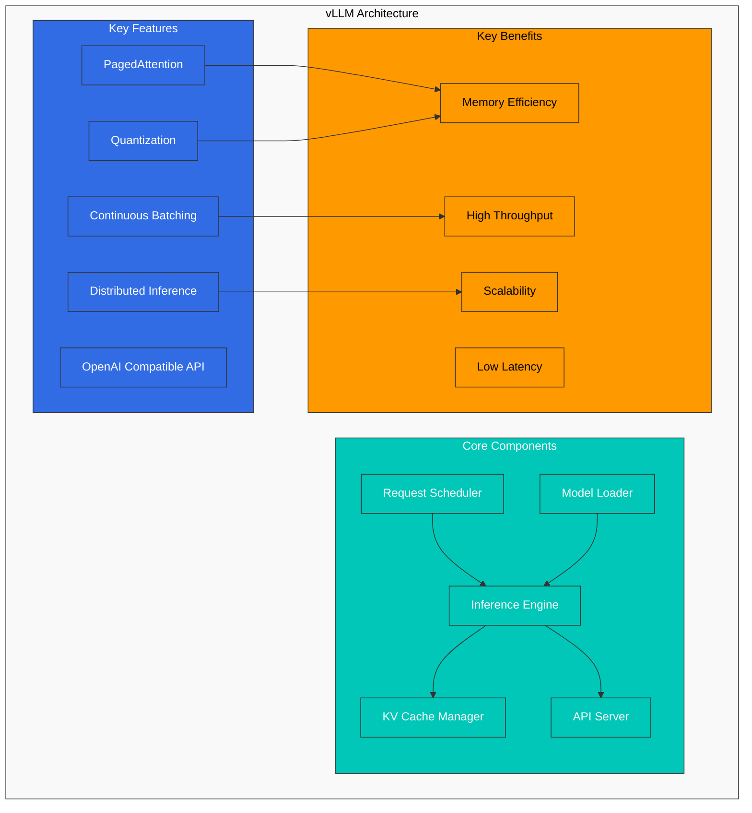
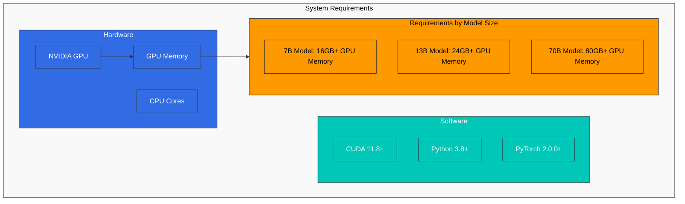
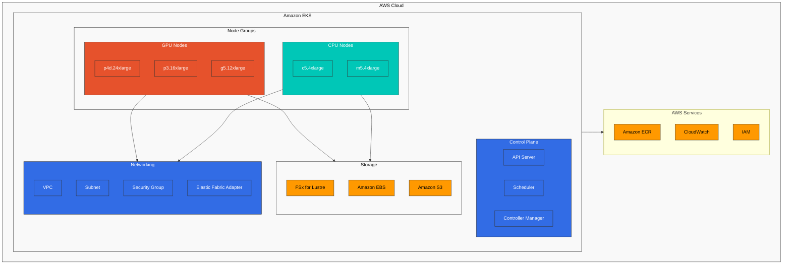
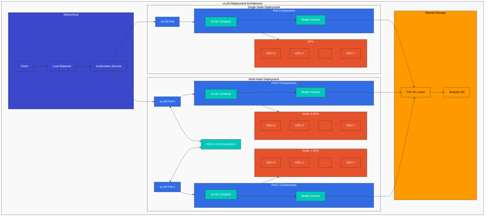
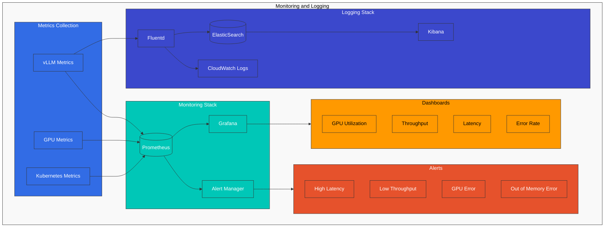
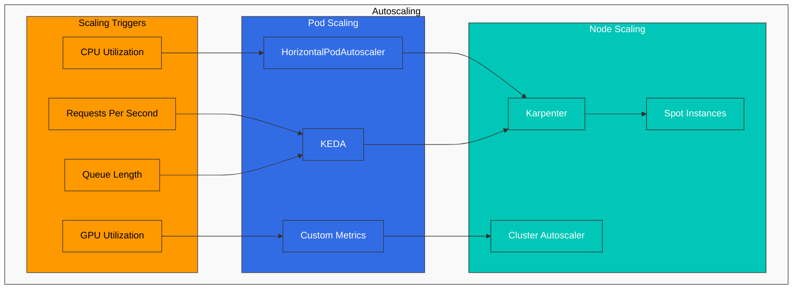
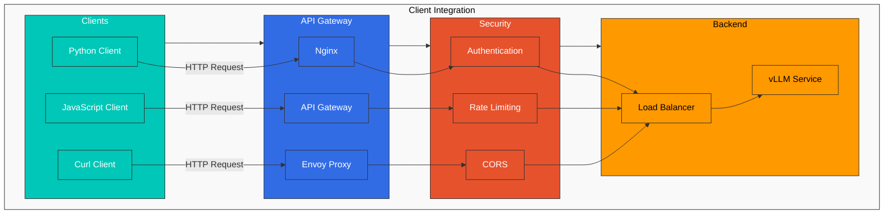

# vLLM Deployment

> **Supported Versions**: Kubernetes 1.31, 1.32, 1.33
> **Last Updated**: July 21, 2025

vLLM is a high-performance inference engine for Large Language Models (LLMs). In this chapter, we will learn how to deploy and optimize vLLM on EKS.

## Lab Environment Setup

To follow along with the examples in this document, you will need the following tools and environment:

### Required Tools and Resources
- kubectl v1.31 or higher
- Helm v3.10 or higher
- EKS cluster with NVIDIA GPUs (minimum recommended: g5.2xlarge instance)
- NVIDIA drivers and NVIDIA Device Plugin installed
- At least 50GB of disk space

### GPU Node Setup

```bash
# Install NVIDIA Device Plugin
kubectl apply -f https://raw.githubusercontent.com/NVIDIA/k8s-device-plugin/v0.14.0/nvidia-device-plugin.yml

# Verify GPU nodes
kubectl get nodes "-o=custom-columns=NAME:.metadata.name,GPU:.status.allocatable.nvidia\.com/gpu"
```

## Introduction to vLLM

vLLM is an LLM inference engine with the following characteristics:



### Key Features of vLLM

1. **PagedAttention**:
   - Memory management technology that efficiently manages KV cache
   - Inspired by operating system virtual memory management
   - Enables up to 10x more concurrent request processing

2. **Continuous Batching**:
   - Dynamically batches requests to maximize GPU utilization
   - Starts processing new requests immediately upon arrival
   - Up to 2x throughput improvement

3. **Distributed Inference**:
   - Supports large-scale models through tensor parallelization
   - Model sharding across multiple GPUs
   - Supports 175B+ parameter models

4. **Quantization**:
   - Supports various precisions including INT8, FP16
   - Reduces memory usage and improves inference speed
   - Up to 2x memory efficiency improvement with minimal accuracy loss

## Supported Models

vLLM supports the following models:

| Model Family | Supported Models | Quantization Options |
|-------------|-----------------|---------------------|
| **LLaMA/LLaMA 2** | 7B, 13B, 70B | FP16, INT8, INT4 |
| **Mistral** | 7B | FP16, INT8 |
| **Vicuna** | 7B, 13B, 33B | FP16, INT8 |
| **Falcon** | 7B, 40B | FP16, INT8 |
| **MPT** | 7B, 30B | FP16 |
| **Baichuan** | 7B, 13B | FP16 |
| **StarCoder** | 15.5B | FP16 |
| **BLOOM** | All sizes | FP16 |
| **GPT-NeoX** | All sizes | FP16 |

1. **PagedAttention**: Memory-efficient attention mechanism that optimizes memory usage when processing long sequences.
2. **Continuous Batching**: Dynamically batches requests to improve throughput.
3. **Distributed Inference**: Distributes models across multiple GPUs and nodes to handle large-scale models.
4. **Quantization**: Supports INT8/INT4 quantization to reduce memory usage and improve throughput.
5. **OpenAI Compatible API**: Provides an interface compatible with the OpenAI API.

## System Requirements

System requirements for deploying vLLM on EKS:



1. **Hardware**:
   - NVIDIA GPU (Volta, Turing, Ampere, Hopper architecture)
   - Minimum GPU memory: Varies by model size
     - 7B model: Minimum 16GB GPU memory
     - 13B model: Minimum 24GB GPU memory
     - 70B model: Minimum 80GB GPU memory (or distributed across multiple GPUs)

2. **Software**:
   - CUDA 11.8 or higher
   - Python 3.8 or higher
   - PyTorch 2.0.0 or higher

3. **EKS Node Types**:
   - p4d.24xlarge: 8x NVIDIA A100 GPU, 40GB or 80GB each
   - p3.16xlarge: 8x NVIDIA V100 GPU, 16GB each
   - g5.12xlarge: 4x NVIDIA A10G GPU, 24GB each
   - g4dn.12xlarge: 4x NVIDIA T4 GPU, 16GB each

## EKS Infrastructure Configuration



## Storage Configuration

vLLM requires high-performance storage as it needs to load large model weights:

### FSx for Lustre Setup

FSx for Lustre is a high-performance parallel file system suitable for quickly loading large model weights:

```yaml
apiVersion: fsx.aws.k8s.io/v1beta1
kind: Lustre
metadata:
  name: vllm-models
spec:
  deploymentType: SCRATCH_2
  storageCapacity: 1200
  subnetIds:
    - subnet-0123456789abcdef0
  securityGroupIds:
    - sg-0123456789abcdef0
  perUnitStorageThroughput: 200
---
apiVersion: storage.k8s.io/v1
kind: StorageClass
metadata:
  name: fsx-lustre-sc
provisioner: fsx.csi.aws.com
parameters:
  fileSystemId: fs-0123456789abcdef0
  mountName: vllm-models
---
apiVersion: v1
kind: PersistentVolumeClaim
metadata:
  name: vllm-models-pvc
spec:
  accessModes:
    - ReadWriteMany
  storageClassName: fsx-lustre-sc
  resources:
    requests:
      storage: 1200Gi
```

### Downloading Models from S3

Job to store Hugging Face models in S3 and download to FSx for Lustre:

```yaml
apiVersion: batch/v1
kind: Job
metadata:
  name: model-download
spec:
  template:
    spec:
      containers:
      - name: model-download
        image: huggingface/transformers:latest
        command:
        - python
        - -c
        - |
          from huggingface_hub import snapshot_download
          import os

          model_id = "meta-llama/Llama-2-70b-chat-hf"
          dest_dir = "/models/llama-2-70b"

          os.makedirs(dest_dir, exist_ok=True)
          snapshot_download(repo_id=model_id, local_dir=dest_dir, token=os.environ["HF_TOKEN"])
        env:
        - name: HF_TOKEN
          valueFrom:
            secretKeyRef:
              name: huggingface-token
              key: token
        volumeMounts:
        - name: models-volume
          mountPath: /models
      restartPolicy: Never
      volumes:
      - name: models-volume
        persistentVolumeClaim:
          claimName: vllm-models-pvc
```

## vLLM Deployment

### Deployment Architecture

The following diagram shows two main architectures for deploying vLLM on EKS:



### Single Node Deployment

Deployment running vLLM on a single GPU or multiple GPUs on a single node:

```yaml
apiVersion: apps/v1
kind: Deployment
metadata:
  name: vllm-inference
spec:
  replicas: 1
  selector:
    matchLabels:
      app: vllm-inference
  template:
    metadata:
      labels:
        app: vllm-inference
    spec:
      containers:
      - name: vllm-server
        image: vllm/vllm-openai:latest
        command:
        - python
        - -m
        - vllm.entrypoints.openai.api_server
        - --model=/models/llama-2-70b
        - --tensor-parallel-size=8
        - --gpu-memory-utilization=0.9
        - --max-num-batched-tokens=8192
        - --port=8000
        ports:
        - containerPort: 8000
        resources:
          limits:
            nvidia.com/gpu: 8
        volumeMounts:
        - name: models-volume
          mountPath: /models
        env:
        - name: CUDA_VISIBLE_DEVICES
          value: "0,1,2,3,4,5,6,7"
      volumes:
      - name: models-volume
        persistentVolumeClaim:
          claimName: vllm-models-pvc
---
apiVersion: v1
kind: Service
metadata:
  name: vllm-inference
spec:
  selector:
    app: vllm-inference
  ports:
  - port: 8000
    targetPort: 8000
  type: LoadBalancer
```

### Multi-Node Distributed Deployment

Method to distribute large models across multiple nodes:

```yaml
apiVersion: v1
kind: ConfigMap
metadata:
  name: vllm-config
data:
  hostfile: |
    vllm-inference-0 slots=8
    vllm-inference-1 slots=8
  run_server.sh: |
    #!/bin/bash

    RANK=$HOSTNAME
    if [[ $HOSTNAME == "vllm-inference-0" ]]; then
      RANK=0
    elif [[ $HOSTNAME == "vllm-inference-1" ]]; then
      RANK=1
    fi

    python -m vllm.entrypoints.openai.api_server \
      --model=/models/llama-2-70b \
      --tensor-parallel-size=16 \
      --pipeline-parallel-size=1 \
      --max-num-batched-tokens=8192 \
      --port=8000 \
      --host=0.0.0.0 \
      --master-addr=vllm-inference-0 \
      --master-port=29500 \
      --rank=$RANK
---
apiVersion: apps/v1
kind: StatefulSet
metadata:
  name: vllm-inference
spec:
  serviceName: "vllm-inference"
  replicas: 2
  selector:
    matchLabels:
      app: vllm-inference
  template:
    metadata:
      labels:
        app: vllm-inference
    spec:
      affinity:
        podAntiAffinity:
          requiredDuringSchedulingIgnoredDuringExecution:
          - labelSelector:
              matchExpressions:
              - key: app
                operator: In
                values:
                - vllm-inference
            topologyKey: kubernetes.io/hostname
      containers:
      - name: vllm-server
        image: vllm/vllm-openai:latest
        command:
        - bash
        - /config/run_server.sh
        ports:
        - containerPort: 8000
        - containerPort: 29500
        resources:
          limits:
            nvidia.com/gpu: 8
        volumeMounts:
        - name: models-volume
          mountPath: /models
        - name: config-volume
          mountPath: /config
        env:
        - name: CUDA_VISIBLE_DEVICES
          value: "0,1,2,3,4,5,6,7"
        - name: NCCL_DEBUG
          value: "INFO"
        - name: NCCL_IB_DISABLE
          value: "0"
        - name: NCCL_IB_GID_INDEX
          value: "3"
        - name: NCCL_NET_GDR_LEVEL
          value: "5"
      volumes:
      - name: models-volume
        persistentVolumeClaim:
          claimName: vllm-models-pvc
      - name: config-volume
        configMap:
          name: vllm-config
          defaultMode: 0755
---
apiVersion: v1
kind: Service
metadata:
  name: vllm-inference
spec:
  selector:
    app: vllm-inference
  ports:
  - port: 8000
    targetPort: 8000
    name: api
  - port: 29500
    targetPort: 29500
    name: nccl
  clusterIP: None
---
apiVersion: v1
kind: Service
metadata:
  name: vllm-inference-lb
spec:
  selector:
    app: vllm-inference
    statefulset.kubernetes.io/pod-name: vllm-inference-0
  ports:
  - port: 8000
    targetPort: 8000
  type: LoadBalancer
```

## Performance Optimization

```mermaid
flowchart TD
    subgraph Optimization [Performance Optimization]
        subgraph GPUMemory [GPU Memory Optimization]
            MemoryUtil[GPU Memory Utilization Adjustment]
            Quantization[Quantization Application]
            SwapSpace[Swap Space Utilization]
        end

        subgraph Throughput [Throughput Optimization]
            BatchSize[Batch Size Adjustment]
            KVCache[KV Cache Optimization]
            TensorParallel[Tensor Parallel Processing]
        end

        subgraph NetworkOpt [Network Optimization]
            EFA[EFA Utilization]
            NCCLSettings[NCCL Settings Optimization]
            NodePlacement[Node Placement Optimization]
        end
    end

    MemoryUtil -->|--gpu-memory-utilization=0.9| Performance([Performance Improvement])
    Quantization -->|--quantization awq| Performance
    SwapSpace -->|--swap-space=16| Performance

    BatchSize -->|--max-num-batched-tokens=8192| Performance
    KVCache -->|--block-size=16| Performance
    TensorParallel -->|--tensor-parallel-size=8| Performance

    EFA -->|vpc.amazonaws.com/efa: 1| Performance
    NCCLSettings -->|NCCL_DEBUG=INFO| Performance
    NodePlacement -->|topology.kubernetes.io/zone| Performance

    classDef gpuMemNode fill:#326CE5,stroke:#333,stroke-width:1px,color:white;
    classDef throughputNode fill:#00C7B7,stroke:#333,stroke-width:1px,color:white;
    classDef networkNode fill:#E6522C,stroke:#333,stroke-width:1px,color:white;
    classDef performanceNode fill:#FF9900,stroke:#333,stroke-width:1px,color:black;
    classDef default fill:#f9f9f9,stroke:#333,stroke-width:1px,color:black;

    class MemoryUtil,Quantization,SwapSpace,GPUMemory gpuMemNode;
    class BatchSize,KVCache,TensorParallel,Throughput throughputNode;
    class EFA,NCCLSettings,NodePlacement,NetworkOpt networkNode;
    class Performance performanceNode;
    class Optimization default;
```



### GPU Memory Optimization

Methods to optimize vLLM's GPU memory usage:

1. **GPU Memory Utilization Adjustment**:

```bash
--gpu-memory-utilization=0.9
```

2. **Quantization Application**:

```bash
--quantization awq
```

3. **Swap Space Utilization**:

```bash
--swap-space=16
```

### Throughput Optimization

Methods to optimize vLLM's throughput:

1. **Batch Size Adjustment**:

```bash
--max-num-batched-tokens=8192
```

2. **KV Cache Optimization**:

```bash
--block-size=16
```

3. **Tensor Parallel Processing Adjustment**:

```bash
--tensor-parallel-size=8
```

### Network Optimization

Methods to optimize network performance in distributed deployments:

1. **EFA (Elastic Fabric Adapter) Utilization**:

```yaml
resources:
  limits:
    nvidia.com/gpu: 8
    vpc.amazonaws.com/efa: 1
```

2. **NCCL Settings Optimization**:

```yaml
env:
- name: NCCL_DEBUG
  value: "INFO"
- name: NCCL_MIN_NCHANNELS
  value: "4"
- name: NCCL_SOCKET_IFNAME
  value: "^lo,docker"
- name: NCCL_ASYNC_ERROR_HANDLING
  value: "1"
```

3. **Node Placement Optimization**:

```yaml
affinity:
  nodeAffinity:
    requiredDuringSchedulingIgnoredDuringExecution:
      nodeSelectorTerms:
      - matchExpressions:
        - key: topology.kubernetes.io/zone
          operator: In
          values:
          - us-west-2a
```

## Monitoring and Logging



### Prometheus Metrics

Method to collect Prometheus metrics from vLLM server:

```yaml
apiVersion: v1
kind: Service
metadata:
  name: vllm-metrics
  labels:
    app: vllm-inference
spec:
  selector:
    app: vllm-inference
  ports:
  - port: 8001
    targetPort: 8001
    name: metrics
---
apiVersion: monitoring.coreos.com/v1
kind: ServiceMonitor
metadata:
  name: vllm-metrics
  namespace: monitoring
spec:
  selector:
    matchLabels:
      app: vllm-inference
  endpoints:
  - port: metrics
    interval: 15s
```

### Log Collection

Method to collect vLLM server logs to CloudWatch:

```yaml
apiVersion: v1
kind: ConfigMap
metadata:
  name: fluentd-config
  namespace: logging
data:
  fluent.conf: |
    <source>
      @type tail
      path /var/log/containers/vllm-*.log
      pos_file /var/log/fluentd-vllm.log.pos
      tag kubernetes.vllm.*
      read_from_head true
      <parse>
        @type json
        time_format %Y-%m-%dT%H:%M:%S.%NZ
      </parse>
    </source>

    <filter kubernetes.vllm.**>
      @type kubernetes_metadata
      @id filter_kube_metadata
    </filter>

    <match kubernetes.vllm.**>
      @type cloudwatch_logs
      log_group_name /eks/vllm/logs
      log_stream_name_key $.kubernetes.pod_name
      remove_log_stream_name_key true
      auto_create_stream true
      region us-west-2
    </match>
```

## Autoscaling



### HPA (Horizontal Pod Autoscaler)

Method to automatically scale vLLM servers based on request volume:

```yaml
apiVersion: autoscaling/v2
kind: HorizontalPodAutoscaler
metadata:
  name: vllm-inference-hpa
spec:
  scaleTargetRef:
    apiVersion: apps/v1
    kind: Deployment
    name: vllm-inference
  minReplicas: 1
  maxReplicas: 5
  metrics:
  - type: Resource
    resource:
      name: cpu
      target:
        type: Utilization
        averageUtilization: 70
  - type: Pods
    pods:
      metric:
        name: requests_per_second
      target:
        type: AverageValue
        averageValue: 100
```

### Node Autoscaling with Karpenter

Method to automatically provision GPU nodes:

```yaml
apiVersion: karpenter.sh/v1beta1
kind: NodePool
metadata:
  name: vllm-gpu
spec:
  template:
    spec:
      requirements:
      - key: node.kubernetes.io/instance-type
        operator: In
        values:
        - p3.16xlarge
        - g5.12xlarge
      - key: karpenter.sh/capacity-type
        operator: In
        values:
        - on-demand
      - key: kubernetes.io/arch
        operator: In
        values:
        - amd64
      - key: vpc.amazonaws.com/efa
        operator: In
        values:
        - "true"
      nodeClassRef:
        name: vllm-gpu-class
  limits:
    nvidia.com/gpu: 32
---
apiVersion: karpenter.k8s.aws/v1beta1
kind: EC2NodeClass
metadata:
  name: vllm-gpu-class
spec:
  subnetSelector:
    karpenter.sh/discovery: vllm-cluster
  securityGroupSelector:
    karpenter.sh/discovery: vllm-cluster
  ttlSecondsAfterEmpty: 30
```

## Security Configuration

### Network Policy

Method to restrict network access to vLLM servers:

```yaml
apiVersion: networking.k8s.io/v1
kind: NetworkPolicy
metadata:
  name: vllm-network-policy
spec:
  podSelector:
    matchLabels:
      app: vllm-inference
  policyTypes:
  - Ingress
  - Egress
  ingress:
  - from:
    - podSelector:
        matchLabels:
          app: api-gateway
    ports:
    - protocol: TCP
      port: 8000
  - from:
    - podSelector:
        matchLabels:
          app: vllm-inference
    ports:
    - protocol: TCP
      port: 29500
  egress:
  - to:
    - podSelector:
        matchLabels:
          app: vllm-inference
    ports:
    - protocol: TCP
      port: 29500
  - to:
    ports:
    - protocol: TCP
      port: 443
```

### Security Context

Method to configure container security context:

```yaml
securityContext:
  runAsUser: 1000
  runAsGroup: 1000
  fsGroup: 1000
  allowPrivilegeEscalation: false
  capabilities:
    drop:
    - ALL
```

## Client Integration



### API Gateway

Method to deploy an API gateway in front of vLLM servers:

```yaml
apiVersion: apps/v1
kind: Deployment
metadata:
  name: api-gateway
spec:
  replicas: 3
  selector:
    matchLabels:
      app: api-gateway
  template:
    metadata:
      labels:
        app: api-gateway
    spec:
      containers:
      - name: api-gateway
        image: nginx:latest
        ports:
        - containerPort: 80
        volumeMounts:
        - name: nginx-config
          mountPath: /etc/nginx/conf.d
      volumes:
      - name: nginx-config
        configMap:
          name: nginx-config
---
apiVersion: v1
kind: ConfigMap
metadata:
  name: nginx-config
data:
  default.conf: |
    server {
      listen 80;

      location /v1/ {
        proxy_pass http://vllm-inference:8000;
        proxy_set_header Host $host;
        proxy_set_header X-Real-IP $remote_addr;
      }
    }
---
apiVersion: v1
kind: Service
metadata:
  name: api-gateway
spec:
  selector:
    app: api-gateway
  ports:
  - port: 80
    targetPort: 80
  type: LoadBalancer
```

### Client Example

Method to send requests to vLLM server using Python client:

```python
import requests
import json

url = "http://api-gateway/v1/completions"

payload = {
    "model": "llama-2-70b",
    "prompt": "Once upon a time",
    "max_tokens": 100,
    "temperature": 0.7
}

headers = {
    "Content-Type": "application/json"
}

response = requests.post(url, headers=headers, data=json.dumps(payload))

print(response.json())
```

## Best Practices

### Resource Management

1. **Consider Memory Overhead**:
   - Allocate sufficient CPU memory in addition to GPU memory.
   - It is recommended to allocate approximately twice the model size in CPU memory.

2. **CPU Core Allocation**:
   - Allocate at least 4 CPU cores per GPU.
   - More CPU cores may be needed when using tensor parallelization.

3. **Node Selection**:
   - Select appropriate node types based on model size.
   - Choose nodes with high memory bandwidth.

### High Availability

1. **Multi-Availability Zone Deployment**:
   - Deploy vLLM servers across multiple availability zones.
   - Ensure sufficient capacity in each availability zone.

2. **Load Balancing**:
   - Distribute requests across multiple vLLM server instances.
   - Configure session affinity so requests from the same user are routed to the same server.

3. **Failure Recovery**:
   - Configure health checks to detect failed servers.
   - Implement automatic recovery mechanisms.

### Cost Optimization

1. **Utilize Spot Instances**:
   - Use Spot instances to reduce costs.
   - Suitable for interruption-tolerant workloads.

2. **Model Quantization**:
   - Apply INT8 or INT4 quantization to reduce memory usage.
   - Consider the balance between accuracy and performance.

3. **Autoscaling**:
   - Automatically scale servers based on request volume.
   - Reduce costs by scaling down servers during idle times.

## Conclusion

Deploying vLLM on EKS is a powerful method for efficiently serving Large Language Models. By properly selecting hardware, configuring storage, optimizing performance, implementing monitoring and logging, configuring autoscaling, and setting up security, you can build a stable and scalable LLM inference service. Additionally, following best practices can lead to better results in resource management, high availability, and cost optimization.

## Quiz

To test what you've learned in this chapter, try the [Topic Quiz](../quizzes/ai-ml/04-vllm-deployment-quiz.md).
