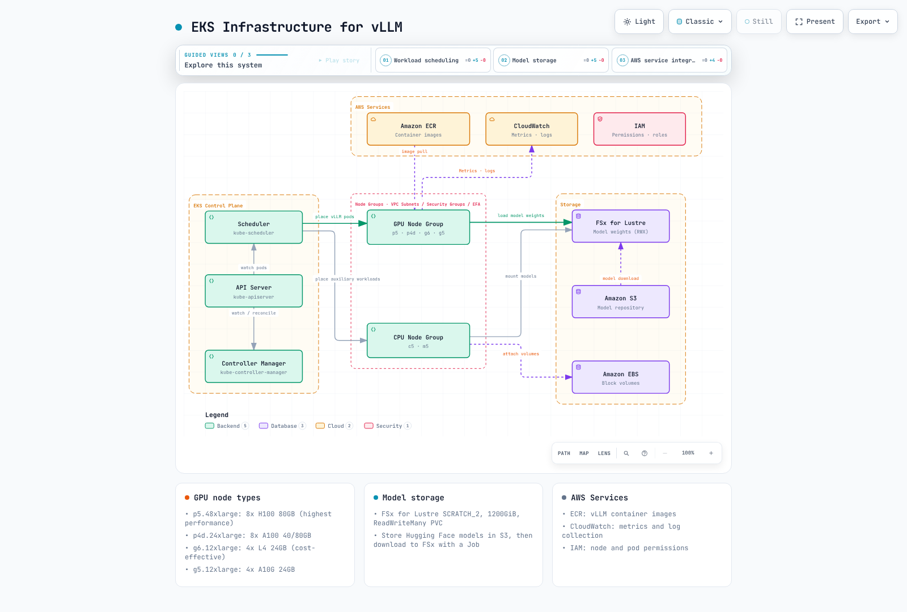
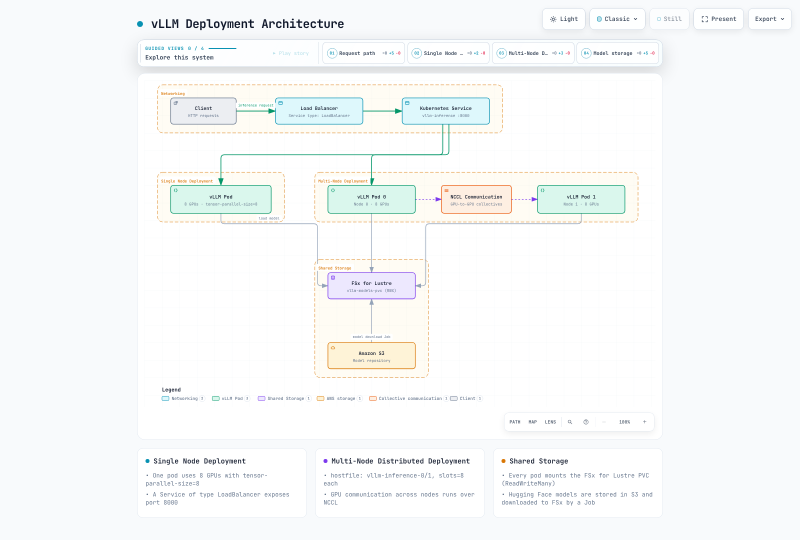
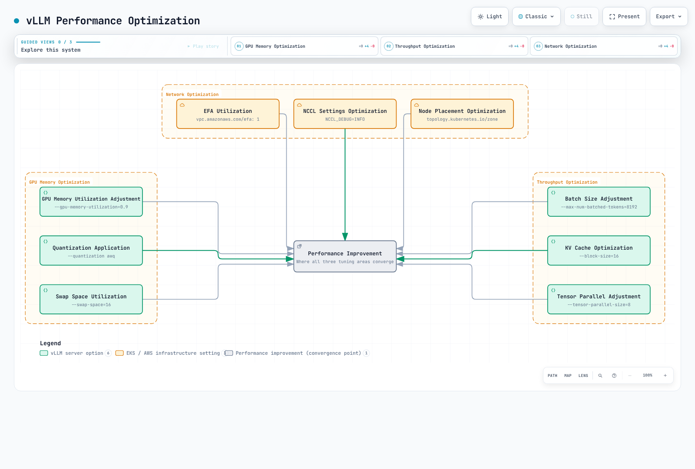
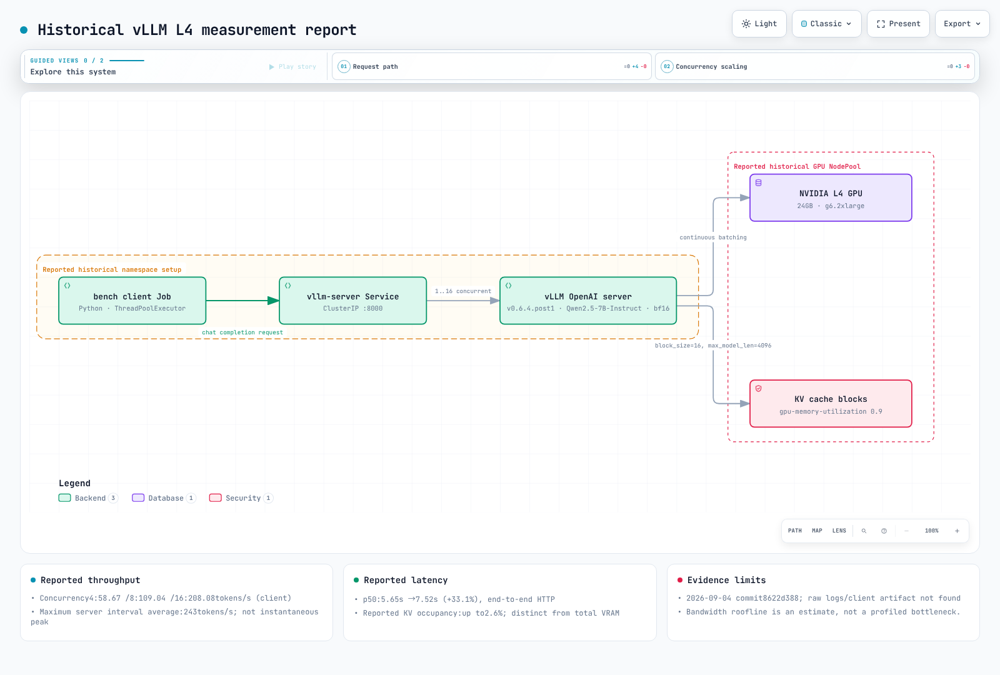

# vLLM Deployment & Optimization

> **Supported Versions**: Kubernetes 1.31, 1.32, 1.33  
> **Last Updated**: September 4, 2026

vLLM is the most widely adopted open-source high-performance inference engine for Large Language Models (LLMs). In this chapter, we will explore vLLM's latest features and architecture, and learn how to deploy and optimize it at production scale on EKS.

## Lab Environment Setup

To follow along with the examples in this document, you will need the following tools and environment:

### Required Tools and Resources
- kubectl v1.31 or higher
- Helm v3.10 or higher
- EKS cluster with NVIDIA GPUs (minimum recommended: g5.2xlarge instance)
- NVIDIA drivers and NVIDIA Device Plugin installed
- At least 50GB of disk space

### GPU Node Setup

```bash
# Install NVIDIA Device Plugin
kubectl apply -f https://raw.githubusercontent.com/NVIDIA/k8s-device-plugin/v0.14.0/nvidia-device-plugin.yml

# Verify GPU nodes
kubectl get nodes "-o=custom-columns=NAME:.metadata.name,GPU:.status.allocatable.nvidia\.com/gpu"
```

## Introduction to vLLM

vLLM is an LLM inference engine with the following characteristics:


[🔍 View interactive diagram](https://www.atomai.click/kubernetes-docs/archmaps/en-ai-ml-02-vllm-deployment-0.html)

### Key Features of vLLM

1. **PagedAttention**:
   - Memory management technology that efficiently manages KV cache
   - Inspired by operating system virtual memory management
   - Enables up to 10x more concurrent request processing

2. **Continuous Batching**:
   - Dynamically batches requests to maximize GPU utilization
   - Starts processing new requests immediately upon arrival
   - Up to 2x throughput improvement

3. **Distributed Inference**:
   - Supports large-scale models through tensor parallelization
   - Model sharding across multiple GPUs
   - Supports 175B+ parameter models

4. **Quantization**:
   - Supports various precisions including INT8, FP16
   - Reduces memory usage and improves inference speed
   - Up to 2x memory efficiency improvement with minimal accuracy loss

## Supported Models

vLLM supports the following models:

| Model Family | Supported Models | Quantization Options |
|-------------|-----------------|---------------------|
| **LLaMA 3 / 3.1 / 3.2 / 3.3** | 1B, 3B, 8B, 70B, 405B | FP16, BF16, FP8, INT8, INT4, AWQ, GPTQ |
| **DeepSeek V3 / R1** | 7B, 67B, 671B (MoE) | FP16, BF16, FP8, AWQ, GPTQ |
| **Qwen 2 / 2.5 / QwQ** | 0.5B ~ 72B | FP16, BF16, FP8, INT8, AWQ, GPTQ |
| **Mistral / Mixtral** | 7B, 8x7B, 8x22B, Large 2 | FP16, BF16, FP8, AWQ, GPTQ |
| **Gemma 2 / 3** | 2B, 9B, 27B | FP16, BF16, INT8 |
| **Phi-3 / Phi-4** | 3.8B, 7B, 14B | FP16, BF16, INT8, AWQ |
| **Command R / R+** | 35B, 104B | FP16, BF16 |
| **DBRX** | 132B (MoE) | FP16, BF16 |
| **StarCoder 2** | 3B, 7B, 15B | FP16, BF16 |
| **Vision Models (VLM)** | LLaVA, Pixtral, Qwen2-VL, InternVL | FP16, BF16 |

1. **PagedAttention**: Memory-efficient attention mechanism that optimizes memory usage when processing long sequences.
2. **Continuous Batching**: Dynamically batches requests to improve throughput.
3. **Distributed Inference**: Distributes models across multiple GPUs and nodes to handle large-scale models.
4. **Quantization**: Supports INT8/INT4 quantization to reduce memory usage and improve throughput.
5. **OpenAI Compatible API**: Provides an interface compatible with the OpenAI API.

### vLLM Features Added in the v0.6 Line

vLLM is evolving rapidly with significant new capabilities in recent releases:

#### Speculative Decoding

Uses a smaller draft model to generate multiple candidate tokens, which the larger model verifies in a single pass, improving inference speed by 2-3x:

```bash
python -m vllm.entrypoints.openai.api_server \
  --model meta-llama/Llama-3.1-70B-Instruct \
  --speculative-model meta-llama/Llama-3.1-8B-Instruct \
  --num-speculative-tokens 5
```

#### Prefix Caching

Automatically reuses KV cache across requests that share the same system prompt or context, dramatically reducing TTFT (Time to First Token):

```bash
--enable-prefix-caching
```

#### Chunked Prefill

Splits long prompt prefill into smaller chunks interleaved with decode steps, reducing the impact of long-context requests on other requests' latency:

```bash
--enable-chunked-prefill --max-num-batched-tokens 2048
```

#### Dynamic LoRA Adapter Loading

Dynamically loads/unloads multiple LoRA adapters at runtime, serving many customized models from a single base model:

```bash
--enable-lora --max-loras 4 --max-lora-rank 64
```

```python
# Specify LoRA model in API request
response = client.chat.completions.create(
    model="my-custom-lora-adapter",
    messages=[{"role": "user", "content": "Hello!"}]
)
```

#### Structured Output

Supports constrained output generation via JSON Schema, regex patterns, and CFG (Context-Free Grammar) for reliable structured data generation:

```python
from openai import OpenAI
client = OpenAI(base_url="http://vllm-service:8000/v1")

response = client.chat.completions.create(
    model="meta-llama/Llama-3.1-8B-Instruct",
    messages=[{"role": "user", "content": "Return user information as JSON"}],
    response_format={
        "type": "json_schema",
        "json_schema": {
            "name": "user_info",
            "schema": {
                "type": "object",
                "properties": {
                    "name": {"type": "string"},
                    "age": {"type": "integer"},
                    "email": {"type": "string"}
                },
                "required": ["name", "age", "email"]
            }
        }
    }
)
```

#### Tool Calling

Supports OpenAI-compatible Tool/Function Calling for integration with agent workflows:

```python
response = client.chat.completions.create(
    model="meta-llama/Llama-3.1-8B-Instruct",
    messages=[{"role": "user", "content": "What's the weather in Seoul?"}],
    tools=[{
        "type": "function",
        "function": {
            "name": "get_weather",
            "description": "Get the current weather for a specified location",
            "parameters": {
                "type": "object",
                "properties": {
                    "location": {"type": "string", "description": "City name"}
                },
                "required": ["location"]
            }
        }
    }]
)
```

#### FP8 Quantization

Supports FP8 quantization on Hopper (H100) and Ada Lovelace (L4, L40S) GPUs, halving memory usage while maintaining near-identical accuracy:

```bash
--quantization fp8 --kv-cache-dtype fp8
```

#### Vision-Language Model (VLM) Serving

Supports multimodal models that process both images and text simultaneously:

```python
response = client.chat.completions.create(
    model="llava-hf/llava-v1.6-mistral-7b-hf",
    messages=[{
        "role": "user",
        "content": [
            {"type": "text", "text": "Describe this image"},
            {"type": "image_url", "image_url": {"url": "data:image/png;base64,..."}}
        ]
    }]
)
```

## System Requirements

System requirements for deploying vLLM on EKS:


[🔍 View interactive diagram](https://www.atomai.click/kubernetes-docs/archmaps/en-ai-ml-02-vllm-deployment-1.html)

1. **Hardware**:
   - NVIDIA GPU (Volta, Turing, Ampere, Hopper architecture)
   - Minimum GPU memory: Varies by model size
     - 7B model: Minimum 16GB GPU memory
     - 13B model: Minimum 24GB GPU memory
     - 70B model: Minimum 80GB GPU memory (or distributed across multiple GPUs)

2. **Software**:
   - CUDA 12.1 or higher (CUDA 12.4 recommended for FP8)
   - Python 3.9 or higher
   - PyTorch 2.4.0 or higher

3. **EKS Node Types**:
   - p5.48xlarge: 8x NVIDIA H100 GPU, 80GB each (highest performance)
   - p4d.24xlarge: 8x NVIDIA A100 GPU, 40GB or 80GB each
   - g6.12xlarge: 4x NVIDIA L4 GPU, 24GB each (cost-effective)
   - g5.12xlarge: 4x NVIDIA A10G GPU, 24GB each
   - g6e.12xlarge: 4x NVIDIA L40S GPU, 48GB each
   - trn1.32xlarge: 16x AWS Trainium, 32GB each (AWS silicon)

## EKS Infrastructure Configuration



[🔍 View interactive diagram](https://www.atomai.click/kubernetes-docs/archmaps/en-ai-ml-02-vllm-deployment-2.html)

## Storage Configuration

vLLM requires high-performance storage as it needs to load large model weights:

### FSx for Lustre Setup

FSx for Lustre is a high-performance parallel file system suitable for quickly loading large model weights:

```yaml
apiVersion: fsx.aws.k8s.io/v1beta1
kind: Lustre
metadata:
  name: vllm-models
spec:
  deploymentType: SCRATCH_2
  storageCapacity: 1200
  subnetIds:
    - subnet-0123456789abcdef0
  securityGroupIds:
    - sg-0123456789abcdef0
  perUnitStorageThroughput: 200
---
apiVersion: storage.k8s.io/v1
kind: StorageClass
metadata:
  name: fsx-lustre-sc
provisioner: fsx.csi.aws.com
parameters:
  fileSystemId: fs-0123456789abcdef0
  mountName: vllm-models
---
apiVersion: v1
kind: PersistentVolumeClaim
metadata:
  name: vllm-models-pvc
spec:
  accessModes:
    - ReadWriteMany
  storageClassName: fsx-lustre-sc
  resources:
    requests:
      storage: 1200Gi
```

### Downloading Models from S3

Job to store Hugging Face models in S3 and download to FSx for Lustre:

```yaml
apiVersion: batch/v1
kind: Job
metadata:
  name: model-download
spec:
  template:
    spec:
      containers:
      - name: model-download
        image: huggingface/transformers:latest
        command:
        - python
        - -c
        - |
          from huggingface_hub import snapshot_download
          import os

          model_id = "meta-llama/Llama-3.1-70B-Instruct"
          dest_dir = "/models/llama-3.1-70b"

          os.makedirs(dest_dir, exist_ok=True)
          snapshot_download(repo_id=model_id, local_dir=dest_dir, token=os.environ["HF_TOKEN"])
        env:
        - name: HF_TOKEN
          valueFrom:
            secretKeyRef:
              name: huggingface-token
              key: token
        volumeMounts:
        - name: models-volume
          mountPath: /models
      restartPolicy: Never
      volumes:
      - name: models-volume
        persistentVolumeClaim:
          claimName: vllm-models-pvc
```

## vLLM Deployment

### Deployment Architecture

The following diagram shows two main architectures for deploying vLLM on EKS:



[🔍 View interactive diagram](https://www.atomai.click/kubernetes-docs/archmaps/en-ai-ml-02-vllm-deployment-3.html)

### Single Node Deployment

Deployment running vLLM on a single GPU or multiple GPUs on a single node:

```yaml
apiVersion: apps/v1
kind: Deployment
metadata:
  name: vllm-inference
spec:
  replicas: 1
  selector:
    matchLabels:
      app: vllm-inference
  template:
    metadata:
      labels:
        app: vllm-inference
    spec:
      containers:
      - name: vllm-server
        image: vllm/vllm-openai:latest
        command:
        - python
        - -m
        - vllm.entrypoints.openai.api_server
        - --model=/models/llama-3.1-70b
        - --tensor-parallel-size=8
        - --gpu-memory-utilization=0.95
        - --max-num-batched-tokens=16384
        - --enable-prefix-caching
        - --enable-chunked-prefill
        - --port=8000
        ports:
        - containerPort: 8000
        resources:
          limits:
            nvidia.com/gpu: 8
        volumeMounts:
        - name: models-volume
          mountPath: /models
        env:
        - name: CUDA_VISIBLE_DEVICES
          value: "0,1,2,3,4,5,6,7"
      volumes:
      - name: models-volume
        persistentVolumeClaim:
          claimName: vllm-models-pvc
---
apiVersion: v1
kind: Service
metadata:
  name: vllm-inference
spec:
  selector:
    app: vllm-inference
  ports:
  - port: 8000
    targetPort: 8000
  type: LoadBalancer
```

### Multi-Node Distributed Deployment

Method to distribute large models across multiple nodes:

```yaml
apiVersion: v1
kind: ConfigMap
metadata:
  name: vllm-config
data:
  hostfile: |
    vllm-inference-0 slots=8
    vllm-inference-1 slots=8
  run_server.sh: |
    #!/bin/bash

    RANK=$HOSTNAME
    if [[ $HOSTNAME == "vllm-inference-0" ]]; then
      RANK=0
    elif [[ $HOSTNAME == "vllm-inference-1" ]]; then
      RANK=1
    fi

    python -m vllm.entrypoints.openai.api_server \
      --model=/models/llama-3.1-70b \
      --tensor-parallel-size=16 \
      --pipeline-parallel-size=1 \
      --max-num-batched-tokens=8192 \
      --port=8000 \
      --host=0.0.0.0 \
      --master-addr=vllm-inference-0 \
      --master-port=29500 \
      --rank=$RANK
---
apiVersion: apps/v1
kind: StatefulSet
metadata:
  name: vllm-inference
spec:
  serviceName: "vllm-inference"
  replicas: 2
  selector:
    matchLabels:
      app: vllm-inference
  template:
    metadata:
      labels:
        app: vllm-inference
    spec:
      affinity:
        podAntiAffinity:
          requiredDuringSchedulingIgnoredDuringExecution:
          - labelSelector:
              matchExpressions:
              - key: app
                operator: In
                values:
                - vllm-inference
            topologyKey: kubernetes.io/hostname
      containers:
      - name: vllm-server
        image: vllm/vllm-openai:latest
        command:
        - bash
        - /config/run_server.sh
        ports:
        - containerPort: 8000
        - containerPort: 29500
        resources:
          limits:
            nvidia.com/gpu: 8
        volumeMounts:
        - name: models-volume
          mountPath: /models
        - name: config-volume
          mountPath: /config
        env:
        - name: CUDA_VISIBLE_DEVICES
          value: "0,1,2,3,4,5,6,7"
        - name: NCCL_DEBUG
          value: "INFO"
        - name: NCCL_IB_DISABLE
          value: "0"
        - name: NCCL_IB_GID_INDEX
          value: "3"
        - name: NCCL_NET_GDR_LEVEL
          value: "5"
      volumes:
      - name: models-volume
        persistentVolumeClaim:
          claimName: vllm-models-pvc
      - name: config-volume
        configMap:
          name: vllm-config
          defaultMode: 0755
---
apiVersion: v1
kind: Service
metadata:
  name: vllm-inference
spec:
  selector:
    app: vllm-inference
  ports:
  - port: 8000
    targetPort: 8000
    name: api
  - port: 29500
    targetPort: 29500
    name: nccl
  clusterIP: None
---
apiVersion: v1
kind: Service
metadata:
  name: vllm-inference-lb
spec:
  selector:
    app: vllm-inference
    statefulset.kubernetes.io/pod-name: vllm-inference-0
  ports:
  - port: 8000
    targetPort: 8000
  type: LoadBalancer
```

## Performance Optimization



[🔍 View interactive diagram](https://www.atomai.click/kubernetes-docs/archmaps/en-ai-ml-02-vllm-deployment-4.html)

### GPU Memory Optimization

Methods to optimize vLLM's GPU memory usage:

1. **GPU Memory Utilization Adjustment**:

```bash
--gpu-memory-utilization=0.9
```

2. **Quantization Application**:

```bash
--quantization awq
```

3. **Swap Space Utilization**:

```bash
--swap-space=16
```

### Throughput Optimization

Methods to optimize vLLM's throughput:

1. **Batch Size Adjustment**:

```bash
--max-num-batched-tokens=8192
```

2. **KV Cache Optimization**:

```bash
--block-size=16
```

3. **Tensor Parallel Processing Adjustment**:

```bash
--tensor-parallel-size=8
```

### Network Optimization

Methods to optimize network performance in distributed deployments:

1. **EFA (Elastic Fabric Adapter) Utilization**:

```yaml
resources:
  limits:
    nvidia.com/gpu: 8
    vpc.amazonaws.com/efa: 1
```

2. **NCCL Settings Optimization**:

```yaml
env:
- name: NCCL_DEBUG
  value: "INFO"
- name: NCCL_MIN_NCHANNELS
  value: "4"
- name: NCCL_SOCKET_IFNAME
  value: "^lo,docker"
- name: NCCL_ASYNC_ERROR_HANDLING
  value: "1"
```

3. **Node Placement Optimization**:

```yaml
affinity:
  nodeAffinity:
    requiredDuringSchedulingIgnoredDuringExecution:
      nodeSelectorTerms:
      - matchExpressions:
        - key: topology.kubernetes.io/zone
          operator: In
          values:
          - us-west-2a
```

## Measured Benchmark: Qwen2.5-7B on a Single L4 GPU

Every other number on this page so far is a general vLLM project claim or a configuration flag description. This section is different: it is one measured run against a real vLLM server, so you can see what "continuous batching improves throughput" actually looks like on one concrete model and GPU.



[🔍 View interactive diagram](https://www.atomai.click/kubernetes-docs/archmaps/en-ai-ml-02-vllm-deployment-6.html)

### Setup

- **Cluster**: a dedicated Karpenter NodePool (`bench-gpu`, on-demand `g6.2xlarge` — 1x NVIDIA L4, 24GB GPU memory, 8 vCPU, 32 GiB RAM), tainted `nvidia.com/gpu=true:NoSchedule` and labeled to join the existing `nvidia-device-plugin` daemonsets, deleted immediately after the run.
- **Server**: `vllm/vllm-openai:v0.6.4.post1` (released 2024-11-15 — the vLLM project has since shipped its V1 engine with prefix caching on by default, so treat this as a snapshot of that release line, not current vLLM), model `Qwen/Qwen2.5-7B-Instruct`, `--dtype bfloat16 --max-model-len 4096 --gpu-memory-utilization 0.90`. One precision (bf16, the model's native dtype) with no quantization, speculative decoding, or prefix caching — the plain defaults this page describes elsewhere.
- **Client**: a Python `ThreadPoolExecutor` running as a Job **inside the cluster** (a separate, non-GPU node), hitting `/v1/chat/completions` through the `vllm-server` ClusterIP Service. Non-streaming, `temperature=0`, `max_tokens=128`, 8 rotating short prompts (Kubernetes concept questions asking for 1-2 sentence answers). In practice every response ran close to the 128-token cap (a consistent ~102-token mean across all three concurrent batches) rather than stopping at 1-2 sentences — useful for comparing throughput apples-to-apples across concurrency levels, but worth knowing before reading the latency numbers as "time to answer a short question."
- **Cold start**: from the vLLM engine's startup log to its `/health` endpoint returning `200`, about 4.5 minutes — dominated by downloading the ~15 GB of Qwen2.5-7B-Instruct weights from Hugging Face into the pod's ephemeral cache. Image pull time is not included; it was not measured separately.

### Reproduce

```yaml
# NodePool (Karpenter) - dedicated, deleted after the run — nodeClassRef points at the cluster's existing GPU EC2NodeClass (AMI/subnets/SG), not shown here
apiVersion: karpenter.sh/v1
kind: NodePool
metadata: { name: bench-gpu }
spec:
  limits: { cpu: "16", memory: 128Gi, nvidia.com/gpu: "1" }
  template:
    metadata:
      labels: { node-type: bench-gpu, nvidia.com/device-plugin.config: default }
    spec:
      expireAfter: 6h
      nodeClassRef: { group: karpenter.k8s.aws, kind: EC2NodeClass, name: gpu }
      requirements:
        - { key: node.kubernetes.io/instance-type, operator: In, values: [g6.2xlarge] }
      taints: [{ key: nvidia.com/gpu, value: "true", effect: NoSchedule }]
---
# vLLM server (namespace bench-gpu) + the ClusterIP Service the client calls
apiVersion: apps/v1
kind: Deployment
metadata: { name: vllm-server, namespace: bench-gpu }
spec:
  replicas: 1
  selector: { matchLabels: { app: vllm-server } }
  template:
    metadata: { labels: { app: vllm-server } }
    spec:
      nodeSelector: { node-type: bench-gpu }
      tolerations: [{ key: nvidia.com/gpu, value: "true", effect: NoSchedule }]
      containers:
        - name: vllm
          image: vllm/vllm-openai:v0.6.4.post1
          args: ["--model", "Qwen/Qwen2.5-7B-Instruct", "--max-model-len", "4096",
                 "--gpu-memory-utilization", "0.90", "--dtype", "bfloat16"]
          ports: [{ containerPort: 8000 }]
          resources:
            limits: { nvidia.com/gpu: "1" }
            requests: { nvidia.com/gpu: "1", cpu: "3", memory: 20Gi }
          readinessProbe: { httpGet: { path: /health, port: 8000 }, initialDelaySeconds: 30, periodSeconds: 10, failureThreshold: 60 }
---
apiVersion: v1
kind: Service
metadata: { name: vllm-server, namespace: bench-gpu }
spec:
  selector: { app: vllm-server }
  ports: [{ port: 8000, targetPort: 8000 }]
```

The client is a plain Python script using `urllib` + `concurrent.futures.ThreadPoolExecutor` to fire N requests at `http://vllm-server:8000/v1/chat/completions` and time each one; run it as a `batch/v1` Job in the same namespace. One gotcha worth calling out: the `nvidia.com/device-plugin.config: default` node label above is required — without it the shared `nvidia-device-plugin` DaemonSet never schedules onto the new node, and `nvidia.com/gpu` never registers as an allocatable resource even though the taint and toleration match correctly.

### Results

| Concurrency | Requests | Wall time | Client latency p50 / p90 | Client aggregate throughput | Server-reported peak generation throughput | GPU KV cache usage |
|---|---|---|---|---|---|---|
| 1 (serial) | 10 | ~53.2 s (sum of request latencies) | 5.65 s / 7.43 s | ~17-18 tokens/s per request | ~17 tokens/s | 0.1-0.2% |
| 4 | 16 | 27.78 s | 6.99 s / 7.88 s | 58.67 tokens/s | 65-66 tokens/s | 0.4-0.7% |
| 8 | 32 | 30.02 s | 7.18 s / 8.15 s | 109.04 tokens/s | 123-129 tokens/s | 0.8-1.4% |
| 16 | 64 | 31.35 s | 7.52 s / 8.74 s | 208.08 tokens/s | up to 243 tokens/s | 1.5-2.6% |

"Client aggregate throughput" is total completion tokens across all requests in that batch divided by wall-clock time, as measured from outside the pod. "Server-reported" is vLLM's own periodic `Avg generation throughput` log line at `Running: <concurrency>` — it runs slightly ahead of the client number because it excludes HTTP/JSON overhead and catches the true peak between measurement intervals, not just the average. GPU memory used (measured with `nvidia-smi` after the run): 19.2 GiB of the 23.0 GiB the driver reports as total on this instance — `gpu-memory-utilization=0.90` tells vLLM to pre-allocate most of that up front for weights plus KV cache blocks, so the KV cache percentages below describe usage of that reserved pool, not literal free VRAM.

### Analysis

- **Per-request latency barely moves.** Going from 1 concurrent request to 16 only pushes p50 latency from 5.65 s to 7.52 s (+33%) for the same ~100-128 token response — this is continuous batching working as intended: new requests join the running batch instead of queuing behind it.
- **Aggregate throughput scales close to linearly.** 4 → 8 → 16 concurrent requests roughly doubles aggregate throughput each time (58.67 → 109.04 → 208.08 tokens/s).
- **This is bandwidth-bound decode, not compute-bound — which is exactly why batching helps.** At batch 1, ~15.2 GB of bf16 weights have to be streamed from GDDR6 memory for every single token; on this L4's ~300 GB/s of memory bandwidth that caps single-request decode at roughly 20 tokens/s, matching the measured ~17-18. Compute tells a completely different story: even at the busiest measured point (208 tokens/s aggregate) the GPU is doing roughly 3 TFLOP/s of work against an L4's ~121 TFLOPS of dense bf16 compute — a couple of percent of its ceiling. KV cache capacity was never the limit either (it stayed under 3% the whole run). Continuous batching is the fix for exactly this kind of bandwidth-bound decode: once the weights have already been read from memory for one request, serving 16 requests off the same weight read is nearly free, which is why throughput scales close to linearly while latency barely grows.

### Caveats

This is a single run (n=1) on one model, one precision (bf16), one GPU type, and one context length — treat it as one calibrated data point, not a general vLLM/L4 performance claim. The client ran inside the cluster (a separate, non-GPU node), so network latency reflects intra-cluster hops, not an external caller. Latency here is full end-to-end HTTP response time, not time-to-first-token (TTFT) — no streaming was tested. Prefix caching, speculative decoding, FP8, and multi-GPU tensor parallelism (all described earlier on this page) were not exercised. Reproduce with the manifests above; do not extrapolate these numbers to a different model size, GPU, or prompt length.

## Monitoring and Logging


[🔍 View interactive diagram](https://www.atomai.click/kubernetes-docs/archmaps/en-ai-ml-02-vllm-deployment-5.html)

### Prometheus Metrics

Method to collect Prometheus metrics from vLLM server:

```yaml
apiVersion: v1
kind: Service
metadata:
  name: vllm-metrics
  labels:
    app: vllm-inference
spec:
  selector:
    app: vllm-inference
  ports:
  - port: 8001
    targetPort: 8001
    name: metrics
---
apiVersion: monitoring.coreos.com/v1
kind: ServiceMonitor
metadata:
  name: vllm-metrics
  namespace: monitoring
spec:
  selector:
    matchLabels:
      app: vllm-inference
  endpoints:
  - port: metrics
    interval: 15s
```

### Log Collection

Method to collect vLLM server logs to CloudWatch:

```yaml
apiVersion: v1
kind: ConfigMap
metadata:
  name: fluentd-config
  namespace: logging
data:
  fluent.conf: |
    <source>
      @type tail
      path /var/log/containers/vllm-*.log
      pos_file /var/log/fluentd-vllm.log.pos
      tag kubernetes.vllm.*
      read_from_head true
      <parse>
        @type json
        time_format %Y-%m-%dT%H:%M:%S.%NZ
      </parse>
    </source>

    <filter kubernetes.vllm.**>
      @type kubernetes_metadata
      @id filter_kube_metadata
    </filter>

    <match kubernetes.vllm.**>
      @type cloudwatch_logs
      log_group_name /eks/vllm/logs
      log_stream_name_key $.kubernetes.pod_name
      remove_log_stream_name_key true
      auto_create_stream true
      region us-west-2
    </match>
```

## Autoscaling


[🔍 View interactive diagram](https://www.atomai.click/kubernetes-docs/archmaps/en-ai-ml-02-vllm-deployment-10.html)

### HPA (Horizontal Pod Autoscaler)

Method to automatically scale vLLM servers based on request volume:

```yaml
apiVersion: autoscaling/v2
kind: HorizontalPodAutoscaler
metadata:
  name: vllm-inference-hpa
spec:
  scaleTargetRef:
    apiVersion: apps/v1
    kind: Deployment
    name: vllm-inference
  minReplicas: 1
  maxReplicas: 5
  metrics:
  - type: Resource
    resource:
      name: cpu
      target:
        type: Utilization
        averageUtilization: 70
  - type: Pods
    pods:
      metric:
        name: requests_per_second
      target:
        type: AverageValue
        averageValue: 100
```

### Node Autoscaling with Karpenter

Method to automatically provision GPU nodes:

```yaml
apiVersion: karpenter.sh/v1
kind: NodePool
metadata:
  name: vllm-gpu
spec:
  template:
    spec:
      requirements:
      - key: node.kubernetes.io/instance-type
        operator: In
        values:
        - p3.16xlarge
        - g5.12xlarge
      - key: karpenter.sh/capacity-type
        operator: In
        values:
        - on-demand
      - key: kubernetes.io/arch
        operator: In
        values:
        - amd64
      - key: vpc.amazonaws.com/efa
        operator: In
        values:
        - "true"
      nodeClassRef:
        name: vllm-gpu-class
  limits:
    nvidia.com/gpu: 32
---
apiVersion: karpenter.k8s.aws/v1
kind: EC2NodeClass
metadata:
  name: vllm-gpu-class
spec:
  subnetSelector:
    karpenter.sh/discovery: vllm-cluster
  securityGroupSelector:
    karpenter.sh/discovery: vllm-cluster
  ttlSecondsAfterEmpty: 30
```

## Security Configuration

### Network Policy

Method to restrict network access to vLLM servers:

```yaml
apiVersion: networking.k8s.io/v1
kind: NetworkPolicy
metadata:
  name: vllm-network-policy
spec:
  podSelector:
    matchLabels:
      app: vllm-inference
  policyTypes:
  - Ingress
  - Egress
  ingress:
  - from:
    - podSelector:
        matchLabels:
          app: api-gateway
    ports:
    - protocol: TCP
      port: 8000
  - from:
    - podSelector:
        matchLabels:
          app: vllm-inference
    ports:
    - protocol: TCP
      port: 29500
  egress:
  - to:
    - podSelector:
        matchLabels:
          app: vllm-inference
    ports:
    - protocol: TCP
      port: 29500
  - to:
    ports:
    - protocol: TCP
      port: 443
```

### Security Context

Method to configure container security context:

```yaml
securityContext:
  runAsUser: 1000
  runAsGroup: 1000
  fsGroup: 1000
  allowPrivilegeEscalation: false
  capabilities:
    drop:
    - ALL
```

## Client Integration


[🔍 View interactive diagram](https://www.atomai.click/kubernetes-docs/archmaps/en-ai-ml-02-vllm-deployment-7.html)

### API Gateway

Method to deploy an API gateway in front of vLLM servers:

```yaml
apiVersion: apps/v1
kind: Deployment
metadata:
  name: api-gateway
spec:
  replicas: 3
  selector:
    matchLabels:
      app: api-gateway
  template:
    metadata:
      labels:
        app: api-gateway
    spec:
      containers:
      - name: api-gateway
        image: nginx:latest
        ports:
        - containerPort: 80
        volumeMounts:
        - name: nginx-config
          mountPath: /etc/nginx/conf.d
      volumes:
      - name: nginx-config
        configMap:
          name: nginx-config
---
apiVersion: v1
kind: ConfigMap
metadata:
  name: nginx-config
data:
  default.conf: |
    server {
      listen 80;

      location /v1/ {
        proxy_pass http://vllm-inference:8000;
        proxy_set_header Host $host;
        proxy_set_header X-Real-IP $remote_addr;
      }
    }
---
apiVersion: v1
kind: Service
metadata:
  name: api-gateway
spec:
  selector:
    app: api-gateway
  ports:
  - port: 80
    targetPort: 80
  type: LoadBalancer
```

### Client Example

Method to send requests to vLLM server using Python client:

```python
import requests
import json

url = "http://api-gateway/v1/completions"

payload = {
    "model": "llama-3.1-70b",
    "prompt": "Once upon a time",
    "max_tokens": 100,
    "temperature": 0.7
}

headers = {
    "Content-Type": "application/json"
}

response = requests.post(url, headers=headers, data=json.dumps(payload))

print(response.json())
```

## Best Practices

### Resource Management

1. **Consider Memory Overhead**:
   - Allocate sufficient CPU memory in addition to GPU memory.
   - It is recommended to allocate approximately twice the model size in CPU memory.

2. **CPU Core Allocation**:
   - Allocate at least 4 CPU cores per GPU.
   - More CPU cores may be needed when using tensor parallelization.

3. **Node Selection**:
   - Select appropriate node types based on model size.
   - Choose nodes with high memory bandwidth.

### High Availability

1. **Multi-Availability Zone Deployment**:
   - Deploy vLLM servers across multiple availability zones.
   - Ensure sufficient capacity in each availability zone.

2. **Load Balancing**:
   - Distribute requests across multiple vLLM server instances.
   - Configure session affinity so requests from the same user are routed to the same server.

3. **Failure Recovery**:
   - Configure health checks to detect failed servers.
   - Implement automatic recovery mechanisms.

### Cost Optimization

1. **Utilize Spot Instances**:
   - Use Spot instances to reduce costs.
   - Suitable for interruption-tolerant workloads.

2. **Model Quantization**:
   - Apply INT8 or INT4 quantization to reduce memory usage.
   - Consider the balance between accuracy and performance.

3. **Autoscaling**:
   - Automatically scale servers based on request volume.
   - Reduce costs by scaling down servers during idle times.

## Conclusion

vLLM is the most actively developed open-source LLM inference engine, comprehensively supporting production-essential features including Speculative Decoding, Prefix Caching, dynamic LoRA loading, Structured Output, and Tool Calling. Combined with appropriate GPU instance selection, high-performance storage, network optimization, and auto-scaling on EKS, you can build a cost-effective and scalable LLM serving platform. For comparisons with other frameworks like SGLang and TGI, refer to the [Inference Frameworks](./04-inference-frameworks.md) chapter.

## References

- [vLLM Official Documentation](https://docs.vllm.ai/) - Official vLLM documentation and latest feature guides
- [AI on EKS](https://awslabs.github.io/ai-on-eks/) - AWS guide and examples for deploying AI/ML workloads on EKS

## Quiz

To test what you've learned in this chapter, try the [Topic Quiz](../quizzes/ai-ml/04-vllm-deployment-quiz.md).
