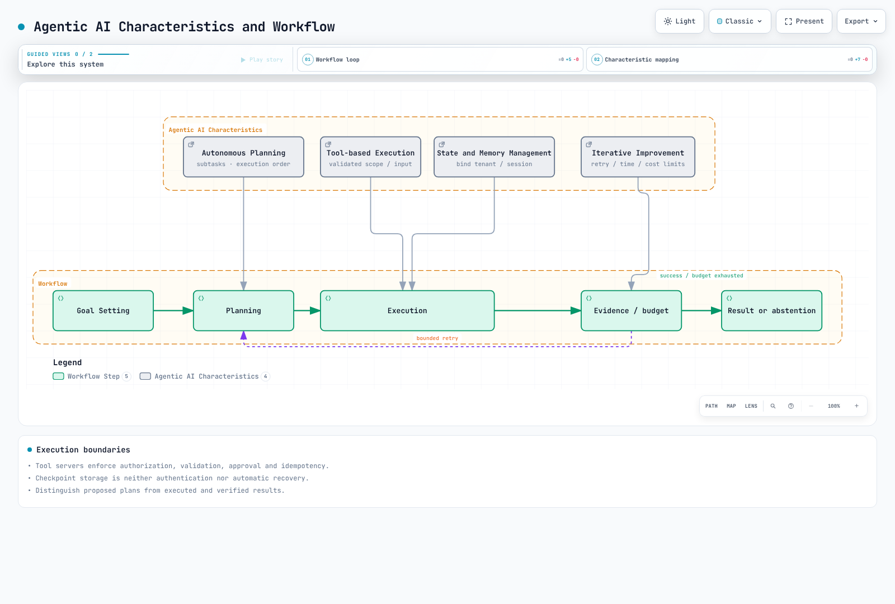

# Building an Agentic AI Platform on EKS

> **Review baseline**: Kagent 0.10.1 / Gateway Inference Extension 1.6.1 / LangGraph 1.2.11 / Langfuse SDK 4.15.2
> **Last Updated**: September 12, 2026

Agentic AI goes beyond simple question-answering to autonomously create plans, use tools, and iteratively achieve goals. This chapter covers how to design an Agentic AI platform and its operating boundaries on EKS.

## 1. Agentic AI Platform Overview

### What is Agentic AI?

Agentic AI is an autonomous AI system with the following characteristics:



[🔍 View interactive diagram](https://www.atomai.click/kubernetes-docs/archmaps/en-ai-ml-03-agentic-ai-platform-0.html)

1. **Autonomous Planning**: Decomposes complex tasks into subtasks and determines execution order.
2. **Tool-based Execution**: Utilizes various tools including external APIs, databases, and code executors.
3. **Iterative Improvement**: Evaluates execution results and modifies plans as needed.
4. **State Management**: Maintains state and memory for long-running tasks.

### When to Choose Kubernetes

Kubernetes provides the following core capabilities for Agentic AI platforms:

| Requirement | Kubernetes Solution |
|-------------|---------------------|
| GPU Orchestration | Device Plugin, GPU Operator, MIG |
| Auto Scaling | HPA, VPA, Karpenter |
| Multi-tenant Isolation | RBAC, Namespace, enforced NetworkPolicy, workload identity |
| High Availability | replicas, probes, placement and recovery tests |
| Service Mesh | configured gateway/mesh implementation |
| Cost Optimization | Spot instances, Node consolidation |

### Four Key Technical Challenges

Key challenges to solve when building an Agentic AI platform:


[🔍 View interactive diagram](https://www.atomai.click/kubernetes-docs/archmaps/en-ai-ml-03-agentic-ai-platform-1.html)

---

## 2. GPU and Cost Baselines

Agents using external model APIs do not necessarily need GPUs. Self-hosted inference requires device selection based on weights/precision, KV cache, concurrency, CPU architecture and driver compatibility. Use the [reviewed GPU guide](01-ai-ml-workloads.md) and avoid duplicate driver/toolkit installation on AL2023 NVIDIA AMIs.

MIG partitions supported GPUs. Time-slicing within one MIG instance does not add memory/fault isolation between its sharing workloads; it is not a software security boundary. Likewise, 80 GB does not generally fit 70B FP16 weights.

GPU Operator Helm values are different from ConfigMap/HelmRelease resources. Passing a Flux HelmRelease as helm --values does not apply the intended settings. MIG manager ConfigMap references, profile node labels and plugin strategy must agree. device-plugin.config labels select a configuration key, not the ConfigMap name. MIG reconfiguration can disrupt workloads and was not executed in this audit.

Prices need region/OS/purchase mode/date and quota context. The previous unsourced hourly table and fixed savings percentages are not current pricing evidence. Compare self-hosted total GPU idle time, storage/transfer, operation and recovery cost against measured successful throughput.

## 3. Model Serving (vLLM)

### vLLM Architecture

vLLM provides high-performance LLM inference through the following core technologies:


[🔍 View interactive diagram](https://www.atomai.click/kubernetes-docs/archmaps/en-ai-ml-03-agentic-ai-platform-2.html)

### Reviewed Serving Path

Use the [current vLLM guide](02-vllm-deployment.md) for 0.29.0 image/model revisions, startup probes, private Service and actual CLI options. A single-GPU NodePool cannot place the former four-GPU/200Gi Pod. Distinguish TP/PP groups from independent replicas and calculate memory needs.

Prefix cache reuses supported KV prefixes, not full responses. GPU memory utilization is not solely a KV-cache fraction, and swap-space is absent from current CLI. llm-d disaggregation is not two invented prefill/decode images with role arguments; validate its real release's model server, KV connector, scheduler, gateway and hardware/network combination.

## 4. Inference Gateway

### Gateway API-based AI Workload Routing

Extending the Kubernetes Gateway API to efficiently route AI inference workloads.

### Kgateway + InferencePool Architecture


[🔍 View interactive diagram](https://www.atomai.click/kubernetes-docs/archmaps/en-ai-ml-03-agentic-ai-platform-3.html)

#### InferencePool v1

Gateway API and Gateway API Inference Extension are separate APIs. Extension 1.6.1 uses inference.networking.k8s.io/v1 with targetPorts and endpointPickerRef. The former invented EndpointPicker CRD/endpointPickerConfig is not this schema.

This schema-checked example requires the EPP Service on 9002, model Pods and a supporting gateway controller. InferencePool alone does not configure authentication, rate limits or a prefix-aware selection algorithm.

```yaml
apiVersion: inference.networking.k8s.io/v1
kind: InferencePool
metadata:
  name: model-pool
  namespace: ai-inference
spec:
  selector:
    matchLabels:
      app: vllm-demo
  targetPorts:
    - number: 8000
  endpointPickerRef:
    name: model-epp
    kind: Service
    group: ""
    port:
      number: 9002
    failureMode: FailClose
```

The selector only matches same-namespace Pods. EndpointPickerRef defaults to a Service reference and FailClose. Validate HTTPRoute, EPP configuration/version support, TLS and gateway status together. API definitions or Kgateway installation do not enable every plugin capability.

### LiteLLM 1.100.1 Provider Gateway

LiteLLM provider adaptation and InferencePool endpoint selection are different layers. Provider APIs differ in paths, authentication, payloads, responses and streaming; forwarding OpenAI JSON unchanged to an Anthropic endpoint is not a valid adapter.

The current Router fallback shape is below. Wire proxy command/args to the actual config file and separately supply Redis/database, credentials and callbacks where needed.

```yaml
model_list:
  - model_name: local-primary
    litellm_params:
      model: openai/qwen3-demo
      api_base: http://vllm-demo.ml-inference:8000/v1
  - model_name: local-fallback
    litellm_params:
      model: openai/qwen3-demo
      api_base: http://vllm-secondary.ml-inference:8000/v1
router_settings:
  fallbacks:
    - local-primary: [local-fallback]
  num_retries: 0
```

This illustrates configuration, requiring prepared endpoints and authentication. Give application clients scoped credentials rather than the master key. External fallback is a data-egress path: enforce tenant provider/data policy before routing. A model-selected name or client header must not bypass it.


## 5. RAG Data and Retrieval Boundaries

The latest inspected Milvus release is 3.0.1; the separately reviewed Operator 1.3.9 defaults to Milvus 2.6.11. They are not one version, and a broad compatibility table is not proof of a tested 3.x upgrade. The operator repository is https://zilliztech.github.io/milvus-operator/, separate from the ordinary Milvus chart repository.

Vector dimensions must match actual embedding output. Record revision, dimensions options, tokenizer, normalization and distance metric for ingestion and queries. Index parameters differ; HNSW M/efConstruction cannot simply be reused for GPU_IVF_FLAT. GPU indexing needs compatible images, version, devices and component roles; requesting a GPU on indexNode is not automatic acceleration.

A tenant_id field alone does not enforce isolation. Derive scope from authenticated identity, apply server-side retrieval filters and validate returned documents. Manage document deletion/change and embedding-version lifecycle too.

### Chunking and Hybrid Search

Current splitter imports use langchain_text_splitters. RecursiveCharacterTextSplitter chunk_size defaults to characters, not tokens. Token splitting must match the embedding model's tokenizer and actual input limit. Semantic chunking adds embedding calls/cost and does not guarantee better quality.

Hybrid search requires fusion such as RRF or calibrated scores, not merely two searches, with identical authorization filters. Evaluate recall, precision and latency. Bound retries and abstain when evidence is absent instead of always generating after retry exhaustion.


## 6. AI Agent Deployment (Kagent)

### Kagent Overview

Kagent is a Kubernetes-native AI agent lifecycle management tool.


[🔍 View interactive diagram](https://www.atomai.click/kubernetes-docs/archmaps/en-ai-ml-03-agentic-ai-platform-4.html)

### Kagent 0.10.1 Agent API

Kagent is not limited to automatic kubectl execution. Declarative agents use Go/Python ADK runtimes; BYO hosts a user-provided A2A agent. LangGraph is a separately integrated workflow framework, not the same runtime as Kagent.

This Agent references separately approved/configured same-namespace ModelConfig and RemoteMCPServer resources. Supply the actual MCP service/search_documents tool, authentication, TLS and data permissions. It neither creates the tool nor grants Kubernetes write access.

```yaml
apiVersion: kagent.dev/v1alpha2
kind: Agent
metadata:
  name: research-agent
  namespace: ai-agents
spec:
  type: Declarative
  description: Retrieves authorized documents and cites their sources
  declarative:
    runtime: go
    modelConfig: approved-internal-model
    systemMessage: 'Use approved document tools. Cite retrieved sources.

      If evidence is missing, say so. Do not execute arbitrary code.

      '
    tools:
    - type: McpServer
      mcpServer:
        apiGroup: kagent.dev
        kind: RemoteMCPServer
        name: document-tools
        toolNames:
        - search_documents
    deployment:
      replicas: 1
      resources:
        requests:
          cpu: 250m
          memory: 256Mi
        limits:
          cpu: '1'
          memory: 1Gi
```

ModelConfig.apiKeySecret does not imply file delivery. The inspected OpenAI translator creates an OPENAI_API_KEY SecretKeyRef environment variable. Under a no-secret-environment policy, use a verified file-credential BYO/runtime or authentication gateway path instead. Enabling apiKeyPassthrough without token-delegation/audience design is not a substitute.

An eval() calculator and invented permissions fields are not security boundaries. Implement least privilege, input validation, resource limits, approval and idempotency in the actual tool server. Agent replicas do not automatically make shared memory/session stores highly available.

### Executable LangGraph Control Flow

This local example uses the actual SDK with explicit retrieve/rewrite/generate callbacks. Its demo does not call an LLM or vector DB. It preserves the original question, limits rewrites to two and abstains without documents. The SQLite context manager is used correctly and persisted state was checked after reopening.

```python
from typing import Callable, TypedDict
from langgraph.graph import StateGraph, START, END
from langgraph.checkpoint.sqlite import SqliteSaver


class QAState(TypedDict):
    question: str
    search_query: str
    documents: list[str]
    answer: str
    retries: int


def build_graph(retrieve: Callable[[str], list[str]],
                rewrite: Callable[[str], str],
                generate: Callable[[str, list[str]], str]):
    def search(state: QAState):
        return {"documents": retrieve(state["search_query"])}

    def route(state: QAState):
        if state["documents"]:
            return "answer"
        return "rewrite" if state["retries"] < 2 else "abstain"

    def rewrite_query(state: QAState):
        return {"search_query": rewrite(state["search_query"]),
                "retries": state["retries"] + 1}

    def answer(state: QAState):
        return {"answer": generate(state["question"], state["documents"])}

    def abstain(state: QAState):
        return {"answer": "No supporting documents were found."}

    graph = StateGraph(QAState)
    graph.add_node("retrieve", search)
    graph.add_node("rewrite", rewrite_query)
    graph.add_node("answer", answer)
    graph.add_node("abstain", abstain)
    graph.add_edge(START, "retrieve")
    graph.add_conditional_edges("retrieve", route,
                               {"answer": "answer", "rewrite": "rewrite", "abstain": "abstain"})
    graph.add_edge("rewrite", "retrieve")
    graph.add_edge("answer", END)
    graph.add_edge("abstain", END)
    return graph


if __name__ == "__main__":
    # Deterministic local fixtures, not a vector database or LLM quality test.
    graph = build_graph(
        retrieve=lambda query: ["A Pod groups containers."] if query == "pod" else [],
        rewrite=lambda query: "pod",
        generate=lambda question, documents: documents[0],
    )
    initial = {"question": "What is a Pod?", "search_query": "unknown",
               "documents": [], "answer": "", "retries": 0}
    # Server-derived authorized tenant/session identity is required in a real app.
    config = {"configurable": {"thread_id": "tenant-a/session-1"}, "recursion_limit": 12}
    with SqliteSaver.from_conn_string("agent-state.sqlite") as saver:
        app = graph.compile(checkpointer=saver)
        print(app.invoke(initial, config)["answer"])
        print(app.get_state(config).values["retries"])
```

Production thread_id must be bound to authenticated tenant/session identity, with DB authorization, encryption, concurrency and retention controls. :memory: does not survive process exit. SqliteSaver cannot use a PostgreSQL DSN; use the appropriate Postgres saver. Reading get_state_history() alone does not restore execution—use checkpoint configuration and actual resume/replay semantics.

Validate supervisor output against an allowed enum and handle unknown values/budget exhaustion. Substring COMPLETE must not treat INCOMPLETE as success. Asking a model to use a tool does not itself execute or verify the tool.

## 7. Langfuse and Operational Observability

Langfuse SDK 4.15.2 replaces old trace()/generation() APIs with start_as_current_observation(), create_score() and related methods. This audit verified three retrieval/generation/parent spans in one trace using an in-memory exporter, not real server ingestion/storage/authentication.

```python
from pathlib import Path
from langfuse import Langfuse

# Read existing Secret-volume files; do not put credentials in source.
client = Langfuse(
    public_key=Path("/run/secrets/langfuse/public-key").read_text().strip(),
    secret_key=Path("/run/secrets/langfuse/secret-key").read_text().strip(),
    base_url="https://langfuse.example.internal",
)
with client.start_as_current_observation(name="rag", as_type="span"):
    with client.start_as_current_observation(name="retrieve", as_type="span") as span:
        span.update(metadata={"document_count": 2})
    with client.start_as_current_observation(name="generate", as_type="generation",
                                           model="prepared-model-alias") as generation:
        # Supply actual provider usage; these values only illustrate the shape.
        generation.update(usage_details={"input": 10, "output": 5})
client.flush()
client.shutdown()
```

Langfuse chart 2.1.0 references app 4.24.0, distinct from latest inspected server 4.35.0. Web/worker, PostgreSQL, Redis/Valkey, object storage and ClickHouse are required. The chart checks ClickHouse Operator/cert-manager prerequisites. Offline rendering supplied simulated API capability information, not a deployed operator. Default charts include secret environment delivery and are not approved file-only credential deployments.

DCGM FB_USED is a quantity, not a percentage; verify units and total memory. GPU utilization80% or temperature85C are not universal health thresholds. Observe latency/queues/errors/throttling and actual device limits together.

### Response Caches and Cost

Cache keys must capture tenant/authorization scope, model/prompt/retrieved-data revision, generation settings and relevant tool state. Shared model+prompt keys can reuse another user's result. Disable caching or define explicit expiry/invalidation for private or changing external state.

Token-price estimates are not invoices. Include cache read/write, batch, retries, routing calls and self-hosted fixed costs. Reject a cheapest-model fallback that violates budget, quality or provider policy. A KEDA cron trigger does not impose a lower nighttime cap over other triggers. Define CronJob timezone, concurrency/deadline/retry and persisted results.


## 8. Evaluation and Quality Management

Ragas 0.4.3 failed to import against resolved langchain-community 0.4.2 because it imports a removed vertexai module. In a separate environment pinned to langchain 0.3.27, core 0.3.79, community 0.3.31 and openai integration 0.3.35, imports and SingleTurnSample/EvaluationDataset construction passed. Do not assume this shares one dependency stack with current LangGraph.

Current collection APIs such as Faithfulness/AnswerRelevancy require explicit LLM/embedding adapters; old ragas.metrics singleton imports emit deprecation warnings. Evaluation needs model-call cost/failure handling, dataset/judge/prompt revisions and missing/NaN treatment. Only metric imports/schema were tested here; no quality score such as 0.92 was measured.

An A/B ConfigMap alone does not route traffic. Implement its real consumer/controller, stable assignment, equivalent authorization/data context, sufficient samples and guardrail metrics. Arbitrary model quality/pricing tables do not establish 30–50% savings.

A finance example's compliance_check function does not certify regulatory compliance. Design authenticated account scope, monotonic sensitive/approval conditions (do not overwrite true with false later), side-effect idempotency, audit and human handoff criteria.


## 9. Review Baselines and Validation Scope

| Component | Baseline | Verified scope |
| --- | --- | --- |
| Kagent |0.10.1 / v1alpha2 | Official Helm/CRDs and Agent/ModelConfig/RemoteMCPServer schemas |
| Inference Extension |1.6.1 / v1 | InferencePool schema; no live EPP/gateway |
| LiteLLM |1.100.1 | Router fallback configuration; no provider call |
| Milvus | server/SDK3.0.1; Operator 1.3.9 | Operator Helm/synthetic vector schema; no database |
| LangGraph |1.2.11 + sqlite saver 3.1.1 | Bounded retrieval, abstention and state recovery |
| Langfuse | SDK 4.15.2 / chart 2.1.0 | Local trace/spans and offline chart inspection |
| Ragas |0.4.3 | Compatible isolated imports/schema; no evaluator model calls |

Schemas, Helm and local SDK checks do not prove full-platform deployment, authentication, HA or GPU performance. No cloud resources or paid model calls were used.

## 10. Next Steps

### Practice Quiz

To verify your understanding of the Agentic AI platform, take the following quiz:
- [Agentic AI Platform Quiz](../quizzes/ai-ml/08-agentic-ai-platform-quiz.md)

### Related Documents

- [vLLM Deployment Detailed Guide](./02-vllm-deployment.md) - Detailed vLLM installation and optimization
- [AI/ML Workloads](./01-ai-ml-workloads.md) - AI/ML workload management in Kubernetes

### References

- [Kagent 0.10.1](https://github.com/kagent-dev/kagent/tree/v0.10.1)
- [InferencePool v1 API](https://github.com/kubernetes-sigs/gateway-api-inference-extension/blob/v1.6.1/api/v1/inferencepool_types.go)
- [Milvus Operator 1.3.9](https://github.com/zilliztech/milvus-operator/tree/milvus-operator-1.3.9)
- [Langfuse SDK 4.15.2](https://github.com/langfuse/langfuse-python/tree/v4.15.2)
- [Langfuse Helm2.1.0](https://github.com/langfuse/langfuse-k8s/releases/tag/langfuse-2.1.0)
- [LangGraph persistence](https://docs.langchain.com/oss/python/langgraph/persistence)
- [LiteLLM Router](https://docs.litellm.ai/docs/routing)
- [Ragas 0.4.3](https://pypi.org/project/ragas/0.4.3/)
