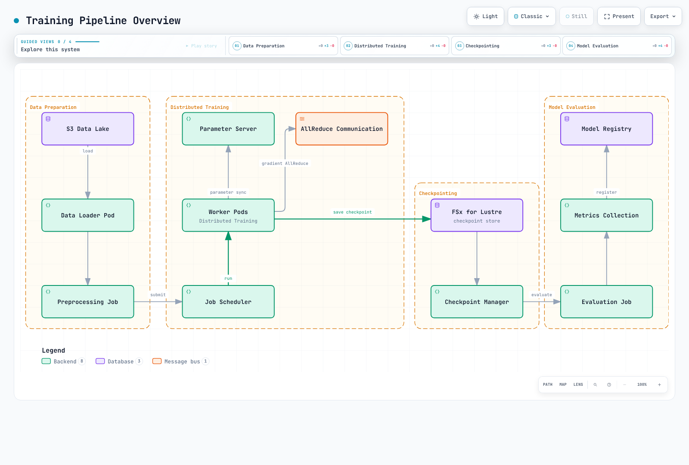

# Model Training on EKS

> **Supported Versions**: Kubernetes 1.31, 1.32, 1.33
> **Last Updated**: September 2, 2026

Model training is one of the most resource-intensive workloads in the AI/ML lifecycle. This chapter covers distributed training strategies, Slurm integration with Slinky, GPU and Trainium-based training, and best practices for running large-scale training jobs on Amazon EKS.

For a single-GPU QLoRA comparison between managed SageMaker AI and EKS, pair this chapter with the [Qwen3-30B-A3B PII fine-tuning guide](sagemaker-ai/README.md). It applies one data, source, and MLflow contract to both paths and separates unexecuted training from measured results.

## Training Pipeline Overview

A typical model training pipeline on Kubernetes involves multiple stages from data preparation to model evaluation:



[🔍 View interactive diagram](https://www.atomai.click/kubernetes-docs/archmaps/en-ai-ml-05-model-training-0.html)

## Distributed Training Strategies

Training large models requires distributing computation across multiple GPUs and nodes. Understanding the different parallelism strategies is crucial for efficient training.


[🔍 View interactive diagram](https://www.atomai.click/kubernetes-docs/archmaps/en-ai-ml-05-model-training-1.html)

### Parallelism Strategy Comparison

| Strategy | Best For | Memory Efficiency | Communication Overhead | Implementation Complexity |
|----------|----------|-------------------|----------------------|---------------------------|
| **Data Parallelism** | Models that fit in single GPU memory | Low (full model per GPU) | Medium (gradient sync) | Low |
| **Tensor Parallelism** | Large layers (attention, FFN) | High (layer split) | High (intra-layer) | Medium |
| **Pipeline Parallelism** | Very deep models | High (stages distributed) | Low (stage boundaries) | Medium |
| **Expert Parallelism** | MoE models (Mixtral, Switch) | Medium | Medium (routing) | High |
| **3D Parallelism** | 100B+ parameter models | Highest | Combined | Very High |

### Choosing the Right Strategy

```yaml
# Decision matrix for parallelism selection
# Model Size < 10B parameters, fits in single GPU
strategy: data_parallelism
reason: Simple, efficient gradient synchronization

# Model Size 10B-100B parameters
strategy: data_parallelism + tensor_parallelism
reason: Split attention layers across GPUs within node

# Model Size > 100B parameters
strategy: 3d_parallelism  # DP + TP + PP
reason: Combine all strategies for maximum efficiency
```

## Slurm on EKS with Slinky

Slinky brings the familiar Slurm workload manager to Kubernetes, enabling HPC-style job scheduling for AI/ML training workloads.

### Slinky Architecture


[🔍 View interactive diagram](https://www.atomai.click/kubernetes-docs/archmaps/en-ai-ml-05-model-training-2.html)

### Slinky Components

| Component | Description | Kubernetes Resource |
|-----------|-------------|---------------------|
| **slurmctld** | Central controller managing jobs, partitions, and resources | StatefulSet with PVC |
| **slurmdbd** | Database daemon for job accounting and cluster state | StatefulSet with MySQL/MariaDB |
| **slurmd** | Compute daemon running on each worker node | DaemonSet on GPU nodes |
| **slurmrestd** | REST API for programmatic job submission | Deployment with Service |
| **Login Pod** | SSH access point for users to submit jobs | Pod with NLB exposure |

### Slinky CRDs

Slinky introduces Custom Resource Definitions for managing Slurm clusters:

```yaml
# SlurmCluster CRD - Defines the overall Slurm cluster configuration
apiVersion: slinky.slurm.net/v1alpha1
kind: SlurmCluster
metadata:
  name: ml-training-cluster
  namespace: slurm
spec:
  clusterName: ml-cluster

  # Controller configuration
  controller:
    replicas: 1
    image: schedmd/slurmctld:24.05
    resources:
      requests:
        cpu: "2"
        memory: "4Gi"
      limits:
        cpu: "4"
        memory: "8Gi"
    persistence:
      storageClass: gp3
      size: 50Gi

  # Database configuration
  database:
    type: mariadb
    persistence:
      storageClass: gp3
      size: 100Gi

  # REST API configuration
  restApi:
    enabled: true
    replicas: 2

  # Shared storage configuration
  sharedStorage:
    type: fsx-lustre
    fileSystemId: fs-0123456789abcdef0
    mountPath: /shared
---
# SlurmNodeSet CRD - Defines compute node groups (partitions)
apiVersion: slinky.slurm.net/v1alpha1
kind: SlurmNodeSet
metadata:
  name: gpu-a100-nodes
  namespace: slurm
spec:
  clusterRef:
    name: ml-training-cluster

  partition: gpu-a100
  nodeCount: 4

  nodeTemplate:
    instanceType: p4d.24xlarge
    image: schedmd/slurmd:24.05

    # GPU configuration
    gpus:
      type: nvidia-a100
      count: 8
      mig: false

    # Resource allocation
    resources:
      cpus: 96
      memory: 1152Gi
      gpuMemory: 320Gi  # 8x 40GB A100

    # Node features for Slurm GRES
    features:
      - a100
      - nvlink
      - efa

    # Placement for low-latency communication
    placement:
      groupName: ml-cluster-pg
      strategy: cluster

  # Karpenter integration for auto-scaling
  autoscaling:
    enabled: true
    minNodes: 0
    maxNodes: 16
    scaleDownDelay: 300s
    nodePoolRef:
      name: gpu-a100-nodepool
```

### Deploying Slinky with ArgoCD

```yaml
# ArgoCD Application for Slinky deployment
apiVersion: argoproj.io/v1alpha1
kind: Application
metadata:
  name: slinky-slurm
  namespace: argocd
spec:
  project: ml-infrastructure

  source:
    repoURL: https://github.com/your-org/ml-platform
    targetRevision: main
    path: clusters/production/slurm

    helm:
      values: |
        cluster:
          name: ml-training

        controller:
          nodeSelector:
            node.kubernetes.io/instance-type: m6i.2xlarge

        compute:
          partitions:
            - name: gpu-a100
              nodeType: p4d.24xlarge
              maxNodes: 16
            - name: gpu-h100
              nodeType: p5.48xlarge
              maxNodes: 8
            - name: trainium
              nodeType: trn1.32xlarge
              maxNodes: 32

        storage:
          fsxLustre:
            fileSystemId: fs-0123456789abcdef0
            capacity: 4800Gi

        networking:
          efa:
            enabled: true

  destination:
    server: https://kubernetes.default.svc
    namespace: slurm

  syncPolicy:
    automated:
      prune: true
      selfHeal: true
    syncOptions:
      - CreateNamespace=true
```

### Karpenter NodePool for GPU Auto-scaling

```yaml
# Karpenter NodePool for Slurm GPU nodes
apiVersion: karpenter.sh/v1
kind: NodePool
metadata:
  name: gpu-a100-nodepool
spec:
  template:
    metadata:
      labels:
        slurm.schedmd.com/partition: gpu-a100
        node-type: gpu-training
    spec:
      requirements:
        - key: node.kubernetes.io/instance-type
          operator: In
          values:
            - p4d.24xlarge
            - p4de.24xlarge
        - key: karpenter.sh/capacity-type
          operator: In
          values:
            - on-demand  # Use on-demand for training stability
        - key: topology.kubernetes.io/zone
          operator: In
          values:
            - us-west-2a  # Single AZ for EFA

      nodeClassRef:
        group: karpenter.k8s.aws
        kind: EC2NodeClass
        name: gpu-a100-class

      # Taints to ensure only Slurm workloads run here
      taints:
        - key: nvidia.com/gpu
          value: "true"
          effect: NoSchedule
        - key: slurm.schedmd.com/partition
          value: gpu-a100
          effect: NoSchedule

  limits:
    nvidia.com/gpu: 128  # Max 16 nodes * 8 GPUs

  disruption:
    consolidationPolicy: WhenEmpty
    consolidateAfter: 10m
    budgets:
      - nodes: "0"  # Don't disrupt running training jobs
---
apiVersion: karpenter.k8s.aws/v1
kind: EC2NodeClass
metadata:
  name: gpu-a100-class
spec:
  amiFamily: AL2

  subnetSelectorTerms:
    - tags:
        karpenter.sh/discovery: ml-cluster
        network-type: efa-enabled

  securityGroupSelectorTerms:
    - tags:
        karpenter.sh/discovery: ml-cluster

  # EFA configuration for high-speed networking
  instanceStorePolicy: RAID0

  # Block device configuration
  blockDeviceMappings:
    - deviceName: /dev/xvda
      ebs:
        volumeSize: 500Gi
        volumeType: gp3
        iops: 10000
        throughput: 500
        encrypted: true

  # User data for GPU and EFA setup
  userData: |
    #!/bin/bash
    set -ex

    # Install EFA driver
    curl -O https://efa-installer.amazonaws.com/aws-efa-installer-latest.tar.gz
    tar -xf aws-efa-installer-latest.tar.gz
    cd aws-efa-installer && ./efa_installer.sh -y

    # Configure NVIDIA persistence mode
    nvidia-smi -pm 1

    # Set GPU clock speeds for consistent performance
    nvidia-smi -ac 1215,1410

  tags:
    Environment: production
    Workload: ml-training
```

### Submitting Jobs to Slurm

```bash
#!/bin/bash
# Example Slurm job script for distributed PyTorch training

#SBATCH --job-name=llama3-finetune
#SBATCH --partition=gpu-a100
#SBATCH --nodes=4
#SBATCH --ntasks-per-node=8
#SBATCH --gpus-per-node=8
#SBATCH --cpus-per-task=12
#SBATCH --mem=1100G
#SBATCH --time=48:00:00
#SBATCH --output=/shared/logs/%x-%j.out
#SBATCH --error=/shared/logs/%x-%j.err

# Load required modules
module load cuda/12.1
module load nccl/2.18

# Set environment variables
export MASTER_ADDR=$(scontrol show hostname $SLURM_NODELIST | head -n 1)
export MASTER_PORT=29500
export WORLD_SIZE=$((SLURM_NNODES * SLURM_NTASKS_PER_NODE))
export NCCL_DEBUG=INFO
export NCCL_IB_DISABLE=1
export NCCL_SOCKET_IFNAME=eth0

# Run distributed training
srun --ntasks=$WORLD_SIZE \
     --ntasks-per-node=$SLURM_NTASKS_PER_NODE \
     torchrun \
     --nnodes=$SLURM_NNODES \
     --nproc_per_node=$SLURM_NTASKS_PER_NODE \
     --rdzv_id=$SLURM_JOB_ID \
     --rdzv_backend=c10d \
     --rdzv_endpoint=$MASTER_ADDR:$MASTER_PORT \
     train_llama.py \
     --model_name_or_path meta-llama/Llama-3-70B \
     --dataset_path /shared/data/finetune-dataset \
     --output_dir /shared/checkpoints/llama3-finetuned \
     --per_device_train_batch_size 1 \
     --gradient_accumulation_steps 8 \
     --learning_rate 2e-5 \
     --num_train_epochs 3 \
     --bf16 \
     --deepspeed configs/ds_config_zero3.json
```

## Training on NVIDIA GPUs

NVIDIA GPUs remain the primary choice for AI/ML training. Proper configuration of NCCL, EFA, and multi-node communication is essential for performance.

### NCCL Configuration for Multi-Node Training

```yaml
apiVersion: kubeflow.org/v1
kind: MPIJob
metadata:
  name: bert-large-training
  namespace: training
spec:
  slotsPerWorker: 8
  runPolicy:
    cleanPodPolicy: Running
    ttlSecondsAfterFinished: 86400

  mpiReplicaSpecs:
    Launcher:
      replicas: 1
      template:
        spec:
          containers:
            - name: mpi-launcher
              image: 763104351884.dkr.ecr.us-west-2.amazonaws.com/pytorch-training:2.1.0-gpu-py310-cu121-ubuntu20.04-ec2
              command:
                - mpirun
                - --allow-run-as-root
                - -np
                - "32"
                - -bind-to
                - none
                - -map-by
                - slot
                - -x
                - NCCL_DEBUG=INFO
                - -x
                - NCCL_ALGO=Ring
                - -x
                - NCCL_PROTO=Simple
                - -x
                - FI_PROVIDER=efa
                - -x
                - FI_EFA_USE_DEVICE_RDMA=1
                - -x
                - RDMAV_FORK_SAFE=1
                - python
                - /workspace/train_bert.py
                - --model_name=bert-large-uncased
                - --batch_size=32
                - --learning_rate=3e-5
              resources:
                limits:
                  cpu: "4"
                  memory: "16Gi"

    Worker:
      replicas: 4
      template:
        spec:
          containers:
            - name: mpi-worker
              image: 763104351884.dkr.ecr.us-west-2.amazonaws.com/pytorch-training:2.1.0-gpu-py310-cu121-ubuntu20.04-ec2
              resources:
                limits:
                  nvidia.com/gpu: 8
                  vpc.amazonaws.com/efa: 4
                  memory: "1100Gi"
                  cpu: "96"
              volumeMounts:
                - name: shared-storage
                  mountPath: /shared
                - name: shm
                  mountPath: /dev/shm
          volumes:
            - name: shared-storage
              persistentVolumeClaim:
                claimName: fsx-lustre-pvc
            - name: shm
              emptyDir:
                medium: Memory
                sizeLimit: 64Gi

          # Node placement for EFA
          affinity:
            nodeAffinity:
              requiredDuringSchedulingIgnoredDuringExecution:
                nodeSelectorTerms:
                  - matchExpressions:
                      - key: node.kubernetes.io/instance-type
                        operator: In
                        values:
                          - p4d.24xlarge
                          - p4de.24xlarge
```

### EFA Networking Configuration

```yaml
# EFA Device Plugin DaemonSet
apiVersion: apps/v1
kind: DaemonSet
metadata:
  name: aws-efa-k8s-device-plugin
  namespace: kube-system
spec:
  selector:
    matchLabels:
      name: aws-efa-k8s-device-plugin
  template:
    metadata:
      labels:
        name: aws-efa-k8s-device-plugin
    spec:
      tolerations:
        - key: nvidia.com/gpu
          operator: Exists
          effect: NoSchedule
      priorityClassName: system-node-critical
      containers:
        - name: aws-efa-k8s-device-plugin
          image: 602401143452.dkr.ecr.us-west-2.amazonaws.com/eks/aws-efa-k8s-device-plugin:v0.4.4
          securityContext:
            allowPrivilegeEscalation: false
            capabilities:
              drop:
                - ALL
          volumeMounts:
            - name: device-plugin
              mountPath: /var/lib/kubelet/device-plugins
      volumes:
        - name: device-plugin
          hostPath:
            path: /var/lib/kubelet/device-plugins
      nodeSelector:
        node.kubernetes.io/instance-type: p4d.24xlarge
```

### NVIDIA BioNeMo on EKS

BioNeMo is NVIDIA's framework for drug discovery and molecular modeling:

```yaml
apiVersion: batch/v1
kind: Job
metadata:
  name: bionemo-molecule-generation
  namespace: ai-research
spec:
  backoffLimit: 2
  template:
    spec:
      restartPolicy: OnFailure
      containers:
        - name: bionemo
          image: nvcr.io/nvidia/clara/bionemo-framework:1.5
          command:
            - python
            - -m
            - bionemo.model.molecule.megamolbart.infer
            - --config-path=/configs
            - --config-name=megamolbart_inference
          env:
            - name: CUDA_VISIBLE_DEVICES
              value: "0,1,2,3,4,5,6,7"
            - name: NVIDIA_VISIBLE_DEVICES
              value: "all"
          resources:
            limits:
              nvidia.com/gpu: 8
              memory: "500Gi"
              cpu: "48"
          volumeMounts:
            - name: model-cache
              mountPath: /models
            - name: data
              mountPath: /data
            - name: configs
              mountPath: /configs
            - name: shm
              mountPath: /dev/shm
      volumes:
        - name: model-cache
          persistentVolumeClaim:
            claimName: bionemo-models-pvc
        - name: data
          persistentVolumeClaim:
            claimName: molecule-data-pvc
        - name: configs
          configMap:
            name: bionemo-inference-config
        - name: shm
          emptyDir:
            medium: Memory
            sizeLimit: 32Gi
      nodeSelector:
        node.kubernetes.io/instance-type: p4d.24xlarge
      tolerations:
        - key: nvidia.com/gpu
          operator: Exists
          effect: NoSchedule
```

## Training on AWS Trainium/Neuron

AWS Trainium chips offer cost-effective training for large models. The Neuron SDK provides PyTorch and TensorFlow integration.

### Neuron SDK Components

| Component | Description | Purpose |
|-----------|-------------|---------|
| **Neuron Compiler** | XLA-based compiler | Optimizes models for Neuron hardware |
| **Neuron Runtime** | Execution runtime | Manages Neuron devices and execution |
| **Neuron Tools** | Profiling and debugging | neuron-top, neuron-monitor, neuron-profile |
| **torch-neuronx** | PyTorch integration | Native PyTorch API for Trainium |
| **transformers-neuronx** | HuggingFace integration | Optimized transformers for Neuron |
| **optimum-neuron** | HuggingFace Optimum | High-level training and inference APIs |

### Supported Frameworks and Models

```yaml
# Neuron-supported frameworks and versions
frameworks:
  pytorch:
    versions: ["2.1", "2.0", "1.13"]
    package: torch-neuronx
    models:
      - BERT, RoBERTa, DistilBERT
      - GPT-2, GPT-NeoX, GPT-J
      - Llama 2, Llama 3
      - T5, FLAN-T5
      - Stable Diffusion, SDXL

  tensorflow:
    versions: ["2.10"]
    package: tensorflow-neuronx
    models:
      - BERT, DistilBERT
      - ResNet, EfficientNet
      - Custom models via SavedModel

  jax:
    versions: ["0.4"]
    package: jax-neuronx
    models:
      - Custom JAX models
      - Flax-based models
```

### Llama 3 LoRA Fine-tuning on Trainium

```yaml
apiVersion: batch/v1
kind: Job
metadata:
  name: llama3-lora-finetune
  namespace: training
spec:
  parallelism: 4
  completions: 4
  template:
    metadata:
      labels:
        app: llama3-training
        training-type: lora
    spec:
      restartPolicy: OnFailure

      initContainers:
        # Download model and dataset
        - name: setup
          image: amazon/aws-cli:latest
          command:
            - /bin/bash
            - -c
            - |
              aws s3 sync s3://my-bucket/llama3-70b /shared/models/llama3-70b
              aws s3 sync s3://my-bucket/training-data /shared/data
          volumeMounts:
            - name: shared-storage
              mountPath: /shared

      containers:
        - name: trainer
          image: 763104351884.dkr.ecr.us-west-2.amazonaws.com/pytorch-training-neuronx:2.1.0-neuronx-py310-sdk2.18.0-ubuntu20.04
          command:
            - neuron_parallel_compile
            - torchrun
            - --nproc_per_node=32
            - --nnodes=4
            - --node_rank=$(JOB_COMPLETION_INDEX)
            - --master_addr=$(MASTER_ADDR)
            - --master_port=29500
            - train_lora.py
          args:
            - --model_id=/shared/models/llama3-70b
            - --dataset_path=/shared/data/instruct-dataset
            - --output_dir=/shared/checkpoints/llama3-lora
            - --lora_rank=16
            - --lora_alpha=32
            - --lora_dropout=0.1
            - --target_modules=q_proj,k_proj,v_proj,o_proj
            - --per_device_train_batch_size=1
            - --gradient_accumulation_steps=16
            - --learning_rate=2e-4
            - --num_train_epochs=3
            - --warmup_ratio=0.03
            - --bf16
            - --gradient_checkpointing
            - --save_strategy=steps
            - --save_steps=500
          env:
            - name: NEURON_RT_NUM_CORES
              value: "32"
            - name: NEURON_CC_FLAGS
              value: "--model-type transformer --distribution-strategy llm-training"
            - name: XLA_USE_BF16
              value: "1"
            - name: MASTER_ADDR
              valueFrom:
                fieldRef:
                  fieldPath: status.podIP
            - name: JOB_COMPLETION_INDEX
              valueFrom:
                fieldRef:
                  fieldPath: metadata.annotations['batch.kubernetes.io/job-completion-index']
          resources:
            limits:
              aws.amazon.com/neuron: 16  # 16 Trainium chips = trn1.32xlarge
              memory: "500Gi"
              cpu: "128"
            requests:
              aws.amazon.com/neuron: 16
              memory: "450Gi"
              cpu: "120"
          volumeMounts:
            - name: shared-storage
              mountPath: /shared
            - name: neuron-cache
              mountPath: /var/tmp/neuron-compile-cache

      volumes:
        - name: shared-storage
          persistentVolumeClaim:
            claimName: fsx-lustre-pvc
        - name: neuron-cache
          emptyDir:
            sizeLimit: 100Gi

      nodeSelector:
        node.kubernetes.io/instance-type: trn1.32xlarge

      tolerations:
        - key: aws.amazon.com/neuron
          operator: Exists
          effect: NoSchedule
```

### BERT-Large Training on Trainium with NeuronX Distributed

```python
# train_bert_neuronx.py - Example training script
import os
import torch
import torch_neuronx
from torch.utils.data import DataLoader
from transformers import BertForPreTraining, BertTokenizer
from optimum.neuron import NeuronTrainer, NeuronTrainingArguments
from optimum.neuron.distributed import lazy_load_for_parallelism

# Initialize distributed training
torch.distributed.init_process_group(backend='xla')
world_size = torch.distributed.get_world_size()
rank = torch.distributed.get_rank()

# Load model with tensor parallelism
with lazy_load_for_parallelism(tensor_parallel_size=8):
    model = BertForPreTraining.from_pretrained(
        "bert-large-uncased",
        torch_dtype=torch.bfloat16
    )

# Configure training arguments
training_args = NeuronTrainingArguments(
    output_dir="/shared/checkpoints/bert-large",
    per_device_train_batch_size=16,
    gradient_accumulation_steps=4,
    learning_rate=1e-4,
    num_train_epochs=3,
    warmup_steps=1000,
    weight_decay=0.01,
    logging_steps=100,
    save_steps=1000,
    bf16=True,
    tensor_parallel_size=8,
    pipeline_parallel_size=1,
    zero_1=True,
)

# Create trainer
trainer = NeuronTrainer(
    model=model,
    args=training_args,
    train_dataset=train_dataset,
    tokenizer=tokenizer,
)

# Start training
trainer.train()
```

### Trainium Node Configuration

```yaml
# Karpenter NodePool for Trainium instances
apiVersion: karpenter.sh/v1
kind: NodePool
metadata:
  name: trainium-nodepool
spec:
  template:
    metadata:
      labels:
        accelerator-type: trainium
        node-type: ml-training
    spec:
      requirements:
        - key: node.kubernetes.io/instance-type
          operator: In
          values:
            - trn1.32xlarge
            - trn1n.32xlarge  # Enhanced networking
        - key: karpenter.sh/capacity-type
          operator: In
          values:
            - on-demand
        - key: topology.kubernetes.io/zone
          operator: In
          values:
            - us-east-1a

      nodeClassRef:
        group: karpenter.k8s.aws
        kind: EC2NodeClass
        name: trainium-class

      taints:
        - key: aws.amazon.com/neuron
          value: "true"
          effect: NoSchedule

  limits:
    aws.amazon.com/neuron: 256  # Max 16 nodes * 16 chips

  disruption:
    consolidationPolicy: WhenEmpty
    consolidateAfter: 15m
---
apiVersion: karpenter.k8s.aws/v1
kind: EC2NodeClass
metadata:
  name: trainium-class
spec:
  amiFamily: AL2
  amiSelectorTerms:
    - id: ami-0123456789abcdef0  # Neuron-optimized AMI

  subnetSelectorTerms:
    - tags:
        karpenter.sh/discovery: ml-cluster

  securityGroupSelectorTerms:
    - tags:
        karpenter.sh/discovery: ml-cluster

  blockDeviceMappings:
    - deviceName: /dev/xvda
      ebs:
        volumeSize: 500Gi
        volumeType: gp3
        iops: 10000
        encrypted: true

  userData: |
    #!/bin/bash
    # Install Neuron drivers and tools
    . /etc/os-release
    sudo tee /etc/yum.repos.d/neuron.repo > /dev/null <<EOF
    [neuron]
    name=Neuron YUM Repository
    baseurl=https://yum.repos.neuron.amazonaws.com
    enabled=1
    metadata_expire=0
    EOF
    sudo rpm --import https://yum.repos.neuron.amazonaws.com/GPG-PUB-KEY-AMAZON-AWS-NEURON.PUB
    sudo yum install -y aws-neuronx-runtime-lib aws-neuronx-collectives

    # Increase ulimits for Neuron
    echo "* soft nofile 65535" | sudo tee -a /etc/security/limits.conf
    echo "* hard nofile 65535" | sudo tee -a /etc/security/limits.conf
```

## Training Infrastructure Components

### KubeRay with RayTrain for Distributed Training

```yaml
apiVersion: ray.io/v1
kind: RayCluster
metadata:
  name: raytrain-cluster
  namespace: training
spec:
  rayVersion: '2.9.0'

  headGroupSpec:
    rayStartParams:
      dashboard-host: '0.0.0.0'
      num-cpus: '0'
    template:
      spec:
        containers:
          - name: ray-head
            image: rayproject/ray-ml:2.9.0-py310-gpu
            ports:
              - containerPort: 6379
                name: gcs
              - containerPort: 8265
                name: dashboard
              - containerPort: 10001
                name: client
            resources:
              limits:
                cpu: "8"
                memory: "32Gi"
              requests:
                cpu: "4"
                memory: "16Gi"

  workerGroupSpecs:
    - groupName: gpu-workers
      replicas: 4
      minReplicas: 1
      maxReplicas: 16
      rayStartParams:
        num-gpus: '8'
      template:
        spec:
          containers:
            - name: ray-worker
              image: rayproject/ray-ml:2.9.0-py310-gpu
              resources:
                limits:
                  nvidia.com/gpu: 8
                  memory: "500Gi"
                  cpu: "96"
              volumeMounts:
                - name: shared-storage
                  mountPath: /shared
          volumes:
            - name: shared-storage
              persistentVolumeClaim:
                claimName: fsx-lustre-pvc
          nodeSelector:
            node.kubernetes.io/instance-type: p4d.24xlarge
          tolerations:
            - key: nvidia.com/gpu
              operator: Exists
              effect: NoSchedule
```

```python
# ray_train_example.py - RayTrain distributed training
import ray
from ray import train
from ray.train.torch import TorchTrainer
from ray.train import ScalingConfig, RunConfig, CheckpointConfig

def train_loop_per_worker(config):
    import torch
    from transformers import AutoModelForCausalLM, AutoTokenizer, Trainer, TrainingArguments

    # Get distributed context
    world_size = train.get_context().get_world_size()
    rank = train.get_context().get_world_rank()

    # Load model
    model = AutoModelForCausalLM.from_pretrained(
        config["model_name"],
        torch_dtype=torch.bfloat16
    )

    # Training loop
    for epoch in range(config["epochs"]):
        # ... training logic ...

        # Report metrics to Ray
        train.report({"loss": loss, "epoch": epoch})

        # Save checkpoint
        if rank == 0:
            with train.get_checkpoint() as checkpoint:
                torch.save(model.state_dict(), checkpoint.path / "model.pt")

# Configure trainer
trainer = TorchTrainer(
    train_loop_per_worker,
    train_loop_config={
        "model_name": "meta-llama/Llama-3-8B",
        "epochs": 3,
        "learning_rate": 2e-5,
    },
    scaling_config=ScalingConfig(
        num_workers=4,
        use_gpu=True,
        resources_per_worker={"GPU": 8, "CPU": 24},
    ),
    run_config=RunConfig(
        name="llama3-training",
        storage_path="/shared/ray-results",
        checkpoint_config=CheckpointConfig(
            num_to_keep=3,
            checkpoint_frequency=100,
        ),
    ),
)

result = trainer.fit()
```

### MPI Operator for Traditional HPC Workloads

```yaml
# Install MPI Operator
apiVersion: v1
kind: Namespace
metadata:
  name: mpi-operator
---
apiVersion: apps/v1
kind: Deployment
metadata:
  name: mpi-operator
  namespace: mpi-operator
spec:
  replicas: 1
  selector:
    matchLabels:
      app: mpi-operator
  template:
    metadata:
      labels:
        app: mpi-operator
    spec:
      serviceAccountName: mpi-operator
      containers:
        - name: mpi-operator
          image: mpioperator/mpi-operator:v0.4.0
          args:
            - --gpus-per-node=8
            - --kubectl-delivery-image=mpioperator/kubectl-delivery:v0.4.0
          imagePullPolicy: Always
```

### Volcano Scheduler for Gang Scheduling

```yaml
# Volcano configuration for ML training
apiVersion: scheduling.volcano.sh/v1beta1
kind: Queue
metadata:
  name: ml-training-queue
spec:
  weight: 100
  capability:
    nvidia.com/gpu: 128
    cpu: "1000"
    memory: "8000Gi"
---
apiVersion: batch.volcano.sh/v1alpha1
kind: Job
metadata:
  name: distributed-training
  namespace: training
spec:
  minAvailable: 4  # Gang scheduling: all 4 pods must be scheduled together
  schedulerName: volcano
  queue: ml-training-queue

  policies:
    - event: PodEvicted
      action: RestartJob
    - event: PodFailed
      action: RestartJob

  tasks:
    - name: worker
      replicas: 4
      template:
        spec:
          containers:
            - name: pytorch
              image: pytorch/pytorch:2.1.0-cuda12.1-cudnn8-runtime
              command:
                - torchrun
                - --nproc_per_node=8
                - --nnodes=4
                - train.py
              resources:
                limits:
                  nvidia.com/gpu: 8
```

### JupyterHub for Interactive Training Development

```yaml
# JupyterHub with GPU support
apiVersion: v1
kind: ConfigMap
metadata:
  name: jupyterhub-config
  namespace: jupyter
data:
  jupyterhub_config.py: |
    c.JupyterHub.spawner_class = 'kubespawner.KubeSpawner'

    # GPU profile
    c.KubeSpawner.profile_list = [
        {
            'display_name': 'GPU Development (1x A100)',
            'kubespawner_override': {
                'image': 'jupyter/tensorflow-notebook:latest',
                'extra_resource_limits': {'nvidia.com/gpu': '1'},
                'node_selector': {'node.kubernetes.io/instance-type': 'g5.xlarge'},
            }
        },
        {
            'display_name': 'Multi-GPU Development (8x A100)',
            'kubespawner_override': {
                'image': 'jupyter/tensorflow-notebook:latest',
                'extra_resource_limits': {'nvidia.com/gpu': '8'},
                'node_selector': {'node.kubernetes.io/instance-type': 'p4d.24xlarge'},
                'volumes': [
                    {
                        'name': 'shared-storage',
                        'persistentVolumeClaim': {'claimName': 'fsx-lustre-pvc'}
                    }
                ],
                'volume_mounts': [
                    {'name': 'shared-storage', 'mountPath': '/shared'}
                ]
            }
        },
        {
            'display_name': 'Trainium Development (16x Trainium)',
            'kubespawner_override': {
                'image': '763104351884.dkr.ecr.us-west-2.amazonaws.com/pytorch-training-neuronx:2.1.0',
                'extra_resource_limits': {'aws.amazon.com/neuron': '16'},
                'node_selector': {'node.kubernetes.io/instance-type': 'trn1.32xlarge'},
            }
        },
    ]
```

## Storage for Training

### FSx for Lustre Configuration

```yaml
# FSx for Lustre file system with S3 data repository
apiVersion: fsx.services.k8s.aws/v1alpha1
kind: FileSystem
metadata:
  name: ml-training-lustre
  namespace: storage
spec:
  fileSystemType: LUSTRE
  storageCapacity: 4800
  subnetIDs:
    - subnet-0123456789abcdef0
  securityGroupIDs:
    - sg-0123456789abcdef0

  lustreConfiguration:
    deploymentType: PERSISTENT_2
    perUnitStorageThroughput: 250  # MB/s per TiB

    # S3 data repository association
    dataRepositoryAssociations:
      - fileSystemPath: /data
        dataRepositoryPath: s3://my-ml-data-bucket/training-data
        batchImportMetaDataOnCreate: true
        s3:
          autoImportPolicy:
            events:
              - NEW
              - CHANGED
          autoExportPolicy:
            events:
              - NEW
              - CHANGED
              - DELETED

      - fileSystemPath: /checkpoints
        dataRepositoryPath: s3://my-ml-data-bucket/checkpoints
        s3:
          autoExportPolicy:
            events:
              - NEW
              - CHANGED

  tags:
    - key: Environment
      value: production
    - key: Workload
      value: ml-training
---
# StorageClass for dynamic FSx provisioning
apiVersion: storage.k8s.io/v1
kind: StorageClass
metadata:
  name: fsx-lustre-sc
provisioner: fsx.csi.aws.com
parameters:
  subnetId: subnet-0123456789abcdef0
  securityGroupIds: sg-0123456789abcdef0
  deploymentType: SCRATCH_2
  perUnitStorageThroughput: "200"
volumeBindingMode: WaitForFirstConsumer
---
# PVC for FSx Lustre
apiVersion: v1
kind: PersistentVolumeClaim
metadata:
  name: fsx-lustre-pvc
  namespace: training
spec:
  accessModes:
    - ReadWriteMany
  storageClassName: fsx-lustre-sc
  resources:
    requests:
      storage: 4800Gi
```

### Amazon EFS for Shared Model Storage

```yaml
apiVersion: storage.k8s.io/v1
kind: StorageClass
metadata:
  name: efs-sc
provisioner: efs.csi.aws.com
parameters:
  provisioningMode: efs-ap
  fileSystemId: fs-0123456789abcdef0
  directoryPerms: "755"
  gidRangeStart: "1000"
  gidRangeEnd: "2000"
  basePath: "/ml-models"
---
apiVersion: v1
kind: PersistentVolumeClaim
metadata:
  name: model-storage-pvc
  namespace: training
spec:
  accessModes:
    - ReadWriteMany
  storageClassName: efs-sc
  resources:
    requests:
      storage: 1Ti
```

### Checkpoint Management

```yaml
# Checkpoint manager sidecar
apiVersion: v1
kind: ConfigMap
metadata:
  name: checkpoint-manager-config
  namespace: training
data:
  config.yaml: |
    checkpoint:
      # Local path where training writes checkpoints
      local_path: /checkpoints

      # Remote path for durable storage
      remote_path: s3://my-bucket/checkpoints

      # Sync settings
      sync_interval: 300  # seconds
      max_checkpoints: 5  # keep last N checkpoints

      # Compression
      compression: true
      compression_level: 6

      # Resumption
      auto_resume: true
      resume_from_latest: true
---
apiVersion: apps/v1
kind: Deployment
metadata:
  name: training-with-checkpoint-manager
spec:
  template:
    spec:
      containers:
        - name: trainer
          # ... training container ...
          volumeMounts:
            - name: checkpoints
              mountPath: /checkpoints

        - name: checkpoint-manager
          image: my-registry/checkpoint-manager:v1
          args:
            - --config=/config/config.yaml
            - --watch
          volumeMounts:
            - name: checkpoints
              mountPath: /checkpoints
            - name: config
              mountPath: /config

      volumes:
        - name: checkpoints
          emptyDir:
            sizeLimit: 500Gi
        - name: config
          configMap:
            name: checkpoint-manager-config
```

## Training Optimization Tips

### Mixed Precision Training

```python
# PyTorch mixed precision with torch.cuda.amp
import torch
from torch.cuda.amp import autocast, GradScaler

model = MyModel().cuda()
optimizer = torch.optim.AdamW(model.parameters(), lr=1e-4)
scaler = GradScaler()

for epoch in range(num_epochs):
    for batch in dataloader:
        optimizer.zero_grad()

        # Forward pass with automatic mixed precision
        with autocast(dtype=torch.bfloat16):
            outputs = model(batch['input_ids'])
            loss = loss_fn(outputs, batch['labels'])

        # Backward pass with gradient scaling
        scaler.scale(loss).backward()

        # Gradient clipping
        scaler.unscale_(optimizer)
        torch.nn.utils.clip_grad_norm_(model.parameters(), max_norm=1.0)

        # Optimizer step
        scaler.step(optimizer)
        scaler.update()
```

### Gradient Accumulation

```yaml
# Training configuration with gradient accumulation
apiVersion: v1
kind: ConfigMap
metadata:
  name: training-config
data:
  config.yaml: |
    training:
      # Effective batch size = micro_batch * gradient_accumulation * num_gpus
      # 1 * 32 * 64 = 2048 effective batch size
      micro_batch_size: 1
      gradient_accumulation_steps: 32

      # Memory optimization
      gradient_checkpointing: true
      activation_checkpointing_granularity: selective

      # Precision
      precision: bf16

      # Learning rate
      learning_rate: 2e-5
      lr_scheduler: cosine
      warmup_ratio: 0.03

      # Optimizer
      optimizer: adamw_torch_fused
      weight_decay: 0.01
```

### Flash Attention Configuration

```python
# Enable Flash Attention 2 in transformers
from transformers import AutoModelForCausalLM

model = AutoModelForCausalLM.from_pretrained(
    "meta-llama/Llama-3-70B",
    torch_dtype=torch.bfloat16,
    attn_implementation="flash_attention_2",  # Enable Flash Attention
    use_cache=False,  # Disable KV cache during training
)

# For custom models, use torch.nn.functional.scaled_dot_product_attention
import torch.nn.functional as F

def attention_forward(q, k, v, mask=None):
    # Uses Flash Attention automatically when available
    return F.scaled_dot_product_attention(
        q, k, v,
        attn_mask=mask,
        dropout_p=0.0 if not training else 0.1,
        is_causal=True,  # Enable causal masking optimization
    )
```

### Learning Rate Scheduling Best Practices

```python
# Cosine annealing with warmup
from torch.optim.lr_scheduler import CosineAnnealingWarmRestarts, LambdaLR

def get_cosine_schedule_with_warmup(optimizer, num_warmup_steps, num_training_steps, min_lr_ratio=0.1):
    def lr_lambda(current_step):
        if current_step < num_warmup_steps:
            # Linear warmup
            return float(current_step) / float(max(1, num_warmup_steps))

        # Cosine annealing
        progress = float(current_step - num_warmup_steps) / float(max(1, num_training_steps - num_warmup_steps))
        return max(min_lr_ratio, 0.5 * (1.0 + math.cos(math.pi * progress)))

    return LambdaLR(optimizer, lr_lambda)

# Usage
scheduler = get_cosine_schedule_with_warmup(
    optimizer,
    num_warmup_steps=1000,
    num_training_steps=100000,
    min_lr_ratio=0.1
)
```

### DeepSpeed ZeRO Configuration

```json
{
  "bf16": {
    "enabled": true
  },
  "zero_optimization": {
    "stage": 3,
    "offload_optimizer": {
      "device": "cpu",
      "pin_memory": true
    },
    "offload_param": {
      "device": "cpu",
      "pin_memory": true
    },
    "overlap_comm": true,
    "contiguous_gradients": true,
    "sub_group_size": 1e9,
    "reduce_bucket_size": "auto",
    "stage3_prefetch_bucket_size": "auto",
    "stage3_param_persistence_threshold": "auto",
    "stage3_max_live_parameters": 1e9,
    "stage3_max_reuse_distance": 1e9,
    "stage3_gather_16bit_weights_on_model_save": true
  },
  "gradient_accumulation_steps": 32,
  "gradient_clipping": 1.0,
  "train_micro_batch_size_per_gpu": 1,
  "wall_clock_breakdown": false,
  "communication_data_type": "bf16"
}
```

## Best Practices Summary

| Category | Best Practice | Benefit |
|----------|--------------|---------|
| **Parallelism** | Use 3D parallelism for 100B+ models | Maximum memory efficiency |
| **Communication** | Enable EFA for multi-node training | 400 Gbps networking |
| **Storage** | Use FSx Lustre with S3 data repository | High throughput + durability |
| **Checkpointing** | Save every N steps, keep last 3-5 | Balance storage and recovery |
| **Precision** | Use BF16 over FP16 for stability | No loss scaling needed |
| **Memory** | Enable gradient checkpointing | 3-4x memory savings |
| **Scheduling** | Use Volcano for gang scheduling | All-or-nothing pod placement |
| **Scaling** | Use Karpenter with GPU NodePools | Automatic GPU provisioning |

## References

- [AI on EKS](https://awslabs.github.io/ai-on-eks/) - AWS guide and examples for deploying AI/ML workloads on EKS
- [Slinky - Slurm on Kubernetes](https://github.com/SchedMD/slurm-operator) - SchedMD's Slurm operator for Kubernetes
- [AWS Neuron Documentation](https://awsdocs.github.io/aws-neuron-documentation/) - Neuron SDK for Trainium and Inferentia
- [NVIDIA NCCL Documentation](https://docs.nvidia.com/deeplearning/nccl/) - Collective communication library
- [DeepSpeed Documentation](https://www.deepspeed.ai/) - Microsoft's distributed training library
- [KubeRay Documentation](https://ray-project.github.io/kuberay/) - Ray on Kubernetes

## Quiz

To test what you've learned in this chapter, try the [Model Training Quiz](../quizzes/ai-ml/05-model-training-quiz.md).
