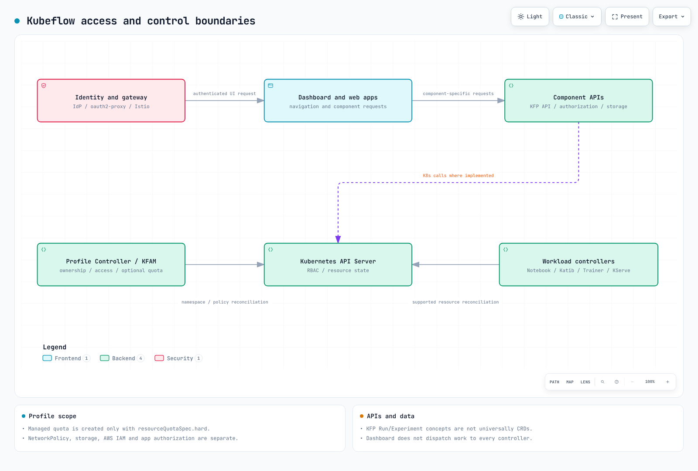

# Part 1: Kubeflow Architecture and Installation on EKS

> **Review baseline**: Community Distribution 26.03.1; Dashboard 2.0.0; KFP 2.16.1
> **Last reviewed**: September 12, 2026
> **Validation**: Profile overlay rendered locally with kubectl 1.36.2 / Kustomize 5.8.1. No EKS installation or AWS identity flow was executed.

## Preparing the Environment

Select a distribution release before selecting commands. Record the EKS/Kubernetes version, node architecture, CNI, storage classes, identity provider, and required components. `Kubernetes 1.34+` is not an unbounded support guarantee.

The 26.03.1 release reports Kubernetes 1.36 CI coverage and Kind 0.32+ use. This does not certify every EKS add-on combination. Its README warns that some images may lack ARM64 support. Rendering requires kubectl with Kustomize or the distribution's specified standalone Kustomize; applying resources additionally requires a target cluster, permissions, and dependency readiness.

## What Is Kubeflow?

Kubeflow comprises independently released ML components. The Community Distribution assembles their revisions and shared services. Some workloads use CRDs; other operations use application APIs, databases, and object storage. The dashboard is a UI entry point, not the scheduler or universal dispatcher.

### CNCF Graduation — August 17, 2026

The [CNCF announcement](https://www.cncf.io/announcements/2026/08/17/cncf-announces-kubeflows-graduation-solidifying-the-standard-for-cloud-native-ai-operations/) records graduation, an independent security audit, and formal governance. This supports an assessment of project maturity. It does not replace threat modeling, tenant isolation tests, or a deployment-specific compliance assessment.

## Release Model and Current Baseline

The distribution uses `YY.MM.patch`, plans roughly two base releases per year, and describes community support as best effort for about six months. That is not a vendor support SLA.

The [26.03.1 release](https://github.com/kubeflow/community-distribution/releases/tag/26.03.1), published June 15, 2026, and its [tagged inventory](https://github.com/kubeflow/community-distribution/blob/26.03.1/README.md) provide this baseline:

| Component | Bundled revision |
| --- | --- |
| Dashboard / Profile Controller / access management | 2.0.0 |
| Pipelines | 2.16.1 |
| Notebooks v1 | 1.11.0 |
| Trainer v2 / legacy Training Operator | 2.2.0 / 1.9.2 |
| Katib | 0.19.0 |
| KServe / Models Web Application | 0.18.0 / 0.18.0 |
| Hub / Spark Operator | 0.3.9 / 2.5.0 |
| Istio / Knative | 1.30.1 / 1.22.0 |
| cert-manager / Dex / oauth2-proxy | 1.20.2 / 2.45.1 / 7.15.2 |

The release describes Workspaces (Notebooks v2) as beta; this does not replace the stable Notebooks v1 row. Legacy Training Operator and Trainer v2 coexist with different APIs. Check installed CRDs and runtime definitions before writing training jobs.

## Component Architecture



[🔍 View interactive diagram](https://www.atomai.click/kubernetes-docs/archmaps/en-ai-ml-kubeflow-01-architecture-installation-0.html)

| Boundary | Provides | Still requires configuration |
| --- | --- | --- |
| Identity provider, oauth2-proxy, gateway | Browser authentication and trusted identity forwarding | OIDC clients, TLS, trusted headers, machine-to-machine authentication |
| Dashboard and component web apps | Navigation and application interfaces | Each API's authorization and service identity |
| Profile Controller and access management (KFAM) | Namespace ownership, owner/contributor access, generated RBAC and Istio policies | Quotas, network isolation, workload privileges, storage and AWS permissions |
| Component controllers | Reconciliation of supported Kubernetes resources | Admission, scheduling, dependencies and state |
| KFP APIs and persistence | Pipeline/run/experiment operations, metadata and artifacts | Database/object-store availability, authorization and backup |

A cluster-scoped `Profile` has an owner and manages a namespace; contributors are handled through access management. Dashboard 2.0.0 creates its `ResourceQuota` only when `spec.resourceQuotaSpec.hard` is nonempty. Omitting quota does not produce a default resource cap; emptying this field removes the quota managed by this controller.

Profile-generated RBAC and Istio `AuthorizationPolicy` do not provide complete tenant isolation. NetworkPolicy enforcement, Pod permissions, storage access, AWS IAM, and application authorization remain separate. The NetworkPolicy bundled with the Profile overlay protects that controller/access-management service, not every user namespace.

KFP's Pipeline, Run, and Experiment concepts are not universally CRDs. Optional Kubernetes Native API mode adds `Pipeline` and `PipelineVersion` CRDs. KFP Experiment and Katib Experiment are different resources.

### Profile Example

This declares an owner and an explicit quota. It is not an installation command or a complete isolation policy.

```yaml
apiVersion: kubeflow.org/v1
kind: Profile
metadata:
  name: team-a
spec:
  owner:
    kind: User
    name: owner@example.com
  resourceQuotaSpec:
    hard:
      requests.cpu: "8"
      requests.memory: 32Gi
      requests.nvidia.com/gpu: "2"
      persistentvolumeclaims: "10"
```

The controller refuses takeover of an existing namespace with mismatched ownership. Its namespace owner reference also makes deletion significant: deleting a Profile can delete the owned namespace and its resources. During Dashboard v2 migration, follow release-specific removal steps for old controller resources; preserve the Profile CRD, Profile objects, and user namespaces.

## Installation Paths on EKS

| Path | Evidence and limitations |
| --- | --- |
| Community Distribution 26.03.1 | Reviewed community bundle; configure EKS networking, storage, ingress and identity for this release |
| `awslabs/kubeflow-manifests` | Latest published release inspected: `v1.7.0-aws-b1.0.3` (September 1, 2023). Its release page says new installations fail because an old OIDC image was removed |
| Vendor-supported distribution | Evaluate its own version matrix, support, integrations and migration path |

The [AWS release warning](https://github.com/awslabs/kubeflow-manifests/releases/tag/v1.7.0-aws-b1.0.3) means the old manifest/Terraform walkthrough is not a verified 26.03.1 installation recipe. Repository activity alone does not change that release's compatibility.

Historical AWS overlays describe Cognito, RDS, and S3 integrations. They can reduce operation of self-hosted identity, database, and object-store services, but are not interchangeable defaults: issuer/claim mapping, database compatibility, networking, IAM, costs, and migration still matter. Validate old overlays before combining them with a new release.

### Render Before Applying

These commands obtain the reviewed release and render only its Profile controller overlay. They create local files without connecting to Kubernetes:

```bash
git clone --depth 1 --branch 26.03.1 \
  https://github.com/kubeflow/community-distribution.git kubeflow-26.03.1
cd kubeflow-26.03.1
kubectl kustomize \
  applications/dashboard/upstream/profile-controller/overlays/kubeflow \
  > profile-controller.rendered.yaml
```

The reviewed overlay produced 14 resources, including the Profile CRD, RBAC, Service, and `profiles-deployment` in `kubeflow`. Its containers use Dashboard 2.0.0 Profile Controller and access-management images. This overlay does not create the `kubeflow` namespace and requires its Istio/network-policy dependencies.

For installation, follow the pinned release's individual-component order. Inspect rendered resources, establish required CRDs, wait for controllers/webhooks, then apply custom resources. Diagnose admission or field-ownership errors instead of repeatedly forcing conflicts. A successful render proves neither API admission nor a working EKS deployment.

## IAM Access Patterns: IRSA, KFPv2, and Pod Identity

The [current KFP object-store guide](https://www.kubeflow.org/docs/components/pipelines/operator-guides/configure-object-store/) documents S3 with IRSA and launcher `credentials.fromEnv: true`. The old AWS distribution's “KFPv1 only” IRSA note is not a universal limitation of current KFPv2.

In KFP 2.16.1, `fromEnv` delegates to Go Cloud's bucket opener. Its pinned `gocloud.dev` 0.40.0 defaults to the AWS SDK v2 credential chain unless an SDK override is specified. This is broader than reading static access-key environment variables.

Configure the pipeline execution ServiceAccount and each artifact-accessing component, including the API server when required by its object-store configuration. Check actual container SDK/provider support, bucket prefixes, and KMS permissions. IRSA needs matching role trust and projected credentials, not just an annotation. Pod Identity also needs a supported EKS environment, the agent, an association, and SDK support; this review did not run that integration.

The Dashboard `AwsIamForServiceAccount` Profile plugin is not a Pod Identity switch: it annotates `default-editor` and can update an IAM role's trust policy. Account for controller permissions and trust changes. The example above does not enable that plugin. Use workload identity with scoped access instead of copying a historical IAM-user/static-key workaround into a new deployment.

## Why Run This on EKS Instead of a Managed Alternative?

EKS fits teams with Kubernetes operating capacity that need shared tooling, custom training runtimes, or specific scheduling and serving behavior. The team owns controllers, CRDs, tenant boundaries, recovery, capacity and upgrades.

SageMaker AI can reduce infrastructure operation but does not remove application, data, IAM, or model-quality responsibilities. Compare the services and deployment modes actually needed.

## Sources and Validation

The review inspected tagged distribution manifests, Dashboard 2.0.0 Profile code, and KFP 2.16.1 object-store code. The Profile overlay was rendered locally and the example checked against its CRD schema. This does not prove end-to-end authentication, isolation, or artifact access.

- [Dashboard Profile controller](https://github.com/kubeflow/dashboard/blob/v2.0.0/components/profile-controller/controllers/profile_controller.go)
- [Dashboard AWS Profile plugin](https://github.com/kubeflow/dashboard/blob/v2.0.0/components/profile-controller/controllers/plugin_iam.go)
- [KFP object-store implementation](https://github.com/kubeflow/pipelines/blob/2.16.1/backend/src/v2/objectstore/object_store.go)

## Next Steps

Continue with [Part 2: Pipelines](02-pipelines.md).

[Return to Main Page](README.md)

## Quiz

Try the [Topic Quiz](../../quizzes/ai-ml/kubeflow/01-architecture-installation-quiz.md).
