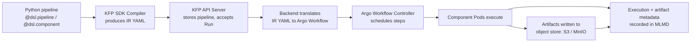

# Part 2: Kubeflow Pipelines

> **Supported Versions**: Kubeflow Pipelines 2.16.0, Kubeflow Community Distribution 26.03
> **Last Updated**: August 19, 2026

## Lab Environment Setup

To follow along with the examples in this document, you will need the following tools and environment:

### Required Tools

* Python 3.10+ with the `kfp` SDK (`pip install kfp`) installed locally for compiling pipelines
* kubectl v1.34 or later, pointed at a cluster with Kubeflow Pipelines installed (see Part 1)
* An IRSA role or EKS Pod Identity association granting S3 access, if you plan to point KFP's artifact store at S3 (see "EKS-Specific Artifact Storage" below)

## What Kubeflow Pipelines Is

Kubeflow Pipelines (KFP) is the workflow orchestration engine inside the Kubeflow platform for building, running, and tracking ML pipelines — DAGs of containerized steps, each with typed inputs and outputs. You author a pipeline in Python using the KFP SDK, compile it, and submit it to the KFP backend, which schedules each step as a Pod and tracks the run's status and artifacts.

Under the hood, KFP's backend is built on [Argo Workflows](https://argoproj.github.io/workflows/): once a compiled pipeline reaches the KFP API server, it's translated into an Argo `Workflow` resource, and Argo's controller is what actually creates and sequences the Pods. KFP adds the layers Argo doesn't provide on its own — a Python SDK for authoring, a UI for browsing runs and artifacts, an Experiment/Run tracking model, and the ML Metadata (MLMD) store for lineage.

## KFP v2 Architecture: IR YAML Instead of Direct Argo YAML

Kubeflow Pipelines 2.16.0 is the version bundled in the Kubeflow Community Distribution 26.03 release. It's built on the KFP v2 SDK and backend, which changed how a Python pipeline definition becomes a runnable workflow compared to the legacy v1 SDK:

* **v1 SDK**: `dsl-compile` compiled a Python pipeline function directly into an Argo `Workflow` YAML manifest. The compiled artifact was Argo-specific — if you wanted a different backend, you'd need a different compiler.
* **v2 SDK**: the pipeline compiles into an **Intermediate Representation (IR) YAML** — a backend-agnostic `PipelineSpec` describing the DAG, components, typed artifacts, and parameters. The KFP backend then translates that IR into an Argo `Workflow` at submission time.

The practical benefit is a stable, documented pipeline spec that isn't tied to Argo's object model. It also means the artifact you get from `kfp.compiler.Compiler().compile(...)` — the IR YAML — is what you'd hand to any KFP-compatible backend, and what the KFP API server stores and re-submits on every run of that pipeline, rather than a one-shot Argo manifest.

## Core Concepts

* **Pipeline** — a DAG of components, authored in Python with the `@dsl.pipeline` decorator, compiled to IR YAML.
* **Component** — a single containerized step with typed inputs and outputs. Authored with `@dsl.component`, a component compiles down to its own container spec; at runtime it becomes one Pod (or one step within a Pod, depending on executor configuration).
* **Run** — one execution of a pipeline (or a single component) against a specific set of input parameters.
* **Experiment** — a named grouping of related Runs, used to organize and compare results (e.g., different hyperparameter runs of the same pipeline).
* **Artifact** — a typed output that flows between components, backed by a file in an object store. KFP v2 gives artifacts first-class types — `Dataset`, `Model`, `Metrics`, `ClassificationMetrics`, `HTML`, `Markdown` — so a component's signature documents not just that it produces output, but what kind.
* **ML Metadata (MLMD) store** — the backing store (a MySQL-backed service in most KFP installs) that records every component execution, its inputs/outputs, and the artifacts it touched. This is what lets the KFP UI show artifact lineage — tracing a trained model backward through the exact dataset and code that produced it, across runs.

## How a Pipeline Run Flows Through the System



The KFP SDK's job ends at producing IR YAML; everything from the API server onward is the backend's responsibility. This separation is exactly what makes the "backend-agnostic spec" claim concrete — the SDK doesn't know or care that Argo Workflows is doing the scheduling underneath.

## EKS-Specific Artifact Storage

KFP ships with an in-cluster MinIO deployment as its default artifact store: every artifact a component produces (a `Dataset`, a trained `Model`, a metrics file) is written to a MinIO bucket rather than a real S3 bucket, unless reconfigured. That's fine for a self-contained demo, but on EKS it leaves you running and operating an extra stateful service that duplicates what S3 already gives you for free — durability, access from outside the cluster, and IAM-based access control.

The `awslabs/kubeflow-manifests` project documents patterns for pointing KFP's artifact store at S3 instead of in-cluster MinIO — reconfiguring the pipeline root and the artifact object-store credentials so components read and write directly to an S3 bucket. This is also where the identity mechanism covered in [Part 1](./01-architecture-installation.md) becomes directly relevant. Whichever ServiceAccount the KFP pipeline pods (and the `pipeline-runner` ServiceAccount specifically) run under needs an IRSA role or EKS Pod Identity association with permissions on that S3 bucket, since the object-store calls made when writing/reading artifacts go straight to AWS rather than to the in-cluster MinIO endpoint. Part 1 covers the IRSA/Pod Identity setup mechanics in depth; this section only flags where in the pipeline lifecycle that identity gets exercised.

## A Simple Two-Step Pipeline

The following illustrates a minimal `data-prep -> train` pipeline using the KFP v2 SDK's decorators, with a typed `Dataset` artifact passed from the first component to the second:

```python
from kfp import dsl, compiler
from kfp.dsl import Dataset, Model, Output, Input

@dsl.component(base_image="python:3.11-slim")
def prepare_data(output_dataset: Output[Dataset]):
    import pandas as pd

    # In a real pipeline this would read from S3 or another source
    df = pd.DataFrame({"feature": [1, 2, 3, 4], "label": [0, 1, 0, 1]})
    df.to_csv(output_dataset.path, index=False)

@dsl.component(base_image="python:3.11-slim", packages_to_install=["scikit-learn", "pandas"])
def train_model(input_dataset: Input[Dataset], output_model: Output[Model]):
    import pandas as pd
    from sklearn.linear_model import LogisticRegression
    import pickle

    df = pd.read_csv(input_dataset.path)
    clf = LogisticRegression().fit(df[["feature"]], df["label"])
    with open(output_model.path, "wb") as f:
        pickle.dump(clf, f)

@dsl.pipeline(name="data-prep-train-pipeline")
def data_prep_train_pipeline():
    prep_task = prepare_data()
    train_task = train_model(input_dataset=prep_task.outputs["output_dataset"])

compiler.Compiler().compile(
    pipeline_func=data_prep_train_pipeline,
    package_path="data_prep_train_pipeline.yaml",
)
```

A few things worth noting about this example:

* `output_dataset: Output[Dataset]` and `input_dataset: Input[Dataset]` are how KFP v2 declares typed artifact parameters — the SDK handles wiring `prep_task.outputs["output_dataset"]` into `train_model`'s input, including provisioning the storage path each component writes to/reads from.
* Each `@dsl.component` compiles into its own container image build context (or reuses a `base_image` with the given Python packages installed via `packages_to_install`), so `prepare_data` and `train_model` run as independent Pods, connected only through the declared artifact.
* `compiler.Compiler().compile(...)` produces the IR YAML described above — this is the file that would be uploaded to the KFP UI or submitted via the KFP Python client to create a Run.

## Caching Behavior

KFP caches a component's execution by hashing its inputs (parameter values, input artifact content, and the component's own definition). If a later run submits a component with an input hash matching a previous successful execution, KFP skips re-running it and reuses the cached outputs — so re-running a pipeline after fixing only the `train_model` step won't waste time re-running `prepare_data` if its inputs and code haven't changed.

This is convenient for iterative development but can silently mask a rerun you actually wanted (e.g., a component that depends on external state that changed but isn't reflected in its declared inputs). Caching can be disabled:

* Per component, by setting the `set_caching_options(enable_caching=False)` call on the task within the pipeline function, e.g. `prep_task.set_caching_options(enable_caching=False)`.
* Per run, by disabling caching for the entire pipeline submission rather than component-by-component — the KFP UI's "Run" dialog exposes a caching toggle at submission time for this purpose.

## Next Steps

With pipelines authored, compiled, and running, the next question is usually where the interactive development work behind those pipeline components happens in the first place. [Part 3: Kubeflow Notebooks](./03-notebooks.md) covers the per-user notebook environments teams use to author and iterate on the code that ends up packaged into pipeline components — and, further down this series, [Part 6: KServe — Model Serving on Kubernetes](./06-kserve.md) covers serving the models those pipelines ultimately produce.

[Return to Main Page](./README.md)

## Quiz

To test what you've learned in this chapter, try the [Topic Quiz](../../quizzes/ai-ml/kubeflow/02-pipelines-quiz.md).
