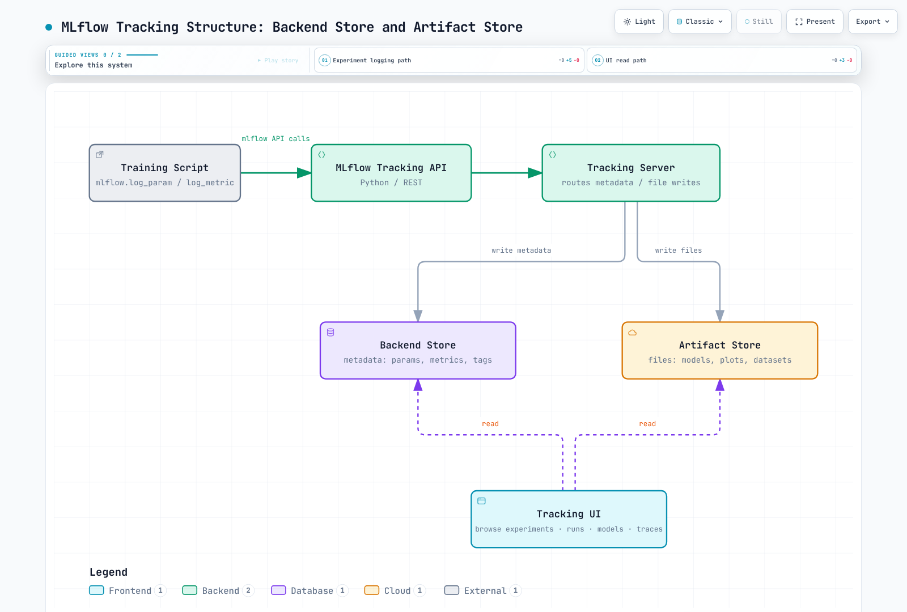

# Part 1: MLflow Tracking

> **Supported Versions**: MLflow 3.15.1
> **Last Updated**: August 19, 2026

## Lab Environment Setup

To follow along with the examples in this document, you will need the following tools and environment:

### Required Tools

* Python 3.10 or later
* `pip install mlflow` (this document assumes MLflow 3.x; install a specific pinned version such as `mlflow==3.15.1` if you want to match the examples exactly)
* Access to a running MLflow tracking server, or run one locally for these examples with `mlflow server` — [Part 3: EKS Deployment](./03-eks-deployment.md) covers standing up a production tracking server on EKS
* A training script or notebook you can add a few lines of logging code to (any scikit-learn, PyTorch, or similar example works)

## What Is MLflow Tracking?

MLflow Tracking is the part of MLflow that logs and queries information about machine learning training runs. It combines a Python (and REST) API for recording data with a UI for browsing it. What gets logged falls into a few categories: parameters (the inputs to a run, such as a learning rate or batch size), metrics (the outputs measured during or after training, such as accuracy or loss), artifacts (arbitrary files a run produces, such as plots, datasets, or serialized models), and — as of MLflow 3 — models themselves, tracked as first-class entities rather than plain files.

All of this is recorded through a **tracking server**, which is really two cooperating stores behind one API: a backend store that holds structured metadata, and an artifact store that holds the large binary files. The rest of this document covers the concepts you need to use Tracking day to day; the backend/artifact store split matters more once you deploy your own tracking server, which is why Part 3 revisits it in more depth.

## Core Concepts: Experiments and Runs

An **Experiment** is a named collection of Runs — typically one experiment per project or per model you're iterating on. A **Run** is a single execution of your training code: one call to train a model, evaluate it, or otherwise produce something worth recording. Each run captures its own parameters, metrics, tags, and artifacts, so you can compare runs against each other inside the same experiment to see which configuration performed best.

A minimal tracking call looks like this:

```python
import mlflow

with mlflow.start_run():
    mlflow.log_param("learning_rate", 0.01)
    mlflow.log_metric("accuracy", 0.92)
    mlflow.log_artifact("confusion_matrix.png")
```

The `with mlflow.start_run()` context manager opens a run, associates every logging call inside the block with that run, and closes it automatically when the block exits.

### Autologging

Manually calling `log_param` and `log_metric` for every value you care about gets tedious fast. MLflow's **autologging** feature instruments common ML libraries so that parameters, metrics, and artifacts are captured automatically during training, without changing your training code. A single call enables it:

```python
mlflow.autolog()
```

This enables autologging for whichever supported framework is in use in the current process. MLflow also ships framework-specific autolog functions — for example, one for scikit-learn and one for PyTorch — for cases where you want to enable autologging for just one library rather than everything MLflow can detect. Autologging is a good default for routine training runs; manual logging remains useful when you need to capture values autologging doesn't know about, such as custom evaluation metrics or domain-specific artifacts.

## The MLflow 3 Shift: Models as First-Class Entities

If you've used MLflow 1.x or 2.x, model tracking worked differently than it does now. In that earlier, run-centric model, a logged model was just another **artifact nested under a Run** — you called `mlflow.sklearn.log_model(...)` inside an active `mlflow.start_run()` block, and the model files landed in that run's artifact directory alongside your plots and datasets. To find a model, you first had to find the run that produced it.

MLflow 3 changes this by introducing **`LoggedModel`** as its own first-class entity, separate from the Run that produced it. A few consequences follow from that:

* You can call `mlflow.sklearn.log_model(...)` directly, without an active `mlflow.start_run()` context — the model doesn't need to be nested under a run to be tracked.
* The tracking UI has a dedicated **Logged Models** view, distinct from the Experiments/Runs view, where you can browse and compare models directly instead of hunting through runs to find the one that produced a model you care about.
* Because a model is no longer just a file under one run, MLflow 3 can track richer lineage between it and the runs, traces, prompts, and evaluation metrics associated with it — a model can be linked to the run that trained it, the runs that evaluated it, and any traces generated by serving it, rather than being permanently tied to a single training execution.

This decouples model versioning and comparison from any single training run, which matters most once you're iterating on the same model across many runs, or generating models outside a traditional training loop entirely (for example, by wrapping an existing LLM with custom logic).

## GenAI and LLM Observability: Tracing

MLflow's original scope was classic ML experiment tracking: params, metrics, and artifacts for training runs. MLflow 3 extends that same tracking system to cover **GenAI and agent observability** as a core feature, not a separate tool. The mechanism for this is **tracing**.

Tracing captures the internal steps of an LLM or agent call as a tree of **spans** — each span representing one step, such as a retrieval call, a tool invocation, or a call to the underlying model — along with token usage and cost for each step. MLflow provides auto-instrumentation for popular LLM and agent frameworks, including LangChain, and newer auto-tracing integrations for frameworks such as PydanticAI and smolagents, so that in many cases enabling tracing requires little or no change to your application code. Traces are viewable in the same tracking UI used for experiments and runs, and — reflecting the lineage MLflow 3 tracks — can be linked back to the model, prompt, or evaluation run that produced them.

The practical implication is that a team doing both classic ML training and LLM/agent development can use one MLflow Tracking deployment for both, rather than standing up a separate observability tool for the GenAI side.

## Backend Store vs. Artifact Store

The tracking server splits what it stores into two categories, backed by two different kinds of storage:

* **Backend store**: structured metadata — parameters, metrics, tags, and the records describing experiments, runs, and (in MLflow 3) logged models. At any team scale beyond quick local experimentation, this needs a real relational database, such as PostgreSQL or MySQL, rather than the default local file-based store.
* **Artifact store**: large binary objects — model files, plots, datasets, and any other files a run produces. This is typically object storage, such as an S3-compatible bucket, rather than a database.

This split matters because the two stores have different durability, scaling, and access-pattern requirements: a database is well-suited to many small structured writes and queries, while object storage is well-suited to storing and retrieving large files. [Part 3: EKS Deployment](./03-eks-deployment.md) goes into the infrastructure choices this implies when you run your own tracking server on EKS — for now, it's enough to know the two stores exist and serve different purposes.



[🔍 View interactive diagram](https://www.atomai.click/kubernetes-docs/archmaps/en-ai-ml-mlflow-01-tracking-0.html)

The training script never talks to either store directly — it always goes through the Tracking API, which the tracking server uses to route metadata writes to the backend store and file writes to the artifact store. The UI reads from both stores to render experiments, runs, logged models, and traces.

## Next Steps

This document covered what MLflow Tracking records, how Experiments and Runs organize that data, how MLflow 3's `LoggedModel` entity changes model tracking compared to earlier run-nested models, and how tracing extends the same system to GenAI and agent observability. [Part 2: Model Registry](./02-model-registry.md) covers what happens after a run produces a model worth keeping: registering it, versioning it, and promoting it toward production with aliases like `champion`. [Part 3: EKS Deployment](./03-eks-deployment.md) covers running your own tracking server on EKS, including the backend store and artifact store choices introduced above.

[Return to Main Page](./README.md)

## Quiz

To test what you've learned in this chapter, try the [Topic Quiz](../../quizzes/ai-ml/mlflow/01-tracking-quiz.md).
