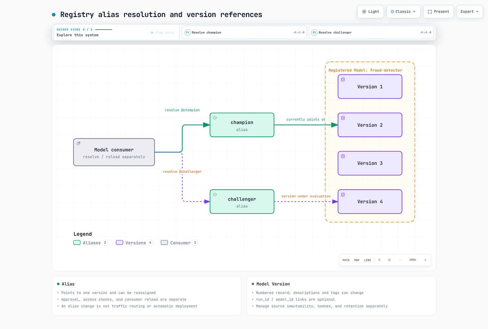

# Part 2: MLflow Model Registry

> **Review baseline**: MLflow 3.16.0 · 2026-09-12

## Lab Environment Setup

Use Python 3.10 or later and `mlflow==3.16.0`. Registry APIs also work with local SQLite; a separate HTTP server is not mandatory. See [Part 3](03-eks-deployment.md) for team deployment and [Part 1](01-tracking.md) for Tracking setup. This chapter describes OSS MLflow. Managed registries such as Databricks Unity Catalog can have different permission, copying, and retention behavior.

## What the Model Registry Is

The registry manages logical model names, numbered versions, aliases, and metadata. Recording candidates, approving promotion, and deploying an endpoint are separate operations. Having a registry does not automatically implement approval or serving behavior.

## Core Concepts

| Entity | Meaning and mutation boundary |
|---|---|
| Registered Model | collection of versions under a logical name such as `fraud-detector` |
| Model Version | numbered record with source information; descriptions, tags, stage/alias relationships can change |
| Alias | mutable name pointing to one version; multiple aliases can point to the same version |
| LoggedModel | independent Tracking model entity; distinct from Registered Models and Model Versions |

### Model Version

New model results should normally become new versions. However, **not every version field and artifact byte is immutable**. `update_model_version` changes descriptions; version tags are mutable too. Someone with write access can change files at an external `source` URI. A registry version number does not enforce object immutability or a content hash.

`run_id` and `model_id` are optional in `create_model_version`. Registration from a direct source URI can have no training-run link. Whether registration is a pointer, copies artifacts, or uses another storage location depends on the registry backend and operation; verify the actual behavior.

### Aliases

`models:/fraud-detector@champion` finds the alias's version **when resolution/loading occurs**. `models:/fraud-detector/7` is an explicit version reference. Moving an alias does not automatically replace a model already loaded in memory or a cache. Implement serving-controller deployment, reload, and cache policies separately and record the version actually serving requests.

`champion` and `challenger` are team-defined names. They do not configure live/shadow traffic percentages or run an evaluation themselves. An alias update is not evidence of quality or security approval.

### The Legacy Stage Model

Legacy stages are `None`, `Staging`, `Production`, and `Archived`. `transition_model_version_stage` has been **deprecated since 2.9.0** and remains in the 3.16.0 API. Do not describe it as removed from every current version. New workflows can combine aliases and tags with environment-specific Registered Models and explicit permissions. A stage name or tag is not access control.

## Registering a Model

After logging an actual flavor model, call `mlflow.register_model(model_uri, name)`, or pass `registered_model_name` to the flavor's `log_model` call. The lower-level `MlflowClient.create_model_version` API can specify a source directly. Registration and alias reassignment are separate operations.

This **registry metadata exercise** does not create an inference-capable model. It was checked with Python 3.12, MLflow 3.16.0, and SQLite.

```python
from pathlib import Path
import mlflow
from mlflow import MlflowClient

root = Path(".registry-demo").resolve()
root.mkdir(exist_ok=True)
mlflow.set_tracking_uri(f"sqlite:///{root / 'registry.db'}")
client = MlflowClient()
name = "registry-contract-demo"
# Run once in a fresh demo DB. Inspect the existing name before repeating.
client.create_registered_model(name)
versions = []
for number in (1, 2):
    source = root / f"candidate-{number}"
    source.mkdir(exist_ok=True)
    (source / "metadata.json").write_text('{"fixture": true}')
    versions.append(client.create_model_version(name, source=source.as_uri()))

first, second = versions
assert first.run_id is None
client.update_model_version(name, first.version, description="metadata fixture")
client.set_model_version_tag(name, first.version, "review_state", "demo-only")
client.set_registered_model_alias(name, "champion", first.version)
snapshot = client.get_model_version_by_alias(name, "champion")
client.set_registered_model_alias(name, "champion", second.version)
assert snapshot.version == first.version
assert client.get_model_version_by_alias(name, "champion").version == second.version
```

`READY` is a registration status. A metadata fixture without a model flavor or weights can be registered, as above; test inference compatibility and evaluation criteria separately. The exercise leaves its local DB and fixtures in `.registry-demo`.

## Governance and the Handoff Workflow

1. Record actual source artifacts, model/code/data hashes, dependencies, and run/model references.
2. Evaluate quality, safety, and business criteria; preserve approval evidence.
3. An authorized actor calls `set_registered_model_alias`. Completing training is not automatic approval.
4. Serving systems resolve the new reference and perform reload or deployment. Pin version numbers and artifact hashes where needed for reproducibility and rollback.

Separating candidate creation from promotion requires authentication, authorization, and an operating pipeline. A tag such as `review_state=approved` alone does not restrict write access or make approval evidence tamper-proof. Coordinate concurrent alias updates from multiple deployment jobs.



[Interactive diagram](https://www.atomai.click/kubernetes-docs/archmaps/en-ai-ml-mlflow-02-model-registry-0.html)

## Lineage and Reproducibility

Lineage is only as complete as the information recorded and retained. The registry cannot later reconstruct missing `run_id`, `model_id`, code revisions, or dataset hashes. Changed source files, deleted Runs/Model Versions, and artifact cleanup can also leave incomplete links.

An audit needs the version/model ID actually serving, artifact hashes and locations, source commit, dataset snapshot, dependencies, and evaluation/approval records. Operate metadata DB and artifact-store backups and retention together. An alias is not a permanent audit log of all changes.

## Next Steps

[Part 3: EKS Deployment](03-eks-deployment.md) covers server, database, and artifact permission boundaries.

## Primary Sources

- [Model Registry](https://mlflow.org/docs/3.16.0/ml/model-registry/)
- [3.16.0 Registry client API](https://github.com/mlflow/mlflow/blob/v3.16.0/mlflow/tracking/client.py)
- [ModelVersion fields](https://github.com/mlflow/mlflow/blob/v3.16.0/mlflow/entities/model_registry/model_version.py)
- [OSS SQL registry implementation](https://github.com/mlflow/mlflow/blob/v3.16.0/mlflow/store/model_registry/sqlalchemy_store.py)

[Main Page](README.md) · [Quiz](../../quizzes/ai-ml/mlflow/02-model-registry-quiz.md)
