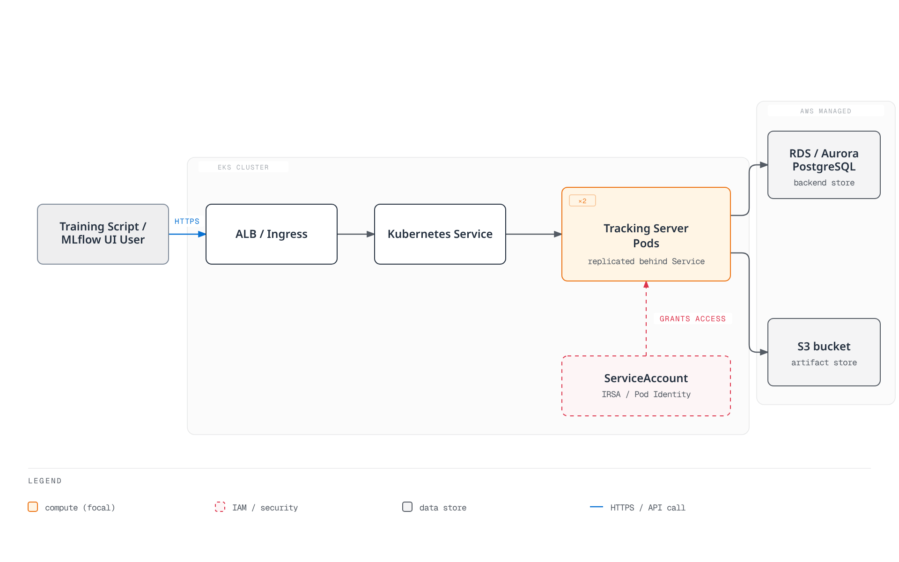

# Part 3: Deploying MLflow on EKS

> **Supported Versions**: MLflow 3.15.1, Kubernetes 1.34+
> **Last Updated**: August 19, 2026

## Lab Environment Setup

To follow along with the examples in this document, you will need the following tools and environment:

### Required Tools

* kubectl v1.34 or later, pointed at a working Amazon EKS cluster
* Helm v3, if you choose the community Helm chart installation path
* An existing Amazon RDS or Aurora PostgreSQL instance for the backend store (or the ability to provision one)
* An S3 bucket for the artifact store
* An IRSA role or EKS Pod Identity association granting the tracking server access to that S3 bucket

## Why Run MLflow's Tracking Server on EKS

The trade-off here follows the same pattern as other self-hosted ML infrastructure covered in this documentation site. A team already running EKS gets to reuse the same deployment manifests, observability stack, and IAM patterns (IRSA or Pod Identity) for MLflow as for everything else on the cluster, instead of learning a separate operational model. In exchange, that team takes on operating the tracking server process itself, along with its backend store and artifact store, rather than pointing training code at a managed alternative — Databricks-managed MLflow or SageMaker's MLflow-compatible tracking capability, for example. Neither choice is universally correct; it comes down to whether the team wants one more service on its existing Kubernetes operational surface, or one less service to operate at all.

## Architecture

A production MLflow deployment on EKS has three moving pieces, and none of them is optional once real teams share the tracking server.

**MLflow Tracking Server.** This is a container running `mlflow server`, exposing both the REST API that client SDKs (`mlflow.log_metric`, `mlflow.log_artifact`, and so on) talk to, and the web UI that people browse experiments and runs in. It's stateless by design — all durable state lives in the backend store and artifact store — so it fits naturally into a Kubernetes Deployment, fronted by a Service and an Ingress (typically backed by the AWS Load Balancer Controller provisioning an ALB).

**Backend store.** MLflow's default backend store is a local SQLite file, which is fine for a single experimenter on a laptop but breaks down the moment more than one process needs to write concurrently — SQLite simply doesn't support the level of concurrent access a shared team tracking server needs. On AWS, the standard replacement is a real relational database: Amazon RDS for PostgreSQL, or Aurora Serverless v2 if you want the database to scale with tracking load rather than being sized up front. The backend store holds all of MLflow's structured metadata — experiments, runs, parameters, metrics, registered models, model versions, and aliases (see [Part 2](02-model-registry.md)) — everything that benefits from being queryable with SQL.

**Artifact store.** Backend store rows are small; the things MLflow logs alongside them often aren't. Serialized models, plots, datasets, and other large binary objects go to a separate artifact store instead of the database. On AWS, that's Amazon S3: the tracking server writes and reads artifacts under an S3 URI configured as the default artifact root, and clients fetch artifacts either through the tracking server's proxy or with direct S3 access, depending on how the server is configured.



## Installation Approaches

There are two practical paths to getting the pieces above running on a cluster.

**Write your own manifests.** A Deployment for the `mlflow server` container, a Service in front of it, and an Ingress (or a Service of type `LoadBalancer`) to expose it externally, with the backend store connection string and the S3 artifact root passed in as environment variables or command-line flags on the container. This gives full control over every detail, at the cost of maintaining the YAML yourself.

**Use a community Helm chart.** The `community-charts/helm-charts` project maintains an MLflow chart for exactly this use case:

```bash
helm repo add community-charts https://community-charts.github.io/helm-charts
helm repo update
helm search repo community-charts/mlflow
```

The chart exposes configuration for the pieces described above at a conceptual level — pointing the backend store at an external database connection instead of SQLite, pointing the artifact store at an S3 bucket, and the usual Kubernetes concerns like replica count, resource requests, and Ingress settings. Check the chart's own documentation for the exact `values.yaml` keys and current defaults before deploying, since these can change between chart versions.

Either path lands on the same runtime architecture: one or more stateless tracking server Pods, a database they all point at, and an S3 bucket they all point at.

## IAM Access to the Artifact Store

The tracking server Pod needs AWS permissions to read and write objects in the S3 artifact bucket — for example, `s3:PutObject` and `s3:GetObject` scoped to that bucket's prefix. On EKS, the long-standing mechanism for binding an IAM role to a Kubernetes ServiceAccount is IRSA (IAM Roles for Service Accounts), which annotates the ServiceAccount with `eks.amazonaws.com/role-arn` so pods using it receive temporary credentials for that role. EKS Pod Identity is the newer mechanism for binding IAM roles to pods, and is increasingly the recommended default for new IAM-to-pod bindings on EKS generally, regardless of workload. Either mechanism keeps static AWS credentials out of the tracking server's environment and configuration: for a new MLflow deployment, Pod Identity is the more modern starting point, with IRSA remaining a valid choice on clusters or teams already standardized on it.

## Operational Notes

**Run more than one replica.** Because a Postgres-backed tracking server is stateless — all shared state lives in the database and S3, not in the Pod — it's safe to run multiple replicas behind the Service and Ingress for availability. This is a meaningful difference from the SQLite-backed single-process default, which can't safely be scaled out at all since SQLite doesn't tolerate concurrent writers.

**Wire up health probes.** As with any long-running Kubernetes service, configure readiness and liveness probes against the tracking server's health endpoint so the Service only routes traffic to Pods that can actually serve requests, and so a wedged Pod gets restarted automatically. Confirm the exact health-check path against the MLflow version you're running rather than assuming one, since it can vary by release.

**Size the database for your write pattern.** Every logged parameter, metric, and metric step is a write to the backend store, so training jobs that log metrics at high frequency (per-step rather than per-epoch, for example) put real load on the database. Aurora Serverless v2 is worth considering specifically because it can absorb bursty tracking load from a training run without requiring the database to be sized for peak load year-round.

## Next Steps

That's the end of this three-part MLflow series: [Part 1](01-tracking.md) covered logging experiments and runs, [Part 2](02-model-registry.md) covered giving trained models a stable, versioned identity in the Model Registry, and this part covered running the tracking server, backend store, and artifact store on EKS. Once a model has a registered version or alias, the natural next step many teams take is loading that specific version into a serving system — KServe, a custom FastAPI or Flask wrapper, SageMaker, or something else entirely. That serving layer is its own broad topic and is out of scope for this series.

[Return to Main Page](./README.md)

## Quiz

To test what you've learned in this chapter, try the [Topic Quiz](../../quizzes/ai-ml/mlflow/03-eks-deployment-quiz.md).
