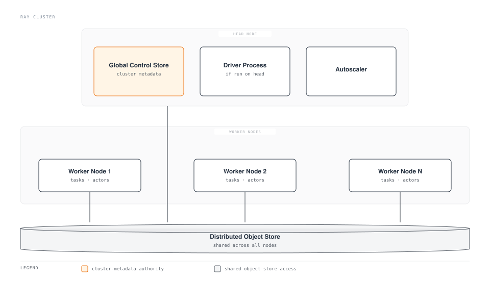

# Part 1: Ray Architecture

> **Supported Versions**: Ray 2.57.0
> **Last Updated**: August 20, 2026

## Lab Environment Setup

To follow along with the examples in this document, you will need the following tools and environment:

### Required Tools

* Python 3.10 or later
* `pip install ray[default]` (the `default` extra pulls in the dashboard and cluster-launcher dependencies used in later examples; a plain `pip install ray` gives you just the core APIs shown in this document)
* A local machine or VM with a few spare CPU cores is enough to run the examples below — no cluster is required for Part 1

## What Is Ray?

Ray is an open-source distributed computing framework for scaling Python workloads. It is not a framework built for one specific workload, the way a training-only or serving-only tool might be. Instead, Ray provides a small set of general-purpose primitives that let you take ordinary Python code and run it across many CPU cores or many machines, with comparatively little rewriting.

Those primitives are general enough to cover a wide range of use cases: parallelizing an ad hoc batch of function calls, running distributed model training, sweeping a hyperparameter search across many trials, or serving a model behind a scalable inference endpoint. Ray's higher-level libraries — Ray Train, Ray Tune, and Ray Serve, introduced briefly below and covered in depth in later parts of this series — are all built on top of the same underlying primitives rather than being separate, unrelated tools. That shared foundation is Ray's key architectural distinction from an ecosystem of point tools, each with its own execution model, that happen to be bundled together.

## Core Primitives

Ray's programming model rests on three primitives: tasks, actors, and the object store.

### Tasks

A **task** is a stateless function that Ray runs remotely instead of in the calling process. You turn an ordinary Python function into a task by applying the `@ray.remote` decorator to it. Calling the decorated function returns immediately with a future (an `ObjectRef`) rather than blocking until the function finishes; Ray schedules the actual execution on some worker in the cluster's resource pool. Because a task carries no state between calls, Ray is free to run any given call on whichever worker has capacity available, which is what makes tasks easy to scale out.

Tasks are a natural fit for embarrassingly parallel work: applying the same function to many independent inputs, running many independent simulations, or preprocessing many data shards. Because each task call is independent and stateless, Ray can schedule large numbers of them across the whole cluster without needing to track any relationship between one call and the next.

### Actors

An **actor** is the stateful counterpart to a task. Applying `@ray.remote` to a Python class turns it into an actor: Ray instantiates the class on a worker and keeps that instance alive as a long-lived remote process, rather than a single call that returns and disappears. Method calls on an actor handle are then routed to that same living instance, so state stored on the instance — a model's weights, a counter, an open connection — persists across calls.

Actors are the right primitive whenever you need to hold state between calls: an accumulating counter, a loaded model kept resident in memory rather than reloaded for every request, or a stateful simulation that steps forward call by call. Tasks and actors are complementary rather than competing choices — a typical Ray application mixes both, using tasks for stateless parallel work and actors wherever state needs to persist.

### The Object Store

The **object store** is a distributed, shared-memory store that holds the objects tasks and actors pass between each other — function arguments, return values, and anything else placed into it explicitly. Each node in the cluster runs its own local object store, and Ray coordinates data movement between them as needed so that a task running on one worker can read an object produced on another.

The object store matters most for large objects: a big NumPy array, a dataset shard, or a model's weights. Rather than serializing and copying such an object into every process that needs it, Ray can keep one copy in shared memory on a node and let multiple local processes read it without duplicating it in each process's own memory. This is what lets Ray move large data between tasks and actors efficiently, instead of paying a serialization and copy cost on every call.

## Cluster Architecture: Head Node and Worker Nodes

A Ray cluster is made up of one **head node** and any number of **worker nodes**. Every node — head and worker alike — runs Ray processes and contributes CPU, GPU, and memory to the cluster's shared resource pool.

The head node runs a few additional responsibilities beyond what a worker does:

* **Global Control Store (GCS)**: the cluster's metadata store, tracking which actors and objects exist and where they live, along with other cluster state that scheduling and fault recovery depend on.
* **Driver process**: if you run your top-level Ray script or interactive session on the head node, the driver executing that script lives there and submits tasks and actor calls into the cluster.
* **Autoscaler**: the process that requests additional worker nodes when the cluster's pending workload calls for more resources, and removes idle workers when they are no longer needed.

Worker nodes exist to run tasks and actors and to add their CPU, GPU, and memory to the pool the whole cluster draws from. A key property of Ray's scheduling model follows from this: Ray schedules tasks and actors against the cluster's combined resource pool, not against any one node's resources in isolation. A task requesting two CPUs can land on whichever node in the cluster has two CPUs free — the scheduler is not choosing a node up front the way you might manually place work on a specific machine.

Every node participates in the distributed object store, so an object produced by a task on one worker node can be read by a task or actor running on a different worker node, with Ray handling the data movement between them.

## Higher-Level Libraries Built on the Same Foundation

Ray ships several higher-level libraries that address specific ML workloads, and all of them are built on top of the tasks, actors, and object store described above rather than introducing a separate execution model of their own:

* **Ray Train** distributes model training across many workers, covered in [Part 3: Ray Train and Ray Tune](./03-ray-train-tune.md) of this series.
* **Ray Tune** runs hyperparameter searches across many trials in parallel, also covered in Part 3.
* **Ray Serve** deploys models behind a scalable serving layer, covered in [Part 4: Ray Serve](./04-ray-serve.md) of this series.

This shared foundation is worth calling out explicitly: rather than bundling separate tools that each reimplement scheduling, fault tolerance, and data movement for one workload type, Ray implements those concerns once, in its core primitives, and lets each higher-level library reuse them. Distributed training and hyperparameter tuning are both, underneath, workers running as Ray actors or tasks and exchanging data through the same object store that a plain `@ray.remote` function would use.

As of this writing, Ray 2.57.0 is the latest stable release. A Ray 3.0 development line exists as forward context worth knowing about, but it is not yet released, so this document does not depend on anything specific to it.

## Why This Matters on Kubernetes

Ray has its own notion of a cluster — a head node, worker nodes, and an autoscaler that grows or shrinks the worker fleet — and that is a different layer from Kubernetes' own scheduling and autoscaling. Running Ray on Kubernetes means something needs to translate a Ray cluster's shape (one head, some number of workers, each with certain resource requirements) into Kubernetes objects such as Pods and Deployments that the Kubernetes scheduler actually understands and can place onto EKS nodes. That translation is exactly the problem [Part 2: KubeRay Operator](./02-kuberay-operator.md) covers next in this series.

## Next Steps

This document covered what Ray is, its three core primitives (tasks, actors, and the object store), and how a Ray cluster's head node and worker nodes cooperate to schedule work across a shared resource pool. [Part 2: KubeRay Operator](./02-kuberay-operator.md) covers how the KubeRay operator maps this Ray cluster model onto native Kubernetes resources on EKS. [Part 3: Ray Train and Ray Tune](./03-ray-train-tune.md) and [Part 4: Ray Serve](./04-ray-serve.md) build on the primitives introduced here for training and serving workloads, respectively.

[Return to Main Page](./README.md)

## Quiz

To test what you've learned in this chapter, try the [Topic Quiz](../../quizzes/ai-ml/ray/01-architecture-quiz.md).
