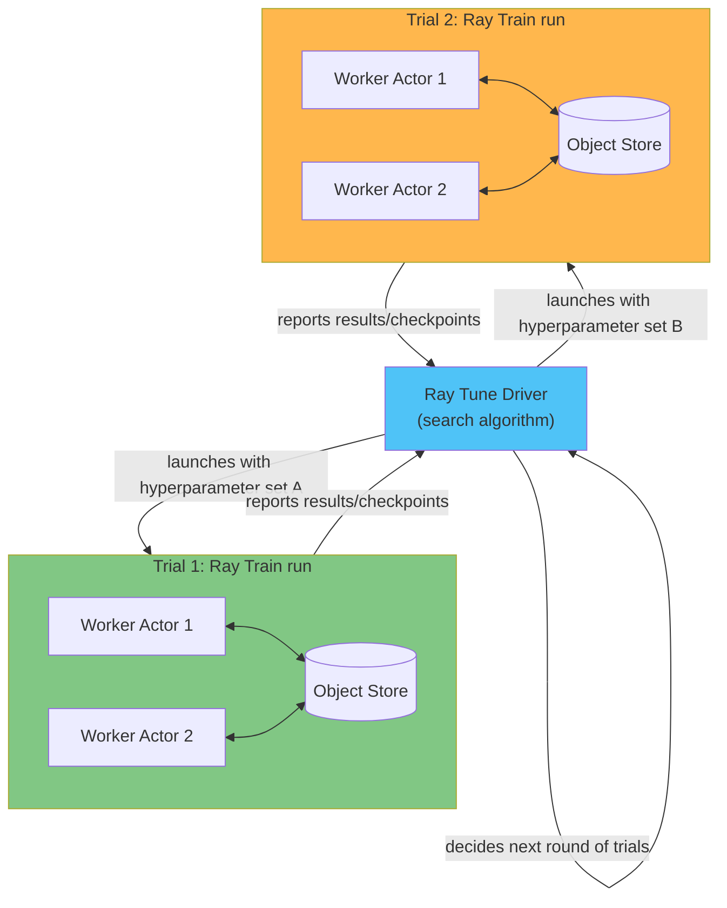

# Part 3: Ray Train and Ray Tune

> **Supported Versions**: Ray 2.57.0
> **Last Updated**: August 20, 2026

## Lab Environment Setup

To follow along with the examples in this document, you will need the following tools and environment:

### Required Tools

* Python 3.10 or later
* `pip install "ray[train,tune]"`
* Access to a Ray cluster (see [Part 2: The KubeRay Operator](02-kuberay-operator.md) for standing one up on EKS, or run `ray.init()` locally for the examples in this document)

## Ray Train: Distributed Training on Ray's Primitives

[Part 1](01-architecture.md) introduced Ray's core primitives: tasks, actors, and the object store. Writing a distributed training job directly against those primitives is possible, but it means hand-rolling a lot of boilerplate: launching one worker process per GPU, setting up the communication group those workers use to synchronize gradients, and coordinating checkpoints across all of them consistently.

**Ray Train** is a library, built on top of Ray's task and actor primitives, that handles that boilerplate. It takes a training function written against a familiar framework API — PyTorch is the most common case, though Ray Train supports other frameworks as well — and runs it across as many distributed workers as you ask for, without the author of the training function needing to manage worker launch, inter-worker communication, or checkpoint coordination directly.

### Ray Train V2

Ray Train's public API has evolved over the project's history. The user-facing import path is still `ray.train.torch.TorchTrainer` for PyTorch training, but the implementation behind that path has been rewritten — this rewrite ("Train V2") consolidated and simplified how the earlier generation of Trainer classes worked internally, and is now the default implementation you get from that same import. If you encounter an older codebase pinned to a Ray release from before this rewrite landed, treat it as running on the earlier implementation rather than assuming it is broken; consult the Ray documentation at docs.ray.io for the specifics, since the exact version where the default flipped is the kind of detail that changes across Ray releases.

## Core Ray Train Concepts

### Trainer

A **Trainer** — such as `TorchTrainer` — wraps a user-supplied training function. The training function contains the ordinary model-training logic for the chosen framework: building the model, iterating over batches, computing loss, and stepping the optimizer. The Trainer is responsible for launching that function once per worker, in a distributed process group the underlying framework's data-parallel training expects (for example, a PyTorch DDP process group), so the training function itself does not need to set that up by hand.

### ScalingConfig

A **ScalingConfig** tells the Trainer how many workers to launch and what resources each one needs — for example, how many workers to run and whether each worker requires a GPU. The Trainer uses this configuration to request the corresponding resources from the underlying Ray cluster, the same way any other Ray task or actor would.

### Checkpointing

Ray Train workers can report checkpoints back during training. A checkpoint captures enough state — typically model weights and optimizer state — to resume training from that point rather than from scratch. This serves two purposes: it lets a long-running distributed training job recover after a worker failure without losing all prior progress, and it hands off a trained model to whatever comes next in the workflow, whether that is a later hyperparameter-tuning decision (covered below) or registering the result as a model version (conceptually similar to what this documentation site's MLflow Model Registry material covers, though that material is not Ray-specific).

## Ray Tune: Hyperparameter Search Across the Cluster

**Ray Tune** is a hyperparameter tuning library, also built on Ray, that runs many training trials in parallel across the cluster and uses a pluggable search algorithm to decide which hyperparameter combinations to try next. Each trial trains a model with one particular set of hyperparameters and reports back a result Tune's search algorithm can use to decide what to try next.

This is conceptually parallel to what this documentation site's Kubeflow subtree describes for Katib, except Tune is a library native to the Ray ecosystem rather than a separate Kubernetes CRD-based system.

## Combining Ray Train and Ray Tune

A trial that Ray Tune runs does not have to be a single-process function. A common pattern is to give Tune a Ray Train `Trainer` as the trainable it is searching over: each hyperparameter trial then becomes its own distributed Ray Train run, potentially spanning multiple GPUs or multiple nodes.

This combination matters whenever a model is expensive enough to train that a single trial itself needs distributed training to finish in a reasonable amount of time. Without it, a team would face an awkward choice: tune hyperparameters serially against a distributed training job, or give up distributed training during the search phase. Because both libraries share the same underlying Ray primitives, Tune can drive many concurrent Ray Train runs, each with its own set of distributed workers, without either library needing special-case integration code for the other.

## Resource Allocation and the Cluster Autoscaler

Both Ray Train and Ray Tune request their workers' CPUs and GPUs through Ray's normal task and actor resource-request mechanism described in [Part 1](01-architecture.md) — there is no separate resource-request path specific to training or tuning. This matters on EKS because it is exactly what lets the KubeRay-managed autoscaler, covered in [Part 2](02-kuberay-operator.md), react to a training or tuning job's actual resource demand. A cluster does not need to be sized up front for the largest job it will ever run; the autoscaler can request more worker nodes as a Ray Tune sweep launches more concurrent trials, and scale back down once trials complete.

## Practical Note: Co-Scheduling and GPU Node Lead Time on EKS

The distributed worker processes that make up a single Ray Train run typically need to be co-scheduled — all of them need to be up and holding their allocated GPUs at the same time before the communication group they form can be established, similar to the gang-scheduling needs discussed elsewhere in this documentation site for other distributed training systems. If the cluster's autoscaler cannot provision all the requested GPU workers within a reasonable window, a training run can stall waiting for the last few workers to come up.

This interacts directly with GPU node pool provisioning lead time: acquiring new GPU capacity from a node pool takes time, and that time is often larger and less predictable than for general-purpose CPU nodes. This documentation site's [Karpenter guide](../../autoscaling/02-karpenter.md) covers the node-provisioning mechanics in depth; the point to carry into Ray Train/Tune planning is that a training job's actual start time on EKS depends on how quickly the cluster can co-schedule every worker it asked for, not just on when the job was submitted.

## Next Steps

Part 3 covered Ray Train's Trainer, ScalingConfig, and checkpointing, Ray Tune's trial-based hyperparameter search, and how the two combine when a tuning trial itself needs distributed training. [Part 4: Ray Serve](04-ray-serve.md) moves from training to serving: taking a trained (and possibly tuned) model and exposing it behind a scalable inference endpoint.

[Return to Main Page](./README.md)

## Quiz

Test your understanding with the [Ray Train and Ray Tune quiz](../../quizzes/ai-ml/ray/03-ray-train-tune-quiz.md).
