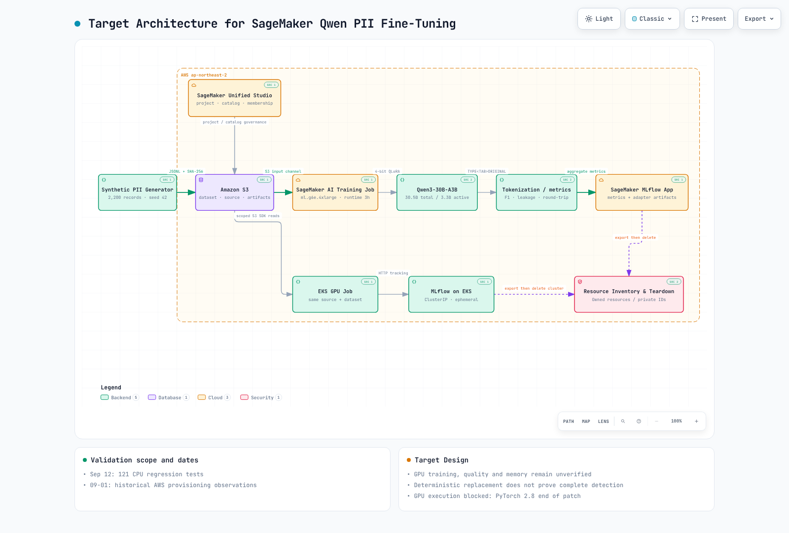

# Part 1: SageMaker Qwen PII Platform Architecture

> **Last Updated**: September 2, 2026

## Target Design

The figure below is a **target design for a rerun, not evidence of completed training**. The September 1, 2026 validation did not execute either the SageMaker Training Job or the EKS GPU Job.

[🔍 View the interactive diagram](https://www.atomai.click/kubernetes-docs/archmaps/en-ai-ml-sagemaker-ai-01-platform-architecture-0.html)

## Responsibility Boundaries

| Component | Responsibility | Safe to Record | Do Not Record |
|---|---|---|---|
| Synthetic data generator | deterministically generate 2,200 documents and answer TSV | seed, split counts, SHA-256, per-type counts | real customer PII |
| Amazon S3 | hold source bundle, datasets, aggregate results, and adapter artifacts | object hashes and non-sensitive manifests | raw predictions in public paths |
| SageMaker Unified Studio | govern projects, catalogs, and membership | project state and profile/blueprint configuration | an assumption that an unassigned role is an owner |
| SageMaker AI Training Job | run isolated managed GPU training | hyperparameters, status, aggregate metrics | source text or token mappings |
| Qwen + QLoRA | learn `TYPE<TAB>ORIGINAL` extraction | model ID, LoRA configuration, dependency versions | final masking behavior |
| SageMaker MLflow App | compare experiments and track aggregate artifacts | configuration, hashes, aggregate F1/leakage | source text and raw completions |
| EKS GPU Job | provide the Kubernetes alternative for the same contract | the same aggregate result schema | a long-lived cluster by default |
| Resource Inventory & Teardown | inventory, export, delete, and verify resources | resource types and final counts | account IDs, ARNs, or presigned URLs |

## One Experiment, Two Execution Paths

Both paths consume `config/experiment.yaml`, the same dataset hashes, one training entry point, and one evaluation implementation.

| Decision | SageMaker AI + MLflow App | EKS GPU Job + MLflow on EKS |
|---|---|---|
| Operating model | managed Training Job and the current managed MLflow App | operate the cluster, GPU node, and MLflow server |
| Isolation unit | Training Job | namespace + Kubernetes Job |
| Tracking | SageMaker MLflow App | ClusterIP MLflow |
| Data delivery | S3 input channel | time-limited presigned URLs |
| Shutdown | reclaim resources after the Training Job | export results, then delete the cluster |
| Best fit | managed AWS operations and short experiment lifetime | EKS standardization, Kubernetes control, shared observability |

For comparable results, keep the model ID, seed, split hashes, dependency lock, QLoRA settings, and smoke/full step counts identical.

## Model and Fine-Tuning Scope

The base model is `Qwen/Qwen3-30B-A3B-Instruct-2507`. The experiment updates adapters rather than all model weights.

| Setting | Value |
|---|---|
| Quantization | 4-bit NF4 with double quantization |
| Compute dtype | `bfloat16` |
| LoRA rank / alpha | `16` / `32` |
| LoRA dropout | `0.05` |
| Maximum sequence length | `1024` |
| Smoke / full | `10` / `80` steps |
| Maximum runtime | `10,800` seconds |

Model output is only an extraction candidate. Rows that fail the type whitelist or source-containment checks are rejected, and code outside the model performs replacement.

## Why Governance Comes Before Training

A Unified Studio project is a collaboration and resource-sharing boundary, while its project profile determines the available tools and blueprints. An automation role also needs project membership before it can manage that project. The design therefore enforces this order:

1. Verify permission to use the domain and project profile.
2. Assign the execution role's group profile as owner membership when the project is created.
3. Build a Training Job request only after the project and MLflow App are ready.
4. On failure, run inventory-based teardown before creating GPU resources.

Next: [Part 2 — PII data and deterministic tokenization](02-pii-data-tokenization.md)
