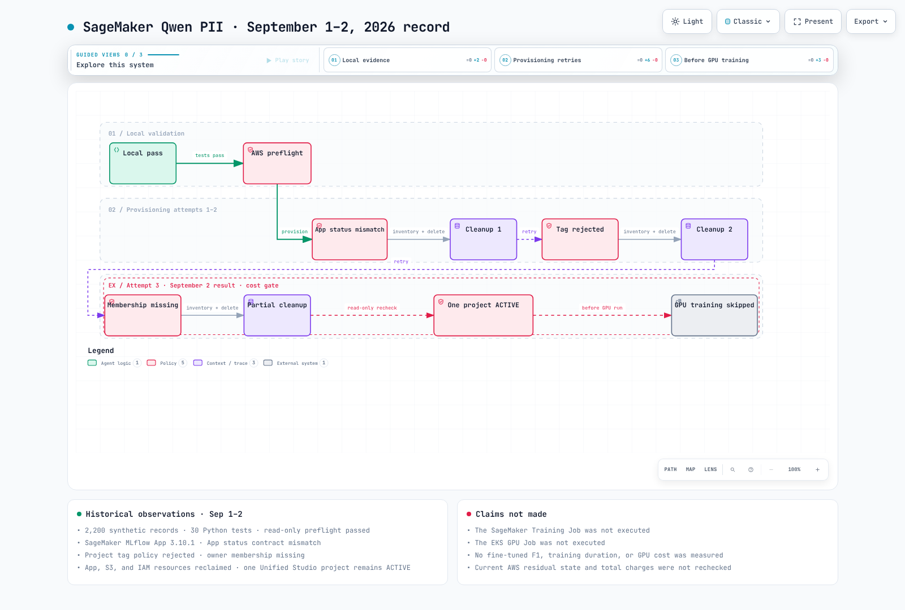

# Part 5: Factual SageMaker Qwen PII Validation Results

> **Last Updated**: September 2, 2026
> **AWS Validation Date**: September 1, 2026
> **Final Status**: blocked before GPU training

## Conclusion

The synthetic dataset, deterministic tokenization, evaluation code, and SageMaker/EKS request contracts were validated locally. In AWS, the quota checks, SageMaker MLflow App, Unified Studio project-creation path, and teardown behavior were exercised.

The third provisioning attempt omitted project membership, leaving the caller unable to delete the created project. Further resource creation stopped, so **neither the SageMaker Training Job nor the EKS GPU Job was executed**.

## Verified Facts

| Item | Result |
|---|---|
| Base model | `Qwen/Qwen3-30B-A3B-Instruct-2507` |
| Synthetic records | 2,200 |
| Train / Validation / Test | 1,600 / 200 / 400 |
| Korean / English | 80% / 20% |
| Python contract and regression tests | 30 passed |
| Extraction contract | `TYPE<TAB>ORIGINAL` |
| Observed SageMaker MLflow App version | `3.10.1` |
| SageMaker training executed | `false` |
| EKS training executed | `false` |
| Remaining project on September 2, 2026 | 1, `ACTIVE` |

## Actual Execution Trace

The following figure is not the target architecture. It shows the **local validation, AWS preflight, three provisioning attempts, cleanup, and actual stop point**. The trace terminates before GPU training.

[🔍 View the interactive validation workflow](https://www.atomai.click/kubernetes-docs/archmaps/en-ai-ml-sagemaker-ai-04-validation-results-0.html)

## Three Provisioning Attempts

| Attempt | Actual Outcome | GPU Training | Cleanup |
|---|---|---|---|
| 1 | the MLflow App reached `Created`, but the initial script waited for a nonexistent App `ACTIVE` state | not started | App, S3, and IAM reclaimed; 0 remaining |
| 2 | the Unified Studio domain rejected custom project resource tags | not started | App, S3, and IAM reclaimed; 0 remaining |
| 3 | the project was created without project membership for the caller role group profile | not started | App, S3, and IAM reclaimed; 1 project remaining |

## Corrections Applied

- treat `Created`/`Updated` as ready MLflow App states;
- treat `Deleted` as the deletion terminal state;
- support domains that reject custom project tags;
- assign the caller IAM role group profile as `PROJECT_OWNER` at project creation;
- use an authorized `ListProjects` result for existence verification;
- use adaptive retry for Service Quotas calls;
- write the latest inventory and run teardown on errors or interrupts.

The corrections are implemented and contract-tested, but the run was not retried while the project remained.

## September 2, 2026 Cleanup State

Read-only recheck:

| Resource Type | State |
|---|---|
| SageMaker MLflow App | none remaining |
| experiment S3 bucket | none remaining |
| experiment IAM roles | none remaining |
| EKS cluster / GPU instance | never created |
| Unified Studio `qwen-pii-*` project | 1 `ACTIVE` |

A domain owner must delete the remaining project, or add the current execution role's group profile as project-owner membership and then delete it.

## What Was Not Measured

| Item | Why No Result Is Published |
|---|---|
| fine-tuned entity F1 | adapter training and tuned evaluation were not executed |
| improvement over baseline | no baseline/tuned pair from the same GPU environment |
| training duration | no SageMaker or EKS training Job executed |
| peak GPU memory | no GPU process executed |
| GPU cost | no GPU Job started, so there is no comparable measured result |

A configured maximum runtime or step count is a design input, not an observed result.

## Rerun Gate

Complete every condition in order:

1. verify that no `qwen-pii-*` Unified Studio project remains;
2. pass read-only preflight;
3. include owner membership for the execution role group profile in project creation;
4. complete a SageMaker smoke run;
5. pass raw-PII logging scans in CloudWatch and MLflow;
6. only then run the full SageMaker Job.

Run the EKS comparison as a separate smoke/full sequence after freezing the SageMaker smoke result and dataset hashes.

## Evidence Locations

- Structured result: `examples/ai-ml/qwen-pii-finetuning/results/provisioning-validation.json`
- Detailed validation record: `docs/superpowers/reports/2026-09-01-sagemaker-qwen-pii-validation.md`
- Runnable package: `examples/ai-ml/qwen-pii-finetuning/`

Previous: [Part 4 — Unified Studio governance](../../data-on-eks/sagemaker-unified-studio/01-domains-projects-governance.md)

Start over: [SageMaker Qwen PII guidebook](README.md)
