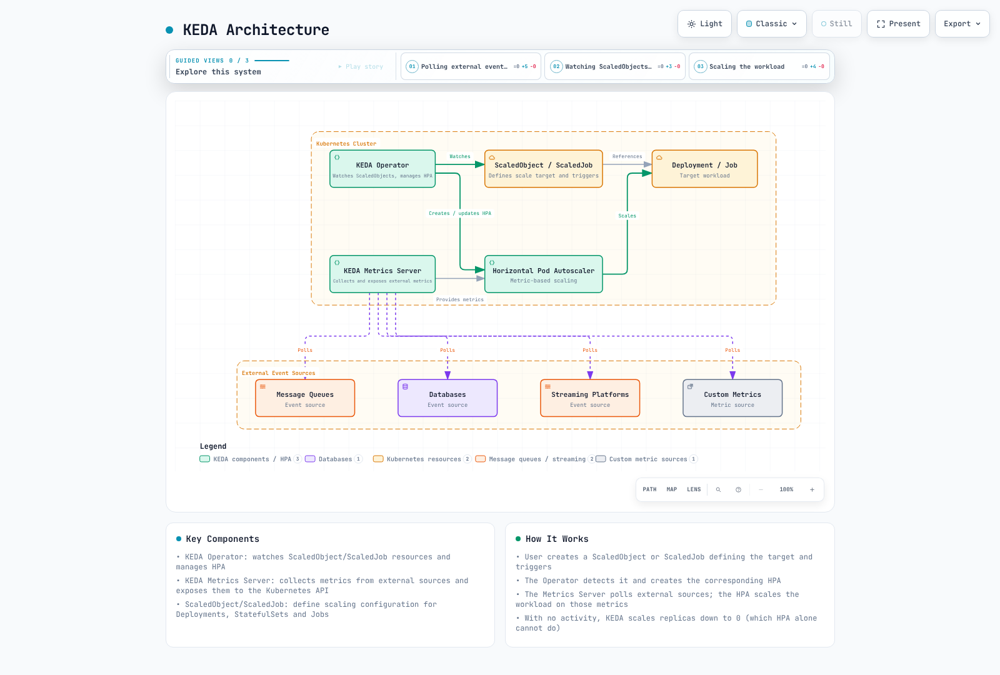

# KEDA (Kubernetes Event-driven Autoscaling)

> **Example Version**: KEDA/Helm chart 2.20.2; see the tested Kubernetes matrix below.
> **Last Updated**: September 11, 2026

## Table of Contents
- [Introduction](#introduction)
- [Architecture](#architecture)
- [Installation and Configuration](#installation-and-configuration)
- [Scalers](#scalers)
- [Custom Metric Scaling](#custom-metric-scaling)
- [Twitter Metric Scaling](#twitter-metric-scaling)
- [Google Calendar Scaling](#google-calendar-scaling)
- [Istio Metric Scaling](#istio-metric-scaling)
- [Cron-based Scaling](#cron-based-scaling)
- [Integration with Amazon EKS](#integration-with-amazon-eks)
- [Best Practices](#best-practices)
- [Troubleshooting](#troubleshooting)
- [Conclusion](#conclusion)

## Introduction

KEDA (Kubernetes Event-driven Autoscaling) is an open-source project that enables event-driven autoscaling for Kubernetes applications. KEDA extends Kubernetes' native Horizontal Pod Autoscaler (HPA) to allow workload scaling based on various event sources and metrics beyond CPU and memory usage.

### Key Benefits of KEDA

1. **Event-driven Scaling**: Scaling based on various event sources (message queues, databases, streams, etc.)
2. **Scale to zero**: Supported event triggers can activate an idle workload; configure the minimum, activation threshold and cooldown for that workload.
3. **Diverse Scaler Support**: Over 50 built-in scalers and custom scaler support
4. **Kubernetes Native**: Integration with existing Kubernetes HPA
5. **Cloud Neutral**: Runs on compatible Kubernetes distributions with the required APIs, network access and identity configuration.
6. **Deployment Model**: The standard installation includes an operator, metrics API server and admission webhooks.

### Comparison with Existing Scaling Methods

| Feature | KEDA | Kubernetes HPA | Cloud Provider Autoscaler |
|---------|------|----------------|---------------------------|
| Metric Sources | Built-in event scalers and external scalers | Resource, custom and external metrics through suitable adapters | Product-dependent |
| Zero Scaling | Supported triggers and configuration | Version/feature dependent; object/external metrics support zero in Kubernetes 1.37 beta | Product-dependent |
| Event-driven | Event-source integrations and activation | Possible through custom/external metric adapters | Product-dependent |
| Cloud Neutral | ✅ | ✅ | ❌ |
| Deployment Complexity | Operator, metrics server, webhooks and credentials | Built-in controller; adapters may be needed | Product-dependent |
| Custom Metrics | Scaler integration or HTTP/gRPC producer | Requires a suitable metrics adapter | Product-dependent |

## Architecture

KEDA is based on the Kubernetes operator pattern, monitoring external metric sources and automatically managing Kubernetes HPA.



[🔍 View interactive diagram](https://www.atomai.click/kubernetes-docs/archmaps/en-autoscaling-01-keda-0.html)


### Key Components

1. **KEDA Operator**: Reconciles ScaledObjects and their HPAs, handles zero activation/deactivation, and creates Jobs for ScaledJobs.
2. **KEDA Metrics Server**: Serves external metrics through the aggregated Kubernetes API, obtaining scaler results through the operator’s metrics service.
3. **ScaledObject**: Defines scaling configuration for Deployments, StatefulSets, etc.
4. **ScaledJob**: Defines scaling configuration for Kubernetes Jobs
5. **Triggers/Scalers**: Fetch event-source metrics and evaluate activation; admission webhooks validate supported resource configurations.

### How It Works

1. A ScaledObject references a compatible scale target in its namespace. KEDA manages one HPA for it; use one scaling owner per target.
2. The operator polls triggers for activation according to `pollingInterval`, including while the workload is at zero.
3. For nonzero replicas, the HPA requests external metrics through the metrics API server and operator. HPA synchronization and metric caching settings affect query frequency.
4. The HPA adjusts nonzero replicas; KEDA handles activation and configured scale-to-zero cooldown. `cooldownPeriod` does not replace HPA scale-down stabilization from N replicas to 1.
5. A ScaledJob follows a separate path: KEDA creates batch Jobs according to events and its scaling strategy; it does not create an HPA for those Jobs.

## Installation and Configuration

Examples are alternatives, not a single manifest bundle. Prepare referenced workloads, Services, Secrets and images; replace account, queue, URL and image placeholders. Do not attach multiple ScaledObjects/HPAs to the same target. Once autoscaling owns replicas, coordinate GitOps/apply ownership of `spec.replicas`. These recipes have not been deployed or measured in production.

Kubernetes 1.37 introduced beta HPA scale-to-zero for object/external metrics, enabled by default through `HPAScaleToZero`; CPU/memory-only metrics cannot activate from zero. This does not change KEDA 2.20’s operator/HPA split or establish compatibility with Kubernetes 1.37.

### Prerequisites

- Choose a Kubernetes version supported by your provider and the selected KEDA release. KEDA 2.20 deployment docs state a minimum of 1.30, while its published **tested matrix is 1.33–1.35**. That matrix does not establish compatibility with 1.36/1.37; validate those combinations separately.
- kubectl configured
- Helm (optional)

### Installation Methods

#### 1. Installation Using Helm

```bash
helm repo add kedacore https://kedacore.github.io/charts
helm repo update
helm install keda kedacore/keda --version 2.20.2 --namespace keda --create-namespace
```

#### 2. Installation Using YAML Manifests

```bash
kubectl apply --server-side -f https://github.com/kedacore/keda/releases/download/v2.20.2/keda-2.20.2.yaml
```

#### 3. Verify Installation

```bash
kubectl get deployments,pods -n keda
kubectl wait --for=condition=Available deployment --all -n keda --timeout=180s
kubectl get apiservice v1beta1.external.metrics.k8s.io
```

Illustrative output (names/counts depend on chart settings; this is not a captured execution):
```
NAME                                      READY   STATUS    RESTARTS   AGE
keda-operator-<hash>-<id>                  1/1     Running   0          1m
keda-operator-metrics-apiserver-<hash>-<id> 1/1     Running   0          1m
keda-admission-webhooks-<hash>-<id>        1/1     Running   0          1m
```

### Basic Configuration

The IRSA values shown later must be merged into the same pinned Helm values before applying an upgrade. Verify the resulting ServiceAccount annotation and restart the operator Pods through your normal rollout when changing identity.

The following values match Helm chart 2.20.2. Two operator replicas provide leader-election standby, not two active reconcilers. Metrics-server redundancy also depends on API aggregation routing and does not imply complete end-to-end high availability. Resource values are a starting point, not measured sizing.

#### Custom Configuration Using Helm Values File

```yaml
operator:
  replicaCount: 2
metricsServer:
  replicaCount: 1
resources:
  operator:
    limits:
      cpu: '1'
      memory: 1000Mi
    requests:
      cpu: 100m
      memory: 100Mi
  metricServer:
    limits:
      cpu: '1'
      memory: 1000Mi
    requests:
      cpu: 100m
      memory: 100Mi
  webhooks:
    limits:
      cpu: '1'
      memory: 1000Mi
    requests:
      cpu: 100m
      memory: 100Mi
logging:
  operator:
    level: info
  metricServer:
    level: 0
```

```bash
helm upgrade --install keda kedacore/keda --version 2.20.2 --namespace keda --create-namespace -f values.yaml
```

## Scalers

KEDA provides scalers for various event sources. Each scaler collects metrics from a specific event source and scales workloads based on them.

### Major Scalers

KEDA supports over 50 scalers, with major ones including:

1. **Message Queues**:
   - Apache Kafka
   - RabbitMQ
   - AWS SQS
   - Azure Service Bus
   - Google Cloud Pub/Sub

2. **Databases**:
   - MySQL
   - PostgreSQL
   - MongoDB
   - Redis

3. **Streaming Platforms**:
   - Apache Kafka
   - AWS Kinesis
   - Azure Event Hubs

4. **Cloud Services**:
   - AWS CloudWatch
   - Azure Monitor
   - Google Cloud Monitoring

5. **Others**:
   - Prometheus
   - InfluxDB
   - Cron
   - CPU/Memory

### Basic ScaledObject Example

Create `rabbitmq-credentials` in the target namespace with key `host` containing a complete authorized AMQP/AMQPS connection URI. The referenced `rabbitmq-consumer` Deployment must already be configured to consume from that queue. Prefer TLS with verified trust on non-isolated networks; the example does not deploy a broker or manufacture credentials.

```yaml
apiVersion: keda.sh/v1alpha1
kind: TriggerAuthentication
metadata:
  name: rabbitmq-auth
  namespace: default
spec:
  secretTargetRef:
  - parameter: host
    name: rabbitmq-credentials
    key: host
---
apiVersion: keda.sh/v1alpha1
kind: ScaledObject
metadata:
  name: rabbitmq-scaledobject
  namespace: default
spec:
  scaleTargetRef:
    apiVersion: apps/v1
    kind: Deployment
    name: rabbitmq-consumer
  pollingInterval: 15
  cooldownPeriod: 30
  minReplicaCount: 0
  maxReplicaCount: 30
  triggers:
  - type: rabbitmq
    metadata:
      protocol: amqp
      queueName: hello
      mode: QueueLength
      value: '5'
    authenticationRef:
      name: rabbitmq-auth
```

### Basic ScaledJob Example

Reuse `rabbitmq-auth` and `rabbitmq-credentials` above. Supply a real worker image whose process consumes bounded work, acknowledges it and exits; otherwise Jobs never complete. Retries can repeat processing, so use application idempotency and appropriate acknowledgements/visibility timeouts. `jobTargetRef` is a JobSpec, not another nested Job or PodTemplate.

```yaml
apiVersion: keda.sh/v1alpha1
kind: ScaledJob
metadata:
  name: rabbitmq-scaledjob
  namespace: default
spec:
  jobTargetRef:
    template:
      spec:
        containers:
        - name: rabbitmq-worker
          image: rabbitmq-worker:latest
          imagePullPolicy: Always
          env:
          - name: RABBITMQ_HOST
            valueFrom:
              secretKeyRef:
                name: rabbitmq-credentials
                key: host
        restartPolicy: Never
    backoffLimit: 4
  pollingInterval: 15
  maxReplicaCount: 30
  successfulJobsHistoryLimit: 5
  failedJobsHistoryLimit: 5
  triggers:
  - type: rabbitmq
    metadata:
      protocol: amqp
      queueName: hello
      mode: QueueLength
      value: '5'
    authenticationRef:
      name: rabbitmq-auth
```
## Custom Metric Scaling

KEDA provides flexibility to scale based on custom metrics in addition to various built-in scalers. This allows you to implement unique scaling logic tailored to your business requirements.

### Using External Metrics API

The counter example uses `rate(...[2m])`, so its target is events/second per replica, not a lifetime total. Prometheus queries must yield a single numeric result. `ignoreNullValues: false` surfaces missing series as an error; decide deliberately whether an empty result means zero or a telemetry outage.

You can implement custom metric-based scaling using external metric sources like Prometheus:

```yaml
apiVersion: keda.sh/v1alpha1
kind: ScaledObject
metadata:
  name: custom-metrics-scaler
  namespace: default
spec:
  scaleTargetRef:
    apiVersion: apps/v1
    kind: Deployment
    name: my-app
  minReplicaCount: 1
  maxReplicaCount: 10
  triggers:
  - type: prometheus
    metadata:
      serverAddress: http://prometheus-server.monitoring.svc.cluster.local
      threshold: '100'
      query: sum(rate(custom_metric_total{namespace="default",pod=~"my-app-.*"}[2m]))
      ignoreNullValues: 'false'
```

### Using HTTP Scaler

This is the `metrics-api` scaler for numeric endpoint data, not the separate KEDA HTTP add-on that intercepts and buffers requests for activation. The endpoint must stay available independently of the workload being scaled, especially at zero.

You can fetch metrics from an HTTP endpoint for scaling:

```yaml
apiVersion: keda.sh/v1alpha1
kind: ScaledObject
metadata:
  name: http-scaler
  namespace: default
spec:
  scaleTargetRef:
    apiVersion: apps/v1
    kind: Deployment
    name: my-app
  minReplicaCount: 1
  maxReplicaCount: 10
  triggers:
  - type: metrics-api
    metadata:
      targetValue: '100'
      url: https://metrics.example.com/metrics
      valueLocation: value
```

### Developing Custom Scalers

The Go example below is an **HTTP JSON metric producer for the built-in `metrics-api` scaler**, not an implementation of Kubernetes external.metrics.k8s.io or KEDA’s external-scaler protocol. A KEDA `external`/`external-push` service instead implements the documented gRPC methods `IsActive`, `GetMetricSpec`, `GetMetrics`, and, for push activation, `StreamIsActive`.

1. Metrics Server Implementation:

The complete Go server reads `METRICS_FILE`, an atomically replaced JSON snapshot with numeric `value` and RFC3339 `observed_at`. A separate business-metric producer must write it. Missing/invalid/negative or older-than-two-minute data returns HTTP503. Build and deploy it with a matching Service before using the following ScaledObject; it is not an aggregated Kubernetes API server.

```go
package main

import (
    "encoding/json"
    "errors"
    "io"
    "log"
    "net/http"
    "os"
    "time"
)

type snapshot struct {
    Value *float64 `json:"value"`
    ObservedAt time.Time `json:"observed_at"`
}

func metricsHandler(path string) http.HandlerFunc {
    return func(w http.ResponseWriter, r *http.Request) {
        if r.Method != http.MethodGet {
            w.Header().Set("Allow", "GET")
            http.Error(w, "method not allowed", http.StatusMethodNotAllowed)
            return
        }
        f, err := os.Open(path)
        if err != nil {
            http.Error(w, "metric unavailable", http.StatusServiceUnavailable)
            return
        }
        defer f.Close()
        var v snapshot
        decoder := json.NewDecoder(io.LimitReader(f, 1<<20))
        if err = decoder.Decode(&v); err == nil {
            var extra any
            if err = decoder.Decode(&extra); !errors.Is(err, io.EOF) {
                http.Error(w, "invalid snapshot", http.StatusServiceUnavailable)
                return
            }
        } else {
            http.Error(w, "invalid snapshot", http.StatusServiceUnavailable)
            return
        }
        age := time.Since(v.ObservedAt)
        if v.Value == nil || *v.Value < 0 || v.ObservedAt.IsZero() || age < -5*time.Second || age > 2*time.Minute {
            http.Error(w, "stale or invalid metric", http.StatusServiceUnavailable)
            return
        }
        w.Header().Set("Content-Type", "application/json")
        w.Header().Set("Cache-Control", "no-store")
        _ = json.NewEncoder(w).Encode(v)
    }
}

func main() {
    path := os.Getenv("METRICS_FILE")
    if path == "" { log.Fatal("METRICS_FILE is required") }
    mux := http.NewServeMux()
    mux.HandleFunc("/metrics", metricsHandler(path))
    server := &http.Server{
        Addr: ":8080", Handler: mux,
        ReadHeaderTimeout: 5 * time.Second,
        WriteTimeout: 10 * time.Second,
        IdleTimeout: 60 * time.Second,
    }
    log.Fatal(server.ListenAndServe())
}
```

2. Integration with KEDA:

```yaml
apiVersion: keda.sh/v1alpha1
kind: ScaledObject
metadata:
  name: custom-scaler
  namespace: default
spec:
  scaleTargetRef:
    apiVersion: apps/v1
    kind: Deployment
    name: my-app
  minReplicaCount: 1
  maxReplicaCount: 10
  triggers:
  - type: metrics-api
    metadata:
      targetValue: '100'
      url: http://custom-metrics-server:8080/metrics
      valueLocation: value
```

## Twitter Metric Scaling

This example uses the X API (formerly Twitter) v2 recent-counts endpoint. It counts matches in a five-minute window ending 30 seconds before collection; this is neither a cumulative count nor an instantaneous posting rate. Account access, query semantics, billing and rate limits must be verified for the intended use.

### Prerequisites

- An X developer application with access to recent Post counts and an app bearer token; no API access or cost is implied by this example.
- A service to collect and expose metrics

### Implementation Steps

1. Implement Twitter Metrics Collector Service:

Save this standalone example as `app.py` in your collector image with Flask, requests and Gunicorn dependencies. The deployment uses one Gunicorn worker and `app:create_app()` so the background collector actually starts under WSGI. Multiple workers/replicas multiply API polling. A partial count, rate-limit or authentication error returns HTTP503 after failure; the code does not silently use a truncated search page as a rate. Tune polling to your API entitlement.

```python
import datetime as dt
import os
import threading
import time

import requests
from flask import Flask, jsonify

TOKEN = os.environ["X_BEARER_TOKEN"]
QUERY = os.environ.get("X_QUERY", "#kubernetes")
POLL_SECONDS = 60
MAX_AGE_SECONDS = 120
METRIC_NAME = "tweet_count"


def fetch_value():
    # Five-minute window ending 30 seconds ago; not a lifetime count or live rate.
    end = dt.datetime.now(dt.timezone.utc) - dt.timedelta(seconds=30)
    start = end - dt.timedelta(minutes=5)
    response = requests.get(
        "https://api.x.com/2/tweets/counts/recent",
        headers={"Authorization": f"Bearer {TOKEN}"},
        params={"query": QUERY, "granularity": "minute",
                "start_time": start.isoformat(), "end_time": end.isoformat()},
        timeout=(3, 10),
    )
    response.raise_for_status()
    body = response.json()
    meta = body["meta"]
    # Never silently scale from a partial result or an API error payload.
    if body.get("errors") or meta.get("next_token"):
        raise ValueError("incomplete counts response")
    value = meta["total_tweet_count"]
    if type(value) is not int or value < 0:
        raise ValueError("invalid count")
    return value


def create_app():
    app = Flask(__name__)
    lock = threading.Lock()
    state = {"value": None, "updated": 0.0, "healthy": False}

    def collect():
        while True:
            try:
                value = fetch_value()
                if type(value) is not int or value < 0:
                    raise ValueError("invalid metric")
                with lock:
                    state.update(value=value, updated=time.monotonic(), healthy=True)
            except Exception as exc:
                with lock:
                    state["healthy"] = False
                app.logger.warning("Metric refresh failed: %s", type(exc).__name__)
            time.sleep(POLL_SECONDS)

    @app.get("/metrics")
    def get_metrics():
        with lock:
            current = state.copy()
        if not current["healthy"] or time.monotonic() - current["updated"] > MAX_AGE_SECONDS:
            return jsonify(error="metric unavailable or stale"), 503
        response = jsonify({METRIC_NAME: current["value"]})
        response.headers["Cache-Control"] = "no-store"
        return response

    threading.Thread(target=collect, daemon=True).start()
    return app


if __name__ == "__main__":
    # Local development only; use a WSGI server for the deployment example.
    create_app().run(host="127.0.0.1", port=8080)
```

2. Deploy Metrics Collector Service:

Build and pin the collector image before deployment. Create the existing token file as Secret input without putting its value in a shell argument:

```bash
kubectl create secret generic twitter-api-secrets --namespace default --from-file=bearer-token=./x-bearer-token
```

This command creates a Kubernetes Secret when run; it was not executed during this audit. Keep the source file out of version control.

```yaml
apiVersion: apps/v1
kind: Deployment
metadata:
  name: twitter-metrics-collector
  namespace: default
spec:
  replicas: 1
  selector:
    matchLabels:
      app: twitter-metrics-collector
  template:
    metadata:
      labels:
        app: twitter-metrics-collector
    spec:
      containers:
      - name: collector
        image: twitter-metrics-collector:latest
        ports:
        - containerPort: 8080
        env:
        - name: X_BEARER_TOKEN
          valueFrom:
            secretKeyRef:
              name: twitter-api-secrets
              key: bearer-token
        command:
        - gunicorn
        args:
        - --bind
        - 0.0.0.0:8080
        - --workers
        - '1'
        - --threads
        - '4'
        - app:create_app()
        resources:
          requests:
            cpu: 100m
            memory: 128Mi
          limits:
            memory: 256Mi
        readinessProbe:
          httpGet:
            path: /metrics
            port: 8080
          periodSeconds: 10
          failureThreshold: 3
      automountServiceAccountToken: false
---
apiVersion: v1
kind: Service
metadata:
  name: twitter-metrics-collector
  namespace: default
spec:
  selector:
    app: twitter-metrics-collector
  ports:
  - port: 80
    targetPort: 8080
```

3. Configure KEDA ScaledObject:

```yaml
apiVersion: keda.sh/v1alpha1
kind: ScaledObject
metadata:
  name: twitter-scaler
  namespace: default
spec:
  scaleTargetRef:
    apiVersion: apps/v1
    kind: Deployment
    name: twitter-processor
  minReplicaCount: 1
  maxReplicaCount: 20
  pollingInterval: 15
  cooldownPeriod: 30
  triggers:
  - type: metrics-api
    metadata:
      targetValue: "10"
      url: "http://twitter-metrics-collector/metrics"
      valueLocation: "tweet_count"
```

With default AverageValue, the count/target ratio proposes replicas within the configured bounds; it does not directly model processing throughput. The collector stays at one replica independently, returns 503 when unavailable, and has no liveness probe that would restart it merely for an upstream outage. Production use still needs tested credentials, limits, lifecycle handling and observability.

## Google Calendar Scaling

This example counts Google Calendar event instances **overlapping the next hour**, including events already in progress. `timeMin` filters event end times and `timeMax` filters start times. All pages are counted; partial, failed or stale collection returns an unavailable metric instead of a false zero.

### Prerequisites

- Enable the Calendar API and use a service account that has read access to a specific shared calendar. Set its actual calendar ID; `primary` is not a substitute for sharing a user calendar with that service account.
- A service to collect and expose metrics

### Implementation Steps

1. Implement Google Calendar Metrics Collector Service:

Save this separate example as `app.py` in its own image with Flask, requests, google-auth and Gunicorn. A single collector thread follows all pages and reports failure on repeated tokens or the page safety limit. The scalar counts overlapping event instances, not attendees or required replicas. The service account must be granted calendar access; an OAuth scope alone does not grant that access.

```python
import datetime as dt
import os
import threading
import time
from urllib.parse import quote

from flask import Flask, jsonify
from google.auth.transport.requests import AuthorizedSession
from google.oauth2 import service_account

CALENDAR_ID = os.environ["CALENDAR_ID"]
SERVICE_ACCOUNT_FILE = "/etc/secrets/service-account.json"
POLL_SECONDS = 300
MAX_AGE_SECONDS = 360
METRIC_NAME = "upcoming_events"


def fetch_value():
    credentials = service_account.Credentials.from_service_account_file(
        SERVICE_ACCOUNT_FILE,
        scopes=["https://www.googleapis.com/auth/calendar.readonly"],
    )
    now = dt.datetime.now(dt.timezone.utc)
    params = {"timeMin": now.isoformat(),
              "timeMax": (now + dt.timedelta(hours=1)).isoformat(),
              "singleEvents": "true", "showDeleted": "false",
              "orderBy": "startTime", "maxResults": 2500}
    url = f"https://www.googleapis.com/calendar/v3/calendars/{quote(CALENDAR_ID, safe='')}/events"
    total = 0
    seen_tokens = set()
    with AuthorizedSession(credentials) as session:
        for _ in range(100):
            response = session.get(url, params=params, timeout=(3, 10))
            response.raise_for_status()
            body = response.json()
            if body.get("error") or body.get("kind") != "calendar#events" or not isinstance(body.get("items", []), list):
                raise ValueError("invalid events response")
            total += len(body.get("items", []))
            token = body.get("nextPageToken")
            if not token:
                return total
            if token in seen_tokens:
                raise ValueError("repeated page token")
            seen_tokens.add(token)
            params["pageToken"] = token
    raise ValueError("pagination limit exceeded; result is incomplete")


def create_app():
    app = Flask(__name__)
    lock = threading.Lock()
    state = {"value": None, "updated": 0.0, "healthy": False}

    def collect():
        while True:
            try:
                value = fetch_value()
                if type(value) is not int or value < 0:
                    raise ValueError("invalid metric")
                with lock:
                    state.update(value=value, updated=time.monotonic(), healthy=True)
            except Exception as exc:
                with lock:
                    state["healthy"] = False
                app.logger.warning("Metric refresh failed: %s", type(exc).__name__)
            time.sleep(POLL_SECONDS)

    @app.get("/metrics")
    def get_metrics():
        with lock:
            current = state.copy()
        if not current["healthy"] or time.monotonic() - current["updated"] > MAX_AGE_SECONDS:
            return jsonify(error="metric unavailable or stale"), 503
        response = jsonify({METRIC_NAME: current["value"]})
        response.headers["Cache-Control"] = "no-store"
        return response

    threading.Thread(target=collect, daemon=True).start()
    return app


if __name__ == "__main__":
    # Local development only; use a WSGI server for the deployment example.
    create_app().run(host="127.0.0.1", port=8080)
```

2. Deploy Metrics Collector Service:

Use the real shared calendar ID and an existing service-account JSON file. The following creates the Secret when run; it was not executed during review.

```bash
kubectl create secret generic google-calendar-secrets --namespace default --from-file=service-account.json=./service-account.json
```

```yaml
apiVersion: apps/v1
kind: Deployment
metadata:
  name: calendar-metrics-collector
  namespace: default
spec:
  replicas: 1
  selector:
    matchLabels:
      app: calendar-metrics-collector
  template:
    metadata:
      labels:
        app: calendar-metrics-collector
    spec:
      containers:
      - name: collector
        image: calendar-metrics-collector:latest
        ports:
        - containerPort: 8080
        env:
        - name: CALENDAR_ID
          value: REPLACE_WITH_SHARED_CALENDAR_ID
        volumeMounts:
        - name: google-calendar-credentials
          mountPath: /etc/secrets
          readOnly: true
        command:
        - gunicorn
        args:
        - --bind
        - 0.0.0.0:8080
        - --workers
        - '1'
        - --threads
        - '4'
        - app:create_app()
        resources:
          requests:
            cpu: 100m
            memory: 128Mi
          limits:
            memory: 256Mi
        readinessProbe:
          httpGet:
            path: /metrics
            port: 8080
          periodSeconds: 10
          failureThreshold: 3
      volumes:
      - name: google-calendar-credentials
        secret:
          secretName: google-calendar-secrets
      automountServiceAccountToken: false
---
apiVersion: v1
kind: Service
metadata:
  name: calendar-metrics-collector
  namespace: default
spec:
  selector:
    app: calendar-metrics-collector
  ports:
  - port: 80
    targetPort: 8080
```

3. Configure KEDA ScaledObject:

```yaml
apiVersion: keda.sh/v1alpha1
kind: ScaledObject
metadata:
  name: calendar-scaler
  namespace: default
spec:
  scaleTargetRef:
    apiVersion: apps/v1
    kind: Deployment
    name: calendar-processor
  minReplicaCount: 1
  maxReplicaCount: 10
  pollingInterval: 15
  cooldownPeriod: 30
  triggers:
  - type: metrics-api
    metadata:
      targetValue: "1"
      url: "http://calendar-metrics-collector/metrics"
      valueLocation: "upcoming_events"
```

With default AverageValue, the count/target ratio proposes replicas within the configured bounds; it does not directly model processing throughput. The collector stays at one replica independently, returns 503 when unavailable, and has no liveness probe that would restart it merely for an upstream outage. Production use still needs tested credentials, limits, lifecycle handling and observability.
## Istio Metric Scaling

This example shows how to scale applications based on metrics collected from the Istio service mesh. We'll look at how to scale based on requests per second (RPS).

### Prerequisites

- Istio service mesh installed
- Prometheus installed and integrated with Istio

### Implementation Steps

1. Verify an existing Istio sidecar installation and injection policy. The sample uses in-mesh routing; it does not require an invented ingress Gateway resource:

```bash
istioctl proxy-status
kubectl get namespace default --show-labels
kubectl get pods -n default
```

2. Deploy Sample Application:

```yaml
apiVersion: apps/v1
kind: Deployment
metadata:
  name: sample-app
  namespace: default
spec:
  replicas: 1
  selector:
    matchLabels:
      app: sample-app
  template:
    metadata:
      labels:
        app: sample-app
    spec:
      containers:
      - name: sample-app
        image: nginx:1.30.4
        ports:
        - containerPort: 80
---
apiVersion: v1
kind: Service
metadata:
  name: sample-app
  namespace: default
spec:
  selector:
    app: sample-app
  ports:
  - port: 80
    targetPort: 80
---
apiVersion: networking.istio.io/v1
kind: VirtualService
metadata:
  name: sample-app
  namespace: default
spec:
  hosts:
  - sample-app.default.svc.cluster.local
  gateways:
  - mesh
  http:
  - route:
    - destination:
        host: sample-app
        port:
          number: 80
```

3. Configure KEDA ScaledObject:

```yaml
apiVersion: keda.sh/v1alpha1
kind: ScaledObject
metadata:
  name: istio-scaler
  namespace: default
spec:
  scaleTargetRef:
    apiVersion: apps/v1
    kind: Deployment
    name: sample-app
  minReplicaCount: 1
  maxReplicaCount: 10
  pollingInterval: 15
  cooldownPeriod: 30
  triggers:
  - type: prometheus
    metadata:
      serverAddress: http://prometheus.istio-system:9090
      threshold: '10'
      query: sum(rate(istio_requests_total{reporter="destination",destination_service="sample-app.default.svc.cluster.local"}[2m]))
      ignoreNullValues: 'false'
```

With the default `AverageValue` metric type, a total rate of 100 requests/second and target 10 requests/second per replica suggests about 10 replicas before HPA tolerance, stabilization and limits. The query selects destination reports to avoid counting the same request from both source and destination proxies. Prometheus must actually scrape that traffic.

### Advanced Configuration

The next example requires a **custom, bounded `request_path` telemetry label**; it is not a default Istio metric dimension. Configure and verify that label first (avoid arbitrary URL cardinality), or use the preceding query without it. This is an alternative ScaledObject for the same target, not an additional scaling owner.

```yaml
apiVersion: keda.sh/v1alpha1
kind: ScaledObject
metadata:
  name: istio-path-scaler
  namespace: default
spec:
  scaleTargetRef:
    apiVersion: apps/v1
    kind: Deployment
    name: sample-app
  minReplicaCount: 1
  maxReplicaCount: 10
  pollingInterval: 15
  cooldownPeriod: 30
  triggers:
  - type: prometheus
    metadata:
      serverAddress: http://prometheus.istio-system:9090
      threshold: '5'
      query: sum(rate(istio_requests_total{reporter="destination",destination_service="sample-app.default.svc.cluster.local",request_path="/api/v1/products"}[2m]))
      ignoreNullValues: 'false'
```

Error ratio and latency are often better alerting signals than scaling inputs. The following opt-in illustration uses `metricType: Value` for a service-wide ratio, guards a zero denominator and limits scale-up speed. It assumes more replicas actually relieve the diagnosed overload; downstream errors or low-sample noise can otherwise cause harmful scaling. No production effectiveness has been measured.

```yaml
apiVersion: keda.sh/v1alpha1
kind: ScaledObject
metadata:
  name: istio-error-scaler
  namespace: default
spec:
  scaleTargetRef:
    apiVersion: apps/v1
    kind: Deployment
    name: sample-app
  minReplicaCount: 1
  maxReplicaCount: 10
  pollingInterval: 15
  cooldownPeriod: 30
  triggers:
  - type: prometheus
    metadata:
      serverAddress: http://prometheus.istio-system:9090
      threshold: '0.05'
      query: (sum(rate(istio_requests_total{reporter="destination",destination_service="sample-app.default.svc.cluster.local",response_code=~"5.*"}[2m]))
        or vector(0)) / clamp_min(sum(rate(istio_requests_total{reporter="destination",destination_service="sample-app.default.svc.cluster.local"}[2m])),
        0.001)
      ignoreNullValues: 'false'
    metricType: Value
  advanced:
    horizontalPodAutoscalerConfig:
      behavior:
        scaleUp:
          policies:
          - type: Pods
            value: 1
            periodSeconds: 60
        scaleDown:
          stabilizationWindowSeconds: 300
```

## Cron-based Scaling

KEDA supports time-based scaling using Cron expressions. This allows you to pre-scale applications according to predictable traffic patterns or schedules.

### Basic Cron Scaler

```yaml
apiVersion: keda.sh/v1alpha1
kind: ScaledObject
metadata:
  name: cron-scaler
  namespace: default
spec:
  scaleTargetRef:
    apiVersion: apps/v1
    kind: Deployment
    name: sample-app
  minReplicaCount: 0
  maxReplicaCount: 10
  pollingInterval: 15
  cooldownPeriod: 30
  triggers:
  - type: cron
    metadata:
      timezone: Asia/Seoul
      start: 30 * * * *
      end: 45 * * * *
      desiredReplicas: "5"
```

During minute 30–45 of each hour, the Cron trigger requests a floor of 5 replicas. Outside the interval it becomes inactive; scale-to-zero waits for polling and the configured cooldown (30 seconds here), plus controller scheduling. The transition is not guaranteed exactly at minute 45.

### Business Hours and Off Hours

Use `minReplicaCount: 2` as the off-hours baseline and a single weekday Cron window for 5 replicas. This avoids overlapping night/weekend windows. HPA stabilization can delay a reduction after business hours.

```yaml
apiVersion: keda.sh/v1alpha1
kind: ScaledObject
metadata:
  name: multi-cron-scaler
  namespace: default
spec:
  scaleTargetRef:
    apiVersion: apps/v1
    kind: Deployment
    name: sample-app
  minReplicaCount: 2
  maxReplicaCount: 10
  pollingInterval: 15
  cooldownPeriod: 30
  triggers:
  - type: cron
    metadata:
      timezone: Asia/Seoul
      start: 0 9 * * 1-5
      end: 0 18 * * 1-5
      desiredReplicas: '5'
```

### Combining Cron with Other Scalers

You can combine Cron scalers with other scalers to set baseline scaling behavior and additionally scale based on actual load:

```yaml
apiVersion: keda.sh/v1alpha1
kind: ScaledObject
metadata:
  name: combined-scaler
  namespace: default
spec:
  scaleTargetRef:
    apiVersion: apps/v1
    kind: Deployment
    name: sample-app
  minReplicaCount: 1
  maxReplicaCount: 20
  pollingInterval: 15
  cooldownPeriod: 30
  triggers:
  - type: cron
    metadata:
      timezone: Asia/Seoul
      start: 0 9 * * 1-5
      end: 0 18 * * 1-5
      desiredReplicas: '5'
  - type: prometheus
    metadata:
      serverAddress: http://prometheus.monitoring.svc.cluster.local:9090
      threshold: '10'
      query: sum(rate(http_requests_total{app="sample-app"}[1m]))
      ignoreNullValues: 'false'
```

## Integration with Amazon EKS

KEDA can scale EKS workloads using AWS metrics when Kubernetes compatibility, operator identity, permissions and connectivity are configured. KEDA does not itself add compute capacity; pair workload scaling with an appropriate node/Fargate capacity design.

### Installing KEDA on EKS

```bash
helm status keda -n keda
kubectl get deployment -n keda
```

### AWS Service-based Scaling

#### SQS Queue-based Scaling

```yaml
apiVersion: keda.sh/v1alpha1
kind: TriggerAuthentication
metadata:
  name: aws-credentials
  namespace: default
spec:
  podIdentity:
    provider: aws
    identityOwner: keda
---
apiVersion: keda.sh/v1alpha1
kind: ScaledObject
metadata:
  name: aws-sqs-scaler
  namespace: default
spec:
  scaleTargetRef:
    apiVersion: apps/v1
    kind: Deployment
    name: sqs-consumer
  minReplicaCount: 0
  maxReplicaCount: 10
  pollingInterval: 15
  cooldownPeriod: 30
  triggers:
  - type: aws-sqs-queue
    metadata:
      queueURL: https://sqs.us-west-2.amazonaws.com/123456789012/my-queue
      queueLength: '5'
      awsRegion: us-west-2
    authenticationRef:
      name: aws-credentials
```

#### CloudWatch Metric-based Scaling

```yaml
apiVersion: keda.sh/v1alpha1
kind: TriggerAuthentication
metadata:
  name: aws-credentials
  namespace: default
spec:
  podIdentity:
    provider: aws
    identityOwner: keda
---
apiVersion: keda.sh/v1alpha1
kind: ScaledObject
metadata:
  name: aws-cloudwatch-scaler
  namespace: default
spec:
  scaleTargetRef:
    apiVersion: apps/v1
    kind: Deployment
    name: cloudwatch-app
  minReplicaCount: 1
  maxReplicaCount: 10
  pollingInterval: 15
  cooldownPeriod: 30
  triggers:
  - type: aws-cloudwatch
    metadata:
      namespace: AWS/SQS
      dimensionName: QueueName
      dimensionValue: my-queue
      metricName: ApproximateNumberOfMessagesVisible
      targetMetricValue: '5'
      minMetricValue: '0'
      awsRegion: us-west-2
      metricStat: Average
      metricStatPeriod: '60'
      metricCollectionTime: '300'
    authenticationRef:
      name: aws-credentials
```

### IRSA (IAM Roles for Service Accounts) Integration

This example assumes an **existing** IRSA role for `system:serviceaccount:keda:keda-operator`, scoped to this cluster’s OIDC provider with `aud: sts.amazonaws.com`. Grant `sqs:GetQueueAttributes` on the selected queue and the required CloudWatch metric-read action (such as `cloudwatch:GetMetricData`); CloudWatch actions without resource-level support require a wildcard resource and can be constrained by requested Region. Consumer permissions are separate. The commands below inspect the setup; role provisioning belongs in your reviewed infrastructure configuration.

```bash
: "${KEDA_IAM_ROLE_NAME:?Set the existing IRSA role name}"
aws iam get-role --role-name "$KEDA_IAM_ROLE_NAME" --query Role.AssumeRolePolicyDocument
kubectl get serviceaccount keda-operator -n keda -o yaml
```

```yaml
serviceAccount:
  operator:
    create: true
    name: keda-operator
    annotations:
      eks.amazonaws.com/role-arn: arn:aws:iam::123456789012:role/keda-operator-role
      eks.amazonaws.com/sts-regional-endpoints: 'true'
```

## Best Practices

### Performance Optimization

1. **Set Appropriate Polling Intervals**: Set polling intervals that match your workload characteristics
2. **Configure cooldown and HPA behavior separately**: Cooldown governs scale-to-zero; HPA stabilization/policies govern changes between nonzero replica counts.
3. **Set Resource Requests and Limits**: Allocate appropriate resources to KEDA components
4. **Write Efficient Queries**: Optimize metric queries

```yaml
apiVersion: keda.sh/v1alpha1
kind: ScaledObject
metadata:
  name: optimized-scaler
  namespace: default
spec:
  pollingInterval: 30
  cooldownPeriod: 300
  scaleTargetRef:
    name: my-app
  triggers:
  - type: prometheus
    metadata:
      serverAddress: http://prometheus.monitoring.svc.cluster.local:9090
      threshold: '100'
      query: sum(rate(http_requests_total{namespace="default",app="my-app"}[2m]))
      ignoreNullValues: 'false'
```

### Improving Reliability

1. **Understand multiple triggers**: HPA normally takes the largest replica recommendation; triggers do not sum capacity and errors can inhibit scale-down.
2. **Set Appropriate Min and Max Replicas**: Set ranges that match workload requirements
3. **Failure Handling Strategy**: In KEDA 2.20, fallback supports Value and AverageValue triggers except CPU/memory, and applies to ScaledObjects rather than ScaledJobs. Test outage behavior and authentication failures.
4. **Set Up Monitoring and Alerts**: Monitor KEDA operational status

```yaml
apiVersion: keda.sh/v1alpha1
kind: ScaledObject
metadata:
  name: reliable-scaler
  namespace: default
spec:
  minReplicaCount: 2
  maxReplicaCount: 20
  fallback:
    failureThreshold: 3
    replicas: 5
  scaleTargetRef:
    name: my-app
  triggers:
  - type: prometheus
    metadata:
      serverAddress: http://prometheus.monitoring.svc.cluster.local:9090
      threshold: '100'
      query: sum(rate(http_requests_total{namespace="default",app="my-app"}[2m]))
      ignoreNullValues: 'false'
```

### Security Hardening

The NetworkPolicy below restricts ingress to the Twitter collector to the KEDA operator on TCP8080; it is not a complete KEDA control-plane policy. Enforcement requires NetworkPolicy support. Before restricting KEDA itself, account for API-server access to the metrics API/admission webhook, operator–metrics-server traffic, DNS, the Kubernetes API and each scaler endpoint. An EKS control plane is not simply a Pod in `kube-system`.

1. **Apply Least Privilege Principle**: Grant only necessary permissions
2. **Secret Management**: Securely manage sensitive information
3. **Apply Network Policies**: Restrict access to KEDA components
4. **Configure RBAC**: Set up appropriate role-based access control

```yaml
apiVersion: keda.sh/v1alpha1
kind: TriggerAuthentication
metadata:
  name: secure-auth
  namespace: default
spec:
  secretTargetRef:
  - parameter: host
    name: rabbitmq-credentials
    key: host
---
apiVersion: networking.k8s.io/v1
kind: NetworkPolicy
metadata:
  name: twitter-metrics-from-keda
  namespace: default
spec:
  podSelector:
    matchLabels:
      app: twitter-metrics-collector
  policyTypes:
  - Ingress
  ingress:
  - from:
    - namespaceSelector:
        matchLabels:
          kubernetes.io/metadata.name: keda
      podSelector:
        matchLabels:
          app: keda-operator
    ports:
    - protocol: TCP
      port: 8080
```

## Troubleshooting

### Common Issues

#### 1. Scaling Not Working

**Symptom**: Pods don't scale even when metrics exceed threshold

**Solution**:
- Check KEDA logs
- Verify metric source connectivity
- Verify authentication configuration

```bash
# Check KEDA operator logs
kubectl logs -n keda -l app=keda-operator

# Check KEDA metrics server logs
kubectl logs -n keda -l app=keda-operator-metrics-apiserver

# Check ScaledObject status
kubectl get scaledobject -n <namespace> <name> -o yaml
```

#### 2. Zero Scaling Issues

**Symptom**: Won't scale down to 0 when there's no activity

**Solution**:
- Check minReplicaCount setting
- Verify metric values
- Check HPA status

```bash
# Check HPA status
kubectl get hpa -n <namespace>

# Check metric values directly
kubectl get --raw "/apis/external.metrics.k8s.io/v1beta1/namespaces/<namespace>/<metric-name>?labelSelector=scaledobject.keda.sh%2Fname%3D<scaledobject-name>" | jq
```

#### 3. Authentication Issues

**Symptom**: Cannot connect to metric source

**Solution**:
- Verify TriggerAuthentication configuration
- Check secrets or environment variables
- Verify permissions

```bash
# Check TriggerAuthentication
kubectl get triggerauthentication -n <namespace> <name> -o yaml

# Check secrets
kubectl get secret -n <namespace> <name> -o json | jq '{name: .metadata.name, type: .type, keys: ((.data // {}) | keys)}'
```

### Debugging Tools

```bash
# Check KEDA version
kubectl get deployment -n keda keda-operator -o jsonpath="{.spec.template.spec.containers[0].image}"

# Check ScaledObject status
kubectl describe scaledobject -n <namespace> <name>

# Check HPA status
kubectl describe hpa -n <namespace> <name>

# Check metric values
kubectl get --raw "/apis/external.metrics.k8s.io/v1beta1/namespaces/<namespace>/<metric-name>?labelSelector=scaledobject.keda.sh%2Fname%3D<scaledobject-name>"

# Check KEDA logs
kubectl logs -n keda -l app=keda-operator --tail=100
```

## Conclusion

KEDA (Kubernetes Event-driven Autoscaling) is a powerful tool that provides event-driven autoscaling in Kubernetes environments. It extends the basic Kubernetes HPA to enable workload scaling based on various event sources and metrics.

This document covered KEDA's basic concepts, installation methods, various scaler usage, custom metric scaling, integration with external services like Twitter and Google Calendar, Istio metric-based scaling, Cron-based scaling, integration with Amazon EKS, best practices, and troubleshooting.

Using KEDA, you can scale applications more efficiently, optimize resource usage, and reduce costs. It's particularly useful for implementing event-driven architectures and serverless patterns.

### Next Steps

- Implement serverless architectures using KEDA
- Explore integration with various event sources
- Develop custom scalers
- Leverage KEDA in multi-cluster environments
- Integrate KEDA with other cloud-native tools

## References

- [KEDA Official Documentation](https://keda.sh/docs/)
- [KEDA GitHub Repository](https://github.com/kedacore/keda)
- [KEDA Scaler List](https://keda.sh/docs/latest/scalers/)
- [KEDA Operator Hub](https://operatorhub.io/operator/keda)
- [AWS IRSA setup](https://docs.aws.amazon.com/eks/latest/userguide/associate-service-account-role.html)

## Quiz

To test what you've learned in this chapter, try the [topic quiz](../quizzes/autoscaling/05-keda-quiz.md).

Verified references for this revision: [KEDA compatibility](https://keda.sh/docs/2.20/operate/cluster/), [ScaledObject](https://keda.sh/docs/2.20/reference/scaledobject-spec/), [ScaledJob](https://keda.sh/docs/2.20/reference/scaledjob-spec/), [AWS authentication](https://keda.sh/docs/2.20/authentication-providers/aws/), [External scaler gRPC](https://keda.sh/docs/2.20/concepts/external-scalers/), [X counts](https://docs.x.com/x-api/posts/counts/quickstart), [Calendar events](https://developers.google.com/workspace/calendar/api/v3/reference/events/list), [HPA](https://kubernetes.io/docs/tasks/run-application/horizontal-pod-autoscale/).
