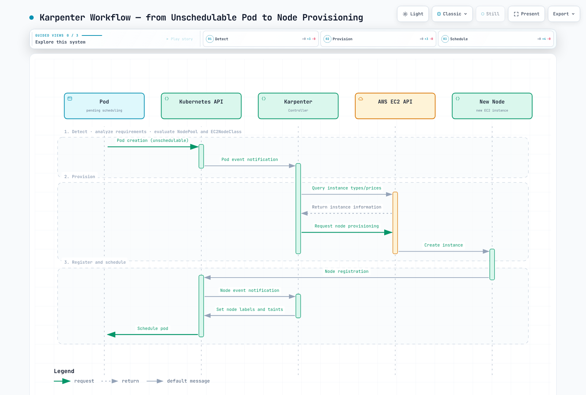
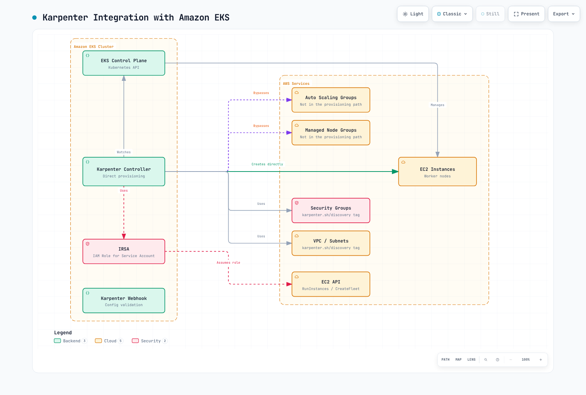
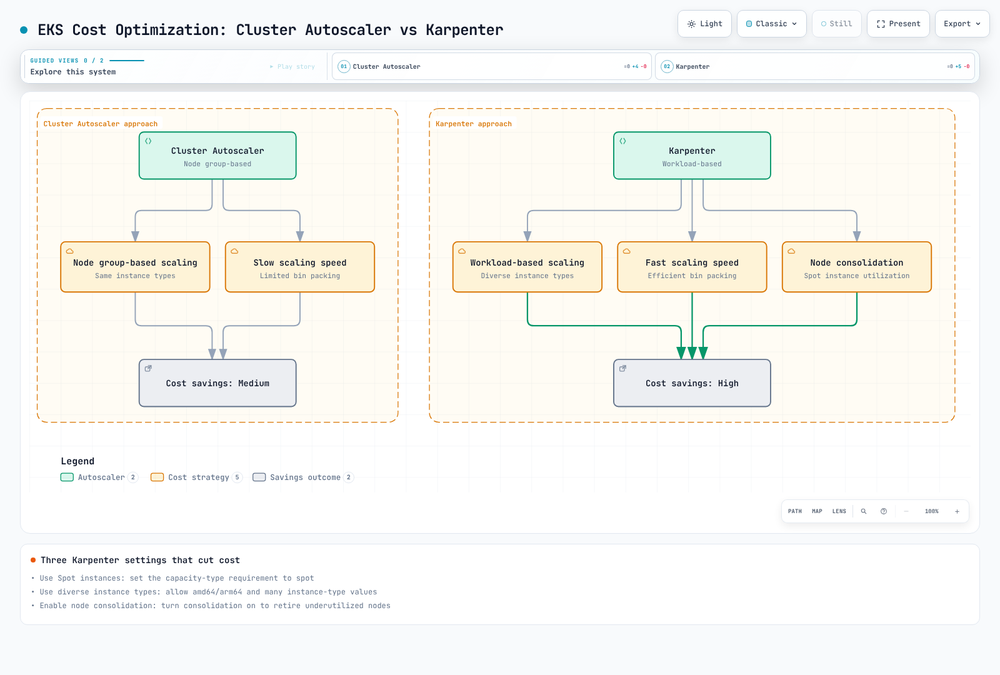
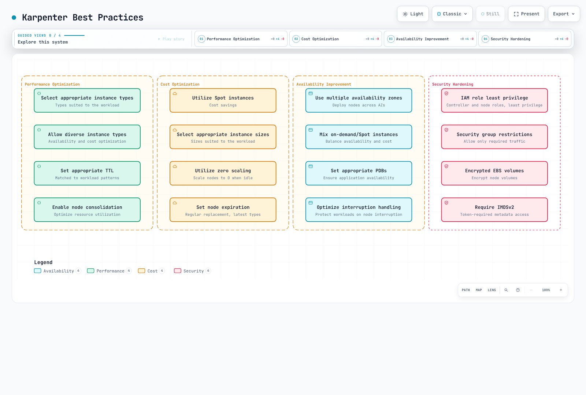

# Karpenter

> **Supported Versions**: Karpenter 1.14 LTS (examples: 1.14.1); select Kubernetes/EKS versions using the compatibility and provider support tables.
> **Last Updated**: September 11, 2026

## Table of Contents
- [Introduction](#introduction)
- [Architecture](#architecture)
- [Installation and Configuration](#installation-and-configuration)
- [NodePool](#nodepool)
- [Node Classes](#node-classes)
- [Interruption Handling](#interruption-handling)
- [Integration](#integration)
- [Integration with Amazon EKS](#integration-with-amazon-eks)
- [Best Practices](#best-practices)
- [Troubleshooting](#troubleshooting)
- [Conclusion](#conclusion)

## Introduction

Karpenter is an open-source node autoscaler. This chapter uses its AWS provider, which provisions EC2 capacity for compatible Kubernetes workloads. Availability and efficiency depend on constraints, cloud capacity, node initialization and application design.

### Key Benefits of Karpenter

1. **Responsive Scaling**: Starts provisioning in response to unschedulable workload demand; node and application readiness have no fixed latency guarantee.
2. **Cost Optimization**: Selection of the most suitable instance types for workloads
3. **Simple Configuration**: Easy configuration through declarative APIs
4. **Workload-centric Design**: Node provisioning based on pod requirements
5. **Cloud Integration**: Leverages cloud provider capabilities
6. **Efficient Bin Packing**: Optimizes resource utilization
7. **Flexible Node Management**: Node lifecycle management and integrated interruption handling

### Comparison with Existing Autoscalers

| Feature | Karpenter | Cluster Autoscaler | Cloud Provider Managed Node Groups |
|---------|-----------|-------------------|---------------------------|
| Scaling Speed | Depends on scheduling, EC2 capacity and initialization | Depends on node-group scaling and initialization | Depends on scaling policy, capacity and initialization |
| Instance Type Selection | Dynamic | Node group-based | Node group-based |
| Bin Packing Efficiency | Workload/constraint-dependent | Workload/node-group-dependent | Depends on scheduler and scaling controller |
| Configuration Complexity | Low | Medium | Low |
| Cloud Integration | Provider-specific implementation | Multiple cloud-provider integrations | Provider-native |
| Node Group Management | Not Required | Required | Required |
| Interruption Handling | Configured event handling and node lifecycle | Depends on platform/integration | Platform-specific handling |

> **Note**: EKS added Managed Node Group warm-pool support on April 8, 2026. Pre-initialized instances can reduce repeated initialization work; Stopped and Running modes have different transition time and cost, and reuse on scale-in is optional. Cluster Autoscaler integration needs no additional configuration according to AWS. Resume, node readiness and application startup still take time. This is an EKS Managed Node Group/Auto Scaling feature, not a Karpenter-managed pool.

## Architecture

Karpenter operates as a Kubernetes controller, detecting unschedulable pods and provisioning appropriate nodes.


[🔍 View interactive diagram](https://www.atomai.click/kubernetes-docs/archmaps/en-autoscaling-02-karpenter-0.html)

### Karpenter Workflow

The following diagram shows how Karpenter works in an EKS cluster:



[🔍 View interactive diagram](https://www.atomai.click/kubernetes-docs/archmaps/en-autoscaling-02-karpenter-1.html)

### Key Components

1. **Karpenter Controller**: Simulates scheduling needs, creates NodeClaims and manages node lifecycle; Kubernetes’ scheduler performs actual Pod binding.
2. **CRD CEL validation**: NodePool and EC2NodeClass are validated by CEL rules in the CRDs (the admission/conversion webhooks were removed in Karpenter 1.1)
3. **NodePool and NodeClaim CRDs**: NodePool defines policy; a NodeClaim records the requirements and lifecycle of an individual provisioned node.
4. **EC2NodeClass CRD**: Defines the configuration of nodes to be provisioned
5. **Cloud Provider Integration**: Integrates with cloud provider APIs to manage compute resources

### How It Works

1. Karpenter Controller detects unschedulable pods
2. Analyzes pod requirements (resources, node selectors, tolerations, etc.)
3. Determines appropriate node types based on NodePool and EC2NodeClass configuration
4. Calls cloud provider API to provision nodes
5. The node registers and becomes ready; the Kubernetes scheduler can then bind eligible Pods. Karpenter does not replace kube-scheduler.
6. Consolidation, drift, expiration, manual deletion and cloud interruptions have distinct triggers and safeguards; they are not all SQS interruption events.

## Installation and Configuration

YAML blocks without apiVersion/kind are configuration fragments for the discussed NodePool or EC2NodeClass spec; they are not standalone kubectl apply documents.

These are independent learning examples for an existing cluster, not a production-ready deployment bundle. Repeated object names represent alternatives. Prepare and verify IAM/OIDC, node access, approved subnets/security groups, bootstrap capacity and the interruption queue before installation. All YAML uses literal example names such as `my-cluster`; kubectl does not expand `${CLUSTER_NAME}` inside a saved YAML file. The audit did not provision AWS resources, install Karpenter or measure scaling. Fresh-install commands fail if that release already exists; existing installations must follow the versioned upgrade/CRD migration guide.

### Prerequisites

- Use a Kubernetes version supported by your platform and the Karpenter matrix. The published matrix lists minimum Karpenter 1.6 for Kubernetes1.34, 1.9 for1.35 and1.13 for1.36; these minimums do not mean every old Karpenter minor remains maintained. The matrix does not currently establish1.37 compatibility. EKS version availability/support must be checked separately.
- kubectl configured
- Cloud provider credentials and permissions
- Helm (optional)

### Installing on AWS EKS

#### 1. IAM Role and Policy Setup

The commands assume an existing controller role, node role and API-based EKS authentication (API or API_AND_CONFIG_MAP). A CONFIG_MAP-only cluster needs its existing aws-auth node mapping checked instead of list-access-entries; do not change authentication mode as an incidental setup step. The node role trusts EC2 and needs worker-node/ECR pull permissions (for example AmazonEKSWorkerNodePolicy and AmazonEC2ContainerRegistryPullOnly). Give the VPC CNI its own identity where supported; SSM permissions are optional and require a configured agent. AmazonEKSClusterPolicy is not a substitute for the Karpenter controller policy.

```bash
# Set the existing cluster and Region; these commands only inspect AWS/Kubernetes.
export CLUSTER_NAME="my-cluster"
export AWS_REGION="us-west-2"
export KARPENTER_VERSION="1.14.1"
ACCOUNT_ID=$(aws sts get-caller-identity --query Account --output text)
CLUSTER_ENDPOINT=$(aws eks describe-cluster --region "$AWS_REGION" --name "$CLUSTER_NAME" --query cluster.endpoint --output text)
export ACCOUNT_ID CLUSTER_ENDPOINT
kubectl config current-context
aws iam get-role --role-name "KarpenterControllerRole-${CLUSTER_NAME}" --query Role.AssumeRolePolicyDocument
aws iam get-role --role-name "KarpenterNodeRole-${CLUSTER_NAME}" --query Role.AssumeRolePolicyDocument
aws eks list-access-entries --region "$AWS_REGION" --cluster-name "$CLUSTER_NAME"
```

#### 2. Installation Using Helm

Use the fresh-install example once, after preparing the referenced queue and bootstrap capacity. For an upgrade, review the versioned migration guide and update the matching CRDs (for example via the separately managed karpenter-crd chart); a controller-chart upgrade alone does not generally upgrade CRDs. Verify ownership before migrating an existing CRD installation.

```bash
# Run only after the prerequisites and the current kubectl context are verified.
: "${CLUSTER_NAME:?Set the existing cluster name}"
: "${ACCOUNT_ID:?Set the AWS account ID}"
: "${CLUSTER_ENDPOINT:?Set the matching EKS endpoint}"
KARPENTER_VERSION="1.14.1"
helm install karpenter oci://public.ecr.aws/karpenter/karpenter \
  --version "$KARPENTER_VERSION" \
  --namespace karpenter --create-namespace \
  --set-string 'serviceAccount.annotations.eks\.amazonaws\.com/role-arn'="arn:aws:iam::${ACCOUNT_ID}:role/KarpenterControllerRole-${CLUSTER_NAME}" \
  --set-string settings.clusterName="$CLUSTER_NAME" \
  --set-string settings.clusterEndpoint="$CLUSTER_ENDPOINT" \
  --set-string settings.interruptionQueue="$CLUSTER_NAME" \
  --wait --timeout 5m
```

#### 3. Verify Installation

```bash
kubectl get deployments,pods -n karpenter
kubectl rollout status deployment/karpenter -n karpenter --timeout=180s
kubectl get nodepools,ec2nodeclasses,nodeclaims
```

Illustrative output for the default two controller replicas (not an execution captured in this audit):
```
NAME                         READY   STATUS    RESTARTS   AGE
karpenter-<hash>-<id-1>      1/1     Running   0          1m
karpenter-<hash>-<id-2>      1/1     Running   0          1m
```

### Basic NodePool and EC2NodeClass Configuration

```yaml
apiVersion: karpenter.sh/v1
kind: NodePool
metadata:
  name: default
spec:
  disruption:
    consolidationPolicy: WhenEmpty
    consolidateAfter: 30s
  limits:
    cpu: '1000'
    memory: 1000Gi
  template:
    spec:
      requirements:
      - key: karpenter.sh/capacity-type
        operator: In
        values:
        - on-demand
      - key: kubernetes.io/arch
        operator: In
        values:
        - amd64
      - key: node.kubernetes.io/instance-type
        operator: In
        values:
        - m5.large
        - m5.xlarge
        - m5.2xlarge
      nodeClassRef:
        group: karpenter.k8s.aws
        kind: EC2NodeClass
        name: default
---
apiVersion: karpenter.k8s.aws/v1
kind: EC2NodeClass
metadata:
  name: default
spec:
  role: KarpenterNodeRole-my-cluster
  amiSelectorTerms:
  - alias: al2023@latest
  subnetSelectorTerms:
  - tags:
      karpenter.sh/discovery: my-cluster
  securityGroupSelectorTerms:
  - tags:
      karpenter.sh/discovery: my-cluster
  tags:
    karpenter.sh/discovery: my-cluster
  blockDeviceMappings:
  - deviceName: /dev/xvda
    ebs:
      volumeSize: 100Gi
      volumeType: gp3
      deleteOnTermination: true
      encrypted: true
```

## NodePool

NodePool is a Kubernetes custom resource that defines how Karpenter provisions nodes. It replaces the previous Provisioner.

### Basic NodePool Configuration

The special taint below intentionally requires a matching workload toleration. startupTaints is empty until you have a verified initializer that removes the configured taint; inventing a startup taint without its owner can leave nodes unusable. Limits, initialization and disruption examples are alternatives, not additive changes to a running production NodePool.

```yaml
apiVersion: karpenter.sh/v1
kind: NodePool
metadata:
  name: default
spec:
  template:
    metadata:
      labels:
        environment: training
        app: web
    spec:
      requirements:
      - key: karpenter.sh/capacity-type
        operator: In
        values:
        - on-demand
      - key: kubernetes.io/arch
        operator: In
        values:
        - amd64
      - key: node.kubernetes.io/instance-type
        operator: In
        values:
        - m5.large
        - m5.xlarge
        - m5.2xlarge
      nodeClassRef:
        group: karpenter.k8s.aws
        kind: EC2NodeClass
        name: default
      expireAfter: 720h
      taints:
      - key: example.com/special-taint
        value: 'true'
        effect: NoSchedule
      startupTaints: []
  limits:
    cpu: '1000'
    memory: 1000Gi
  disruption:
    consolidationPolicy: WhenEmpty
    consolidateAfter: 30s
```

### Requirements Configuration

Requirements are intersected with each other, with the EC2NodeClass and with Pod constraints. Allowing amd64 and arm64 only helps if eligible instance types, AMIs and container images support both. A list of eligible zones/capacity types does not guarantee an even split; use workload topology constraints for that purpose.

Requirements define the characteristics of nodes that Karpenter will provision:

```yaml
template:
  spec:
    requirements:
    - key: karpenter.sh/capacity-type
      operator: In
      values:
      - on-demand
      - spot
    - key: kubernetes.io/arch
      operator: In
      values:
      - amd64
      - arm64
    - key: node.kubernetes.io/instance-type
      operator: In
      values:
      - m5.large
      - m5.xlarge
      - c5.large
      - m6g.large
      - c6g.large
    - key: topology.kubernetes.io/zone
      operator: In
      values:
      - us-west-2a
      - us-west-2b
      - us-west-2c
    - key: kubernetes.io/os
      operator: In
      values:
      - linux
```

### Limits Configuration

`spec.limits` constrains aggregate provisioned resources, but parallel provisioning uses eventually consistent checks and can temporarily exceed a limit. It is not a strict billing cap. String quantities avoid API/GitOps type differences.

```yaml
limits:
  cpu: '1000'
  memory: 1000Gi
  nvidia.com/gpu: '10'
```

### Experimental DRA Allocation Tracking (v1.13)

Core Karpenter v1.13 added DRA device-allocation tracking. This is not a blanket guarantee of production DRA provisioning: the AWS1.14.1 chart defaults `settings.ignoreDRARequests: true`, and upstream labels formal DRA support as not yet GA. A Kubernetes1.29 minimum is not sufficient evidence of compatibility. Validate the exact Kubernetes resource API, DRA driver, ResourceClaims/ResourceSlices and Karpenter configuration; do not treat DRA claims as interchangeable with the device-plugin extended-resource example below.

### Node Expiration Configuration

`expireAfter` defines when expiration-driven draining begins, not a guaranteed replacement-completion time. The optional `terminationGracePeriod` below bounds draining but can force-delete remaining Pods, including those blocked by PDBs. Choose that deadline only after validating application shutdown and recovery requirements.

```yaml
spec:
  template:
    spec:
      expireAfter: 720h
      terminationGracePeriod: 30m
  disruption:
    consolidationPolicy: WhenEmpty
    consolidateAfter: 30s
```

### Recognizing NodeReadinessController Taints (v1.13)

Core Karpenter v1.13 recognizes the separate NodeReadinessController’s `readiness.k8s.io/` taints as ephemeral during scheduling simulation of an uninitialized managed node. It still waits for those taints to disappear before marking initialization complete; it does not delete them or let the Kubernetes scheduler bypass them. Other initializer taints still need accurate `startupTaints` configuration and a controller that removes them.

### July 2026 Update: v1.14 Released

Karpenter v1.14, released July 11, 2026, brings:

- **CapacityBuffers API support**: an alpha capacity-buffer integration; `CapacityBuffer` is disabled by default and requires the matching CRDs/controller configuration. Reserved headroom is not free capacity or a latency guarantee.
- **Preview instance type support**: recognizes eligible preview offerings; actual provisioning still requires account/Region access and availability.
- **Nitro Enclaves support**: the provider sets generated launch-template `EnclaveOptions.Enabled` when NodeClaim resource requests include `eks.amazonaws.com/nip-slots`. Compatible instances, AMI and device-plugin setup remain prerequisites; there is no `EC2NodeClass.spec.enclaveOptions` field in1.14.1.
- Bug fixes: accounting for the primary IP on secondary ENIs, ensuring the Zonal Shift cache is hydrated, wiring an AWS SDK client timeout into the operator config, and more

See the [v1.14.0 release notes](https://github.com/aws/karpenter-provider-aws/releases/tag/v1.14.0) for details.

On July17,2026, older branches received patches including1.3.8 and1.11.3. This historical backport does not establish continued support for all intervening minors. The current support policy lists LTS1.9 through February2027 and LTS1.14 through July2027; regular minors are supported only until the next minor. Select a supported line and follow its migration guidance rather than assuming an old line remains maintained.

AWS’s July22,2026 announcement added EFA network-interface and placement-group configuration for Karpenter/EKS Auto Mode. In AWS Karpenter1.14.1, the concrete fields are `EC2NodeClass.spec.networkInterfaces` and `spec.placementGroupSelector` (not NodePool fields). EFA-only interfaces consume no VPC IP addresses, but a primary `interface` at device/card index0 is still required. Select an existing placement group by name or ID; its cluster/spread/partition strategy and supported instances constrain placement. The example here does not configure or validate an HPC workload.

### August 2026 Update: v1.14.1 Patch Release

[v1.14.1](https://github.com/aws/karpenter-provider-aws/releases/tag/v1.14.1), the first patch on the v1.14 line, was published on August 21, 2026. It is a maintenance release bumping the upstream `sigs.k8s.io/karpenter` version and cherry-picking fixes made since v1.14.0.

## Node Classes

Node classes define the configuration of nodes that Karpenter provisions. On AWS, it uses the EC2NodeClass CRD.

### AWS EC2NodeClass Configuration

```yaml
apiVersion: karpenter.k8s.aws/v1
kind: EC2NodeClass
metadata:
  name: default
spec:
  subnetSelectorTerms:
  - tags:
      karpenter.sh/discovery: my-cluster
  securityGroupSelectorTerms:
  - tags:
      karpenter.sh/discovery: my-cluster
  tags:
    karpenter.sh/discovery: my-cluster
    environment: training
  blockDeviceMappings:
  - deviceName: /dev/xvda
    ebs:
      volumeSize: 100Gi
      volumeType: gp3
      deleteOnTermination: true
      encrypted: true
  role: KarpenterNodeRole-my-cluster
  amiSelectorTerms:
  - alias: al2023@latest
  userData: '#!/bin/bash

    echo "Hello from Karpenter node!"

    '
  metadataOptions:
    httpEndpoint: enabled
    httpProtocolIPv6: disabled
    httpPutResponseHopLimit: 1
    httpTokens: required
```

### Subnet and Security Group Selection

Subnets and security groups are selected with selector terms (multiple terms are ORed; the tags within one term are ANDed):

```yaml
subnetSelectorTerms:
- tags:
    karpenter.sh/discovery: my-cluster
    Name: private-*
securityGroupSelectorTerms:
- tags:
    karpenter.sh/discovery: my-cluster
```

### AMI Configuration

Karpenter selects AMIs through `amiSelectorTerms`. An alias selects a family/version; **`@latest` is not a version pin** and may change resolved AMIs and trigger drift. The `@latest` samples are learning examples. For production, resolve and test an explicit supported AMI release (`al2023@vYYYYMMDD` with a real release date) or approved AMI IDs before rollout. AL2 EKS AMIs are not published for Kubernetes1.33+. The variants below are alternatives, and a Custom AMI requires working bootstrap, registration taint, kubelet, CNI/runtime and identity setup.

```yaml
# Amazon Linux 2023
amiSelectorTerms:
  - alias: al2023@latest
---
# Bottlerocket
amiSelectorTerms:
  - alias: bottlerocket@latest
---
# Custom AMI (by ID) — amiFamily is required when no alias term is used
amiFamily: Custom
amiSelectorTerms:
  - id: "ami-0123456789abcdef0"
# Ubuntu: no v1 alias — use amiFamily: Custom with an id/tags/name term
```

### Block Device Configuration

Device mappings are AMI-family specific. These AL2023 examples use /dev/xvda for the root device; inspect the actual layout for other AMIs. Extra volumes need an explicit filesystem/mount or application storage plan. A customer-managed KMS key also needs the appropriate key/IAM permissions.

You can define the storage configuration for nodes:

```yaml
blockDeviceMappings:
- deviceName: /dev/xvda
  ebs:
    volumeSize: 100Gi
    volumeType: gp3
    iops: 3000
    throughput: 125
    deleteOnTermination: true
    encrypted: true
    kmsKeyID: arn:aws:kms:us-west-2:111122223333:key/1234abcd-12ab-34cd-56ef-1234567890ab
- deviceName: /dev/xvdb
  ebs:
    volumeSize: 500Gi
    volumeType: gp3
    deleteOnTermination: true
    encrypted: true
```

### User Data Configuration

These shell user-data snippets assume AL2023, whose generated bootstrap/nodeadm configuration Karpenter merges with custom data. They are not valid generic Bottlerocket/Windows bootstrap. Bake and test packages in an AMI instead of running an unrestricted package update at every launch. Installing/starting CloudWatch Agent without its configuration, IAM and network path does not establish telemetry collection.

```yaml
userData: |
  #!/bin/bash
  set -euo pipefail
  # Only for a workload that requires this setting; keep node packages in a tested AMI.
  cat > /etc/sysctl.d/99-workload-map-count.conf <<'EOF'
  vm.max_map_count=262144
  EOF
  sysctl -p /etc/sysctl.d/99-workload-map-count.conf
```

### Node Consolidation Process

The following diagram shows Karpenter's node consolidation process. This feature is important for optimizing cluster efficiency and reducing costs:


[🔍 View interactive diagram](https://www.atomai.click/kubernetes-docs/archmaps/en-autoscaling-02-karpenter-2.html)

## Interruption Handling

Configured interruption handling attempts to react before capacity is lost. Notifications, replacement capacity, shutdown deadlines and application recovery determine the outcome; uninterrupted availability is not guaranteed.

### Integrated Interruption Handling

Cloud interruption handling is separate from consolidation/expiration. It covers signals such as:

1. **Spot interruption warnings**: start draining and request replacement capacity when possible; the notice window is not a guaranteed recovery SLA.
2. **Scheduled health/maintenance events**: react to affected instances.
3. **Instance stopping/terminating events**: reconcile capacity that is leaving service.
4. **EC2 instance-status failures**: inspect health with the required EC2 API permissions. Rebalance recommendations alone are published as events, not automatically taint/drain/terminate operations.

### Interruption Handling Configuration

```yaml
apiVersion: karpenter.sh/v1
kind: NodePool
metadata:
  name: default
spec:
  template:
    spec:
      requirements:
        - key: karpenter.sh/capacity-type
          operator: In
          values: ["on-demand"]
      nodeClassRef:
        group: karpenter.k8s.aws
        kind: EC2NodeClass
        name: default

      # Node expiration settings
      expireAfter: 720h  # 30 days
  disruption:
    consolidationPolicy: WhenEmpty
    consolidateAfter: 30s
```

### Draining Configuration

Karpenter normally uses eviction during graceful draining. Helm settings configure the controller; NodePool disruption budgets limit voluntary consolidation/drift starts, not all simultaneous node loss. A30% budget rounds up, then subtracts deleting/not-ready nodes; it is not a strict30% ceiling. Expiration, interruptions and repair can have different forceful behavior. Configure the named SQS queue, EventBridge rules/targets, queue policy and controller permissions before enabling `interruptionQueue`; the Helm field alone does not create them.

```yaml
settings:
  clusterName: my-cluster
  interruptionQueue: my-cluster
  batchMaxDuration: 10s
  batchIdleDuration: 1s
  featureGates:
    spotToSpotConsolidation: false
controller:
  resources:
    requests:
      cpu: 1
      memory: 1Gi
    limits:
      cpu: '1'
      memory: 1Gi
logLevel: info
```

```yaml
apiVersion: karpenter.sh/v1
kind: NodePool
metadata:
  name: default
spec:
  template:
    spec:
      requirements:
        - key: karpenter.sh/capacity-type
          operator: In
          values: ["on-demand"]
      nodeClassRef:
        group: karpenter.k8s.aws
        kind: EC2NodeClass
        name: default
      expireAfter: 720h
  disruption:
    consolidationPolicy: WhenEmpty
    consolidateAfter: 30s
    budgets:
      - nodes: "30%"   # Voluntary budget: round up, then subtract deleting/not-ready nodes
```

### PDB (PodDisruptionBudget) Integration

PDBs constrain voluntary eviction according to healthy replicas; they do not create replicas or guarantee application availability. `minAvailable: 2` below needs sufficient matching healthy Pods before an eviction is allowed. Instance loss and forceful termination deadlines can still interrupt them.

```yaml
apiVersion: policy/v1
kind: PodDisruptionBudget
metadata:
  name: app-pdb
  namespace: default
spec:
  minAvailable: 2
  selector:
    matchLabels:
      app: my-app
```

## Integration

Karpenter integrates with various Kubernetes and cloud services.

### Kubernetes Integration

#### 1. Pod Topology Spread Constraints

Karpenter considers Pod Topology Spread Constraints when provisioning nodes:

```yaml
apiVersion: apps/v1
kind: Deployment
metadata:
  name: web-server
  namespace: default
spec:
  replicas: 10
  template:
    spec:
      topologySpreadConstraints:
      - maxSkew: 1
        topologyKey: topology.kubernetes.io/zone
        whenUnsatisfiable: DoNotSchedule
        labelSelector:
          matchLabels:
            app: web-server
      containers:
      - name: web-server
        image: nginx:1.30.4
        ports:
        - containerPort: 80
        resources:
          requests:
            cpu: 100m
            memory: 128Mi
          limits:
            memory: 256Mi
    metadata:
      labels:
        app: web-server
  selector:
    matchLabels:
      app: web-server
```

#### 2. Pod Affinity/Anti-Affinity

Karpenter considers Pod Affinity and Anti-Affinity rules:

```yaml
apiVersion: apps/v1
kind: Deployment
metadata:
  name: web-server
  namespace: default
spec:
  replicas: 10
  template:
    spec:
      affinity:
        podAntiAffinity:
          requiredDuringSchedulingIgnoredDuringExecution:
          - labelSelector:
              matchExpressions:
              - key: app
                operator: In
                values:
                - web-server
            topologyKey: kubernetes.io/hostname
      containers:
      - name: web-server
        image: nginx:1.30.4
        ports:
        - containerPort: 80
        resources:
          requests:
            cpu: 100m
            memory: 128Mi
          limits:
            memory: 256Mi
    metadata:
      labels:
        app: web-server
  selector:
    matchLabels:
      app: web-server
```

#### 3. Taints and Tolerations

The GPU example requires a compatible accelerated AMI, NVIDIA driver and device-plugin DaemonSet that tolerates the GPU taint and advertises nvidia.com/gpu. The BusyBox Pod only demonstrates reserving a GPU; it does not run or benchmark CUDA. Validate with your real GPU application image separately.

Karpenter considers taints and tolerations when provisioning nodes:

```yaml
apiVersion: karpenter.sh/v1
kind: NodePool
metadata:
  name: gpu
spec:
  template:
    spec:
      requirements:
      - key: node.kubernetes.io/instance-type
        operator: In
        values:
        - g4dn.xlarge
        - g4dn.2xlarge
      taints:
      - key: nvidia.com/gpu
        value: 'true'
        effect: NoSchedule
      nodeClassRef:
        group: karpenter.k8s.aws
        kind: EC2NodeClass
        name: default
---
apiVersion: apps/v1
kind: Deployment
metadata:
  name: gpu-app
  namespace: default
spec:
  replicas: 3
  template:
    spec:
      tolerations:
      - key: nvidia.com/gpu
        operator: Exists
        effect: NoSchedule
      nodeSelector:
        karpenter.sh/nodepool: gpu
      containers:
      - name: gpu-allocation-demo
        image: busybox:1.37.0
        command:
        - sh
        - -c
        - sleep 3600
        resources:
          requests:
            cpu: 100m
            memory: 64Mi
          limits:
            memory: 128Mi
            nvidia.com/gpu: 1
    metadata:
      labels:
        app: gpu-app
  selector:
    matchLabels:
      app: gpu-app
```

### AWS Integration

#### 1. EC2 Spot Instances

Karpenter supports EC2 Spot instances to optimize costs:

```yaml
apiVersion: karpenter.sh/v1
kind: NodePool
metadata:
  name: spot
spec:
  template:
    spec:
      requirements:
      - key: karpenter.sh/capacity-type
        operator: In
        values:
        - spot
      nodeClassRef:
        group: karpenter.k8s.aws
        kind: EC2NodeClass
        name: spot
---
apiVersion: karpenter.k8s.aws/v1
kind: EC2NodeClass
metadata:
  name: spot
spec:
  role: KarpenterNodeRole-my-cluster
  amiSelectorTerms:
  - alias: al2023@latest
  subnetSelectorTerms:
  - tags:
      karpenter.sh/discovery: my-cluster
  securityGroupSelectorTerms:
  - tags:
      karpenter.sh/discovery: my-cluster
```

#### 2. EC2 Instance Profiles

role and instanceProfile are mutually exclusive. With role, Karpenter manages an instance profile and needs the corresponding IAM API permissions/connectivity. If the cluster has no path to the IAM endpoint, use a pre-provisioned instanceProfile; IAM has no PrivateLink endpoint. The controller still needs PassRole for its node role, and EKS node access is separate from possessing EC2 credentials.

Karpenter uses EC2 instance profiles to grant IAM permissions to nodes:

```yaml
apiVersion: karpenter.k8s.aws/v1
kind: EC2NodeClass
metadata:
  name: default
spec:
  instanceProfile: KarpenterNodeInstanceProfile-my-cluster
  amiSelectorTerms:
  - alias: al2023@latest
  subnetSelectorTerms:
  - tags:
      karpenter.sh/discovery: my-cluster
  securityGroupSelectorTerms:
  - tags:
      karpenter.sh/discovery: my-cluster
```

#### 3. Replacing Launch Templates (EC2NodeClass)

Karpenter v1 does not accept user-supplied EC2 launch templates (the legacy `launchTemplate` field was removed). Karpenter generates and manages launch templates itself from the EC2NodeClass, so settings you would have put in a launch template are expressed directly in the EC2NodeClass:

```yaml
apiVersion: karpenter.k8s.aws/v1
kind: EC2NodeClass
metadata:
  name: node-config
spec:
  role: KarpenterNodeRole-my-cluster
  subnetSelectorTerms:
  - tags:
      karpenter.sh/discovery: my-cluster
  securityGroupSelectorTerms:
  - tags:
      karpenter.sh/discovery: my-cluster
  amiSelectorTerms:
  - alias: al2023@latest
  userData: '#!/bin/bash

    echo "Hello from Karpenter node!"

    '
  blockDeviceMappings:
  - deviceName: /dev/xvda
    ebs:
      volumeSize: 100Gi
      volumeType: gp3
      deleteOnTermination: true
      encrypted: true
  metadataOptions:
    httpEndpoint: enabled
    httpProtocolIPv6: disabled
    httpPutResponseHopLimit: 1
    httpTokens: required
```
## Integration with Amazon EKS

Karpenter’s AWS provider can provision EC2 capacity alongside EKS-managed compute when identity, network, node access and bootstrap are configured.



[🔍 View interactive diagram](https://www.atomai.click/kubernetes-docs/archmaps/en-autoscaling-02-karpenter-3.html)

### EKS Cluster Preparation

Replace all example names consistently. Select only worker-appropriate subnets/security groups; tagging every control-plane subnet is not a safe discovery strategy. Verify subnet routes, security rules, CNI IP capacity and any required private endpoints before allowing nodes to launch.

#### 1. Cluster Tag Setup

Have your infrastructure configuration tag only approved worker subnets and security groups. VPC tagging is not what selects those resources. Discovery values must match the examples (`my-cluster` here); tags alone do not prove private routing, suitable security rules or sufficient free addresses. Inspect the actual resources and routes before applying a NodePool.

```bash
# Inspect resources that your infrastructure configuration has tagged for this cluster.
: "${CLUSTER_NAME:?Set the existing cluster name}"
: "${AWS_REGION:?Set the cluster Region}"
aws ec2 describe-subnets --region "$AWS_REGION" \
  --filters "Name=tag:karpenter.sh/discovery,Values=${CLUSTER_NAME}" \
  --query 'Subnets[].{ID:SubnetId,AZ:AvailabilityZone,FreeIPs:AvailableIpAddressCount,PublicIPOnLaunch:MapPublicIpOnLaunch,VPC:VpcId}'
aws ec2 describe-security-groups --region "$AWS_REGION" \
  --filters "Name=tag:karpenter.sh/discovery,Values=${CLUSTER_NAME}" \
  --query 'SecurityGroups[].{ID:GroupId,VPC:VpcId,Name:GroupName}'
# Inspect explicit and main route-table associations for the intended subnets.
aws ec2 describe-route-tables --region "$AWS_REGION" \
  --filters "Name=vpc-id,Values=$(aws eks describe-cluster --region "$AWS_REGION" --name "$CLUSTER_NAME" --query cluster.resourcesVpcConfig.vpcId --output text)"
```

#### 2. IAM Role Setup

Use the version-specific controller policy and infrastructure reference below instead of the earlier incomplete hand-written allow-all policy. Controller credentials (IRSA here) are separate from node credentials and from VPC CNI/workload identities. The controller trust must match the cluster OIDC provider, `system:serviceaccount:karpenter:karpenter` and `aud: sts.amazonaws.com`; grant only the actions/resources/conditions required for this version and chosen features. The node role must be allowed to join EKS, normally through an `EC2_LINUX` access entry when API-based authentication is enabled. No IAM roles or access entries are created by the inspection commands.

```bash
# Download a versioned reference for review; this does not create a CloudFormation stack.
KARPENTER_VERSION="1.14.1"
curl --fail --show-error --location \
  "https://raw.githubusercontent.com/aws/karpenter-provider-aws/v${KARPENTER_VERSION}/website/content/en/preview/getting-started/getting-started-with-karpenter/cloudformation.yaml" \
  --output karpenter-cloudformation-reference.yaml
# Inspect the existing role's attached and inline policies.
: "${CLUSTER_NAME:?Set the existing cluster name}"
aws iam list-attached-role-policies --role-name "KarpenterControllerRole-${CLUSTER_NAME}"
aws iam list-role-policies --role-name "KarpenterControllerRole-${CLUSTER_NAME}"
```

### Installing Karpenter on EKS Cluster

```bash
# Run only after the prerequisites and the current kubectl context are verified.
: "${CLUSTER_NAME:?Set the existing cluster name}"
: "${ACCOUNT_ID:?Set the AWS account ID}"
: "${CLUSTER_ENDPOINT:?Set the matching EKS endpoint}"
KARPENTER_VERSION="1.14.1"
helm install karpenter oci://public.ecr.aws/karpenter/karpenter \
  --version "$KARPENTER_VERSION" \
  --namespace karpenter --create-namespace \
  --set-string 'serviceAccount.annotations.eks\.amazonaws\.com/role-arn'="arn:aws:iam::${ACCOUNT_ID}:role/KarpenterControllerRole-${CLUSTER_NAME}" \
  --set-string settings.clusterName="$CLUSTER_NAME" \
  --set-string settings.clusterEndpoint="$CLUSTER_ENDPOINT" \
  --set-string settings.interruptionQueue="$CLUSTER_NAME" \
  --wait --timeout 5m
```

### Using with EKS Managed Node Groups

Karpenter can coexist with EKS Managed Node Groups. The following NodePool provisions separate EC2 nodes; it does not manage the Managed Node Group. Keep the controller on reliable bootstrap capacity (the default chart excludes Karpenter nodes and requests two replicas on distinct hosts).

```yaml
apiVersion: karpenter.sh/v1
kind: NodePool
metadata:
  name: managed-ng
spec:
  template:
    metadata:
      labels:
        managed-by: karpenter
    spec:
      requirements:
      - key: karpenter.sh/capacity-type
        operator: In
        values:
        - on-demand
      - key: node.kubernetes.io/instance-type
        operator: In
        values:
        - m5.large
        - m5.xlarge
      taints:
      - key: managed-by
        value: karpenter
        effect: NoSchedule
      nodeClassRef:
        group: karpenter.k8s.aws
        kind: EC2NodeClass
        name: managed-ng
  disruption:
    consolidationPolicy: WhenEmpty
    consolidateAfter: 30s
---
apiVersion: karpenter.k8s.aws/v1
kind: EC2NodeClass
metadata:
  name: managed-ng
spec:
  role: KarpenterNodeRole-my-cluster
  amiSelectorTerms:
  - alias: al2023@latest
  subnetSelectorTerms:
  - tags:
      karpenter.sh/discovery: my-cluster
  securityGroupSelectorTerms:
  - tags:
      karpenter.sh/discovery: my-cluster
  tags:
    karpenter.sh/discovery: my-cluster
```

### Using with EKS Fargate

Fargate does not implement Kubernetes topologySpreadConstraints, and Kubernetes affinity/anti-affinity rules do not apply there. Do not assume the default chart’s EC2 placement constraints guarantee Fargate AZ separation; design and verify the profile/subnet placement separately.

A narrowly selected Fargate profile can host controller Pods, while Karpenter provisions EC2 workers. Karpenter does not create Fargate capacity or manage its profiles. Prepare a profile selecting namespace `karpenter` and controller labels rather than all of `default`/`kube-system`; the JSON selector shape is `[{"namespace":"karpenter","labels":{"app.kubernetes.io/name":"karpenter"}}]`. The profile needs its own Pod execution role/private subnets, and controller AWS permissions still need IRSA (EKS Pod Identity is not supported on Fargate). The following command only inspects an existing profile.

```bash
# Inspect an existing, narrowly selected controller Fargate profile.
: "${CLUSTER_NAME:?Set the existing cluster name}"
: "${AWS_REGION:?Set the cluster Region}"
aws eks describe-fargate-profile --region "$AWS_REGION" \
  --cluster-name "$CLUSTER_NAME" --fargate-profile-name karpenter-controller
```

```yaml
apiVersion: karpenter.sh/v1
kind: NodePool
metadata:
  name: ec2
spec:
  template:
    spec:
      requirements:
      - key: karpenter.sh/capacity-type
        operator: In
        values:
        - on-demand
      nodeClassRef:
        group: karpenter.k8s.aws
        kind: EC2NodeClass
        name: ec2
  disruption:
    consolidationPolicy: WhenEmpty
    consolidateAfter: 30s
---
apiVersion: karpenter.k8s.aws/v1
kind: EC2NodeClass
metadata:
  name: ec2
spec:
  role: KarpenterNodeRole-my-cluster
  amiSelectorTerms:
  - alias: al2023@latest
  subnetSelectorTerms:
  - tags:
      karpenter.sh/discovery: my-cluster
  securityGroupSelectorTerms:
  - tags:
      karpenter.sh/discovery: my-cluster
```

### AZ Failure Response: Amazon ARC Zonal Shift Integration (May 2026)

Karpenter can integrate with an enabled EKS ARC zonal-shift resource. Once a manual zonal shift or configured autoshift is active, Karpenter avoids new capacity in the shifted AZ. This is not independent detection of every AZ failure and does not override a Pod/PV requirement that pins work to that AZ.

During an active shift, voluntary disruptions in the shifted AZ are halted; healthy-zone disruptions that depend on moving Pods into that AZ are also prevented. This is not an unconditional halt of every voluntary disruption in all healthy AZs. Configure EKS/ARC prerequisites, `eks:DescribeCluster`/ARC permissions and `settings.enableZonalShift: true` (environment option `ENABLE_ZONAL_SHIFT`); autoshift additionally needs its own opt-in/practice configuration. No custom ARC CRD is required, and operations resume when the shift ends.

### EKS Cost Optimization

You can use Karpenter to optimize costs for EKS clusters:



[🔍 View interactive diagram](https://www.atomai.click/kubernetes-docs/archmaps/en-autoscaling-02-karpenter-4.html)

#### 1. Using Spot Instances

```yaml
apiVersion: karpenter.sh/v1
kind: NodePool
metadata:
  name: spot
spec:
  template:
    spec:
      requirements:
      - key: karpenter.sh/capacity-type
        operator: In
        values:
        - spot
      - key: kubernetes.io/arch
        operator: In
        values:
        - amd64
        - arm64
      nodeClassRef:
        group: karpenter.k8s.aws
        kind: EC2NodeClass
        name: spot
  disruption:
    consolidationPolicy: WhenEmpty
    consolidateAfter: 30s
---
apiVersion: karpenter.k8s.aws/v1
kind: EC2NodeClass
metadata:
  name: spot
spec:
  role: KarpenterNodeRole-my-cluster
  amiSelectorTerms:
  - alias: al2023@latest
  subnetSelectorTerms:
  - tags:
      karpenter.sh/discovery: my-cluster
  securityGroupSelectorTerms:
  - tags:
      karpenter.sh/discovery: my-cluster
```

#### 2. Using Diverse Instance Types

```yaml
apiVersion: karpenter.sh/v1
kind: NodePool
metadata:
  name: flexible
spec:
  template:
    spec:
      requirements:
      - key: karpenter.sh/capacity-type
        operator: In
        values:
        - on-demand
        - spot
      - key: kubernetes.io/arch
        operator: In
        values:
        - amd64
        - arm64
      - key: node.kubernetes.io/instance-type
        operator: In
        values:
        - m5.large
        - m5.xlarge
        - m5.2xlarge
        - m6g.large
        - m6g.xlarge
        - m6g.2xlarge
        - c5.large
        - c5.xlarge
        - c5.2xlarge
        - c6g.large
        - c6g.xlarge
        - c6g.2xlarge
        - r5.large
        - r5.xlarge
        - r5.2xlarge
        - r6g.large
        - r6g.xlarge
        - r6g.2xlarge
      nodeClassRef:
        group: karpenter.k8s.aws
        kind: EC2NodeClass
        name: default
  disruption:
    consolidationPolicy: WhenEmpty
    consolidateAfter: 30s
```

#### 3. Enabling Node Consolidation

```yaml
apiVersion: karpenter.sh/v1
kind: NodePool
metadata:
  name: default
spec:
  template:
    spec:
      requirements:
        - key: karpenter.sh/capacity-type
          operator: In
          values: ["on-demand"]
      nodeClassRef:
        group: karpenter.k8s.aws
        kind: EC2NodeClass
        name: default
  disruption:
    consolidationPolicy: WhenEmptyOrUnderutilized
    consolidateAfter: 1m
```

## Best Practices



[🔍 View interactive diagram](https://www.atomai.click/kubernetes-docs/archmaps/en-autoscaling-02-karpenter-5.html)

### Performance Optimization

1. **Select Appropriate Instance Types**: Choose instance types suitable for your workloads
2. **Allow Diverse Instance Types**: Allow various instance types for availability and cost optimization
3. **Set Appropriate TTL**: Set TTL that matches your workload patterns
4. **Enable Node Consolidation**: Enable node consolidation to optimize resource utilization

```yaml
apiVersion: karpenter.sh/v1
kind: NodePool
metadata:
  name: optimized
spec:
  template:
    spec:
      requirements:
      - key: node.kubernetes.io/instance-type
        operator: In
        values:
        - m5.large
        - m5.xlarge
        - m5.2xlarge
        - c5.large
        - c5.xlarge
        - c5.2xlarge
        - r5.large
        - r5.xlarge
        - r5.2xlarge
      nodeClassRef:
        group: karpenter.k8s.aws
        kind: EC2NodeClass
        name: default
      expireAfter: 720h
  disruption:
    consolidationPolicy: WhenEmpty
    consolidateAfter: 30s
```

### Cost Optimization

1. **Utilize Spot Instances**: Use Spot instances for cost savings
2. **Select Appropriate Instance Sizes**: Choose instance sizes suitable for your workloads
3. **Evaluate empty-node removal**: Eligible worker NodePools can reach zero; controller/bootstrap compute and unrelated cluster costs remain.
4. **Plan node refresh**: Expiration rotates eligible capacity according to current constraints; it does not automatically choose newer instance types or patch a pinned AMI.

```yaml
apiVersion: karpenter.sh/v1
kind: NodePool
metadata:
  name: cost-optimized
spec:
  template:
    spec:
      requirements:
      - key: karpenter.sh/capacity-type
        operator: In
        values:
        - spot
      nodeClassRef:
        group: karpenter.k8s.aws
        kind: EC2NodeClass
        name: default
      expireAfter: 168h
  disruption:
    consolidationPolicy: WhenEmpty
    consolidateAfter: 30s
```

### Availability Improvement

1. **Use Multiple Availability Zones**: Deploy nodes across multiple availability zones
2. **Mix On-demand and Spot Instances**: Balance availability and cost
3. **Set Appropriate PDBs**: Protect voluntary eviction within actual healthy-replica limits, alongside redundancy and recovery design.
4. **Configure and test interruption handling**: Validate notification paths, shutdown deadlines and replacement capacity without assuming uninterrupted service.

```yaml
apiVersion: karpenter.sh/v1
kind: NodePool
metadata:
  name: high-availability
spec:
  template:
    spec:
      requirements:
      - key: topology.kubernetes.io/zone
        operator: In
        values:
        - us-west-2a
        - us-west-2b
        - us-west-2c
      - key: karpenter.sh/capacity-type
        operator: In
        values:
        - on-demand
        - spot
      nodeClassRef:
        group: karpenter.k8s.aws
        kind: EC2NodeClass
        name: default
      expireAfter: 720h
  disruption:
    consolidationPolicy: WhenEmptyOrUnderutilized
    consolidateAfter: 60s
```

## Troubleshooting

### Common Issues

#### 1. Node Provisioning Failure

**Symptom**: Pods remain in Pending state and nodes are not provisioned

**Solution**:
- Check Karpenter logs
- Verify IAM permissions
- Check NodePool configuration

```bash
# Check Karpenter logs
kubectl logs -n karpenter -l app.kubernetes.io/name=karpenter -c controller

# Check NodePool status
kubectl describe nodepool <name>

# Check pod events
kubectl describe pod <name>
```

#### 2. Node Removal Issues

**Symptom**: Nodes are not removed as expected

**Solution**:
- Check TTL settings
- Verify node consolidation settings
- Check pod draining status

```bash
# Check node status
kubectl describe node <name>

# Check node labels
kubectl get node <name> --show-labels

# Check Karpenter logs
kubectl logs -n karpenter -l app.kubernetes.io/name=karpenter -c controller --since=30m
```

#### 3. Instance Type Selection Issues

**Symptom**: Unexpected instance types are provisioned

**Solution**:
- Check NodePool requirements
- Verify pod resource requests
- Check availability zone constraints

```bash
# Check NodePool requirements
kubectl get nodepool <name> -o yaml

# Check pod resource requests
kubectl describe pod <name>

# Check node information
kubectl describe node <name>
```

### Debugging Tools

```bash
# Check Karpenter version
kubectl get deployment -n karpenter karpenter -o jsonpath="{.spec.template.spec.containers[0].image}"

# Check Karpenter logs
kubectl logs -n karpenter -l app.kubernetes.io/name=karpenter -c controller

# Check NodePool list
kubectl get nodepools

# Check EC2NodeClass list
kubectl get ec2nodeclasses

# Check events
kubectl get events --sort-by='.lastTimestamp'

# Inspect the installed chart version and values before any optional log-level change.
helm list --namespace karpenter --filter '^karpenter$'
helm get values karpenter --namespace karpenter
kubectl get nodeclaims -o wide
```

## Conclusion

Karpenter automates node provisioning and lifecycle according to workload and infrastructure constraints. It can improve capacity management, but availability, performance and cost outcomes require workload-specific verification.

This document covered Karpenter's basic concepts, installation methods, NodePool and EC2NodeClass configuration, interruption handling, various integrations, integration with Amazon EKS, best practices, and troubleshooting.

Using Karpenter, you can simplify cluster management, optimize resource utilization, and reduce costs. Especially in cloud-managed Kubernetes environments like Amazon EKS, you can maximize the benefits of Karpenter.

### Next Steps

- Implement cost optimization strategies using Karpenter
- Configure NodePools for various workload types
- Design hybrid cluster architectures
- Integrate Karpenter with other Kubernetes tools
- Develop advanced node lifecycle management strategies

## References

- [Karpenter Official Documentation](https://karpenter.sh/)
- [Karpenter AWS Provider Repository](https://github.com/aws/karpenter-provider-aws)
- [Amazon EKS Workshop - Karpenter](https://www.eksworkshop.com/docs/autoscaling/compute/karpenter/)
- [AWS Blog - Karpenter](https://aws.amazon.com/blogs/aws/introducing-karpenter-an-open-source-high-performance-kubernetes-cluster-autoscaler/)
- [Karpenter Best Practices](https://aws.github.io/aws-eks-best-practices/karpenter/)
- [Karpenter GitHub Releases](https://github.com/aws/karpenter-provider-aws/releases)
- [AWS What's New - Karpenter ARC Zonal Shift Support](https://aws.amazon.com/about-aws/whats-new/2026/05/karpenter-arc-zonal-shift/)
- [AWS What's New - Amazon EKS Managed Node Group Warm Pool Support](https://aws.amazon.com/about-aws/whats-new/2026/04/amazon-eks-managed-node-groups-ec2-warm-pools/)

## Quiz

To test what you've learned in this chapter, try the [topic quiz](../quizzes/autoscaling/06-karpenter-quiz.md).

Verified primary references for this revision: [Compatibility](https://karpenter.sh/v1.14/upgrading/compatibility/), [NodePool](https://karpenter.sh/v1.14/concepts/nodepools/), [EC2NodeClass](https://karpenter.sh/v1.14/concepts/nodeclasses/), [Disruption](https://karpenter.sh/v1.14/concepts/disruption/), [Support policy](https://github.com/aws/karpenter-provider-aws/blob/main/SUPPORT.md), [Pinned Helm values](https://github.com/aws/karpenter-provider-aws/blob/v1.14.1/charts/karpenter/values.yaml), [Readiness taints](https://github.com/kubernetes-sigs/karpenter/commit/05431485c90c76a3a662b678a46c1a8da330038d), [Pinned DRA option](https://github.com/kubernetes-sigs/karpenter/blob/6e7eab7a0f48/pkg/operator/options/options.go), [EKS node IAM](https://docs.aws.amazon.com/eks/latest/userguide/create-node-role.html), [Fargate profiles](https://docs.aws.amazon.com/eks/latest/userguide/fargate-profile.html).
