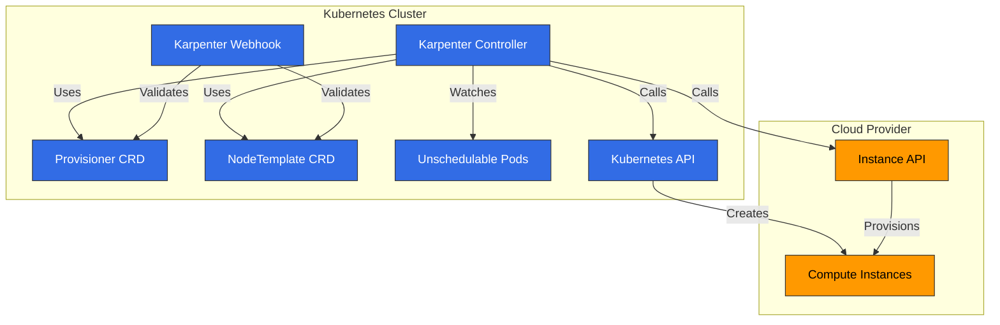
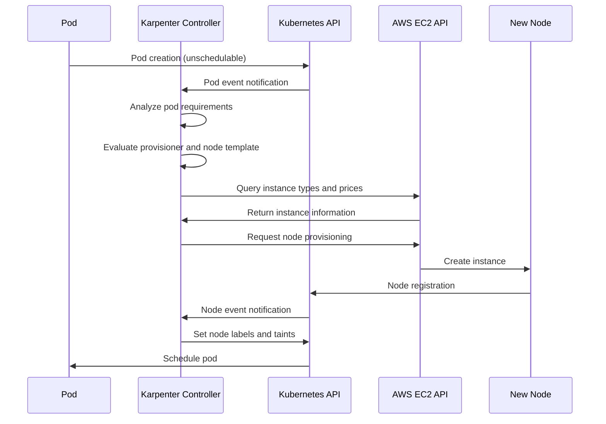
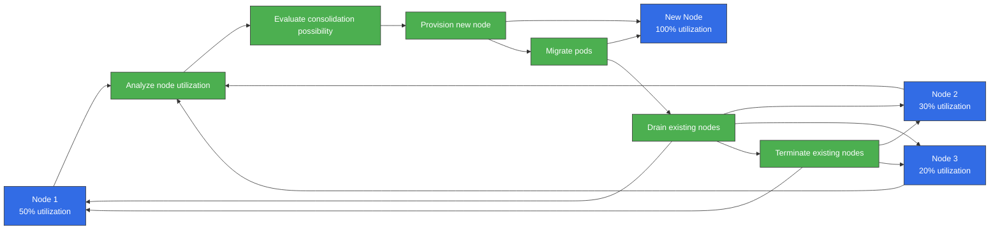
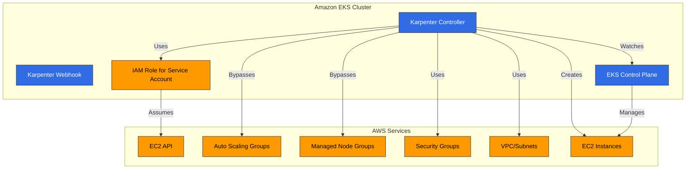

# Karpenter

> **Supported Versions**: Karpenter 1.6 - 1.14, Kubernetes 1.29+ (as of v1.14)
> **Last Updated**: July 11, 2026

## Table of Contents
- [Introduction](#introduction)
- [Architecture](#architecture)
- [Installation and Configuration](#installation-and-configuration)
- [Provisioner](#provisioner)
- [Node Templates](#node-templates)
- [Interruption Handling](#interruption-handling)
- [Integration](#integration)
- [Integration with Amazon EKS](#integration-with-amazon-eks)
- [Best Practices](#best-practices)
- [Troubleshooting](#troubleshooting)
- [Conclusion](#conclusion)

## Introduction

Karpenter is an open-source cluster autoscaler that automates node provisioning for Kubernetes clusters. Karpenter dynamically provisions appropriate compute resources based on workload requirements to ensure application availability and optimize cluster efficiency.

### Key Benefits of Karpenter

1. **Fast Scaling**: Node provisioning within seconds based on workload requirements
2. **Cost Optimization**: Selection of the most suitable instance types for workloads
3. **Simple Configuration**: Easy configuration through declarative APIs
4. **Workload-centric Design**: Node provisioning based on pod requirements
5. **Cloud Integration**: Leverages cloud provider capabilities
6. **Efficient Bin Packing**: Optimizes resource utilization
7. **Flexible Node Management**: Node lifecycle management and integrated interruption handling

### Comparison with Existing Autoscalers

| Feature | Karpenter | Cluster Autoscaler | Cloud Provider Managed Node Groups |
|---------|-----------|-------------------|---------------------------|
| Scaling Speed | Very Fast (seconds) | Medium (minutes) | Slow (minutes) |
| Instance Type Selection | Dynamic | Node group-based | Node group-based |
| Bin Packing Efficiency | High | Medium | Low |
| Configuration Complexity | Low | Medium | Low |
| Cloud Integration | Native | Limited | Native |
| Node Group Management | Not Required | Required | Required |
| Interruption Handling | Integrated | Limited | Limited |

> **Note**: If you stick with traditional EKS Managed Node Groups and Cluster Autoscaler instead of Karpenter, EC2 Auto Scaling Warm Pools (available since April 2026) let you keep pre-initialized instances on standby for cold-start-free scale-out. You can choose a Stopped state (lower cost) or Running state (faster transition), and it integrates automatically with Cluster Autoscaler — but this is a Managed Node Group feature, not something Karpenter uses.

## Architecture

Karpenter operates as a Kubernetes controller, detecting unschedulable pods and provisioning appropriate nodes.



### Karpenter Workflow

The following diagram shows how Karpenter works in an EKS cluster:



### Key Components

1. **Karpenter Controller**: Detects unschedulable pods and manages node provisioning
2. **Karpenter Webhook**: Validates Karpenter resources
3. **Provisioner CRD**: Defines node provisioning policies
4. **NodeTemplate CRD**: Defines the configuration of nodes to be provisioned
5. **Cloud Provider Integration**: Integrates with cloud provider APIs to manage compute resources

### How It Works

1. Karpenter Controller detects unschedulable pods
2. Analyzes pod requirements (resources, node selectors, tolerations, etc.)
3. Determines appropriate node types based on provisioner and node template configuration
4. Calls cloud provider API to provision nodes
5. Schedules pods once nodes join the cluster
6. Removes nodes through integrated interruption handling when they're no longer needed

## Installation and Configuration

### Prerequisites

- Kubernetes cluster (v1.19 or higher)
- kubectl configured
- Cloud provider credentials and permissions
- Helm (optional)

### Installing on AWS EKS

#### 1. IAM Role and Policy Setup

```bash
# IRSA setup using eksctl
eksctl create iamserviceaccount \
  --cluster=my-cluster \
  --name=karpenter \
  --namespace=karpenter \
  --attach-policy-arn=arn:aws:iam::aws:policy/AmazonEKSClusterPolicy \
  --attach-policy-arn=arn:aws:iam::aws:policy/AmazonEC2ContainerRegistryReadOnly \
  --approve

# Create instance profile
aws iam create-instance-profile --instance-profile-name KarpenterNodeInstanceProfile

# Create node role
aws iam create-role --role-name KarpenterNodeRole --assume-role-policy-document file://node-trust-policy.json

# Attach policies to node role
aws iam attach-role-policy --role-name KarpenterNodeRole --policy-arn arn:aws:iam::aws:policy/AmazonEKSWorkerNodePolicy
aws iam attach-role-policy --role-name KarpenterNodeRole --policy-arn arn:aws:iam::aws:policy/AmazonEKS_CNI_Policy
aws iam attach-role-policy --role-name KarpenterNodeRole --policy-arn arn:aws:iam::aws:policy/AmazonEC2ContainerRegistryReadOnly
aws iam attach-role-policy --role-name KarpenterNodeRole --policy-arn arn:aws:iam::aws:policy/AmazonSSMManagedInstanceCore

# Add role to instance profile
aws iam add-role-to-instance-profile --instance-profile-name KarpenterNodeInstanceProfile --role-name KarpenterNodeRole
```

#### 2. Installation Using Helm

```bash
# Add Helm repository
helm repo add karpenter https://charts.karpenter.sh
helm repo update

# Install Karpenter
helm install karpenter karpenter/karpenter \
  --namespace karpenter \
  --create-namespace \
  --set serviceAccount.annotations."eks\.amazonaws\.com/role-arn"=arn:aws:iam::${ACCOUNT_ID}:role/KarpenterControllerRole \
  --set clusterName=${CLUSTER_NAME} \
  --set clusterEndpoint=${CLUSTER_ENDPOINT} \
  --set aws.defaultInstanceProfile=KarpenterNodeInstanceProfile
```

#### 3. Verify Installation

```bash
kubectl get pods -n karpenter
```

Expected output:
```
NAME                         READY   STATUS    RESTARTS   AGE
karpenter-6f4f46d855-5lqx7   1/1     Running   0          1m
```

### Basic Provisioner Configuration

```yaml
apiVersion: karpenter.sh/v1
kind: NodePool
metadata:
  name: default
spec:
  disruption:
    consolidationPolicy: WhenEmpty
    consolidateAfter: 30s
  limits:
    cpu: 1000
    memory: 1000Gi
  template:
    spec:
      requirements:
        - key: karpenter.sh/capacity-type
          operator: In
          values: ["on-demand"]
        - key: kubernetes.io/arch
          operator: In
          values: ["amd64"]
        - key: node.kubernetes.io/instance-type
          operator: In
          values: ["m5.large", "m5.xlarge", "m5.2xlarge"]
      nodeClassRef:
        group: karpenter.k8s.aws
        kind: EC2NodeClass
        name: default
---
apiVersion: karpenter.k8s.aws/v1
kind: EC2NodeClass
metadata:
  name: default
spec:
  subnetSelectorTerms:
    - tags:
        karpenter.sh/discovery: "true"
  securityGroupSelectorTerms:
    - tags:
        karpenter.sh/discovery: "true"
  tags:
    karpenter.sh/discovery: "true"
  blockDeviceMappings:
    - deviceName: /dev/xvda
      ebs:
        volumeSize: 100Gi
        volumeType: gp3
        deleteOnTermination: true
```

## NodePool

NodePool is a Kubernetes custom resource that defines how Karpenter provisions nodes. It replaces the previous Provisioner.

### Basic NodePool Configuration

```yaml
apiVersion: karpenter.sh/v1
kind: NodePool
metadata:
  name: default
spec:
  # Node requirements
  template:
    spec:
      requirements:
        - key: karpenter.sh/capacity-type
          operator: In
          values: ["on-demand"]
        - key: kubernetes.io/arch
          operator: In
          values: ["amd64"]
        - key: node.kubernetes.io/instance-type
          operator: In
          values: ["m5.large", "m5.xlarge", "m5.2xlarge"]

  # Resource limits
  limits:
    cpu: 1000
    memory: 1000Gi

  # Node class reference
  template:
    spec:
      nodeClassRef:
        group: karpenter.k8s.aws
        kind: EC2NodeClass
        name: default

  # Node expiration settings
  disruption:
    consolidationPolicy: WhenEmpty
    consolidateAfter: 30s
    expireAfter: 720h  # 30 days

  # Taints and labels
  template:
    spec:
      taints:
        - key: example.com/special-taint
          value: "true"
          effect: NoSchedule
      labels:
        environment: production
        app: web

  # Startup template
  template:
    spec:
      startupTaints:
        - key: node.kubernetes.io/not-ready
          effect: NoSchedule
```

### Requirements Configuration

Requirements define the characteristics of nodes that Karpenter will provision:

```yaml
template:
  spec:
    requirements:
      # Capacity type (on-demand or spot)
      - key: karpenter.sh/capacity-type
        operator: In
        values: ["on-demand", "spot"]

      # Architecture
      - key: kubernetes.io/arch
        operator: In
        values: ["amd64", "arm64"]

      # Instance types
      - key: node.kubernetes.io/instance-type
        operator: In
        values: ["m5.large", "m5.xlarge", "c5.large"]

      # Availability zones
      - key: topology.kubernetes.io/zone
        operator: In
        values: ["us-west-2a", "us-west-2b", "us-west-2c"]

      # Operating system
      - key: kubernetes.io/os
        operator: In
        values: ["linux"]
```

### Limits Configuration

Limits define the maximum amount of resources Karpenter can provision:

```yaml
limits:
  cpu: 1000
  memory: 1000Gi
  nvidia.com/gpu: 10
```

### Dynamic Resource Allocation (DRA) Support (v1.13)

Starting with Karpenter v1.13 (released June 2026), Karpenter supports device allocation tracking based on Kubernetes Dynamic Resource Allocation (DRA). Karpenter can now recognize claim-based resources such as GPUs and specialized accelerators and factor them into provisioning decisions, enabling accurate scaling not only for extended resources like `nvidia.com/gpu` but also for AI/HPC workloads that use DRA `ResourceClaim`/`DeviceClass` objects. DRA-based tracking requires Kubernetes 1.29 or later.

### Node Expiration Configuration

Node expiration settings define when Karpenter removes nodes:

```yaml
disruption:
  # Consolidate (remove) when node is empty
  consolidationPolicy: WhenEmpty

  # Time until consolidation (removal) after node becomes empty
  consolidateAfter: 30s

  # Maximum time before removing node after creation
  expireAfter: 720h  # 30 days
```

### Automatic Ignoring of Initialization Taints via NodeReadinessController (v1.13)

The NodeReadinessController, added in Karpenter v1.13, automatically ignores readiness-related taints (such as those applied while a node is initializing) to reduce unnecessary scheduling blocks. This eases the initialization-delay problem that previously required manual handling via `startupTaints`, improving scheduling stability and provisioning reliability while a new node is coming up to Ready.

### July 2026 Update: v1.14 Released

Karpenter v1.14, released July 11, 2026, brings:

- **CapacityBuffers API support**: declaratively reserve headroom capacity to absorb sudden scale-out spikes
- **Preview instance type support**: instance types that are not yet generally available can now be selected for provisioning
- **Nitro Enclaves support**: `EnclaveOptions.Enabled` can be set in the launch template, useful for confidential-computing workloads
- Bug fixes: accounting for the primary IP on secondary ENIs, ensuring the Zonal Shift cache is hydrated, wiring an AWS SDK client timeout into the operator config, and more

See the [v1.14.0 release notes](https://github.com/aws/karpenter-provider-aws/releases/tag/v1.14.0) for details.

## Node Classes

Node classes define the configuration of nodes that Karpenter provisions. On AWS, it uses the EC2NodeClass CRD.

### AWS EC2NodeClass Configuration

```yaml
apiVersion: karpenter.k8s.aws/v1
kind: EC2NodeClass
metadata:
  name: default
spec:
  # Subnet selection
  subnetSelectorTerms:
    - tags:
        karpenter.sh/discovery: "true"

  # Security group selection
  securityGroupSelectorTerms:
    - tags:
        karpenter.sh/discovery: "true"

  # Instance tags
  tags:
    karpenter.sh/discovery: "true"
    environment: production

  # Block device mappings
  blockDeviceMappings:
    - deviceName: /dev/xvda
      ebs:
        volumeSize: 100Gi
        volumeType: gp3
        deleteOnTermination: true
        encrypted: true

  # Detailed instance configuration
  role: KarpenterNodeRole
  amiFamily: AL2
  userData: |
    #!/bin/bash
    echo "Hello from Karpenter node!"

  # Metadata options
  metadataOptions:
    httpEndpoint: enabled
    httpProtocolIPv6: disabled
    httpPutResponseHopLimit: 2
    httpTokens: required
```

### Subnet and Security Group Selection

Subnets and security groups can be selected using label selectors:

```yaml
# Subnet selection
subnetSelector:
  karpenter.sh/discovery: "true"
  Name: "private-*"

# Security group selection
securityGroupSelector:
  karpenter.sh/discovery: "true"
  aws:eks:cluster-name: "my-cluster"
```

### AMI Configuration

Karpenter supports various AMI families:

```yaml
# Amazon Linux 2
amiFamily: AL2

# Bottlerocket
amiFamily: Bottlerocket

# Ubuntu
amiFamily: Ubuntu

# Custom AMI
amiSelector:
  aws:ec2:image:id: "ami-0123456789abcdef0"
```

### Block Device Configuration

You can define the storage configuration for nodes:

```yaml
blockDeviceMappings:
  # Root volume
  - deviceName: /dev/xvda
    ebs:
      volumeSize: 100Gi
      volumeType: gp3
      iops: 3000
      throughput: 125
      deleteOnTermination: true
      encrypted: true
      kmsKeyID: "arn:aws:kms:us-west-2:111122223333:key/1234abcd-12ab-34cd-56ef-1234567890ab"

  # Additional volume
  - deviceName: /dev/xvdb
    ebs:
      volumeSize: 500Gi
      volumeType: gp3
      deleteOnTermination: true
```

### User Data Configuration

You can define user data scripts to run at node startup:

```yaml
userData: |
  #!/bin/bash
  echo "Hello from Karpenter node!"

  # System configuration
  sysctl -w vm.max_map_count=262144

  # Package installation
  yum update -y
  yum install -y amazon-cloudwatch-agent

  # Start CloudWatch agent
  systemctl enable amazon-cloudwatch-agent
  systemctl start amazon-cloudwatch-agent
```

### Node Consolidation Process

The following diagram shows Karpenter's node consolidation process. This feature is important for optimizing cluster efficiency and reducing costs:



## Interruption Handling

Karpenter automatically handles node interruptions to ensure workload availability.

### Integrated Interruption Handling

Karpenter handles the following interruption events:

1. **Spot Instance Interruptions**: Handles AWS Spot instance interruption notifications
2. **Node Expiration**: TTL-based node replacement
3. **Scale Down**: Removes nodes when they're no longer needed
4. **Node Consolidation**: Consolidates to more efficient node configurations

### Interruption Handling Configuration

```yaml
apiVersion: karpenter.sh/v1
kind: NodePool
metadata:
  name: default
spec:
  # Other configuration...

  # Node expiration settings
  disruption:
    consolidationPolicy: WhenEmpty
    consolidateAfter: 30s
    expireAfter: 720h  # 30 days
```

### Draining Configuration

Karpenter safely drains pods before removing nodes:

```yaml
apiVersion: v1
kind: ConfigMap
metadata:
  name: karpenter-global-settings
  namespace: karpenter
data:
  aws:
    enablePodENI: "true"
  batchMaxDuration: "10s"
  batchIdleDuration: "1s"
  featureGates:
    driftEnabled: "true"
  nodePool:
    disruptionBudget:
      maxUnavailablePercentage: "30"
    disruption:
      consolidationPolicy: WhenEmpty
      consolidateAfter: 30s
      expireAfter: 720h
```

### PDB (PodDisruptionBudget) Integration

Karpenter respects PDBs to ensure application availability:

```yaml
apiVersion: policy/v1
kind: PodDisruptionBudget
metadata:
  name: app-pdb
spec:
  minAvailable: 2
  selector:
    matchLabels:
      app: my-app
```

## Integration

Karpenter integrates with various Kubernetes and cloud services.

### Kubernetes Integration

#### 1. Pod Topology Spread Constraints

Karpenter considers Pod Topology Spread Constraints when provisioning nodes:

```yaml
apiVersion: apps/v1
kind: Deployment
metadata:
  name: web-server
spec:
  replicas: 10
  template:
    spec:
      topologySpreadConstraints:
        - maxSkew: 1
          topologyKey: topology.kubernetes.io/zone
          whenUnsatisfiable: DoNotSchedule
          labelSelector:
            matchLabels:
              app: web-server
```

#### 2. Pod Affinity/Anti-Affinity

Karpenter considers Pod Affinity and Anti-Affinity rules:

```yaml
apiVersion: apps/v1
kind: Deployment
metadata:
  name: web-server
spec:
  replicas: 10
  template:
    spec:
      affinity:
        podAntiAffinity:
          requiredDuringSchedulingIgnoredDuringExecution:
            - labelSelector:
                matchExpressions:
                  - key: app
                    operator: In
                    values:
                      - web-server
              topologyKey: "kubernetes.io/hostname"
```

#### 3. Taints and Tolerations

Karpenter considers taints and tolerations when provisioning nodes:

```yaml
apiVersion: karpenter.sh/v1alpha5
kind: Provisioner
metadata:
  name: gpu
spec:
  requirements:
    - key: node.kubernetes.io/instance-type
      operator: In
      values: ["g4dn.xlarge", "g4dn.2xlarge"]
  taints:
    - key: nvidia.com/gpu
      value: "true"
      effect: NoSchedule
---
apiVersion: apps/v1
kind: Deployment
metadata:
  name: gpu-app
spec:
  replicas: 3
  template:
    spec:
      tolerations:
        - key: nvidia.com/gpu
          operator: Exists
          effect: NoSchedule
      nodeSelector:
        karpenter.sh/provisioner-name: gpu
```

### AWS Integration

#### 1. EC2 Spot Instances

Karpenter supports EC2 Spot instances to optimize costs:

```yaml
apiVersion: karpenter.sh/v1alpha5
kind: Provisioner
metadata:
  name: spot
spec:
  requirements:
    - key: karpenter.sh/capacity-type
      operator: In
      values: ["spot"]
  providerRef:
    name: spot
---
apiVersion: karpenter.k8s.aws/v1alpha1
kind: AWSNodeTemplate
metadata:
  name: spot
spec:
  subnetSelector:
    karpenter.sh/discovery: "true"
  securityGroupSelector:
    karpenter.sh/discovery: "true"
```

#### 2. EC2 Instance Profiles

Karpenter uses EC2 instance profiles to grant IAM permissions to nodes:

```yaml
apiVersion: karpenter.k8s.aws/v1alpha1
kind: AWSNodeTemplate
metadata:
  name: default
spec:
  instanceProfile: KarpenterNodeInstanceProfile
```

#### 3. Launch Templates

Karpenter supports EC2 launch templates:

```yaml
apiVersion: karpenter.k8s.aws/v1alpha1
kind: AWSNodeTemplate
metadata:
  name: custom-launch-template
spec:
  launchTemplate:
    name: my-launch-template
    version: "1"
```
## Integration with Amazon EKS

Karpenter integrates seamlessly with Amazon EKS to provide cluster autoscaling.



### EKS Cluster Preparation

#### 1. Cluster Tag Setup

Set up tags so Karpenter can identify cluster resources:

```bash
# Set cluster name
CLUSTER_NAME="my-cluster"

# VPC tag setup
aws ec2 create-tags \
  --resources $(aws eks describe-cluster \
    --name ${CLUSTER_NAME} \
    --query "cluster.resourcesVpcConfig.vpcId" \
    --output text) \
  --tags Key=karpenter.sh/discovery,Value=${CLUSTER_NAME}

# Subnet tag setup
for SUBNET in $(aws eks describe-cluster \
  --name ${CLUSTER_NAME} \
  --query "cluster.resourcesVpcConfig.subnetIds[]" \
  --output text); do
  aws ec2 create-tags \
    --resources ${SUBNET} \
    --tags Key=karpenter.sh/discovery,Value=${CLUSTER_NAME}
done

# Security group tag setup
aws ec2 create-tags \
  --resources $(aws eks describe-cluster \
    --name ${CLUSTER_NAME} \
    --query "cluster.resourcesVpcConfig.clusterSecurityGroupId" \
    --output text) \
  --tags Key=karpenter.sh/discovery,Value=${CLUSTER_NAME}
```

#### 2. IAM Role Setup

Set up IAM roles required for the Karpenter controller and nodes:

```bash
# Create controller role
cat <<EOF > controller-trust-policy.json
{
  "Version": "2012-10-17",
  "Statement": [
    {
      "Effect": "Allow",
      "Principal": {
        "Federated": "arn:aws:iam::${ACCOUNT_ID}:oidc-provider/${OIDC_PROVIDER}"
      },
      "Action": "sts:AssumeRoleWithWebIdentity",
      "Condition": {
        "StringEquals": {
          "${OIDC_PROVIDER}:sub": "system:serviceaccount:karpenter:karpenter",
          "${OIDC_PROVIDER}:aud": "sts.amazonaws.com"
        }
      }
    }
  ]
}
EOF

aws iam create-role \
  --role-name KarpenterControllerRole-${CLUSTER_NAME} \
  --assume-role-policy-document file://controller-trust-policy.json

# Create controller policy
cat <<EOF > controller-policy.json
{
  "Version": "2012-10-17",
  "Statement": [
    {
      "Effect": "Allow",
      "Action": [
        "ec2:CreateLaunchTemplate",
        "ec2:CreateFleet",
        "ec2:RunInstances",
        "ec2:CreateTags",
        "ec2:TerminateInstances",
        "ec2:DescribeLaunchTemplates",
        "ec2:DescribeInstances",
        "ec2:DescribeSecurityGroups",
        "ec2:DescribeSubnets",
        "ec2:DescribeInstanceTypes",
        "ec2:DescribeInstanceTypeOfferings",
        "ec2:DescribeAvailabilityZones",
        "ec2:DescribeSpotPriceHistory",
        "pricing:GetProducts",
        "ssm:GetParameter"
      ],
      "Resource": "*"
    },
    {
      "Effect": "Allow",
      "Action": "iam:PassRole",
      "Resources": "arn:aws:iam::${ACCOUNT_ID}:role/KarpenterNodeRole-${CLUSTER_NAME}",
      "Condition": {
        "StringEquals": {
          "iam:PassedToService": "ec2.amazonaws.com"
        }
      }
    }
  ]
}
EOF

aws iam put-role-policy \
  --role-name KarpenterControllerRole-${CLUSTER_NAME} \
  --policy-name KarpenterControllerPolicy-${CLUSTER_NAME} \
  --policy-document file://controller-policy.json
```

### Installing Karpenter on EKS Cluster

```bash
# Installation using Helm
helm install karpenter karpenter/karpenter \
  --namespace karpenter \
  --create-namespace \
  --set serviceAccount.annotations."eks\.amazonaws\.com/role-arn"=arn:aws:iam::${ACCOUNT_ID}:role/KarpenterControllerRole-${CLUSTER_NAME} \
  --set clusterName=${CLUSTER_NAME} \
  --set clusterEndpoint=$(aws eks describe-cluster --name ${CLUSTER_NAME} --query "cluster.endpoint" --output text) \
  --set aws.defaultInstanceProfile=KarpenterNodeInstanceProfile-${CLUSTER_NAME}
```

### Using with EKS Managed Node Groups

Karpenter can be used alongside EKS Managed Node Groups:

```yaml
# Provisioner for EKS Managed Node Groups
apiVersion: karpenter.sh/v1alpha5
kind: Provisioner
metadata:
  name: managed-ng
spec:
  requirements:
    - key: karpenter.sh/capacity-type
      operator: In
      values: ["on-demand"]
    - key: node.kubernetes.io/instance-type
      operator: In
      values: ["m5.large", "m5.xlarge"]
  labels:
    managed-by: karpenter
  taints:
    - key: managed-by
      value: karpenter
      effect: NoSchedule
  providerRef:
    name: managed-ng
  ttlSecondsAfterEmpty: 30
---
apiVersion: karpenter.k8s.aws/v1alpha1
kind: AWSNodeTemplate
metadata:
  name: managed-ng
spec:
  subnetSelector:
    karpenter.sh/discovery: "${CLUSTER_NAME}"
  securityGroupSelector:
    karpenter.sh/discovery: "${CLUSTER_NAME}"
  tags:
    karpenter.sh/discovery: "${CLUSTER_NAME}"
```

### Using with EKS Fargate

Karpenter can be used with EKS Fargate to configure hybrid clusters:

```yaml
# Create Fargate profile
aws eks create-fargate-profile \
  --cluster-name ${CLUSTER_NAME} \
  --fargate-profile-name fp-default \
  --pod-execution-role-arn arn:aws:iam::${ACCOUNT_ID}:role/AmazonEKSFargatePodExecutionRole \
  --selectors namespace=default,namespace=kube-system

# Karpenter NodePool configuration
apiVersion: karpenter.sh/v1
kind: NodePool
metadata:
  name: ec2
spec:
  template:
    spec:
      requirements:
        - key: karpenter.sh/capacity-type
          operator: In
          values: ["on-demand"]
      nodeClassRef:
        group: karpenter.k8s.aws
        kind: EC2NodeClass
        name: ec2
  disruption:
    consolidationPolicy: WhenEmpty
    consolidateAfter: 30s
---
apiVersion: karpenter.k8s.aws/v1
kind: EC2NodeClass
metadata:
  name: ec2
spec:
  subnetSelectorTerms:
    - tags:
        karpenter.sh/discovery: "${CLUSTER_NAME}"
  securityGroupSelectorTerms:
    - tags:
        karpenter.sh/discovery: "${CLUSTER_NAME}"
```

### AZ Failure Response: Amazon ARC Zonal Shift Integration (May 2026)

Karpenter supports Zonal Shift from Amazon ARC (Application Recovery Controller). When an Availability Zone (AZ) fails, Karpenter automatically stops provisioning new nodes in that AZ and schedules workloads toward healthy AZs instead. Zonal Autoshift, where AWS automatically detects AZ health and handles traffic shifting and recovery, is also supported.

When a failure is detected, Karpenter also automatically suspends voluntary disruption (consolidation, drift handling, etc.) so that unnecessary node replacement doesn't further destabilize the cluster during an outage. This uses your existing EKS ARC resources directly — no custom resources are required — and is enabled with the `ENABLE_ZONAL_SHIFT` option.

### EKS Cost Optimization

You can use Karpenter to optimize costs for EKS clusters:

```mermaid
flowchart TD
    %% Node definitions
    CA[Cluster Autoscaler]
    KA[Karpenter]

    %% Cost optimization strategies
    CA1[Node group-based scaling]
    CA2[Same instance types]
    CA3[Slow scaling speed]
    CA4[Limited bin packing]

    KA1[Workload-based scaling]
    KA2[Diverse instance types]
    KA3[Fast scaling speed]
    KA4[Efficient bin packing]
    KA5[Node consolidation]
    KA6[Spot instance utilization]

    %% Results
    CAR[Cost savings: Medium]
    KAR[Cost savings: High]

    %% Connection definitions
    CA --> CA1 & CA2 & CA3 & CA4
    CA1 & CA2 & CA3 & CA4 --> CAR

    KA --> KA1 & KA2 & KA3 & KA4 & KA5 & KA6
    KA1 & KA2 & KA3 & KA4 & KA5 & KA6 --> KAR

    %% Style definitions
    classDef k8sComponent fill:#326CE5,stroke:#333,stroke-width:1px,color:white;
    classDef awsService fill:#FF9900,stroke:#333,stroke-width:1px,color:black;
    classDef userApp fill:#00C7B7,stroke:#333,stroke-width:1px,color:white;
    classDef dataStore fill:#3B48CC,stroke:#333,stroke-width:1px,color:white;
    classDef prometheus fill:#E6522C,stroke:#333,stroke-width:1px,color:white;
    classDef victoriaMetrics fill:#4285F4,stroke:#333,stroke-width:1px,color:white;
    classDef grafana fill:#F8B52A,stroke:#333,stroke-width:1px,color:black;
    classDef alerting fill:#EB6E85,stroke:#333,stroke-width:1px,color:white;
    classDef strategy fill:#4CAF50,stroke:#333,stroke-width:1px,color:white;
    classDef result fill:#E91E63,stroke:#333,stroke-width:1px,color:white;
    classDef default fill:#f9f9f9,stroke:#333,stroke-width:1px,color:black;

    %% Class application
    class CA,KA k8sComponent
    class CA1,CA2,CA3,CA4,KA1,KA2,KA3,KA4,KA5,KA6 strategy
    class CAR,KAR result
```



#### 1. Using Spot Instances

```yaml
apiVersion: karpenter.sh/v1alpha5
kind: Provisioner
metadata:
  name: spot
spec:
  requirements:
    - key: karpenter.sh/capacity-type
      operator: In
      values: ["spot"]
    - key: kubernetes.io/arch
      operator: In
      values: ["amd64", "arm64"]
  providerRef:
    name: spot
  ttlSecondsAfterEmpty: 30
---
apiVersion: karpenter.k8s.aws/v1alpha1
kind: AWSNodeTemplate
metadata:
  name: spot
spec:
  subnetSelector:
    karpenter.sh/discovery: "${CLUSTER_NAME}"
  securityGroupSelector:
    karpenter.sh/discovery: "${CLUSTER_NAME}"
```

#### 2. Using Diverse Instance Types

```yaml
apiVersion: karpenter.sh/v1alpha5
kind: Provisioner
metadata:
  name: flexible
spec:
  requirements:
    - key: karpenter.sh/capacity-type
      operator: In
      values: ["on-demand", "spot"]
    - key: kubernetes.io/arch
      operator: In
      values: ["amd64", "arm64"]
    - key: node.kubernetes.io/instance-type
      operator: In
      values: [
        "m5.large", "m5.xlarge", "m5.2xlarge",
        "m6g.large", "m6g.xlarge", "m6g.2xlarge",
        "c5.large", "c5.xlarge", "c5.2xlarge",
        "c6g.large", "c6g.xlarge", "c6g.2xlarge",
        "r5.large", "r5.xlarge", "r5.2xlarge",
        "r6g.large", "r6g.xlarge", "r6g.2xlarge"
      ]
  providerRef:
    name: flexible
  ttlSecondsAfterEmpty: 30
```

#### 3. Enabling Node Consolidation

```yaml
apiVersion: karpenter.sh/v1alpha5
kind: Provisioner
metadata:
  name: default
spec:
  consolidation:
    enabled: true
  # Other configuration...
```

## Best Practices

```mermaid
flowchart TD
    %% Key areas
    P[Performance Optimization]
    C[Cost Optimization]
    A[Availability Improvement]
    S[Security Hardening]

    %% Performance optimization strategies
    P1[Select appropriate instance types]
    P2[Allow diverse instance types]
    P3[Set appropriate TTL]
    P4[Enable node consolidation]

    %% Cost optimization strategies
    C1[Utilize Spot instances]
    C2[Select appropriate instance sizes]
    C3[Utilize zero scaling]
    C4[Set node expiration]

    %% Availability improvement strategies
    A1[Use multiple availability zones]
    A2[Mix on-demand/Spot instances]
    A3[Set appropriate PDBs]
    A4[Optimize interruption handling]

    %% Security hardening strategies
    S1[IAM role least privilege]
    S2[Security group restrictions]
    S3[Encrypted EBS volumes]
    S4[Require IMDSv2]

    %% Connection definitions
    P --> P1 & P2 & P3 & P4
    C --> C1 & C2 & C3 & C4
    A --> A1 & A2 & A3 & A4
    S --> S1 & S2 & S3 & S4

    %% Style definitions
    classDef k8sComponent fill:#326CE5,stroke:#333,stroke-width:1px,color:white;
    classDef awsService fill:#FF9900,stroke:#333,stroke-width:1px,color:black;
    classDef userApp fill:#00C7B7,stroke:#333,stroke-width:1px,color:white;
    classDef dataStore fill:#3B48CC,stroke:#333,stroke-width:1px,color:white;
    classDef prometheus fill:#E6522C,stroke:#333,stroke-width:1px,color:white;
    classDef victoriaMetrics fill:#4285F4,stroke:#333,stroke-width:1px,color:white;
    classDef grafana fill:#F8B52A,stroke:#333,stroke-width:1px,color:black;
    classDef alerting fill:#EB6E85,stroke:#333,stroke-width:1px,color:white;
    classDef category fill:#9C27B0,stroke:#333,stroke-width:1px,color:white;
    classDef performance fill:#4CAF50,stroke:#333,stroke-width:1px,color:white;
    classDef cost fill:#FF9800,stroke:#333,stroke-width:1px,color:white;
    classDef availability fill:#2196F3,stroke:#333,stroke-width:1px,color:white;
    classDef security fill:#F44336,stroke:#333,stroke-width:1px,color:white;
    classDef default fill:#f9f9f9,stroke:#333,stroke-width:1px,color:black;

    %% Class application
    class P,C,A,S category
    class P1,P2,P3,P4 performance
    class C1,C2,C3,C4 cost
    class A1,A2,A3,A4 availability
    class S1,S2,S3,S4 security
```



### Performance Optimization

1. **Select Appropriate Instance Types**: Choose instance types suitable for your workloads
2. **Allow Diverse Instance Types**: Allow various instance types for availability and cost optimization
3. **Set Appropriate TTL**: Set TTL that matches your workload patterns
4. **Enable Node Consolidation**: Enable node consolidation to optimize resource utilization

```yaml
apiVersion: karpenter.sh/v1
kind: NodePool
metadata:
  name: optimized
spec:
  # Allow diverse instance types
  template:
    spec:
      requirements:
        - key: node.kubernetes.io/instance-type
          operator: In
          values: [
            "m5.large", "m5.xlarge", "m5.2xlarge",
            "c5.large", "c5.xlarge", "c5.2xlarge",
            "r5.large", "r5.xlarge", "r5.2xlarge"
          ]
      nodeClassRef:
        group: karpenter.k8s.aws
        kind: EC2NodeClass
        name: optimized

  # Set appropriate TTL
  disruption:
    consolidationPolicy: WhenEmpty
    consolidateAfter: 30s
    expireAfter: 720h  # 30 days
```

### Cost Optimization

1. **Utilize Spot Instances**: Use Spot instances for cost savings
2. **Select Appropriate Instance Sizes**: Choose instance sizes suitable for your workloads
3. **Utilize Zero Scaling**: Reduce node count to 0 when there's no activity
4. **Set Node Expiration**: Leverage latest instance types through regular node replacement

```yaml
apiVersion: karpenter.sh/v1
kind: NodePool
metadata:
  name: cost-optimized
spec:
  # Use Spot instances
  template:
    spec:
      requirements:
        - key: karpenter.sh/capacity-type
          operator: In
          values: ["spot"]
      nodeClassRef:
        group: karpenter.k8s.aws
        kind: EC2NodeClass
        name: cost-optimized

  # Zero scaling and node expiration settings
  disruption:
    consolidationPolicy: WhenEmpty
    consolidateAfter: 30s
    expireAfter: 168h  # 7 days
```

### Availability Improvement

1. **Use Multiple Availability Zones**: Deploy nodes across multiple availability zones
2. **Mix On-demand and Spot Instances**: Balance availability and cost
3. **Set Appropriate PDBs**: Ensure application availability
4. **Optimize Interruption Handling**: Ensure workload availability during node interruptions

```yaml
apiVersion: karpenter.sh/v1
kind: NodePool
metadata:
  name: high-availability
spec:
  # Use multiple availability zones
  template:
    spec:
      requirements:
        - key: topology.kubernetes.io/zone
          operator: In
          values: ["us-west-2a", "us-west-2b", "us-west-2c"]
        - key: karpenter.sh/capacity-type
          operator: In
          values: ["on-demand", "spot"]
      nodeClassRef:
        name: high-availability

  # Optimize interruption handling
  disruption:
    consolidationPolicy: WhenEmpty
    consolidateAfter: 60s
  ttlSecondsUntilExpired: 2592000  # 30 days

  # Node consolidation settings
  consolidation:
    enabled: true
```

## Troubleshooting

### Common Issues

#### 1. Node Provisioning Failure

**Symptom**: Pods remain in Pending state and nodes are not provisioned

**Solution**:
- Check Karpenter logs
- Verify IAM permissions
- Check provisioner configuration

```bash
# Check Karpenter logs
kubectl logs -n karpenter -l app.kubernetes.io/name=karpenter -c controller

# Check provisioner status
kubectl describe provisioner <name>

# Check pod events
kubectl describe pod <name>
```

#### 2. Node Removal Issues

**Symptom**: Nodes are not removed as expected

**Solution**:
- Check TTL settings
- Verify node consolidation settings
- Check pod draining status

```bash
# Check node status
kubectl describe node <name>

# Check node labels
kubectl get node <name> --show-labels

# Check Karpenter logs
kubectl logs -n karpenter -l app.kubernetes.io/name=karpenter -c controller | grep "node termination"
```

#### 3. Instance Type Selection Issues

**Symptom**: Unexpected instance types are provisioned

**Solution**:
- Check provisioner requirements
- Verify pod resource requests
- Check availability zone constraints

```bash
# Check provisioner requirements
kubectl get provisioner <name> -o yaml

# Check pod resource requests
kubectl describe pod <name>

# Check node information
kubectl describe node <name>
```

### Debugging Tools

```bash
# Check Karpenter version
kubectl get deployment -n karpenter karpenter -o jsonpath="{.spec.template.spec.containers[0].image}"

# Check Karpenter logs
kubectl logs -n karpenter -l app.kubernetes.io/name=karpenter -c controller

# Check provisioner list
kubectl get provisioners

# Check node template list
kubectl get awsnodetemplates

# Check events
kubectl get events --sort-by='.lastTimestamp'

# Enable debug logs
kubectl patch configmap -n karpenter karpenter-global-settings --type merge -p '{"data":{"logLevel":"debug"}}'
```

## Conclusion

Karpenter is a powerful autoscaler that automates node provisioning for Kubernetes clusters. It dynamically provisions appropriate compute resources based on workload requirements to ensure application availability and optimize cluster efficiency.

This document covered Karpenter's basic concepts, installation methods, provisioner and node template configuration, interruption handling, various integrations, integration with Amazon EKS, best practices, and troubleshooting.

Using Karpenter, you can simplify cluster management, optimize resource utilization, and reduce costs. Especially in cloud-managed Kubernetes environments like Amazon EKS, you can maximize the benefits of Karpenter.

### Next Steps

- Implement cost optimization strategies using Karpenter
- Configure provisioners for various workload types
- Design hybrid cluster architectures
- Integrate Karpenter with other Kubernetes tools
- Develop advanced node lifecycle management strategies

## References

- [Karpenter Official Documentation](https://karpenter.sh/)
- [Karpenter GitHub Repository](https://github.com/aws/karpenter)
- [Amazon EKS Workshop - Karpenter](https://www.eksworkshop.com/docs/autoscaling/compute/karpenter/)
- [AWS Blog - Karpenter](https://aws.amazon.com/blogs/containers/introducing-karpenter-an-open-source-high-performance-kubernetes-cluster-autoscaler/)
- [Karpenter Best Practices](https://aws.github.io/aws-eks-best-practices/karpenter/)
- [Karpenter GitHub Releases](https://github.com/aws/karpenter-provider-aws/releases)
- [AWS What's New - Karpenter ARC Zonal Shift Support](https://aws.amazon.com/about-aws/whats-new/2026/05/karpenter-arc-zonal-shift/)
- [AWS What's New - Amazon EKS Managed Node Group Warm Pool Support](https://aws.amazon.com/about-aws/whats-new/2026/04/amazon-eks-managed-node-groups-ec2-warm-pools/)

## Quiz

To test what you've learned in this chapter, try the [topic quiz](../quizzes/autoscaling/06-karpenter-quiz.md).
