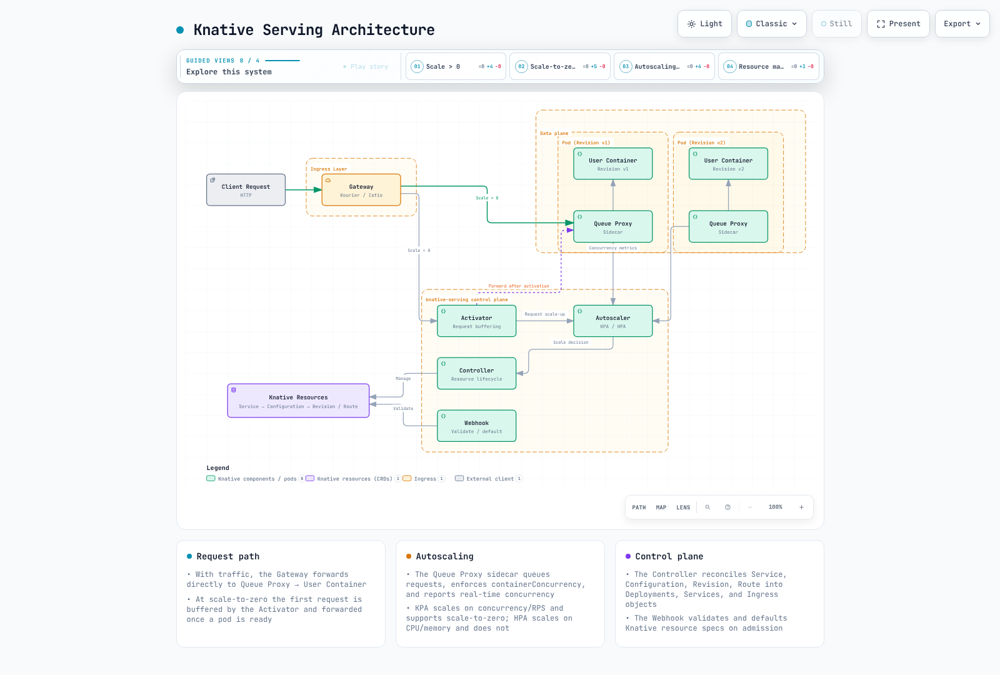
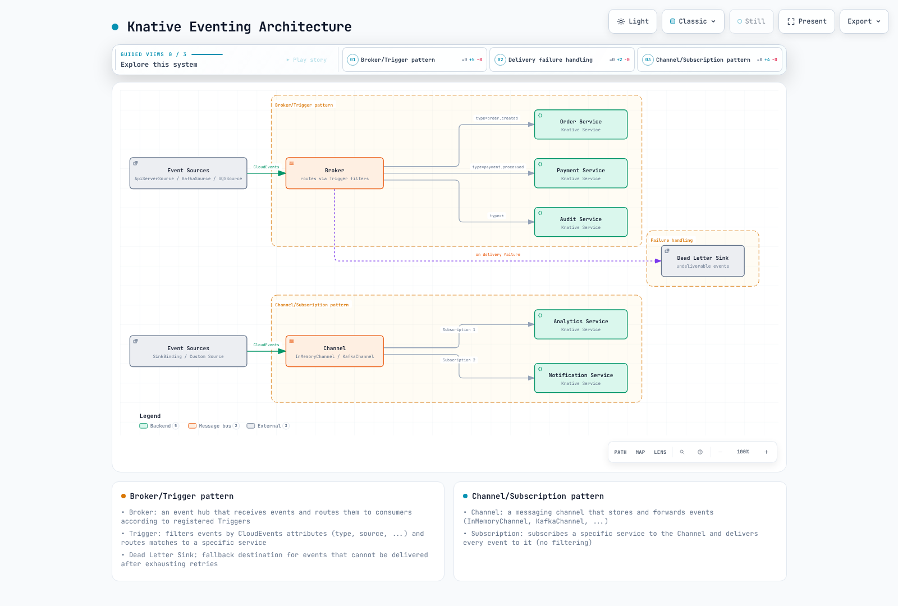
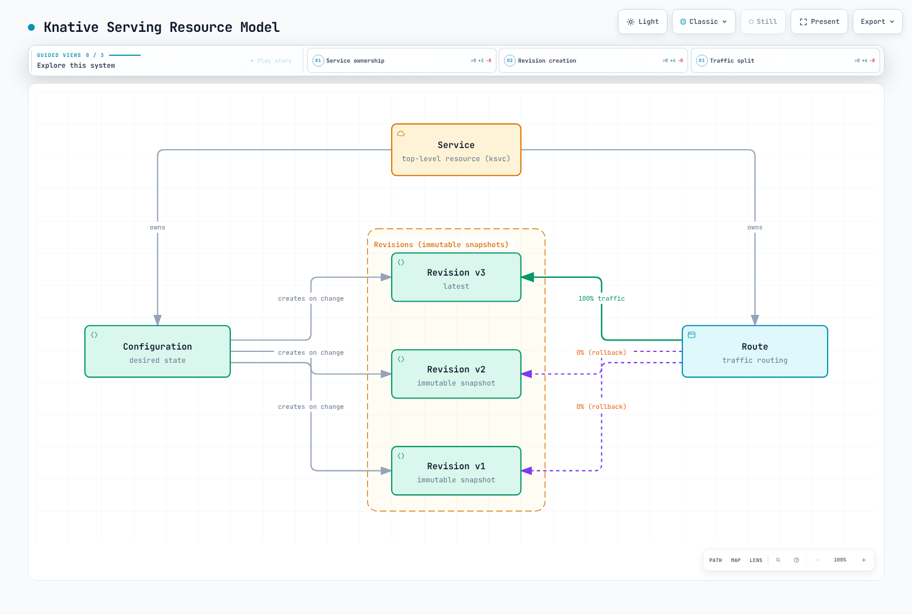
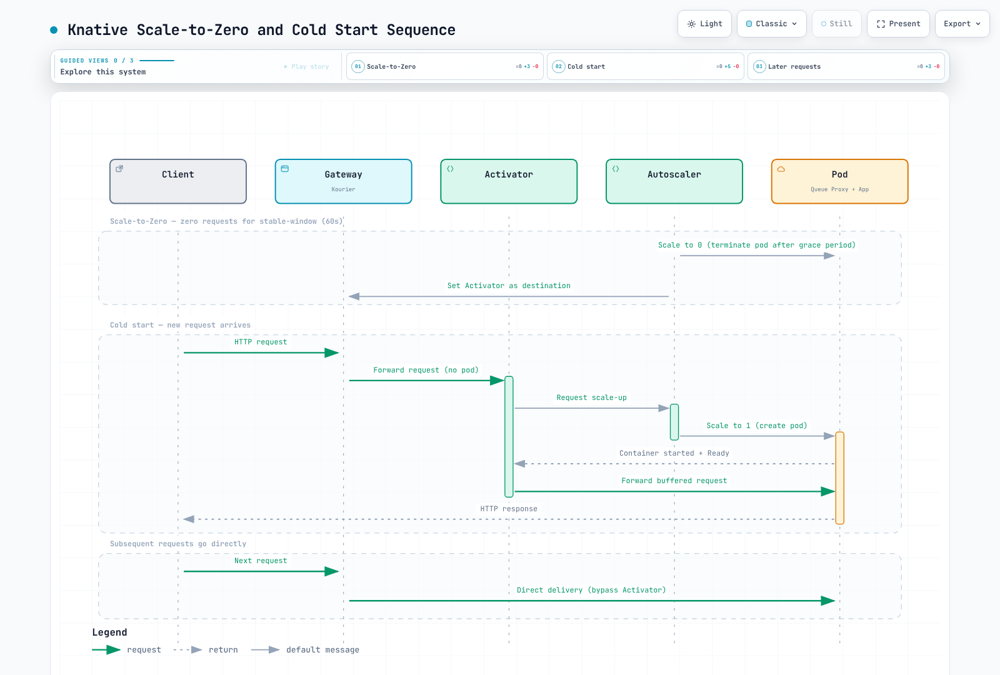
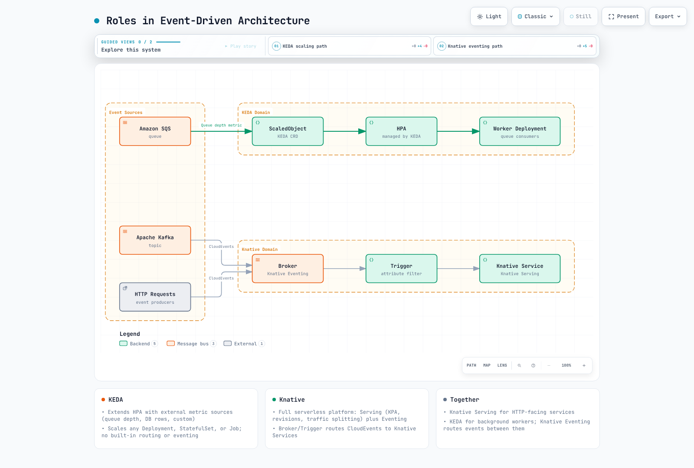

# Knative

> **Example Versions**: Serving/Eventing/Kourier 1.23.0; Operator 1.23.1. Verify Kubernetes/EKS compatibility before installation.
> **Last Updated**: September 11, 2026

## Table of Contents

- [Overview and Learning Objectives](#overview-and-learning-objectives)
- [Knative Architecture](#knative-architecture)
- [EKS Installation and Configuration](#eks-installation-and-configuration)
- [Knative Serving Deep Dive](#knative-serving-deep-dive)
- [Knative Eventing Deep Dive](#knative-eventing-deep-dive)
- [KEDA vs Knative Comparison](#keda-vs-knative-comparison)
- [Production Operations](#production-operations)
- [Best Practices](#best-practices)
- [References](#references)

---

## Overview and Learning Objectives

### What Is Knative?

Knative is a **CNCF Graduated** project that extends Kubernetes to provide a set of middleware components for building, deploying, and managing modern serverless workloads. Rather than replacing Kubernetes primitives, Knative builds on top of them, offering higher-level abstractions that simplify common patterns such as request-driven autoscaling, event delivery, and traffic management.

CNCF accepted Knative at the Incubating level on March 2, 2022, and graduated it on September 11, 2025. Project maturity does not establish production readiness of an individual deployment.

Knative consists of two independently installable components:

- **Knative Serving** -- Manages the lifecycle of serverless workloads. It automates deployment, scaling (including scale-to-zero), revision tracking, and traffic routing.
- **Knative Eventing** -- Provides infrastructure for producing, routing, and consuming events following the CloudEvents specification. It decouples event producers from consumers, enabling loosely coupled, event-driven architectures.

### Serverless on Kubernetes

Traditional Kubernetes Deployments require operators to pre-configure replica counts, HPA thresholds, and resource budgets. Knative shifts this burden:

1. Workloads automatically scale from zero to many replicas based on incoming request concurrency or RPS.
2. Revision specs snapshot the workload template; traffic can be shifted to retained ready Revisions. Referenced Secrets/ConfigMaps, registry access and external state are not frozen, and routing/rollback takes reconciliation time.
3. Sources/adapters and Triggers separate event ingestion from delivery. Some adapters poll external systems, and application processing, authentication and failure handling still need implementation.

The result is a platform that retains the full power of Kubernetes (scheduling, RBAC, networking, storage) while providing a developer experience closer to that of a fully managed serverless platform.

### Knative Serving vs Eventing

| Aspect | Knative Serving | Knative Eventing |
|--------|----------------|-----------------|
| Primary purpose | Request-driven workload lifecycle | Event routing and delivery |
| Scaling trigger | HTTP request concurrency / RPS | Consumer/adapter-specific; a Broker/Trigger does not generically scale every subscriber |
| Scale-to-zero | Yes (built-in) | Depends on consumer (Serving-backed consumers can) |
| Core resources | Service, Configuration, Revision, Route | Broker, Trigger, Channel, Subscription, Source |
| Typical use case | APIs, web apps, microservices | Async pipelines, webhooks, CDC streams |

### Knative vs AWS Lambda and AWS Fargate

| Feature | Knative Serving on EKS | AWS Lambda (standard compute) | AWS Fargate |
|---|---|---|---|
| Runtime | Containers meeting the Serving runtime contract | Supported Lambda runtimes or images implementing its runtime API | Supported ECS tasks/EKS Pods; platform restrictions apply |
| Request/execution lifetime | Configurable request timeout; defaults300s, allowed maximum600s unless reconfigured | Standard function timeout up to900s | Governed by task/Pod lifecycle, not a Lambda-style invocation limit |
| Scale-to-zero | KPA supports idle Revision scale-to-zero | On-demand execution | ECS desired tasks or Kubernetes replicas can be0; activation needs an appropriate controller/metric |
| Cold starts | Baseline replicas, image/startup/readiness tuning | Runtime-specific optimization and provisioned concurrency | Task/Pod startup and image/network setup; no fixed timing comparison |
| Memory | Node allocatable capacity, container requests and sidecars |128–10,240MB configurable | EKS Fargate slots up to120GB; platform overhead and supported CPU/memory combinations apply |
| GPU | Requires suitable nodes, device plugins, resource requests and enabled PodSpec features | No GPU in standard Lambda compute | GPUs are not available on Fargate |
| Networking | Kubernetes/CNI and gateway configuration | Customer VPC attachment is optional | VPC networking; EKS Fargate has platform constraints |
| Portability | Kubernetes/Knative APIs; cloud identity/storage integrations still matter | AWS-specific runtime/service APIs | ECS or EKS integration and supported platform APIs |
| Event input | HTTP/CloudEvents and configured adapters | Supported AWS event integrations | Application/controller integrations; not a generic event-routing service |
| Local testing | Local Kubernetes helps, but cloud behavior still needs validation | Local tools/emulators are optional and have fidelity limits | Container logic can be tested locally; platform behavior differs |
| Observability | Configure metrics, logs and tracing exporters | CloudWatch and supported tracing integrations | Configure supported AWS/OpenTelemetry collection |
| Cost basis | Allocated cluster, storage, load-balancer and supporting resources | Requests/duration plus selected features | Allocated task/Pod CPU and memory, plus associated resources |

This table scopes Lambda to standard compute. Eligible asynchronous/event-source invocations on Lambda Managed Instances can allow up to90minutes (with service-specific exceptions); they have different operating constraints. Pod scale-to-zero does not itself remove EC2 nodes, persistent storage or load-balancer charges.

### Learning Objectives

By the end of this document you will be able to:

1. Explain Knative's architecture and how Serving and Eventing complement each other.
2. Install and configure Knative on Amazon EKS with Kourier, DNS, and TLS.
3. Deploy serverless workloads with fine-grained concurrency-based autoscaling.
4. Implement traffic splitting strategies (canary, blue-green) using Revisions and Routes.
5. Build event-driven pipelines with Brokers, Triggers, and CloudEvents.
6. Compare KEDA and Knative and decide when to use each (or both).
7. Operate Knative in production with monitoring, high availability, and garbage collection policies.

---

## Knative Architecture

### Serving Architecture

Serving has control-plane components in `knative-serving` and a Queue Proxy in each Revision Pod’s workload namespace. Their responsibilities include reconciliation, routing, admission and scaling; they are not five Deployments all in the same namespace.



[🔍 View interactive diagram](https://www.atomai.click/kubernetes-docs/archmaps/en-autoscaling-03-knative-0.html)

**Component responsibilities:**

| Component | Role |
|-----------|------|
| **Activator** | Receives requests when a Revision is scaled to zero. Buffers requests, triggers scale-up, then proxies the buffered requests once pods are ready. Also acts as a load balancer when the system is in "burst capacity" mode. |
| **Autoscaler** | Collects concurrency and RPS metrics from Queue Proxy sidecars. KPA and its reconciler drive the target scale; the optional HPA integration manages Kubernetes HPA resources. The Serving Controller reconciles workload resources, not a universal intermediate for every scale decision. |
| **Queue Proxy** | Injected as a sidecar into every Knative pod. Enforces `containerConcurrency` limits, reports real-time concurrency to the Autoscaler, performs health checking, and handles graceful shutdown during scale-down. |
| **Controller** | Reconciles Knative CRDs (Service, Configuration, Revision, Route) into underlying Kubernetes resources (Deployments, Services, Ingress objects). Manages revision creation and garbage collection. |
| **Webhook** | Validates and defaults Knative resource specifications on admission. Ensures that invalid configurations are rejected before they reach the Controller. |

### Eventing Architecture

Knative Eventing provides a declarative way to bind event sources to consumers. It supports two delivery patterns: **Broker/Trigger** (content-based routing) and **Channel/Subscription** (direct pub-sub).



[🔍 View interactive diagram](https://www.atomai.click/kubernetes-docs/archmaps/en-autoscaling-03-knative-1.html)

**Eventing core concepts:**

| Concept | Description |
|---------|-------------|
| **Event Source** | A resource that generates or imports events. Knative provides built-in sources (ApiServerSource, PingSource) and the community maintains sources for Kafka, AWS SQS, GitHub, and more. |
| **Broker** | Receives events and delivers to matching Triggers through its selected implementation. Buffering, persistence and failure behavior depend on the class/backing transport. |
| **Trigger** | A filter attached to a Broker. Each Trigger selects events by CloudEvent attributes (type, source, extensions) and routes matches to a subscriber. |
| **Channel** | A durable or in-memory event transport. Unlike Brokers, Channels do not filter -- every Subscription receives every event. |
| **Subscription** | Connects a Channel to a subscriber and optionally a reply destination. |
| **Dead Letter Sink** | A fallback destination for events that cannot be delivered after exhausting retry policies. |
| **CloudEvents** | The CNCF standard envelope format (v1.0) used by all Knative Eventing components. Provides interoperability across sources and consumers. |

---

## EKS Installation and Configuration

The installation snippets target an isolated test environment and contain placeholders. Applying Serving with a LoadBalancer may provision AWS resources through your installed controller; no such action was executed in this audit. Operator-owned ConfigMaps, Services and workloads are configured through the KnativeServing/KnativeEventing resources. Preserve existing configuration when preparing merge patches, especially list fields. Create referenced application namespaces, ServiceAccounts, Secrets, images, Kafka/SQS resources and IAM roles before using later examples. Schema checks do not establish production readiness.

### Prerequisites

- An existing, provider-supported EKS version validated with the selected Knative components. The examples use Serving/Eventing/Kourier1.23.0 and Operator1.23.1; this is not an open-ended Kubernetes1.28+ compatibility claim.
- `kubectl` configured with cluster admin access.
- (Optional) `helm` v3.12+ for Helm-based installations.

### Step 1: Install Knative Operator

The Knative Operator manages the installation and lifecycle of Knative Serving and Eventing components. Using the Operator simplifies version upgrades and configuration management.

```bash
# Fresh installation on the intended test cluster; review versioned upgrade guidance for existing installs.
kubectl config current-context
kubectl apply --server-side -f https://github.com/knative/operator/releases/download/knative-v1.23.1/operator.yaml
kubectl wait --for=condition=Established crd/knativeservings.operator.knative.dev crd/knativeeventings.operator.knative.dev --timeout=120s
kubectl wait --for=condition=Available deployment/knative-operator deployment/operator-webhook -n knative-operator --timeout=300s
```

### Step 2: Install Knative Serving via the Operator

Create a `KnativeServing` custom resource to deploy Serving components:

```yaml
apiVersion: operator.knative.dev/v1beta1
kind: KnativeServing
metadata:
  name: knative-serving
  namespace: knative-serving
spec:
  version: 1.23.0
  ingress:
    kourier:
      enabled: true
  config:
    network:
      ingress-class: kourier.ingress.networking.knative.dev
    autoscaler:
      pod-autoscaler-class: kpa.autoscaling.knative.dev
      container-concurrency-target-percentage: '70'
      enable-scale-to-zero: 'true'
    defaults:
      revision-timeout-seconds: '300'
      max-revision-timeout-seconds: '600'
    deployment:
      queue-sidecar-cpu-request: 25m
      queue-sidecar-memory-request: 400Mi
      queue-sidecar-memory-limit: 800Mi
  services:
  - name: kourier
    annotations:
      service.beta.kubernetes.io/aws-load-balancer-type: external
      service.beta.kubernetes.io/aws-load-balancer-nlb-target-type: ip
      service.beta.kubernetes.io/aws-load-balancer-scheme: internet-facing
```

```bash
kubectl create namespace knative-serving --dry-run=client -o yaml | kubectl apply -f -
kubectl create namespace knative-demo --dry-run=client -o yaml | kubectl apply -f -
kubectl apply -f knative-serving.yaml
kubectl wait --for=condition=Ready knativeserving/knative-serving -n knative-serving --timeout=600s
kubectl get deployments,pods,services -n knative-serving
```

### Step 3: Install Kourier (Lightweight Ingress)

Kourier is an Envoy-based networking implementation for Knative. It is a suitable option when its supported features meet the workload; resource or latency advantages require measurement.

The Operator installs Kourier from the selected Serving bundle. In this workflow the gateway Service is in `knative-serving`. A standalone manual Kourier manifest normally uses `kourier-system`; do not apply it on top of the Operator-managed installation. Inspect the managed resources:

```bash
# Operator-managed Kourier uses the KnativeServing namespace.
kubectl get deployment net-kourier-controller 3scale-kourier-gateway -n knative-serving
kubectl get service kourier -n knative-serving -o yaml
```

The base KnativeServing resource above configures Kourier Service annotations for an **NLB managed by the AWS Load Balancer Controller**. The controller, IAM and selected subnets must already be prepared. A Service annotation does not create an ALB; an ALB requires an appropriate L7 controller/routing design. EKS Auto Mode uses a different load-balancer management path. Verify the actual class/annotations rather than assuming every EKS LoadBalancer Service defaults to NLB:

```bash
kubectl get service kourier -n knative-serving -o jsonpath='{.spec.loadBalancerClass}{"\n"}{.metadata.annotations}{"\n"}'
```

### Step 4: DNS Configuration

Knative generates URLs for each Service in the form `<service>.<namespace>.<domain>`. You must configure DNS so that these URLs resolve to the Ingress gateway.

#### Option A: Magic DNS (sslip.io) -- Development Only

sslip.io resolves supported IP-encoded names and is useful in suitable development environments. An AWS load-balancer hostname and changing backend IPs are not a durable production DNS mapping. This Operator workflow uses an explicit domain; the standalone default-domain helper must not compete with Operator-owned configuration.

```bash
# Inspect the address type; this Operator workflow uses an explicitly configured domain.
kubectl get service kourier -n knative-serving -o jsonpath='{.status.loadBalancer.ingress}'
kubectl get ksvc -n knative-demo
```

#### Option B: Real DNS with Amazon Route 53 -- Production

Prepare a domain/hosted zone you control and inspect the generated change before applying it. The commands below update that zone when run; the audit did not execute them. Use one DNS owner (manual/IaC or ExternalDNS) per record. ExternalDNS requires its `knative-serving` source, permissions and a hostname matching the actual Route/DomainMapping; a hostname annotation alone does not create a new Knative route.

```bash
# Review the intended zone/domain and wait for the NLB hostname before preparing a DNS change.
set -euo pipefail
export KOURIER_HOST
KOURIER_HOST=$(kubectl get service kourier -n knative-serving -o jsonpath='{.status.loadBalancer.ingress[0].hostname}')
: "${KOURIER_HOST:?Wait for the load-balancer hostname}"
export KNATIVE_DOMAIN="knative.example.com"
export HOSTED_ZONE_ID="REPLACE_WITH_HOSTED_ZONE_ID"
python3 - <<'PYDNS'
import json, os
from pathlib import Path
host = os.environ["KOURIER_HOST"].strip()
if not host or any(c.isspace() for c in host):
    raise SystemExit("Invalid load-balancer hostname")
change = {"Changes": [{"Action": "UPSERT", "ResourceRecordSet": {
    "Name": "*." + os.environ["KNATIVE_DOMAIN"], "Type": "CNAME", "TTL": 300,
    "ResourceRecords": [{"Value": host}]
}}]}
Path("knative-dns-change.json").write_text(json.dumps(change, indent=2))
patch = {"spec": {"config": {"domain": {os.environ["KNATIVE_DOMAIN"]: ""}}}}
Path("knative-domain.patch.json").write_text(json.dumps(patch))
PYDNS
# These commands change the selected DNS zone and Operator configuration when run.
aws route53 change-resource-record-sets --hosted-zone-id "$HOSTED_ZONE_ID" --change-batch file://knative-dns-change.json
kubectl patch knativeserving knative-serving -n knative-serving --type merge --patch-file knative-domain.patch.json
```

### Step 5: TLS with cert-manager

Serving1.23 includes the cert-manager integration in its controller. The old separate net-certmanager repository is archived; do not install a nonexistent1.16/1.23 release from it. Install and configure a compatible cert-manager separately before enabling the integration, including its own Route53 DNS01 identity and least-privilege zone access.

```bash
kubectl get deployments -n cert-manager
kubectl get crd certificates.cert-manager.io clusterissuers.cert-manager.io
```

Save this merge patch for the existing KnativeServing resource as `serving-tls.patch.yaml`. It is not a standalone ConfigMap to apply over Operator-owned state:

```yaml
spec:
  config:
    network:
      certificate-class: cert-manager.certificate.networking.knative.dev
      external-domain-tls: Enabled
      http-protocol: Redirected
    certmanager:
      issuerRef: |
        group: cert-manager.io
        kind: ClusterIssuer
        name: letsencrypt-staging
```

For the first DNS/IAM validation use a staging ClusterIssuer. Replace the contact, hosted zone and Region with reviewed values. Staging certificates are not publicly trusted; switch to a production issuer only after validating the challenge flow and certificate lifecycle:

```yaml
apiVersion: cert-manager.io/v1
kind: ClusterIssuer
metadata:
  name: letsencrypt-staging
spec:
  acme:
    server: https://acme-staging-v02.api.letsencrypt.org/directory
    email: REPLACE_WITH_CERTIFICATE_CONTACT_EMAIL
    privateKeySecretRef:
      name: letsencrypt-staging-key
    solvers:
    - dns01:
        route53:
          region: us-west-2
          hostedZoneID: REPLACE_WITH_HOSTED_ZONE_ID
```

Save the issuer as `cluster-issuer.yaml` and the preceding Operator patch as `serving-tls.patch.yaml`, then apply in this order:

```bash
# cert-manager and its Route 53 identity must already be configured.
kubectl apply -f cluster-issuer.yaml
kubectl wait --for=condition=Ready clusterissuer/letsencrypt-staging --timeout=180s
kubectl patch knativeserving knative-serving -n knative-serving --type merge --patch-file serving-tls.patch.yaml
# The integration starts in the Serving controller after the setting is effective.
kubectl get configmap config-network -n knative-serving -o yaml
kubectl rollout restart deployment/controller -n knative-serving
kubectl rollout status deployment/controller -n knative-serving --timeout=300s
```

### Step 6: HPA vs KPA Autoscaler Selection

Knative supports two autoscaler implementations. The choice affects scaling behavior significantly.

| Feature | KPA (Knative Pod Autoscaler) | HPA (Kubernetes HPA) |
|---------|------------------------------|----------------------|
| Scale-to-zero | Yes | No |
| Metrics | Concurrency, RPS | CPU, Memory, Custom metrics |
| Scaling speed | Fast (panic/stable windows) | Standard HPA intervals |
| Configuration | Knative annotations | Standard HPA spec |
| Best for | HTTP workloads, latency-sensitive | CPU/memory-bound workloads |

Configure the default autoscaler class through the Operator. The optional HPA extension and a working Kubernetes resource metrics API are prerequisites for HPA-class Revisions; this patch includes a pinned HPA manifest. Avoid duplicate management if your distribution already supplies it:

```yaml
spec:
  additionalManifests:
  - URL: https://github.com/knative/serving/releases/download/knative-v1.23.0/serving-hpa.yaml
  config:
    autoscaler:
      pod-autoscaler-class: kpa.autoscaling.knative.dev
      stable-window: 60s
      panic-window-percentage: '10'
      panic-threshold-percentage: '200'
      scale-to-zero-grace-period: 30s
      scale-to-zero-pod-retention-period: 0s
      target-burst-capacity: '211'
      requests-per-second-target-default: '200'
      container-concurrency-target-default: '100'
```

Save as `serving-autoscaler.patch.yaml` and merge it into the existing Operator resource. Preserve any other `additionalManifests` entries when preparing the patch:

```bash
kubectl patch knativeserving knative-serving -n knative-serving --type merge --patch-file serving-autoscaler.patch.yaml
kubectl get deployment autoscaler-hpa -n knative-serving
```

Override per Revision under `spec.template.metadata.annotations` on the Knative Service (the following is a template fragment):

```yaml
metadata:
  annotations:
    autoscaling.knative.dev/class: "hpa.autoscaling.knative.dev"
    autoscaling.knative.dev/metric: "cpu"
    autoscaling.knative.dev/target: "70"
```

### Step 7: Install Knative Eventing

```yaml
apiVersion: operator.knative.dev/v1beta1
kind: KnativeEventing
metadata:
  name: knative-eventing
  namespace: knative-eventing
spec:
  version: 1.23.0
  defaultBrokerClass: MTChannelBasedBroker
  config:
    default-ch-webhook:
      default-ch-config: "clusterDefault:\n  apiVersion: messaging.knative.dev/v1\n\
        \  kind: InMemoryChannel\n"
  sinkBindingSelectionMode: inclusion
```

```bash
kubectl create namespace knative-eventing --dry-run=client -o yaml | kubectl apply -f -
kubectl apply -f knative-eventing.yaml
kubectl wait --for=condition=Ready knativeeventing/knative-eventing -n knative-eventing --timeout=600s
kubectl get deployments,pods -n knative-eventing
kubectl get crd inmemorychannels.messaging.knative.dev integrationsources.sources.knative.dev
```

---

## Knative Serving Deep Dive

### Resource Model

Knative Serving introduces four primary custom resources that work together to manage the complete lifecycle of a serverless workload.



[🔍 View interactive diagram](https://www.atomai.click/kubernetes-docs/archmaps/en-autoscaling-03-knative-2.html)

| Resource | Description |
|----------|-------------|
| **Service** (`ksvc`) | The top-level resource. Manages the entire lifecycle by owning a Configuration and a Route. Most users interact only with Services. |
| **Configuration** | Describes the workload template; relevant template changes create a Revision. Metadata-only or traffic changes do not necessarily create one. |
| **Revision** | Immutable workload spec, with external references that can still change. Retention/garbage collection determines whether an old Revision remains available. |
| **Route** | Maps network traffic to one or more Revisions. Enables canary deployments, blue-green releases, and percentage-based traffic splitting. |

### Complete Knative Service YAML

Provide the referenced image, ServiceAccount and Secret first. The Serving controller must resolve registry tags/digests, while the node must separately be able to pull the image; EKS node credentials alone do not establish controller registry access. Readiness/liveness paths must match the real application and should not cause restart storms for downstream outages.

The following is a configuration example, not a tested production deployment. It defines a Knative Service with explicit autoscaling, resource limits, health checks, and scaling boundaries:

```yaml
apiVersion: serving.knative.dev/v1
kind: Service
metadata:
  name: order-api
  namespace: knative-demo
  labels:
    app.kubernetes.io/name: order-api
    app.kubernetes.io/part-of: ecommerce
    app.kubernetes.io/managed-by: knative
spec:
  template:
    metadata:
      annotations:
        autoscaling.knative.dev/class: kpa.autoscaling.knative.dev
        autoscaling.knative.dev/metric: concurrency
        autoscaling.knative.dev/target: '100'
        autoscaling.knative.dev/target-utilization-percentage: '70'
        autoscaling.knative.dev/min-scale: '2'
        autoscaling.knative.dev/max-scale: '50'
        autoscaling.knative.dev/initial-scale: '3'
        autoscaling.knative.dev/scale-down-delay: 15m
        autoscaling.knative.dev/window: 60s
      name: order-api-v1
    spec:
      containerConcurrency: 0
      timeoutSeconds: 300
      containers:
      - image: 123456789012.dkr.ecr.us-west-2.amazonaws.com/order-api:v1.2.3
        ports:
        - containerPort: 8080
          protocol: TCP
        env:
        - name: DB_HOST
          valueFrom:
            secretKeyRef:
              name: db-credentials
              key: host
        - name: LOG_LEVEL
          value: info
        resources:
          requests:
            cpu: 250m
            memory: 512Mi
          limits:
            cpu: 1000m
            memory: 1Gi
        readinessProbe:
          httpGet:
            path: /healthz
            port: 8080
          initialDelaySeconds: 5
          periodSeconds: 10
        livenessProbe:
          httpGet:
            path: /healthz
            port: 8080
          initialDelaySeconds: 15
          periodSeconds: 20
      serviceAccountName: order-api-sa
```

### Traffic Splitting: Canary Deployments

Traffic splitting allows you to gradually shift traffic between Revisions. This is the foundation for canary and blue-green deployment strategies.

#### Canary Deployment

These are alternative exercises starting from the complete base Service above and its ready `order-api-v1` Revision. Replace images and names with verified artifacts; every template change needs a new unused Revision name. The JSON patch preserves environment, ServiceAccount, probes and resource settings instead of replacing the whole containers list. It assumes the base example’s single ingress container is index0. A0% tag makes a route available for testing, not a guarantee of full warm capacity.

Save as `canary-template.patch.json`:

```json
[
  {
    "op": "add",
    "path": "/spec/traffic",
    "value": [
      {
        "revisionName": "order-api-v1",
        "percent": 100
      },
      {
        "revisionName": "order-api-v2",
        "percent": 0,
        "tag": "canary"
      }
    ]
  },
  {
    "op": "add",
    "path": "/spec/template/metadata/name",
    "value": "order-api-v2"
  },
  {
    "op": "replace",
    "path": "/spec/template/spec/containers/0/image",
    "value": "123456789012.dkr.ecr.us-west-2.amazonaws.com/order-api:v1.3.0"
  }
]
```

```bash
kubectl wait --for=condition=Ready revision/order-api-v1 -n knative-demo --timeout=300s
kubectl patch ksvc order-api -n knative-demo --type json --patch-file canary-template.patch.json
kubectl wait --for=jsonpath='{.status.latestCreatedRevisionName}'=order-api-v2 ksvc/order-api -n knative-demo --timeout=180s
kubectl wait --for=condition=Ready revision/order-api-v2 -n knative-demo --timeout=300s
kubectl get ksvc order-api -n knative-demo -o jsonpath='{.status.traffic}'

# Route10%, then50%, then100% only after validating each stage.
kubectl patch ksvc order-api -n knative-demo --type merge --patch '{"spec":{"traffic":[{"revisionName":"order-api-v1","percent":90},{"revisionName":"order-api-v2","percent":10,"tag":"canary"}]}}'
kubectl patch ksvc order-api -n knative-demo --type merge --patch '{"spec":{"traffic":[{"revisionName":"order-api-v1","percent":50},{"revisionName":"order-api-v2","percent":50,"tag":"canary"}]}}'
kubectl patch ksvc order-api -n knative-demo --type merge --patch '{"spec":{"traffic":[{"revisionName":"order-api-v1","percent":0},{"revisionName":"order-api-v2","percent":100,"tag":"canary"}]}}'
```

Read the actual tag URL from `status.traffic`; it depends on the domain/tag templates and TLS settings. Check Route readiness, observed configuration and application signals between changes. Percentages apply to routing policy, not an exact count in a small request sample.

#### Blue-Green Deployment

Use this as a separate exercise from the base `order-api-v1`, or update the stable name to the Revision currently serving your verified baseline. Save the following as `green-template.patch.json`:

```json
[
  {
    "op": "add",
    "path": "/spec/traffic",
    "value": [
      {
        "revisionName": "order-api-v1",
        "percent": 100
      },
      {
        "revisionName": "order-api-green",
        "percent": 0,
        "tag": "green"
      }
    ]
  },
  {
    "op": "add",
    "path": "/spec/template/metadata/name",
    "value": "order-api-green"
  },
  {
    "op": "replace",
    "path": "/spec/template/spec/containers/0/image",
    "value": "123456789012.dkr.ecr.us-west-2.amazonaws.com/order-api:v2.0.0"
  }
]
```

```bash
kubectl patch ksvc order-api -n knative-demo --type json --patch-file green-template.patch.json
kubectl wait --for=jsonpath='{.status.latestCreatedRevisionName}'=order-api-green ksvc/order-api -n knative-demo --timeout=180s
kubectl wait --for=condition=Ready revision/order-api-green -n knative-demo --timeout=300s
kubectl get ksvc order-api -n knative-demo -o jsonpath='{.status.traffic}'
# Validate the green tag URL and capacity before requesting this switch.
kubectl patch ksvc order-api -n knative-demo --type merge --patch '{"spec":{"traffic":[{"revisionName":"order-api-v1","percent":0},{"revisionName":"order-api-green","percent":100,"tag":"green"}]}}'
```

The traffic change is reconciled asynchronously; connections and in-flight requests can still use the previous Revision. Retain the old Revision and its external dependencies for rollback, and measure actual propagation/readiness. These commands were not executed against a cluster.

### Scale-to-Zero Behavior

Scale-to-zero is a defining feature of Knative Serving. When a Revision is eligible for scale-to-zero, its idle-window, scale-down delay, retention and internal routing readiness affect when the last Pod is removed. When a new request arrives, the Activator buffers it, triggers a scale-up, and proxies the request once a pod is ready.



[🔍 View interactive diagram](https://www.atomai.click/kubernetes-docs/archmaps/en-autoscaling-03-knative-3.html)

Key parameters controlling scale-to-zero:

| Annotation / Config | Default | Description |
|---------------------|---------|-------------|
| `scale-to-zero-grace-period` (global) |30s| Upper bound for internal scale-from-zero routing preparation before removing the last replica; not a guaranteed idle-retention timer. |
| `scale-to-zero-pod-retention-period` (global) |0s| Minimum retention of the last Pod after the autoscaler decides to scale to zero. |
| `autoscaling.knative.dev/scale-to-zero-pod-retention-period` (per-Revision) | inherited | Per-Revision override of the global retention period. |
| `enable-scale-to-zero` (global) | true | Master toggle. Set to false to disable scale-to-zero cluster-wide. |

### Concurrency-Based Scaling

Knative's KPA scales based on observed concurrency (in-flight requests) or requests per second (RPS). The algorithm maintains two windows:

- **Stable window** (default 60s): Average concurrency over this period drives the steady-state scale decision.
- **Panic window** (default 6s, i.e., 10% of stable): If average concurrency in this window exceeds the panic threshold (default 200% of target), the system scales up aggressively.

**Key annotations:**

| Annotation | Example | Description |
|------------|---------|-------------|
| `autoscaling.knative.dev/metric` | `"concurrency"` or `"rps"` | Which metric to scale on. |
| `autoscaling.knative.dev/target` | `"100"` | Target value for the metric (e.g., 100 concurrent requests per pod). |
| `autoscaling.knative.dev/target-utilization-percentage` | `"70"` | The Autoscaler aims to keep average utilization at this percentage of the target. Effective target = target * utilization / 100. |
| `spec.template.spec.containerConcurrency` |`0`| Per-Pod forwarded-request concurrency limit;0 disables this hard cap. Bounded waiting/rejection and autoscaling still apply.1 does not make application threads or all replicas globally serial. |

**Scaling formula:**

```
desiredReplicas = ceil( observedConcurrency / (target * targetUtilization / 100) )
```

For example, with `target=100`, `targetUtilization=70%`, and 350 observed concurrent requests:

```
desiredReplicas = ceil(350 / (100 * 0.70)) = ceil(350 / 70) = ceil(5.0) = 5
```

### Cold Start Optimization

Cold starts -- the latency penalty when scaling from zero -- are a common concern. Knative provides several mechanisms to mitigate them:

| Strategy | Configuration | Trade-off |
|----------|---------------|-----------|
| **minScale** | `autoscaling.knative.dev/min-scale: "2"` | Keeps baseline capacity during normal idle operation; new Revisions, restarts and scale-out can still initialize cold. |
| **initialScale** | `autoscaling.knative.dev/initial-scale: "3"` | Number of pods created when a new Revision is first deployed. Does not prevent scale-to-zero later. |
| **scale-down-delay** | `autoscaling.knative.dev/scale-down-delay: "15m"` | Delays scale-down decisions. Useful for bursty workloads to avoid frequent cold starts. |
| **Container image caching** | Use EKS node-level image caching or pre-pull DaemonSets | Reduces container pull time during cold start. |
| **Lightweight base images** | Use distroless or Alpine-based images | Reduces image size and pull time. |
| **Application warmup** | Implement readiness probes for the actual readiness contract | Avoids advertising readiness prematurely; full-load performance must still be measured. |

```yaml
apiVersion: serving.knative.dev/v1
kind: Service
metadata:
  name: latency-critical-api
  namespace: knative-demo
spec:
  template:
    metadata:
      annotations:
        autoscaling.knative.dev/min-scale: '3'
        autoscaling.knative.dev/initial-scale: '5'
        autoscaling.knative.dev/scale-down-delay: 10m
        autoscaling.knative.dev/target: '50'
        autoscaling.knative.dev/window: 30s
    spec:
      containerConcurrency: 100
      containers:
      - image: 123456789012.dkr.ecr.us-west-2.amazonaws.com/api:v1.0.0
        ports:
        - containerPort: 8080
        readinessProbe:
          httpGet:
            path: /ready
            port: 8080
          initialDelaySeconds: 3
          periodSeconds: 5
```

### Private and Public Services

By default, Knative Services are exposed externally through the ingress gateway. You can make a Service cluster-internal only:

```yaml
apiVersion: serving.knative.dev/v1
kind: Service
metadata:
  name: internal-processor
  namespace: knative-demo
  labels:
    networking.knative.dev/visibility: cluster-local
spec:
  template:
    spec:
      containers:
      - image: 123456789012.dkr.ecr.us-west-2.amazonaws.com/processor:v1.0.0
```

The cluster-local label changes Knative routing visibility and generated internal URLs. It is not an authentication policy or a complete network-isolation boundary; private network paths, NetworkPolicy and application authorization still matter.

There is no `config-network.visibility` setting in the selected release. Apply the visibility label on each Service or enforce it with an appropriate admission policy. `default-external-scheme` only affects generated external URL schemes; it does not make a Service private or configure TLS by itself. The following is a Service metadata fragment:

```yaml
metadata:
  labels:
    networking.knative.dev/visibility: cluster-local
```

---

## Knative Eventing Deep Dive

### Event Sources

Event Sources are Knative resources that connect external systems to the eventing mesh. Each Source emits CloudEvents to a configured sink (a Broker, Channel, or directly to a Knative Service).

#### ApiServerSource

Watches the Kubernetes API server for resource events and forwards them as CloudEvents:

```yaml
apiVersion: v1
kind: ServiceAccount
metadata:
  name: k8s-events-sa
  namespace: knative-demo
---
apiVersion: rbac.authorization.k8s.io/v1
kind: Role
metadata:
  name: k8s-events-reader
  namespace: knative-demo
rules:
- apiGroups:
  - ''
  resources:
  - pods
  verbs:
  - get
  - list
  - watch
- apiGroups:
  - apps
  resources:
  - deployments
  verbs:
  - get
  - list
  - watch
---
apiVersion: rbac.authorization.k8s.io/v1
kind: RoleBinding
metadata:
  name: k8s-events-reader
  namespace: knative-demo
subjects:
- kind: ServiceAccount
  name: k8s-events-sa
  namespace: knative-demo
roleRef:
  apiGroup: rbac.authorization.k8s.io
  kind: Role
  name: k8s-events-reader
---
apiVersion: rbac.authorization.k8s.io/v1
kind: ClusterRole
metadata:
  name: knative-demo-namespace-discovery
rules:
- apiGroups:
  - ''
  resources:
  - namespaces
  verbs:
  - get
  - list
  - watch
---
apiVersion: rbac.authorization.k8s.io/v1
kind: ClusterRoleBinding
metadata:
  name: knative-demo-namespace-discovery
subjects:
- kind: ServiceAccount
  name: k8s-events-sa
  namespace: knative-demo
roleRef:
  apiGroup: rbac.authorization.k8s.io
  kind: ClusterRole
  name: knative-demo-namespace-discovery
---
apiVersion: sources.knative.dev/v1
kind: ApiServerSource
metadata:
  name: k8s-events
  namespace: knative-demo
spec:
  serviceAccountName: k8s-events-sa
  mode: Reference
  resources:
  - apiVersion: v1
    kind: Pod
  - apiVersion: apps/v1
    kind: Deployment
  sink:
    ref:
      apiVersion: eventing.knative.dev/v1
      kind: Broker
      name: default
  namespaceSelector:
    matchLabels:
      kubernetes.io/metadata.name: knative-demo
```

#### SinkBinding

The selected Eventing configuration uses inclusion mode. Opt only the demo namespace into binding injection, and ensure the subject Deployment exists in that namespace with matching metadata labels/name. Changes to an already-running workload may require its normal rollout before new injected environment is used:

```bash
kubectl label namespace knative-demo bindings.knative.dev/include=true --overwrite
```

Injects environment variables (specifically `K_SINK`) into any Kubernetes workload so it can send events to a sink without hardcoding the destination:

```yaml
apiVersion: sources.knative.dev/v1
kind: SinkBinding
metadata:
  name: order-producer-binding
  namespace: knative-demo
spec:
  subject:
    apiVersion: apps/v1
    kind: Deployment
    name: order-producer
  sink:
    ref:
      apiVersion: eventing.knative.dev/v1
      kind: Broker
      name: default
  ceOverrides:
    extensions:
      producer: order-system
```

The application must read `K_SINK` and apply `K_CE_OVERRIDES`; SinkBinding does not rewrite arbitrary outgoing Python requests. The producer below uses structured HTTP encoding (the complete CloudEvent body with the matching content type), a bounded timeout and status checks. Keep one `event_id` across retries of the same logical event:

```python
import json
import os
import re

import requests
from cloudevents.http import CloudEvent
from cloudevents.conversion import to_structured

CORE_ATTRIBUTES = {"specversion", "id", "source", "type", "time", "subject", "datacontenttype", "dataschema"}


def emit_order_event(order_id, event_type, data, event_id):
    """Use one stable event_id for retries of the same logical event."""
    attributes = {
        "specversion": "1.0", "id": event_id,
        "type": f"com.example.order.{event_type}",
        "source": "/orders/api", "subject": f"order/{order_id}",
        "datacontenttype": "application/json",
    }
    overrides = json.loads(os.environ.get("K_CE_OVERRIDES", "{}"))
    for key, value in overrides.get("extensions", {}).items():
        if key in CORE_ATTRIBUTES or not re.fullmatch(r"[a-z0-9]+", key):
            raise ValueError("Only valid extension attributes may be overridden")
        attributes[key] = value
    event = CloudEvent(attributes, data)
    headers, body = to_structured(event)
    response = requests.post(
        os.environ["K_SINK"], data=body, headers=headers, timeout=(3, 10)
    )
    response.raise_for_status()
    return response.status_code
```

#### KafkaSource

KafkaSource/KafkaChannel require the matching Kafka extension and an existing configured Kafka cluster (including bootstrap/TLS/SASL and sufficient brokers for the requested replication factor). Merge these1.23.1 addon URLs with any existing additionalManifests in the KnativeEventing resource; do not simultaneously enable another management path for the same addon. Save as eventing-kafka.patch.yaml:

```yaml
spec:
  additionalManifests:
  - URL: https://github.com/knative-extensions/eventing-kafka-broker/releases/download/knative-v1.23.1/eventing-kafka-controller.yaml
  - URL: https://github.com/knative-extensions/eventing-kafka-broker/releases/download/knative-v1.23.1/eventing-kafka-source.yaml
  - URL: https://github.com/knative-extensions/eventing-kafka-broker/releases/download/knative-v1.23.1/eventing-kafka-channel.yaml
```

```bash
kubectl patch knativeeventing knative-eventing -n knative-eventing --type merge --patch-file eventing-kafka.patch.yaml
GENERATION=$(kubectl get knativeeventing knative-eventing -n knative-eventing -o jsonpath='{.metadata.generation}')
kubectl wait --for=jsonpath='{.status.observedGeneration}'="$GENERATION" knativeeventing/knative-eventing -n knative-eventing --timeout=600s
kubectl wait --for=condition=Ready knativeeventing/knative-eventing -n knative-eventing --timeout=600s
kubectl get crd kafkasources.sources.knative.dev kafkachannels.messaging.knative.dev
```

Consumes messages from Apache Kafka topics and delivers them as CloudEvents:

```yaml
apiVersion: sources.knative.dev/v1
kind: KafkaSource
metadata:
  name: payment-events
  namespace: knative-demo
spec:
  consumerGroup: knative-payment-consumer
  bootstrapServers:
  - kafka-bootstrap.kafka.svc.cluster.local:9092
  topics:
  - payment-events
  sink:
    ref:
      apiVersion: eventing.knative.dev/v1
      kind: Broker
      name: default
  net:
    sasl:
      enable: true
      type:
        secretKeyRef:
          name: kafka-credentials
          key: sasl-type
      user:
        secretKeyRef:
          name: kafka-credentials
          key: username
      password:
        secretKeyRef:
          name: kafka-credentials
          key: password
    tls:
      enable: true
```

#### SQSSource (AWS)

The1.23 core IntegrationSource supports SQS and replaces the archived TriggerMesh example here. It is an alpha API; verify the installed CRD and adapter images. The dedicated queue and its IAM role must already exist. This source consumes/deletes messages when run; no source was deployed during the audit:

```bash
# Verify the core IntegrationSource CRD
kubectl get crd integrationsources.sources.knative.dev
```

```yaml
apiVersion: v1
kind: ServiceAccount
metadata:
  name: sqs-event-source
  namespace: knative-demo
  annotations:
    eks.amazonaws.com/role-arn: arn:aws:iam::123456789012:role/KnativeSqsSourceRole
---
apiVersion: sources.knative.dev/v1alpha1
kind: IntegrationSource
metadata:
  name: sqs-order-events
  namespace: knative-demo
spec:
  aws:
    sqs:
      arn: arn:aws:sqs:us-west-2:123456789012:knative-demo-orders
      region: us-west-2
      autoCreateQueue: false
      deleteAfterRead: true
      visibilityTimeout: 120
    auth:
      serviceAccountName: sqs-event-source
  sink:
    ref:
      apiVersion: eventing.knative.dev/v1
      kind: Broker
      name: default
```

The example uses a dedicated ServiceAccount with an existing IRSA role. Scope ReceiveMessage/DeleteMessage/GetQueueAttributes/GetQueueUrl permissions to the test queue and validate acknowledgements, visibility timeouts and failure behavior. autoCreateQueue is false. The emitted CloudEvent type/source comes from the adapter; inspect it before copying the manual order-event Trigger filters. EKS Pod Identity is another supported credential option on eligible EC2 Pods, not Fargate.

### Broker/Trigger Pattern

The Broker/Trigger pattern provides content-based event routing. A Broker acts as an event hub; Triggers filter events by CloudEvent attributes and route them to subscribers.

#### Complete Broker/Trigger Example

```yaml
apiVersion: v1
kind: ConfigMap
metadata:
  name: demo-broker-channel
  namespace: knative-demo
data:
  channel-template-spec: |
    apiVersion: messaging.knative.dev/v1
    kind: InMemoryChannel
---
apiVersion: eventing.knative.dev/v1
kind: Broker
metadata:
  name: default
  namespace: knative-demo
  annotations:
    eventing.knative.dev/broker.class: MTChannelBasedBroker
spec:
  config:
    apiVersion: v1
    kind: ConfigMap
    name: demo-broker-channel
    namespace: knative-demo
  delivery:
    retry: 5
    backoffPolicy: exponential
    backoffDelay: PT2S
    deadLetterSink:
      ref:
        apiVersion: serving.knative.dev/v1
        kind: Service
        name: dead-letter-handler
---
apiVersion: eventing.knative.dev/v1
kind: Trigger
metadata:
  name: order-created-trigger
  namespace: knative-demo
spec:
  broker: default
  filter:
    attributes:
      type: com.example.order.created
      source: /orders/api
  subscriber:
    ref:
      apiVersion: serving.knative.dev/v1
      kind: Service
      name: order-processor
---
apiVersion: eventing.knative.dev/v1
kind: Trigger
metadata:
  name: payment-processed-trigger
  namespace: knative-demo
spec:
  broker: default
  filter:
    attributes:
      type: com.example.payment.processed
  subscriber:
    ref:
      apiVersion: serving.knative.dev/v1
      kind: Service
      name: payment-reconciler
  delivery:
    retry: 10
    backoffPolicy: exponential
    backoffDelay: PT5S
    deadLetterSink:
      ref:
        apiVersion: serving.knative.dev/v1
        kind: Service
        name: payment-dead-letter
---
apiVersion: eventing.knative.dev/v1
kind: Trigger
metadata:
  name: analytics-trigger
  namespace: knative-demo
spec:
  broker: default
  subscriber:
    ref:
      apiVersion: serving.knative.dev/v1
      kind: Service
      name: analytics-collector
```

### CloudEvents Standard

Knative Eventing event delivery uses the [CloudEvents](https://cloudevents.io/) specification (v1.0); Kubernetes control-plane operations retain their own APIs. CloudEvents defines a common envelope with required and optional attributes:

| Attribute | Required | Example | Description |
|-----------|----------|---------|-------------|
| `specversion` | Yes | `"1.0"` | CloudEvents specification version. |
| `type` | Yes | `"com.example.order.created"` | Event type. Used for routing by Triggers. |
| `source` | Yes | `"/orders/api"` | Event origin. Combined with type for filtering. |
| `id` | Yes | `"evt-abc123"` | Identifier unique within its source; deduplicate with `(source, id)`. |
| `time` | No | `"2025-06-15T10:30:00Z"` | Timestamp of event occurrence. |
| `datacontenttype` | No | `"application/json"` | Content type of the `data` attribute. |
| `subject` | No | `"order-12345"` | Subject of the event in context of the source. |
| `data` | No | `{"orderId": "12345"}` | Event payload. |

#### Receipt-only consumer example

Save this separate Flask application as `app.py` and run it with a WSGI server. It validates CloudEvents and acknowledges receipt; it does not implement order/payment transactions or durable processing. Application consumers must complete their intended transaction/idempotency step before acknowledging.

```python
import json

from flask import Flask, request
from cloudevents.http import from_http


def create_app():
    app = Flask(__name__)
    app.config["MAX_CONTENT_LENGTH"] = 1024 * 1024

    @app.post("/")
    def receive_event():
        try:
            event = from_http(request.headers, request.get_data())
            metadata = {key: event[key] for key in ("source", "id", "type")}
        except Exception:
            # This boundary converts malformed input into a client error.
            return "invalid CloudEvent", 400
        app.logger.info("Received CloudEvent metadata: %s", json.dumps(metadata))
        # Receipt-only demo. Real consumers must commit processing before acknowledging.
        return "", 204

    return app
```

### Channel/Subscription Pattern

Create all referenced subscribers/reply Channels first. A reply destination receives a valid CloudEvent returned by the subscriber; an empty204 receipt does not produce a reply event. Kafka durability also depends on broker replication/retention/acknowledgements and failure handling, not merely the KafkaChannel kind.

The Channel/Subscription pattern provides direct pub-sub without content-based filtering. Every Subscription on a Channel receives every event.

```yaml
apiVersion: messaging.knative.dev/v1
kind: KafkaChannel
metadata:
  name: audit-events
  namespace: knative-demo
spec:
  numPartitions: 6
  replicationFactor: 3
  retentionDuration: PT168H
---
apiVersion: messaging.knative.dev/v1
kind: Subscription
metadata:
  name: audit-log-subscription
  namespace: knative-demo
spec:
  channel:
    apiVersion: messaging.knative.dev/v1
    kind: KafkaChannel
    name: audit-events
  subscriber:
    ref:
      apiVersion: serving.knative.dev/v1
      kind: Service
      name: audit-logger
  reply:
    ref:
      apiVersion: serving.knative.dev/v1
      kind: Service
      name: audit-response-handler
---
apiVersion: messaging.knative.dev/v1
kind: Subscription
metadata:
  name: compliance-subscription
  namespace: knative-demo
spec:
  channel:
    apiVersion: messaging.knative.dev/v1
    kind: KafkaChannel
    name: audit-events
  subscriber:
    ref:
      apiVersion: serving.knative.dev/v1
      kind: Service
      name: compliance-checker
  delivery:
    deadLetterSink:
      ref:
        apiVersion: serving.knative.dev/v1
        kind: Service
        name: dead-letter-handler
    retry: 3
    backoffPolicy: linear
    backoffDelay: PT10S
```

### Dead Letter Sink

When the configured delivery policy cannot deliver an event to its subscriber, the implementation can attempt the configured DLS. The handler must persist/process before acknowledging; a DLS Service name or S3_BUCKET variable alone does not create storage behavior, permissions or a no-loss guarantee.

```yaml
apiVersion: v1
kind: ServiceAccount
metadata:
  name: dead-letter-writer
  namespace: knative-demo
  annotations:
    eks.amazonaws.com/role-arn: arn:aws:iam::123456789012:role/KnativeDeadLetterWriterRole
---
apiVersion: serving.knative.dev/v1
kind: Service
metadata:
  name: dead-letter-handler
  namespace: knative-demo
  labels:
    networking.knative.dev/visibility: cluster-local
spec:
  template:
    metadata:
      annotations:
        autoscaling.knative.dev/min-scale: '1'
    spec:
      containers:
      - image: 123456789012.dkr.ecr.us-west-2.amazonaws.com/dead-letter:v1.0.0
        env:
        - name: S3_BUCKET
          value: REPLACE_WITH_EXISTING_BUCKET
        - name: AWS_REGION
          value: us-west-2
        ports:
        - containerPort: 8080
        command:
        - gunicorn
        args:
        - --bind
        - 0.0.0.0:8080
        - --workers
        - '1'
        - --threads
        - '4'
        - --timeout
        - '90'
        - --graceful-timeout
        - '60'
        - app:create_app()
      serviceAccountName: dead-letter-writer
      timeoutSeconds: 60
```

Delivery settings can exist at Broker, Trigger and Subscription levels, with implementation-specific support and inheritance. Verify the selected class and status, including the resolved DLS. A configured DLS can also fail; it is not a no-loss guarantee.

#### Example S3-backed dead-letter handler

Build this separate `app.py` with Flask, CloudEvents, boto3 and Gunicorn. Use an existing protected bucket, a dedicated workload ServiceAccount with scoped `s3:PutObject` permission, required KMS permissions and a verified network path. Configure `S3_BUCKET` and `AWS_REGION`; do not embed static AWS credentials. The container must run `gunicorn --bind 0.0.0.0:8080 --workers 1 --threads 4 --timeout 90 --graceful-timeout 60 app:create_app()`. Align these example timeouts with Knative/proxy/Pod termination settings.

```python
import base64
import hashlib
import json
import os

import boto3
from botocore.config import Config
from botocore.exceptions import BotoCoreError, ClientError
from cloudevents.http import from_http
from flask import Flask, request


def create_app(s3_client=None):
    app = Flask(__name__)
    app.config["MAX_CONTENT_LENGTH"] = 1024 * 1024
    bucket = os.environ["S3_BUCKET"]
    if s3_client is None:
        # Create once per application worker; IRSA/Pod Identity uses the credential chain.
        s3_client = boto3.client(
            "s3", region_name=os.environ["AWS_REGION"],
            config=Config(connect_timeout=3, read_timeout=10,
                          retries={"mode": "standard", "total_max_attempts": 2}),
        )

    @app.post("/")
    def store_dead_letter():
        raw_body = request.get_data()
        try:
            event = from_http(request.headers, raw_body)
            source, event_id = str(event["source"]), str(event["id"])
        except Exception:
            return "invalid CloudEvent", 400
        identity = json.dumps([source, event_id], ensure_ascii=False,
                              separators=(",", ":")).encode("utf-8")
        key = "dead-letters/" + hashlib.sha256(identity).hexdigest() + ".json"
        record = {
            "source": source, "id": event_id,
            "content_type": request.headers.get("Content-Type", "application/octet-stream"),
            # Preserve CloudEvents transport attributes, never Authorization/Cookie headers.
            "ce_headers": {k.lower(): v for k, v in request.headers.items()
                           if k.lower().startswith("ce-")},
            "body_base64": base64.b64encode(raw_body).decode("ascii"),
        }
        try:
            s3_client.put_object(
                Bucket=bucket, Key=key,
                Body=json.dumps(record, ensure_ascii=False).encode("utf-8"),
                ContentType="application/json", IfNoneMatch="*",
            )
        except ClientError as exc:
            # HTTP boundary: acknowledge a stored duplicate; retry other storage failures.
            status = exc.response.get("ResponseMetadata", {}).get("HTTPStatusCode")
            if status == 412:
                return "", 204
            app.logger.error("DLS storage failed: %s", exc.response.get("Error", {}).get("Code"))
            return "storage unavailable", 503
        except BotoCoreError as exc:
            app.logger.error("DLS storage unavailable: %s", type(exc).__name__)
            return "storage unavailable", 503
        return "", 204

    return app
```

The handler stores the original body as Base64 and only CloudEvents transport headers, so binary events are preserved and Authorization/Cookie headers are excluded. A deterministic `(source, id)` key plus conditional put avoids overwriting an existing event;412 acknowledges an existing key, while409 and other storage failures return503 for delivery-policy retry. Retention/deletion and producer ID reuse affect deduplication; this is not an exactly-once business-processing guarantee. Requests over1MiB are rejected. The code was tested with local mocks, not a live bucket or Eventing deployment.

### Event Filtering

Triggers support filtering on CloudEvent attributes and extensions.

#### Attribute Filtering

```yaml
spec:
  filter:
    attributes:
      type: com.example.order.created
      source: /orders/api
```

This Trigger fires only when both `type` AND `source` match (logical AND).

#### Extension Filtering

You can filter on custom CloudEvent extensions set by producers:

```yaml
spec:
  filter:
    attributes:
      type: com.example.order.created
      myextension: priority-high
```

#### Multiple Triggers for OR Logic

Legacy `spec.filter.attributes` combines attributes with AND. Current `spec.filters` supports richer expressions such as `any`, `all` and `not`. Multiple Triggers are another option, but overlapping matches may deliver duplicates. Use one filter form at a time and verify broker support:

```yaml
apiVersion: eventing.knative.dev/v1
kind: Trigger
metadata:
  name: order-created
  namespace: knative-demo
spec:
  broker: default
  filter:
    attributes:
      type: com.example.order.created
  subscriber:
    ref:
      apiVersion: serving.knative.dev/v1
      kind: Service
      name: notification-service
---
apiVersion: eventing.knative.dev/v1
kind: Trigger
metadata:
  name: order-cancelled
  namespace: knative-demo
spec:
  broker: default
  filter:
    attributes:
      type: com.example.order.cancelled
  subscriber:
    ref:
      apiVersion: serving.knative.dev/v1
      kind: Service
      name: notification-service
```

---

## KEDA vs Knative Comparison

Both KEDA and Knative enable event-driven scaling on Kubernetes, but they operate at different levels of abstraction and serve complementary roles.

### Scaling Model Differences

| Aspect | KEDA | Knative |
|--------|------|---------|
| **Abstraction level** | Extends HPA with custom metric sources | Full serverless platform (deployment, routing, scaling) |
| **Scaling mechanism** | ScaledObject: operator activation plus HPA; ScaledJob: direct Job creation | KPA or the optional HPA extension |
| **Primary metric** | External metrics (queue depth, DB rows, custom) | HTTP concurrency / RPS |
| **Workload type** | Any Deployment, StatefulSet, Job | Knative Service (manages its own Deployment) |
| **CRDs** | ScaledObject, ScaledJob, TriggerAuthentication | Service, Configuration, Revision, Route |
| **Built-in routing** | No | Yes (traffic splitting, revisions, canary) |
| **Built-in eventing** | No (focuses on scaling only) | Yes (Broker/Trigger, Channel/Subscription) |

### Scale-to-Zero Behavior Differences

| Behavior | KEDA | Knative (KPA) |
|----------|------|---------------|
| Scale-to-zero trigger | Configured activation triggers inactive with zero enabled; cooldown/error behavior also matters | Idle/scale-down eligibility, retention and routing readiness |
| Activation mechanism | Operator activates nonzero replicas according to trigger/minimum/idle settings | Activator buffers within bounds and drives activation |
| Request buffering | Core KEDA does not buffer HTTP; a separate HTTP add-on exists | Activator buffers within capacity and timeout limits |
| Cool-down period | `cooldownPeriod` on ScaledObject | `scale-to-zero-grace-period` + `stable-window` |
| Jobs | ScaledJob stops creating new Jobs when inactive; existing Jobs may continue | Serving manages HTTP workload Revisions, not batch Job lifecycles |

### Roles in Event-Driven Architecture



[🔍 View interactive diagram](https://www.atomai.click/kubernetes-docs/archmaps/en-autoscaling-03-knative-4.html)

### When to Use KEDA vs Knative

| Use Case | Recommended | Reason |
|----------|-------------|--------|
| Scale workers based on SQS queue depth | **KEDA** | KEDA has a native SQS scaler; no HTTP routing needed. |
| Deploy HTTP APIs with auto-scaling and traffic splitting | **Knative** | Serving provides revision management, traffic splitting, and HTTP-aware autoscaling. |
| Scale based on Prometheus metrics | **KEDA** | KEDA's Prometheus scaler is mature and well-tested. |
| Event-driven microservices with CloudEvents | **Knative** | Eventing provides Broker/Trigger, dead letter handling, and CloudEvents support. |
| Scheduled Jobs / event-driven batch | **CronJob / KEDA** | Use Kubernetes CronJob for a Job on a schedule; ScaledJob creates Jobs for event demand. A KEDA Cron trigger supplies a window-based replica target rather than scaling a CronJob. |
| CPU/memory plus zero activation | **Requires an external activation signal** | CPU/memory-only metrics cannot measure an absent worker; combine an appropriate event trigger rather than promising zero activation from those metrics alone. |
| Serverless platform for developers | **Knative** | Higher-level abstraction; developers deploy with `kn service create`. |

### Using KEDA and Knative Together

KEDA and Knative are not mutually exclusive. A common architecture uses:

- **Knative Serving** for HTTP-facing services (APIs, web applications) with concurrency-based autoscaling.
- **KEDA** for background workers (queue consumers, batch processors) with external-metric-based autoscaling.
- **Knative Eventing** for event routing. SinkBinding configures producers’ destination/overrides; it does not make an arbitrary zero-replica HTTP worker activatable. Use a suitable queue/adapter path and one scaling owner per workload.

```yaml
apiVersion: keda.sh/v1alpha1
kind: TriggerAuthentication
metadata:
  name: keda-aws-credentials
  namespace: knative-demo
spec:
  podIdentity:
    provider: aws
    identityOwner: keda
---
apiVersion: serving.knative.dev/v1
kind: Service
metadata:
  name: event-enricher
  namespace: knative-demo
spec:
  template:
    spec:
      containers:
      - image: event-enricher:v1
---
apiVersion: keda.sh/v1alpha1
kind: ScaledObject
metadata:
  name: sqs-worker-scaler
  namespace: knative-demo
spec:
  scaleTargetRef:
    name: sqs-worker
  minReplicaCount: 0
  maxReplicaCount: 100
  triggers:
  - type: aws-sqs-queue
    metadata:
      queueURL: https://sqs.us-west-2.amazonaws.com/123456789012/enriched-events
      queueLength: '5'
      awsRegion: us-west-2
    authenticationRef:
      name: keda-aws-credentials
```

---

## Production Operations

### Resource Limits and QoS

Plan requests and limits for application containers and Queue Proxy from measured workload needs. QoS depends on all relevant containers: Guaranteed requires matching nonzero CPU/memory requests and limits; other specified budgets are often Burstable. Neither class prevents OOM, eviction or interference, and a memory limit can itself trigger an OOM kill.

```yaml
spec:
  config:
    deployment:
      queue-sidecar-cpu-request: 50m
      queue-sidecar-cpu-limit: 500m
      queue-sidecar-memory-request: 400Mi
      queue-sidecar-memory-limit: 800Mi
```

Save as serving-deployment.patch.yaml and merge into the Operator resource; it is not a standalone ConfigMap.

```bash
kubectl patch knativeserving knative-serving -n knative-serving --type merge --patch-file serving-deployment.patch.yaml
```

### Revision Garbage Collection

Over time, old Revisions accumulate. Configure garbage collection to limit the number of retained Revisions:

```yaml
spec:
  config:
    gc:
      min-non-active-revisions: '2'
      max-non-active-revisions: '10'
      retain-since-create-time: 48h
      retain-since-last-active-time: 24h
```

Save as serving-gc.patch.yaml and merge into the Operator resource; it is not a standalone ConfigMap.

```bash
kubectl patch knativeserving knative-serving -n knative-serving --type merge --patch-file serving-gc.patch.yaml
```

### High Availability Configuration

For production workloads, configure Knative Serving components for high availability:

```yaml
spec:
  version: 1.23.0
  high-availability:
    replicas: 3
  ingress:
    kourier:
      enabled: true
  workloads:
  - name: activator
    replicas: 3
    resources:
    - container: activator
      requests:
        cpu: 300m
        memory: 256Mi
      limits:
        cpu: 1000m
        memory: 512Mi
  - name: controller
    replicas: 2
  - name: webhook
    replicas: 2
```

Save this Operator merge patch as serving-ha.patch.yaml; preserve existing workloads/list entries. Verify placement, resources and failure behavior rather than assuming replicas alone establish HA.

```bash
kubectl patch knativeserving knative-serving -n knative-serving --type merge --patch-file serving-ha.patch.yaml
```

Additionally, configure Pod Disruption Budgets for Knative system components:

```yaml
spec:
  podDisruptionBudgets:
  - name: activator-pdb
    minAvailable: 2
  - name: webhook-pdb
    minAvailable: 1
```

Save as serving-pdb.patch.yaml and patch the KnativeServing resource. These override existing Operator-managed PDBs; they limit voluntary eviction and do not guarantee service availability.

```bash
kubectl patch knativeserving knative-serving -n knative-serving --type merge --patch-file serving-pdb.patch.yaml
```

Spread system pods across Availability Zones using topology constraints:

```yaml
spec:
  workloads:
  - name: activator
    topologySpreadConstraints:
    - maxSkew: 1
      topologyKey: topology.kubernetes.io/zone
      whenUnsatisfiable: DoNotSchedule
      labelSelector:
        matchLabels:
          app: activator
      minDomains: 3
```

This Operator fragment requires three eligible zones and enough capacity; DoNotSchedule can leave Pods pending. Merge it with existing workloads overrides before applying.

### Monitoring with Prometheus

Knative1.23 uses OpenTelemetry and metric export is off by default. This example assumes an existing Prometheus/Prometheus Operator deployment. Enable its OTLP receiver (`--web.enable-otlp-receiver`, or the equivalent supported Operator setting), restrict access appropriately, and configure resource-attribute promotion. The following is a **native Prometheus configuration fragment**, not Helm values; check support in your installed Prometheus version:

```yaml
otlp:
  translation_strategy: UnderscoreEscapingWithSuffixes
  convert_histograms_to_nhcb: false
  promote_resource_attributes:
  - k8s.namespace.name
  - k8s.pod.name
  - kn.service.name
  - kn.configuration.name
  - kn.revision.name
```

Configure the Operator-managed Serving resource with this merge patch, saved as `serving-metrics.patch.yaml`. Replace the endpoint with the actual OTLP receiver; it is not a pre-existing guaranteed service name. This setup scrapes control-plane metrics and pushes request metrics, so it does not scrape Queue Proxy’s admin port:

```yaml
spec:
  config:
    observability:
      metrics-protocol: prometheus
      request-metrics-protocol: http/protobuf
      request-metrics-endpoint: http://prometheus-operated.monitoring.svc.cluster.local:9090/api/v1/otlp/v1/metrics
      request-metrics-export-interval: 10s
```

```bash
kubectl patch knativeserving knative-serving -n knative-serving --type merge --patch-file serving-metrics.patch.yaml
kubectl patch knativeeventing knative-eventing -n knative-eventing --type merge --patch '{"spec":{"config":{"observability":{"metrics-protocol":"prometheus"}}}}'
kubectl get service prometheus-operated -n monitoring
```

The ServiceMonitor selector below matches the released control-plane Services and their `http-metrics` Service port. Its namespace/labels must also match the Prometheus resource’s monitor selectors. Verify the installed endpoints after configuration or any required rollout:

```yaml
apiVersion: monitoring.coreos.com/v1
kind: ServiceMonitor
metadata:
  name: knative-serving-control-plane
  namespace: monitoring
  labels:
    release: prometheus
spec:
  namespaceSelector:
    matchNames:
    - knative-serving
  selector:
    matchExpressions:
    - key: app
      operator: In
      values:
      - controller
      - webhook
      - autoscaler
      - activator
  endpoints:
  - port: http-metrics
    path: /metrics
    interval: 30s
    honorLabels: true
```

**Current metric vocabulary** (OTel instrument names; the selected Prometheus translation replaces dots and adds real unit suffixes):

| Instrument | Meaning |
|---|---|
| `kn.serving.invocation.duration` | Request completion duration histogram in seconds; its count can derive completed request rate. |
| `kn.serving.queue.depth` | Queue Proxy queue/in-flight sample; not an exact always-current global concurrency count. |
| `kn.revision.pods.desired` / `kn.revision.pods.requested` / `kn.revision.pods.count` | Autoscaler desired, requested and currently allocated Pod gauges. |
| `kn.revision.pods.not_ready.count` / `kn.revision.pods.pending.count` | Unready/pending Pod gauges. |
| `kn.revision.concurrency.stable` / `kn.revision.concurrency.panic` | Per-observed-Pod concurrency averages over the two windows; do not divide by Pod count again. |
| `kn.revision.request.concurrency` | Requests routed through Activator; Activator traffic is not equivalent to a cold-start counter. |
| `kn.workqueue.depth` / `kn.workqueue.process.duration` | Controller queue depth and processing duration. |

Eventing broker/source/backend metrics vary by implementation. Its official metric page warns that parts of the old OpenCensus table have not completed migration; do not assume `broker_event_count` or `trigger_filter_event_count` exists. Inspect the selected implementation’s exported metrics and delivery status. No live scrape or trace export was performed in this audit.

### Grafana Dashboard

This is a dashboard JSON definition, not the HTTP API `dashboard` wrapper. Replace the datasource UID before import. Queries assume the translation strategy, classic histogram buckets and promoted attributes above; endpoint/scrape labels and aggregation must be checked in your deployment. The panic-window series is not a Boolean panic-mode indicator, and Activator activity can occur while replicas are nonzero:

```json
{
  "id": null,
  "uid": "knative-demo-overview",
  "title": "Knative Demo Overview",
  "schemaVersion": 39,
  "version": 1,
  "refresh": "30s",
  "time": {
    "from": "now-1h",
    "to": "now"
  },
  "panels": [
    {
      "id": 1,
      "title": "Completed Request Rate",
      "type": "timeseries",
      "gridPos": {
        "x": 0,
        "y": 0,
        "w": 12,
        "h": 8
      },
      "datasource": {
        "type": "prometheus",
        "uid": "REPLACE_WITH_PROMETHEUS_DATASOURCE_UID"
      },
      "fieldConfig": {
        "defaults": {
          "unit": "reqps"
        },
        "overrides": []
      },
      "targets": [
        {
          "refId": "A",
          "expr": "sum by (k8s_namespace_name, kn_revision_name) (rate(kn_serving_invocation_duration_seconds_count{k8s_namespace_name=\"knative-demo\"}[5m]))",
          "legendFormat": "{{kn_revision_name}}"
        }
      ]
    },
    {
      "id": 2,
      "title": "Request Duration P99",
      "type": "timeseries",
      "gridPos": {
        "x": 12,
        "y": 0,
        "w": 12,
        "h": 8
      },
      "datasource": {
        "type": "prometheus",
        "uid": "REPLACE_WITH_PROMETHEUS_DATASOURCE_UID"
      },
      "fieldConfig": {
        "defaults": {
          "unit": "s"
        },
        "overrides": []
      },
      "targets": [
        {
          "refId": "A",
          "expr": "histogram_quantile(0.99, sum by (le, k8s_namespace_name, kn_revision_name) (rate(kn_serving_invocation_duration_seconds_bucket{k8s_namespace_name=\"knative-demo\"}[5m])))",
          "legendFormat": "{{kn_revision_name}}"
        }
      ]
    },
    {
      "id": 3,
      "title": "Queue Depth Sample",
      "type": "timeseries",
      "gridPos": {
        "x": 0,
        "y": 8,
        "w": 12,
        "h": 8
      },
      "datasource": {
        "type": "prometheus",
        "uid": "REPLACE_WITH_PROMETHEUS_DATASOURCE_UID"
      },
      "fieldConfig": {
        "defaults": {
          "unit": "short"
        },
        "overrides": []
      },
      "targets": [
        {
          "refId": "A",
          "expr": "max by (k8s_namespace_name, kn_revision_name) (kn_serving_queue_depth{k8s_namespace_name=\"knative-demo\"})",
          "legendFormat": "{{kn_revision_name}}"
        }
      ]
    },
    {
      "id": 4,
      "title": "Desired and Actual Pods",
      "type": "timeseries",
      "gridPos": {
        "x": 12,
        "y": 8,
        "w": 12,
        "h": 8
      },
      "datasource": {
        "type": "prometheus",
        "uid": "REPLACE_WITH_PROMETHEUS_DATASOURCE_UID"
      },
      "fieldConfig": {
        "defaults": {
          "unit": "short"
        },
        "overrides": []
      },
      "targets": [
        {
          "refId": "A",
          "expr": "max by (k8s_namespace_name, kn_revision_name) (kn_revision_pods_desired{k8s_namespace_name=\"knative-demo\"})",
          "legendFormat": "{{kn_revision_name}}"
        },
        {
          "refId": "B",
          "expr": "max by (k8s_namespace_name, kn_revision_name) (kn_revision_pods_count{k8s_namespace_name=\"knative-demo\"})",
          "legendFormat": "actual {{kn_revision_name}}"
        }
      ]
    },
    {
      "id": 5,
      "title": "Stable and Panic Window Concurrency",
      "type": "timeseries",
      "gridPos": {
        "x": 0,
        "y": 16,
        "w": 12,
        "h": 8
      },
      "datasource": {
        "type": "prometheus",
        "uid": "REPLACE_WITH_PROMETHEUS_DATASOURCE_UID"
      },
      "fieldConfig": {
        "defaults": {
          "unit": "short"
        },
        "overrides": []
      },
      "targets": [
        {
          "refId": "A",
          "expr": "max by (k8s_namespace_name, kn_revision_name) (kn_revision_concurrency_stable{k8s_namespace_name=\"knative-demo\"})",
          "legendFormat": "{{kn_revision_name}}"
        },
        {
          "refId": "B",
          "expr": "max by (k8s_namespace_name, kn_revision_name) (kn_revision_concurrency_panic{k8s_namespace_name=\"knative-demo\"})",
          "legendFormat": "panic window {{kn_revision_name}}"
        }
      ]
    },
    {
      "id": 6,
      "title": "Requests Through Activator",
      "type": "timeseries",
      "gridPos": {
        "x": 12,
        "y": 16,
        "w": 12,
        "h": 8
      },
      "datasource": {
        "type": "prometheus",
        "uid": "REPLACE_WITH_PROMETHEUS_DATASOURCE_UID"
      },
      "fieldConfig": {
        "defaults": {
          "unit": "short"
        },
        "overrides": []
      },
      "targets": [
        {
          "refId": "A",
          "expr": "max by (k8s_namespace_name, kn_revision_name) (kn_revision_request_concurrency{k8s_namespace_name=\"knative-demo\"})",
          "legendFormat": "{{kn_revision_name}}"
        }
      ]
    }
  ]
}
```

Save as `knative-overview.json`. A Grafana sidecar can load it from a ConfigMap only if its label/namespace selection is configured; do not embed an extra `dashboard` wrapper. Grafana rendering and actual metric ingestion remain unverified.

```bash
kubectl create configmap knative-serving-dashboard -n monitoring --from-file=knative-serving.json=knative-overview.json --dry-run=client -o yaml | kubectl apply -f -
kubectl label configmap knative-serving-dashboard -n monitoring grafana_dashboard=1 --overwrite
```

### Troubleshooting

Revision-scoped annotation changes must clear the existing `spec.template.metadata.name` (`null` in a JSON merge patch) or use a new, unused Revision name. To apply the new configuration to the entire demo Service, set `spec.traffic` to `[{"latestRevision": true, "percent": 100}]`. This replaces any canary split or pinned Revision routing; if those routes must stay in place, validate the new Revision on a separate test route before switching traffic.

#### Cold Start Latency Is Too High

**Symptoms:** First request after idle period takes several seconds.

**Diagnosis:**

```bash
# Check if the Revision is scaled to zero
kubectl get ksvc order-api -n knative-demo -o jsonpath='{.status.conditions}' | jq .

# Check Activator logs for buffering duration
kubectl logs -l app=activator -n knative-serving --tail=50

# Check pod startup time
kubectl get pods -l serving.knative.dev/service=order-api -n knative-demo \
  -o jsonpath='{range .items[*]}{.metadata.name}{"\t"}{.status.conditions}{"\n"}{end}'
```

**Solutions:**
1. Set `autoscaling.knative.dev/min-scale: "1"` to keep at least one pod warm.
2. Reduce container image size.
3. Use readiness probes with short intervals.
4. Pre-pull images using a DaemonSet.

#### Scaling Is Too Slow or Oscillating

**Symptoms:** Pod count does not keep up with load, or scales up and down repeatedly.

**Diagnosis:**

```bash
# Check Autoscaler metrics
kubectl logs -l app=autoscaler -n knative-serving --tail=100

# View current scale decisions
kubectl get podautoscaler -n knative-demo
kubectl describe podautoscaler order-api-00001 -n knative-demo
```

**Solutions:**
1. Reduce the `stable-window` for faster reactions (e.g., `30s`).
2. Lower target utilization when more spare capacity is required; raising it generally asks each Pod to handle more load before scaling.
3. Adjust `panic-window-percentage` and `panic-threshold-percentage` for burst handling.
4. HPA synchronization is a separate control-plane setting; increasing its period slows sampling. Do not assume EKS exposes that flag. Inspect supported HPA behavior, metric availability and workload limits.

#### Events Not Being Delivered

**Symptoms:** Events are produced but Triggers do not fire.

**Diagnosis:**

```bash
# Verify Broker is ready
kubectl get broker default -n knative-demo -o yaml

# Check Trigger status
kubectl get triggers -n knative-demo
kubectl describe trigger order-created-trigger -n knative-demo

# Inspect Eventing controller logs
kubectl logs -l app=eventing-controller -n knative-eventing --tail=100

# Check dead letter sink for failed events
kubectl logs -l serving.knative.dev/service=dead-letter-handler -n knative-demo --tail=50
```

**Solutions:**
1. Verify the Trigger filter attributes match the CloudEvent attributes exactly (case-sensitive).
2. Check that the subscriber Service is ready and reachable.
3. Ensure the Broker's backing channel is healthy.
4. Distinguish Kubernetes API permissions for reading source resources from HTTP/Eventing authentication and authorization at the Broker. Inspect the actual HTTP error and configured EventPolicies/identity mechanism.

#### DNS Resolution Failures

**Symptoms:** Knative Service URLs return `NXDOMAIN` or connection timeouts.

**Diagnosis:**

```bash
# Verify Kourier service has an external address
kubectl get svc kourier -n kourier-system

# Check config-domain
kubectl get cm config-domain -n knative-serving -o yaml

# Test DNS resolution
nslookup order-api.knative-demo.knative.example.com

# Check the Knative Service URL
kubectl get ksvc order-api -n knative-demo -o jsonpath='{.status.url}'
```

**Solutions:**
1. For sslip.io: ensure the external IP is reachable and port 80/443 is not blocked by security groups.
2. For Route 53: verify the wildcard CNAME record resolves to the Kourier load balancer.
3. Check that `config-domain` has the correct domain entry.

---

## Best Practices

### Service Design Patterns

1. **One container per Knative Service.** Knative Services are designed for a single application container plus the Queue Proxy sidecar. Avoid multi-container pods unless absolutely necessary (Knative does support them, but the scaling model assumes a single primary container).

2. **Use `containerConcurrency` deliberately.** Set it to `0` (unlimited) for thread-safe applications that handle many concurrent requests. Set it to `1` for single-threaded processors (e.g., ML inference on a single GPU) where concurrent requests would degrade performance.

3. **Separate read and write paths.** Deploy read-heavy APIs and write-heavy processors as separate Knative Services with different scaling profiles. Read services may have a high `target` (100+ concurrency), while write services may need a low `target` (10-20) to avoid overwhelming the database.

4. **Retain tested rollback targets.** Keep known-good Revisions referenced/retained as needed and verify their dependencies. Changing the route takes reconciliation time:

```bash
kn service update order-api --namespace knative-demo --tag order-api-v1=stable --tag @latest=canary
```

5. **Control internal routing visibility.** Apply the cluster-local label where appropriate, then separately enforce network/application authorization. A shared Knative gateway/load balancer may still exist, so the label does not guarantee a separate load-balancer cost reduction.

### Event-Driven Microservices Patterns

For CQRS/event sourcing, the command path must commit the authoritative event or a transactional outbox before acknowledging the command. A Broker is a delivery layer, not the authoritative event store. An asynchronous archive consumer alone does not make command handling transactional; validate ordering, idempotency, replay and failure windows.

1. **Use Brokers for multi-consumer routing.** When multiple services need to react to the same event type, use a single Broker with multiple Triggers rather than duplicating the event source.

2. **Always configure Dead Letter Sinks.** Undeliverable events should never be silently dropped. Configure a DLS at the Broker level as a safety net and at individual Trigger levels for critical paths.

3. **Adopt a CloudEvents naming convention.** Use reverse-DNS notation for event types: `com.<company>.<domain>.<action>` (e.g., `com.example.order.created`). This prevents naming collisions and makes Trigger filters clear.

4. **Idempotent consumers.** Retries can deliver duplicates. Use the CloudEvent `(source, id)` pair and a durable application transaction/deduplication design; `id` is not necessarily globally unique and Eventing is not an exactly-once business-processing guarantee.

5. **Plan a durable transport before ingestion.** An InMemoryChannel is not durable. A correctly configured Kafka-backed transport can persist events, but changing a live Broker’s backing configuration is not a data migration. Create and validate a separate configuration/Broker, and plan replay/draining for any transition. The following is a channel-template fragment for that new configuration:

```yaml
# config-br-default-channel ConfigMap
data:
  channel-template-spec: |
    apiVersion: messaging.knative.dev/v1
    kind: KafkaChannel
    spec:
      numPartitions: 6
      replicationFactor: 3
```

### Cost Optimization with Scale-to-Zero

1. **Enable scale-to-zero for non-critical services.** Development, staging, and low-traffic production services should scale to zero when idle. The original60–80% figure is retained only as an unsourced historical estimate, not a measured result or current savings promise. Allocated node/storage/load-balancer costs and commitments must be evaluated separately.

2. **Use `scale-down-delay` for bursty workloads.** If traffic comes in bursts separated by short idle periods, setting a scale-down delay (e.g., 5-15 minutes) avoids repeated cold starts without keeping pods running indefinitely.

3. **Combine with Karpenter for node-level efficiency.** When Knative scales pods to zero, the freed capacity allows Karpenter to consolidate or terminate underutilized nodes:

| Layer | Tool | Action |
|-------|------|--------|
| Application (Pods) | Knative Serving | Scale pods to zero on idle |
| Infrastructure (Nodes) | Karpenter | Consolidate and terminate empty nodes |
| Cost visibility | AWS Cost Explorer / Kubecost | Track savings from scale-to-zero |

4. **Set `minScale` only where needed.** Reserve `minScale > 0` for latency-critical paths. For everything else, let pods scale to zero.

### Original Cost Illustrations (Unverified)

The original illustrative figures below are preserved without treating them as measurements or current pricing. Pod-hours are not the same as billed node-hours, and these figures omit control-plane, storage, load-balancer and commitment costs.

| Environment | Services | Always-on assumption | Scale-to-zero assumption | Original stated saving |
|---|---|---|---|---|
| Development |30|30 Pods ×24h|Average5 Pods ×8h|~83%|
| Staging |20|20 Pods ×24h|Average3 Pods ×12h|~92%|
| Production at night |10|10 Pods ×24h|2 Pods ×8h at night|~33%|

The stated percentages are not all implied by the displayed assumptions. With zero Pods during the remaining hours, development is720→40 Pod-hours (94.4%) and staging480→36 (92.5%). If production means10 Pods for16 daytime hours plus2 for8 nighttime hours, it is240→176 (26.7%). These are conditional arithmetic checks, not rerun benchmarks.

The original GPU illustration assumed p3.2xlarge at$3.06/hour:24hours=$73.44/day,4hours=$12.24/day, approximately83% less. The rate has no verified Region/date provenance here and is not a current quote. A zero-replica Service does not guarantee immediate GPU-node termination; include retention delays, baseline replicas, model storage and node/commitment costs.

### Knative with GPU Workloads

For a model PVC, populate it first and use CSI/access modes compatible with concurrent Pods/nodes/AZs (such as suitable ReadOnlyMany/ReadWriteMany storage), or per-Pod copies. RWO does not mean one Pod, but can block cross-node attachment. The example mounts models read-only, so persistent-volume-write is not enabled. min-scale0 permits cold activation; choose a positive baseline only when the latency/cost policy calls for it. The averaging window is not the request timeout.

The PodSpec extensions below must be enabled for node selectors, tolerations and the optional read-only PVC example. Save as serving-gpu-features.patch.yaml and merge into the existing Operator resource. The referenced gpu NodePool must expose sufficient allocatable CPU/memory/GPU capacity after system and Queue Proxy overhead, with the required driver/device plugin. These are unverified model-serving examples, not measured GPU sizing.

```yaml
spec:
  config:
    features:
      kubernetes.podspec-nodeselector: enabled
      kubernetes.podspec-tolerations: enabled
      kubernetes.podspec-persistent-volume-claim: enabled
```

```bash
kubectl patch knativeserving knative-serving -n knative-serving --type merge --patch-file serving-gpu-features.patch.yaml
```

Knative can serve GPU-accelerated workloads (e.g., ML inference) by scheduling pods on GPU nodes. Key considerations:

```yaml
apiVersion: serving.knative.dev/v1
kind: Service
metadata:
  name: llm-inference
  namespace: knative-demo
spec:
  template:
    metadata:
      annotations:
        autoscaling.knative.dev/class: kpa.autoscaling.knative.dev
        autoscaling.knative.dev/metric: concurrency
        autoscaling.knative.dev/target: '1'
        autoscaling.knative.dev/min-scale: '1'
        autoscaling.knative.dev/max-scale: '4'
    spec:
      containerConcurrency: 1
      timeoutSeconds: 600
      containers:
      - image: 123456789012.dkr.ecr.us-west-2.amazonaws.com/llm-server:v1
        ports:
        - containerPort: 8080
        resources:
          requests:
            cpu: '4'
            memory: 16Gi
            nvidia.com/gpu: '1'
          limits:
            cpu: '6'
            memory: 24Gi
            nvidia.com/gpu: '1'
      nodeSelector:
        karpenter.sh/nodepool: gpu
      tolerations:
      - key: nvidia.com/gpu
        operator: Exists
        effect: NoSchedule
```

**GPU-specific tips:**
- Set `containerConcurrency: 1` if the model cannot batch concurrent requests. Increase it if the serving framework supports dynamic batching (e.g., vLLM, Triton Inference Server).
- Consider a positive min-scale for a warm baseline. New Revisions, restarts and additional GPU replicas can still load cold; measure image/model startup.
- Use Karpenter with GPU NodePools to dynamically provision GPU nodes as Knative scales up.
- Monitor GPU utilization with DCGM Exporter and NVIDIA GPU Operator metrics.

---

## References

### Official Documentation

- [Knative Official Documentation](https://knative.dev/docs/)
- [Knative GitHub Organization](https://github.com/knative)
- [Knative Serving API Reference](https://knative.dev/docs/reference/api/serving-api/)
- [Knative Eventing API Reference](https://knative.dev/docs/reference/api/eventing-api/)
- [Kourier GitHub Repository](https://github.com/knative-extensions/net-kourier)
- [CloudEvents Specification](https://cloudevents.io/)
- [CNCF Knative Project Page](https://www.cncf.io/projects/knative/)

### AWS and EKS Resources

- [AWS Blog: Serverless Containers with Knative and EKS](https://aws.amazon.com/blogs/containers/)
- [EKS Best Practices Guide](https://aws.github.io/aws-eks-best-practices/)
- [Amazon Route 53 Developer Guide](https://docs.aws.amazon.com/Route53/latest/DeveloperGuide/)
- [cert-manager on EKS](https://cert-manager.io/docs/installation/compatibility/)

### Related Internal Documentation

- [KEDA -- Kubernetes Event-driven Autoscaling](./01-keda.md)
- [Karpenter -- Cluster Autoscaler](./02-karpenter.md)
- [EKS Cost Optimization](../eks/07-eks-cost-optimization.md)

---

**Previous:** [Karpenter](./02-karpenter.md) | **Next:** None

Primary references verified for this revision: [Serving1.23](https://github.com/knative/serving/releases/tag/knative-v1.23.0), [Operator1.23.1](https://github.com/knative/operator/releases/tag/knative-v1.23.1), [CNCF milestone](https://www.cncf.io/projects/knative/), [Operator configuration](https://knative.dev/docs/install/operator/configuring-serving-cr/), [Scale-to-zero semantics](https://knative.dev/docs/serving/autoscaling/scale-to-zero/), [HPA implementation](https://github.com/knative/serving/blob/knative-v1.23.0/pkg/reconciler/autoscaling/hpa/resources/hpa.go), [SQS IntegrationSource](https://knative.dev/docs/eventing/sources/integration-source/aws_sqs/), [CloudEvents HTTP binding](https://github.com/cloudevents/spec/blob/v1.0.2/cloudevents/bindings/http-protocol-binding.md), [S3 conditional put](https://boto3.amazonaws.com/v1/documentation/api/latest/reference/services/s3/client/put_object.html), [Serving metrics](https://knative.dev/docs/serving/observability/metrics/serving-metrics/), [Prometheus OTLP configuration](https://github.com/prometheus/prometheus/blob/main/docs/configuration/configuration.md).
