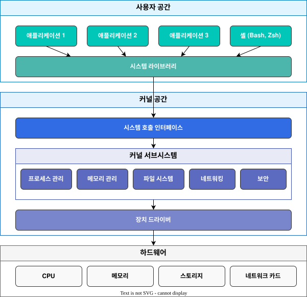
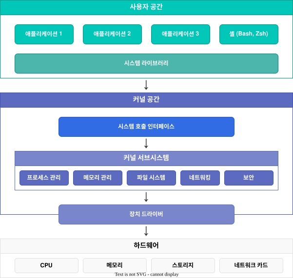
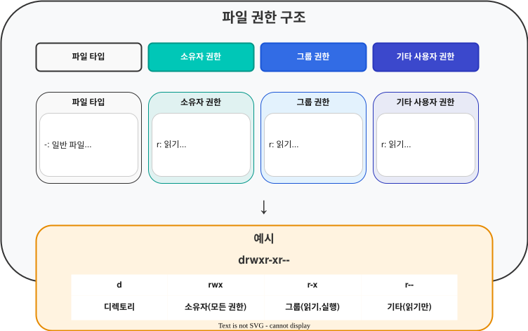
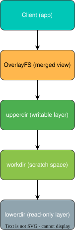
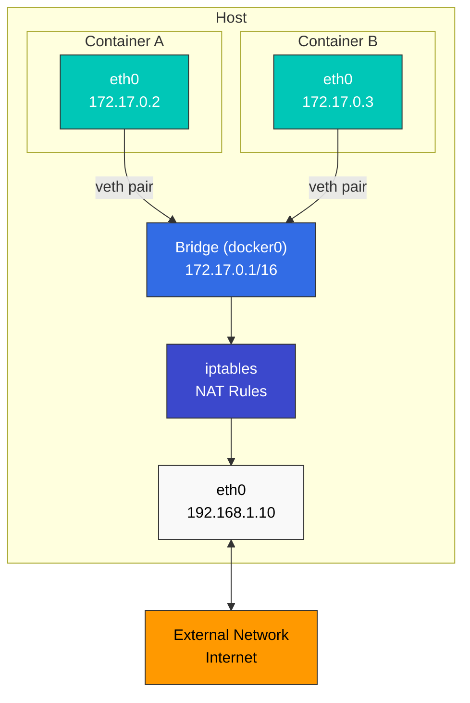

# Linux Basics

> **Supported Versions**: All major Linux distributions (Ubuntu 20.04+, CentOS/RHEL 8+, Debian 11+)
> **Last Updated**: February 11, 2026

Understanding Linux fundamentals is essential for comprehending Kubernetes and container technology. This document covers the core Linux concepts that are particularly important in Kubernetes environments.

## Lab Environment Setup

To follow along with the examples in this document, you'll need the following environment:

### Required Environment
- Linux operating system (Ubuntu 20.04+, CentOS/RHEL 8+, Debian 11+ recommended)
- Terminal access
- sudo privileges

### Cloud Environment Setup (Optional)
If using an AWS EC2 instance:
```bash
# Start an Amazon Linux 2 instance
aws ec2 run-instances \
  --image-id ami-0c55b159cbfafe1f0 \
  --instance-type t3.micro \
  --key-name your-key-pair \
  --security-group-ids sg-12345678 \
  --subnet-id subnet-12345678

# SSH connection
ssh -i your-key.pem ec2-user@your-instance-public-ip
```

### Local Environment Setup (Optional)
For local practice, you can use one of the following:
- **VirtualBox + Vagrant**: Set up a virtual machine environment
- **WSL2**: Use Linux environment on Windows
- **Docker**: Practice in a container environment

## Table of Contents

* [Linux Kernel and User Space](#linux-kernel-and-user-space)
* [Process Management](#process-management)
* [Namespaces](#namespaces)
* [cgroups (Control Groups)](#cgroups-control-groups)
* [File System](#file-system)
* [Networking Basics](#networking-basics)
* [Security Context](#security-context)
* [systemd and Service Management](#systemd-and-service-management)
* [Kernel Parameters and Modules](#kernel-parameters-and-modules)
* [System Resource Limits](#system-resource-limits)
* [Log Management](#log-management)
* [DNS and Network Configuration](#dns-and-network-configuration)
* [Time Synchronization](#time-synchronization)
* [Package Management](#package-management)
* [Essential Linux Commands](#essential-linux-commands)
* [Container-Related Linux Features](#container-related-linux-features)

## Linux Kernel and User Space

### Role of the Kernel

> **Key Concept**: The Linux kernel is the core of the operating system, acting as an intermediary between hardware and software.

The Linux kernel is the core of the operating system, acting as an intermediary between hardware and software. Its main functions include:

* **Process Management**: Process creation, scheduling, and termination
* **Memory Management**: Virtual memory and physical memory allocation
* **Device Management**: Communication with hardware devices
* **System Call Interface**: Provides a way for user space programs to access kernel services

### User Space

User space is the memory region where regular applications run. User space programs access kernel services through system calls.



### System Call Examples

| System Call | Description | Related Commands |
|------------|-------------|------------------|
| `fork()` | Create new process | `ps`, `top` |
| `exec()` | Execute program | `bash`, `sh` |
| `open()` | Open file | `cat`, `less` |
| `read()` | Read data from file | `cat`, `grep` |
| `write()` | Write data to file | `echo`, `tee` |
| `socket()` | Create network socket | `netstat`, `ss` |
| `clone()` | Create namespace | `unshare`, `docker` |

### Linux Kernel Architecture




## Process Management

### Processes and Threads

* **Process**: An instance of a running program with its own independent memory space
* **Thread**: A unit of work executing within a process; threads of the same process share memory space

### Process States

* **Running**: Currently executing on the CPU
* **Waiting**: Waiting for I/O completion or event occurrence
* **Ready**: Ready to run but waiting for CPU allocation
* **Zombie**: Terminated but parent process has not checked its status
* **Stopped**: Suspended state

### Key Process Management Commands

```bash
# View process list
ps aux

# Real-time process monitoring
top

# Enhanced real-time process monitoring
htop

# Terminate process
kill <PID>
killall <process-name>

# Background execution
command &

# Job management
jobs
fg %<job-number>
bg %<job-number>
```

## Namespaces

Namespaces are a Linux kernel feature that isolates process groups so that each group can see system resources independently. This is a core element of container technology.

### Main Namespace Types

* **PID Namespace**: Process ID isolation, allows containers to have their own PID 1 (init)
* **Network Namespace**: Network stack isolation (interfaces, IP addresses, routing tables, firewalls, etc.), foundation for container networking
* **Mount Namespace**: File system mount point isolation, provides independent file system per container
* **UTS Namespace**: Hostname and domain name isolation, gives each container a unique host identifier
* **IPC Namespace**: Inter-process communication resource isolation (shared memory, semaphores, message queues, etc.), important for service isolation in microservices architecture
* **User Namespace**: User and group ID isolation, supports rootless container execution for enhanced security
* **cgroup Namespace**: cgroup root directory isolation, provides resource limit visibility inside containers
* **Time Namespace**: System clock isolation, allows independent time settings per container (Linux 5.6+)

### Namespace-Related Commands

```bash
# Check process namespaces
ls -la /proc/<PID>/ns/

# Execute command in new namespace
unshare --net --pid --fork --mount-proc bash

# Enter existing process's namespace
nsenter --target <PID> --net --pid bash

# Create and manage network namespaces
ip netns add <name>
ip netns exec <name> <command>

# Using user namespace for rootless container execution
unshare --user --map-root-user --mount --net bash

# Using time namespace (Linux 5.6+)
unshare --time bash
```

## cgroups (Control Groups)

cgroups is a Linux kernel feature that limits and isolates resource usage of process groups. It's used to implement container resource limits. It's a core technology for resource management in cloud-native environments and Kubernetes.

### Main cgroups Features

* **CPU Time Limiting**: Limit CPU time available to process groups and allocate CPU cores
* **Memory Limiting**: Limit memory available to process groups and control OOM (Out of Memory) behavior
* **Block I/O Limiting**: Disk I/O bandwidth limiting and priority settings
* **Network Bandwidth Limiting**: Network traffic limiting (combined with tc)
* **Device Access Control**: Access control and permission management for specific devices
* **PIDs Control**: Limit process creation count to prevent fork bombs
* **Freezer**: Pause and resume process groups (used for container pausing)
* **cpuset**: Bind processes to specific CPU cores and NUMA nodes

### cgroups v1 and v2

* **cgroups v1**: Separate hierarchy for each resource type, still used in legacy systems
* **cgroups v2**: Unified single hierarchy for more consistent management, default in modern distributions
* **Hybrid Mode**: Use v1 and v2 together to maintain compatibility while leveraging new features

### cgroups-Related Commands

```bash
# Check cgroups
ls -la /sys/fs/cgroup/                     # cgroups v2
ls -la /sys/fs/cgroup/cpu /sys/fs/cgroup/memory  # cgroups v1

# cgroups management through systemd (modern approach)
systemctl set-property <service-name> CPUQuota=20%
systemctl set-property <service-name> MemoryLimit=1G
systemctl set-property <service-name> IOWeight=500

# Check process cgroup
cat /proc/<PID>/cgroup

# Direct cgroups v2 manipulation (advanced)
echo $$ > /sys/fs/cgroup/user.slice/cgroup.procs
echo "max 100000" > /sys/fs/cgroup/user.slice/memory.max
echo "100000 500000" > /sys/fs/cgroup/user.slice/memory.high

# Container runtime and cgroups
podman stats  # Monitor container resource usage
docker run --cpus=0.5 --memory=512m nginx  # Set resource limits
```

## File System

### File System Hierarchy

Linux has a hierarchical file system structure starting from a single root directory (`/`).

Key directories:

* `/bin`: Basic commands
* `/sbin`: System administration commands
* `/etc`: System configuration files
* `/home`: User home directories
* `/var`: Variable data (logs, cache, etc.)
* `/tmp`: Temporary files
* `/usr`: User programs and data
* `/proc`: Process and kernel information (virtual file system)
* `/sys`: System and hardware information (virtual file system)

### File System Types

* **ext4**: Default Linux file system
* **XFS**: Suitable for large file systems
* **Btrfs**: Provides advanced features like snapshots and compression
* **OverlayFS**: Represents multiple directories as a single directory (commonly used in containers)
* **tmpfs**: Memory-based temporary file system

### Mount and Volumes

```bash
# Mount file system
mount -t <filesystem-type> <source> <mount-point>

# Check mounted file systems
mount
df -h

# Unmount file system
umount <mount-point>
```

## Networking Basics

### Network Interfaces

* **lo**: Loopback interface (127.0.0.1)
* **eth0, ens3, etc.**: Physical network interfaces
* **docker0, cni0, etc.**: Virtual bridge interfaces (container networking)

### Network Configuration Commands

```bash
# Check network interfaces
ip addr show
ifconfig

# Check routing table
ip route
route -n

# Check network connections
netstat -tuln
ss -tuln

# Network packet analysis
tcpdump -i <interface>
```

### Network Namespaces and Virtual Interfaces

```bash
# Create network namespace
ip netns add <namespace-name>

# Create virtual ethernet pair
ip link add <veth1> type veth peer name <veth2>

# Connect virtual interface to namespace
ip link set <veth2> netns <namespace-name>
```

## Security Context

### Users and Groups

* **UID (User ID)**: User identifier
* **GID (Group ID)**: Group identifier
* **root (UID 0)**: Special user with administrative privileges

### File Permissions

Linux file permissions consist of read (r), write (w), and execute (x) permissions for owner, group, and other users.



### Permission-Related Commands

```bash
# Change file permissions
chmod 755 <filename>  # rwxr-xr-x
chmod u+x <filename>  # Add execute permission for owner

# Change file owner
chown <user>:<group> <filename>

# Special permissions
chmod 4755 <filename>  # Set setuid
chmod 2755 <filename>  # Set setgid
chmod 1755 <filename>  # Set sticky bit
```

### SELinux and AppArmor

* **SELinux (Security-Enhanced Linux)**: Mandatory access control system developed by NSA
* **AppArmor**: Access control system using per-program security profiles

```bash
# Check SELinux status
getenforce

# Change SELinux mode
setenforce 0  # Permissive mode
setenforce 1  # Enforcing mode

# Check AppArmor status
aa-status

# AppArmor profile management
aa-enforce /etc/apparmor.d/<profile>
aa-complain /etc/apparmor.d/<profile>
```

## systemd and Service Management

systemd is the init system and service manager for modern Linux systems. It's used to manage core services like kubelet and containerd on Kubernetes nodes.

### Main systemd Features

* **Service Management**: Start, stop, restart, enable/disable system services
* **Dependency Management**: Automatic service dependency management and parallel startup
* **Logging**: Integrated log management through journald
* **Timers**: Timer units that can replace cron
* **Resource Management**: Per-service resource limits through cgroups

### systemd Unit Types

* **service**: System services (e.g., kubelet.service, containerd.service)
* **socket**: Socket-based activation
* **target**: Unit groups (similar to runlevels)
* **timer**: Scheduled tasks
* **mount**: File system mounts
* **device**: Device units

### systemd Commands

```bash
# Check service status
systemctl status kubelet
systemctl status containerd

# Service control
systemctl start <service>
systemctl stop <service>
systemctl restart <service>
systemctl reload <service>  # Reload configuration

# Set auto-start at boot
systemctl enable <service>
systemctl disable <service>

# Check service logs
journalctl -u kubelet -f  # Real-time logs
journalctl -u kubelet --since "1 hour ago"
journalctl -u kubelet --no-pager

# List all services
systemctl list-units --type=service
systemctl list-unit-files --type=service

# Check failed services
systemctl --failed

# Reload systemd configuration
systemctl daemon-reload
```

### Writing systemd Unit Files

Example systemd unit file for Kubernetes-related services:

```ini
# /etc/systemd/system/kubelet.service
[Unit]
Description=kubelet: The Kubernetes Node Agent
Documentation=https://kubernetes.io/docs/
Wants=network-online.target
After=network-online.target

[Service]
ExecStart=/usr/bin/kubelet
Restart=always
StartLimitInterval=0
RestartSec=10

[Install]
WantedBy=multi-user.target
```

### systemd Resource Limits

```bash
# CPU limit (20%)
systemctl set-property kubelet CPUQuota=20%

# Memory limit (1GB)
systemctl set-property kubelet MemoryLimit=1G

# I/O weight setting (100-1000, default 100)
systemctl set-property kubelet IOWeight=500

# Check settings
systemctl show kubelet | grep -E 'CPUQuota|MemoryLimit|IOWeight'
```

## Kernel Parameters and Modules

### Kernel Parameter Settings via sysctl

sysctl is a tool for querying and modifying running kernel parameters. It's essential for network and system parameter tuning when configuring Kubernetes clusters.

#### Key sysctl Settings Required for Kubernetes

```bash
# Enable IP forwarding (required for container networking)
sysctl -w net.ipv4.ip_forward=1
sysctl -w net.ipv6.conf.all.forwarding=1

# Enable bridge traffic to pass through iptables (required for CNI plugins)
sysctl -w net.bridge.bridge-nf-call-iptables=1
sysctl -w net.bridge.bridge-nf-call-ip6tables=1

# Increase maximum file descriptor count
sysctl -w fs.file-max=2097152

# Network performance tuning
sysctl -w net.core.somaxconn=32768
sysctl -w net.ipv4.tcp_max_syn_backlog=8192
sysctl -w net.core.netdev_max_backlog=16384

# ARP cache settings (for large clusters)
sysctl -w net.ipv4.neigh.default.gc_thresh1=80000
sysctl -w net.ipv4.neigh.default.gc_thresh2=90000
sysctl -w net.ipv4.neigh.default.gc_thresh3=100000

# Check current settings
sysctl net.ipv4.ip_forward
sysctl -a | grep bridge-nf-call

# Persistent settings (/etc/sysctl.conf or /etc/sysctl.d/*.conf)
cat <<EOF | sudo tee /etc/sysctl.d/99-kubernetes.conf
net.ipv4.ip_forward = 1
net.bridge.bridge-nf-call-iptables = 1
net.bridge.bridge-nf-call-ip6tables = 1
EOF

# Apply settings
sysctl --system
```

### Kernel Module Management

Many CNI plugins and storage drivers require specific kernel modules.

```bash
# Load modules
modprobe overlay  # OverlayFS (container storage)
modprobe br_netfilter  # Bridge networking
modprobe ip_vs  # IPVS load balancing (kube-proxy IPVS mode)
modprobe ip_vs_rr  # Round Robin algorithm
modprobe ip_vs_wrr  # Weighted Round Robin
modprobe ip_vs_sh  # Source Hashing

# Check loaded modules
lsmod | grep overlay
lsmod | grep br_netfilter

# Check module information
modinfo overlay

# Set auto-load at boot
cat <<EOF | sudo tee /etc/modules-load.d/kubernetes.conf
overlay
br_netfilter
ip_vs
ip_vs_rr
ip_vs_wrr
ip_vs_sh
EOF

# Unload module
modprobe -r <module-name>
```

### Kernel Version and Feature Check

```bash
# Check kernel version
uname -r

# Check kernel compile options
cat /boot/config-$(uname -r) | grep OVERLAY
cat /boot/config-$(uname -r) | grep NETFILTER

# Check available kernel features
cat /proc/filesystems  # Supported file systems
cat /proc/sys/net/ipv4/ip_forward  # IP forwarding status
```

## System Resource Limits

### ulimit - Per-User Resource Limits

ulimit limits system resources that processes can use. Adjustments may be needed on Kubernetes nodes to ensure sufficient resources.

```bash
# Check current limits
ulimit -a

# Key limit items
ulimit -n      # Number of open file descriptors
ulimit -u      # Maximum number of processes
ulimit -m      # Maximum memory size
ulimit -v      # Virtual memory size

# Change limits (current session)
ulimit -n 65536  # Increase file descriptors to 65536

# Persistent settings (/etc/security/limits.conf)
sudo tee -a /etc/security/limits.conf <<EOF
*               soft    nofile          65536
*               hard    nofile          65536
*               soft    nproc           32768
*               hard    nproc           32768
EOF

# Settings for specific users/groups
sudo tee -a /etc/security/limits.conf <<EOF
root            soft    nofile          65536
root            hard    nofile          65536
@docker         soft    nofile          65536
@docker         hard    nofile          65536
EOF
```

### PAM Limit Settings

```bash
# Check PAM settings
cat /etc/pam.d/common-session
cat /etc/pam.d/common-session-noninteractive

# Add to PAM settings to apply limits.conf
echo "session required pam_limits.so" | sudo tee -a /etc/pam.d/common-session
```

### Per-Process Resource Checking

```bash
# Check current resource limits for a process
cat /proc/<PID>/limits

# Check file descriptors for a specific process
ls -l /proc/<PID>/fd | wc -l
```

## Log Management

### journald - systemd Integrated Logging

journald is systemd's logging system that manages system service logs on Kubernetes nodes.

```bash
# Full system logs
journalctl

# Specific service logs
journalctl -u kubelet
journalctl -u containerd
journalctl -u docker

# Real-time logs (similar to tail -f)
journalctl -u kubelet -f

# Time range specification
journalctl --since "2025-11-24 10:00:00"
journalctl --since "1 hour ago"
journalctl --since yesterday
journalctl --until "2025-11-24 12:00:00"

# Filter by priority
journalctl -p err        # Errors only
journalctl -p warning    # Warnings and above
journalctl -p debug      # All including debug

# Change output format
journalctl -u kubelet -o json        # JSON format
journalctl -u kubelet -o json-pretty # Pretty JSON
journalctl -u kubelet -o cat         # Messages only

# Boot logs
journalctl -b           # Current boot logs
journalctl -b -1        # Previous boot logs
journalctl --list-boots # Boot list

# Check disk usage
journalctl --disk-usage

# Clean logs
journalctl --vacuum-time=7d   # Delete logs older than 7 days
journalctl --vacuum-size=1G   # Delete logs over 1GB
```

### journald Configuration

```bash
# journald configuration file
sudo vi /etc/systemd/journald.conf

# Key configuration options
# Storage=persistent        # Persistent storage to disk
# SystemMaxUse=1G          # Maximum disk usage
# SystemKeepFree=500M      # Minimum free space
# MaxRetentionSec=1month   # Maximum retention period

# Apply configuration
sudo systemctl restart systemd-journald
```

### Traditional syslog

Some systems still use syslog.

```bash
# syslog file locations
/var/log/syslog         # Debian/Ubuntu
/var/log/messages       # RHEL/CentOS

# Real-time log viewing
tail -f /var/log/syslog

# Log search
grep "kubelet" /var/log/syslog
grep -i "error" /var/log/syslog
```

### Log Rotation

Configure log rotation to prevent log files from growing indefinitely.

```bash
# logrotate configuration
sudo vi /etc/logrotate.d/kubernetes

# Example configuration
/var/log/kubernetes/*.log {
    daily
    rotate 7
    missingok
    notifempty
    compress
    delaycompress
    copytruncate
}

# Run rotation manually
sudo logrotate -f /etc/logrotate.d/kubernetes
```

## DNS and Network Configuration

### DNS Configuration

DNS is core to service discovery within Kubernetes clusters.

```bash
# DNS configuration file
cat /etc/resolv.conf

# Example configuration
nameserver 8.8.8.8
nameserver 8.8.4.4
search cluster.local svc.cluster.local
options ndots:5

# DNS lookup test
nslookup kubernetes.default.svc.cluster.local
dig kubernetes.default.svc.cluster.local

# hosts file
cat /etc/hosts
```

### systemd-resolved

Modern Linux distributions use systemd-resolved.

```bash
# Check systemd-resolved status
systemctl status systemd-resolved

# Check DNS servers
resolvectl status

# DNS cache statistics
resolvectl statistics

# Clear DNS cache
resolvectl flush-caches
```

### Network Configuration Files

```bash
# NetworkManager (RHEL/CentOS 8+, Ubuntu 18.04+)
nmcli connection show
nmcli device status

# netplan (Ubuntu 18.04+)
cat /etc/netplan/*.yaml

# Example netplan configuration
network:
  version: 2
  ethernets:
    eth0:
      dhcp4: true
      nameservers:
        addresses: [8.8.8.8, 8.8.4.4]

# Apply configuration
sudo netplan apply
```

## Time Synchronization

Time synchronization is very important in distributed systems. All nodes in a Kubernetes cluster must maintain accurate time.

### chronyd (Recommended)

chronyd is a modern NTP client that synchronizes time faster than ntpd.

```bash
# Install chronyd (RHEL/CentOS)
sudo yum install chrony

# Install chronyd (Ubuntu/Debian)
sudo apt install chrony

# Check service status
systemctl status chronyd

# Check time synchronization status
chronyc tracking

# NTP server list
chronyc sources

# Detailed information
chronyc sourcestats

# Manual time synchronization
sudo chronyc makestep
```

### chronyd Configuration

```bash
# Configuration file
sudo vi /etc/chrony.conf

# Key settings
# NTP server configuration
server 0.pool.ntp.org iburst
server 1.pool.ntp.org iburst
server 2.pool.ntp.org iburst
server 3.pool.ntp.org iburst

# Fast synchronization
makestep 1.0 3

# Apply configuration
sudo systemctl restart chronyd
```

### timesyncd (Ubuntu Default)

Ubuntu uses systemd-timesyncd by default.

```bash
# Check status
timedatectl status

# NTP synchronization status
timedatectl show-timesync --all

# Configuration file
sudo vi /etc/systemd/timesyncd.conf

# Example configuration
[Time]
NTP=0.pool.ntp.org 1.pool.ntp.org
FallbackNTP=time.google.com

# Restart service
sudo systemctl restart systemd-timesyncd
```

### Timezone Settings

```bash
# Check current time and timezone
timedatectl

# List timezones
timedatectl list-timezones

# Change timezone
sudo timedatectl set-timezone Asia/Seoul

# Manually set time (when NTP is disabled)
sudo timedatectl set-time "2025-11-24 12:00:00"

# Enable/disable NTP
sudo timedatectl set-ntp true
```

## Package Management

Package manager usage for installing and managing Kubernetes and related tools.

### apt (Debian/Ubuntu)

```bash
# Update package list
sudo apt update

# Upgrade packages
sudo apt upgrade

# Install package
sudo apt install <package-name>

# Remove package
sudo apt remove <package-name>
sudo apt purge <package-name>  # Remove configuration files as well

# Search packages
apt search <keyword>

# Package information
apt show <package-name>

# List installed packages
apt list --installed

# Add repository (Kubernetes example)
sudo apt install -y apt-transport-https ca-certificates curl
curl -fsSL https://pkgs.k8s.io/core:/stable:/v1.28/deb/Release.key | \
  sudo gpg --dearmor -o /etc/apt/keyrings/kubernetes-apt-keyring.gpg
echo 'deb [signed-by=/etc/apt/keyrings/kubernetes-apt-keyring.gpg] \
  https://pkgs.k8s.io/core:/stable:/v1.28/deb/ /' | \
  sudo tee /etc/apt/sources.list.d/kubernetes.list

# Clean unnecessary packages
sudo apt autoremove
sudo apt autoclean
```

### yum/dnf (RHEL/CentOS/Fedora)

```bash
# Install package
sudo yum install <package-name>
sudo dnf install <package-name>  # Fedora/RHEL 8+

# Update packages
sudo yum update
sudo dnf update

# Remove package
sudo yum remove <package-name>
sudo dnf remove <package-name>

# Search packages
yum search <keyword>
dnf search <keyword>

# Package information
yum info <package-name>
dnf info <package-name>

# List installed packages
yum list installed
dnf list installed

# Add repository (Kubernetes example)
cat <<EOF | sudo tee /etc/yum.repos.d/kubernetes.repo
[kubernetes]
name=Kubernetes
baseurl=https://pkgs.k8s.io/core:/stable:/v1.28/rpm/
enabled=1
gpgcheck=1
gpgkey=https://pkgs.k8s.io/core:/stable:/v1.28/rpm/repodata/repomd.xml.key
EOF

# Clean cache
sudo yum clean all
sudo dnf clean all
```

### Package Version Locking

Kubernetes components have version compatibility requirements, so automatic updates should be prevented.

```bash
# apt (Ubuntu/Debian)
sudo apt-mark hold kubelet kubeadm kubectl

# Remove apt hold
sudo apt-mark unhold kubelet kubeadm kubectl

# yum (RHEL/CentOS)
sudo yum install yum-plugin-versionlock
sudo yum versionlock add kubelet kubeadm kubectl

# Remove yum versionlock
sudo yum versionlock delete kubelet kubeadm kubectl
```

## Essential Linux Commands

### File and Directory Management

```bash
ls -la           # List files (including hidden)
cd <directory>   # Change directory
pwd              # Print current directory
mkdir -p <path>  # Create directory (create parent directories if needed)
rm -rf <path>    # Remove files/directories
cp -r <source> <destination> # Copy files/directories
mv <source> <destination>    # Move or rename files/directories
find <path> -name "<pattern>" # Search files
```

### Text Processing

```bash
cat <file>        # Output file contents
less <file>       # View file contents page by page
grep "<pattern>" <file> # Search pattern in file
sed 's/<pattern>/<replacement>/' <file> # Text substitution
awk '{print $1}' <file> # Text processing
```

### System Information

```bash
uname -a         # Kernel information
lsb_release -a   # Distribution information
free -h          # Memory usage
df -h            # Disk usage
du -sh <path>    # Directory size
```

### Process and Service Management

```bash
systemctl status <service> # Check service status
systemctl start/stop/restart <service> # Service control
journalctl -u <service> # View service logs
```

## Container-Related Linux Features

### OverlayFS

OverlayFS is a union mount file system that represents multiple directories as a single directory. It's used by container runtimes like Docker to implement image layers.



### Network Bridge and NAT

Container networking is primarily implemented using bridge interfaces and NAT (Network Address Translation).



### System Call Filtering (seccomp)

seccomp (Secure Computing Mode) is a Linux kernel feature that restricts system calls available to processes. It's used to enhance container security.

### Capabilities Restriction

Linux capabilities divide traditional root privileges into smaller permission units. Containers receive only necessary capabilities to enhance security.

Key capabilities:

* `CAP_NET_ADMIN`: Network configuration changes
* `CAP_SYS_ADMIN`: System administration tasks
* `CAP_CHOWN`: Change file ownership
* `CAP_DAC_OVERRIDE`: Bypass file permissions

## Conclusion

Linux fundamentals and features are essential for understanding Kubernetes and container technology. Here's a summary of the key topics covered in this document:

### Core Technologies
* **Namespaces and cgroups**: Foundation for container isolation and resource management
* **OverlayFS**: Core of container image layering
* **systemd**: Kubernetes node service management

### Essential Operations Knowledge
* **Kernel Parameter Tuning**: Network and system optimization through sysctl
* **Module Management**: CNI plugin and storage driver support
* **Log Management**: System and service log analysis through journald
* **Time Synchronization**: Maintaining consistency in distributed systems

### Troubleshooting
* **Resource Limits**: Resource management through ulimit and cgroups
* **Networking**: DNS, bridge, iptables configuration
* **Package Management**: Version management of Kubernetes components

With this Linux foundation, you can effectively troubleshoot issues in Kubernetes environments, optimize clusters, and operate them reliably.

## Quiz

To test what you've learned in this chapter, take the [Linux Basics Quiz](../quizzes/basics/01-linux-basics-quiz.md).

## References

* [The Linux Documentation Project](https://tldp.org/)
* [Linux Kernel Documentation](https://www.kernel.org/doc/)
* [Linux Namespaces](https://man7.org/linux/man-pages/man7/namespaces.7.html)
* [Control Groups v2](https://www.kernel.org/doc/html/latest/admin-guide/cgroup-v2.html)
