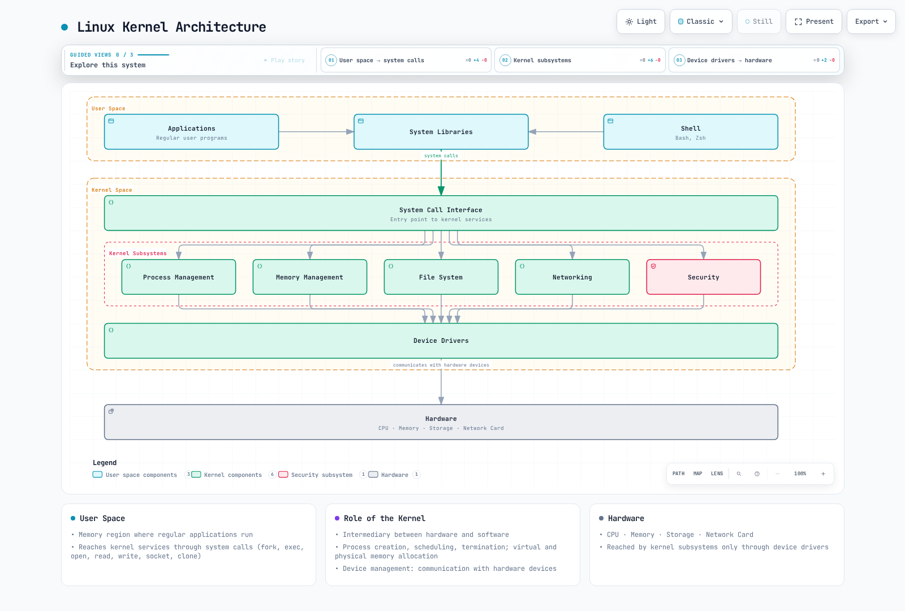
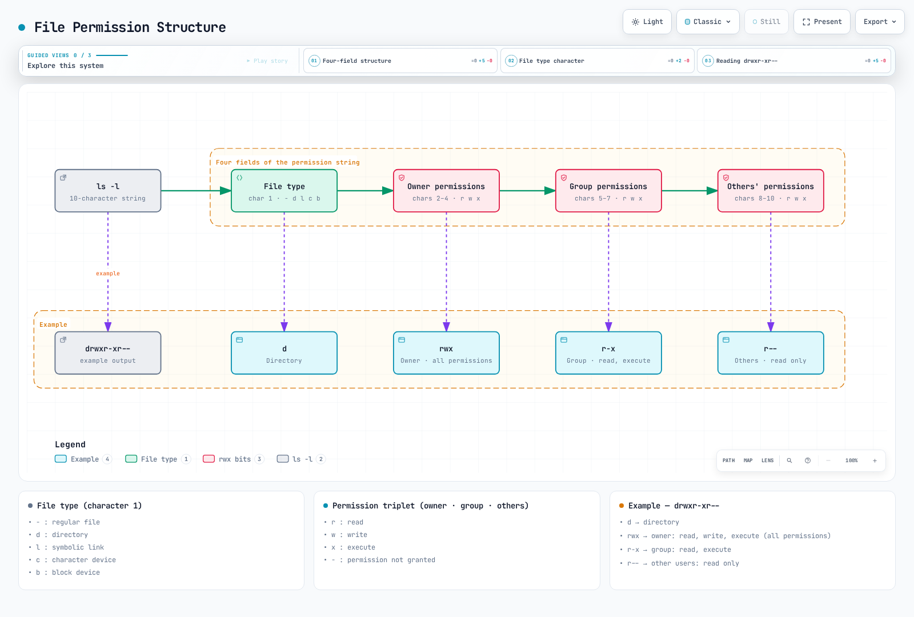

# Linux Basics

> **Supported Versions**: Reviewed examples: Ubuntu 24.04 LTS, Debian 13, Amazon Linux 2023; package/service names vary by distribution **Last Updated**: September 11, 2026

Understanding Linux fundamentals is essential for comprehending Kubernetes and container technology. This document covers the core Linux concepts that are particularly important in Kubernetes environments.

## Lab Environment Setup

To follow along with the examples in this document, you'll need the following environment:

### Required Environment

* Linux operating system (Ubuntu 24.04 LTS, Debian 13, or Amazon Linux 2023 recommended)
* Terminal access
* sudo privileges

### Cloud Environment Setup (Optional)

Use an isolated training VM. For AWS, select AL2023 with the correct architecture and Region; the old hard-coded AMI is not portable. AWS lists AL2 standard support as ended on June 30, 2026. The following only looks up an AMI; arrange instance creation and scoped access separately, then connect to the existing instance.

```bash
# Read-only AMI discovery; select a kernel-specific parameter when reproducibility is required.
aws ssm get-parameter --region us-east-1 \
  --name /aws/service/ami-amazon-linux-latest/al2023-ami-kernel-default-x86_64 \
  --query Parameter.Value --output text

# SSH connection
ssh -i your-key.pem ec2-user@your-instance-public-ip
```

### Local Environment Setup (Optional)

For local practice, you can use one of the following:

* **VirtualBox + Vagrant**: Set up a virtual machine environment
* **WSL2**: Use Linux environment on Windows
* **Docker**: Suitable for basic shell exercises; ordinary containers do not provide a full systemd host or permission for host networking/kernel exercises.

## Table of Contents

* [Linux Kernel and User Space](01-linux-basics.md#linux-kernel-and-user-space)
* [Process Management](01-linux-basics.md#process-management)
* [Namespaces](01-linux-basics.md#namespaces)
* [cgroups (Control Groups)](01-linux-basics.md#cgroups-control-groups)
* [File System](01-linux-basics.md#file-system)
* [Networking Basics](01-linux-basics.md#networking-basics)
* [Security Context](01-linux-basics.md#security-context)
* [systemd and Service Management](01-linux-basics.md#systemd-and-service-management)
* [Kernel Parameters and Modules](01-linux-basics.md#kernel-parameters-and-modules)
* [System Resource Limits](01-linux-basics.md#system-resource-limits)
* [Log Management](01-linux-basics.md#log-management)
* [DNS and Network Configuration](01-linux-basics.md#dns-and-network-configuration)
* [Time Synchronization](01-linux-basics.md#time-synchronization)
* [Package Management](01-linux-basics.md#package-management)
* [Essential Linux Commands](01-linux-basics.md#essential-linux-commands)
* [Container-Related Linux Features](01-linux-basics.md#container-related-linux-features)

## Linux Kernel and User Space

### Role of the Kernel

> **Key Concept**: The Linux kernel is the core of the operating system, acting as an intermediary between hardware and software.

The Linux kernel is the core of the operating system, acting as an intermediary between hardware and software. Its main functions include:

* **Process Management**: Process creation, scheduling, and termination
* **Memory Management**: Virtual memory and physical memory allocation
* **Device Management**: Communication with hardware devices
* **System Call Interface**: Provides a way for user space programs to access kernel services

### User Space

User space is the memory region where regular applications run. User space programs access kernel services through system calls.


[🔍 View interactive diagram](https://www.atomai.click/kubernetes-docs/archmaps/en-basics-01-linux-basics-0.html)

### System Call Examples

| System Call | Description           | Related Commands    |
| ----------- | --------------------- | ------------------- |
| `fork()`    | Create new process    | `ps`, `top`         |
| `exec()`    | Execute program       | `bash`, `sh`        |
| `open()`    | Open file             | `cat`, `less`       |
| `read()`    | Read data from file   | `cat`, `grep`       |
| `write()`   | Write data to file    | `echo`, `tee`       |
| `socket()`  | Create network socket | `netstat`, `ss`     |
| `clone()`   | Create namespace      | `unshare`, `docker` |

### Linux Kernel Architecture



[🔍 View interactive diagram](https://www.atomai.click/kubernetes-docs/archmaps/en-basics-01-linux-basics-1.html)

## Process Management

### Processes and Threads

* **Process**: An instance of a running program with its own independent memory space
* **Thread**: A unit of work executing within a process; threads of the same process share memory space

### Process States

* **Running**: Currently executing on the CPU
* **Waiting**: Waiting for I/O completion or event occurrence
* **Ready**: Ready to run but waiting for CPU allocation
* **Zombie**: Terminated but parent process has not checked its status
* **Stopped**: Suspended state

### Key Process Management Commands

```bash
# View process list
ps aux

# Real-time process monitoring
top

# Enhanced real-time process monitoring
htop

# Terminate process
kill <PID>
killall <process-name>

# Background execution
command &

# Job management
jobs
fg %<job-number>
bg %<job-number>
```

## Namespaces

Namespaces are a Linux kernel feature that isolates process groups so that each group can see system resources independently. This is a core element of container technology.

### Main Namespace Types

* **PID Namespace**: Process ID isolation, allows containers to have their own PID 1 (init)
* **Network Namespace**: Network stack isolation (interfaces, IP addresses, routing tables, firewalls, etc.), foundation for container networking
* **Mount Namespace**: Isolates mount tables; filesystem content and container root isolation require suitable mounts/root configuration
* **UTS Namespace**: Hostname and NIS domain-name isolation (not DNS domains), gives each container a unique host identifier
* **IPC Namespace**: Inter-process communication resource isolation (shared memory, semaphores, message queues, etc.), important for service isolation in microservices architecture
* **User Namespace**: User and group ID isolation, supports rootless container execution for enhanced security
* **cgroup Namespace**: cgroup root directory isolation, provides resource limit visibility inside containers
* **Time Namespace**: Virtualizes CLOCK_MONOTONIC/CLOCK_BOOTTIME offsets (Linux 5.6+), not the realtime wall clock

### Namespace-Related Commands

```bash
# Check process namespaces
ls -la /proc/<PID>/ns/

# Execute command in new namespace
sudo unshare --mount --net --pid --fork --mount-proc bash

# Enter existing process's namespace
sudo nsenter --target <PID> --net --pid bash

# Create and manage network namespaces
ip netns add <name>
ip netns exec <name> <command>

# Using user namespace for rootless container execution
unshare --user --map-root-user --mount --net bash

# Using time namespace (Linux 5.6+)
sudo unshare --time --fork bash
```

## cgroups (Control Groups)

cgroups is a Linux kernel feature that limits and isolates resource usage of process groups. It's used to implement container resource limits. It's a core technology for resource management in cloud-native environments and Kubernetes.

### Main cgroups Features

* **CPU Time Limiting**: Limit CPU time available to process groups and allocate CPU cores
* **Memory Limiting**: Limit memory available to process groups and control OOM (Out of Memory) behavior
* **Block I/O Limiting**: Disk I/O bandwidth limiting and priority settings
* **Network traffic control**: Combine tc/eBPF with cgroup classification; cgroup v2 has no standalone network-bandwidth knob
* **Device Access Control**: Access control and permission management for specific devices
* **PIDs Control**: Limit process creation count to prevent fork bombs
* **Freezer**: Pause and resume process groups (used for container pausing)
* **cpuset**: Bind processes to specific CPU cores and NUMA nodes

### cgroups v1 and v2

* **cgroups v1**: Separate hierarchy for each resource type, still used in legacy systems
* **cgroups v2**: Unified single hierarchy for more consistent management, default in modern distributions
* **Hybrid Mode**: Use v1 and v2 together to maintain compatibility while leveraging new features

### cgroups-Related Commands

```bash
# Check cgroups
ls -la /sys/fs/cgroup/                     # cgroups v2
ls -la /sys/fs/cgroup/cpu /sys/fs/cgroup/memory  # cgroups v1

# cgroups management through systemd (modern approach)
sudo systemctl set-property --runtime <service-name> CPUQuota=20%
sudo systemctl set-property --runtime <service-name> MemoryMax=1G
sudo systemctl set-property --runtime <service-name> IOWeight=500

# Check process cgroup
cat /proc/<PID>/cgroup

# Run only the example command inside a transient cgroup managed by systemd.
sudo systemd-run --scope -p CPUQuota=20% -p MemoryHigh=768M -p MemoryMax=1G sleep 60
# memory.max/high take one byte count or "max"; cpu.max takes quota and period.
# Do not move your shell into systemd-owned user.slice or edit its control files.

# Container runtime and cgroups
podman stats  # Monitor container resource usage
docker run --cpus=0.5 --memory=512m nginx  # Set resource limits
```

## File System

### File System Hierarchy

Linux has a hierarchical file system structure starting from a single root directory (`/`).

Key directories:

* `/bin`: Basic commands
* `/sbin`: System administration commands
* `/etc`: System configuration files
* `/home`: User home directories
* `/var`: Variable data (logs, cache, etc.)
* `/tmp`: Temporary files
* `/usr`: User programs and data
* `/proc`: Process and kernel information (virtual file system)
* `/sys`: System and hardware information (virtual file system)

### File System Types

* **ext4**: A common Linux filesystem; defaults vary by distribution
* **XFS**: Suitable for large file systems
* **Btrfs**: Provides advanced features like snapshots and compression
* **OverlayFS**: Represents multiple directories as a single directory (commonly used in containers)
* **tmpfs**: Memory-backed temporary filesystem; pages may be swapped unless swap is disabled for it

### Mount and Volumes

```bash
# Mount file system
mount -t <filesystem-type> <source> <mount-point>

# Check mounted file systems
mount
df -h

# Unmount file system
umount <mount-point>
```

## Networking Basics

### Network Interfaces

* **lo**: Loopback interface (127.0.0.1)
* **eth0, ens3, etc.**: Physical network interfaces
* **docker0, cni0, etc.**: Virtual bridge interfaces (container networking)

### Network Configuration Commands

```bash
# Check network interfaces
ip addr show
ifconfig

# Check routing table
ip route
route -n

# Check network connections
netstat -tuln
ss -tuln

# Network packet analysis
tcpdump -i <interface>
```

### Network Namespaces and Virtual Interfaces

```bash
# Create network namespace
ip netns add <namespace-name>

# Create virtual ethernet pair
ip link add <veth1> type veth peer name <veth2>

# Connect virtual interface to namespace
ip link set <veth2> netns <namespace-name>
```

## Security Context

### Users and Groups

* **UID (User ID)**: User identifier
* **GID (Group ID)**: Group identifier
* **root (UID 0)**: Special user with administrative privileges

### File Permissions

Linux file permissions consist of read (r), write (w), and execute (x) permissions for owner, group, and other users.



[🔍 View interactive diagram](https://www.atomai.click/kubernetes-docs/archmaps/en-basics-01-linux-basics-2.html)

### Permission-Related Commands

```bash
# Change file permissions
chmod 755 <filename>  # rwxr-xr-x
chmod u+x <filename>  # Add execute permission for owner

# Change file owner
chown <user>:<group> <filename>

# Special permissions
chmod 4755 <filename>  # Set setuid
chmod 2755 <filename>  # Set setgid
chmod 1755 <filename>  # Set sticky bit
```

### SELinux and AppArmor

* **SELinux (Security-Enhanced Linux)**: Mandatory access control system developed by NSA
* **AppArmor**: Access control system using per-program security profiles

```bash
# Check SELinux status
getenforce

# Only in a reviewed isolated lab: permissive disables enforcement system-wide.
# sudo setenforce 0
# Restore the original mode after investigation; do not use permissive as a generic fix.

# Check AppArmor status
aa-status

# AppArmor profile management
aa-enforce /etc/apparmor.d/<profile>
aa-complain /etc/apparmor.d/<profile>
```

## systemd and Service Management

systemd is the init system and service manager for modern Linux systems. It's used to manage core services like kubelet and containerd on Kubernetes nodes.

### Main systemd Features

* **Service Management**: Start, stop, restart, enable/disable system services
* **Dependency Management**: Automatic service dependency management and parallel startup
* **Logging**: Integrated log management through journald
* **Timers**: Timer units that can replace cron
* **Resource Management**: Per-service resource limits through cgroups

### systemd Unit Types

* **service**: System services (e.g., kubelet.service, containerd.service)
* **socket**: Socket-based activation
* **target**: Unit groups (similar to runlevels)
* **timer**: Scheduled tasks
* **mount**: File system mounts
* **device**: Device units

### systemd Commands

```bash
# Check service status
systemctl status kubelet
systemctl status containerd

# Service control
systemctl start <service>
systemctl stop <service>
systemctl restart <service>
systemctl reload <service>  # Reload configuration

# Set auto-start at boot
systemctl enable <service>
systemctl disable <service>

# Check service logs
journalctl -u kubelet -f  # Real-time logs
journalctl -u kubelet --since "1 hour ago"
journalctl -u kubelet --no-pager

# List all services
systemctl list-units --type=service
systemctl list-unit-files --type=service

# Check failed services
systemctl --failed

# Reload systemd configuration
systemctl daemon-reload
```

### Writing systemd Unit Files

A small training service illustrates unit structure. Inspect kubelet with systemctl cat kubelet; retain the distribution/kubeadm-managed unit and drop-ins instead of replacing them.

```ini
# /etc/systemd/system/linux-basics-demo.service
[Unit]
Description=Linux basics training service
Documentation=man:systemd.service(5)
Wants=network-online.target
After=network-online.target

[Service]
ExecStart=/usr/bin/sleep infinity
Restart=on-failure
RestartSec=10

[Install]
WantedBy=multi-user.target
```

### systemd Resource Limits

The commands below assume the training unit above was saved and daemon-reload completed in the lab VM. Do not apply these teaching limits to production kubelet/containerd.

```bash
# CPU limit (20%)
sudo systemctl set-property --runtime linux-basics-demo.service CPUQuota=20%

# Memory limit (1GB)
sudo systemctl set-property --runtime linux-basics-demo.service MemoryMax=1G

# I/O weight setting (1-10000, default 100)
sudo systemctl set-property --runtime linux-basics-demo.service IOWeight=500

# Check settings
systemctl show linux-basics-demo.service | grep -E 'CPUQuota|MemoryMax|IOWeight'
```

## Kernel Parameters and Modules

### Kernel Parameter Settings via sysctl

sysctl is a tool for querying and modifying running kernel parameters. It's essential for network and system parameter tuning when configuring Kubernetes clusters.

#### CNI-specific sysctl Settings and Tuning Examples

These are not mandatory defaults for every Kubernetes node. Check the chosen IP family, CNI and Service proxy requirements. Bridge-netfilter settings apply only to configurations using br_netfilter. Do not apply performance/ARP/conntrack values to production without measurements; record existing values and use an isolated training VM.

```bash
# Enable IP forwarding (required for container networking)
sudo sysctl -w net.ipv4.ip_forward=1
sudo sysctl -w net.ipv6.conf.all.forwarding=1

# Enable bridge traffic to pass through iptables (only for CNI configurations requiring bridge netfilter)
sudo sysctl -w net.bridge.bridge-nf-call-iptables=1
sudo sysctl -w net.bridge.bridge-nf-call-ip6tables=1

# Increase maximum file descriptor count
sudo sysctl -w fs.file-max=2097152

# Network performance tuning
sudo sysctl -w net.core.somaxconn=32768
sudo sysctl -w net.ipv4.tcp_max_syn_backlog=8192
sudo sysctl -w net.core.netdev_max_backlog=16384

# ARP cache settings (for large clusters)
sudo sysctl -w net.ipv4.neigh.default.gc_thresh1=80000
sudo sysctl -w net.ipv4.neigh.default.gc_thresh2=90000
sudo sysctl -w net.ipv4.neigh.default.gc_thresh3=100000

# Check current settings
sysctl net.ipv4.ip_forward
sysctl -a | grep bridge-nf-call

# Persistent settings (/etc/sysctl.conf or /etc/sysctl.d/*.conf)
cat <<EOF | sudo tee /etc/sysctl.d/99-kubernetes.conf
net.ipv4.ip_forward = 1
net.bridge.bridge-nf-call-iptables = 1
net.bridge.bridge-nf-call-ip6tables = 1
EOF

# Apply settings
sudo sysctl --system
```

### Kernel Module Management

Modules depend on the runtime/CNI/storage choice. IPVS mode is deprecated since Kubernetes 1.35; the IPVS commands below are for existing IPVS clusters only. Do not preload every listed module on new clusters.

```bash
# Load modules
sudo modprobe overlay  # OverlayFS (container storage)
sudo modprobe br_netfilter  # Bridge networking
sudo modprobe ip_vs  # IPVS load balancing (kube-proxy IPVS mode)
sudo modprobe ip_vs_rr  # Round Robin algorithm
sudo modprobe ip_vs_wrr  # Weighted Round Robin
sudo modprobe ip_vs_sh  # Source Hashing

# Check loaded modules
lsmod | grep overlay
lsmod | grep br_netfilter

# Check module information
modinfo overlay

# Set auto-load at boot
cat <<EOF | sudo tee /etc/modules-load.d/kubernetes.conf
overlay
# Add br_netfilter only if required by the chosen CNI.
EOF

# Unload module
sudo modprobe -r <module-name>
```

### Kernel Version and Feature Check

```bash
# Check kernel version
uname -r

# Check kernel compile options
cat /boot/config-$(uname -r) | grep OVERLAY
cat /boot/config-$(uname -r) | grep NETFILTER

# Check available kernel features
cat /proc/filesystems  # Supported file systems
cat /proc/sys/net/ipv4/ip_forward  # IP forwarding status
```

## System Resource Limits

### ulimit - Per-User Resource Limits

ulimit limits system resources that processes can use. Adjustments may be needed on Kubernetes nodes to ensure sufficient resources.

```bash
# Check current limits
ulimit -a

# Key limit items
ulimit -n      # Number of open file descriptors
ulimit -u      # Maximum number of processes
ulimit -m      # RSS limit; not enforced on modern Linux
ulimit -v      # Virtual memory size

# Change limits (current session)
ulimit -n 65536  # Increase file descriptors to 65536

# Persistent settings (/etc/security/limits.conf)
sudo tee -a /etc/security/limits.conf <<EOF
*               soft    nofile          65536
*               hard    nofile          65536
*               soft    nproc           32768
*               hard    nproc           32768
EOF

# Settings for specific users/groups
sudo tee -a /etc/security/limits.conf <<EOF
root            soft    nofile          65536
root            hard    nofile          65536
@docker         soft    nofile          65536
@docker         hard    nofile          65536
EOF
```

### PAM Limit Settings

limits.conf applies to new login sessions that use pam_limits. Ordinary systemd system services do not automatically inherit it; use service drop-ins such as LimitNOFILE/TasksMax. Existing sessions/processes are unchanged. Inspect the distribution’s PAM chain rather than blindly appending duplicate common-session entries.

```bash
# Inspect the active configuration; PAM file names differ by distribution.
grep -R pam_limits.so /etc/pam.d
systemctl show kubelet -p LimitNOFILE -p TasksMax
```

### Per-Process Resource Checking

```bash
# Check current resource limits for a process
cat /proc/<PID>/limits

# Check file descriptors for a specific process
find /proc/<PID>/fd -mindepth 1 -maxdepth 1 -printf '%f\n' | wc -l
```

## Log Management

### journald - systemd Integrated Logging

journald is systemd's logging system that manages system service logs on Kubernetes nodes.

```bash
# Full system logs
journalctl

# Specific service logs
journalctl -u kubelet
journalctl -u containerd
journalctl -u docker

# Real-time logs (similar to tail -f)
journalctl -u kubelet -f

# Time range specification
journalctl --since "2025-11-24 10:00:00"
journalctl --since "1 hour ago"
journalctl --since yesterday
journalctl --until "2025-11-24 12:00:00"

# Filter by priority
journalctl -p err        # Error and higher severity (0-3)
journalctl -p warning    # Warnings and above
journalctl -p debug      # All including debug

# Change output format
journalctl -u kubelet -o json        # JSON format
journalctl -u kubelet -o json-pretty # Pretty JSON
journalctl -u kubelet -o cat         # Messages only

# Boot logs
journalctl -b           # Current boot logs
journalctl -b -1        # Previous boot logs
journalctl --list-boots # Boot list

# Check disk usage
journalctl --disk-usage

# Clean logs
journalctl --vacuum-time=7d   # Remove archived journal files older than 7 days
journalctl --vacuum-size=1G   # Remove oldest archived journals toward 1GiB total
```

### journald Configuration

```bash
# journald configuration file
sudo vi /etc/systemd/journald.conf

# Key configuration options
# Storage=persistent        # Persistent storage to disk
# SystemMaxUse=1G          # Maximum disk usage
# SystemKeepFree=500M      # Minimum free space
# MaxRetentionSec=1month   # Maximum retention period

# Apply configuration
sudo systemctl restart systemd-journald
```

### Traditional syslog

Some systems still use syslog.

```bash
# syslog file locations
# /var/log/syslog         # Debian/Ubuntu
# /var/log/messages       # RHEL/CentOS

# Real-time log viewing
tail -f /var/log/syslog

# Log search
grep "kubelet" /var/log/syslog
grep -i "error" /var/log/syslog
```

### Log Rotation

Use logrotate for ordinary application files. copytruncate has a copy/truncate race that can lose records; prefer reopening logs when the application supports it. Kubelet manages CRI container-log rotation itself.

```bash
# logrotate configuration
sudo vi /etc/logrotate.d/linux-basics-demo

# File content (only application text logs not managed by kubelet):
```

```text
/var/log/linux-basics-demo/*.log {
    daily
    rotate 7
    missingok
    notifempty
    compress
    delaycompress
    copytruncate
}
```

```bash
# Run rotation manually
sudo logrotate -f /etc/logrotate.d/linux-basics-demo
```

## DNS and Network Configuration

### DNS Configuration

NetworkManager/systemd-resolved may own the host resolv.conf, so inspect it first. Public resolvers such as 8.8.8.8 cannot resolve cluster.local Services. ClusterFirst Pods use cluster DNS configured by kubelet; adding cluster search suffixes to a host resolver does not provide cluster DNS connectivity.

```bash
# On the Linux host
cat /etc/resolv.conf
cat /etc/hosts
# If a cluster is available, inspect its actual DNS Service address.
kubectl -n kube-system get service kube-dns
# Run inside an existing Pod with DNS utilities and ClusterFirst policy:
# nslookup kubernetes.default.svc.cluster.local
```

The following illustrates a **Pod resolver file format**. Replace the IP, namespace and cluster domain with actual values; do not copy it into the host configuration.

```text
nameserver <cluster-dns-service-ip>
search <namespace>.svc.cluster.local svc.cluster.local cluster.local
options ndots:5
```

### systemd-resolved

Modern Linux distributions use systemd-resolved.

```bash
# Check systemd-resolved status
systemctl status systemd-resolved

# Check DNS servers
resolvectl status

# DNS cache statistics
resolvectl statistics

# Clear DNS cache
resolvectl flush-caches
```

### Network Configuration Files

Identify whether the distribution uses NetworkManager or netplan. Netplan YAML is file content under /etc/netplan, not shell commands. Prepare a recovery path before changing remote addressing/routing and validate with netplan try.

```bash
nmcli connection show
nmcli device status
# On a netplan-based installation:
ls /etc/netplan
```

```yaml
# Example netplan file: replace eth0 with the actual interface name.
network:
  version: 2
  ethernets:
    eth0:
      dhcp4: true
```

```bash
sudo netplan generate
sudo netplan try
```

## Time Synchronization

Time synchronization is very important in distributed systems. All nodes in a Kubernetes cluster must maintain accurate time.

### chronyd (Recommended)

chronyd is an NTP client/server suited to varying network conditions. Synchronization performance depends on the clock, sources and configuration.

```bash
# Install chronyd (RHEL/CentOS)
sudo yum install chrony

# Install chronyd (Ubuntu/Debian)
sudo apt install chrony

# Check the installed unit: chronyd on RHEL/Amazon Linux, chrony on Debian/Ubuntu.
systemctl status chronyd

# Check time synchronization status
chronyc tracking

# NTP server list
chronyc sources

# Detailed information
chronyc sourcestats

# Manual time synchronization
# Only during a reviewed maintenance window; stepping can disrupt time-sensitive workloads.
# sudo chronyc makestep
```

### chronyd Configuration

RHEL-family systems commonly use /etc/chrony.conf; Debian/Ubuntu use /etc/chrony/chrony.conf. Inspect distribution/provider settings (including Amazon Time Sync Service on EC2) before replacing them with public servers. The following is configuration-file content.

```text
# Choose an approved reachable time source.
server <approved-ntp-server> iburst
# Permit stepping only during the first three clock updates.
makestep 1.0 3
```

```bash
# Choose the unit actually installed on your distribution:
systemctl status chronyd.service  # RHEL/Amazon Linux
systemctl status chrony.service   # Debian/Ubuntu
chronyc tracking
chronyc sources
```

### timesyncd (Distribution-specific Choice)

Ubuntu switched its default time service to chrony in 25.10; earlier releases/images may use systemd-timesyncd. Use one active time service. show-timesync is specific to timesyncd; inspect chrony with chronyc.

```bash
timedatectl status
# Only for installations using systemd-timesyncd:
timedatectl show-timesync --all
systemctl status systemd-timesyncd
```

```ini
# /etc/systemd/timesyncd.conf: use approved servers for this environment.
[Time]
NTP=<approved-ntp-server>
```

```bash
# After editing a timesyncd installation:
sudo systemctl restart systemd-timesyncd
```

### Timezone Settings

```bash
# Check current time and timezone
timedatectl

# List timezones
timedatectl list-timezones

# Change timezone
sudo timedatectl set-timezone Asia/Seoul

# Manually set time (when NTP is disabled)
: "${LAB_TIME:?Set an intentional time for an isolated VM with NTP disabled}"
# sudo timedatectl set-time "$LAB_TIME"

# Enable/disable NTP
sudo timedatectl set-ntp true
```

## Package Management

Package manager usage for installing and managing Kubernetes and related tools.

### apt (Debian/Ubuntu)

```bash
# Update package list
sudo apt update

# Upgrade packages
sudo apt upgrade

# Install package
sudo apt install <package-name>

# Remove package
sudo apt remove <package-name>
sudo apt purge <package-name>  # Remove configuration files as well

# Search packages
apt search <keyword>

# Package information
apt show <package-name>

# List installed packages
apt list --installed

# Add repository (Kubernetes example)
set -o pipefail
: "${KUBERNETES_MINOR:?Choose a supported cluster-compatible minor, for example v1.37}"
sudo apt install -y ca-certificates curl gnupg
sudo mkdir -p -m 755 /etc/apt/keyrings
curl -fsSL "https://pkgs.k8s.io/core:/stable:/${KUBERNETES_MINOR}/deb/Release.key" | \
  sudo gpg --dearmor -o /etc/apt/keyrings/kubernetes-apt-keyring.gpg
echo "deb [signed-by=/etc/apt/keyrings/kubernetes-apt-keyring.gpg] https://pkgs.k8s.io/core:/stable:/${KUBERNETES_MINOR}/deb/ /" | \
  sudo tee /etc/apt/sources.list.d/kubernetes.list

# Clean unnecessary packages
sudo apt autoremove
sudo apt autoclean
```

### yum/dnf (RHEL/CentOS/Fedora)

```bash
# Install package
sudo yum install <package-name>
sudo dnf install <package-name>  # Fedora/RHEL 8+

# Update packages
sudo yum update
sudo dnf update

# Remove package
sudo yum remove <package-name>
sudo dnf remove <package-name>

# Search packages
yum search <keyword>
dnf search <keyword>

# Package information
yum info <package-name>
dnf info <package-name>

# List installed packages
yum list installed
dnf list installed

# Add repository (Kubernetes example)
: "${KUBERNETES_MINOR:?Choose a supported cluster-compatible minor, for example v1.37}"
cat <<EOF | sudo tee /etc/yum.repos.d/kubernetes.repo
[kubernetes]
name=Kubernetes
baseurl=https://pkgs.k8s.io/core:/stable:/${KUBERNETES_MINOR}/rpm/
enabled=1
gpgcheck=1
gpgkey=https://pkgs.k8s.io/core:/stable:/${KUBERNETES_MINOR}/rpm/repodata/repomd.xml.key
exclude=kubelet kubeadm kubectl cri-tools kubernetes-cni
EOF

# Clean cache
sudo yum clean all
sudo dnf clean all
```

### Package Version Locking

Kubernetes components have version compatibility requirements, so automatic updates should be prevented.

```bash
# apt (Ubuntu/Debian)
sudo apt-mark hold kubelet kubeadm kubectl

# Remove apt hold
sudo apt-mark unhold kubelet kubeadm kubectl

# DNF: install the distribution-supported versionlock plugin first.
# Alternatively, use the Kubernetes repository exclusions shown above.
sudo dnf versionlock add kubelet kubeadm kubectl

# Remove the versionlock entry
sudo dnf versionlock delete kubelet kubeadm kubectl
```

## Essential Linux Commands

### File and Directory Management

```bash
ls -la           # List files (including hidden)
cd <directory>   # Change directory
pwd              # Print current directory
mkdir -p <path>  # Create directory (create parent directories if needed)
rm -rf <path>    # Remove files/directories
cp -r <source> <destination> # Copy files/directories
mv <source> <destination>    # Move or rename files/directories
find <path> -name "<pattern>" # Search files
```

### Text Processing

```bash
cat <file>        # Output file contents
less <file>       # View file contents page by page
grep "<pattern>" <file> # Search pattern in file
sed 's/<pattern>/<replacement>/' <file> # Text substitution
awk '{print $1}' <file> # Text processing
```

### System Information

```bash
uname -a         # Kernel information
lsb_release -a   # Distribution information
free -h          # Memory usage
df -h            # Disk usage
du -sh <path>    # Directory size
```

### Process and Service Management

```bash
systemctl status <service> # Check service status
systemctl restart <service> # Or use start/stop as separate subcommands
journalctl -u <service> # View service logs
```

## Container-Related Linux Features

### OverlayFS

OverlayFS is a union mount file system that represents multiple directories as a single directory. It's used by container runtimes like Docker to implement image layers.

### Network Bridge and NAT

Docker’s default bridge network uses bridges and NAT for external traffic. Kubernetes CNI implementations may use routing, overlays or VPC-native networking; Pod-to-Pod traffic is not universally NATed.


[🔍 View interactive diagram](https://www.atomai.click/kubernetes-docs/archmaps/en-basics-01-linux-basics-10.html)

### System Call Filtering (seccomp)

seccomp (Secure Computing Mode) is a Linux kernel feature that restricts system calls available to processes. It's used to enhance container security.

### Capabilities Restriction

Linux capabilities divide traditional root privileges into smaller permission units. Containers receive only necessary capabilities to enhance security.

Key capabilities:

* `CAP_NET_ADMIN`: Network configuration changes
* `CAP_SYS_ADMIN`: System administration tasks
* `CAP_CHOWN`: Change file ownership
* `CAP_DAC_OVERRIDE`: Bypass file permissions

## Conclusion

Linux fundamentals and features are essential for understanding Kubernetes and container technology. Here's a summary of the key topics covered in this document:

### Core Technologies

* **Namespaces and cgroups**: Foundation for container isolation and resource management
* **OverlayFS**: Core of container image layering
* **systemd**: Kubernetes node service management

### Essential Operations Knowledge

* **Kernel Parameter Tuning**: Network and system optimization through sysctl
* **Module Management**: CNI plugin and storage driver support
* **Log Management**: System and service log analysis through journald
* **Time Synchronization**: Maintaining consistency in distributed systems

### Troubleshooting

* **Resource Limits**: Resource management through ulimit and cgroups
* **Networking**: DNS, bridge, iptables configuration
* **Package Management**: Version management of Kubernetes components

With this Linux foundation, you can effectively troubleshoot issues in Kubernetes environments, optimize clusters, and operate them reliably.

## Quiz

To test what you've learned in this chapter, take the [Linux Basics Quiz](../quizzes/basics/01-linux-basics-quiz.md).

## References

* [The Linux Documentation Project](https://tldp.org/)
* [Linux Kernel Documentation](https://www.kernel.org/doc/)
* [Linux Namespaces](https://man7.org/linux/man-pages/man7/namespaces.7.html)
* [Control Groups v2](https://www.kernel.org/doc/html/latest/admin-guide/cgroup-v2.html)

## Verification References

- https://www.kernel.org/doc/html/latest/admin-guide/cgroup-v2.html
- https://kubernetes.io/docs/concepts/architecture/cgroups/
- https://man7.org/linux/man-pages/man7/time_namespaces.7.html
- https://man7.org/linux/man-pages/man2/getrlimit.2.html
- https://www.freedesktop.org/software/systemd/man/latest/systemd.resource-control.html
- https://www.freedesktop.org/software/systemd/man/latest/systemd.exec.html
- https://www.freedesktop.org/software/systemd/man/latest/systemd.unit.html
- https://www.freedesktop.org/software/systemd/man/latest/journalctl.html
- https://kubernetes.io/docs/concepts/cluster-administration/logging/
- https://kubernetes.io/docs/setup/production-environment/tools/kubeadm/install-kubeadm/
- https://ubuntu.com/about/release-cycle
- https://www.debian.org/releases/
- https://www.centos.org/centos-linux-eol/
- https://documentation.ubuntu.com/server/how-to/networking/timedatectl-and-timesyncd/
- https://aws.amazon.com/amazon-linux-2/faqs/
- https://docs.aws.amazon.com/linux/al2023/ug/ec2.html
- https://github.com/logrotate/logrotate/blob/main/logrotate.8.in
- https://github.com/linux-pam/linux-pam/blob/master/modules/pam_limits/limits.conf.5.xml
