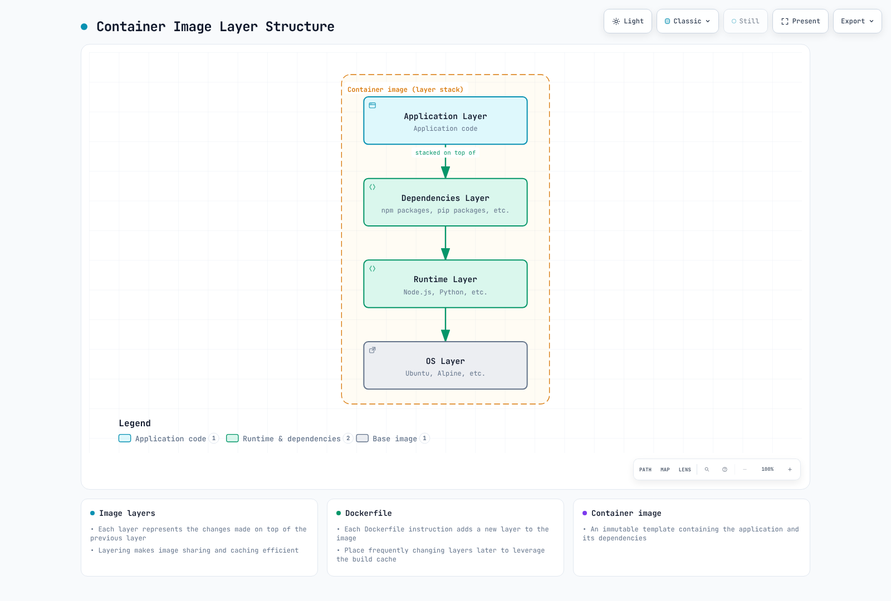

# Container Technology

> **Supported Versions**: Maintained Linux Docker/CRI releases; Kubernetes CRI v1; Node.js 24 build examples **Last Updated**: September 11, 2026

Containers are a technology that packages applications and their dependencies together, enabling consistent execution across various environments. This document explains the fundamental concepts of containers, how they work, and their relationship with Kubernetes.

## Table of Contents

* [What is a Container?](03-container-technology.md#what-is-a-container)
* [Container vs Virtual Machine](03-container-technology.md#container-vs-virtual-machine)
* [Technical Foundation of Containers](03-container-technology.md#technical-foundation-of-containers)
* [Container Runtime](03-container-technology.md#container-runtime)
* [Container Images](03-container-technology.md#container-images)
* [Dockerfile](03-container-technology.md#dockerfile)
* [Container Networking](03-container-technology.md#container-networking)
* [Container Storage](03-container-technology.md#container-storage)
* [Container Security](03-container-technology.md#container-security)
* [Container Lifecycle Management](03-container-technology.md#container-lifecycle-management)
* [Container Orchestration](03-container-technology.md#container-orchestration)
* [Containers on AWS](03-container-technology.md#containers-on-aws)

> Linux commands below assume a Linux Docker host. Docker Desktop runs its daemon in a VM, so host PID/filesystem paths cannot be inspected directly from the desktop OS. Images require compatible CPU architecture, OS and kernel features. VM-backed environments such as Kata/Fargate differ from the basic process-isolation model described here.

## What is a Container?

A container is a standardized unit of software that includes everything needed to run an application (code, runtime, system tools, system libraries, settings). Containers run in isolated environments while sharing the host operating system's kernel.

### Key Characteristics of Containers

1. **Portability**: Provides consistent execution environment across development, test, and production
2. **Lightweight**: Uses fewer resources than virtual machines
3. **Isolation**: Isolated execution environment from other containers and host system
4. **Fast Start and Stop**: Often starts quickly; image pulling and application initialization determine readiness
5. **Scalability**: Easy to replicate for horizontal scaling
6. **Version Control**: Application lifecycle management through image versioning

### History of Container Technology

* **Early 2000s**: Early container technologies like Linux VServer and OpenVZ emerge
* **2008**: Linux 2.6.24 releases the initial cgroups implementation
* **2008**: LXC (Linux Containers) project begins
* **2013**: Docker release popularizes container technology
* **2015**: Open Container Initiative (OCI) established, standardizing containers
* **2017**: containerd donated to CNCF project

## Container vs Virtual Machine

### Virtual Machine Architecture vs Container Architecture

### Key Differences

This is an architecture comparison, not a measured performance/startup benchmark. Image size, initialization and VM restore mechanisms affect results.

| Characteristic      | Container                        | Virtual Machine                                           |
| ------------------- | -------------------------------- | --------------------------------------------------------- |
| Size                | Application/userspace layers; varies             | Guest OS plus application; varies                                      |
| Startup Time        | Often fast once image is local                  | Depends on boot/restore strategy                                                   |
| Isolation Level     | Process-level isolation          | Hardware-level isolation                                  |
| OS                  | Shares host OS kernel            | Each VM requires full OS                                  |
| Performance         | Nearly native                    | Some overhead                                             |
| Security            | Shared kernel; hardening required | Hypervisor boundary; hardening still required                    |
| Resource Efficiency | High                             | Medium                                                    |
| Use Cases           | Microservices, CI/CD, dev/test   | Legacy apps, diverse OS requirements, high security needs |

## Technical Foundation of Containers

Containers are implemented using several Linux kernel features. These technologies were covered in detail in 01-linux-basics.md; here we focus on their relationship with containers.

### Isolation Through Namespaces

Containers use Linux namespaces to isolate processes. Namespace sharing is configurable; for example, containers in one Kubernetes Pod share a network namespace.

```bash
# Check container namespaces
docker inspect <container-id> | grep -A 10 "Pid"
ls -la /proc/<pid>/ns/

# Check processes inside container (isolated PID namespace)
docker exec <container-id> ps aux

# Check same process from host (actual PID)
ps aux | grep <process-name>
```

**Namespaces Used by Containers**:

* **PID**: Container has its own process tree (starting from PID 1)
* **Network**: Independent network stack (IP address, routing table, ports)
* **Mount**: Independent file system view
* **UTS**: Independent hostname
* **IPC**: Independent inter-process communication space
* **User**: Independent user ID mapping (optional)

### Resource Limiting Through cgroups

Containers use cgroups to limit and monitor resource usage.

```bash
# Run container with CPU limit
docker run --cpus=0.5 --memory=512m nginx

# Check container resource usage
docker stats <container-id>

# Check container cgroup settings
docker inspect <container-id> | grep -A 20 "Cgroup"

# On a Linux cgroup v2 host, inspect a running container's actual path.
CONTAINER_PID=$(docker inspect -f '{{.State.Pid}}' <container-id>)
if [ "$CONTAINER_PID" -gt 0 ]; then
  CGROUP_PATH=$(awk -F: '$1 == "0" {print $3}' "/proc/$CONTAINER_PID/cgroup")
  cat "/sys/fs/cgroup$CGROUP_PATH/cpu.max"
  cat "/sys/fs/cgroup$CGROUP_PATH/memory.max"
fi
```

**cgroup Resource Controls Used by Containers**:

* **CPU**: CPU time limiting and CPU core allocation
* **Memory**: Memory usage limiting and OOM behavior control
* **Block I/O**: Disk I/O bandwidth limiting
* **Network**: Traffic classification integrated with tc/eBPF
* **PIDs**: Process count limit within container

### Layer Management Through OverlayFS

Fresh Docker Engine 29.0+ installations default to the containerd image store and snapshotters. Upgrades may retain classic overlay2; inspect docker info. GraphDriver.Data paths are not available on every installation.

OCI images describe filesystem layers independently of the storage implementation. OverlayFS is a common Linux backend; runtimes may use other storage drivers or snapshotters.

```bash
# Check image layers
docker history <image-name>

# Check container file system layers
docker info --format '{{.Driver}} {{json .DriverStatus}}'
docker image inspect <image-name> --format '{{json .RootFS.Layers}}'

# Check OverlayFS mount information
mount | grep overlay
```

**OverlayFS Structure**:

* **LowerDir**: Read-only image layers (lower layer → upper layer)
* **UpperDir**: Read/write container layer
* **WorkDir**: OverlayFS working directory
* **MergedDir**: Unified view (file system seen by container)

### Lab: Understanding Container Technical Foundation

```bash
# 1. Run a simple container
docker run -d --name test-container nginx

# 2. Get container PID
CONTAINER_PID=$(docker inspect -f '{{.State.Pid}}' test-container)
echo "Container PID: $CONTAINER_PID"

# 3. Check container namespaces
ls -la /proc/$CONTAINER_PID/ns/

# 4. Check container cgroup
cat /proc/$CONTAINER_PID/cgroup

# 5. Check container file system layers
docker inspect test-container | jq '.[0].GraphDriver'

# 6. Cleanup
docker stop test-container
docker rm test-container
```

## Container Runtime

A container runtime is software that manages the lifecycle of containers. It runs container images, limits container resource usage, and configures networking and storage.

### Container Runtime Hierarchy

1. **Low-level Runtime (OCI Compatible)**
   * **runc**: Docker's default runtime, OCI standard implementation
   * **crun**: Lightweight OCI runtime written in C
   * **kata-containers**: Security-enhanced runtime using hardware virtualization
   * **gVisor**: Security runtime that emulates kernel functions in user space
2. **High-level Runtime**
   * **containerd**: Industry-standard container runtime separated from Docker
   * **CRI-O**: Lightweight runtime specifically designed for Kubernetes
   * **Docker Engine**: Most widely used container platform

### Kubernetes Container Runtime Interface (CRI)

Kubernetes integrates with various container runtimes through CRI (Container Runtime Interface). CRI provides a standardized interface between Kubernetes and container runtimes.

Kubernetes 1.26+ requires CRI v1. Use a supported containerd/CRI-O release and align its cgroup driver with kubelet. Docker Engine does not itself implement CRI; built-in dockershim was removed in 1.24. Docker Engine needs a separate CRI adapter such as cri-dockerd. OCI images built with Docker still work. CRI is the kubelet/runtime API contract, not necessarily a separately deployed middle service.

## Container Images

Container images are immutable templates containing applications and their dependencies. Images consist of multiple layers, each representing file system changes.

### Image Layers

Container images are composed of a stack of multiple layers. Each layer represents changes to the previous layer. This layering approach makes image sharing and caching efficient.



[🔍 View interactive diagram](https://www.atomai.click/kubernetes-docs/archmaps/en-basics-03-container-technology-0.html)

### Image Registries

Container images are stored and shared in registries. Major registries include:

* **Docker Hub**: Largest public registry
* **Amazon ECR**: AWS container registry service
* **Google Artifact Registry**: Current Google Cloud registry; Container Registry shut down in 2025, while gcr.io repositories backed by Artifact Registry remain supported.
* **Azure Container Registry**: Microsoft Azure registry
* **GitHub Container Registry**: GitHub container registry
* **Harbor**: Open-source enterprise-grade registry

### Image Tags and Digests

* **Tag**: Human-readable mutable reference; it can be reassigned unless registry immutability is enforced (e.g., `nginx:1.30.4`)
* **Digest**: Content digest of an image manifest or multi-platform index (commonly SHA256); it references config/layer digests (e.g., `nginx@sha256:2834dc507516af02784808c5f48b7cbe38b8ed5d0f4837f16e78d00deb7e7767`)

## Dockerfile

A Dockerfile is a text file containing instructions for building a container image. Filesystem-changing instructions can create layers; ENV, CMD and other metadata-only instructions do not add a filesystem diff.

### Key Dockerfile Instructions

```dockerfile
FROM node:24-alpine
WORKDIR /app
ENV NODE_ENV=production
# Requires a committed package-lock.json matching package.json.
COPY package.json package-lock.json ./
RUN npm ci --omit=dev
COPY --chown=node:node . .
RUN mkdir -p /app/data && chown node:node /app/data
USER node
EXPOSE 3000
VOLUME /app/data
CMD ["node", "server.js"]
```

Node.js 14 is end-of-life; these examples use the supported Node.js 24 line. Check Alpine musl compatibility for native modules. Prepare .dockerignore so host node_modules or credentials are not copied into the image. EXPOSE is metadata and does not publish a port; publishing needs docker run -p or orchestrator configuration.

```text
# .dockerignore
node_modules
.git
.env
.env.*
npm-debug.log
```

### Multi-stage Builds

Multi-stage builds use multiple build stages to reduce final image size.

```dockerfile
FROM node:24 AS build
WORKDIR /app
COPY package.json package-lock.json ./
RUN npm ci
COPY . .
RUN npm run build

FROM nginx:1.30.4-alpine
# This example assumes a static build written to dist/.
COPY --from=build /app/dist /usr/share/nginx/html
EXPOSE 80
CMD ["nginx", "-g", "daemon off;"]
```

### Image Optimization Techniques

1. **Choose appropriate base image**: Use lightweight images like Alpine
2. **Use multi-stage builds**: Exclude build tools and intermediate files
3. **Optimize layer contents and cache**: Combine package installation/cleanup in one RUN; fewer layers alone do not guarantee a smaller image.
4. **Exclude unnecessary files**: Use .dockerignore file
5. **Leverage cache**: Place frequently changing layers later

## Container Networking

Container networking enables communication between containers and between containers and the outside world.

### Network Drivers

Docker provides various network drivers:

1. **bridge**: Default network driver, communication between containers on the same host
2. **host**: Shares the host network namespace; other container isolation still applies
3. **overlay**: Container communication across multiple hosts
4. **macvlan**: Assigns MAC address to container, appears as physical network device
5. **none**: Leaves only loopback networking

### Port Mapping

Map container internal ports to host ports for external access.

```bash
# Map host port 8080 to container port 80
docker run -p 8080:80 nginx
```

Port publishing binds all host addresses by default. Use `-p 127.0.0.1:8080:80` for a local-only lab.

### Container-to-Container Communication

1. **Same network**: Containers on the same user-defined bridge can resolve each other by name; the default bridge lacks automatic name DNS
2. **Links**: Legacy method, direct link setup between containers
3. **External network**: Communication through host ports

## Container Storage

A Docker container’s writable layer survives stop/start but is removed with that container. Keep durable data in volumes or other external storage.

### Storage Types

1. **Ephemeral storage**: Container internal file system, data lost when container is deleted
2. **Volumes**: Host file system areas managed by Docker
3. **Bind mounts**: Mount specific host paths to container
4. **tmpfs mounts**: Memory-backed temporary storage; pages may be swapped to disk

### Volume Usage Examples

```bash
# Create volume
docker volume create my-vol

# Run container using volume
docker run -v my-vol:/app/data nginx

# Use bind mount
docker run -v /host/path:/container/path nginx

# Read-only mount
docker run -v /host/path:/container/path:ro nginx
```

### Data Sharing Patterns

1. **Volume sharing**: Multiple containers use the same volume
2. **Data volume container**: Create container containing only data, then share
3. **External storage integration**: Use external storage systems like AWS EBS, NFS

## Container Security

Container security must be considered at multiple layers including images, container runtime, and host systems.

### Image Security

1. **Vulnerability scanning**: Scan images for vulnerabilities with tools like Trivy, Clair
2. **Trusted base images**: Use official or verified images
3. **Principle of least privilege**: Include only necessary packages and permissions
4. **Image signing**: Use a maintained image-signing workflow such as Cosign. Docker Content Trust is being retired; Docker’s Notary v1 service is scheduled to shut down on December 8, 2026.

### Runtime Security

1. **Privilege restriction**: Run containers as non-root user
2. **Capabilities restriction**: Grant only necessary Linux capabilities
3. **seccomp profiles**: Restrict system calls
4. **AppArmor/SELinux**: Apply mandatory access controls
5. **Read-only file system**: Mount file system as read-only when possible

### Security Best Practices

1. **Regular updates**: Regularly update container images and host systems
2. **Network isolation**: Restrict container communication with appropriate network policies
3. **Secret management**: Use the platform’s secret mechanism or an external secret manager. Docker Swarm secrets apply to services, not standalone docker run containers; Compose file secrets have different guarantees.
4. **Resource limits**: Limit CPU, memory, and other resource usage
5. **Monitoring and logging**: Monitor container activity and centralize logs

## Container Lifecycle Management

Understanding the complete container lifecycle is essential for effective container operations.

### Container States

Containers can have several states:

* **Created**: Container created but not yet started
* **Running**: Container is running
* **Paused**: Linux processes are frozen with the freezer cgroup
* **Restarting**: Container is restarting
* **Exited**: Container has terminated
* **Removing**: Container removal is in progress
* **Dead**: Partially removed/defunct container; cannot restart and needs cleanup

```bash
# Check container status
docker ps -a

# Detailed status of specific container
docker inspect <container-id> | jq '.[0].State'

# Container state transitions
docker create nginx  # Created state
docker start <container-id>  # Transition to Running state
docker pause <container-id>  # Transition to Paused state
docker unpause <container-id>  # Return to Running state
docker stop <container-id>  # Transition to Exited state
docker rm <container-id>  # Remove container
```

### Creating and Running Containers

```bash
# Create container only (don't start)
docker create --name my-nginx nginx

# Start container
docker start my-nginx

# Create and start container (all at once)
docker run --name my-nginx2 -d nginx

# Run in interactive mode
docker run -it ubuntu bash

# Run in background
docker run -d nginx

# Auto-remove when container exits
docker run --rm nginx

# Run with environment variables
docker run -e "DB_HOST=localhost" -e "DB_PORT=5432" myapp

# Run with port mapping
docker run -p 8080:80 nginx

# Run with volume mount
docker run -v /host/path:/container/path nginx
```

### Controlling Containers

```bash
# List running containers
docker ps

# List all containers (including stopped)
docker ps -a

# Stop with configured signal (default SIGTERM), then SIGKILL after timeout
docker stop <container-id>

# Force kill container (SIGKILL)
docker kill <container-id>

# Restart container
docker restart <container-id>

# Pause container
docker pause <container-id>

# Resume container
docker unpause <container-id>

# Execute command in running container
docker exec -it <container-id> bash
docker exec <container-id> ls -la /app

# Copy files from/to container
docker cp <container-id>:/path/to/file /local/path
docker cp /local/path <container-id>:/path/to/file
```

### Container Logging and Monitoring

```bash
# View container logs
docker logs <container-id>

# Stream real-time logs
docker logs -f <container-id>

# Last N log lines
docker logs --tail 100 <container-id>

# Output logs with timestamps
docker logs -t <container-id>

# Logs since specific time
docker logs --since "2025-11-24T10:00:00" <container-id>

# Check container resource usage
docker stats <container-id>

# All container resource usage
docker stats

# Check container processes
docker top <container-id>

# Container detailed information
docker inspect <container-id>
```

### Cleaning Up Containers

```bash
# Remove all stopped containers
docker container prune

# Remove stopped containers, unused networks, dangling images and build cache; no volumes
docker system prune

# Additionally prune unused anonymous volumes; running resources are not removed
docker system prune --volumes

# Check disk usage
docker system df

# Remove image
docker rmi <image-id>

# Remove dangling images; -a includes all unused images
docker image prune

# Remove volume
docker volume rm <volume-name>

# Remove unused anonymous volumes; --all includes unused named volumes
docker volume prune

# Remove network
docker network rm <network-name>

# Remove unused networks
docker network prune
```

### Health Checks

HEALTHCHECK records Docker health status. Standalone Docker restart policies react to process exit, not health status alone. Kubernetes ignores Dockerfile HEALTHCHECK and uses liveness/readiness/startup probes.

```dockerfile
FROM nginx:1.30.4-alpine

# Define health check in Dockerfile
HEALTHCHECK --interval=30s --timeout=3s --start-period=5s --retries=3 \
  CMD wget -q -O /dev/null http://127.0.0.1/ || exit 1
```

```bash
# Define health check at runtime
docker run -d \
  --health-cmd="wget -q -O /dev/null http://127.0.0.1/ || exit 1" \
  --health-interval=30s \
  --health-timeout=3s \
  --health-retries=3 \
  nginx:1.30.4-alpine

# Check health check status
docker inspect <container-id> | jq '.[0].State.Health'
```

### Restart Policies

Configure containers to automatically restart when they exit.

```bash
# Restart policy options
# - no: Don't restart (default)
# - on-failure: Restart only on failure
# - always: Restart after exit; manual stop suppresses it until daemon restart or explicit start
# - unless-stopped: Always restart unless explicitly stopped

# Restart on failure (max 3 times)
docker run -d --restart=on-failure:3 nginx

# Always restart
docker run -d --restart=always nginx

# Restart unless explicitly stopped
docker run -d --restart=unless-stopped nginx

# Change restart policy of existing container
docker update --restart=always <container-id>
```

### Debugging Containers

bash/ip/netstat/ps must be installed in the image. For minimal images, use host-side docker inspect/top or an approved debug image. env/inspect output may contain secrets; do not paste it into shared logs.

```bash
# Explore container internal file system
docker exec -it <container-id> bash

# Check container environment variables
docker exec <container-id> env

# Check container network information
docker exec <container-id> ip addr
docker exec <container-id> netstat -tuln

# Check container processes
docker exec <container-id> ps aux

# Monitor container events
docker events

# Filter specific container events
docker events --filter container=<container-id>

# Check container changes (compared to image)
docker diff <container-id>
```

## Container Orchestration

Container orchestration is the process of managing and coordinating multiple containers. Key features include deployment management, scaling, networking, and service discovery.

### Major Orchestration Tools

1. **Kubernetes**: Most widely used container orchestration platform
2. **Docker Swarm**: Docker's built-in orchestration tool, simple configuration
3. **Amazon ECS**: AWS container orchestration service
4. **HashiCorp Nomad**: Supports both container and non-container workloads

### Key Features of Orchestration

1. **Automated deployment and rollback**: Application deployment management through declarative configuration
2. **Service discovery and load balancing**: Container communication and load distribution
3. **Auto-scaling**: Adjust container count based on load
4. **Self-healing**: Automatically restart failed containers
5. **Configuration management**: Application configuration and secret management
6. **Storage orchestration**: Persistent storage management
7. **Batch execution**: One-time and cron job execution

## Containers on AWS

AWS provides various services for container workloads.

### Amazon ECS (Elastic Container Service)

AWS's own container orchestration service that can run containers on EC2 instances or AWS Fargate.

**Key Features**:

* Tight integration with AWS services
* Serverless container execution (Fargate)
* Simple configuration and management
* Auto-scaling and load balancing

### Amazon EKS (Elastic Kubernetes Service)

AWS-managed Kubernetes service that allows running Kubernetes on AWS infrastructure using standard Kubernetes APIs.

**Key Features**:

* Managed Kubernetes control plane
* High availability across multiple availability zones
* Integration with AWS services
* EC2 and Fargate support

### AWS Fargate

Serverless container execution environment that allows running containers without managing servers.

**Key Features**:

* No server management needed
* Billing uses requested task resources (ECS) or Pod resources (EKS), not a separate fee per application container
* Integration with ECS and EKS
* Security isolation

### Amazon ECR (Elastic Container Registry)

AWS's managed container image registry service.

**Key Features**:

* Image vulnerability scanning
* Integration with IAM
* Image lifecycle management
* High availability and scalability

## Glossary

| Term                  | Description                                                                                                                   |
| --------------------- | ----------------------------------------------------------------------------------------------------------------------------- |
| **Container**         | A standardized software unit that packages an application with its dependencies, enabling consistent execution anywhere.      |
| **Image**             | A read-only template used to create containers, containing application code, libraries, dependencies, tools, and other files. |
| **Dockerfile**        | A text file containing instructions for building a container image.                                                           |
| **Registry**          | A repository that stores and distributes container images. (e.g., Docker Hub, Amazon ECR)                                     |
| **Container Runtime** | Software that runs containers. (e.g., Docker, containerd, CRI-O)                                                              |
| **Namespace**         | A Linux kernel feature that isolates processes so they cannot see other parts of the system.                                  |
| **cgroups**           | A Linux kernel feature that limits and monitors resource usage (CPU, memory, etc.) of process groups.                         |
| **Layer**             | Container images consist of multiple layers, representing filesystem diffs; metadata-only instructions need no filesystem layer.                                  |
| **Volume**            | A mechanism for persistently storing container data.                                                                          |
| **Orchestration**     | The process of automating the deployment, management, scaling, and networking of multiple containers.                         |
| **ECS**               | Amazon Elastic Container Service, AWS's container orchestration service.                                                      |
| **ECR**               | Amazon Elastic Container Registry, AWS's container image registry service.                                                    |
| **Fargate**           | AWS's serverless container execution environment that runs containers without infrastructure management.                      |

## Conclusion

Container technology has revolutionized how applications are developed and deployed. It provides portability, consistency, and efficiency, improving developer productivity and reducing operational complexity. Combined with orchestration tools like Kubernetes, large-scale distributed applications can be managed effectively.

Understanding the basic concepts and operation of containers is essential for developing and operating modern cloud-native applications. This knowledge forms the foundation for effectively utilizing Kubernetes.

## Quiz

To test what you've learned in this chapter, take the [Container Technology Quiz](../quizzes/basics/03-container-technology-quiz.md).

## References

* [Docker Official Documentation](https://docs.docker.com/)
* [OCI (Open Container Initiative)](https://opencontainers.org/)
* [containerd Project](https://containerd.io/)
* [Kubernetes Container Runtime Overview](https://kubernetes.io/docs/setup/production-environment/container-runtimes/)
* [AWS Container Services](https://aws.amazon.com/containers/)

## Verification References

- https://kubernetes.io/docs/setup/production-environment/container-runtimes/
- https://docs.docker.com/reference/cli/docker/container/pause/
- https://docs.docker.com/reference/cli/docker/container/ls/
- https://docs.docker.com/engine/containers/start-containers-automatically/
- https://docs.docker.com/reference/cli/docker/system/prune/
- https://docs.docker.com/reference/cli/docker/volume/prune/
- https://docs.docker.com/reference/dockerfile/
- https://docs.docker.com/engine/network/drivers/bridge/
- https://docs.docker.com/engine/storage/containerd/
- https://docs.docker.com/engine/storage/tmpfs/
- https://docs.docker.com/engine/security/trust/
- https://docs.docker.com/engine/swarm/secrets/
- https://github.com/opencontainers/image-spec/blob/main/config.md
- https://github.com/opencontainers/image-spec/blob/main/manifest.md
- https://github.com/nodejs/Release/blob/main/schedule.json
- https://github.com/docker-library/official-images/blob/master/library/node
- https://github.com/nodejs/docker-node/blob/main/docs/BestPractices.md
- https://github.com/npm/cli/blob/latest/docs/lib/content/commands/npm-ci.md
- https://cloud.google.com/artifact-registry/docs/transition/transition-from-gcr
- https://man7.org/linux/man-pages/man7/cgroups.7.html
- https://github.com/torvalds/linux/releases/tag/v2.6.24
- https://docs.aws.amazon.com/eks/latest/userguide/fargate.html
- https://docs.aws.amazon.com/AmazonECS/latest/developerguide/AWS_Fargate.html
- https://aws.amazon.com/fargate/pricing/
