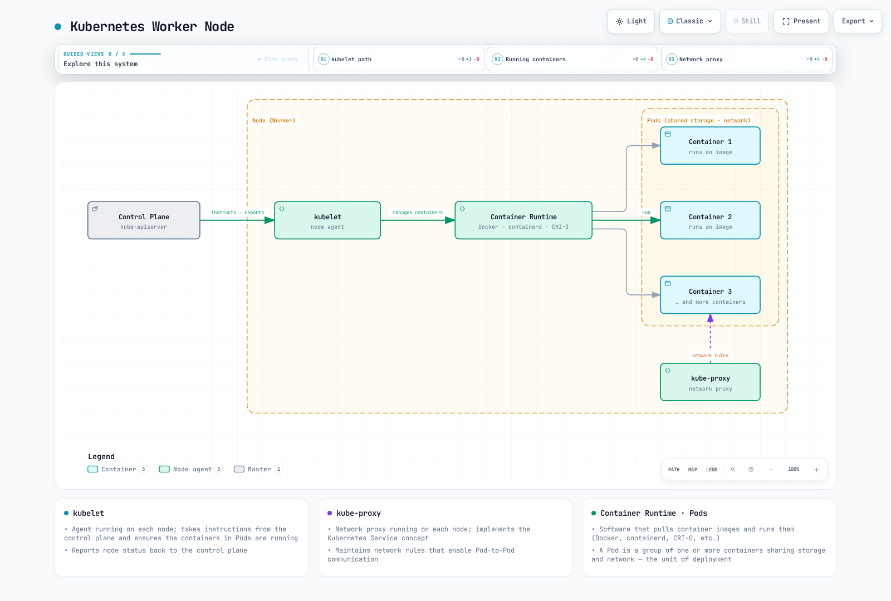
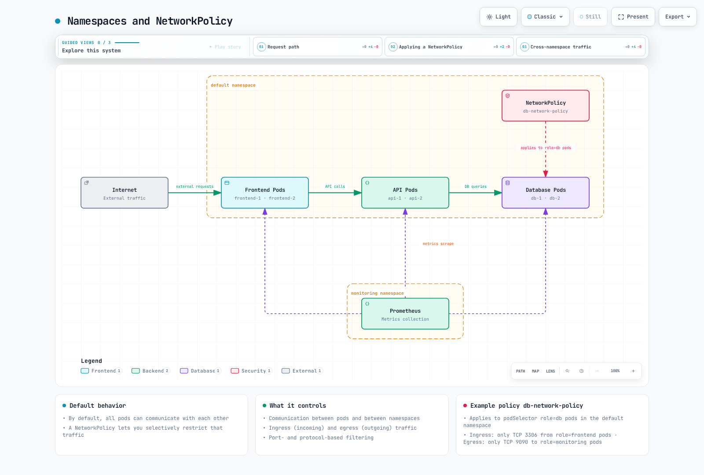
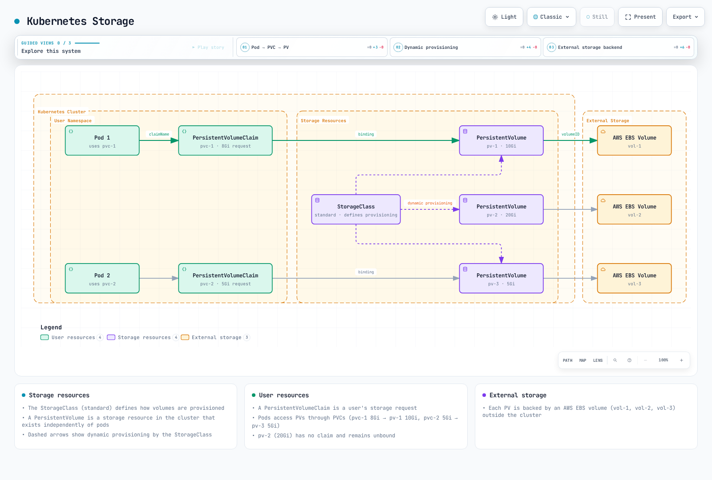

# Introduction to Kubernetes

> **Supported Versions**: Upstream Kubernetes 1.35, 1.36, 1.37; EKS standard support 1.34–1.36 (2026-09-11) **Last Updated**: September 11, 2026

Kubernetes (K8s) is an open-source container orchestration platform that automates the deployment, scaling, and management of containerized applications. This document explains the basic concepts, architecture, main components, and features of Kubernetes.

These independent learning examples were reviewed statically against schemas and official documentation. They are not production configurations validated by deployment. Verify custom images, names/labels, TLS, IAM/RBAC, CNI and storage prerequisites in the target environment and replace placeholders.

## Lab Environment Setup

To follow along with the examples in this document, you will need the following tools and environment:

### Required Tools

* **kubectl**: Command-line tool for interacting with Kubernetes clusters
* **Local cluster driver**: A container engine or VM driver supported by minikube/kind; Kubernetes nodes use a CRI v1 runtime.
* **minikube** or **kind**: Local Kubernetes cluster (for development and learning)

### Installation Methods

**kubectl Installation**:

```bash
# macOS: use a kubectl version within one minor of the API server.
brew install kubectl
```

```bash
# Linux: select an explicit compatible version and architecture.
set -euo pipefail
: "${KUBECTL_VERSION:?Set a cluster-compatible version, e.g. v1.37.0}"
case "$(uname -m)" in
  x86_64) KUBECTL_ARCH=amd64 ;;
  aarch64|arm64) KUBECTL_ARCH=arm64 ;;
  *) echo "Choose a supported kubectl architecture" >&2; exit 1 ;;
esac
curl --fail --location --output kubectl "https://dl.k8s.io/release/$KUBECTL_VERSION/bin/linux/$KUBECTL_ARCH/kubectl"
curl --fail --location --output kubectl.sha256 "https://dl.k8s.io/release/$KUBECTL_VERSION/bin/linux/$KUBECTL_ARCH/kubectl.sha256"
echo "$(cat kubectl.sha256)  kubectl" | sha256sum --check
sudo install -m 0755 kubectl /usr/local/bin/kubectl
```

```powershell
$ErrorActionPreference = "Stop"
$KubectlVersion = Read-Host "Cluster-compatible kubectl version (vX.Y.Z)"
$KubectlArch = Read-Host "Architecture (amd64 or arm64)"
if ($KubectlVersion -notmatch '^v\d+\.\d+\.\d+$' -or $KubectlArch -notin @('amd64','arm64')) { throw "Invalid version/architecture" }
$BaseUrl = "https://dl.k8s.io/release/$KubectlVersion/bin/windows/$KubectlArch"
Invoke-WebRequest "$BaseUrl/kubectl.exe" -OutFile kubectl.exe
Invoke-WebRequest "$BaseUrl/kubectl.exe.sha256" -OutFile kubectl.exe.sha256
if ((Get-FileHash kubectl.exe -Algorithm SHA256).Hash -ne (Get-Content kubectl.exe.sha256).Trim()) { throw "Checksum mismatch" }
# Move the verified binary to a directory included in PATH.
```

**minikube Installation**:

Use minikube’s official start guide to select the binary, checksum and driver for your OS/architecture. Run Linux and Windows instructions in their respective shells and add the verified binary to PATH. For macOS:

```bash
brew install minikube
minikube version
```

### Starting a Local Cluster

```bash
minikube start
```

## Table of Contents

* [What is Kubernetes?](04-kubernetes-introduction.md#what-is-kubernetes)
* [History of Kubernetes](04-kubernetes-introduction.md#history-of-kubernetes)
* [Kubernetes Architecture](04-kubernetes-introduction.md#kubernetes-architecture)
* [Kubernetes Main Components](04-kubernetes-introduction.md#kubernetes-main-components)
* [Kubernetes Basic Objects](04-kubernetes-introduction.md#kubernetes-basic-objects)
* [Kubernetes Workload Resources](04-kubernetes-introduction.md#kubernetes-workload-resources)
* [Kubernetes Services and Networking](04-kubernetes-introduction.md#kubernetes-services-and-networking)
* [Kubernetes Storage](04-kubernetes-introduction.md#kubernetes-storage)
* [Kubernetes Configuration and Security](04-kubernetes-introduction.md#kubernetes-configuration-and-security)
* [Kubernetes vs Amazon EKS](04-kubernetes-introduction.md#kubernetes-vs-amazon-eks)
* [Getting Started with Kubernetes](04-kubernetes-introduction.md#getting-started-with-kubernetes)

## What is Kubernetes?

Kubernetes means 'helmsman' or 'pilot' in Greek and is an open-source system that automates the deployment, scaling, and operation of containerized applications. It was inspired by Google's internal Borg system and was released as open source in 2014.

### Key Features of Kubernetes

1. **Service Discovery and Load Balancing**: Expose containers externally and distribute traffic
2. **Storage Orchestration**: Automatically mount local or cloud storage systems
3. **Rollouts and Rollbacks**: Gradually update applications and support operator/tool-triggered rollback; a failed Deployment does not automatically roll back.
4. **Automatic Bin Packing**: Place containers on nodes based on resource requirements
5. **Self-healing**: Restart failed containers and replace unresponsive containers
6. **Secret and Configuration Management**: Store sensitive information and update configuration
7. **Horizontal Scaling**: Scale applications through simple commands or UI
8. **Batch Execution**: Manage batch and CI workloads

### Problems Kubernetes Solves

* **Container Orchestration**: Efficiently manage hundreds or thousands of containers
* **High Availability**: Supports resilient application design with replicas, placement, probes and capacity
* **Scalability**: Auto scaling based on traffic increase
* **Recovery**: Reconciles failed workloads; disaster recovery also requires tested backups and restore plans
* **Resource Efficiency**: Efficiently utilize hardware resources
* **Declarative Configuration**: Manage infrastructure as code
* **Multi-cloud and Hybrid Cloud**: Consistent deployment and management across various environments

## History of Kubernetes

### Background

* **2003-2013**: Google internally used a container orchestration system called Borg
* **June 2014**: Google released Kubernetes as open source
* **July 2015**: Kubernetes 1.0 released and donated to Cloud Native Computing Foundation (CNCF)
* **2016-2017**: Major cloud providers launched managed Kubernetes services
* **2018 and beyond**: Established as the de facto standard for container orchestration

### Origin of the Name

Kubernetes (κυβερνήτης) means 'helmsman' or 'pilot' in Greek. This symbolizes its role in guiding containerized applications. The abbreviation K8s is used because there are 8 characters between 'K' and 's'.

### Meaning of the Logo

The Kubernetes logo depicts a helm (ship's steering wheel) with 7 spokes, symbolizing Kubernetes' role in guiding the course of containerized applications.

## Kubernetes Architecture

Kubernetes follows a master-node architecture. Master nodes (control plane) manage the cluster, and worker nodes run the actual application workloads.

### Control Plane (Master) Components


[🔍 View interactive diagram](https://www.atomai.click/kubernetes-docs/archmaps/en-basics-04-kubernetes-introduction-0.html)

1. **kube-apiserver**: Frontend of the control plane that exposes the Kubernetes API
2. **etcd**: Consistent and highly available key-value store for Kubernetes API objects and cluster state (not application volume contents)
3. **kube-scheduler**: Component that assigns pods to nodes
4. **kube-controller-manager**: Component that runs controller processes
   * Node Controller: Notification and response when nodes go down
   * Replication Controller: Maintains correct number of pod replicas
   * EndpointSlice Controller: Maintains Service endpoint records (legacy Endpoints is deprecated)
   * ServiceAccount controller creates default accounts; projected Pod tokens use TokenRequest and kubelet rotation
5. **cloud-controller-manager**: Component containing cloud-specific control logic
   * Node Controller: Checks with cloud provider if node has been deleted
   * Route Controller: Sets up routes in cloud infrastructure
   * Service Controller: Creates, updates, deletes cloud provider load balancers

### Node Components



[🔍 View interactive diagram](https://www.atomai.click/kubernetes-docs/archmaps/en-basics-04-kubernetes-introduction-1.html)

1. **kubelet**: Agent running on each node that ensures containers in pods are running
2. **kube-proxy**: Network proxy running on each node that implements the Kubernetes Service concept
3. **Container Runtime**: Software implementing CRI v1, such as containerd or CRI-O; Docker Engine requires a separate CRI adapter

### Full Architecture


[🔍 View interactive diagram](https://www.atomai.click/kubernetes-docs/archmaps/en-basics-04-kubernetes-introduction-2.html)

## Kubernetes Main Components

### API Server (kube-apiserver)

The API server is the frontend of the control plane that exposes the Kubernetes API. Kubernetes API requests pass through it; application traffic and storage I/O do not flow through the API server.

**Key Functions**:

* Provides REST API
* Authentication and authorization
* Request validation
* Communication with etcd
* Horizontally scalable

### etcd

etcd is a consistent and highly available key-value store that stores Kubernetes API objects and cluster state (not application volume contents).

**Key Features**:

* Distributed system
* Strong consistency
* High availability
* Secure data storage
* Watch feature for monitoring changes

### Scheduler (kube-scheduler)

The scheduler is a control plane component that selects nodes to run newly created pods.

**Scheduling Process**:

1. **Filtering**: Identify nodes that can run the pod
2. **Scoring**: Assign scores to suitable nodes
3. **Binding**: Assign pod to optimal node

**Considerations**:

* Resource requirements (CPU, memory)
* Hardware/software/policy constraints
* Affinity/anti-affinity specifications
* Data locality
* Workload interference

### Controller Manager (kube-controller-manager)

The controller manager is a control plane component that runs multiple controller processes.

**Main Controllers**:

* **Node Controller**: Monitor and respond to node state
* **Replication Controller**: Maintain pod replica count
* **EndpointSlice Controller**: Maintains Service endpoint records (legacy Endpoints is deprecated)
* **ServiceAccount controller**: Creates default accounts; modern Pod tokens are requested through TokenRequest and rotated by kubelet
* **Job Controller**: Manage one-time tasks
* **CronJob Controller**: Manage scheduled tasks
* **DaemonSet Controller**: Reconcile a Pod on each eligible node
* **StatefulSet Controller**: Manage stateful applications
* **PV Controller**: Manage persistent volumes

### Cloud Controller Manager (cloud-controller-manager)

The cloud controller manager contains cloud-specific control logic. CSI controller sidecars/drivers and kubelet/node plugins handle storage provisioning, attachment and mounting; this is not a CCM volume controller.

**Main Controllers**:

* **Node Controller**: Check node state through cloud provider API
* **Route Controller**: Set up routes in cloud environment
* **Service Controller**: Create, update, delete cloud load balancers

### kubelet

kubelet is an agent running on each node that ensures containers in pods are running.

**Key Functions**:

* Run containers according to PodSpec
* Report container status
* Perform container health checks
* Manage container lifecycle
* Report node status

### kube-proxy

kube-proxy is a network proxy running on each node that implements the Kubernetes Service concept.

**Key Functions**:

* Maintain network rules for service IPs and ports
* Forward connections
* Implement load balancing

**Operating Modes**:

* **nftables mode**: Stable since 1.33; verify kernel and network-plugin compatibility
* **iptables mode**: NAT implementation using Linux iptables (default)
* **IPVS mode**: Deprecated since 1.35; plan migration. The historical userspace mode was removed.

## Kubernetes Basic Objects

Kubernetes objects are persistent entities that represent the state of the cluster. These objects describe running applications, available resources, policies, etc. in the cluster.

### Pod

A Pod is the smallest deployable unit in Kubernetes, representing a group of one or more containers. Containers in a Pod share networking and can share explicitly mounted volumes; they run on the same node. They do not automatically share their root filesystems.

**Key Features**:

* Has unique IP address
* Shared network namespace (same IP and port space)
* Shared IPC namespace
* Shared hostname
* Localhost communication between containers possible

**Pod Example**:

```yaml
apiVersion: v1
kind: Pod
metadata:
  name: nginx-pod
  labels:
    app: nginx
spec:
  containers:
  - name: nginx
    image: nginx:1.30.4
    ports:
    - containerPort: 80
    volumeMounts:
    - name: logs
      mountPath: /var/log/nginx
  - name: log-sidecar
    image: busybox:1.37.0
    command:
    - /bin/sh
    - -c
    - until [ -f /var/log/nginx/access.log ]; do sleep 1; done; tail -F /var/log/nginx/access.log
    volumeMounts:
    - name: logs
      mountPath: /var/log/nginx
      readOnly: true
  volumes:
  - name: logs
    emptyDir: {}
```

### Namespace

Namespaces provide a way to isolate resource groups within a single cluster. This helps organize teams/projects; namespaces alone do not enforce network or authorization isolation.

**Default Namespaces**:

* **default**: Default namespace
* **kube-system**: Namespace for objects created by the Kubernetes system
* **kube-public**: Namespace conventionally used for public information; actual object access still depends on RBAC
* **kube-node-lease**: Namespace for node heartbeats

**Namespace Example**:

```yaml
apiVersion: v1
kind: Namespace
metadata:
  name: development
```

### Labels and Selectors

Labels are key-value pairs attached to objects, used to identify and select objects. Selectors provide a way to filter objects based on labels.

**Labels Example**:

```yaml
metadata:
  labels:
    app: nginx
    environment: production
    tier: frontend
```

**Selector Types**:

* **Equality-based**: `=`, `!=`
* **Set-based**: `in`, `notin`, `exists`

**Selector Example**:

```yaml
selector:
  matchLabels:
    app: nginx
  matchExpressions:
    - {key: tier, operator: In, values: [frontend, middleware]}
    - {key: environment, operator: NotIn, values: [dev]}
```

### Annotations

Annotations are key-value pairs that store non-identifying metadata about objects. Annotations are useful for storing information used by tools or libraries.

**Annotations Example**:

```yaml
metadata:
  annotations:
    example.com/created-by: "admin"
    example.com/last-modified: "2023-07-01T12:00:00Z"
    prometheus.io/scrape: "true"
    prometheus.io/port: "9090"
```

### Node

A node is a worker machine in a Kubernetes cluster that runs pods. A node can be a physical or virtual machine.

**Node Status**:

* **Addresses**: Hostname, Internal IP, External IP
* **Conditions**: Ready, DiskPressure, MemoryPressure, PIDPressure, NetworkUnavailable
* **Capacity**: CPU, Memory, Maximum pods
* **Info**: Kernel version, Container runtime version, kubelet version

**Illustrative Node status (reported by the node/controllers, not a node-provisioning manifest)**:

```yaml
apiVersion: v1
kind: Node
metadata:
  name: worker-1
  labels:
    kubernetes.io/hostname: worker-1
    node-role.kubernetes.io/worker: ""
    topology.kubernetes.io/zone: us-east-1a
status:
  capacity:
    cpu: "4"
    memory: 8Gi
    pods: "110"
  conditions:
    - type: Ready
      status: "True"
  # ...
```

## Kubernetes Workload Resources

Workload resources are objects used to manage and run pods. These resources manage the creation, scaling, updates, and termination of pods.

### ReplicaSet

A ReplicaSet reconciles a desired count of Pod objects; readiness also depends on capacity, valid configuration and the application. If pods fail or are deleted, the ReplicaSet automatically creates replacement pods.

**Key Functions**:

* Maintain specified number of pod replicas
* Define pod template
* Identify pods through selectors

**ReplicaSet Example**:

```yaml
apiVersion: apps/v1
kind: ReplicaSet
metadata:
  name: nginx-replicaset
  labels:
    app: nginx
spec:
  replicas: 3
  selector:
    matchLabels:
      app: nginx
  template:
    metadata:
      labels:
        app: nginx
    spec:
      containers:
      - name: nginx
        image: nginx:1.30.4
        ports:
        - containerPort: 80
```

### Deployment

A Deployment abstracts ReplicaSets one level further, providing declarative updates for applications. Deployments provide features like rolling updates, rollbacks, and scaling.

**Key Functions**:

* Declarative application updates
* Rolling updates and rollbacks
* Deployment history management
* Scaling

**Deployment Example**:

```yaml
apiVersion: apps/v1
kind: Deployment
metadata:
  name: nginx-deployment
  labels:
    app: nginx
spec:
  replicas: 3
  selector:
    matchLabels:
      app: nginx
  strategy:
    type: RollingUpdate
    rollingUpdate:
      maxSurge: 1
      maxUnavailable: 0
  template:
    metadata:
      labels:
        app: nginx
    spec:
      containers:
      - name: nginx
        image: nginx:1.30.4
        ports:
        - containerPort: 80
        resources:
          requests:
            cpu: 100m
            memory: 128Mi
          limits:
            cpu: 200m
            memory: 256Mi
        livenessProbe:
          httpGet:
            path: /
            port: 80
          initialDelaySeconds: 30
          periodSeconds: 10
        readinessProbe:
          httpGet:
            path: /
            port: 80
          initialDelaySeconds: 5
          periodSeconds: 5
```

The MySQL example is a single persistent instance. StatefulSet does not configure database replication, failover or backups. First provide mysql-secret/password and replace the StorageClass placeholder. Increasing replicas alone creates independent databases; HA needs a tested database operator/replication setup.

### StatefulSet

A StatefulSet is a workload resource for applications that require state maintenance. It assigns unique identifiers to each pod and provides stable network identifiers and persistent storage.

**Key Functions**:

* Stable and unique network identifiers
* Stable and persistent storage
* Sequential deployment and scaling
* Sequential updates

**StatefulSet Example**:

```yaml
apiVersion: v1
kind: Service
metadata:
  name: mysql
spec:
  clusterIP: None
  selector:
    app: mysql
  ports:
  - name: mysql
    port: 3306
    targetPort: 3306
---
apiVersion: apps/v1
kind: StatefulSet
metadata:
  name: mysql
spec:
  selector:
    matchLabels:
      app: mysql
  serviceName: mysql
  replicas: 1
  template:
    metadata:
      labels:
        app: mysql
        role: db
    spec:
      containers:
      - name: mysql
        image: mysql:8.4
        env:
        - name: MYSQL_ROOT_PASSWORD
          valueFrom:
            secretKeyRef:
              name: mysql-secret
              key: password
        ports:
        - containerPort: 3306
          name: mysql
        volumeMounts:
        - name: data
          mountPath: /var/lib/mysql
        readinessProbe:
          tcpSocket:
            port: 3306
          initialDelaySeconds: 10
          periodSeconds: 5
  volumeClaimTemplates:
  - metadata:
      name: data
    spec:
      accessModes:
      - ReadWriteOnce
      storageClassName: replace-with-storage-class
      resources:
        requests:
          storage: 10Gi
```

The Linux Fluent Bit example sends CRI logs to stdout for demonstration. It excludes its own logs to prevent a feedback loop and persists its position DB separately. Do not deploy alongside another collector that republishes the same logs to stdout. Production needs an external destination and reviewed host paths, permissions and PSS exceptions.

### DaemonSet

A DaemonSet creates a Pod on each eligible node; node selectors, taints, capacity and admission policies still apply. When nodes are added to the cluster, pods are automatically added, and when nodes are removed, pods are also removed.

**Key Use Cases**:

* Log collectors (Fluentd, Logstash)
* Monitoring agents (Prometheus Node Exporter)
* Network plugins (Calico, Cilium)
* Storage daemons (Ceph)

**DaemonSet Example**:

```yaml
apiVersion: v1
kind: ConfigMap
metadata:
  name: intro-log-agent-config
  namespace: kube-system
data:
  fluent-bit.conf: |
    [SERVICE]
        Flush 5
        Parsers_File /fluent-bit/etc/parsers.conf
    [INPUT]
        Name tail
        Path /var/log/containers/*.log
        Exclude_Path /var/log/containers/intro-log-agent-*_kube-system_fluent-bit-*.log
        Parser cri
        Tag kube.*
        DB /var/lib/fluent-bit/tail.db
        Mem_Buf_Limit 5MB
        Skip_Long_Lines On
    [OUTPUT]
        Name stdout
        Match *
---
apiVersion: apps/v1
kind: DaemonSet
metadata:
  name: intro-log-agent
  namespace: kube-system
spec:
  selector:
    matchLabels:
      app: intro-log-agent
  template:
    metadata:
      labels:
        app: intro-log-agent
    spec:
      automountServiceAccountToken: false
      tolerations:
      - key: node-role.kubernetes.io/control-plane
        operator: Exists
        effect: NoSchedule
      containers:
      - name: fluent-bit
        image: cr.fluentbit.io/fluent/fluent-bit:5.1.2
        securityContext:
          runAsUser: 0
          allowPrivilegeEscalation: false
          readOnlyRootFilesystem: true
          capabilities:
            drop: [ALL]
        args:
        - -c
        - /fluent-bit/custom/fluent-bit.conf
        resources:
          requests:
            cpu: 100m
            memory: 100Mi
          limits:
            memory: 200Mi
        volumeMounts:
        - name: varlog
          mountPath: /var/log
          readOnly: true
        - name: config
          mountPath: /fluent-bit/custom
          readOnly: true
        - name: state
          mountPath: /var/lib/fluent-bit
      volumes:
      - name: varlog
        hostPath:
          path: /var/log
          type: Directory
      - name: config
        configMap:
          name: intro-log-agent-config
      - name: state
        hostPath:
          path: /var/lib/intro-log-agent
          type: DirectoryOrCreate
      nodeSelector:
        kubernetes.io/os: linux
```

### Job

A Job creates one or more pods and continues execution until a specified number of pods successfully terminate. Suitable for batch processing tasks.

**Key Functions**:

* One-time task execution
* Parallel task execution
* Tracks successful completions; failure/deadline limits can still fail the Job
* Retry on failure

**Job Example**:

```yaml
apiVersion: batch/v1
kind: Job
metadata:
  name: pi-calculator
spec:
  completions: 5
  parallelism: 2
  backoffLimit: 3
  template:
    spec:
      containers:
      - name: pi
        image: perl
        command: ["perl", "-Mbignum=bpi", "-wle", "print bpi(2000)"]
      restartPolicy: Never
```

Jobs can fail due to retry/deadline limits and may run the same work again, so tasks should be idempotent. CronJob scheduling is not exactly-once; Forbid only controls overlapping Jobs from that CronJob.

### CronJob

A CronJob runs Jobs periodically according to a specified schedule. Works similarly to Linux cron jobs.

**Key Functions**:

* Task execution according to schedule
* Cron expression support
* Concurrency policy settings
* History limits

**CronJob Example**:

```yaml
apiVersion: batch/v1
kind: CronJob
metadata:
  name: database-backup
spec:
  timeZone: Etc/UTC
  schedule: "0 2 * * *"  # Run at 02:00 daily
  concurrencyPolicy: Forbid
  successfulJobsHistoryLimit: 3
  failedJobsHistoryLimit: 1
  jobTemplate:
    spec:
      template:
        spec:
          containers:
          - name: backup
            image: database-backup:v1
            env:
            - name: DB_HOST
              value: "db.example.com"
          restartPolicy: OnFailure
```

## Kubernetes Services and Networking

The Kubernetes networking model is based on the premise that Pod networking is provided by a compatible CNI; routability is subject to NetworkPolicy, firewalls and topology. Services provide stable endpoints for sets of pods.

### Service

A Service provides a single endpoint and load balancing for a set of pods. Since pods are dynamically created and deleted, services provide stable network addresses despite these changes.

**Service Types**:

* **ClusterIP**: Service accessible only within the cluster (default)
* **NodePort**: Accessible externally through each node's IP and specific port
* **LoadBalancer**: Accessible externally using cloud provider's load balancer
* **ExternalName**: Creates CNAME record for external service


[🔍 View interactive diagram](https://www.atomai.click/kubernetes-docs/archmaps/en-basics-04-kubernetes-introduction-3.html)

**Service Example**:

```yaml
apiVersion: v1
kind: Service
metadata:
  name: nginx-service
spec:
  selector:
    app: nginx
  ports:
  - port: 80
    targetPort: 80
  type: ClusterIP
```

**NodePort Service Example**:

```yaml
apiVersion: v1
kind: Service
metadata:
  name: nginx-nodeport
spec:
  selector:
    app: nginx
  ports:
  - port: 80
    targetPort: 80
    nodePort: 30080
  type: NodePort
```

This AWS example requires AWS Load Balancer Controller and its IAM/network prerequisites. EKS Auto Mode uses a different loadBalancerClass; local clusters require their own LoadBalancer implementation.

**LoadBalancer Service Example**:

```yaml
apiVersion: v1
kind: Service
metadata:
  name: nginx-lb
  annotations:
    service.beta.kubernetes.io/aws-load-balancer-scheme: internet-facing
    service.beta.kubernetes.io/aws-load-balancer-nlb-target-type: ip
spec:
  selector:
    app: nginx
  ports:
  - port: 80
    targetPort: 80
  type: LoadBalancer
  loadBalancerClass: service.k8s.aws/nlb
```

This example requires installed Traefik, its traefik IngressClass, app1/app2 Services and the TLS Secret. Paths /app1 and /app2 are preserved and must be served by the backends. An Ingress resource does not install a controller.

### Ingress

An Ingress is an API object that manages HTTP and HTTPS routing from outside the cluster to internal services. Ingress provides load balancing, SSL termination, name-based virtual hosting, etc.

**Ingress Controllers**:

* **ingress-nginx (retired March 2026)**: Historical community controller; choose a maintained controller for new installations. F5 NGINX Ingress Controller is a separate project.
* **AWS Load Balancer Controller**: AWS Application Load Balancer-based ingress controller
* **Traefik**: Cloud-native edge router
* **Istio Ingress**: Service mesh-based ingress

**Ingress Example**:

```yaml
apiVersion: networking.k8s.io/v1
kind: Ingress
metadata:
  name: example-ingress
spec:
  ingressClassName: traefik
  rules:
  - host: example.com
    http:
      paths:
      - path: /app1
        pathType: Prefix
        backend:
          service:
            name: app1-service
            port:
              number: 80
      - path: /app2
        pathType: Prefix
        backend:
          service:
            name: app2-service
            port:
              number: 80
  tls:
  - hosts:
    - example.com
    secretName: example-tls
```

### NetworkPolicy

NetworkPolicy provides a way to control communication between pods. By default, all pods can communicate with each other, but you can restrict this using network policies.&#x20;



[🔍 View interactive diagram](https://www.atomai.click/kubernetes-docs/archmaps/en-basics-04-kubernetes-introduction-4.html)

**Key Functions**:

* Control communication between pods
* Control communication between namespaces
* Control ingress (incoming) and egress (outgoing) traffic
* Port and protocol-based filtering

**NetworkPolicy Example**:

```yaml
apiVersion: networking.k8s.io/v1
kind: NetworkPolicy
metadata:
  name: db-network-policy
  namespace: default
spec:
  podSelector:
    matchLabels:
      role: db
  policyTypes:
  - Ingress
  - Egress
  ingress:
  - from:
    - podSelector:
        matchLabels:
          role: api
    ports:
    - protocol: TCP
      port: 3306
  - from:
    - namespaceSelector:
        matchLabels:
          kubernetes.io/metadata.name: monitoring
      podSelector:
        matchLabels:
          app: prometheus
    ports:
    - protocol: TCP
      port: 9104
  egress:
  - to:
    - namespaceSelector:
        matchLabels:
          kubernetes.io/metadata.name: kube-system
      podSelector:
        matchLabels:
          k8s-app: kube-dns
    ports:
    - protocol: UDP
      port: 53
    - protocol: TCP
      port: 53
```

NetworkPolicy allows are additive. The policy permits role=api to DB port3306 and app=prometheus in monitoring to a separately installed DB exporter on9104. It does not make the DB connect to Prometheus9090. Adapt DNS egress selectors for the actual cluster DNS/NodeLocal DNS setup.

### DNS

Kubernetes distributions commonly deploy CoreDNS for service discovery. Preserve distribution-managed settings when editing its ConfigMap. The pods insecure mode below provides legacy IP-based records without verifying Pod existence; use disabled if those records are unnecessary, or verified with its extra watch/memory cost.

**DNS Name Format**:

* **Service**: `<service-name>.<namespace>.svc.cluster.local`
* **Pod**: `<pod-ip-with-dashes>.<namespace>.pod.cluster.local` (IPv4 record; depends on CoreDNS pods mode)

**DNS Configuration Example**:

```yaml
apiVersion: v1
kind: ConfigMap
metadata:
  name: coredns
  namespace: kube-system
data:
  Corefile: |
    .:53 {
        errors
        health
        ready
        kubernetes cluster.local in-addr.arpa ip6.arpa {
          pods insecure
          fallthrough in-addr.arpa ip6.arpa
        }
        prometheus :9153
        forward . /etc/resolv.conf
        cache 30
        loop
        reload
        loadbalance
    }
```

### Service Mesh

A service mesh is an infrastructure layer that manages communication between microservices. Service meshes provide traffic management, security, and observability.

**Major Service Meshes**:

* **Istio**: Most widely used service mesh
* **Linkerd**: Lightweight service mesh
* **AWS App Mesh (support ends 2026-09-30)**: Plan migration; not a new-deployment recommendation.

**Istio VirtualService Example**:

```yaml
apiVersion: networking.istio.io/v1
kind: VirtualService
metadata:
  name: reviews-route
spec:
  hosts:
  - reviews
  http:
  - match:
    - headers:
        end-user:
          exact: jason
    route:
    - destination:
        host: reviews
        subset: v2
  - route:
    - destination:
        host: reviews
        subset: v1
---
apiVersion: networking.istio.io/v1
kind: DestinationRule
metadata:
  name: reviews-subsets
spec:
  host: reviews
  subsets:
  - name: v1
    labels:
      version: v1
  - name: v2
    labels:
      version: v2
```

## Kubernetes Storage

Kubernetes provides various storage options for containerized applications. It provides ways to persist data even when pods are restarted or rescheduled.



[🔍 View interactive diagram](https://www.atomai.click/kubernetes-docs/archmaps/en-basics-04-kubernetes-introduction-5.html)

### Volume

A volume is a directory that can be mounted to containers in a pod, persisting data for the pod's lifecycle. Volumes are also used to share data between containers in a pod.

**Main Volume Types**:

* **emptyDir**: Starts as empty directory, deleted when pod is deleted
* **hostPath**: Mount from host node's file system to pod
* **configMap**: Mount ConfigMap as volume
* **secret**: Mount Secret as volume
* **persistentVolumeClaim**: Mount persistent volume to pod

**emptyDir Volume Example**:

```yaml
apiVersion: v1
kind: Pod
metadata:
  name: test-pd
spec:
  containers:
  - name: test-container
    image: nginx:1.30.4
    volumeMounts:
    - mountPath: /cache
      name: cache-volume
  volumes:
  - name: cache-volume
    emptyDir: {}
```

### PersistentVolume (PV)

A PersistentVolume is an API object representing a storage resource in the cluster. It exists independently of pods and is provisioned statically by administrators or dynamically by a storage provisioner.

**Access Modes**:

* **ReadWriteOnce (RWO)**: Can be mounted read/write by a single node
* **ReadOnlyMany (ROX)**: Can be mounted read-only by multiple nodes
* **ReadWriteMany (RWX)**: Can be mounted read/write by multiple nodes
* **ReadWriteOncePod (RWOP)**: Single-Pod access for supporting CSI volumes; RWO alone still allows multiple Pods on the same node

The EBS CSI driver and IAM permissions must already be installed. Use an existing volume ID and its actual Availability Zone; never reuse a volume still in use elsewhere. These storage examples are AWS-specific; local clusters need their own provisioner.

**PersistentVolume Example**:

```yaml
apiVersion: v1
kind: PersistentVolume
metadata:
  name: pv-example
spec:
  capacity:
    storage: 10Gi
  accessModes:
  - ReadWriteOnce
  persistentVolumeReclaimPolicy: Retain
  storageClassName: ebs-gp3
  csi:
    driver: ebs.csi.aws.com
    volumeHandle: vol-0123456789abcdef0
    fsType: ext4
  nodeAffinity:
    required:
      nodeSelectorTerms:
      - matchExpressions:
        - key: topology.kubernetes.io/zone
          operator: In
          values:
          - replace-with-volume-az
```

### PersistentVolumeClaim (PVC)

A PersistentVolumeClaim is an API object representing a user's storage request. Pods access PVs through PVCs.

**PersistentVolumeClaim Example**:

```yaml
apiVersion: v1
kind: PersistentVolumeClaim
metadata:
  name: pvc-example
spec:
  accessModes:
  - ReadWriteOnce
  resources:
    requests:
      storage: 5Gi
  storageClassName: ebs-gp3
```

**Pod using PVC Example**:

```yaml
apiVersion: v1
kind: Pod
metadata:
  name: mypod
spec:
  containers:
    - name: myfrontend
      image: nginx:1.30.4
      volumeMounts:
      - mountPath: "/var/www/html"
        name: mypd
  volumes:
    - name: mypd
      persistentVolumeClaim:
        claimName: pvc-example
```

### StorageClass

A StorageClass describes "classes" of storage provided by administrators. Different service quality levels, backup policies, or arbitrary policies determined by cluster administrators can be provided.

**StorageClass Example**:

```yaml
apiVersion: storage.k8s.io/v1
kind: StorageClass
metadata:
  name: ebs-gp3
provisioner: ebs.csi.aws.com
parameters:
  type: gp3
  csi.storage.k8s.io/fstype: ext4
  encrypted: 'true'
reclaimPolicy: Delete
allowVolumeExpansion: true
volumeBindingMode: WaitForFirstConsumer
```

### Dynamic Provisioning

Dynamic provisioning is a feature that automatically creates PVs when PVCs are requested using storage classes.

**Dynamic Provisioning Example**:

```yaml
apiVersion: v1
kind: PersistentVolumeClaim
metadata:
  name: dynamic-pvc
spec:
  accessModes:
  - ReadWriteOnce
  resources:
    requests:
      storage: 10Gi
  storageClassName: ebs-gp3
```

### CSI (Container Storage Interface)

CSI provides a standard interface between Kubernetes and storage systems. This allows storage providers to develop their own storage drivers without modifying Kubernetes code.

**Major CSI Drivers**:

* **AWS EBS CSI Driver**: Amazon EBS volume management
* **AWS EFS CSI Driver**: Amazon EFS file system management
* **AWS FSx for Lustre CSI Driver**: FSx for Lustre file system management
* **GCE PD CSI Driver**: Google Compute Engine persistent disk management
* **Azure Disk CSI Driver**: Azure disk management

**StorageClass using an installed CSI driver**:

```yaml
apiVersion: storage.k8s.io/v1
kind: StorageClass
metadata:
  name: ebs-sc
provisioner: ebs.csi.aws.com
parameters:
  type: gp3
  encrypted: 'true'
  csi.storage.k8s.io/fstype: ext4
volumeBindingMode: WaitForFirstConsumer
```

## Kubernetes Configuration and Security

Kubernetes provides various objects and mechanisms for managing application configuration and security.

### ConfigMap

A ConfigMap is an API object that stores configuration data as key-value pairs. Pods can use ConfigMap data as environment variables, command-line arguments, or configuration files.

**ConfigMap Example**:

```yaml
apiVersion: v1
kind: ConfigMap
metadata:
  name: app-config
data:
  app.properties: |
    app.name=MyApp
    app.version=1.0.0
    app.environment=production
  log-level: INFO
  max-connections: "100"
```

Environment values do not refresh automatically; recreate Pods after changes. Volume updates are eventual and require application reload; subPath mounts do not receive updates.

**Pod using ConfigMap Example**:

```yaml
apiVersion: v1
kind: Pod
metadata:
  name: config-pod
spec:
  containers:
  - name: app
    image: myapp:1.0
    env:
    - name: LOG_LEVEL
      valueFrom:
        configMapKeyRef:
          name: app-config
          key: log-level
    volumeMounts:
    - name: config-volume
      mountPath: /etc/config
  volumes:
  - name: config-volume
    configMap:
      name: app-config
```

### Secret

A Secret is an API object that stores sensitive information such as passwords, tokens, and keys. Similar to ConfigMap but designed for sensitive data.

**Secret Types**:

* **Opaque**: Arbitrary user-defined data (default)
* **kubernetes.io/service-account-token**: Manually requested long-lived legacy token Secret; prefer TokenRequest/projected tokens
* **kubernetes.io/dockercfg**: Serialized \~/.dockercfg file
* **kubernetes.io/dockerconfigjson**: Serialized \~/.docker/config.json file
* **kubernetes.io/basic-auth**: Credentials for basic authentication
* **kubernetes.io/ssh-auth**: Credentials for SSH authentication
* **kubernetes.io/tls**: Data for TLS client or server

The data field uses base64 encoding, not encryption. Protect Secrets with RBAC and encryption at rest appropriate to the cluster; EKS encrypts all Kubernetes API data by default for 1.28+. Values below are demonstration-only and must be replaced.

**Secret Example**:

```yaml
apiVersion: v1
kind: Secret
metadata:
  name: db-credentials
type: Opaque
data:
  username: YWRtaW4=  # base64 encoded "admin"
  password: cGFzc3dvcmQxMjM=  # base64 encoded "password123"
```

**Pod using Secret Example**:

```yaml
apiVersion: v1
kind: Pod
metadata:
  name: secret-pod
spec:
  containers:
  - name: db-client
    image: db-client:1.0
    env:
    - name: DB_USERNAME
      valueFrom:
        secretKeyRef:
          name: db-credentials
          key: username
    - name: DB_PASSWORD
      valueFrom:
        secretKeyRef:
          name: db-credentials
          key: password
```

### RBAC (Role-Based Access Control)

RBAC is a mechanism for controlling access to the Kubernetes API. It grants specific permissions to users or service accounts using Roles and RoleBindings.

**Main RBAC Objects**:

* **Role**: Defines a set of permissions within a namespace
* **ClusterRole**: Reusable rules for cluster/namespaced resources; the binding determines their effective scope
* **RoleBinding**: Binds a role to users, groups, or service accounts
* **ClusterRoleBinding**: Binds a cluster role to users, groups, or service accounts

**Role Example**:

```yaml
apiVersion: rbac.authorization.k8s.io/v1
kind: Role
metadata:
  namespace: default
  name: pod-reader
rules:
- apiGroups: [""]
  resources: ["pods"]
  verbs: ["get", "watch", "list"]
```

**RoleBinding Example**:

```yaml
apiVersion: rbac.authorization.k8s.io/v1
kind: RoleBinding
metadata:
  name: read-pods
  namespace: default
subjects:
- kind: User
  name: jane
  apiGroup: rbac.authorization.k8s.io
roleRef:
  kind: Role
  name: pod-reader
  apiGroup: rbac.authorization.k8s.io
```

### ServiceAccount

A ServiceAccount provides an identity for processes running inside a pod. Pods use service accounts to communicate with the Kubernetes API.

**ServiceAccount Example**:

```yaml
apiVersion: v1
kind: ServiceAccount
metadata:
  name: app-sa
  namespace: default
```

**Pod using ServiceAccount Example**:

```yaml
apiVersion: v1
kind: Pod
metadata:
  name: sa-pod
spec:
  serviceAccountName: app-sa
  containers:
  - name: app
    image: myapp:1.0
```

### NetworkPolicy

NetworkPolicy provides a way to control communication between pods. By default, all pods can communicate with each other, but you can restrict this using network policies.

**NetworkPolicy Example**:

```yaml
apiVersion: networking.k8s.io/v1
kind: NetworkPolicy
metadata:
  name: db-network-policy
  namespace: default
spec:
  podSelector:
    matchLabels:
      role: db
  policyTypes:
  - Ingress
  - Egress
  ingress:
  - from:
    - podSelector:
        matchLabels:
          role: api
    ports:
    - protocol: TCP
      port: 3306
  - from:
    - namespaceSelector:
        matchLabels:
          kubernetes.io/metadata.name: monitoring
      podSelector:
        matchLabels:
          app: prometheus
    ports:
    - protocol: TCP
      port: 9104
  egress:
  - to:
    - namespaceSelector:
        matchLabels:
          kubernetes.io/metadata.name: kube-system
      podSelector:
        matchLabels:
          k8s-app: kube-dns
    ports:
    - protocol: UDP
      port: 53
    - protocol: TCP
      port: 53
```

### Pod Security Admission and SecurityContext

PodSecurityPolicy was removed in 1.25. Pod Security Admission enforces the Pod Security Standards using namespace labels. SecurityContext configures the workload itself; it does not replace admission enforcement.

**Pod SecurityContext Example**:

```yaml
apiVersion: v1
kind: Pod
metadata:
  name: security-context-pod
spec:
  securityContext:
    runAsUser: 1000
    runAsGroup: 3000
    fsGroup: 2000
    runAsNonRoot: true
    seccompProfile:
      type: RuntimeDefault
  containers:
  - name: app
    image: myapp:1.0
    securityContext:
      allowPrivilegeEscalation: false
      capabilities:
        drop:
        - ALL
```

### Pod Security Standards

Pod Security Standards provide three policy levels that define security requirements for pods:

1. **Privileged**: No restrictions, all features allowed
2. **Baseline**: Prevent known privilege escalations
3. **Restricted**: Strong restrictions applying best practices

**Pod Security Standards Application Example**:

```yaml
apiVersion: v1
kind: Namespace
metadata:
  name: my-namespace
  labels:
    pod-security.kubernetes.io/enforce: restricted
    pod-security.kubernetes.io/audit: restricted
    pod-security.kubernetes.io/warn: restricted
```

## Kubernetes vs Amazon EKS

Amazon EKS (Elastic Kubernetes Service) is a managed Kubernetes service provided by AWS. EKS exposes the standard Kubernetes API with AWS integrations. The comparison below assumes conventional EC2 node groups; responsibilities and supported features differ for Auto Mode, Fargate and Hybrid Nodes.

### Key Differences

| Characteristic           | Self-managed Kubernetes                         | Amazon EKS                                                        |
| ------------------------ | ----------------------------------------------- | ----------------------------------------------------------------- |
| Control Plane Management | User manages directly                           | Managed by AWS                                                    |
| High Availability        | User must configure                             | Provided by default (deployed across multiple availability zones) |
| Upgrades                 | User performs directly                          | Control-plane upgrades managed by AWS; coordinate node/add-on upgrades                                |
| Security Patches         | User applies directly                           | AWS patches control plane; managed-node AMI rollout remains your responsibility (Auto Mode differs)                                      |
| Authentication           | Various options need configuration              | Integrated with AWS IAM                                           |
| Networking               | CNI plugin selection and configuration required | Amazon VPC CNI provided by default                                |
| Load Balancing           | Manual configuration required                   | AWS Load Balancer Controller integration                          |
| Storage                  | Storage driver configuration required           | EBS, EFS, FSx CSI driver integration                              |
| Monitoring               | Manual setup required                           | CloudWatch Container Insights integration                         |
| Cost                     | Infrastructure plus operational effort                       | Control plane cost + infrastructure costs                         |

### Additional EKS Features

1. **AWS IAM Integration**: Integration of Kubernetes RBAC and AWS IAM
2. **AWS Load Balancer Controller**: Integration of ALB and NLB with Kubernetes services and ingress
3. **EKS Managed Node Groups**: Node lifecycle management automation
4. **Fargate Profiles**: Serverless Kubernetes pod execution
5. **VPC CNI Plugin**: Integration with AWS VPC networking
6. **CloudWatch Container Insights**: Container monitoring and logging
7. **AWS App Mesh**: Existing integration with support ending 2026-09-30
8. **AWS Distro for OpenTelemetry**: Distributed tracing and monitoring
9. **EKS Console and CLI**: Management interfaces
10. **EKS Blueprints**: Best practices-based cluster configuration

### EKS-Specific Components

1. **EKS Control Plane**: High availability across multiple availability zones
2. **EKS Node AMI**: AWS-provided AL2023/Bottlerocket/Windows options and separately supplied compatible AMIs such as Ubuntu
3. **EKS Managed Node Groups**: Node-group update workflows; workload-driven node scaling needs an autoscaler
4. **EKS Fargate**: Serverless container execution environment
5. **EKS Connector**: Connect external Kubernetes clusters to AWS console
6. **EKS Anywhere**: Run EKS-compatible clusters in on-premises environments
7. **EKS Distro**: AWS-managed Kubernetes distribution

### AWS Service Integration

EKS integrates with the following AWS services:

1. **Amazon VPC**: Networking infrastructure
2. **AWS IAM**: Authentication and authorization
3. **Amazon ECR**: Container image repository
4. **AWS Load Balancer**: Application traffic distribution
5. **Amazon EBS/EFS/FSx**: Persistent storage
6. **AWS CloudWatch**: Monitoring and logging
7. **AWS CloudTrail**: AWS API audit; Kubernetes API audit requires EKS audit logging
8. **AWS KMS**: Encryption key management
9. **AWS WAF**: Attach to supported application front doors such as ALB; not directly to the EKS API endpoint
10. **AWS Shield**: DDoS protection
11. **AWS X-Ray**: Distributed tracing
12. **AWS App Mesh**: Support ends 2026-09-30; existing workloads need migration
13. **AWS SageMaker**: Machine learning workloads
14. **AWS Bedrock**: Generative AI workloads

## Getting Started with Kubernetes

There are several ways to get started with Kubernetes. Here we briefly introduce how to start Kubernetes in a local development environment and on AWS EKS.

### Local Development Environment

#### Minikube

Minikube runs local Kubernetes clusters and supports both single-node and multi-node configurations.

**Installation and Start**:

```bash
# Install
brew install minikube

# Start
minikube start

# Check status
minikube status

# Inspect workloads; see the maintained Headlamp UI section below.
kubectl get pods -A
```

#### Kind (Kubernetes in Docker)

Kind runs local clusters using containers as nodes, with supported Docker/Podman/nerdctl providers.

**Installation and Start**:

```bash
# Install
brew install kind

# Create cluster
kind create cluster --name my-cluster

# Check cluster
kind get clusters
kubectl cluster-info --context kind-my-cluster
```

#### Docker Desktop

Docker Desktop provides a feature to easily run Kubernetes on Mac and Windows.

**Setup**:

1. Install Docker Desktop
2. Settings > Kubernetes > Check "Enable Kubernetes"
3. Click "Apply & Restart"

### AWS EKS

#### Creating EKS Cluster with eksctl

eksctl is a simple CLI tool for creating and managing EKS clusters.

**Installation and Cluster Creation**:

```bash
# Install a reviewed eksctl release from the official eksctl-io GitHub releases,
# verify eksctl_checksums.txt, and place the binary in PATH.
eksctl version
# Use an existing short-lived AWS login/SSO profile with required permissions.
aws sts get-caller-identity
# This example provisions real AWS resources. Choose the intended account/Region,
# supported EKS version, networking and IAM configuration before running it.
: "${EKS_VERSION:?Set a version supported by EKS, not upstream latest}"
eksctl create cluster \
  --name my-cluster \
  --region ap-northeast-2 \
  --version "$EKS_VERSION" \
  --nodegroup-name standard-workers \
  --node-type t3.medium \
  --node-ami-family AmazonLinux2023 \
  --node-private-networking \
  --nodes 3 --nodes-min 1 --nodes-max 4 --managed
kubectl get nodes
```

#### Creating EKS Cluster with AWS Management Console

You can also create EKS clusters through the AWS Management Console.

**Steps**:

1. Log in to AWS Management Console
2. Navigate to EKS service
3. Click "Create cluster"
4. Configure cluster name, IAM role, VPC and subnets
5. Configure security groups
6. Configure logging options
7. Create cluster
8. Add node groups

### kubectl Installation and Configuration

kubectl is a command-line tool for interacting with Kubernetes clusters.

**Installation**:

```bash
# macOS: use a kubectl version within one minor of the API server.
brew install kubectl
```

```bash
# Linux: select an explicit compatible version and architecture.
set -euo pipefail
: "${KUBECTL_VERSION:?Set a cluster-compatible version, e.g. v1.37.0}"
case "$(uname -m)" in
  x86_64) KUBECTL_ARCH=amd64 ;;
  aarch64|arm64) KUBECTL_ARCH=arm64 ;;
  *) echo "Choose a supported kubectl architecture" >&2; exit 1 ;;
esac
curl --fail --location --output kubectl "https://dl.k8s.io/release/$KUBECTL_VERSION/bin/linux/$KUBECTL_ARCH/kubectl"
curl --fail --location --output kubectl.sha256 "https://dl.k8s.io/release/$KUBECTL_VERSION/bin/linux/$KUBECTL_ARCH/kubectl.sha256"
echo "$(cat kubectl.sha256)  kubectl" | sha256sum --check
sudo install -m 0755 kubectl /usr/local/bin/kubectl
```

```powershell
$ErrorActionPreference = "Stop"
$KubectlVersion = Read-Host "Cluster-compatible kubectl version (vX.Y.Z)"
$KubectlArch = Read-Host "Architecture (amd64 or arm64)"
if ($KubectlVersion -notmatch '^v\d+\.\d+\.\d+$' -or $KubectlArch -notin @('amd64','arm64')) { throw "Invalid version/architecture" }
$BaseUrl = "https://dl.k8s.io/release/$KubectlVersion/bin/windows/$KubectlArch"
Invoke-WebRequest "$BaseUrl/kubectl.exe" -OutFile kubectl.exe
Invoke-WebRequest "$BaseUrl/kubectl.exe.sha256" -OutFile kubectl.exe.sha256
if ((Get-FileHash kubectl.exe -Algorithm SHA256).Hash -ne (Get-Content kubectl.exe.sha256).Trim()) { throw "Checksum mismatch" }
# Move the verified binary to a directory included in PATH.
```

**Basic Commands**:

```bash
# Check cluster info
kubectl cluster-info

# List nodes
kubectl get nodes

# Check pods in all namespaces
kubectl get pods --all-namespaces

# Create deployment
kubectl create deployment nginx --image=nginx:1.30.4

# Expose service
kubectl expose deployment nginx --port=80 --type=ClusterIP
# Run port-forward in a separate terminal; stop it when finished.
kubectl port-forward service/nginx 8080:80

# Check logs
kubectl logs <pod-name>

# Execute command in pod container
kubectl exec -it <pod-name> -- /bin/bash
```

### Using the Headlamp UI

Kubernetes Dashboard is archived and unmaintained. Use Headlamp with an identity limited by existing RBAC. The Helm example disables automatic cluster-admin binding and does not enable the unsafe shared service-account-token mode. An administrator can grant narrowly scoped permissions separately.

```bash
helm repo add headlamp https://kubernetes-sigs.github.io/headlamp/
helm repo update headlamp
: "${HEADLAMP_CHART_VERSION:?Set a reviewed chart version}"
helm upgrade --install headlamp headlamp/headlamp \
  --namespace kube-system --version "$HEADLAMP_CHART_VERSION" \
  --set clusterRoleBinding.create=false \
  --set config.unsafeUseServiceAccountToken=false
kubectl -n kube-system port-forward service/headlamp 8080:80
```

Open `http://localhost:8080` locally and follow the installed Headlamp version’s login flow. Public ingress requires separately configured TLS and authentication.

## Conclusion

Kubernetes is a powerful platform that automates the deployment, scaling, and management of containerized applications. Summary of key content covered in this document:

### Core Architecture

* **Control Plane**: Brain of the cluster (API Server, etcd, Scheduler, Controller Manager)
* **Worker Nodes**: Nodes that run actual applications (kubelet, kube-proxy, Container Runtime)
* **Declarative Configuration**: Define desired state and Kubernetes matches current state to desired state

### Main Objects and Resources

* **Basic Objects**: Pod, Service, Volume, Namespace
* **Workload Resources**: Deployment, StatefulSet, DaemonSet, Job, CronJob
* **Configuration and Security**: ConfigMap, Secret, RBAC, ServiceAccount
* **Networking**: Service, Ingress, NetworkPolicy
* **Storage**: PersistentVolume, PersistentVolumeClaim, StorageClass

### Recommended Learning Path

**Step 1: Build Local Environment**

* Create local cluster with minikube or kind
* Learn kubectl commands
* Practice with basic objects (Pod, Deployment, Service)

**Step 2: Master Core Concepts**

* Understand and practice workload resources
* Configuration management with ConfigMap and Secret
* Configure networking with Service and Ingress
* Manage storage with PV and PVC

**Step 3: Learn Advanced Features**

* RBAC and security policies
* Auto scaling (HPA, VPA, Cluster Autoscaler)
* Monitoring and logging (Prometheus, Grafana)
* Service mesh (Istio, Linkerd)

**Step 4: Production Operations**

* Use Amazon EKS or other managed Kubernetes
* CI/CD pipeline integration
* Disaster recovery and backup strategies
* Cost optimization and resource management

### Next Steps

* **EKS Deep Dive**: EKS-specific features (Fargate, VPC CNI, ALB Controller)
* **Advanced Networking**: CNI plugins (Calico, Cilium)
* **Observability**: Metrics, logs, tracing
* **GitOps**: ArgoCD, Flux
* **Security Hardening**: Pod Security Standards, Network Policies, OPA/Gatekeeper

Kubernetes continues to evolve and has become a core element of cloud-native application development and operations. We hope this document helps you start your Kubernetes journey.

### Additional Learning Resources

* **Official Documentation**: [Kubernetes Official Documentation](https://kubernetes.io/docs/) provides the most accurate and up-to-date information
* **Interactive Tutorials**: Hands-on practice available at [Kubernetes Tutorials](https://kubernetes.io/docs/tutorials/)
* **Community**: [Kubernetes Slack](https://slack.k8s.io/), [Reddit r/kubernetes](https://reddit.com/r/kubernetes)
* **Certifications**: CKA (Certified Kubernetes Administrator), CKAD (Certified Kubernetes Application Developer)
* **Korean Community**: Kubernetes Korea User Group, AWS Korea User Group

## Quiz

To test what you learned in this chapter, take the [Introduction to Kubernetes Quiz](../quizzes/basics/04-kubernetes-introduction-quiz.md).

## References

* [Kubernetes Official Documentation](https://kubernetes.io/docs/)
* [Amazon EKS Documentation](https://docs.aws.amazon.com/eks/)
* [Kubernetes GitHub Repository](https://github.com/kubernetes/kubernetes)
* [CNCF (Cloud Native Computing Foundation)](https://www.cncf.io/)
* [Kubernetes The Hard Way](https://github.com/kelseyhightower/kubernetes-the-hard-way)
* [Kubernetes Patterns](https://www.oreilly.com/library/view/kubernetes-patterns/9781492050278/)

## Verification References

- https://kubernetes.io/releases/version-skew-policy/
- https://kubernetes.io/docs/tasks/tools/install-kubectl-windows/
- https://kubernetes.io/docs/setup/production-environment/container-runtimes/
- https://kubernetes.io/docs/concepts/workloads/controllers/deployment/
- https://kubernetes.io/docs/concepts/workloads/controllers/statefulset/
- https://kubernetes.io/docs/concepts/storage/persistent-volumes/
- https://kubernetes.io/docs/reference/networking/virtual-ips/
- https://kubernetes.io/docs/concepts/services-networking/network-policies/
- https://kubernetes.io/blog/2025/11/11/ingress-nginx-retirement/
- https://coredns.io/plugins/kubernetes/
- https://github.com/fluent/fluent-bit/releases/tag/v5.1.2
- https://github.com/fluent/fluent-bit/blob/v5.1.2/conf/parsers.conf
- https://docs.aws.amazon.com/app-mesh/latest/userguide/what-is-app-mesh.html
- https://docs.aws.amazon.com/eks/latest/userguide/managed-node-groups.html
- https://docs.aws.amazon.com/eks/latest/userguide/kubernetes-versions-standard.html
- https://docs.aws.amazon.com/eks/latest/userguide/envelope-encryption.html
- https://docs.aws.amazon.com/eks/latest/userguide/lbc-helm.html
- https://eksctl.io/installation/
- https://minikube.sigs.k8s.io/docs/tutorials/multi_node/
- https://kind.sigs.k8s.io/docs/user/quick-start/
- https://github.com/kubernetes/dashboard/blob/master/README.md
- https://headlamp.dev/docs/latest/installation/in-cluster/
- https://github.com/kubernetes-sigs/headlamp/blob/main/charts/headlamp/values.yaml
