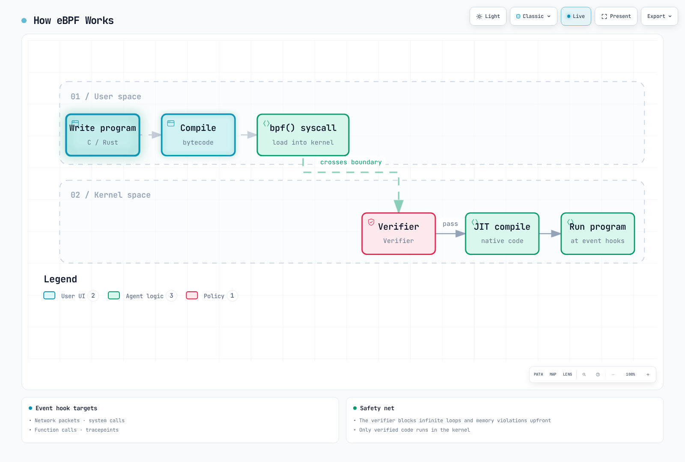
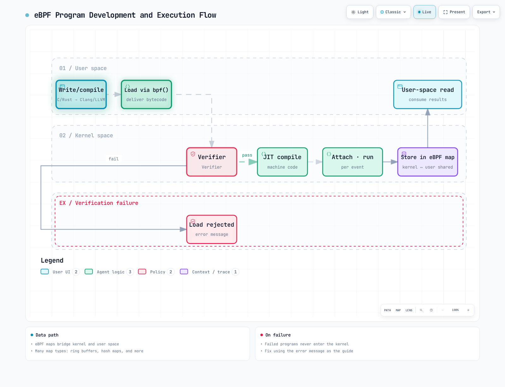
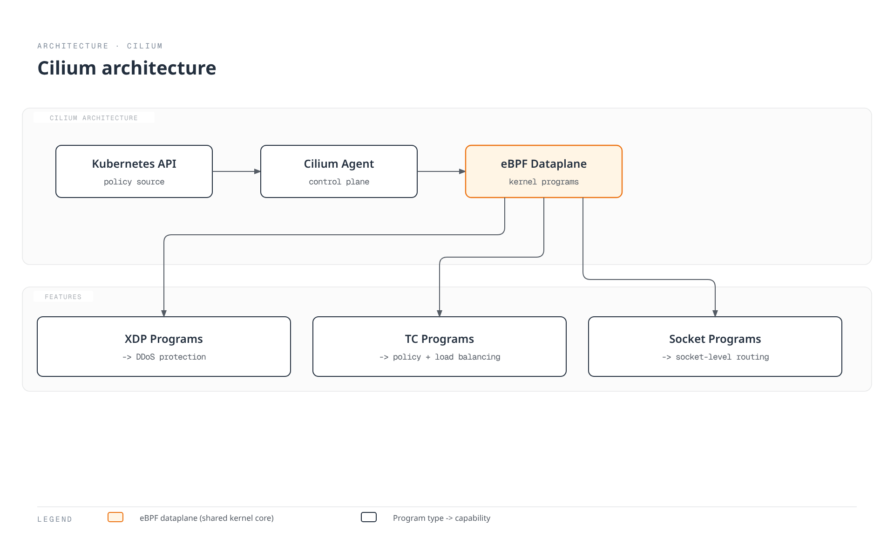
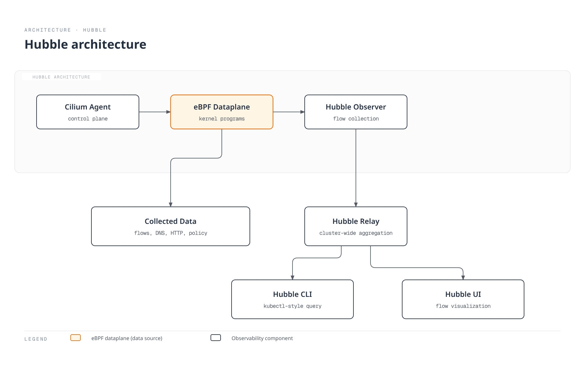
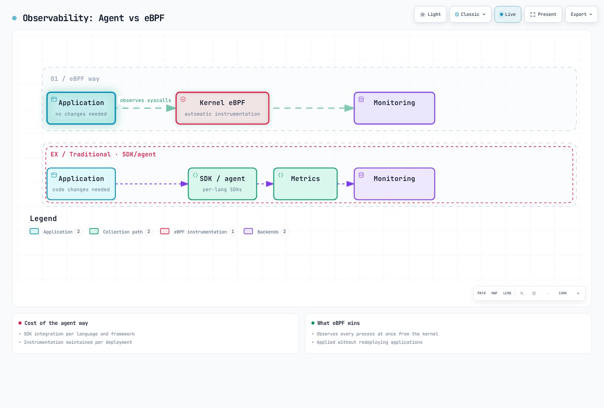
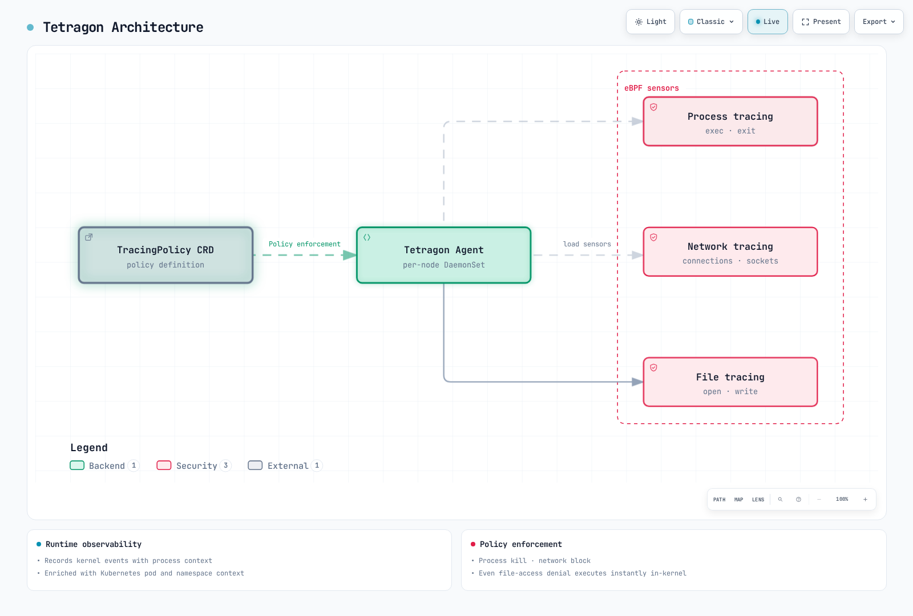

# eBPF Fundamentals and Kubernetes Applications

> **Supported versions**: Feature-specific kernel/BTF/helper requirements; match tool and Kubernetes compatibility matrices
> **Last updated**: September 11, 2026

eBPF is a revolutionary technology that allows sandboxed programs to run within the Linux kernel. This document covers everything from basic eBPF concepts to practical applications in Kubernetes environments.

## Table of Contents

* [1. Introduction to eBPF](#1-introduction-to-ebpf)
* [2. eBPF Architecture](#2-ebpf-architecture)
* [3. eBPF Program Types](#3-ebpf-program-types)
* [4. eBPF Development Tools](#4-ebpf-development-tools)
* [5. eBPF and Kubernetes Networking](#5-ebpf-and-kubernetes-networking)
* [6. eBPF-based Observability](#6-ebpf-based-observability)
* [7. eBPF-based Security](#7-ebpf-based-security)
* [8. Practical eBPF Examples](#8-practical-ebpf-examples)
* [9. eBPF Limitations and Considerations](#9-ebpf-limitations-and-considerations)
* [10. Next Steps](#10-next-steps)

## Lab Environment Setup

To follow along with the examples in this document, you need the following environment.

### Prerequisites
- A maintained distribution kernel with the BTF, helpers and attach types required by each example
- bpftool, bcc-tools
- Kubernetes cluster (optional)

bpftrace examples were checked against the official0.27 language syntax (args.field). Distribution packages may be older; use their matching syntax/features. Verify tracepoint fields with bpftrace -lv or tracefs format files. Function probes depend on kernel/library versions and architecture. No tracing/attachment was executed during this audit.

### Environment Setup

```bash
# Install required packages on Ubuntu/Debian
sudo apt-get update
sudo apt-get install -y bpfcc-tools python3-bpfcc bpftrace
# Install bpftool for this distribution/kernel separately:
# Debian provides the bpftool package; Ubuntu uses matching linux-tools packages.

# Check kernel version
uname -r

# Verify eBPF feature support
sudo bpftool feature probe kernel
```

---

## 1. Introduction to eBPF

### 1.1 What is eBPF?

**eBPF (extended Berkeley Packet Filter)** is a technology that allows user-defined programs to run safely within the Linux kernel. Originally designed for network packet filtering as BPF, it has been extended and is now used in various areas including networking, security, tracing, and performance analysis.

> **Key Concept**: eBPF allows you to extend and observe kernel behavior without modifying kernel source code or loading kernel modules.



[🔍 View interactive diagram](https://www.atomai.click/kubernetes-docs/archmaps/en-basics-05-ebpf-fundamentals-0.html)

### 1.2 Evolution from Traditional BPF to eBPF

**Original BPF (1992)**:
- Developed at UC Berkeley
- Dedicated to network packet capture and filtering
- 2 32-bit registers
- Linux classic BPF commonly limits programs to4096 instructions; this is not a universal historical BPF specification

**eBPF (2014~)**:
- 64-bit architecture support
- 11 registers
- State storage through Maps
- Various hook point support
- Native performance through JIT compilation

| Feature | Traditional BPF | eBPF |
|---------|-----------------|------|
| Registers | 2 (32-bit) | 11 (64-bit) |
| Instruction limits | Common Linux limit4096 | Kernel/privilege dependent; program size and verifier complexity are distinct |
| Map support | None | Various map types |
| Use case | Packet filtering | General-purpose kernel programming |
| Call capabilities | None | Helper functions, BPF-to-BPF calls |
| Persistent state | No persistent maps (scratch storage exists within one run) | Possible through maps |

### 1.3 Why eBPF is Revolutionary

eBPF is revolutionary for the following reasons:

1. **Feature extension without kernel modification**: Extend kernel features without changing kernel source code
2. **Safe execution**: Verifier checks defined memory/control-flow safety properties
3. **High performance**: Native code-level performance through JIT compilation
4. **Dynamic loading**: Load/unload programs without reboot
5. **Production stability**: Bounded execution checks reduce risk; correctness, kernel/JIT bugs and operational impact still require validation


[🔍 View interactive diagram](https://www.atomai.click/kubernetes-docs/archmaps/en-basics-05-ebpf-fundamentals-1.html)

### 1.4 eBPF vs Kernel Module Comparison

| Aspect | eBPF | Kernel Module |
|--------|------|---------------|
| **Safety** | Verifier safety checks within its model | Can crash kernel |
| **Portability** | CO-RE relocates compatible kernel types; helpers, hooks, semantics and BTF still constrain portability | Requires recompilation per kernel version |
| **Loading** | Dynamic load/unload | Requires insmod/rmmod |
| **Privileges** | CAP_BPF/CAP_SYS_ADMIN plus hook-specific permissions | Root privileges required |
| **Debugging** | Limited | Full kernel debugging possible |
| **Performance** | Optimized through JIT compilation | Native performance |
| **Feature scope** | Only designated hook points | Unlimited |
| **Development difficulty** | Relatively easy | High expertise required |

---

## 2. eBPF Architecture

### 2.1 eBPF Execution Flow



[🔍 View interactive diagram](https://www.atomai.click/kubernetes-docs/archmaps/en-basics-05-ebpf-fundamentals-2.html)

### 2.2 Verifier

The verifier is a core security mechanism of eBPF. It verifies the following before a program runs in the kernel:

**Verification Items**:
- Termination/bounded control flow; bounded loops are supported on suitable kernels
- No out-of-bounds memory access
- No use of uninitialized variables
- Correct helper function calls
- Program termination guaranteed

```c
// XDP fragments; compile as separate programs with linux/bpf.h and bpf_helpers.h.
SEC("xdp")
int bad_example(struct xdp_md *ctx) {
    unsigned char *data = (void *)(long)ctx->data;
    // No data_end check: the verifier cannot prove this packet byte exists.
    return data[0] == 0 ? XDP_DROP : XDP_PASS;
}

SEC("xdp")
int good_example(struct xdp_md *ctx) {
    unsigned char *data = (void *)(long)ctx->data;
    void *data_end = (void *)(long)ctx->data_end;
    if ((void *)(data + 1) > data_end)
        return XDP_PASS;
    return data[0] == 0 ? XDP_DROP : XDP_PASS;
}
```

### 2.3 JIT Compiler

The JIT (Just-In-Time) compiler converts eBPF bytecode to native machine code:

```bash
# Check JIT compiler status
cat /proc/sys/net/core/bpf_jit_enable

# Enable JIT compiler (0: disabled, 1: enabled, 2: debug mode)
echo 1 | sudo tee /proc/sys/net/core/bpf_jit_enable
```

Some kernels enforce CONFIG_BPF_JIT_ALWAYS_ON; availability/writability of this sysctl depends on kernel configuration. Debug mode2 writes kernel log traces and is not a production default.

**JIT Compilation Benefits**:
- The original 4–5x speedup claim is unsourced here; actual speedup depends on program, architecture and kernel
- Direct execution as native CPU instructions
- Architecture-specific optimizations applied

### 2.4 eBPF Maps

eBPF maps are data structures for sharing data between kernel and user space and storing state.

**Main Map Types**:

| Map Type | Description | Use Case |
|----------|-------------|----------|
| `BPF_MAP_TYPE_HASH` | Hash table | Key-value storage, connection tracking |
| `BPF_MAP_TYPE_ARRAY` | Fixed-size array | Index-based access, configuration values |
| `BPF_MAP_TYPE_PERF_EVENT_ARRAY` | Event array | Send events to user space |
| `BPF_MAP_TYPE_RINGBUF` | Ring buffer | High-performance event streaming |
| `BPF_MAP_TYPE_LRU_HASH` | LRU hash | Cache, automatic entry eviction |
| `BPF_MAP_TYPE_PERCPU_ARRAY` | Per-CPU array | Reduced cross-CPU contention for statistics |
| `BPF_MAP_TYPE_LPM_TRIE` | LPM trie | IP address matching, routing |

```c
// Hash map definition example
struct {
    __uint(type, BPF_MAP_TYPE_HASH);
    __uint(max_entries, 1024);
    __type(key, __u32);      // Key: Process ID
    __type(value, __u64);    // Value: Counter
} packet_count SEC(".maps");
```

### 2.5 Helper Functions

eBPF programs access kernel functions through helper functions provided by the kernel.

**Key Helper Functions**:

These are simplified API reference signatures. Include libbpf bpf_helpers.h in real programs instead of redeclaring them. Helper availability depends on program type/kernel.

```text
// Map manipulation
void *bpf_map_lookup_elem(void *map, const void *key);
long bpf_map_update_elem(void *map, const void *key, const void *value, u64 flags);
long bpf_map_delete_elem(void *map, const void *key);

// Time-related
u64 bpf_ktime_get_ns(void);  // Monotonic nanoseconds since boot, excluding suspend; not wall-clock time

// Packet manipulation
long bpf_skb_load_bytes(const void *skb, u32 offset, void *to, u32 len);
long bpf_xdp_adjust_head(struct xdp_md *xdp_md, int delta);

// Tracing
long bpf_probe_read_kernel(void *dst, u32 size, const void *src);
long bpf_probe_read_user(void *dst, u32 size, const void *src);
long bpf_trace_printk(const char *fmt, u32 fmt_size, ...);

// Process information
u64 bpf_get_current_pid_tgid(void);    // Get PID/TGID
u64 bpf_get_current_uid_gid(void);     // Get UID/GID
long bpf_get_current_comm(void *buf, u32 size);  // Process name
```

### 2.6 Program Lifecycle


[🔍 View interactive diagram](https://www.atomai.click/kubernetes-docs/archmaps/en-basics-05-ebpf-fundamentals-3.html)

---

C examples are separate programs/fragments. Supply vmlinux.h or the relevant UAPI types and libbpf bpf_helpers.h, bpf_endian.h, bpf_tracing.h and bpf_core_read.h as needed. BPF_KPROBE/BPF_UPROBE require the correct target architecture and actual attachment ABI. Validate loading/attachment in an isolated environment; neither was performed in this audit. Path-based LSM examples fail open on read errors and do not cover aliases/hardlinks/other protocols; they are educational, not complete access controls.

## 3. eBPF Program Types

### 3.1 XDP (eXpress Data Path)

XDP is the fastest way to process packets at the network driver level.


[🔍 View interactive diagram](https://www.atomai.click/kubernetes-docs/archmaps/en-basics-05-ebpf-fundamentals-4.html)

**XDP Operation Modes**:
| Mode | Description | Performance |
|------|-------------|-------------|
| Native XDP | Runs in the supported driver receive path | Low overhead; driver/workload dependent |
| Offloaded XDP | Runs on supported NIC hardware | Hardware/instruction limitations; benchmark the workload |
| Generic XDP | skb-based fallback in the stack | More overhead than native in common cases |

```c
#include <linux/bpf.h>
#include <linux/if_ether.h>
#include <linux/ip.h>
#include <linux/tcp.h>
#include <linux/in.h>
#include <bpf/bpf_helpers.h>
#include <bpf/bpf_endian.h>

// Demonstration only: untagged, non-fragmented IPv4 TCP.
// VLAN, IPv6 and fragments pass through; this is not a complete firewall.
static __always_inline int packet_action(void *data, void *data_end) {
    struct ethhdr *eth = data;
    if ((void *)(eth + 1) > data_end || eth->h_proto != bpf_htons(ETH_P_IP))
        return XDP_PASS;
    struct iphdr *ip = (void *)(eth + 1);
    if ((void *)(ip + 1) > data_end || ip->version != 4 || ip->ihl < 5)
        return XDP_PASS;
    __u32 ihl = (__u32)ip->ihl * 4;
    __u32 ip_len = bpf_ntohs(ip->tot_len);
    if ((void *)ip + ihl > data_end || ip_len < ihl || (void *)ip + ip_len > data_end)
        return XDP_PASS;
    if (ip->protocol != IPPROTO_TCP || (bpf_ntohs(ip->frag_off) & 0x3fffU))
        return XDP_PASS;
    if (ip_len < ihl + sizeof(struct tcphdr))
        return XDP_PASS;
    struct tcphdr *tcp = (void *)ip + ihl;
    if ((void *)(tcp + 1) > data_end || tcp->doff < 5)
        return XDP_PASS;
    __u32 tcp_len = (__u32)tcp->doff * 4;
    if (ihl + tcp_len > ip_len || (void *)tcp + tcp_len > data_end)
        return XDP_PASS;
    return tcp->dest == bpf_htons(8080) ? XDP_DROP : XDP_PASS;
}

SEC("xdp")
int xdp_drop_port(struct xdp_md *ctx) {
    return packet_action((void *)(long)ctx->data, (void *)(long)ctx->data_end);
}
char LICENSE[] SEC("license") = "GPL";
```

### 3.2 TC (Traffic Control)

TC programs run at the traffic control layer of the network stack.

```bash
# TC program attachment example
set -e
: "${LAB_IFACE:?Select an isolated test veth interface, never a production interface}"
tc qdisc show dev "$LAB_IFACE"
# This assumes a fresh lab interface with no clsact qdisc.
sudo tc qdisc add dev "$LAB_IFACE" clsact
sudo tc filter add dev "$LAB_IFACE" ingress pref 49152 bpf da obj tc_prog.o sec classifier
sudo tc filter add dev "$LAB_IFACE" egress pref 49152 bpf da obj tc_prog.o sec classifier
# Cleanup only the filters created by this example, after the exercise:
# sudo tc filter del dev "$LAB_IFACE" ingress pref 49152
# sudo tc filter del dev "$LAB_IFACE" egress pref 49152
```

**TC vs XDP Comparison**:
| Feature | XDP | TC |
|---------|-----|-----|
| Execution location | Driver level | Network stack |
| Performance | Highest | High |
| SKB access | Not possible | Possible |
| Direction | Ingress only | Both ingress and egress |
| Packet modification | Limited | Flexible |

### 3.3 Kprobes/Uprobes

Kprobes and Uprobes dynamically trace function calls.

```c
// Kprobe example: Trace tcp_connect function
SEC("kprobe/tcp_connect")
int BPF_KPROBE(trace_tcp_connect, struct sock *sk) {
    u32 pid = bpf_get_current_pid_tgid() >> 32;

    // Get destination IP address
    u32 daddr = BPF_CORE_READ(sk, __sk_common.skc_daddr);
    u16 dport = BPF_CORE_READ(sk, __sk_common.skc_dport);

    bpf_printk("PID %d connecting to %pI4:%d\n", pid, &daddr, bpf_ntohs(dport));
    return 0;
}

// Uprobe example: Trace malloc function
// The userspace loader must select the real libc path, PID and malloc symbol.
SEC("uprobe")
int BPF_UPROBE(trace_malloc, size_t size) {
    u32 pid = bpf_get_current_pid_tgid() >> 32;
    bpf_printk("PID %d malloc(%zu)\n", pid, size);
    return 0;
}
```

### 3.4 Tracepoints

Tracepoints are static trace points predefined in the kernel.

```bash
# Check available tracepoints
sudo ls /sys/kernel/tracing/events/

# Tracepoints in specific categories
sudo ls /sys/kernel/tracing/events/sched/
sudo ls /sys/kernel/tracing/events/syscalls/
```

```c
// Tracepoint example: Trace process execution
SEC("tracepoint/sched/sched_process_exec")
int handle_exec(struct trace_event_raw_sched_process_exec *ctx) {
    char comm[16];
    bpf_get_current_comm(&comm, sizeof(comm));

    u32 pid = bpf_get_current_pid_tgid() >> 32;
    bpf_printk("Process started: %s (PID: %d)\n", comm, pid);

    return 0;
}
```

### 3.5 LSM (Linux Security Module) BPF

LSM BPF dynamically applies security policies.

```c
// LSM BPF example: Restrict file opening
SEC("lsm/file_open")
int BPF_PROG(restrict_file_open, struct file *file, int ret) {
    if (ret != 0)
        return ret;

    char path[256];
    if (bpf_d_path(&file->f_path, path, sizeof(path)) < 0)
        return 0;  // Demo fails open on unresolved paths; not a complete access policy.

    // Block access to /etc/shadow
    if (bpf_strncmp(path, 11, "/etc/shadow") == 0)
        return -EACCES;

    return 0;
}
```

### 3.6 Socket Filter

Filters packets at the socket level.

```c
// Socket Filter example
SEC("socket")
int socket_filter(struct __sk_buff *skb) {
    // Allow only IPv4 packets
    if (skb->protocol != bpf_htons(ETH_P_IP))
        return 0;  // Drop

    return skb->len;  // Return packet length (allow)
}
```

### 3.7 Cgroup Programs

Controls container resources and networking.

```c
// Cgroup socket program example: Block external connections
SEC("cgroup/connect4")
int restrict_connect(struct bpf_sock_addr *ctx) {
    // Block connections that are not to local network
    __u32 dst = bpf_ntohl(ctx->user_ip4);

    // Allow only 10.0.0.0/8 range
    if ((dst & 0xff000000U) != 0x0a000000U)
        return 0;  // Deny connection

    return 1;  // Allow connection
}
```

---

## 4. eBPF Development Tools

### 4.1 bpftool

bpftool manages BPF programs/maps. Only update maps created for this lab; live CNI/security maps affect running workloads. The hex update below assumes a little-endian u32 key/u64 value matching the earlier map example.

```bash
# List loaded eBPF programs
sudo bpftool prog list

# Program details
sudo bpftool prog show id <ID>

# Program dump (bytecode)
sudo bpftool prog dump xlated id <ID>

# JIT compiled code dump
sudo bpftool prog dump jited id <ID>

# Map list
sudo bpftool map list

# Query map contents
sudo bpftool map dump id <MAP_ID>

# Add value to map
sudo bpftool map update id <MAP_ID> key hex 01 00 00 00 value hex ff 00 00 00 00 00 00 00

# Check kernel eBPF features
sudo bpftool feature probe kernel

# BTF (BPF Type Format) information
sudo bpftool btf list
```

### 4.2 bpftrace

bpftrace is a high-level tracing language in DTrace style.

```bash
# Installation
sudo apt-get install -y bpftrace

# System call count
sudo bpftrace -e 'tracepoint:raw_syscalls:sys_enter { @[comm] = count(); }'

# Read bytes per process
sudo bpftrace -e 'tracepoint:syscalls:sys_exit_read /args.ret > 0/ { @bytes[comm] = sum(args.ret); }'

# File open tracing
sudo bpftrace -e 'tracepoint:syscalls:sys_enter_openat { printf("%s opened %s\n", comm, str(args.filename)); }'

# TCP connection tracing
sudo bpftrace -e 'kprobe:tcp_connect { printf("%s -> %s\n", ntop(((struct sock *)arg0)->__sk_common.skc_rcv_saddr), ntop(((struct sock *)arg0)->__sk_common.skc_daddr)); }'

# Latency histogram
sudo bpftrace -e 'kprobe:vfs_read { @start[tid] = nsecs; } kretprobe:vfs_read /@start[tid]/ { @ns = hist(nsecs - @start[tid]); delete(@start[tid]); }'
```

**Useful bpftrace One-liners**:

```bash
# Top CPU-consuming processes
sudo bpftrace -e 'profile:hz:99 { @[comm] = count(); }'

# Block I/O latency
sudo biolatency-bpfcc 1 10  # Maintained request correlation; avoids dev/sector collisions

# New process tracing
sudo bpftrace -e 'tracepoint:sched:sched_process_exec { printf("%-10d %-16s\n", pid, comm); }'

# Memory allocation tracing
sudo bpftrace -e 'tracepoint:kmem:kmalloc { @bytes = hist(args.bytes_alloc); }'
```

### 4.3 BCC (BPF Compiler Collection)

BCC provides BPF C compilation/loading and commonly embeds BPF C in Python tracing tools.

```bash
# Installation
sudo apt-get install -y bpfcc-tools python3-bpfcc

# Included tools
dpkg -L bpfcc-tools | head -40
```

**Key BCC Tools**:

| Tool | Description |
|------|-------------|
| `execsnoop` | Trace new process executions |
| `opensnoop` | Trace file opens |
| `biolatency` | Block I/O latency |
| `tcpconnect` | Trace TCP connections |
| `tcpaccept` | Trace TCP incoming connections |
| `tcpretrans` | Trace TCP retransmissions |
| `runqlat` | CPU run queue latency |
| `profile` | CPU profiling |
| `funccount` | Function call counts |
| `trace` | General function tracing |

```bash
# Usage examples
sudo execsnoop-bpfcc    # Trace process execution
sudo tcpconnect-bpfcc   # Trace TCP connections
sudo biolatency-bpfcc   # Disk I/O latency
sudo profile-bpfcc -F 99 10  # CPU profiling for 10 seconds
```

### 4.4 libbpf and CO-RE

libbpf is a C library for loading eBPF programs and supports CO-RE (Compile Once, Run Everywhere).

**CO-RE Benefits**:
- Run compiled eBPF programs on various kernel versions
- Struct relocation using BTF (BPF Type Format)
- Reduced kernel header dependencies

```c
// Independent tracing program. Generate vmlinux.h from the target kernel's BTF.
#include "vmlinux.h"
#include <bpf/bpf_helpers.h>
#include <bpf/bpf_core_read.h>

SEC("tracepoint/syscalls/sys_enter_openat")
int trace_openat(struct trace_event_raw_sys_enter *ctx) {
    const char *filename = (const char *)BPF_CORE_READ(ctx, args[1]);
    char fname[256];
    if (bpf_probe_read_user_str(fname, sizeof(fname), filename) < 0)
        return 0;
    __u32 tgid = bpf_get_current_pid_tgid() >> 32;
    bpf_printk("TGID %u opened: %s", tgid, fname);
    return 0;
}
char LICENSE[] SEC("license") = "GPL";
```

**BTF Generation and Verification**:

```bash
# Check BTF support
ls /sys/kernel/btf/vmlinux

# Generate vmlinux.h (for CO-RE development)
bpftool btf dump file /sys/kernel/btf/vmlinux format c > vmlinux.h

# Check program BTF information
bpftool prog show id <ID> --pretty
```

---

## 5. eBPF and Kubernetes Networking

### 5.1 Cilium: eBPF-based CNI

Cilium is the most representative Kubernetes CNI (Container Network Interface) utilizing eBPF.



[🔍 View interactive diagram](https://www.atomai.click/kubernetes-docs/archmaps/en-basics-05-ebpf-fundamentals-5.html)

#### kube-proxy Replacement

Cilium can replace kube-proxy in a supported configuration. The sketches below describe new-flow backend selection; established flows can use connection tracking. Routing/tunneling/NAT still depend on the chosen datapath.

**Traditional kube-proxy (iptables mode)**:
```
Packet → Netfilter → iptables rule evaluation → DNAT → Routing
```

**Cilium eBPF mode**:
```
New flow → eBPF backend lookup → Configured routing/tunneling/NAT
```

```bash
# New, isolated self-managed lab only: configure the cluster for the selected
# CNI/proxy mode before bootstrap. Do not delete kube-proxy on a live cluster.
helm repo add cilium https://helm.cilium.io
helm repo update cilium
: "${CILIUM_CHART_VERSION:?Select a chart compatible with this Kubernetes/kernel}"
: "${CILIUM_VALUES_FILE:?Provide reviewed IPAM/routing/platform values}"
: "${API_SERVER_IP:?Set a directly reachable API endpoint, not the Service IP}"
: "${API_SERVER_PORT:?Set the API endpoint port}"
helm install cilium cilium/cilium --version "$CILIUM_CHART_VERSION" \
  --namespace kube-system -f "$CILIUM_VALUES_FILE" \
  --set kubeProxyReplacement=true \
  --set k8sServiceHost="$API_SERVER_IP" --set k8sServicePort="$API_SERVER_PORT"
cilium status --wait
# Existing clusters require the Cilium migration procedure and a tested rollback plan.

```

#### Network Policy

Cilium uses eBPF for L3/L4 enforcement; HTTP/L7 policies require supported proxy processing (for example Envoy). DNS visibility uses the DNS proxy. Hubble HTTP/DNS records require those corresponding visibility settings.

```yaml
# Cilium network policy example
apiVersion: cilium.io/v2
kind: CiliumNetworkPolicy
metadata:
  name: allow-http-only
spec:
  endpointSelector:
    matchLabels:
      app: web
  ingress:
    - fromEndpoints:
        - matchLabels:
            app: frontend
      toPorts:
        - ports:
            - port: "80"
              protocol: TCP
          rules:
            http:
              - method: GET
                path: "/api/.*"
```

#### Load Balancing

```yaml
# Cilium LoadBalancer service example
apiVersion: v1
kind: Service
metadata:
  name: my-service
  annotations:
    lbipam.cilium.io/ips: "192.168.1.100"
spec:
  type: LoadBalancer
  selector:
    app: my-app
  ports:
    - port: 80
      targetPort: 8080
```

The requested IP must belong to an administrator-owned CiliumLoadBalancerIPPool. LB IPAM only allocates addresses; external reachability requires BGP/L2 advertisement or another load-balancer setup.

### 5.2 Calico eBPF Mode

Calico supports an eBPF dataplane. The patch below assumes an existing compatible Calico Operator installation and is only one step of its migration procedure. Configure direct API access and validate routing/rollback before changing any Service proxy.

```bash
# Enable Calico eBPF mode
kubectl patch installation.operator.tigera.io default --type merge -p '{"spec":{"calicoNetwork":{"linuxDataplane":"BPF"}}}'
```

**Calico eBPF Mode Features**:
- Source IP preservation
- Direct Server Return (DSR) support
- Host endpoint policies
- Optional WireGuard encryption when separately configured and supported; not enabled merely by selecting eBPF

### 5.3 Performance Comparison: iptables vs eBPF

| Aspect | iptables | eBPF |
|--------|----------|------|
| **Scalability** | O(n) - proportional to service count | Average O(1) for hash lookup; map type matters |
| **Latency** | Rule structure and workload dependent | Map type, workload and datapath dependent |
| **CPU usage** | Workload/configuration dependent | Workload/configuration dependent |
| **Updates** | Modern kube-proxy can update changed Service/endpoint rules | Map updates; cost depends on implementation |
| **Observability** | Limited | Hubble integration |
| **Memory** | Rules, endpoints and conntrack state | Maps, endpoints and conntrack state |

**Benchmark Results** (based on 1000 services):

The original figures below have no cited source, hardware, kernel/CNI versions or methodology. They have not been rerun and cannot establish current performance or a general speedup. Reproduction requires the original method and environment.

```
| Metric                  | iptables    | eBPF      | Improvement |
|------------------------|-------------|-----------|-------------|
| Connection setup time  | 2.5ms       | 0.3ms     | 8.3x        |
| CPU usage              | 15%         | 3%        | 5x          |
| Memory usage           | 256MB       | 32MB      | 8x          |
| Connections per second | 50,000      | 250,000   | 5x          |
```

```bash
# Check Cilium status
cilium status

# Check eBPF maps
kubectl -n kube-system exec ds/cilium -c cilium-agent -- cilium-dbg bpf lb list
kubectl -n kube-system exec ds/cilium -c cilium-agent -- cilium-dbg bpf ct list global

# Network policy status
kubectl get ciliumnetworkpolicies,ciliumclusterwidenetworkpolicies -A
```

---

## 6. eBPF-based Observability

eBPF enables deep observation of system and application behavior. Unlike traditional agent-based monitoring, eBPF collects data at the kernel level, providing richer information with lower overhead.

### 6.1 Hubble: Cilium Network Observability

Hubble provides Cilium network observability. Install a compatible Hubble CLI, enable Relay, and establish the port-forward before the CLI examples. L7 visibility requires the relevant proxy configuration.



[🔍 View interactive diagram](https://www.atomai.click/kubernetes-docs/archmaps/en-basics-05-ebpf-fundamentals-6.html)

```bash
# Use the installed, reviewed chart version; this is not a chart-version upgrade.
: "${CILIUM_CHART_VERSION:?Set the installed compatible chart version}"
# Install Hubble
helm upgrade cilium cilium/cilium --version "$CILIUM_CHART_VERSION" \
  --namespace kube-system \
  --reuse-values \
  --set hubble.enabled=true \
  --set hubble.relay.enabled=true \
  --set hubble.ui.enabled=true

# First run cilium hubble port-forward in a separate terminal.
# Use Hubble CLI
hubble observe --pod my-pod
hubble observe --namespace default
hubble observe --protocol http
hubble observe --verdict DROPPED

# Observe traffic between specific services
hubble observe --from-pod default/frontend --to-pod default/backend

# Real-time network flow monitoring
hubble observe -f --type trace

# Generate service map
# Service maps are provided by Hubble UI; use the UI port-forward below.
```

**Accessing Hubble UI**:

```bash
# Port forwarding
kubectl port-forward -n kube-system svc/hubble-ui 12000:80

# Access http://localhost:12000 in browser
```

### 6.2 Pixie: Auto-instrumentation Observability

Pixie uses eBPF to automatically collect telemetry without application code modification.

**Pixie Features**:
- Automatic protocol parsing (HTTP, gRPC, MySQL, PostgreSQL, Kafka, etc.)
- Automatic service map generation
- Distributed tracing
- CPU profiling
- Dynamic logging

```bash
# Install Pixie
px deploy

# Pixie CLI query examples
# HTTP request latency
px run px/http_data

# Traffic between services
px run px/service_stats

# Slow request analysis
px run px/slow_http_requests --help
# Use the parameters advertised by the installed script bundle.

# Pod resource usage
px run px/pods
```

**PxL (Pixie Query Language) Example**:

```python
# Find slow HTTP requests
import px

df = px.DataFrame(table='http_events', start_time='-5m')
df.namespace = df.ctx['namespace']
df.pod = df.ctx['pod']
df = df[df.latency > 100000000]  # Over 100ms
df = df.groupby(['namespace', 'pod', 'req_path']).agg(
    count=('latency', px.count),
    avg_latency=('latency', px.mean),
    latency_quantiles=('latency', px.quantiles)
)
df.p99_latency_ns = px.pluck_float64(df.latency_quantiles, 'p99')
px.display(df)
```

### 6.3 Coroot: "No-Code" Monitoring

Coroot uses eBPF to automatically monitor systems for supported applications after configuring agents, storage, permissions and data sources.

```bash
# Install Coroot with Helm
helm repo add coroot https://coroot.github.io/helm-charts
# The old coroot/coroot chart is deprecated; use the operator and CE resource chart.
: "${COROOT_OPERATOR_VERSION:?Select a reviewed operator chart version}"
: "${COROOT_CE_VERSION:?Select a compatible CE chart version}"
helm install coroot-operator coroot/coroot-operator -n coroot --create-namespace \
  --version "$COROOT_OPERATOR_VERSION"
helm install coroot coroot/coroot-ce -n coroot --version "$COROOT_CE_VERSION"
```

**Coroot Features**:
- Automatic service discovery
- Automatic dependency map generation
- SLO monitoring
- Anomaly detection
- Root cause analysis

### 6.4 Kepler: Energy Consumption Monitoring

Early Kepler used eBPF, but it was **rewritten starting in 0.10.0** around read-only host /proc and /sys access, RAPL/powercap and CPU-usage-based power attribution. CAP_BPF is no longer required, so current Kepler is not an example that depends on eBPF instrumentation. Versions0.9 and earlier are frozen legacy code with different metrics/deployment methods.

Check that the hardware/VM exposes power sensors. Container/Pod values attribute measured node energy rather than directly measuring each container with a power meter. Summing nested RAPL zones double-counts energy. Verify version-specific experimental GPU/HWMon/platform support.

```bash
: "${KEPLER_CHART_VERSION:?Select a reviewed current Kepler chart}"
helm install kepler oci://quay.io/sustainable_computing_io/charts/kepler \
  --version "$KEPLER_CHART_VERSION" --namespace kepler --create-namespace
kubectl get pods -n kepler
# Run port-forward in a separate terminal; then query metrics from this machine.
kubectl port-forward -n kepler service/kepler 28282:28282
# curl --fail http://localhost:28282/metrics | grep kepler_node_cpu_watts
```

Current CPU metric examples: `kepler_node_cpu_joules_total`, `kepler_container_cpu_joules_total`, `kepler_pod_cpu_watts`. Verify actual sensor coverage and zone labels.

### 6.5 Traditional Agents vs eBPF Instrumentation Comparison

The 5–15% and <1% values retain the original unsourced claims; they are not verified overhead ranges. eBPF still needs userspace agents, buffers and protocol parsers. Traditional agents do not all require code changes, and eBPF tools do not automatically cover every application/protocol.

| Aspect | Traditional Agents | eBPF Instrumentation |
|--------|-------------------|---------------------|
| **Overhead** | High (5-15%) | Low (<1%) |
| **Code modification** | Depends on SDK/agent model | Often unnecessary for supported data sources |
| **Coverage** | Instrumentation and agent dependent | Supported hooks/protocols/visibility; not automatically complete |
| **Deployment** | Application, node or collector dependent | Usually node agents; application compatibility still matters |
| **Privileges** | Agent-dependent | Program/hook-dependent capabilities and host access |
| **Data depth** | Application/host dependent | Kernel and supported userspace probes |
| **Protocol support** | Tool-dependent | Automatic only for supported parsers/libraries/visibility |



[🔍 View interactive diagram](https://www.atomai.click/kubernetes-docs/archmaps/en-basics-05-ebpf-fundamentals-7.html)

---

## 7. eBPF-based Security

### 7.1 Tetragon: Runtime Security

Tetragon is an eBPF-based runtime security solution provided by the Cilium project.



[🔍 View interactive diagram](https://www.atomai.click/kubernetes-docs/archmaps/en-basics-05-ebpf-fundamentals-8.html)

```bash
# Install Tetragon
helm repo add cilium https://helm.cilium.io
: "${TETRAGON_CHART_VERSION:?Select a compatible reviewed chart version}"
helm install tetragon cilium/tetragon -n kube-system --version "$TETRAGON_CHART_VERSION"

# Observe events
kubectl logs -n kube-system -l app.kubernetes.io/name=tetragon -c export-stdout -f | tetra getevents -o compact
```

Create ebpf-lab and app=ebpf-demo test Pods. These examples use Post-only observation instead of sending SIGKILL across the host. Preventive denial requires separately tested supported LSM/Override behavior.

**TracingPolicy Examples**:

```yaml
apiVersion: cilium.io/v1alpha1
kind: TracingPolicyNamespaced
metadata:
  name: sensitive-file-access
  namespace: ebpf-lab
spec:
  kprobes:
  - call: security_file_open
    syscall: false
    args:
    - index: 0
      type: file
    selectors:
    - matchArgs:
      - index: 0
        operator: Prefix
        values:
        - /etc/shadow
        - /etc/passwd
        - /etc/sudoers
      matchActions:
      - action: Post
  podSelector:
    matchLabels:
      app: ebpf-demo
```

```yaml
apiVersion: cilium.io/v1alpha1
kind: TracingPolicyNamespaced
metadata:
  name: observe-outbound
  namespace: ebpf-lab
spec:
  kprobes:
  - call: tcp_connect
    syscall: false
    args:
    - index: 0
      type: sock
    selectors:
    - matchArgs:
      - index: 0
        operator: NotDAddr
        values:
        - 10.0.0.0/8
      matchActions:
      - action: Post
  podSelector:
    matchLabels:
      app: ebpf-demo
```

### 7.2 Falco: eBPF-based Anomaly Detection

Falco is a CNCF project that uses eBPF to detect runtime anomalous behavior.

```bash
# Install Falco (eBPF driver)
helm repo add falcosecurity https://falcosecurity.github.io/charts
# Save the following Falco rule examples as ./ebpf-lab-rules.yaml before installation.
: "${FALCO_CHART_VERSION:?Select a compatible reviewed chart version}"
helm install falco falcosecurity/falco --version "$FALCO_CHART_VERSION" \
  --namespace falco --create-namespace \
  --set driver.kind=modern_ebpf \
  --set-file 'customRules.ebpf-lab-rules\.yaml=./ebpf-lab-rules.yaml'
```

**Falco Rule Examples**:

```yaml
# Detect reading of /etc/shadow
- rule: eBPF lab read sensitive file
  desc: Detect reading of sensitive files
  condition: >
    open_read and
    fd.name in (/etc/shadow, /etc/sudoers) and
    not proc.name in (systemd, sudo, login)
  output: >
    Sensitive file opened (file=%fd.name user=%user.name
    process=%proc.name container=%container.name)
  priority: WARNING

# Detect shell execution in container
- rule: eBPF lab shell in container
  desc: Detect shell execution in container
  condition: >
    spawned_process and
    container and
    proc.name in (bash, sh, zsh, dash) and
    proc.pname != containerd-shim
  output: >
    Shell spawned in container (container=%container.name
    shell=%proc.name parent=%proc.pname)
  priority: NOTICE

# Detect privilege escalation
- rule: eBPF lab privilege escalation
  desc: Detect privilege escalation attempts
  condition: >
    spawned_process and
    proc.name in (sudo, su, doas) and
    container
  output: >
    Privilege escalation attempt (user=%user.name
    command=%proc.cmdline container=%container.name)
  priority: WARNING
```

### 7.3 seccomp-bpf: System Call Filtering

seccomp filters use the classic BPF userspace ABI, not ordinary eBPF program helpers/maps. OCI JSON profiles are interpreted by the container runtime to build syscall filters.

```yaml
# Apply seccomp profile in Kubernetes Pod
apiVersion: v1
kind: Pod
metadata:
  name: secure-pod
spec:
  securityContext:
    seccompProfile:
      type: RuntimeDefault  # or Localhost
  containers:
    - name: app
      image: nginx:1.30.4
```

**Custom seccomp Profile**:

The following is a **format sketch** for a minimal x86-64 example, not a profile that can run NGINX or a general application. Prefer RuntimeDefault; derive and regression-test a custom allowlist for the actual architecture/runtime/workload. A broad allowlist of mount/reboot/module/BPF calls is not a safe default.

```json
{
  "defaultAction": "SCMP_ACT_ERRNO",
  "architectures": [
    "SCMP_ARCH_X86_64"
  ],
  "syscalls": [
    {
      "names": [
        "read",
        "write",
        "exit",
        "exit_group",
        "rt_sigreturn"
      ],
      "action": "SCMP_ACT_ALLOW"
    }
  ]
}
```

### 7.4 LSM BPF: Dynamic Security Policies

LSM BPF combines Linux Security Module with eBPF to dynamically apply security policies.

```c
// LSM BPF example: Restrict executable files
SEC("lsm/bprm_check_security")
int BPF_PROG(restrict_exec, struct linux_binprm *bprm, int ret) {
    if (ret != 0)
        return ret;
    char filename[256];
    if (bpf_probe_read_kernel_str(filename, sizeof(filename), bprm->filename) < 0)
        return 0;  // Demo fails open on read error; define a real policy explicitly.

    // Block execution from /tmp
    if (bpf_strncmp(filename, 5, "/tmp/") == 0)
        return -EPERM;

    return 0;
}

// LSM BPF example: Restrict network sockets
SEC("lsm/socket_connect")
int BPF_PROG(restrict_connect, struct socket *sock, struct sockaddr *address, int addrlen, int ret) {
    if (ret != 0)
        return ret;

    if (addrlen < sizeof(struct sockaddr_in) || address->sa_family != AF_INET)
        return 0;  // This example handles IPv4 only.
    struct sockaddr_in *addr = (struct sockaddr_in *)address;

    // Block connection to specific port
    if (bpf_ntohs(addr->sin_port) == 6666)
        return -EACCES;

    return 0;
}
```

---

## 8. Practical eBPF Examples

### 8.1 System Performance Analysis with bpftrace

**TCP Connection Tracing**:

```bash
# TCP connection tracing
sudo bpftrace -e '
tracepoint:sock:inet_sock_set_state /args.protocol == 6 && args.newstate == 1/ {
    if (args.family == 2) {
        printf("IPv4 %s:%d -> %s:%d established\n", ntop(args.saddr), args.sport, ntop(args.daddr), args.dport);
    } else if (args.family == 10) {
        printf("IPv6 %s:%d -> %s:%d established\n", ntop(args.saddr_v6), args.sport, ntop(args.daddr_v6), args.dport);
    }
}'
```

**System Call Latency Analysis**:

```bash
# Read system call latency histogram
sudo bpftrace -e '
tracepoint:syscalls:sys_enter_read { @start[tid] = nsecs; }
tracepoint:syscalls:sys_exit_read /@start[tid]/ {
    @latency = hist((nsecs - @start[tid]) / 1000);
    delete(@start[tid]);
}'
```

**Disk I/O Analysis**:

```bash
# Block I/O request tracing
sudo bpftrace -e '
tracepoint:block:block_rq_issue {
    printf("%s %s %d\n",
        comm,
        str(args.rwbs),
        args.nr_sector / 2);
}'

# I/O latency histogram
sudo biolatency-bpfcc 1 10
```

### 8.2 Network Flow Observation with Cilium Hubble

```bash
# Real-time network flow observation
hubble observe -f

# Specific namespace traffic
hubble observe --namespace production

# Filter HTTP traffic only
hubble observe --protocol http

# Analyze dropped packets
hubble observe --verdict DROPPED

# DNS query tracing
hubble observe --protocol dns

# Traffic between specific Pods
hubble observe --from-pod default/frontend --to-pod default/backend

# Detailed analysis with JSON output
hubble observe --namespace default -o json | jq '.flow.destination.pod_name'

# Count retained flow observations, not unique connections or all traffic.
# Relay returns up to the requested count per Hubble instance.
hubble observe --namespace default --last 1000 -o jsonpb | \
  jq -r '.flow | "\(.source.pod_name // .source.identity) -> \(.destination.pod_name // .destination.identity)"' | \
  sort | uniq -c | sort -rn | head -20
```

### 8.3 Process Security Monitoring with Tetragon

```bash
# Real-time Tetragon event monitoring
kubectl logs -n kube-system -l app.kubernetes.io/name=tetragon -c export-stdout -f | \
  tetra getevents -o compact

# Filter process execution events only
kubectl logs -n kube-system -l app.kubernetes.io/name=tetragon -c export-stdout -f | \
  tetra getevents -o compact --event-types PROCESS_EXEC

# Events from specific namespace
kubectl logs -n kube-system -l app.kubernetes.io/name=tetragon -c export-stdout -f | \
  tetra getevents -o json | jq 'select(.process_exec.process.pod.namespace == "default")'
```

**File Access Monitoring Policy**:

```yaml
apiVersion: cilium.io/v1alpha1
kind: TracingPolicyNamespaced
metadata:
  name: file-access-monitor
  namespace: ebpf-lab
spec:
  kprobes:
  - call: security_file_open
    syscall: false
    return: false
    args:
    - index: 0
      type: file
    selectors:
    - matchArgs:
      - index: 0
        operator: Prefix
        values:
        - /etc/
        - /var/run/secrets/
      matchActions:
      - action: Post
  podSelector:
    matchLabels:
      app: ebpf-demo
```

### 8.4 Latency Analysis with eBPF

**Function, Connection and Name-Resolution Latency**:

```bash
# libc read() function duration; this is not an HTTP-request latency metric
sudo funclatency-bpfcc 'c:read' -i 1

# TCP handshake latency
sudo tcpconnlat-bpfcc  # Active TCP connection establishment latency

# DNS lookup latency
sudo gethostlatency-bpfcc  # libc name-resolution latency; includes cache/NSS work
```

The following is an x86-64 glibc path example. Resolve the target process/library path first (container mount namespaces may differ). malloc/tcp_sendmsg duration is function latency, not end-to-end request latency.

**Application Performance Analysis Script**:

```bash
#!/bin/bash
# app-latency-analysis.bt

sudo bpftrace -e '
BEGIN {
    printf("Tracing application latency... Hit Ctrl-C to end.\n");
}

uprobe:/usr/lib/x86_64-linux-gnu/libc.so.6:malloc {
    @malloc_start[tid] = nsecs;
}

uretprobe:/usr/lib/x86_64-linux-gnu/libc.so.6:malloc /@malloc_start[tid]/ {
    @malloc_ns = hist(nsecs - @malloc_start[tid]);
    delete(@malloc_start[tid]);
}

kprobe:tcp_sendmsg {
    @send_start[tid] = nsecs;
}

kretprobe:tcp_sendmsg /@send_start[tid]/ {
    @tcp_send_ns = hist(nsecs - @send_start[tid]);
    delete(@send_start[tid]);
}

END {
    printf("\n=== Malloc Latency ===\n");
    print(@malloc_ns);
    printf("\n=== TCP Send Latency ===\n");
    print(@tcp_send_ns);
}
'
```

---

## 9. eBPF Limitations and Considerations

### 9.1 Technical Limitations

| Limitation | Value | Description |
|------------|-------|-------------|
| **Stack size** | 512 bytes | Local variable storage space limit |
| **Instruction limits** | Privilege/kernel dependent | Separate program-length and verifier processed-instruction limits; upstream complexity budget is1million |
| **Max nested calls** | 8 levels | BPF-to-BPF function call depth |
| **Map entry count** | Varies by map type | Depends on memory limits |
| **Program size** | Kernel/verifier/JIT limits | Not determined by map type |

**Stack Size Limit Workaround**:

```c
// Bad example: Exceeds stack size
int bad_function(void *ctx) {
    volatile char buffer[1024] = {};  // Exceeds stack size!
    buffer[0] = 1;
    return buffer[1023];
}

// Good example: Use map
struct {
    __uint(type, BPF_MAP_TYPE_PERCPU_ARRAY);
    __uint(max_entries, 1);
    __type(key, __u32);
    __type(value, char[1024]);
} buffer_map SEC(".maps");

int good_function(void *ctx) {
    __u32 key = 0;
    char *buffer = bpf_map_lookup_elem(&buffer_map, &key);
    if (!buffer)
        return 0;
    // Use buffer
    return 0;
}
```

### 9.2 Loop Limitations

The eBPF verifier limits loops to guarantee program termination.

```c
// Potential verifier-complexity problem if n has no small proven bound.
for (int i = 0; i < n; i++) {  // Runtime values can still have provable bounds
    // ...
}

// Allowed by verifier: Bounded loop (kernel 5.3+)
#pragma clang loop unroll(disable)
for (int i = 0; i < 100 && i < n; i++) {  // Upper bound specified
    // ...
}

// Allowed by verifier: Compile-time unrolling
#pragma unroll
for (int i = 0; i < 10; i++) {
    // ...
}

// Using bpf_loop helper (kernel 5.17+)
static int callback(u32 index, void *ctx) {
    // Iteration work
    return 0;
}

int main_prog(void *ctx) {
    bpf_loop(1000, callback, NULL, 0);
    return 0;
}
```

### 9.3 Kernel Version Compatibility

| Feature | Minimum Kernel Version |
|---------|----------------------|
| Basic eBPF | 3.18 |
| XDP | 4.8 |
| BTF | 4.18 |
| CO-RE | Compatible BTF/libbpf/helpers; no universal kernel-only minimum |
| BPF ring buffer | 5.8 |
| BPF loops | 5.3 |
| LSM BPF | 5.7 |
| bpf_loop helper | 5.17 |

```bash
# Check kernel version
uname -r

# Check eBPF feature support
sudo bpftool feature probe kernel

# Check BTF support
ls /sys/kernel/btf/vmlinux
```

### 9.4 Debugging Challenges

Debugging eBPF programs differs from traditional methods:

**Debugging Methods**:

```c
// bpf_printk (for debugging, impacts performance)
bpf_printk("value = %d\n", value);

```

```bash
# Read tracefs (mount/location is distribution-specific).
sudo cat /sys/kernel/tracing/trace_pipe
```

```bash
# Check verifier log (on load failure)
sudo bpftool prog load my_prog.o /sys/fs/bpf/my_prog -d

# Check program statistics
sudo bpftool -j prog show id <ID> | jq '.run_time_ns, .run_cnt'
# Runtime statistics require kernel.bpf_stats_enabled or a BPF stats FD; disabled by default and adds overhead.

# Dump map contents
sudo bpftool map dump id <MAP_ID>
```

### 9.5 Privilege Requirements

| Privilege | Purpose |
|-----------|---------|
| `CAP_BPF` | Load eBPF programs (kernel 5.8+) |
| `CAP_SYS_ADMIN` | Traditional eBPF privileges |
| `CAP_PERFMON` | Attach to performance monitoring events |
| `CAP_NET_ADMIN` | Attach XDP/TC programs |

```bash
# Check privileges
capsh --print

# Run program with specific privileges
sudo setcap cap_bpf,cap_perfmon+ep ./my_bpf_loader
```

The Pod below illustrates capability fields, not a validated complete agent. Check kernel/BTF/program type, seccomp permission for bpf/perf_event_open, LSM/lockdown, hostPath mounts/ownership, PSS and any required RBAC separately. Adding capabilities alone does not make every program loadable.

**Privilege Configuration in Kubernetes**:

```yaml
apiVersion: v1
kind: Pod
metadata:
  name: ebpf-pod
spec:
  containers:
    - name: ebpf-container
      image: my-ebpf-app
      securityContext:
        capabilities:
          add:
            - BPF
            - PERFMON
            - NET_ADMIN
        privileged: false
      volumeMounts:
        - name: bpf-maps
          mountPath: /sys/fs/bpf
        - name: debug
          mountPath: /sys/kernel/debug
  volumes:
    - name: bpf-maps
      hostPath:
        path: /sys/fs/bpf
    - name: debug
      hostPath:
        path: /sys/kernel/debug
```

### 9.6 Security Considerations

While eBPF is a powerful tool, security risks exist:

- **Information leakage**: Can access sensitive data
- **DoS attacks**: Can cause performance degradation
- **Privilege escalation**: Vulnerabilities possible with misconfiguration

**Security Best Practices**:

```bash
# Inspect first. 0 enables unprivileged bpf(); 1 disables until reboot; 2 disables reversibly.
sysctl kernel.unprivileged_bpf_disabled
# On a kernel supporting value 2, disable only if currently enabled.
if [ "$(sysctl -n kernel.unprivileged_bpf_disabled)" = 0 ]; then
  sudo sysctl -w kernel.unprivileged_bpf_disabled=2
fi
# Inspect the real JIT-hardening setting; choose changes through host configuration management.
sysctl net.core.bpf_jit_harden
```

---

## 10. Next Steps

### 10.1 Related Quiz

To verify your understanding of this document, try the following quiz:

- [eBPF Fundamentals Quiz](../quizzes/basics/05-ebpf-fundamentals-quiz.md)

### 10.2 Advanced Learning Resources

**Official Documentation and Resources**:
- [eBPF.io](https://ebpf.io) - Official eBPF documentation
- [Cilium Documentation](https://docs.cilium.io) - Official Cilium documentation
- [BPF Performance Tools](https://www.brendangregg.com/bpf-performance-tools-book.html) - Brendan Gregg's BPF performance tools book

**Hands-on Environments**:
- [eBPF Tutorial](https://github.com/lizrice/learning-ebpf) - Liz Rice's eBPF tutorial
- [BCC Tutorial](https://github.com/iovisor/bcc/blob/master/docs/tutorial.md) - Official BCC tutorial
- [bpftrace Tutorial](https://github.com/iovisor/bpftrace/blob/master/docs/tutorial_one_liners.md) - bpftrace one-liner tutorial

**Community**:
- [eBPF Summit](https://ebpf.io/events/?conference=eBPF%20Summit) - Annual eBPF conference
- [Cilium Slack](https://slack.cilium.io/) - Cilium community

### 10.3 Related Documents

For advanced content related to this document, refer to the following:

| Topic | Document Link | Description |
|-------|---------------|-------------|
| Cilium Introduction | [Cilium Overview](../networking/cilium/01-introduction.md) | eBPF-based CNI introduction |
| eBPF Deep Dive | [eBPF Technical Deep Dive](../networking/cilium/02-ebpf.md) | Advanced eBPF techniques |
| Networking | [Cilium Networking](../networking/cilium/03-networking.md) | eBPF networking implementation |
| Security | [Cilium Security](../networking/cilium/06-security-visibility.md) | eBPF-based security |
| Kubernetes Networking | [Services and Networking](../core/03-services-networking.md) | Basic networking concepts |

### 10.4 Hands-on Checklist

Hands-on checklist for eBPF learning:

```
[ ] Use bpftool to check loaded eBPF programs
[ ] Run system call tracing with bpftrace
[ ] Analyze network traffic with BCC tools
[ ] Install Cilium and observe network with Hubble
[ ] Monitor security events with Tetragon
[ ] Write and load a simple XDP program
```

---

## Summary

eBPF is a revolutionary technology that allows safe extension and observation of Linux kernel behavior. Here is a summary of the key content covered in this document:

1. **eBPF Basic Concepts**: Sandboxed programs that run safely within the kernel
2. **Architecture**: Composed of verifier, JIT compiler, maps, and helper functions
3. **Program Types**: XDP, TC, Kprobes, Tracepoints, LSM BPF, etc.
4. **Development Tools**: bpftool, bpftrace, BCC, libbpf
5. **Kubernetes Applications**: High-performance networking with Cilium, Calico eBPF mode
6. **Observability**: Deep system observation through Hubble, Pixie, Coroot
7. **Security**: Runtime security through Tetragon, Falco, seccomp-bpf
8. **Limitations**: Consider stack size, loops, kernel version compatibility

eBPF is a core technology leading the future of networking, security, and observability in cloud-native environments.

> Falco examples depend on open_read/open_write/spawned_process/container macros from the default ruleset. Load the additional file through the installed chart’s customRules/falco.rules_files configuration. Falco detects and alerts; these rules do not deny access. Container/Kubernetes metadata may be delayed, and legitimate ServiceAccount-token reads also match, so test appropriate allowances.

## Verification References

- https://www.kernel.org/doc/html/latest/admin-guide/sysctl/kernel.html
- https://www.kernel.org/doc/html/latest/admin-guide/sysctl/net.html
- https://github.com/torvalds/linux/blob/master/include/linux/bpf.h
- https://github.com/torvalds/linux/blob/master/include/linux/filter.h
- https://github.com/torvalds/linux/blob/master/include/uapi/linux/bpf.h
- https://github.com/torvalds/linux/blob/master/kernel/bpf/syscall.c
- https://docs.kernel.org/bpf/prog_lsm.html
- https://docs.kernel.org/userspace-api/seccomp_filter.html
- https://github.com/torvalds/linux/blob/master/include/trace/events/sock.h
- https://github.com/bpftrace/bpftrace/blob/v0.27.0/docs/language.md
- https://github.com/bpftrace/bpftrace/blob/v0.27.0/docs/stdlib.md
- https://packages.debian.org/trixie/arm64/bpfcc-tools/filelist
- https://github.com/iovisor/bcc/blob/master/tools/tcpconnlat.py
- https://github.com/iovisor/bcc/blob/master/tools/gethostlatency.py
- https://github.com/libbpf/bpftool/blob/main/docs/bpftool-map.rst
- https://github.com/cilium/cilium/blob/v1.20.1/Documentation/network/kubernetes/kubeproxy-free.rst
- https://github.com/cilium/cilium/blob/v1.20.1/Documentation/network/lb-ipam.rst
- https://github.com/cilium/cilium/blob/v1.20.1/install/kubernetes/cilium/values.yaml
- https://github.com/cilium/cilium/blob/v1.20.1/hubble/cmd/observe/observe.go
- https://github.com/cilium/cilium/blob/v1.20.1/hubble/pkg/printer/printer_test.go
- https://github.com/cilium/tetragon/blob/main/docs/content/en/docs/concepts/enforcement/_index.md
- https://github.com/cilium/tetragon/blob/main/docs/content/en/docs/concepts/tracing-policy/selectors.md
- https://github.com/cilium/tetragon/blob/main/pkg/k8s/apis/cilium.io/v1alpha1/tracing_policy_types.go
- https://github.com/cilium/tetragon/blob/main/cmd/tetra/getevents/getevents.go
- https://github.com/cilium/tetragon/blob/main/examples/tracingpolicy/lsm_file_open.yaml
- https://github.com/cilium/tetragon/blob/main/install/kubernetes/tetragon/crds-yaml/cilium.io_tracingpoliciesnamespaced.yaml
- https://github.com/sustainable-computing-io/kepler/blob/main/README.md
- https://github.com/sustainable-computing-io/kepler/blob/main/docs/user/metrics.md
- https://github.com/coroot/helm-charts/blob/main/charts/coroot/Chart.yaml
- https://github.com/coroot/helm-charts/blob/main/charts/operator/Chart.yaml
- https://github.com/coroot/helm-charts/blob/main/charts/coroot-ce/Chart.yaml
- https://docs.px.dev/reference/pxl/udf/quantiles/
- https://github.com/pixie-io/pixie/blob/main/src/pixie_cli/pkg/cmd/run.go
- https://github.com/pixie-io/pixie/blob/main/src/pxl_scripts/px/http_data/data.pxl
- https://falco.org/docs/reference/rules/supported-fields/
- https://github.com/falcosecurity/charts/blob/master/charts/falco/values.yaml
- https://github.com/falcosecurity/rules/blob/main/rules/falco_rules.yaml
