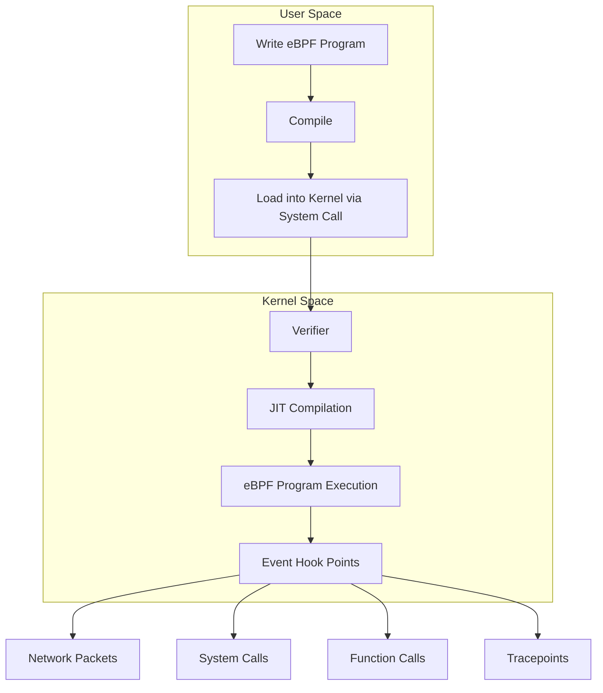
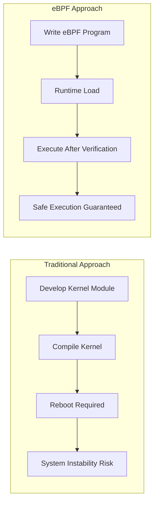
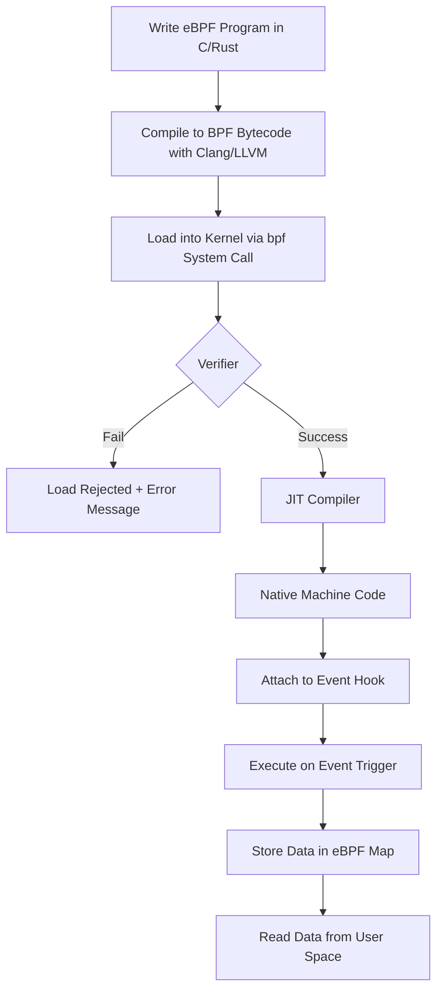
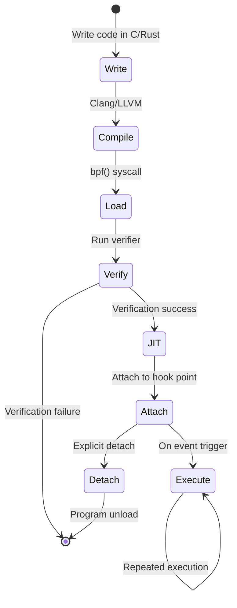
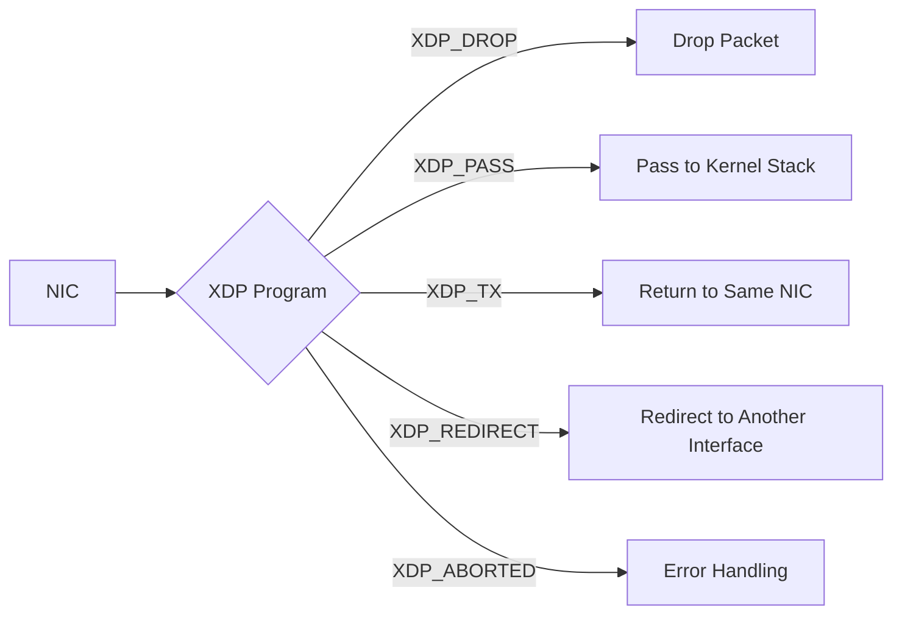
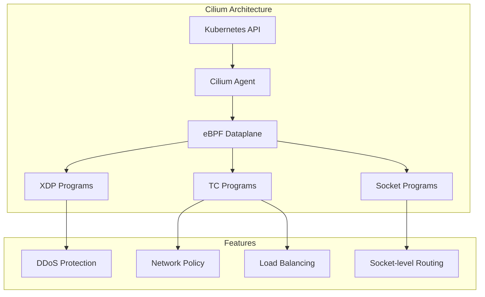
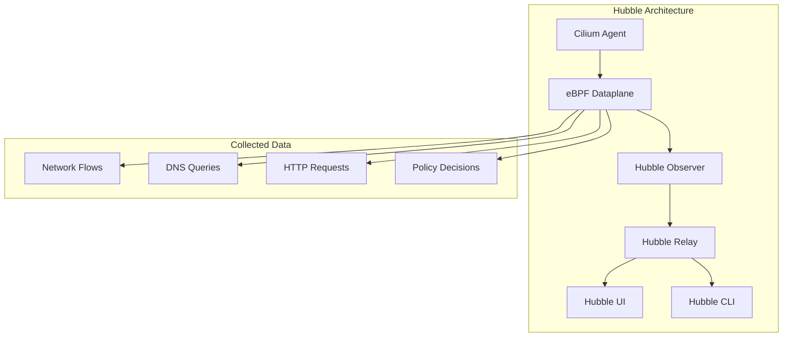
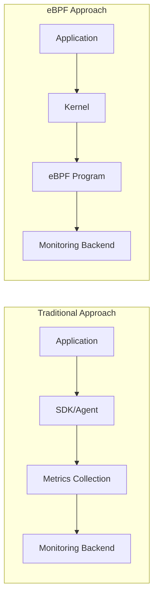
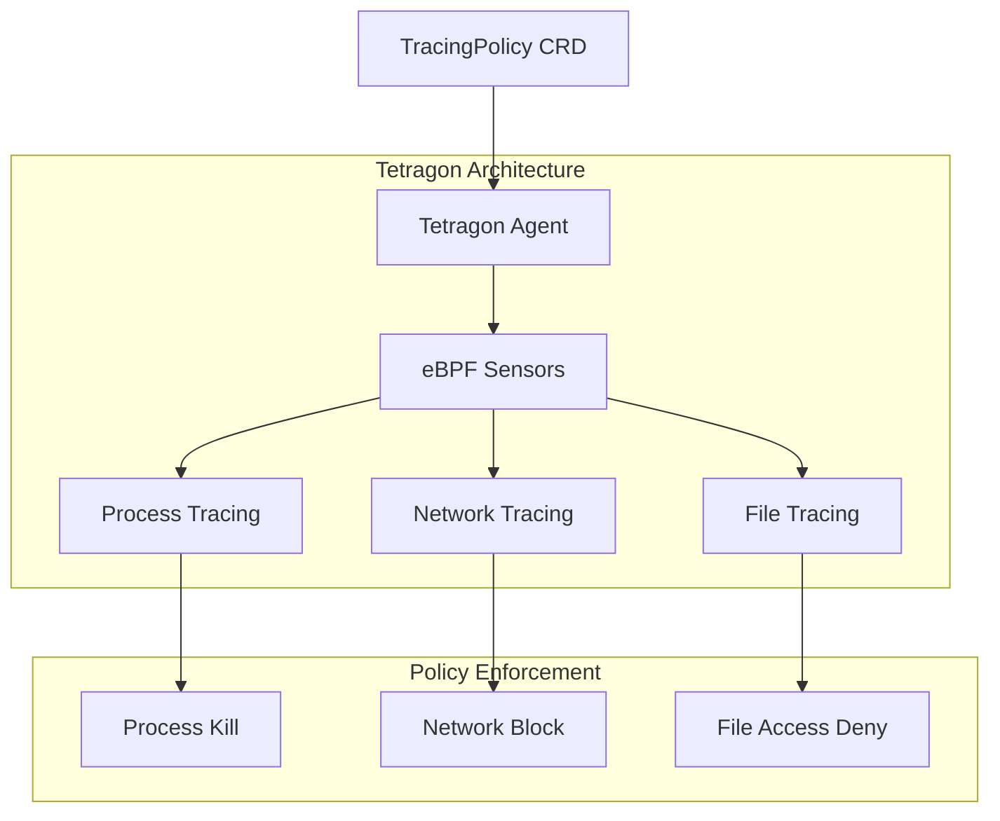

# eBPF Fundamentals and Kubernetes Applications

> **Supported versions**: Linux Kernel 4.18+, Kubernetes 1.25+
> **Last updated**: February 2025

eBPF is a revolutionary technology that allows sandboxed programs to run within the Linux kernel. This document covers everything from basic eBPF concepts to practical applications in Kubernetes environments.

## Table of Contents

* [1. Introduction to eBPF](#1-introduction-to-ebpf)
* [2. eBPF Architecture](#2-ebpf-architecture)
* [3. eBPF Program Types](#3-ebpf-program-types)
* [4. eBPF Development Tools](#4-ebpf-development-tools)
* [5. eBPF and Kubernetes Networking](#5-ebpf-and-kubernetes-networking)
* [6. eBPF-based Observability](#6-ebpf-based-observability)
* [7. eBPF-based Security](#7-ebpf-based-security)
* [8. Practical eBPF Examples](#8-practical-ebpf-examples)
* [9. eBPF Limitations and Considerations](#9-ebpf-limitations-and-considerations)
* [10. Next Steps](#10-next-steps)

## Lab Environment Setup

To follow along with the examples in this document, you need the following environment.

### Prerequisites
- Linux kernel 4.18 or higher (5.10+ recommended)
- bpftool, bcc-tools
- Kubernetes cluster (optional)

### Environment Setup

```bash
# Install required packages on Ubuntu/Debian
sudo apt-get update
sudo apt-get install -y linux-tools-common linux-tools-generic bpfcc-tools

# Check kernel version
uname -r

# Verify eBPF feature support
sudo bpftool feature
```

---

## 1. Introduction to eBPF

### 1.1 What is eBPF?

**eBPF (extended Berkeley Packet Filter)** is a technology that allows user-defined programs to run safely within the Linux kernel. Originally designed for network packet filtering as BPF, it has been extended and is now used in various areas including networking, security, tracing, and performance analysis.

> **Key Concept**: eBPF allows you to extend and observe kernel behavior without modifying kernel source code or loading kernel modules.



### 1.2 Evolution from Traditional BPF to eBPF

**Original BPF (1992)**:
- Developed at UC Berkeley
- Dedicated to network packet capture and filtering
- 2 32-bit registers
- Maximum 4,096 instruction limit

**eBPF (2014~)**:
- 64-bit architecture support
- 11 registers
- State storage through Maps
- Various hook point support
- Native performance through JIT compilation

| Feature | Traditional BPF | eBPF |
|---------|-----------------|------|
| Registers | 2 (32-bit) | 11 (64-bit) |
| Instruction count | 4,096 | 1 million+ |
| Map support | None | Various map types |
| Use case | Packet filtering | General-purpose kernel programming |
| Call capabilities | None | Helper functions, BPF-to-BPF calls |
| State storage | Not possible | Possible through maps |

### 1.3 Why eBPF is Revolutionary

eBPF is revolutionary for the following reasons:

1. **Feature extension without kernel modification**: Extend kernel features without changing kernel source code
2. **Safe execution**: Verifier guarantees program safety
3. **High performance**: Native code-level performance through JIT compilation
4. **Dynamic loading**: Load/unload programs without reboot
5. **Production stability**: Safe execution without crashes or infinite loops



### 1.4 eBPF vs Kernel Module Comparison

| Aspect | eBPF | Kernel Module |
|--------|------|---------------|
| **Safety** | Verifier guarantees safety | Can crash kernel |
| **Portability** | Kernel version independent with CO-RE | Requires recompilation per kernel version |
| **Loading** | Dynamic load/unload | Requires insmod/rmmod |
| **Privileges** | CAP_BPF or CAP_SYS_ADMIN | Root privileges required |
| **Debugging** | Limited | Full kernel debugging possible |
| **Performance** | Optimized through JIT compilation | Native performance |
| **Feature scope** | Only designated hook points | Unlimited |
| **Development difficulty** | Relatively easy | High expertise required |

---

## 2. eBPF Architecture

### 2.1 eBPF Execution Flow



### 2.2 Verifier

The verifier is a core security mechanism of eBPF. It verifies the following before a program runs in the kernel:

**Verification Items**:
- No infinite loops (DAG structure check)
- No out-of-bounds memory access
- No use of uninitialized variables
- Correct helper function calls
- Program termination guaranteed

```c
// Example rejected by verifier
int bad_example(void *ctx) {
    int i;
    for (i = 0; i < 1000000; i++) {  // Potential infinite loop
        // ...
    }
    return 0;
}

// Example allowed by verifier
int good_example(void *ctx) {
    #pragma unroll
    for (int i = 0; i < 10; i++) {  // Unrolled at compile time
        // ...
    }
    return 0;
}
```

### 2.3 JIT Compiler

The JIT (Just-In-Time) compiler converts eBPF bytecode to native machine code:

```bash
# Check JIT compiler status
cat /proc/sys/net/core/bpf_jit_enable

# Enable JIT compiler (0: disabled, 1: enabled, 2: debug mode)
echo 1 | sudo tee /proc/sys/net/core/bpf_jit_enable
```

**JIT Compilation Benefits**:
- 4-5x performance improvement over interpreter
- Direct execution as native CPU instructions
- Architecture-specific optimizations applied

### 2.4 eBPF Maps

eBPF maps are data structures for sharing data between kernel and user space and storing state.

**Main Map Types**:

| Map Type | Description | Use Case |
|----------|-------------|----------|
| `BPF_MAP_TYPE_HASH` | Hash table | Key-value storage, connection tracking |
| `BPF_MAP_TYPE_ARRAY` | Fixed-size array | Index-based access, configuration values |
| `BPF_MAP_TYPE_PERF_EVENT_ARRAY` | Event array | Send events to user space |
| `BPF_MAP_TYPE_RINGBUF` | Ring buffer | High-performance event streaming |
| `BPF_MAP_TYPE_LRU_HASH` | LRU hash | Cache, automatic entry eviction |
| `BPF_MAP_TYPE_PERCPU_ARRAY` | Per-CPU array | Lock-free statistics collection |
| `BPF_MAP_TYPE_LPM_TRIE` | LPM trie | IP address matching, routing |

```c
// Hash map definition example
struct {
    __uint(type, BPF_MAP_TYPE_HASH);
    __uint(max_entries, 1024);
    __type(key, __u32);      // Key: Process ID
    __type(value, __u64);    // Value: Counter
} packet_count SEC(".maps");
```

### 2.5 Helper Functions

eBPF programs access kernel functions through helper functions provided by the kernel.

**Key Helper Functions**:

```c
// Map manipulation
void *bpf_map_lookup_elem(struct bpf_map *map, const void *key);
int bpf_map_update_elem(struct bpf_map *map, const void *key, const void *value, u64 flags);
int bpf_map_delete_elem(struct bpf_map *map, const void *key);

// Time-related
u64 bpf_ktime_get_ns(void);  // Current time in nanoseconds

// Packet manipulation
int bpf_skb_load_bytes(const struct sk_buff *skb, u32 offset, void *to, u32 len);
int bpf_xdp_adjust_head(struct xdp_md *xdp_md, int delta);

// Tracing
int bpf_probe_read(void *dst, u32 size, const void *src);
int bpf_trace_printk(const char *fmt, u32 fmt_size, ...);

// Process information
u64 bpf_get_current_pid_tgid(void);    // Get PID/TGID
u64 bpf_get_current_uid_gid(void);     // Get UID/GID
int bpf_get_current_comm(void *buf, u32 size);  // Process name
```

### 2.6 Program Lifecycle



---

## 3. eBPF Program Types

### 3.1 XDP (eXpress Data Path)

XDP is the fastest way to process packets at the network driver level.



**XDP Operation Modes**:
| Mode | Description | Performance |
|------|-------------|-------------|
| Native XDP | Runs directly in NIC driver | Highest |
| Offloaded XDP | Runs on smart NIC | Highest+ |
| Generic XDP | Software emulation | For testing |

```c
// XDP program example: Drop traffic on specific port
SEC("xdp")
int xdp_drop_port(struct xdp_md *ctx) {
    void *data = (void *)(long)ctx->data;
    void *data_end = (void *)(long)ctx->data_end;

    struct ethhdr *eth = data;
    if ((void *)(eth + 1) > data_end)
        return XDP_PASS;

    if (eth->h_proto != htons(ETH_P_IP))
        return XDP_PASS;

    struct iphdr *ip = (void *)(eth + 1);
    if ((void *)(ip + 1) > data_end)
        return XDP_PASS;

    if (ip->protocol != IPPROTO_TCP)
        return XDP_PASS;

    struct tcphdr *tcp = (void *)ip + (ip->ihl * 4);
    if ((void *)(tcp + 1) > data_end)
        return XDP_PASS;

    // Drop port 8080 traffic
    if (tcp->dest == htons(8080))
        return XDP_DROP;

    return XDP_PASS;
}
```

### 3.2 TC (Traffic Control)

TC programs run at the traffic control layer of the network stack.

```bash
# TC program attachment example
tc qdisc add dev eth0 clsact
tc filter add dev eth0 ingress bpf da obj tc_prog.o sec classifier
tc filter add dev eth0 egress bpf da obj tc_prog.o sec classifier
```

**TC vs XDP Comparison**:
| Feature | XDP | TC |
|---------|-----|-----|
| Execution location | Driver level | Network stack |
| Performance | Highest | High |
| SKB access | Not possible | Possible |
| Direction | Ingress only | Both ingress and egress |
| Packet modification | Limited | Flexible |

### 3.3 Kprobes/Uprobes

Kprobes and Uprobes dynamically trace function calls.

```c
// Kprobe example: Trace tcp_connect function
SEC("kprobe/tcp_connect")
int BPF_KPROBE(trace_tcp_connect, struct sock *sk) {
    u32 pid = bpf_get_current_pid_tgid() >> 32;

    // Get destination IP address
    u32 daddr = BPF_CORE_READ(sk, __sk_common.skc_daddr);
    u16 dport = BPF_CORE_READ(sk, __sk_common.skc_dport);

    bpf_printk("PID %d connecting to %pI4:%d\n", pid, &daddr, ntohs(dport));
    return 0;
}

// Uprobe example: Trace malloc function
SEC("uprobe/libc.so.6:malloc")
int BPF_UPROBE(trace_malloc, size_t size) {
    u32 pid = bpf_get_current_pid_tgid() >> 32;
    bpf_printk("PID %d malloc(%zu)\n", pid, size);
    return 0;
}
```

### 3.4 Tracepoints

Tracepoints are static trace points predefined in the kernel.

```bash
# Check available tracepoints
sudo ls /sys/kernel/debug/tracing/events/

# Tracepoints in specific categories
sudo ls /sys/kernel/debug/tracing/events/sched/
sudo ls /sys/kernel/debug/tracing/events/syscalls/
```

```c
// Tracepoint example: Trace process execution
SEC("tracepoint/sched/sched_process_exec")
int handle_exec(struct trace_event_raw_sched_process_exec *ctx) {
    char comm[16];
    bpf_get_current_comm(&comm, sizeof(comm));

    u32 pid = bpf_get_current_pid_tgid() >> 32;
    bpf_printk("Process started: %s (PID: %d)\n", comm, pid);

    return 0;
}
```

### 3.5 LSM (Linux Security Module) BPF

LSM BPF dynamically applies security policies.

```c
// LSM BPF example: Restrict file opening
SEC("lsm/file_open")
int BPF_PROG(restrict_file_open, struct file *file, int ret) {
    if (ret != 0)
        return ret;

    char path[256];
    bpf_d_path(&file->f_path, path, sizeof(path));

    // Block access to /etc/shadow
    if (bpf_strncmp(path, 11, "/etc/shadow") == 0)
        return -EACCES;

    return 0;
}
```

### 3.6 Socket Filter

Filters packets at the socket level.

```c
// Socket Filter example
SEC("socket")
int socket_filter(struct __sk_buff *skb) {
    // Allow only IPv4 packets
    if (skb->protocol != htons(ETH_P_IP))
        return 0;  // Drop

    return skb->len;  // Return packet length (allow)
}
```

### 3.7 Cgroup Programs

Controls container resources and networking.

```c
// Cgroup socket program example: Block external connections
SEC("cgroup/connect4")
int restrict_connect(struct bpf_sock_addr *ctx) {
    // Block connections that are not to local network
    __u32 dst = ctx->user_ip4;

    // Allow only 10.0.0.0/8 range
    if ((dst & 0xFF) != 10)
        return 0;  // Deny connection

    return 1;  // Allow connection
}
```

---

## 4. eBPF Development Tools

### 4.1 bpftool

bpftool is the official tool for managing eBPF programs and maps.

```bash
# List loaded eBPF programs
sudo bpftool prog list

# Program details
sudo bpftool prog show id <ID>

# Program dump (bytecode)
sudo bpftool prog dump xlated id <ID>

# JIT compiled code dump
sudo bpftool prog dump jited id <ID>

# Map list
sudo bpftool map list

# Query map contents
sudo bpftool map dump id <MAP_ID>

# Add value to map
sudo bpftool map update id <MAP_ID> key 0x01 0x00 0x00 0x00 value 0xFF 0x00 0x00 0x00

# Check kernel eBPF features
sudo bpftool feature

# BTF (BPF Type Format) information
sudo bpftool btf list
```

### 4.2 bpftrace

bpftrace is a high-level tracing language in DTrace style.

```bash
# Installation
sudo apt-get install -y bpftrace

# System call count
sudo bpftrace -e 'tracepoint:raw_syscalls:sys_enter { @[comm] = count(); }'

# Read bytes per process
sudo bpftrace -e 'tracepoint:syscalls:sys_exit_read /args->ret > 0/ { @bytes[comm] = sum(args->ret); }'

# File open tracing
sudo bpftrace -e 'tracepoint:syscalls:sys_enter_openat { printf("%s opened %s\n", comm, str(args->filename)); }'

# TCP connection tracing
sudo bpftrace -e 'kprobe:tcp_connect { printf("%s -> %s\n", ntop(((struct sock *)arg0)->__sk_common.skc_rcv_saddr), ntop(((struct sock *)arg0)->__sk_common.skc_daddr)); }'

# Latency histogram
sudo bpftrace -e 'kprobe:vfs_read { @start[tid] = nsecs; } kretprobe:vfs_read /@start[tid]/ { @ns = hist(nsecs - @start[tid]); delete(@start[tid]); }'
```

**Useful bpftrace One-liners**:

```bash
# Top CPU-consuming processes
sudo bpftrace -e 'profile:hz:99 { @[comm] = count(); }'

# Block I/O latency
sudo bpftrace -e 'tracepoint:block:block_rq_issue { @start[args->dev, args->sector] = nsecs; } tracepoint:block:block_rq_complete /@start[args->dev, args->sector]/ { @usecs = hist((nsecs - @start[args->dev, args->sector]) / 1000); delete(@start[args->dev, args->sector]); }'

# New process tracing
sudo bpftrace -e 'tracepoint:sched:sched_process_exec { printf("%-10d %-16s\n", pid, comm); }'

# Memory allocation tracing
sudo bpftrace -e 'tracepoint:kmem:kmalloc { @bytes = hist(args->bytes_alloc); }'
```

### 4.3 BCC (BPF Compiler Collection)

BCC is a toolkit that allows writing eBPF programs through Python and Lua.

```bash
# Installation
sudo apt-get install -y bpfcc-tools python3-bpfcc

# Included tools
ls /usr/share/bcc/tools/
```

**Key BCC Tools**:

| Tool | Description |
|------|-------------|
| `execsnoop` | Trace new process executions |
| `opensnoop` | Trace file opens |
| `biolatency` | Block I/O latency |
| `tcpconnect` | Trace TCP connections |
| `tcpaccept` | Trace TCP incoming connections |
| `tcpretrans` | Trace TCP retransmissions |
| `runqlat` | CPU run queue latency |
| `profile` | CPU profiling |
| `funccount` | Function call counts |
| `trace` | General function tracing |

```bash
# Usage examples
sudo /usr/share/bcc/tools/execsnoop    # Trace process execution
sudo /usr/share/bcc/tools/tcpconnect   # Trace TCP connections
sudo /usr/share/bcc/tools/biolatency   # Disk I/O latency
sudo /usr/share/bcc/tools/profile -F 99 10  # CPU profiling for 10 seconds
```

### 4.4 libbpf and CO-RE

libbpf is a C library for loading eBPF programs and supports CO-RE (Compile Once, Run Everywhere).

**CO-RE Benefits**:
- Run compiled eBPF programs on various kernel versions
- Struct relocation using BTF (BPF Type Format)
- Reduced kernel header dependencies

```c
// Example using CO-RE
#include "vmlinux.h"
#include <bpf/bpf_helpers.h>
#include <bpf/bpf_core_read.h>

SEC("kprobe/do_sys_open")
int BPF_KPROBE(do_sys_open, int dfd, const char *filename) {
    u32 pid = bpf_get_current_pid_tgid() >> 32;

    char fname[256];
    bpf_probe_read_user_str(fname, sizeof(fname), filename);

    bpf_printk("PID %d opened: %s\n", pid, fname);
    return 0;
}

char LICENSE[] SEC("license") = "GPL";
```

**BTF Generation and Verification**:

```bash
# Check BTF support
ls /sys/kernel/btf/vmlinux

# Generate vmlinux.h (for CO-RE development)
bpftool btf dump file /sys/kernel/btf/vmlinux format c > vmlinux.h

# Check program BTF information
bpftool prog show id <ID> --pretty
```

---

## 5. eBPF and Kubernetes Networking

### 5.1 Cilium: eBPF-based CNI

Cilium is the most representative Kubernetes CNI (Container Network Interface) utilizing eBPF.



#### kube-proxy Replacement

Cilium can completely replace kube-proxy using eBPF.

**Traditional kube-proxy (iptables mode)**:
```
Packet → Netfilter → iptables rule evaluation → DNAT → Routing
```

**Cilium eBPF mode**:
```
Packet → eBPF map lookup → Direct routing
```

```bash
# Install Cilium (kube-proxy replacement mode)
helm install cilium cilium/cilium --version 1.14.0 \
  --namespace kube-system \
  --set kubeProxyReplacement=strict \
  --set k8sServiceHost=${API_SERVER_IP} \
  --set k8sServicePort=${API_SERVER_PORT}

# Remove kube-proxy
kubectl -n kube-system delete ds kube-proxy
kubectl -n kube-system delete cm kube-proxy
```

#### Network Policy

Cilium applies L3/L4/L7 network policies using eBPF.

```yaml
# Cilium network policy example
apiVersion: cilium.io/v2
kind: CiliumNetworkPolicy
metadata:
  name: allow-http-only
spec:
  endpointSelector:
    matchLabels:
      app: web
  ingress:
    - fromEndpoints:
        - matchLabels:
            app: frontend
      toPorts:
        - ports:
            - port: "80"
              protocol: TCP
          rules:
            http:
              - method: GET
                path: "/api/.*"
```

#### Load Balancing

```yaml
# Cilium LoadBalancer service example
apiVersion: v1
kind: Service
metadata:
  name: my-service
  annotations:
    io.cilium/lb-ipam-ips: "192.168.1.100"
spec:
  type: LoadBalancer
  selector:
    app: my-app
  ports:
    - port: 80
      targetPort: 8080
```

### 5.2 Calico eBPF Mode

Calico also supports eBPF dataplane.

```bash
# Enable Calico eBPF mode
kubectl patch installation.operator.tigera.io default --type merge -p '{"spec":{"calicoNetwork":{"linuxDataplane":"BPF"}}}'
```

**Calico eBPF Mode Features**:
- Source IP preservation
- Direct Server Return (DSR) support
- Host endpoint policies
- Encrypted inter-node communication

### 5.3 Performance Comparison: iptables vs eBPF

| Aspect | iptables | eBPF |
|--------|----------|------|
| **Scalability** | O(n) - proportional to service count | O(1) - map lookup |
| **Latency** | Increases with rule count | Constant |
| **CPU usage** | High | Low |
| **Updates** | Full table rewrite | Map entry update |
| **Observability** | Limited | Hubble integration |
| **Memory** | Memory per rule | Optimized map structure |

**Benchmark Results** (based on 1000 services):

```
| Metric                  | iptables    | eBPF      | Improvement |
|------------------------|-------------|-----------|-------------|
| Connection setup time  | 2.5ms       | 0.3ms     | 8.3x        |
| CPU usage              | 15%         | 3%        | 5x          |
| Memory usage           | 256MB       | 32MB      | 8x          |
| Connections per second | 50,000      | 250,000   | 5x          |
```

```bash
# Check Cilium status
cilium status

# Check eBPF maps
cilium bpf lb list
cilium bpf ct list global

# Network policy status
cilium policy get
```

---

## 6. eBPF-based Observability

eBPF enables deep observation of system and application behavior. Unlike traditional agent-based monitoring, eBPF collects data at the kernel level, providing richer information with lower overhead.

### 6.1 Hubble: Cilium Network Observability

Hubble is a network observability platform built into Cilium.



```bash
# Install Hubble
helm upgrade cilium cilium/cilium --version 1.14.0 \
  --namespace kube-system \
  --reuse-values \
  --set hubble.relay.enabled=true \
  --set hubble.ui.enabled=true

# Use Hubble CLI
hubble observe --pod my-pod
hubble observe --namespace default
hubble observe --protocol http
hubble observe --verdict DROPPED

# Observe traffic between specific services
hubble observe --from-pod default/frontend --to-pod default/backend

# Real-time network flow monitoring
hubble observe -f --type trace

# Generate service map
hubble observe --namespace default -o jsonpb | hubble relay --serviceMap
```

**Accessing Hubble UI**:

```bash
# Port forwarding
kubectl port-forward -n kube-system svc/hubble-ui 12000:80

# Access http://localhost:12000 in browser
```

### 6.2 Pixie: Auto-instrumentation Observability

Pixie uses eBPF to automatically collect telemetry without application code modification.

**Pixie Features**:
- Automatic protocol parsing (HTTP, gRPC, MySQL, PostgreSQL, Kafka, etc.)
- Automatic service map generation
- Distributed tracing
- CPU profiling
- Dynamic logging

```bash
# Install Pixie
px deploy

# Pixie CLI query examples
# HTTP request latency
px script run px/http_data

# Traffic between services
px script run px/service_stats

# Slow request analysis
px script run px/slow_requests -- start_time=-5m latency_ns=100000000

# Pod resource usage
px script run px/pod_stats
```

**PxL (Pixie Query Language) Example**:

```python
# Find slow HTTP requests
import px

df = px.DataFrame(table='http_events', start_time='-5m')
df = df[df.latency > 100000000]  # Over 100ms
df = df.groupby(['service', 'req_path']).agg(
    count=('latency', px.count),
    avg_latency=('latency', px.mean),
    p99_latency=('latency', px.quantiles, 0.99)
)
px.display(df)
```

### 6.3 Coroot: "No-Code" Monitoring

Coroot uses eBPF to automatically monitor systems without additional configuration.

```bash
# Install Coroot with Helm
helm repo add coroot https://coroot.github.io/helm-charts
helm install coroot coroot/coroot -n coroot --create-namespace
```

**Coroot Features**:
- Automatic service discovery
- Automatic dependency map generation
- SLO monitoring
- Anomaly detection
- Root cause analysis

### 6.4 Kepler: Energy Consumption Monitoring

Kepler (Kubernetes-based Efficient Power Level Exporter) uses eBPF to monitor container energy consumption.

```bash
# Install Kepler
kubectl apply -f https://raw.githubusercontent.com/sustainable-computing-io/kepler/main/manifests/kubernetes/deployment.yaml

# Check Prometheus metrics
curl localhost:9103/metrics | grep kepler
```

**Kepler Metrics**:
- `kepler_container_joules_total`: Energy consumption per container
- `kepler_container_gpu_joules_total`: GPU energy consumption
- `kepler_node_core_joules_total`: Node CPU energy

### 6.5 Traditional Agents vs eBPF Instrumentation Comparison

| Aspect | Traditional Agents | eBPF Instrumentation |
|--------|-------------------|---------------------|
| **Overhead** | High (5-15%) | Low (<1%) |
| **Code modification** | Required (SDK/library) | Not required |
| **Coverage** | Only instrumented parts | Entire system |
| **Deployment** | Per application | Per node |
| **Privileges** | Normal privileges | CAP_BPF required |
| **Data depth** | Application level | Kernel level |
| **Protocol support** | Explicit support needed | Automatic parsing |



---

## 7. eBPF-based Security

### 7.1 Tetragon: Runtime Security

Tetragon is an eBPF-based runtime security solution provided by the Cilium project.



```bash
# Install Tetragon
helm repo add cilium https://helm.cilium.io
helm install tetragon cilium/tetragon -n kube-system

# Observe events
kubectl logs -n kube-system -l app.kubernetes.io/name=tetragon -c export-stdout -f | tetra getevents -o compact
```

**TracingPolicy Examples**:

```yaml
# Monitor sensitive file access
apiVersion: cilium.io/v1alpha1
kind: TracingPolicy
metadata:
  name: sensitive-file-access
spec:
  kprobes:
    - call: security_file_open
      syscall: false
      args:
        - index: 0
          type: file
      selectors:
        - matchArgs:
            - index: 0
              operator: Prefix
              values:
                - /etc/shadow
                - /etc/passwd
                - /etc/sudoers
          matchActions:
            - action: Sigkill  # Terminate process
```

```yaml
# Network connection control
apiVersion: cilium.io/v1alpha1
kind: TracingPolicy
metadata:
  name: restrict-outbound
spec:
  kprobes:
    - call: tcp_connect
      syscall: false
      args:
        - index: 0
          type: sock
      selectors:
        - matchArgs:
            - index: 0
              operator: NotEqual
              values:
                - "10.0.0.0/8"  # Internal network
          matchActions:
            - action: Sigkill
```

### 7.2 Falco: eBPF-based Anomaly Detection

Falco is a CNCF project that uses eBPF to detect runtime anomalous behavior.

```bash
# Install Falco (eBPF driver)
helm repo add falcosecurity https://falcosecurity.github.io/charts
helm install falco falcosecurity/falco \
  --namespace falco --create-namespace \
  --set driver.kind=modern_ebpf
```

**Falco Rule Examples**:

```yaml
# Detect reading of /etc/shadow
- rule: Read sensitive file
  desc: Detect reading of sensitive files
  condition: >
    open_read and
    fd.name in (/etc/shadow, /etc/sudoers) and
    not proc.name in (systemd, sudo, login)
  output: >
    Sensitive file opened (file=%fd.name user=%user.name
    process=%proc.name container=%container.name)
  priority: WARNING

# Detect shell execution in container
- rule: Shell in container
  desc: Detect shell execution in container
  condition: >
    spawned_process and
    container and
    proc.name in (bash, sh, zsh, dash) and
    proc.pname != containerd-shim
  output: >
    Shell spawned in container (container=%container.name
    shell=%proc.name parent=%proc.pname)
  priority: NOTICE

# Detect privilege escalation
- rule: Privilege escalation
  desc: Detect privilege escalation attempts
  condition: >
    spawned_process and
    proc.name in (sudo, su, doas) and
    container
  output: >
    Privilege escalation attempt (user=%user.name
    command=%proc.cmdline container=%container.name)
  priority: WARNING
```

### 7.3 seccomp-bpf: System Call Filtering

seccomp-bpf uses BPF to restrict which system calls a process can make.

```yaml
# Apply seccomp profile in Kubernetes Pod
apiVersion: v1
kind: Pod
metadata:
  name: secure-pod
spec:
  securityContext:
    seccompProfile:
      type: RuntimeDefault  # or Localhost
  containers:
    - name: app
      image: nginx
```

**Custom seccomp Profile**:

```json
{
  "defaultAction": "SCMP_ACT_ERRNO",
  "architectures": ["SCMP_ARCH_X86_64"],
  "syscalls": [
    {
      "names": ["read", "write", "open", "close", "stat", "fstat", "mmap", "mprotect", "munmap", "brk", "rt_sigaction", "rt_sigprocmask", "ioctl", "access", "pipe", "select", "sched_yield", "mremap", "msync", "mincore", "madvise", "shmget", "shmat", "shmctl", "dup", "dup2", "pause", "nanosleep", "getitimer", "alarm", "setitimer", "getpid", "socket", "connect", "accept", "sendto", "recvfrom", "bind", "listen", "getsockname", "getpeername", "socketpair", "setsockopt", "getsockopt", "clone", "fork", "vfork", "execve", "exit", "wait4", "kill", "uname", "fcntl", "flock", "fsync", "fdatasync", "truncate", "ftruncate", "getdents", "getcwd", "chdir", "rename", "mkdir", "rmdir", "creat", "link", "unlink", "symlink", "readlink", "chmod", "fchmod", "chown", "fchown", "lchown", "umask", "gettimeofday", "getrlimit", "getrusage", "sysinfo", "times", "ptrace", "getuid", "syslog", "getgid", "setuid", "setgid", "geteuid", "getegid", "setpgid", "getppid", "getpgrp", "setsid", "setreuid", "setregid", "getgroups", "setgroups", "setresuid", "getresuid", "setresgid", "getresgid", "getpgid", "setfsuid", "setfsgid", "getsid", "capget", "capset", "rt_sigpending", "rt_sigtimedwait", "rt_sigqueueinfo", "rt_sigsuspend", "sigaltstack", "utime", "mknod", "personality", "ustat", "statfs", "fstatfs", "sysfs", "getpriority", "setpriority", "sched_setparam", "sched_getparam", "sched_setscheduler", "sched_getscheduler", "sched_get_priority_max", "sched_get_priority_min", "sched_rr_get_interval", "mlock", "munlock", "mlockall", "munlockall", "vhangup", "pivot_root", "prctl", "arch_prctl", "adjtimex", "setrlimit", "chroot", "sync", "acct", "settimeofday", "mount", "umount2", "swapon", "swapoff", "reboot", "sethostname", "setdomainname", "ioperm", "iopl", "create_module", "init_module", "delete_module", "get_kernel_syms", "query_module", "quotactl", "nfsservctl", "getpmsg", "putpmsg", "afs_syscall", "tuxcall", "security", "gettid", "readahead", "setxattr", "lsetxattr", "fsetxattr", "getxattr", "lgetxattr", "fgetxattr", "listxattr", "llistxattr", "flistxattr", "removexattr", "lremovexattr", "fremovexattr", "tkill", "time", "futex", "sched_setaffinity", "sched_getaffinity", "set_thread_area", "io_setup", "io_destroy", "io_getevents", "io_submit", "io_cancel", "get_thread_area", "lookup_dcookie", "epoll_create", "epoll_ctl_old", "epoll_wait_old", "remap_file_pages", "getdents64", "set_tid_address", "restart_syscall", "semtimedop", "fadvise64", "timer_create", "timer_settime", "timer_gettime", "timer_getoverrun", "timer_delete", "clock_settime", "clock_gettime", "clock_getres", "clock_nanosleep", "exit_group", "epoll_wait", "epoll_ctl", "tgkill", "utimes", "vserver", "mbind", "set_mempolicy", "get_mempolicy", "mq_open", "mq_unlink", "mq_timedsend", "mq_timedreceive", "mq_notify", "mq_getsetattr", "kexec_load", "waitid", "add_key", "request_key", "keyctl", "ioprio_set", "ioprio_get", "inotify_init", "inotify_add_watch", "inotify_rm_watch", "migrate_pages", "openat", "mkdirat", "mknodat", "fchownat", "futimesat", "newfstatat", "unlinkat", "renameat", "linkat", "symlinkat", "readlinkat", "fchmodat", "faccessat", "pselect6", "ppoll", "unshare", "set_robust_list", "get_robust_list", "splice", "tee", "sync_file_range", "vmsplice", "move_pages", "utimensat", "epoll_pwait", "signalfd", "timerfd_create", "eventfd", "fallocate", "timerfd_settime", "timerfd_gettime", "accept4", "signalfd4", "eventfd2", "epoll_create1", "dup3", "pipe2", "inotify_init1", "preadv", "pwritev", "rt_tgsigqueueinfo", "perf_event_open", "recvmmsg", "fanotify_init", "fanotify_mark", "prlimit64", "name_to_handle_at", "open_by_handle_at", "clock_adjtime", "syncfs", "sendmmsg", "setns", "getcpu", "process_vm_readv", "process_vm_writev", "kcmp", "finit_module", "sched_setattr", "sched_getattr", "renameat2", "seccomp", "getrandom", "memfd_create", "kexec_file_load", "bpf"],
      "action": "SCMP_ACT_ALLOW"
    }
  ]
}
```

### 7.4 LSM BPF: Dynamic Security Policies

LSM BPF combines Linux Security Module with eBPF to dynamically apply security policies.

```c
// LSM BPF example: Restrict executable files
SEC("lsm/bprm_check_security")
int BPF_PROG(restrict_exec, struct linux_binprm *bprm, int ret) {
    char filename[256];
    bpf_probe_read_kernel_str(filename, sizeof(filename), bprm->filename);

    // Block execution from /tmp
    if (bpf_strncmp(filename, 5, "/tmp/") == 0)
        return -EPERM;

    return 0;
}

// LSM BPF example: Restrict network sockets
SEC("lsm/socket_connect")
int BPF_PROG(restrict_connect, struct socket *sock, struct sockaddr *address, int addrlen, int ret) {
    if (ret != 0)
        return ret;

    struct sockaddr_in *addr = (struct sockaddr_in *)address;

    // Block connection to specific port
    if (ntohs(addr->sin_port) == 6666)
        return -EACCES;

    return 0;
}
```

---

## 8. Practical eBPF Examples

### 8.1 System Performance Analysis with bpftrace

**TCP Connection Tracing**:

```bash
# TCP connection tracing
sudo bpftrace -e '
tracepoint:tcp:tcp_connect {
    printf("%s -> %s:%d\n",
        ntop(args->saddr),
        ntop(args->daddr),
        args->dport);
}'
```

**System Call Latency Analysis**:

```bash
# Read system call latency histogram
sudo bpftrace -e '
tracepoint:syscalls:sys_enter_read { @start[tid] = nsecs; }
tracepoint:syscalls:sys_exit_read /@start[tid]/ {
    @latency = hist((nsecs - @start[tid]) / 1000);
    delete(@start[tid]);
}'
```

**Disk I/O Analysis**:

```bash
# Block I/O request tracing
sudo bpftrace -e '
tracepoint:block:block_rq_issue {
    printf("%s %s %d\n",
        comm,
        args->rwbs,
        args->bytes / 1024);
}'

# I/O latency histogram
sudo bpftrace -e '
tracepoint:block:block_rq_issue { @start[args->dev, args->sector] = nsecs; }
tracepoint:block:block_rq_complete /@start[args->dev, args->sector]/ {
    @us = hist((nsecs - @start[args->dev, args->sector]) / 1000);
    delete(@start[args->dev, args->sector]);
}'
```

### 8.2 Network Flow Observation with Cilium Hubble

```bash
# Real-time network flow observation
hubble observe -f

# Specific namespace traffic
hubble observe --namespace production

# Filter HTTP traffic only
hubble observe --protocol http

# Analyze dropped packets
hubble observe --verdict DROPPED

# DNS query tracing
hubble observe --protocol dns

# Traffic between specific Pods
hubble observe --from-pod default/frontend --to-pod default/backend

# Detailed analysis with JSON output
hubble observe --namespace default -o json | jq '.flow.destination.pod_name'

# Flow statistics
hubble observe --namespace default -o jsonpb | \
  jq -r '.flow | "\(.source.pod_name // .source.identity) -> \(.destination.pod_name // .destination.identity)"' | \
  sort | uniq -c | sort -rn | head -20
```

### 8.3 Process Security Monitoring with Tetragon

```bash
# Real-time Tetragon event monitoring
kubectl logs -n kube-system -l app.kubernetes.io/name=tetragon -c export-stdout -f | \
  tetra getevents -o compact

# Filter process execution events only
kubectl logs -n kube-system -l app.kubernetes.io/name=tetragon -c export-stdout -f | \
  tetra getevents -o compact --process-filter

# Events from specific namespace
kubectl logs -n kube-system -l app.kubernetes.io/name=tetragon -c export-stdout -f | \
  tetra getevents -o json | jq 'select(.process_exec.process.pod.namespace == "default")'
```

**File Access Monitoring Policy**:

```yaml
apiVersion: cilium.io/v1alpha1
kind: TracingPolicy
metadata:
  name: file-access-monitor
spec:
  kprobes:
    - call: security_file_open
      syscall: false
      return: false
      args:
        - index: 0
          type: file
      selectors:
        - matchArgs:
            - index: 0
              operator: Prefix
              values:
                - /etc/
                - /var/run/secrets/
          matchActions:
            - action: Post
```

### 8.4 Latency Analysis with eBPF

**Service Response Time Measurement**:

```bash
# HTTP request latency tracing (BCC)
sudo /usr/share/bcc/tools/funclatency 'c:read' -i 1

# TCP handshake latency
sudo bpftrace -e '
kprobe:tcp_v4_connect { @start[tid] = nsecs; }
kretprobe:tcp_v4_connect /@start[tid]/ {
    @connect_latency_us = hist((nsecs - @start[tid]) / 1000);
    delete(@start[tid]);
}'

# DNS lookup latency
sudo bpftrace -e '
tracepoint:net:net_dev_xmit /args->protocol == 0x0800/ {
    @dns_start[args->skbaddr] = nsecs;
}
tracepoint:net:netif_receive_skb /args->protocol == 0x0800 && @dns_start[args->skbaddr]/ {
    @dns_latency = hist((nsecs - @dns_start[args->skbaddr]) / 1000);
    delete(@dns_start[args->skbaddr]);
}'
```

**Application Performance Analysis Script**:

```bash
#!/bin/bash
# app-latency-analysis.bt

sudo bpftrace -e '
BEGIN {
    printf("Tracing application latency... Hit Ctrl-C to end.\n");
}

uprobe:/usr/lib/x86_64-linux-gnu/libc.so.6:malloc {
    @malloc_start[tid] = nsecs;
}

uretprobe:/usr/lib/x86_64-linux-gnu/libc.so.6:malloc /@malloc_start[tid]/ {
    @malloc_ns = hist(nsecs - @malloc_start[tid]);
    delete(@malloc_start[tid]);
}

kprobe:tcp_sendmsg {
    @send_start[tid] = nsecs;
}

kretprobe:tcp_sendmsg /@send_start[tid]/ {
    @tcp_send_ns = hist(nsecs - @send_start[tid]);
    delete(@send_start[tid]);
}

END {
    printf("\n=== Malloc Latency ===\n");
    print(@malloc_ns);
    printf("\n=== TCP Send Latency ===\n");
    print(@tcp_send_ns);
}
'
```

---

## 9. eBPF Limitations and Considerations

### 9.1 Technical Limitations

| Limitation | Value | Description |
|------------|-------|-------------|
| **Stack size** | 512 bytes | Local variable storage space limit |
| **Max instructions** | 1 million | Program complexity limit |
| **Max nested calls** | 8 levels | BPF-to-BPF function call depth |
| **Map entry count** | Varies by map type | Depends on memory limits |
| **Program size** | Varies by map type | Limited after JIT compilation |

**Stack Size Limit Workaround**:

```c
// Bad example: Exceeds stack size
int bad_function(void *ctx) {
    char buffer[1024];  // Exceeds stack size!
    return 0;
}

// Good example: Use map
struct {
    __uint(type, BPF_MAP_TYPE_PERCPU_ARRAY);
    __uint(max_entries, 1);
    __type(key, __u32);
    __type(value, char[1024]);
} buffer_map SEC(".maps");

int good_function(void *ctx) {
    __u32 key = 0;
    char *buffer = bpf_map_lookup_elem(&buffer_map, &key);
    if (!buffer)
        return 0;
    // Use buffer
    return 0;
}
```

### 9.2 Loop Limitations

The eBPF verifier limits loops to guarantee program termination.

```c
// Rejected by verifier: Unbounded loop
for (int i = 0; i < n; i++) {  // n is determined at runtime
    // ...
}

// Allowed by verifier: Bounded loop (kernel 5.3+)
#pragma clang loop unroll(disable)
for (int i = 0; i < 100 && i < n; i++) {  // Upper bound specified
    // ...
}

// Allowed by verifier: Compile-time unrolling
#pragma unroll
for (int i = 0; i < 10; i++) {
    // ...
}

// Using bpf_loop helper (kernel 5.17+)
static int callback(u32 index, void *ctx) {
    // Iteration work
    return 0;
}

int main_prog(void *ctx) {
    bpf_loop(1000, callback, NULL, 0);
    return 0;
}
```

### 9.3 Kernel Version Compatibility

| Feature | Minimum Kernel Version |
|---------|----------------------|
| Basic eBPF | 3.18 |
| XDP | 4.8 |
| BTF | 4.18 |
| CO-RE | 5.2 |
| BPF ring buffer | 5.8 |
| BPF loops | 5.3 |
| LSM BPF | 5.7 |
| bpf_loop helper | 5.17 |

```bash
# Check kernel version
uname -r

# Check eBPF feature support
sudo bpftool feature probe kernel

# Check BTF support
ls /sys/kernel/btf/vmlinux
```

### 9.4 Debugging Challenges

Debugging eBPF programs differs from traditional methods:

**Debugging Methods**:

```c
// bpf_printk (for debugging, impacts performance)
bpf_printk("value = %d\n", value);

// Check debug messages
sudo cat /sys/kernel/debug/tracing/trace_pipe
```

```bash
# Check verifier log (on load failure)
sudo bpftool prog load my_prog.o /sys/fs/bpf/my_prog -d

# Check program statistics
sudo bpftool prog show id <ID> --json | jq '.run_time_ns, .run_cnt'

# Dump map contents
sudo bpftool map dump id <MAP_ID>
```

### 9.5 Privilege Requirements

| Privilege | Purpose |
|-----------|---------|
| `CAP_BPF` | Load eBPF programs (kernel 5.8+) |
| `CAP_SYS_ADMIN` | Traditional eBPF privileges |
| `CAP_PERFMON` | Attach to performance monitoring events |
| `CAP_NET_ADMIN` | Attach XDP/TC programs |

```bash
# Check privileges
capsh --print

# Run program with specific privileges
sudo setcap cap_bpf,cap_perfmon+ep ./my_bpf_loader
```

**Privilege Configuration in Kubernetes**:

```yaml
apiVersion: v1
kind: Pod
metadata:
  name: ebpf-pod
spec:
  containers:
    - name: ebpf-container
      image: my-ebpf-app
      securityContext:
        capabilities:
          add:
            - BPF
            - PERFMON
            - NET_ADMIN
        privileged: false
      volumeMounts:
        - name: bpf-maps
          mountPath: /sys/fs/bpf
        - name: debug
          mountPath: /sys/kernel/debug
  volumes:
    - name: bpf-maps
      hostPath:
        path: /sys/fs/bpf
    - name: debug
      hostPath:
        path: /sys/kernel/debug
```

### 9.6 Security Considerations

While eBPF is a powerful tool, security risks exist:

- **Information leakage**: Can access sensitive data
- **DoS attacks**: Can cause performance degradation
- **Privilege escalation**: Vulnerabilities possible with misconfiguration

**Security Best Practices**:

```bash
# Disable unprivileged eBPF
echo 0 | sudo tee /proc/sys/kernel/unprivileged_bpf_disabled

# BPF security lockdown
echo 1 | sudo tee /proc/sys/kernel/bpf_spec_v1
echo 2 | sudo tee /proc/sys/kernel/bpf_spec_v4
```

---

## 10. Next Steps

### 10.1 Related Quiz

To verify your understanding of this document, try the following quiz:

- [eBPF Fundamentals Quiz](../../quizzes/basics/05-ebpf-fundamentals-quiz.md)

### 10.2 Advanced Learning Resources

**Official Documentation and Resources**:
- [eBPF.io](https://ebpf.io) - Official eBPF documentation
- [Cilium Documentation](https://docs.cilium.io) - Official Cilium documentation
- [BPF Performance Tools](https://www.brendangregg.com/bpf-performance-tools-book.html) - Brendan Gregg's BPF performance tools book

**Hands-on Environments**:
- [eBPF Tutorial](https://github.com/lizrice/learning-ebpf) - Liz Rice's eBPF tutorial
- [BCC Tutorial](https://github.com/iovisor/bcc/blob/master/docs/tutorial.md) - Official BCC tutorial
- [bpftrace Tutorial](https://github.com/iovisor/bpftrace/blob/master/docs/tutorial_one_liners.md) - bpftrace one-liner tutorial

**Community**:
- [eBPF Summit](https://ebpf.io/summit/) - Annual eBPF conference
- [Cilium Slack](https://cilium.io/slack) - Cilium community

### 10.3 Related Documents

For advanced content related to this document, refer to the following:

| Topic | Document Link | Description |
|-------|---------------|-------------|
| Cilium Introduction | [Cilium Overview](../../cilium/01-introduction.md) | eBPF-based CNI introduction |
| eBPF Deep Dive | [eBPF Technical Deep Dive](../../cilium/02-ebpf.md) | Advanced eBPF techniques |
| Networking | [Cilium Networking](../../cilium/03-networking.md) | eBPF networking implementation |
| Security | [Cilium Security](../../cilium/06-security-visibility.md) | eBPF-based security |
| Kubernetes Networking | [Kubernetes Networking](../core/05-networking.md) | Basic networking concepts |

### 10.4 Hands-on Checklist

Hands-on checklist for eBPF learning:

```
[ ] Use bpftool to check loaded eBPF programs
[ ] Run system call tracing with bpftrace
[ ] Analyze network traffic with BCC tools
[ ] Install Cilium and observe network with Hubble
[ ] Monitor security events with Tetragon
[ ] Write and load a simple XDP program
```

---

## Summary

eBPF is a revolutionary technology that allows safe extension and observation of Linux kernel behavior. Here is a summary of the key content covered in this document:

1. **eBPF Basic Concepts**: Sandboxed programs that run safely within the kernel
2. **Architecture**: Composed of verifier, JIT compiler, maps, and helper functions
3. **Program Types**: XDP, TC, Kprobes, Tracepoints, LSM BPF, etc.
4. **Development Tools**: bpftool, bpftrace, BCC, libbpf
5. **Kubernetes Applications**: High-performance networking with Cilium, Calico eBPF mode
6. **Observability**: Deep system observation through Hubble, Pixie, Coroot
7. **Security**: Runtime security through Tetragon, Falco, seccomp-bpf
8. **Limitations**: Consider stack size, loops, kernel version compatibility

eBPF is a core technology leading the future of networking, security, and observability in cloud-native environments.
