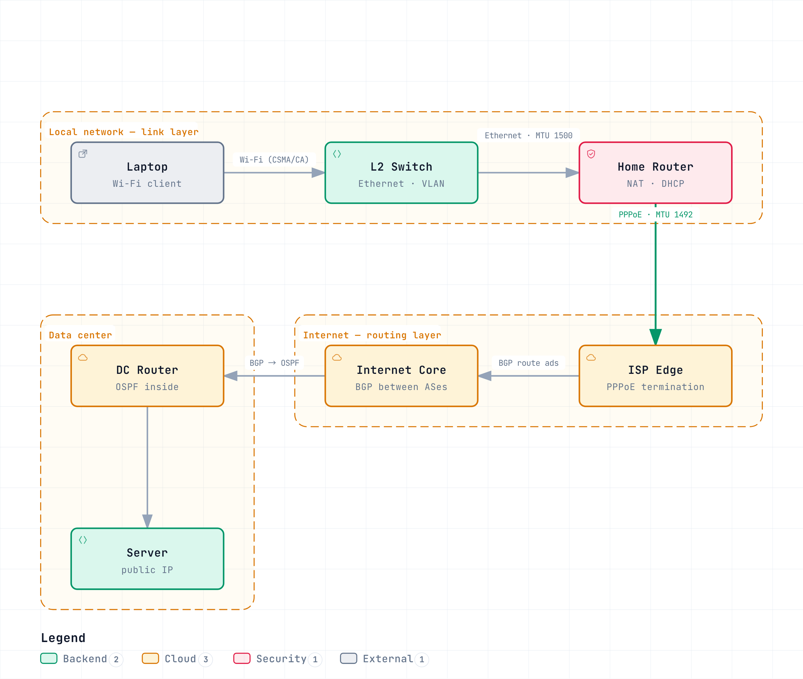

# Network Fundamentals Part 1 — The Layer Model, Link and Routing Layers

> **Last Updated**: August 28, 2026

::: tip This is a four-part series
**Part 1: The Layer Model, Link and Routing Layers** *(this document)* ·
[Part 2: The Transport Layer and TLS](./06-network-fundamentals-part2.md) ·
[Part 3: Application Protocols](./06-network-fundamentals-part3.md) ·
[Part 4: A Request's Journey and the Cloud](./06-network-fundamentals-part4.md)
:::

The moment you type an address into a browser and press Enter, at least ten protocols fire in sequence. We usually only think about one of them — HTTP — but when something breaks, the failure is almost always in the other nine.

This document walks through the 25 protocols that actually keep the internet running, **layer by layer, from the bottom up**. The reason for building from the bottom is simple: every upper layer is designed on the assumption that the layers below it already work. Read top-down and you keep hitting "but how does *that* part work?"

Each entry follows the same shape: **one-line definition → how it works → where it bites in practice**.

---

## 0. The Layer Map on One Page

| Layer | Job | Protocols covered here |
|---|---|---|
| Application | Actual service semantics | HTTP/3, WebSocket, WebRTC, gRPC, DNS, DoH, DHCP, MQTT, SSH, SMTP |
| Security | Encryption and authentication (rides on transport) | TLS |
| Transport | End-to-end data delivery | TCP, UDP, QUIC |
| Internet / Routing | Choosing paths between networks | IPv4, IPv6, ICMP, BGP, OSPF, NAT |
| Link | Delivery within one physical segment | Ethernet, Wi-Fi, VLAN, PPP, ARP |

A few entries refuse to respect clean layer boundaries. TLS sits wedged between transport and application, QUIC rides on UDP while doing a transport layer's job, and ARP bridges IP and the link layer. NAT is less a protocol than a function. These "exceptions" account for most real-world troubleshooting.

---

[🔍 View interactive diagram](https://www.atomai.click/kubernetes-docs/archmaps/en-basics-06-network-fundamentals-part1-0.html)

---

## 1. Link Layer — Moving Bits Within One Segment

The link layer cares about exactly one thing: **how to hand bits to the device sitting right next to you.** Whether the final destination is the next rack or the other side of the planet, this layer is only responsible for the next hop.

### Ethernet

**Definition:** The link-layer standard that carries frames on wired local networks.

**How it works:** Data is wrapped into frames, with destination and source MAC addresses in front. A switch consults its MAC address table and forwards the frame only to the matching port. Early Ethernet relied on collision detection (CSMA/CD), but in modern switched full-duplex networks collisions have essentially disappeared.

**In practice:** MTU is decided here. The default is 1500 bytes; jumbo frames are 9001. In the cloud, layering a VPN or overlay network on top adds encapsulation headers that shrink the effective MTU, and the resulting MTU black hole shows up as "ping works, but large responses hang." It is one of the failure modes that takes the longest to diagnose.

**MTU vs MSS:** If MTU is the maximum link-layer frame size (default 1500), MSS (Maximum Segment Size) is the TCP payload ceiling inside it — MTU minus 20 bytes of IP header and 20 bytes of TCP header (default 1460). TCP exchanges MSS during the handshake, so when MTU problems keep recurring across a tunnel, MSS clamping on the router (forcing a lower TCP MSS) is a widely used workaround.

### Wi-Fi

**Definition:** The link-layer standard that carries LAN frames over a wireless segment (IEEE 802.11).

**How it works:** Because the air is a shared medium, Wi-Fi is fundamentally different from Ethernet. Collisions cannot be *detected*, so they are *avoided* (CSMA/CA): check that the channel is clear before sending, then wait for an ACK afterward. In other words, retransmission is already built into the link layer.

**In practice:** Link-layer retransmission stacked on top of TCP retransmission inflates latency variance (jitter). Real-time quality problems get reported as "the server's fault" when the actual culprit is the client's wireless segment. To tell them apart from logs, look at the server-side RTT distribution.

### VLAN

**Definition:** A technique for slicing one physical switch into multiple logical L2 networks (IEEE 802.1Q).

**How it works:** A 4-byte tag inserted into the Ethernet frame carries the VLAN ID. Broadcasts only reach hosts in the same VLAN, so you can segment a network without touching the cabling. Traffic between VLANs must pass through an L3 device (a router or L3 switch).

**In practice:** VLANs have long been the basic tool for network separation in regulated industries such as finance. But a VLAN is logical separation, not physical — where regulation demands physical isolation, a VLAN does not qualify on its own. In the cloud, this role is taken over by VPCs, subnets, and security groups.

> 📎 For how EKS structures its VPC, see [EKS Networking Fundamentals](../eks/03-eks-networking-part1.md).

### PPP

**Definition:** A protocol that carries packets over a point-to-point link connecting exactly two nodes.

**How it works:** Unlike Ethernet, no addressing is needed — there is only one node at each end of the link. Instead, PPP provides link establishment, authentication, and upper-protocol negotiation (LCP/NCP).

**In practice:** It looks like a relic of the dial-up era, but it survives as PPPoE on a large share of residential internet lines. The 8-byte PPPoE header shaves the MTU down to 1492 — one of the classic causes of the MTU problems described above.

### ARP

**Definition:** The protocol that resolves an IP address to a MAC address on the same network.

**How it works:** The IP layer says "send this to 10.0.1.5," but Ethernet only understands MAC addresses. So the host broadcasts "who has 10.0.1.5?" and the owning host replies. The result is cached in the ARP cache for a few minutes.

**In practice:** ARP has no authentication. Anyone can answer "that IP is mine," which is exactly what makes ARP spoofing possible. The same property is also used legitimately: on failover, the new active node broadcasts a Gratuitous ARP to refresh the switches' MAC tables. When a VIP-based HA setup fails over slowly, delayed cache refresh is a prime suspect.

> 📎 For how Cilium replaces this layer with eBPF, see [Cilium Networking](../networking/cilium/03-networking.md).

---

## 2. Internet and Routing Layer — Crossing Networks

If the link layer gets you "next door," this layer gets you "to the other side of the planet." The central question is: **where should this packet go next?**

### IPv4

**Definition:** The internet-layer protocol built on 32-bit addresses.

**How it works:** Every packet carries source and destination IPs; each router finds the most specific route (longest prefix match) in its routing table and forwards to the next hop. Delivery is best-effort — no guarantees, no ordering. Those guarantees are the job of the layer above (TCP).

**In practice:** The address space — about 4.3 billion — is long exhausted. That made NAT effectively mandatory and turned the private ranges (10.0.0.0/8, 172.16.0.0/12, 192.168.0.0/16) into the internal-network standard. The first wall large organizations hit during cloud migration is overlap in these private ranges: if on-premises and VPC CIDRs collide, routing cannot work over VPN or Direct Connect. IP address design is something to lock down at project kickoff.

### IPv6

**Definition:** The next-generation internet-layer protocol with 128-bit addresses.

**How it works:** With 128-bit addresses, exhaustion is a non-issue. The header is simpler, cutting router processing overhead, and in-router fragmentation was abolished. SLAAC lets hosts self-configure addresses without DHCP, and ARP is replaced by NDP (Neighbor Discovery Protocol).

**In practice:** IPv6 is not backward-compatible with IPv4, so real deployments run dual stack — which means maintaining two sets of firewall rules and security policies. Missing rules on the IPv6 path is a common security gap. Also note that in the cloud IPv6 works without NAT, so "directly reachable from the internet" becomes the default posture.

**Transition mechanisms:** There are three practical ways to coexist with IPv4: **dual stack** (run both side by side — most common, at the cost of duplicated policy), **tunneling** (wrap IPv6 packets in IPv4 to cross v4-only segments), and **NAT64/DNS64** (translate so IPv6-only clients can reach IPv4 servers — mobile carriers use this at scale as 464XLAT). Kubernetes supports dual-stack Services too, so cluster CIDR design can account for an IPv6 range from the start.

### ICMP

**Definition:** The control protocol that reports network errors and state.

**How it works:** ICMP carries no user data — only control messages: destination unreachable, TTL exceeded, fragmentation needed, and so on. `ping` uses Echo Request/Reply; `traceroute` increments TTL one hop at a time and reads the returning Time Exceeded messages.

**In practice:** Blanket-blocking ICMP "for security" is common — and it is the direct cause of the MTU black hole mentioned earlier. Path MTU Discovery depends on ICMP Fragmentation Needed messages; block them and there is no way to learn the path MTU. At minimum, let Type 3 Code 4 through.

> 📎 For how this failure shows up in EKS, see [EKS Networking Deep Dive](../eks/03-eks-networking-part3.md).

### OSPF

**Definition:** A link-state routing protocol that computes optimal paths inside a single autonomous system.

**How it works:** Every router floods its link state across the area, so all routers hold an identical topology database, then each runs Dijkstra's algorithm to compute shortest paths. Costs are bandwidth-based, and networks are split into areas to scale.

**In practice:** OSPF is an IGP — for internal networks. Convergence is fast and paths are found automatically, but every router must hold the full topology, so at scale, area design determines performance.

### BGP

**Definition:** A path-vector routing protocol that exchanges reachability between autonomous systems (ASes).

**How it works:** BGP's goal differs from OSPF's: it picks not "the fastest path" but "the path policy prefers." Each AS advertises the prefixes it can reach along with the AS path; receivers rank routes by attributes such as AS_PATH length, Local Preference, and MED. Routing for the entire internet rests on this.

**In practice:** BGP trusts advertisements by default, which is why a single bad prefix advertisement has repeatedly caused continent-scale outages; RPKI-based route validation is spreading as the countermeasure. From a cloud perspective, Direct Connect and Site-to-Site VPN exchange routes over BGP, so AS numbers, advertised prefix design, and path preference for redundancy (AS_PATH prepending and friends) become real design items.

> 📎 For how Calico uses BGP inside a cluster, see [Calico BGP Deep Dive](../networking/calico/04-bgp-deep-dive.md).

### NAT

**Definition:** A network function that rewrites the IP addresses and ports of packets.

**How it works:** NAT translates private IPs to public ones, letting many internal hosts share a single public IP (PAT/NAPT). A translation table keeps per-session mappings so return packets find their way back to the right internal host.

**In practice:** NAT is the poster child for layering violations: an L3 device that rewrites L4 ports, and it breaks end-to-end connectivity — the internet's original premise. As a result P2P becomes hard, and workarounds such as STUN/TURN become necessary (see WebRTC below). In the cloud, NAT Gateway port exhaustion and data processing charges are the practical issues. For outbound-heavy workloads, routing around NAT with VPC endpoints makes a meaningful cost difference.

---

**Next:** [Part 2: The Transport Layer and TLS](./06-network-fundamentals-part2.md)
