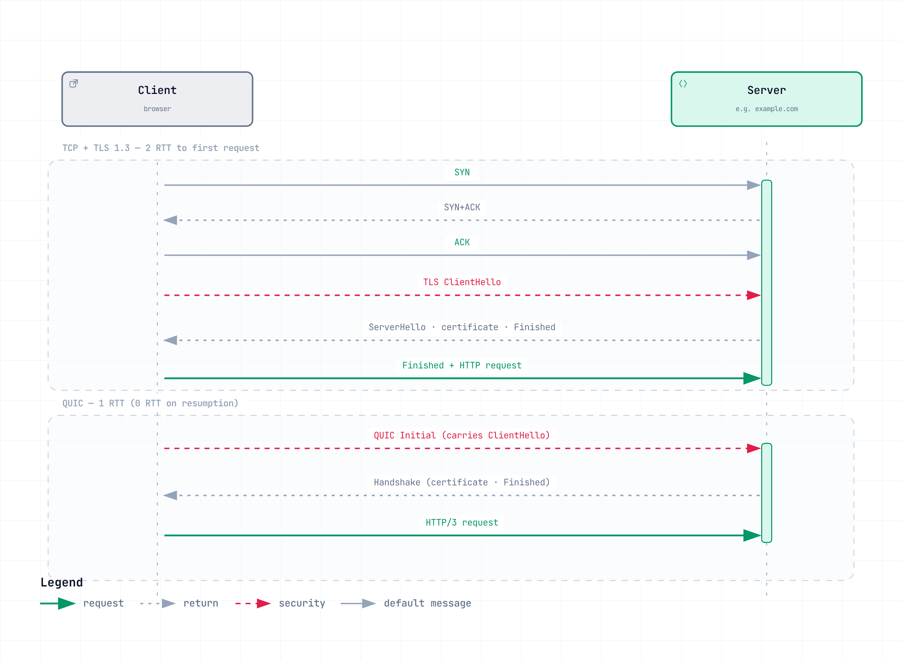

# Network Fundamentals Part 2 — The Transport Layer and TLS

> **Last Updated**: August 28, 2026

::: tip This is a four-part series
[Part 1: The Layer Model, Link and Routing Layers](./06-network-fundamentals-part1.md) ·
**Part 2: The Transport Layer and TLS** *(this document)* ·
[Part 3: Application Protocols](./06-network-fundamentals-part3.md) ·
[Part 4: A Request's Journey and the Cloud](./06-network-fundamentals-part4.md)
:::

Part 1 delivered packets to the destination host; this part builds a **reliable conversation** on top with TCP, UDP, and QUIC — and encrypts it with TLS.

One picture summarizes the heart of this part:

[🔍 View interactive diagram](https://www.atomai.click/kubernetes-docs/archmaps/en-basics-06-network-fundamentals-part2-0.html)

---

## 3. Transport Layer — End-to-End Delivery

From here on, your conversation partner is not a "network" but a "process." That is why port numbers appear.

### TCP

**Definition:** A connection-oriented transport protocol providing a reliable, ordered byte stream.

**How it works:** A 3-way handshake (SYN → SYN+ACK → ACK) establishes the connection. Sequence numbers preserve order, ACKs and retransmission recover losses, sliding windows control flow, and congestion control adapts to network load. To the application, TCP presents a clean abstraction: a gapless stream of bytes.

**In practice:** The price of that abstraction is **head-of-line (HOL) blocking**. Guaranteeing order means that if an earlier segment is lost, later data — even if already received — cannot be delivered to the application. When HTTP/2 multiplexed many streams over one TCP connection, a single lost packet stalled *all* streams. That is precisely why QUIC exists.

Handshake cost is not negligible either: 1 RTT per connection, plus 1–2 more RTTs for TLS. On high-latency paths, connection reuse and connection-pool tuning dominate performance.

**A short lineage of congestion control:** Which congestion control algorithm you run determines throughput. Classic **Reno** treats loss as the signal and halves the window; **CUBIC**, the Linux default, is also loss-based but recovers faster on high-bandwidth paths. Google's **BBR** models bandwidth and RTT directly instead of reacting to loss, which yields far higher throughput on long-haul and mobile paths where a little loss is always present. Check or change it with `sysctl net.ipv4.tcp_congestion_control`.

**TIME_WAIT and port exhaustion:** Whichever side closes first holds the socket in TIME_WAIT for a while. On devices that churn through short connections — proxies, load balancers — those sockets exhaust local ports and surface as "cannot connect" incidents. Connection reuse (keep-alive) is the first remedy; kernel parameter tuning comes second.

### UDP

**Definition:** A minimal transport protocol that sends datagrams with no connection setup.

**How it works:** The 8-byte header carries only source port, destination port, length, and checksum. No handshake, no retransmission, no ordering, no congestion control. It is essentially "IP with port numbers."

**In practice:** The missing features are a choice, not a flaw. For real-time audio/video, "an imperfect frame on time" beats "a perfect frame late." For one-shot exchanges like DNS queries, a handshake is wasted cost. And any reliability you do need, the application can build itself — which is exactly the road QUIC took.

The caveat: being stateless makes UDP easy to abuse for spoofing and amplification attacks. When exposing UDP services externally, plan for response-size limits and request-rate control.

### QUIC

**Definition:** A secure, multiplexed transport protocol implemented on top of UDP.

**How it works:** QUIC redesigns, from scratch on UDP, everything TCP+TLS used to do. Four key properties:

1. **Independent streams** — one connection carries many streams, each recovering losses independently. TCP's HOL blocking disappears structurally.
2. **Built-in encryption** — TLS 1.3 is part of the protocol itself. With no separate negotiation phase, connection setup is 1 RTT, and 0 RTT on resumption.
3. **Connection IDs** — the connection survives IP or port changes. Switching from Wi-Fi to cellular does not drop the session.
4. **User-space implementation** — it lives in the application, not the kernel, so congestion-control improvements ship without OS updates.

**In practice:** Where firewalls block UDP 443, QUIC cannot run and falls back to TCP. In environments with strict UDP policies — regulated financial networks are a typical example — HTTP/3's benefits often never materialize, so "we enabled HTTP/3, why isn't it faster?" starts with checking this. Also, user-space processing costs more CPU than kernel TCP.

One security caveat: **0-RTT resumption data is replayable.** An on-path attacker can copy a 0-RTT packet and send it again, making the server process the same request twice. The rule is to send only idempotent requests (e.g. GET) over 0-RTT, and to explicitly restrict what 0-RTT is allowed to carry in server/CDN configuration.

---

## 4. Security — TLS

### TLS

**Definition:** The protocol providing confidentiality, integrity, and authentication for data in transit.

**How it works:** TLS has a handshake phase and a record phase. The handshake negotiates a cipher suite, verifies the server's identity via its certificate, and derives session keys through key exchange. The record phase then encrypts data with those session keys and verifies integrity with MACs.

TLS 1.3 was a major cleanup: the handshake dropped to 1 RTT (0 RTT on session resumption), RSA key exchange and weak cipher suites were removed, and forward secrecy became effectively mandatory.

**In practice:** Three things go wrong over and over.

- **Certificate expiry** — still a top-tier outage cause. Automate renewal *and* monitor expiry as two separate safeguards.
- **SNI exposure** — even in TLS 1.3, the target domain travels in plaintext. ECH tries to hide it — which, ironically, collides with regulated environments that require traffic visibility.
- **Termination point design** — terminate TLS at the load balancer and go plaintext behind it, or encrypt end to end? Where regulation demands encryption of internal segments too (common in finance), mTLS or a service mesh (such as Istio) is the increasingly standard answer.

**Certificate chains and OCSP stapling:** A server certificate is never validated alone — it is validated as a chain through intermediate CAs up to a root. Forget to deploy the intermediate certificate and you get the nastiest kind of failure: one that only some clients hit. Revocation checking matters too: instead of every client asking the CA, **OCSP stapling** has the server pre-fetch a signed revocation status and attach it to the handshake — the standard choice for both latency and privacy.

> 📎 For how Istio automates this, see [Istio mTLS](../service-mesh/istio/security/01-mtls.md).

---

**Next:** [Part 3: Application Protocols](./06-network-fundamentals-part3.md)
