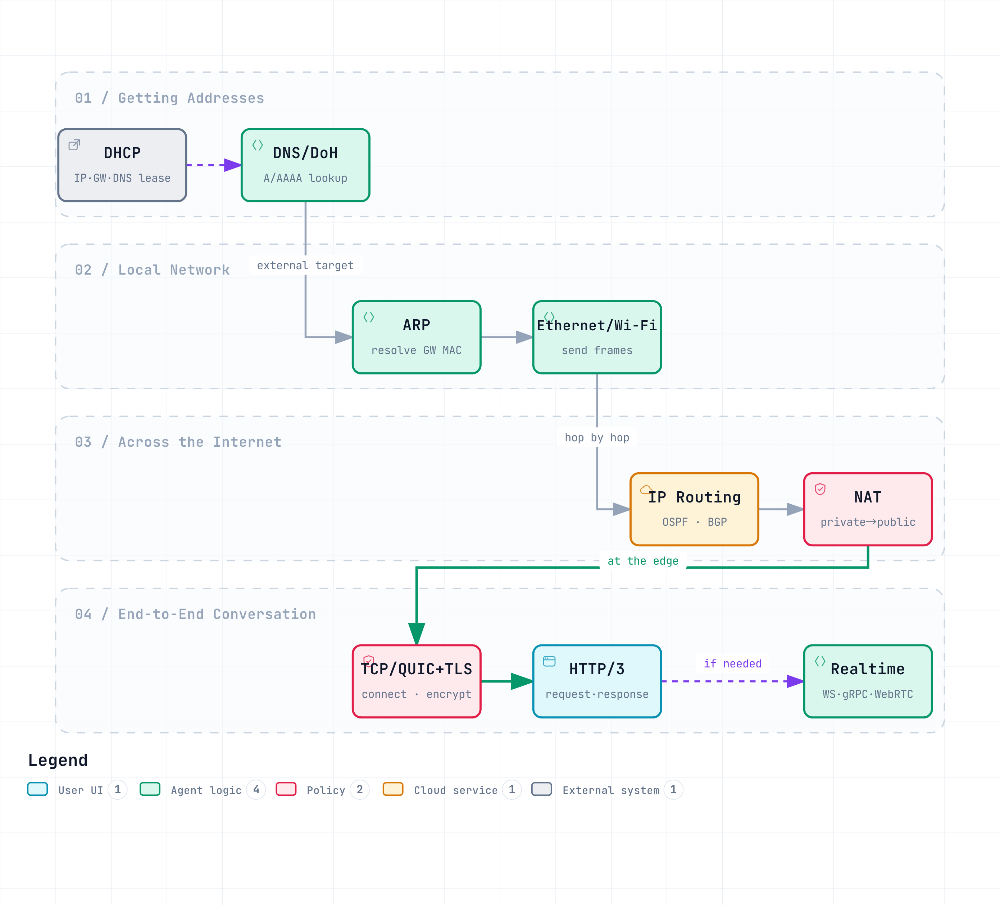

# Network Fundamentals Part 4 — A Request's Journey and the Cloud Mapping

> **Last Updated**: August 28, 2026

::: tip This is a four-part series
[Part 1: The Layer Model, Link and Routing Layers](./06-network-fundamentals-part1.md) ·
[Part 2: The Transport Layer and TLS](./06-network-fundamentals-part2.md) ·
[Part 3: Application Protocols](./06-network-fundamentals-part3.md) ·
**Part 4: A Request's Journey and the Cloud** *(this document)*
:::

This part puts the 25 pieces together into a single request, then maps where these concepts reappear — under new names — in the cloud and in Kubernetes.

[🔍 View interactive diagram](https://www.atomai.click/kubernetes-docs/archmaps/en-basics-06-network-fundamentals-part4-0.html)

---

## 6. Following One Request All the Way Through

Here is how the pieces above actually interlock, using a visit to `https://example.com` as the example:

1. **DHCP** — at boot, the host receives its IP, gateway, and DNS server addresses.
2. **DNS (or DoH)** — resolve the A/AAAA records for `example.com`; on a cache miss, walk down from the root.
3. **ARP** — the destination is external, so resolve the default gateway's MAC address.
4. **Ethernet / Wi-Fi** — put the packet in a frame and send it to the gateway.
5. **IP + BGP/OSPF** — routers forward hop by hop, each consulting a routing table learned via OSPF internally and BGP externally.
6. **NAT** — at the boundary, the private IP is translated to a public one.
7. **TCP or QUIC** — establish the end-to-end transport connection.
8. **TLS** — verify the certificate and derive session keys. With QUIC, this merges into step 7.
9. **HTTP/3** — send the request, receive the response.
10. **WebSocket / gRPC / WebRTC** — if the page uses real-time features, extra connections open here.

And if anything goes wrong anywhere along the way, **ICMP** tells you — provided you left it open to do so.

---

## 7. Where These Concepts Go in the Cloud

On-premises networking knowledge does not become useless in the cloud — it survives under new names. Mapped to AWS:

| Traditional concept | AWS counterpart |
|---|---|
| VLAN / subnet separation | VPC, subnets, security groups, NACLs |
| Routing tables | VPC route tables, Transit Gateway |
| BGP peering | Direct Connect, Site-to-Site VPN |
| NAT appliance | NAT Gateway, VPC endpoints (to bypass it) |
| DNS servers | Route 53, Resolver endpoints |
| DHCP | VPC DHCP option sets |
| TLS termination | ALB/NLB, ACM, CloudFront |
| L7 load balancing | ALB, App Mesh, Istio |
| SSH access | Systems Manager Session Manager |
| Internal-segment encryption | Service mesh mTLS |

**Three decisions to make first** when designing:

1. **IP address plan** — fix organization-wide CIDRs that do not overlap with on-premises. This is the single most expensive thing to change later.
2. **Outbound path** — through a NAT Gateway, or around it via VPC endpoints? At high traffic volumes the cost difference is substantial.
3. **Encryption termination point** — where does TLS end? This maps directly to regulatory requirements.

---

## 8. Who Does This Work in Kubernetes

Inside a cluster the same concepts repeat with new component names. This table is the bridge from this series to the deep-dive documents that follow.

| Traditional concept | Kubernetes counterpart |
|---|---|
| DHCP / IP assignment | The CNI plugin's IPAM (VPC CNI, Cilium, …) |
| ARP / L2 delivery | The CNI datapath (veth, eBPF — varies by implementation) |
| DNS | CoreDNS (`service.namespace.svc.cluster.local`) |
| NAT + L4 balancing | kube-proxy's Service implementation (iptables/IPVS/eBPF) |
| Firewall rules | NetworkPolicy (enforced by the CNI) |
| L7 routing / TLS termination | Ingress, Gateway API |
| Internal-segment mTLS | Service mesh (Istio, Linkerd, Cilium) |
| BGP routing | Calico BGP mode, MetalLB |

When a pod calls another service: CoreDNS returns the ClusterIP (DNS), kube-proxy rules translate that virtual IP to a real pod IP (NAT), the CNI moves packets between nodes (routing), and with a service mesh, mTLS rides on top (TLS) — every layer from this series shows up again.

---

## Wrapping Up

After walking through all 25, one pattern stands out: **every protocol is a trade — it gives something up to gain something else.**

TCP buys reliability and pays in latency; UDP is the mirror image. QUIC judged TCP's terms a bad deal for modern networks and renegotiated from scratch on top of UDP. NAT solved address exhaustion at the cost of end-to-end connectivity — and WebRTC is still paying that bill via STUN/TURN. DoH gained privacy and lost organizational visibility.

That is why understanding **what trade each protocol made** outlasts memorizing them. When an incident hits, if you can recall "what does this layer guarantee, and what does it not," you can usually narrow the fault domain fast.

---

## Next Documents

From this foundation, move on to cluster networking:

- [eBPF Fundamentals](./05-ebpf-fundamentals.md) — how packets are processed in the kernel
- [Cilium Networking](../networking/cilium/03-networking.md) — the eBPF-based CNI
- [Calico BGP Deep Dive](../networking/calico/04-bgp-deep-dive.md) — BGP routing inside the cluster
- [Amazon VPC CNI](../networking/01-vpc-cni.md) — the VPC CNI and IP allocation

## References

The protocol list was seeded by ByteByteGo's "What Keeps the Internet Running?"
infographic; the explanations and practical commentary were written independently.
