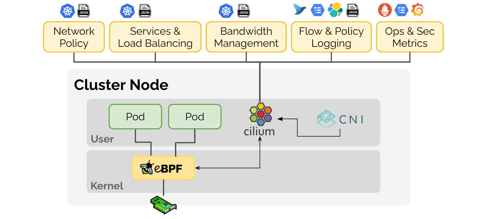

# Introduction to Cilium and Basic Concepts

> **Supported Versions**: Cilium 1.18
> **Last Updated**: November 24, 2025

## Lab Environment Setup

To follow along with the examples in this document, you will need the following tools and environment:

### Required Tools
- kubectl v1.33 or later
- Helm v3.12 or later
- A working Kubernetes cluster (EKS, minikube, kind, etc.)
- Linux kernel 4.19 or later (for eBPF feature support)

### Installing Cilium

```bash
# Install Cilium CLI
curl -L --remote-name-all https://github.com/cilium/cilium-cli/releases/latest/download/cilium-linux-amd64.tar.gz
sudo tar xzvfC cilium-linux-amd64.tar.gz /usr/local/bin
rm cilium-linux-amd64.tar.gz

# Install Cilium
cilium install --version 1.18.0

# Check installation status
cilium status
```

## What is Cilium?

Cilium is an open-source software that provides networking, security, and observability for containerized applications by leveraging the powerful eBPF technology in the Linux kernel. It is designed to provide networking, security, and observability for container orchestration platforms such as Kubernetes, Docker, and Mesos.

### Key Features:

- **eBPF-based**: Provides high-performance networking and security capabilities through a programmable datapath within the kernel
- **API-aware Networking**: Supports API-aware network security policies at L3-L7 layers
- **Kubernetes Integration**: Provides Kubernetes CNI (Container Network Interface) implementation
- **Distributed Load Balancing**: Efficient distributed load balancing for service-to-service communication
- **Network Visibility**: Network flow monitoring and troubleshooting through Hubble
- **Multi-cluster Support**: Support for cross-cluster networking and security policies
- **Kubernetes Compatibility**: Fully compatible with Kubernetes 1.32 and later versions
- **Enhanced BGP Support**: More flexible routing configuration with Cilium 1.18's improved BGP control plane
- **Enhanced Observability**: Deeper insights with improved metrics and tracing capabilities

### Cilium Architecture



## Container Networking Basics

Container networking provides the mechanisms that enable containerized applications to communicate with each other and with the outside world.

### Container Networking Models:

1. **Host Network**: Containers share the host's network namespace
2. **Bridge Network**: Containers connect to a virtual bridge within the host
3. **Overlay Network**: Virtual networks are created across multiple hosts
4. **Underlay Network**: Direct utilization of physical network infrastructure

### Container Networking Challenges:

- **Scalability**: Supporting thousands of containers and services
- **Performance**: Minimizing latency and maximizing throughput
- **Security**: Protecting communication between microservices
- **Observability**: Monitoring network flows and troubleshooting
- **Portability**: Providing consistent networking experience across various environments

## Understanding CNI (Container Network Interface)

> **Key Concept**: CNI (Container Network Interface) is a CNCF project that defines a standard interface between container runtimes and network plugins.

### Key Components of CNI:

- **Plugin Architecture**: Modular design that allows integration of various networking solutions
- **Network Configuration**: Network settings defined in JSON format
- **IPAM (IP Address Management)**: IP address allocation and management
- **Standard API**: Standard API for network setup when adding/removing containers

### Comparison of Major CNI Plugins:

| Feature | Cilium | Calico | Flannel | AWS VPC CNI |
|---------|--------|--------|---------|-------------|
| **Base Technology** | eBPF | iptables/IPVS | VXLAN/host-gw | AWS ENI |
| **Network Policy** | L3-L7 | L3-L4 | Limited | AWS Security Groups |
| **Encryption** | IPsec/WireGuard | IPsec | None | None |
| **Observability** | Hubble | Flow Logs | Limited | VPC Flow Logs |
| **Service Mesh** | Built-in | Requires Istio | Requires Istio | Requires Istio/AppMesh |
| **Performance** | Very High | High | Medium | High |
| **IPAM** | Cluster Pool, CRD | IPAM Plugin | Host Subnet | AWS IPAM |
| **Kubernetes Compatibility** | 1.32+ | 1.29+ | 1.28+ | 1.29+ |
| **BGP Support** | Enhanced control (v1.18+) | Limited | None | VPC Routing |
- **Weave Net**: Multi-host container networking
- **AWS VPC CNI**: Direct integration with AWS VPC

## Cilium's Differentiating Features

Cilium provides several unique advantages compared to other CNI solutions.

### Technical Differentiation:

- **eBPF Utilization**: High performance and flexibility through programmable datapath within the kernel
- **API-aware Networking**: Network policy support up to L7 layer
- **XDP (eXpress Data Path)**: Packet processing performance optimization
- **Kube-proxy Replacement**: More efficient service load balancing
- **Hubble Integration**: Powerful network observability tool
- **Latest Kubernetes Compatibility**: Fully compatible with Kubernetes 1.32 and later versions

### Benefits by Use Case:

- **Microservices Architecture**: Fine-grained network policies and observability
- **Multi-cluster Deployment**: Seamless networking across clusters
- **Security-focused Environments**: Strong network security policies
- **High-performance Requirements**: Optimized datapath
- **Service Mesh Integration**: Integration with service meshes like Istio

## Lab: Cilium Installation and Basic Configuration

```bash
# Install Cilium CLI on Kubernetes cluster
curl -L --remote-name-all https://github.com/cilium/cilium-cli/releases/latest/download/cilium-linux-amd64.tar.gz
sudo tar xzvfC cilium-linux-amd64.tar.gz /usr/local/bin
rm cilium-linux-amd64.tar.gz

# Install Cilium
cilium install --version 1.18.0

# Check installation status
cilium status

# Connectivity test
cilium connectivity test
```

### Applying Basic Network Policy:

```yaml
apiVersion: "cilium.io/v2"
kind: CiliumNetworkPolicy
metadata:
  name: "allow-frontend-backend"
spec:
  endpointSelector:
    matchLabels:
      app: backend
  ingress:
  - fromEndpoints:
    - matchLabels:
        app: frontend
    toPorts:
    - ports:
      - port: "8080"
        protocol: TCP
```

[Return to Main Page](README.md)

## Quiz

To test what you've learned in this chapter, try the [Topic Quiz](../quizzes/cilium/01-introduction-quiz.md).
