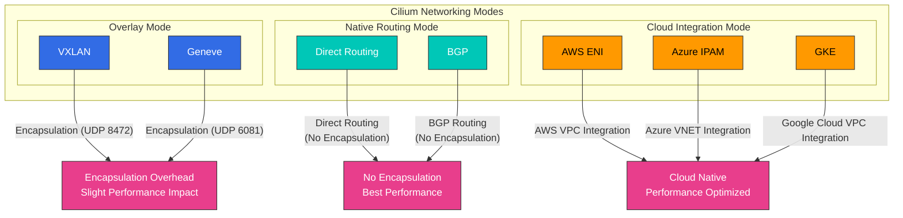
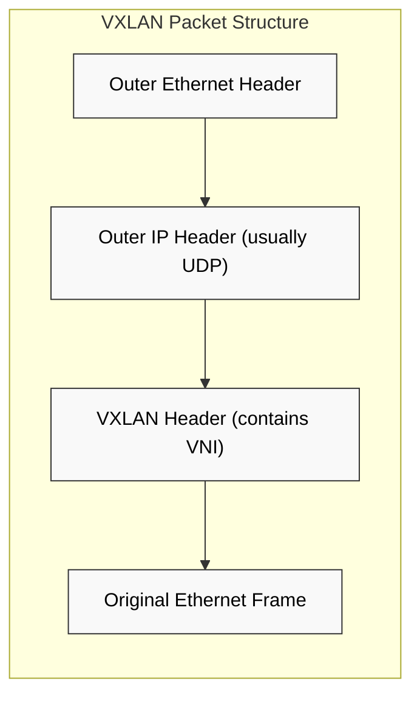
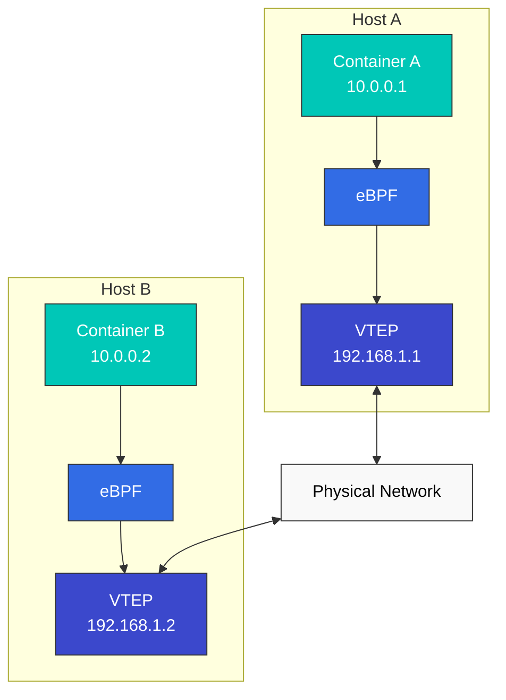

# Networking Models and VXLAN

> **Supported Versions**: Cilium 1.18
> **Last Updated**: November 24, 2025

## Lab Environment Setup

To follow along with the examples in this document, you need the following tools and environment:

### Required Tools
- kubectl v1.31 or higher
- A working Kubernetes cluster (EKS, minikube, kind, etc.)
- Cilium CLI
- tcpdump, wireshark (for network packet analysis)

### Network Analysis Tool Installation

```bash
# Install tcpdump
sudo apt-get update
sudo apt-get install -y tcpdump

# Cilium network packet capture
kubectl exec -n kube-system -it $(kubectl get pods -n kube-system -l k8s-app=cilium -o jsonpath='{.items[0].metadata.name}') -- cilium monitor -v

# VXLAN traffic analysis
sudo tcpdump -i any udp port 8472 -vv
```

## Container Networking Model Comparison

Container networking models define how containers communicate with each other. Each model has advantages and disadvantages in terms of performance, scalability, security, and implementation complexity.

### Major Networking Models:

1. **Host Network Model**:
   - Container shares the host's network namespace
   - Best performance, but possibility of port conflicts
   - Limited security isolation

2. **Bridge Network Model**:
   - Containers connect through a virtual bridge within the host
   - Efficient for communication between containers on the same host
   - Additional mechanisms needed for inter-host communication

3. **Overlay Network Model**:
   - Builds virtual network on top of physical network
   - Uses encapsulation for inter-host communication
   - Flexible but slight performance overhead

4. **Underlay Network Model**:
   - Directly utilizes physical network infrastructure
   - Best performance with minimal overhead
   - Dependent on physical network configuration

### Networking Model Comparison:

| Model | Performance | Scalability | Security | Implementation Complexity | Use Cases |
|-------|-------------|-------------|----------|---------------------------|-----------|
| Host | Very High | Low | Low | Low | High-performance workloads, single container |
| Bridge | High | Medium | Medium | Medium | Single host deployments |
| Overlay | Medium | High | High | High | Multi-host clusters |
| Underlay | High | Medium | Medium | Very High | Performance-focused production environments |

### Cilium Networking Modes



## VXLAN Technology Deep Dive

> **Key Concept**: VXLAN (Virtual Extensible LAN) is a network virtualization technology that overlays a Layer 2 network over a Layer 3 network.

VXLAN is a network virtualization technology that overlays a Layer 2 network over a Layer 3 network. It is widely used in cloud environments to expand the number of network segments and support multi-tenant environments.

### VXLAN Basic Concepts:

- **VXLAN Segment**: Logical L2 segment identified by VXLAN Network Identifier (VNI)
- **VXLAN Tunnel Endpoint (VTEP)**: Responsible for encapsulation and decapsulation of VXLAN packets
- **VNI (VXLAN Network Identifier)**: Supports up to 16,777,216 (2^24) unique network segments
- **Encapsulation**: Encapsulates original L2 frame into UDP packet

### VXLAN Packet Structure:

```
+-------------------------------+
| Outer Ethernet Header         |
+-------------------------------+
| Outer IP Header (usually IPv4)|
+-------------------------------+
| Outer UDP Header (port 8472)  |
+-------------------------------+
| VXLAN Header (contains VNI)   |
+-------------------------------+
| Original Ethernet Frame       |
| (Inner Ethernet Header +      |
|  Payload)                     |
+-------------------------------+
```

### Cilium VXLAN Configuration Example

```yaml
apiVersion: v1
kind: ConfigMap
metadata:
  name: cilium-config
  namespace: kube-system
data:
  tunnel: "vxlan"
  enable-ipv4: "true"
  enable-ipv6: "false"
  ipv4-range: "10.0.0.0/16"
  ipv4-service-range: "10.96.0.0/12"
```

This configuration instructs Cilium to set up inter-pod communication within the cluster using VXLAN tunneling. Each node acts as a VTEP and encapsulates pod traffic into VXLAN packets for transmission to other nodes.



### How VXLAN Works:

1. **Encapsulation**: Source VTEP encapsulates original L2 frame with VXLAN header
2. **Transmission**: Encapsulated packet is sent to destination VTEP through IP network
3. **Decapsulation**: Destination VTEP removes VXLAN header and extracts original L2 frame
4. **Delivery**: Original L2 frame is delivered to destination endpoint

### VXLAN vs Other Overlay Technologies:

| Technology | Encapsulation | Max Networks | Port | Advantages | Disadvantages |
|------------|---------------|--------------|------|------------|---------------|
| VXLAN | L2 over UDP | 16,777,216 (2^24) | 4789 | Widely supported, large-scale scalability | Overhead (50 bytes) |
| GENEVE | Variable length header | 16,777,216 (2^24) | 6081 | Extensible metadata | Newer, limited support |
| GRE | IP over IP | Unlimited | IP Protocol 47 | Low overhead | Firewall traversal issues |
| NVGRE | L2 over GRE | 16,777,216 (2^24) | IP Protocol 47 | Microsoft environment integration | Limited hardware offload |

## Cilium's Overlay Networking

Cilium uses VXLAN by default to implement overlay networking, but also supports other encapsulation protocols like Geneve. Cilium's overlay networking leverages eBPF to provide an optimized data path.

### Cilium Overlay Network Architecture:



### How Cilium Overlay Networking Works:

1. **Packet Generation**: Container A sends packet to Container B
2. **eBPF Processing**: eBPF program intercepts packet and applies policies
3. **VTEP Identification**: Identifies VTEP of destination container
4. **Encapsulation**: Encapsulates packet with VXLAN header
5. **Transmission**: Sends encapsulated packet to destination host through physical network
6. **Decapsulation**: Removes VXLAN header at destination host
7. **eBPF Processing**: eBPF program on destination host processes packet
8. **Delivery**: Delivers packet to destination container

### Cilium Overlay Network Optimizations:

- **Direct Path**: Uses direct routing when possible
- **DSR (Direct Server Return)**: Optimization for load balanced responses
- **Connection Tracking Bypass**: Bypasses connection tracking for known connections
- **XDP Integration**: Leverages XDP for early packet processing
- **Header Push/Pop Optimization**: Efficient header handling

### Cilium Overlay Network Configuration:

```yaml
# cilium-config.yaml
apiVersion: v1
kind: ConfigMap
metadata:
  name: cilium-config
  namespace: kube-system
data:
  # Enable overlay mode
  tunnel: "vxlan"

  # VXLAN port setting (default: 8472)
  tunnel-port: "8472"

  # MTU setting
  mtu: "1450"

  # Auto direct node routes
  auto-direct-node-routes: "true"
```

## Performance Optimization Techniques

Cilium provides various performance optimization techniques to minimize network latency and maximize throughput.

### Network Mode Optimization:

1. **Direct Routing Mode**:
   - Uses direct routing without overlay encapsulation
   - Performance improvement by removing encapsulation overhead
   - Requires routable network between hosts

2. **Hybrid Mode**:
   - Uses direct routing when possible, otherwise overlay
   - Balance between flexibility and performance

3. **Native Routing Mode**:
   - Integrates with existing network infrastructure
   - Leverages routing protocols like BGP

### Data Path Optimization:

1. **XDP Utilization**:
   - Packet processing at early stage of network stack
   - Performance improvement by early dropping unnecessary packets

2. **eBPF Map Optimization**:
   - Efficient map structure and size adjustment
   - Memory usage optimization with LRU (Least Recently Used) maps

3. **Connection Tracking Optimization**:
   - Connection tracking table size adjustment
   - Connection tracking bypass for known connections

4. **Socket-based Load Balancing**:
   - Load balancing at socket level
   - Reduced packet processing overhead

### System-level Optimization:

1. **CPU Affinity**:
   - Bind network processing to specific CPU cores
   - Improved cache locality and reduced context switching

2. **NUMA Awareness**:
   - NUMA (Non-Uniform Memory Access) topology awareness
   - Local memory access optimization

3. **Interrupt Tuning**:
   - Network interrupt processing optimization
   - Interrupt coalescing and distribution

4. **Huge Pages**:
   - Reduced memory management overhead
   - Reduced TLB (Translation Lookaside Buffer) misses

## Routing Mechanisms

Cilium supports two main routing mechanisms: Encapsulation and Native-Routing.

### 1. Encapsulation

Encapsulation is a method of transmitting the original packet by wrapping it inside another packet. Cilium supports encapsulation protocols like VXLAN and Geneve.

**How it works**:
1. Packet is generated at source node.
2. Cilium encapsulates the packet by wrapping the original packet with encapsulation header.
3. Encapsulated packet is sent to destination node through physical network.
4. At destination node, Cilium decapsulates the packet to extract the original packet.
5. Extracted packet is delivered to destination container.

**Advantages**:
- Compatibility with existing network infrastructure
- Independence from network topology
- Prevention of IP conflicts in multi-cluster environments

**Disadvantages**:
- Performance impact due to encapsulation overhead
- Reduced MTU size
- Additional CPU usage

### 2. Native-Routing

Native routing is a method that uses direct routing without encapsulation. In this mode, the underlying network infrastructure must be able to route pod IP addresses.

**How it works**:
1. Each node advertises the CIDR block of pods running on that node.
2. Routing tables are configured to route each pod CIDR block to the corresponding node.
3. Packets are routed directly to destination node without encapsulation.

**Advantages**:
- No encapsulation overhead
- Improved network performance
- Lower CPU usage

**Disadvantages**:
- Dependency on underlying network infrastructure
- Network topology constraints
- IP address management complexity

## Cloud Provider-specific Networking

Cilium integrates with networking features from various cloud providers.

### 1. AWS ENI (Elastic Network Interface)

In AWS ENI mode, Cilium uses AWS Elastic Network Interfaces to assign native VPC IP addresses to pods.

**Key Features**:
- Native VPC IP address assignment to pods
- VPC native networking without overlay network
- AWS security group and network policy integration
- Improved network performance

### 2. Google Cloud Networking

In Google Kubernetes Engine (GKE), Cilium integrates with Google Cloud networking features.

**Key Features**:
- GCP VPC native IP address assignment
- GCP firewall rules integration
- GKE networking optimization

## Lab: Cilium Networking Mode Configuration and Performance Testing

### Various Networking Mode Configurations:

```bash
# VXLAN overlay mode configuration
cilium install --config tunnel=vxlan

# Geneve overlay mode configuration
cilium install --config tunnel=geneve

# Direct routing mode configuration
cilium install --config tunnel=disabled --config auto-direct-node-routes=true

# Hybrid mode configuration
cilium install --config tunnel=vxlan --config auto-direct-node-routes=true
```

### Network Performance Testing:

```bash
# Deploy test pods
kubectl apply -f https://raw.githubusercontent.com/cilium/cilium/master/examples/kubernetes/connectivity-check/connectivity-check.yaml

# Latency test
kubectl exec -it pod/netperf-client -- netperf -H netperf-server -t TCP_RR

# Throughput test
kubectl exec -it pod/netperf-client -- netperf -H netperf-server -t TCP_STREAM

# Connection establishment speed test
kubectl exec -it pod/netperf-client -- netperf -H netperf-server -t TCP_CRR
```

[Return to Main Page](README.md)

## Quiz

To test what you learned in this chapter, try the [Topic Quiz](../quizzes/cilium/03-networking-quiz.md).
