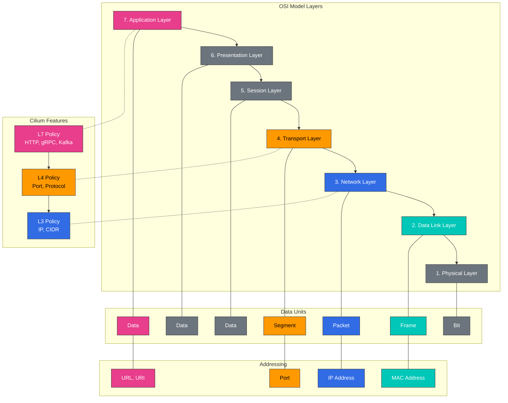

# L2-L7 Networking and Load Balancing

> **Supported Versions**: Cilium 1.18
> **Last Updated**: November 24, 2025

## Lab Environment Setup

To follow along with the examples in this document, you need the following tools and environment:

### Required Tools
- kubectl v1.31 or higher
- A working Kubernetes cluster (EKS, minikube, kind, etc.)
- Cilium CLI
- curl, jq (for API testing)

### L7 Policy Test Environment Setup

```bash
# Create test namespace
kubectl create namespace l7-test

# Deploy sample application
kubectl -n l7-test apply -f https://raw.githubusercontent.com/cilium/cilium/v1.14/examples/kubernetes/l7-policy/l7-application.yaml

# Verify deployment
kubectl -n l7-test get pods,svc

# Deploy test client
kubectl -n l7-test run client --image=curlimages/curl --restart=Never -- sleep 3600

# Basic connectivity test
kubectl -n l7-test exec client -- curl -s app1-service/public
```

## Understanding OSI Model Layers (L2, L3, L4, L7)

> **Key Concept**: The OSI (Open Systems Interconnection) model is a conceptual model that classifies network communication into 7 abstraction layers.

The OSI model is a conceptual model that classifies network communication into 7 abstraction layers. Cilium provides networking and security features at these various layers.

### OSI Model Layer Diagram



### OSI Model Layers:

1. **Physical Layer (L1)**:
   - Physical medium for bit transmission
   - Defines electrical, mechanical, functional characteristics
   - Examples: cables, switches, repeaters

2. **Data Link Layer (L2)**:
   - Physical addressing (MAC address)
   - Frame format and flow control
   - Examples: Ethernet, switches, bridges

3. **Network Layer (L3)**:
   - Logical addressing (IP address)
   - Packet routing and forwarding
   - Examples: IP, routers, ICMP

4. **Transport Layer (L4)**:
   - End-to-end connection and reliability
   - Port-based addressing
   - Examples: TCP, UDP, ports

5. **Session Layer (L5)**:
   - Session establishment, management, and termination
   - Dialog control and synchronization
   - Examples: NetBIOS, RPC

6. **Presentation Layer (L6)**:
   - Data format conversion and encryption
   - Data compression and encoding
   - Examples: SSL/TLS, JPEG, ASCII

7. **Application Layer (L7)**:
   - User interface and application services
   - Protocols and APIs
   - Examples: HTTP, DNS, FTP, gRPC

### Key Characteristics of Each Layer:

| Layer | Addressing | Unit | Device/Protocol | Cilium Feature |
|-------|------------|------|-----------------|----------------|
| L2 | MAC Address | Frame | Switch, Bridge | ARP handling, MAC filtering |
| L3 | IP Address | Packet | Router, IP | IP routing, CIDR-based policy |
| L4 | Port | Segment | TCP, UDP | Port-based filtering, connection tracking |
| L7 | URL, Method | Message | HTTP, gRPC, Kafka | API-aware filtering, header-based routing |

### L7 Policy Example

The following is an example of a Cilium L7 policy that filters traffic based on HTTP methods and paths:

```yaml
apiVersion: cilium.io/v2
kind: CiliumNetworkPolicy
metadata:
  name: l7-policy
  namespace: l7-test
spec:
  endpointSelector:
    matchLabels:
      app: app1
  ingress:
  - fromEndpoints:
    - matchLabels:
        app: client
    toPorts:
    - ports:
      - port: "80"
        protocol: TCP
      rules:
        http:
        - method: "GET"
          path: "/public"
        - method: "POST"
          path: "/api/v1"
          headers:
          - "X-Auth-Token: ^[a-zA-Z0-9]{32}$"
```

This policy allows:
1. GET requests to the `/public` path
2. POST requests to the `/api/v1` path (with a valid X-Auth-Token header)

All other requests are blocked.
| L7 | URI, Method | Message | HTTP, gRPC, Kafka | API-aware filtering, header inspection |

## Cilium's Layer-specific Features

Cilium provides features at various network layers from L2 to L7 to deliver a comprehensive networking and security solution.

### L2 (Data Link Layer) Features:

- **ARP Handling**: Address Resolution Protocol handling
- **MAC Address Filtering**: MAC address-based filtering
- **VLAN Tagging**: Virtual LAN tag handling
- **Bridge Mode**: L2 bridge mode support
- **Promiscuous Mode**: Capture all traffic

### L3 (Network Layer) Features:

- **IP Routing**: IP packet routing
- **CIDR-based Policy**: IP address range-based filtering
- **IP Fragmentation**: IP packet fragment handling
- **ICMP Handling**: ICMP message handling
- **Multicast**: IP multicast support

### L4 (Transport Layer) Features:

- **Port-based Filtering**: TCP/UDP port-based filtering
- **Connection Tracking**: Connection state tracking
- **TCP Option Handling**: TCP options and flags handling
- **Socket-based Load Balancing**: Socket-level load balancing
- **Session Affinity**: Persistent session maintenance

### L7 (Application Layer) Features:

- **HTTP Filtering**: HTTP method, path, header-based filtering
- **gRPC Filtering**: gRPC method and metadata-based filtering
- **Kafka Filtering**: Kafka topic and operation-based filtering
- **DNS Filtering**: DNS query and response-based filtering
- **TLS Inspection**: TLS certificate and SNI-based filtering

### Cross-layer Integration:

Cilium integrates features across various layers to provide a comprehensive networking and security solution:

- **L3/L4 + L7 Policy**: Combines IP/port-based filtering with application layer filtering
- **Multi-protocol Support**: Supports various protocols like HTTP, gRPC, Kafka
- **Layered Policy Enforcement**: Applies policies at various layers
- **Unified Observability**: Traffic monitoring and visibility across all layers

## Service Mesh Integration

Cilium integrates with service meshes like Istio to provide a powerful networking, security, and observability solution for microservices architectures.

### Cilium-Istio Integration Architecture:

```
+-------------------+
| Service Mesh      |
| Control Plane     |
| (Istio Pilot)     |
+--------+----------+
         |
         v
+-------------------+
| Envoy Proxy       |
| (Sidecar)         |
+--------+----------+
         |
         v
+-------------------+
| Cilium eBPF       |
| (Data Plane)      |
+-------------------+
```

### Cilium-Istio Integration Benefits:

1. **Performance Improvement**:
   - Reduced latency through Envoy sidecar bypass
   - eBPF-based optimized data path

2. **Enhanced Security**:
   - Kernel-level policy enforcement
   - L3-L7 security policy integration

3. **Improved Observability**:
   - Unified monitoring and tracing
   - Network flow visibility

4. **Operational Simplification**:
   - Consistent networking and security model
   - Elimination of redundant features

### Cilium-Istio Setup:

```bash
# Cilium installation (with Istio integration enabled)
cilium install --config enable-envoy-config=true --config enable-l7-proxy=true

# Istio installation
istioctl install --set profile=default

# Enable Istio sidecar auto-injection
kubectl label namespace default istio-injection=enabled

# Verify Cilium-Istio integration
cilium status --verbose
```

### Combining Istio Virtual Service with Cilium Policy:

```yaml
# istio-virtual-service.yaml
apiVersion: networking.istio.io/v1alpha3
kind: VirtualService
metadata:
  name: reviews-route
spec:
  hosts:
  - reviews
  http:
  - match:
    - headers:
        end-user:
          exact: jason
    route:
    - destination:
        host: reviews
        subset: v2
  - route:
    - destination:
        host: reviews
        subset: v1
---
# cilium-l7-policy.yaml
apiVersion: "cilium.io/v2"
kind: CiliumNetworkPolicy
metadata:
  name: "reviews-policy"
spec:
  endpointSelector:
    matchLabels:
      app: reviews
  ingress:
  - fromEndpoints:
    - matchLabels:
        app: productpage
    toPorts:
    - ports:
      - port: "9080"
        protocol: TCP
      rules:
        http:
        - method: "GET"
          path: "/reviews/.*"
```

## Load Balancing Architecture

Cilium leverages eBPF to provide an efficient and scalable load balancing solution. This can operate as a kube-proxy replacement for Kubernetes services.

### Cilium Load Balancing Modes:

1. **DSR (Direct Server Return) Mode**:
   - Response traffic bypasses load balancer and goes directly to client
   - Eliminates load balancer bottleneck
   - Optimized for large response handling

2. **SNAT (Source Network Address Translation) Mode**:
   - Translates source IP address to load balancer's IP
   - Useful when client IP preservation is not needed
   - Similar behavior to existing kube-proxy

3. **Hybrid Mode**:
   - Uses DSR or SNAT mode depending on situation
   - Balance between flexibility and performance

### Cilium Load Balancing Components:

- **Service Map**: Mapping of service IP:port to backend pods
- **Backend Map**: Backend pod information storage
- **Reverse NAT Map**: Connection tracking and response handling
- **Socket LB**: Load balancing at socket level
- **XDP Acceleration**: Early packet processing acceleration

### Cilium vs kube-proxy:

| Feature | Cilium | kube-proxy |
|---------|--------|------------|
| Implementation | eBPF | iptables/IPVS |
| Performance | High | Medium/Low |
| Scalability | High | Medium |
| Connection Tracking | Optional | Always enabled |
| DSR Support | Native support | Limited (IPVS mode only) |
| Socket-level LB | Supported | Not supported |
| L7 Awareness | Supported | Not supported |
| Observability | High | Limited |

### Cilium Load Balancing Configuration:

```yaml
# cilium-config.yaml
apiVersion: v1
kind: ConfigMap
metadata:
  name: cilium-config
  namespace: kube-system
data:
  # Enable kube-proxy replacement
  kube-proxy-replacement: "strict"

  # Enable DSR mode
  enable-dsr: "true"

  # External service load balancing
  enable-external-ips: "true"

  # NodePort acceleration
  enable-node-port: "true"

  # XDP acceleration
  enable-xdp-acceleration: "true"
```

## Masquerading

Masquerading is the process of translating internal network IP addresses to different IP addresses when communicating with external networks. Cilium supports various masquerading configurations and implementation modes.

### 1. Masquerading Configuration

In Cilium, masquerading is used for the following purposes:
- Hiding cluster internal IP addresses from external networks
- Providing access to services outside the cluster
- Implementing Network Address Translation (NAT)

**Configuration Options**:
- `enable-ipv4-masquerade`: Enable/disable IPv4 masquerading
- `enable-ipv6-masquerade`: Enable/disable IPv6 masquerading
- `masquerade-all`: Enable masquerading for all traffic
- `masquerade-interfaces`: Specify interfaces to apply masquerading

**Configuration Example**:
```yaml
# cilium-masquerade-config.yaml
apiVersion: v1
kind: ConfigMap
metadata:
  name: cilium-config
  namespace: kube-system
data:
  enable-ipv4-masquerade: "true"
  enable-ipv6-masquerade: "false"
  masquerade-all: "false"
  ipv4-native-routing-cidr: "10.0.0.0/8"
```

### 2. Implementation Modes

Cilium supports two masquerading implementation modes: iptables-based and eBPF-based.

**iptables-based Masquerading**:
- Implements masquerading using traditional iptables rules
- Compatible with all Linux distributions
- Performance limitations in large environments

**eBPF-based Masquerading**:
- Implements masquerading using eBPF programs
- Improved performance and scalability
- Requires recent Linux kernel

**Configuration Example**:
```yaml
# cilium-ebpf-masquerade-config.yaml
apiVersion: v1
kind: ConfigMap
metadata:
  name: cilium-config
  namespace: kube-system
data:
  enable-ipv4-masquerade: "true"
  enable-bpf-masquerade: "true"  # Enable eBPF-based masquerading
```

## IPv4 Fragment Handling

IPv4 fragments are IP packets that have been split into multiple smaller packets because they exceed the MTU (Maximum Transmission Unit). Cilium provides various mechanisms for handling IPv4 fragments.

### 1. Fragment Handling Mechanisms

Cilium supports the following IPv4 fragment handling mechanisms:
- **Fragment Tracking**: Track and reassemble fragments
- **Fragment Matching**: Policy decisions based on first fragment
- **LPM (Longest Prefix Match) Based Routing**: Efficient routing for fragments

### 2. Fragment-related Configuration

Cilium provides various configuration options for IPv4 fragment handling:
- `enable-ipv4-fragment-tracking`: Enable/disable IPv4 fragment tracking
- `fragment-tracking-timeout`: Set fragment tracking timeout
- `max-fragments-per-flow`: Set maximum fragments per flow

**Configuration Example**:
```yaml
# cilium-fragment-config.yaml
apiVersion: v1
kind: ConfigMap
metadata:
  name: cilium-config
  namespace: kube-system
data:
  enable-ipv4-fragment-tracking: "true"
  fragment-tracking-timeout: "60"  # in seconds
  max-fragments-per-flow: "10"
```

### 3. Fragment Handling Considerations

Considerations when handling IPv4 fragments:
- **Performance Impact**: Fragment tracking and reassembly consumes additional resources.
- **Security Impact**: Fragments can be used to bypass security policies.
- **MTU Optimization**: It's better to optimize MTU to prevent fragmentation.
- **Path MTU Discovery**: PMTUD can be enabled to prevent fragmentation.

**Best Practices**:
- Configure MTU consistently to prevent fragmentation when possible.
- When using overlay networks, adjust MTU considering encapsulation overhead.
- Enable fragment tracking to prevent fragment-based attacks.
- Consider fragment handling in network policies.

## Lab: Load Balancing and Masquerading Configuration

### 1. kube-proxy Replacement Mode Configuration:

```bash
# Enable kube-proxy replacement mode
cilium install --config kube-proxy-replacement=strict

# Check status
cilium status --verbose
```

### 2. DSR Mode Configuration:

```bash
# Enable DSR mode
cilium install --config enable-dsr=true

# Create service
kubectl create deployment echo --image=cilium/json-mock
kubectl expose deployment echo --port=8080 --target-port=80

# Test service
kubectl run client --rm -it --image=busybox -- wget -O- echo:8080
```

### 3. Masquerading Configuration:

```bash
# Enable eBPF-based masquerading
cilium install --config enable-ipv4-masquerade=true --config enable-bpf-masquerade=true

# Test external service access
kubectl run client --rm -it --image=busybox -- wget -O- google.com
```

### 4. IPv4 Fragment Handling Configuration:

```bash
# Enable fragment tracking
cilium install --config enable-ipv4-fragment-tracking=true

# MTU setting
cilium install --config mtu=1450
```

[Return to Main Page](README.md)

## Quiz

To test what you learned in this chapter, try the [Topic Quiz](../quizzes/cilium/05-l2-l7-networking-quiz.md).
