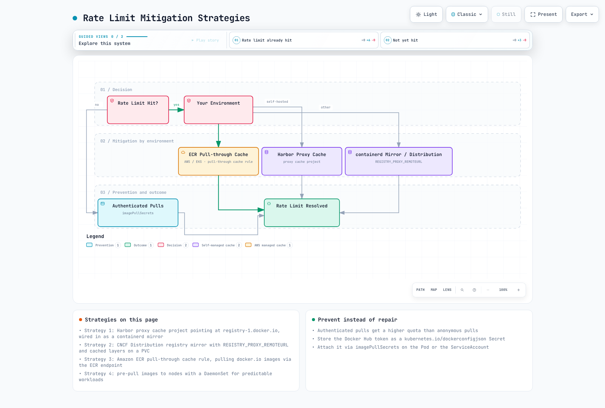

# Docker Hub

> **Last Updated**: February 25, 2026

## Overview

Docker Hub is the world's largest container image registry and the default registry for the Docker CLI. It serves as a central repository for both public and private container images, hosting millions of images including official images from software vendors, verified publisher images, and community-contributed content.

### Plans and Features

| Feature | Free | Pro | Team | Business |
|---------|------|-----|------|----------|
| **Price** | $0 | $5/month | $9/user/month | $24/user/month |
| **Private Repositories** | 1 | Unlimited | Unlimited | Unlimited |
| **Teams** | - | - | Unlimited | Unlimited |
| **Parallel Builds** | 1 | 5 | 15 | Unlimited |
| **Build Minutes** | - | Included | Included | Included |
| **Vulnerability Scanning** | Limited | Yes | Yes | Yes |
| **SSO/SAML** | - | - | - | Yes |
| **Audit Logs** | - | - | - | Yes |
| **Image Access Management** | - | - | - | Yes |

### Rate Limits

Docker Hub enforces pull rate limits to ensure fair usage:

| User Type | Rate Limit | Reset Period |
|-----------|------------|--------------|
| Anonymous | 100 pulls | 6 hours |
| Authenticated (Free) | 200 pulls | 6 hours |
| Authenticated (Pro) | 5,000 pulls | 24 hours |
| Authenticated (Team) | 50,000 pulls | 24 hours |
| Authenticated (Business) | Unlimited | - |

Rate limits are based on your source IP address for anonymous pulls, or your Docker Hub account for authenticated pulls. In Kubernetes environments, all nodes sharing an IP (behind NAT) share the same rate limit quota.

## Using Docker Hub with Kubernetes

### Creating Image Pull Secrets

To pull private images from Docker Hub, create a Kubernetes Secret:

```bash
# Create docker-registry secret
kubectl create secret docker-registry dockerhub-secret \
  --docker-server=https://index.docker.io/v1/ \
  --docker-username=<your-username> \
  --docker-password=<your-password-or-token> \
  --docker-email=<your-email> \
  -n <namespace>
```

Using a Personal Access Token (recommended over password):

```bash
# Generate a Personal Access Token at https://hub.docker.com/settings/security
kubectl create secret docker-registry dockerhub-secret \
  --docker-server=https://index.docker.io/v1/ \
  --docker-username=myuser \
  --docker-password=dckr_pat_xxxxxxxxxxxx \
  -n default
```

### Using Secrets in Pods

Reference the secret in your Pod specification:

```yaml
apiVersion: v1
kind: Pod
metadata:
  name: private-app
spec:
  containers:
  - name: app
    image: myusername/private-app:v1.0.0
  imagePullSecrets:
  - name: dockerhub-secret
```

### ServiceAccount Integration

Attach image pull secrets to a ServiceAccount for automatic injection:

```yaml
apiVersion: v1
kind: ServiceAccount
metadata:
  name: app-service-account
  namespace: default
imagePullSecrets:
- name: dockerhub-secret
```

Now any Pod using this ServiceAccount automatically uses the Docker Hub credentials:

```yaml
apiVersion: apps/v1
kind: Deployment
metadata:
  name: my-app
spec:
  replicas: 3
  selector:
    matchLabels:
      app: my-app
  template:
    metadata:
      labels:
        app: my-app
    spec:
      serviceAccountName: app-service-account
      containers:
      - name: app
        image: myusername/private-app:v1.0.0
```

### Namespace-Wide Secret Distribution

For multi-namespace clusters, automate secret distribution:

```yaml
# Using Kubernetes Replicator or similar controller
apiVersion: v1
kind: Secret
metadata:
  name: dockerhub-secret
  namespace: default
  annotations:
    replicator.v1.mittwald.de/replicate-to: "staging,production,dev-*"
type: kubernetes.io/dockerconfigjson
data:
  .dockerconfigjson: <base64-encoded-config>
```

## Rate Limit Mitigation Strategies



[🔍 View interactive diagram](https://www.atomai.click/kubernetes-docs/archmaps/en-container-registry-01-docker-hub-0.html)

### Strategy 1: Pull-Through Cache with Harbor

Deploy Harbor as a proxy cache to reduce Docker Hub pulls:

```yaml
# Harbor values.yaml excerpt
proxy:
  httpProxy: ""
  httpsProxy: ""
  noProxy: 127.0.0.1,localhost,.local,.internal

# After Harbor deployment, configure a proxy cache project
# pointing to https://registry-1.docker.io
```

Configure containerd to use Harbor as a mirror:

```toml
# /etc/containerd/config.toml
[plugins."io.containerd.grpc.v1.cri".registry.mirrors."docker.io"]
  endpoint = ["https://harbor.internal.example.com/v2/dockerhub-cache/"]
```

### Strategy 2: Registry Mirror with Distribution

Deploy the CNCF Distribution registry as a pull-through cache:

```yaml
apiVersion: apps/v1
kind: Deployment
metadata:
  name: registry-mirror
spec:
  replicas: 1
  selector:
    matchLabels:
      app: registry-mirror
  template:
    metadata:
      labels:
        app: registry-mirror
    spec:
      containers:
      - name: registry
        image: registry:2
        ports:
        - containerPort: 5000
        env:
        - name: REGISTRY_PROXY_REMOTEURL
          value: "https://registry-1.docker.io"
        - name: REGISTRY_PROXY_USERNAME
          valueFrom:
            secretKeyRef:
              name: dockerhub-creds
              key: username
        - name: REGISTRY_PROXY_PASSWORD
          valueFrom:
            secretKeyRef:
              name: dockerhub-creds
              key: password
        volumeMounts:
        - name: cache-storage
          mountPath: /var/lib/registry
      volumes:
      - name: cache-storage
        persistentVolumeClaim:
          claimName: registry-cache-pvc
---
apiVersion: v1
kind: Service
metadata:
  name: registry-mirror
spec:
  selector:
    app: registry-mirror
  ports:
  - port: 5000
    targetPort: 5000
```

### Strategy 3: Amazon ECR Pull-Through Cache

If running on AWS, use ECR's pull-through cache feature:

```bash
# Create pull-through cache rule for Docker Hub
aws ecr create-pull-through-cache-rule \
  --ecr-repository-prefix docker-hub \
  --upstream-registry-url registry-1.docker.io \
  --credential-arn arn:aws:secretsmanager:us-east-1:123456789012:secret:dockerhub-creds

# Pull images through ECR
# Original: docker.io/library/nginx:latest
# Via ECR: 123456789012.dkr.ecr.us-east-1.amazonaws.com/docker-hub/library/nginx:latest
```

### Strategy 4: Pre-Pull Images to Nodes

For predictable workloads, pre-pull images using a DaemonSet:

```yaml
apiVersion: apps/v1
kind: DaemonSet
metadata:
  name: image-prepuller
spec:
  selector:
    matchLabels:
      app: image-prepuller
  template:
    metadata:
      labels:
        app: image-prepuller
    spec:
      initContainers:
      - name: prepull-nginx
        image: nginx:1.25
        command: ['sh', '-c', 'echo Image pulled']
      - name: prepull-redis
        image: redis:7
        command: ['sh', '-c', 'echo Image pulled']
      containers:
      - name: pause
        image: gcr.io/google-containers/pause:3.2
      imagePullSecrets:
      - name: dockerhub-secret
```

## Automated Builds

Docker Hub can automatically build images when you push code to GitHub or GitLab.

### Setting Up Automated Builds

1. Link your GitHub/GitLab account in Docker Hub settings
2. Create a repository and connect it to a source repository
3. Configure build rules:

```yaml
# Example build rules configuration
Source Type: Branch
Source: main
Docker Tag: latest
Dockerfile location: /Dockerfile
Build Context: /

Source Type: Tag
Source: /^v[0-9.]+$/
Docker Tag: {sourceref}
Dockerfile location: /Dockerfile
Build Context: /
```

### Build Hooks

Customize builds with hook scripts in your repository:

```bash
# hooks/build - Custom build script
#!/bin/bash
docker build \
  --build-arg BUILD_DATE=$(date -u +'%Y-%m-%dT%H:%M:%SZ') \
  --build-arg VCS_REF=$(git rev-parse --short HEAD) \
  -t $IMAGE_NAME .
```

```bash
# hooks/post_push - Run after successful push
#!/bin/bash
# Tag with additional tags
docker tag $IMAGE_NAME $DOCKER_REPO:$SOURCE_COMMIT
docker push $DOCKER_REPO:$SOURCE_COMMIT
```

### Limitations of Docker Hub Automated Builds

- Build minutes are limited based on plan
- No support for multi-architecture builds (use GitHub Actions instead)
- Build logs retained for limited time
- No caching between builds (slow builds)
- Cannot access private dependencies easily

**Recommendation**: For production CI/CD, use GitHub Actions or GitLab CI with `docker/build-push-action` instead of Docker Hub Automated Builds.

## Public Image Security Considerations

### Supply Chain Attack Vectors

Public images from Docker Hub can introduce security risks:

1. **Typosquatting**: Malicious images with names similar to popular ones
2. **Compromised Maintainer Accounts**: Legitimate images taken over by attackers
3. **Embedded Malware**: Cryptominers, backdoors, or data exfiltration code
4. **Vulnerable Base Images**: Outdated images with known CVEs
5. **Bloated Images**: Unnecessary packages increasing attack surface

### Identifying Trusted Images

| Image Type | Indicator | Trust Level |
|------------|-----------|-------------|
| Docker Official Images | "Docker Official Image" badge | High |
| Verified Publisher | "Verified Publisher" badge, checkmark | High |
| Sponsored OSS | "Sponsored OSS" label | Medium-High |
| Community Images | No badge | Verify manually |

### Docker Official Images

Official images are curated by Docker and maintained by dedicated teams:

```bash
# Official images use the library/ namespace (often omitted)
docker pull nginx          # Same as docker.io/library/nginx
docker pull postgres:15    # Same as docker.io/library/postgres:15
```

Characteristics of Official Images:
- Clear documentation and Dockerfile transparency
- Regular security updates
- Best practice Dockerfile patterns
- Multi-architecture support
- Minimal base images

### Verified Publishers

Verified Publishers are organizations validated by Docker:

```bash
# Verified publisher images include the organization namespace
docker pull bitnami/postgresql:15
docker pull grafana/grafana:10.0.0
docker pull datadog/agent:7
```

### Security Scanning Best Practices

Always scan public images before deployment:

```bash
# Using Trivy (recommended)
trivy image nginx:latest

# Using Docker Scout (Docker Desktop)
docker scout cves nginx:latest

# Using Grype
grype nginx:latest
```

Implement admission control to enforce scanning:

```yaml
# Example Kyverno policy to require scanned images
apiVersion: kyverno.io/v1
kind: ClusterPolicy
metadata:
  name: require-image-scan
spec:
  validationFailureAction: Enforce
  rules:
  - name: check-image-scan
    match:
      resources:
        kinds:
        - Pod
    verifyImages:
    - imageReferences:
      - "*"
      attestations:
      - predicateType: https://cosign.sigstore.dev/attestation/vuln/v1
        conditions:
        - all:
          - key: "{{ scanner }}"
            operator: Equals
            value: "trivy"
```

### Recommendations for Public Images

1. **Pin to Specific Digests** (not just tags):
   ```yaml
   # Avoid
   image: nginx:latest

   # Better
   image: nginx:1.25.3

   # Best (immutable)
   image: nginx@sha256:a484819eb60211f5299034ac80f...
   ```

2. **Mirror to Private Registry**:
   ```bash
   # Pull, scan, and push to your private registry
   docker pull nginx:1.25.3
   trivy image nginx:1.25.3 --exit-code 1
   docker tag nginx:1.25.3 myregistry.com/library/nginx:1.25.3
   docker push myregistry.com/library/nginx:1.25.3
   ```

3. **Use Distroless or Minimal Base Images**:
   ```dockerfile
   # Instead of full OS base images
   FROM gcr.io/distroless/static-debian12
   # or
   FROM cgr.dev/chainguard/static:latest
   ```

## Docker Hub API Usage

### Authentication

```bash
# Get authentication token
TOKEN=$(curl -s -H "Content-Type: application/json" \
  -X POST -d '{"username": "'${DOCKER_USER}'", "password": "'${DOCKER_PASS}'"}' \
  https://hub.docker.com/v2/users/login/ | jq -r .token)
```

### List Repositories

```bash
# List your repositories
curl -s -H "Authorization: Bearer ${TOKEN}" \
  "https://hub.docker.com/v2/repositories/${DOCKER_USER}/?page_size=100" | jq '.results[].name'
```

### List Tags

```bash
# List tags for a repository
curl -s -H "Authorization: Bearer ${TOKEN}" \
  "https://hub.docker.com/v2/repositories/${DOCKER_USER}/${REPO}/tags/?page_size=100" | jq '.results[] | {name: .name, size: .full_size, updated: .last_updated}'
```

### Delete Tags (Cleanup Script)

```bash
#!/bin/bash
# Delete old tags keeping the last N

DOCKER_USER="myuser"
REPO="myapp"
KEEP_COUNT=10

TOKEN=$(curl -s -H "Content-Type: application/json" \
  -X POST -d '{"username": "'${DOCKER_USER}'", "password": "'${DOCKER_PASS}'"}' \
  https://hub.docker.com/v2/users/login/ | jq -r .token)

# Get all tags sorted by date (oldest first)
TAGS=$(curl -s -H "Authorization: Bearer ${TOKEN}" \
  "https://hub.docker.com/v2/repositories/${DOCKER_USER}/${REPO}/tags/?page_size=100&ordering=last_updated" \
  | jq -r '.results[].name')

TAG_COUNT=$(echo "$TAGS" | wc -l)
DELETE_COUNT=$((TAG_COUNT - KEEP_COUNT))

if [ $DELETE_COUNT -gt 0 ]; then
  echo "Deleting $DELETE_COUNT old tags..."
  echo "$TAGS" | head -n $DELETE_COUNT | while read TAG; do
    echo "Deleting tag: $TAG"
    curl -s -X DELETE -H "Authorization: Bearer ${TOKEN}" \
      "https://hub.docker.com/v2/repositories/${DOCKER_USER}/${REPO}/tags/${TAG}/"
  done
fi
```

### Check Rate Limit Status

```bash
# Check your current rate limit status
TOKEN=$(curl -s "https://auth.docker.io/token?service=registry.docker.io&scope=repository:ratelimitpreview/test:pull" | jq -r .token)

curl -s -I -H "Authorization: Bearer $TOKEN" \
  https://registry-1.docker.io/v2/ratelimitpreview/test/manifests/latest 2>&1 | grep -i ratelimit

# Example output:
# ratelimit-limit: 100;w=21600
# ratelimit-remaining: 95;w=21600
```

## Best Practices

### 1. Authentication and Access

- Use Personal Access Tokens instead of passwords
- Rotate tokens regularly (every 90 days recommended)
- Use read-only tokens for CI/CD pull operations
- Enable 2FA on Docker Hub accounts
- For teams, use organization-level access management

### 2. Image Management

- Use specific tags, never `latest` in production
- Implement a consistent tagging strategy (SemVer recommended)
- Regularly clean up old/unused tags
- Document image dependencies and update procedures

### 3. Security

- Scan all images before deployment
- Prefer Official Images and Verified Publishers
- Mirror critical images to your private registry
- Implement admission controllers to enforce policies
- Review Dockerfiles for security issues

### 4. Performance and Reliability

- Implement registry mirroring/caching for production clusters
- Monitor rate limit usage
- Use authenticated pulls even for public images (higher limits)
- Pre-pull images for predictable deployments

### 5. CI/CD Integration

- Use GitHub Actions or GitLab CI for builds (more features than Docker Hub Automated Builds)
- Implement multi-stage builds for smaller images
- Cache layers effectively to speed up builds
- Sign images for supply chain security

## Summary

Docker Hub remains the most widely used container registry, especially for open-source and development use cases. While its rate limits and security considerations require attention, proper configuration of authentication, caching, and scanning can make it a reliable part of your Kubernetes infrastructure.

For production workloads requiring higher reliability or stricter security controls, consider:
- **Amazon ECR** for AWS-native environments
- **Harbor** for self-hosted, air-gap, or multi-cloud scenarios
- **Docker Hub Business** for enterprise features with the convenience of SaaS

Key takeaways:
- Always authenticate to increase rate limits
- Implement pull-through caching for production clusters
- Trust but verify: scan all public images
- Use Official Images and Verified Publishers when possible
- Consider hybrid approaches: Docker Hub for base images, private registry for your applications
