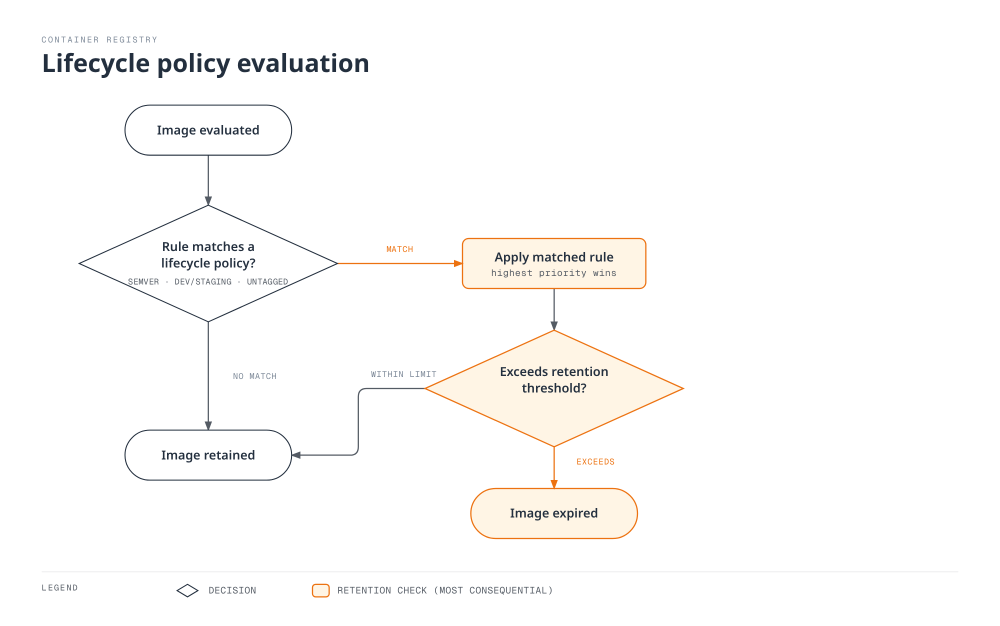

# Amazon ECR (Elastic Container Registry)

> **Last Updated**: September 11, 2026

## ECR Overview

Amazon Elastic Container Registry (ECR) is a fully managed container registry service provided by AWS. It eliminates the need to operate your own container registry infrastructure while providing deep integration with AWS services, particularly Amazon EKS.

Unless stated otherwise, the CLI/CDK/IAM/lifecycle examples target ECR Private. They are alternative configurations, not one script to execute blindly. Choose a creation method rather than creating the same repository twice. Scan/query examples require an existing repository and image tag. Configure AWS credentials and replace sample account/resource identifiers.

```bash
export AWS_REGION=us-east-1
export AWS_DEFAULT_REGION="$AWS_REGION"
```

### Architecture

ECR operates as a regional service with two distinct offerings:


[🔍 View interactive diagram](https://www.atomai.click/kubernetes-docs/archmaps/en-container-registry-02-amazon-ecr-0.html)

**ECR Private**: For internal container images with IAM-based access control. Images are stored regionally and can be replicated across regions.

**ECR Public**: For public image distribution. Management API endpoints are available in `us-east-1` and `us-west-2`; images use global `public.ecr.aws` URLs. The diagram's us-east-1 location is an example, not an exclusive endpoint.

### Pricing

| Component | Price |
|-----------|-------|
| **Storage** | Region/storage-class pricing; official standard-storage examples use $0.10/GB-month |
| **Transfer to supported same-region AWS compute** | No ECR transfer charge; networking-service charges are separate |
| **Cross-region/internet transfer** | Check source, destination, tiers and allowances; not a universal $0.02/GB |
| **ECR Public** | Storage, anonymous transfer and authenticated transfer have different free allowances |
| **Basic Scanning** | Free |
| **Enhanced Scanning** | Amazon Inspector pricing applies |

AWS Signer, KMS and VPC endpoint costs may also apply. Use [current ECR pricing](https://aws.amazon.com/ecr/pricing/) for an actual estimate and the [Public endpoint list](https://docs.aws.amazon.com/general/latest/gr/ecr-public.html) for API regions.

### Regional Service Considerations

ECR is a regional service. Key implications:

- Images pushed to `us-east-1` are not automatically available in `eu-west-1`
- Cross-region pulls incur data transfer charges
- Use replication for multi-region deployments
- VPC endpoints are region-specific

## Repository Creation and Configuration

### AWS CLI

```bash
# Create a basic repository
aws ecr create-repository \
  --repository-name myapp \
  --region us-east-1

# Alternative example using a separate repository; the KMS key must exist
aws ecr create-repository \
  --repository-name myapp-secure \
  --image-tag-mutability IMMUTABLE \
  --image-scanning-configuration scanOnPush=true \
  --encryption-configuration encryptionType=KMS,kmsKey=alias/ecr-key \
  --tags Key=Environment,Value=production Key=Team,Value=platform \
  --region us-east-1
```

### AWS CDK (TypeScript)

```typescript
import * as cdk from 'aws-cdk-lib';
import * as ecr from 'aws-cdk-lib/aws-ecr';
import * as kms from 'aws-cdk-lib/aws-kms';
import { Construct } from 'constructs';

export class EcrStack extends cdk.Stack {
  constructor(scope: Construct, id: string, props?: cdk.StackProps) {
    super(scope, id, props);

    // KMS key for encryption
    const ecrKey = new kms.Key(this, 'EcrKey', {
      description: 'KMS key for ECR encryption',
      enableKeyRotation: true,
      alias: 'ecr-key',
    });

    // ECR Repository
    const repository = new ecr.Repository(this, 'MyAppRepo', {
      repositoryName: 'myapp',
      imageScanOnPush: true,
      imageTagMutability: ecr.TagMutability.IMMUTABLE,
      encryption: ecr.RepositoryEncryption.KMS,
      encryptionKey: ecrKey,
      lifecycleRules: [
        {
          rulePriority: 1,
          description: 'Keep last 100 production images',
          tagStatus: ecr.TagStatus.TAGGED,
          tagPatternList: ['v*'],
          maxImageCount: 100,
        },
        {
          rulePriority: 2,
          description: 'Expire untagged images after 3 days',
          tagStatus: ecr.TagStatus.UNTAGGED,
          maxImageAge: cdk.Duration.days(3),
        },
      ],
    });

    // Output repository URI
    new cdk.CfnOutput(this, 'RepositoryUri', {
      value: repository.repositoryUri,
      description: 'ECR Repository URI',
    });
  }
}
```

### Repository Settings

#### Image Tag Mutability

| Setting | Description | Use Case |
|---------|-------------|----------|
| `MUTABLE` (default) | Tags can be overwritten | Development, CI builds |
| `IMMUTABLE` | Existing tags cannot be overwritten | Stable release references while those tags exist |
| `IMMUTABLE_WITH_EXCLUSION` | Only matching exception tags may be overwritten | Explicit mutable aliases such as latest |

```bash
# Update existing repository to immutable
aws ecr put-image-tag-mutability \
  --repository-name myapp \
  --image-tag-mutability IMMUTABLE
```

#### Encryption Options

| Type | Description | Cost |
|------|-------------|------|
| `AES256` (default) | Amazon S3-managed encryption keys (SSE-S3) | No separate KMS key charge |
| `KMS` | AWS-managed ECR key or a specified customer-managed KMS key | Applicable KMS charges |

Benefits of KMS encryption:
- Audit key usage via CloudTrail
- Fine-grained access control
- Key rotation support
- Explicit key lifecycle management

The key must be in the repository's region. Encryption configuration cannot be changed on an existing repository; plan migration to a new repository and inspect `cdk diff` before infrastructure changes.

#### Scan on Push

| Scan Type | Description | Cost |
|-----------|-------------|------|
| Basic Scanning | OS CVE scanning using AWS native technology | Free |
| Enhanced Scanning | Amazon Inspector with continuous monitoring | Inspector pricing |

```bash
# Inspect existing rules before replacing account/region registry configuration
aws ecr get-registry-scanning-configuration
# Isolated-registry example; merge existing production rules rather than dropping them
aws ecr put-registry-scanning-configuration \
  --scan-type ENHANCED \
  --rules '[{"repositoryFilters":[{"filter":"*","filterType":"WILDCARD"}],"scanFrequency":"CONTINUOUS_SCAN"}]'

# Check scan findings
aws ecr describe-image-scan-findings \
  --repository-name myapp \
  --image-id imageTag=v1.0.0
```

For new Basic scanning configuration, use registry-level `BASIC` rules with `SCAN_ON_PUSH` filters. The repository-level `imageScanOnPush`/CLI option shown in creation examples is a legacy compatibility setting. Basic scanning is limited per image over a 24-hour period; wait for a scan to complete before interpreting findings. Enhanced scanning follows its configured eligibility and rescan duration.

#### Image Signing

ECR supports AWS Signer managed automatic signing and client-side signing such as Notation. Storing signatures does not automatically enforce EKS admission: configure trusted identities/keys, digest verification and admission policy separately. See [ECR image signing](https://docs.aws.amazon.com/AmazonECR/latest/userguide/image-signing.html).

Pushers to a managed-signing repository also need the required signing-profile permissions, such as `signer:SignPayload`. The ECR-only IAM examples below do not grant those additional permissions.

## Authentication and Access Control

### Docker Login with AWS CLI

```bash
# Standard login (uses default profile)
aws ecr get-login-password --region us-east-1 | \
  docker login --username AWS --password-stdin 123456789012.dkr.ecr.us-east-1.amazonaws.com

# Login with specific profile
aws ecr get-login-password --region us-east-1 --profile production | \
  docker login --username AWS --password-stdin 123456789012.dkr.ecr.us-east-1.amazonaws.com

# Login script for CI/CD
#!/bin/bash
ACCOUNT_ID=$(aws sts get-caller-identity --query Account --output text)
REGION=${AWS_REGION:-us-east-1}
aws ecr get-login-password --region $REGION | \
  docker login --username AWS --password-stdin ${ACCOUNT_ID}.dkr.ecr.${REGION}.amazonaws.com
```

### Docker Credential Helper

Install and configure the ECR credential helper for automatic authentication:

```bash
# Install on Amazon Linux 2023; check upstream instructions for other distributions
sudo yum install -y amazon-ecr-credential-helper

# Install on Ubuntu / Debian
sudo apt-get install -y amazon-ecr-credential-helper

# Install on macOS
brew install docker-credential-helper-ecr

# Merge the following fragment into Docker config; do not overwrite other credentials/settings.
```

```json
{
  "credHelpers": {
    "123456789012.dkr.ecr.us-east-1.amazonaws.com": "ecr-login",
    "public.ecr.aws": "ecr-login"
  }
}
```

### IAM Policies

#### Basic Pull Policy

```json
{
  "Version": "2012-10-17",
  "Statement": [
    {
      "Effect": "Allow",
      "Action": [
        "ecr:GetAuthorizationToken"
      ],
      "Resource": "*"
    },
    {
      "Effect": "Allow",
      "Action": [
        "ecr:BatchCheckLayerAvailability",
        "ecr:GetDownloadUrlForLayer",
        "ecr:BatchGetImage"
      ],
      "Resource": "arn:aws:ecr:us-east-1:123456789012:repository/myapp"
    }
  ]
}
```

#### Full Push/Pull Policy

```json
{
  "Version": "2012-10-17",
  "Statement": [
    {
      "Effect": "Allow",
      "Action": [
        "ecr:GetAuthorizationToken"
      ],
      "Resource": "*"
    },
    {
      "Effect": "Allow",
      "Action": [
        "ecr:BatchCheckLayerAvailability",
        "ecr:GetDownloadUrlForLayer",
        "ecr:BatchGetImage",
        "ecr:PutImage",
        "ecr:InitiateLayerUpload",
        "ecr:UploadLayerPart",
        "ecr:CompleteLayerUpload"
      ],
      "Resource": "arn:aws:ecr:us-east-1:123456789012:repository/*"
    }
  ]
}
```

#### CI/CD Pipeline Policy

```json
{
  "Version": "2012-10-17",
  "Statement": [
    {
      "Sid": "ECRAuth",
      "Effect": "Allow",
      "Action": "ecr:GetAuthorizationToken",
      "Resource": "*"
    },
    {
      "Sid": "ECRPushPull",
      "Effect": "Allow",
      "Action": [
        "ecr:BatchCheckLayerAvailability",
        "ecr:GetDownloadUrlForLayer",
        "ecr:BatchGetImage",
        "ecr:PutImage",
        "ecr:InitiateLayerUpload",
        "ecr:UploadLayerPart",
        "ecr:CompleteLayerUpload",
        "ecr:DescribeImages",
        "ecr:DescribeRepositories",
        "ecr:ListImages"
      ],
      "Resource": [
        "arn:aws:ecr:us-east-1:123456789012:repository/myapp",
        "arn:aws:ecr:us-east-1:123456789012:repository/myapp-*"
      ]
    },
    {
      "Sid": "ECRScanResults",
      "Effect": "Allow",
      "Action": [
        "ecr:DescribeImageScanFindings"
      ],
      "Resource": "arn:aws:ecr:us-east-1:123456789012:repository/myapp"
    }
  ]
}
```

### Cross-Account Access

#### Repository Policy (Source Account)

```json
{
  "Version": "2012-10-17",
  "Statement": [
    {
      "Sid": "AllowCrossAccountPull",
      "Effect": "Allow",
      "Principal": {
        "AWS": [
          "arn:aws:iam::111111111111:root",
          "arn:aws:iam::222222222222:root"
        ]
      },
      "Action": [
        "ecr:GetDownloadUrlForLayer",
        "ecr:BatchGetImage",
        "ecr:BatchCheckLayerAvailability"
      ]
    },
    {
      "Sid": "AllowCrossAccountPush",
      "Effect": "Allow",
      "Principal": {
        "AWS": "arn:aws:iam::333333333333:role/ci-cd-role"
      },
      "Action": [
        "ecr:GetDownloadUrlForLayer",
        "ecr:BatchGetImage",
        "ecr:BatchCheckLayerAvailability",
        "ecr:PutImage",
        "ecr:InitiateLayerUpload",
        "ecr:UploadLayerPart",
        "ecr:CompleteLayerUpload"
      ]
    }
  ]
}
```

#### Target Account IAM Policy

```json
{
  "Version": "2012-10-17",
  "Statement": [
    {
      "Sid": "ECRAuth",
      "Effect": "Allow",
      "Action": "ecr:GetAuthorizationToken",
      "Resource": "*"
    },
    {
      "Sid": "CrossAccountPull",
      "Effect": "Allow",
      "Action": [
        "ecr:BatchCheckLayerAvailability",
        "ecr:GetDownloadUrlForLayer",
        "ecr:BatchGetImage"
      ],
      "Resource": "arn:aws:ecr:us-east-1:123456789012:repository/myapp"
    }
  ]
}
```

## Lifecycle Policy Deep Dive

ECR lifecycle policies automate image cleanup to optimize storage costs and maintain repository hygiene. Understanding the rule evaluation mechanics is crucial for effective policy design.

### Rule Evaluation Order

Lifecycle policies **evaluate all rules first**, then apply the results by priority:

1. Evaluation happens regardless of priority; a lower numeric `rulePriority` has higher application priority.
2. An image matching a higher-priority rule's tag requirements cannot be expired by a lower-priority rule.
3. An image is expired or archived by at most one rule. Counts refer to image digests, not the number of tags.
4. Priorities must be unique. Prefix sets and untagged rules must satisfy the service's constraints for the selected storage class; an `any` rule goes last.



[🔍 View interactive diagram](https://www.atomai.click/kubernetes-docs/archmaps/en-container-registry-02-amazon-ecr-1.html)

### Selection Criteria

| Parameter | Description | Values |
|-----------|-------------|--------|
| `tagStatus` | Filter by tag presence | `tagged`, `untagged`, `any` |
| `tagPrefixList` | Match tags starting with prefixes | `["v1.", "release-"]` |
| `tagPatternList` | Documented `*` wildcard; multiple patterns use AND | `["v*"]` |
| `countType` | How to count images | `imageCountMoreThan`, `sinceImagePushed` |
| `countUnit` | Unit for `sinceImagePushed` | `days` |
| `countNumber` | Threshold for the selected count type | Positive integer |

This is not regex or full Unix glob matching: do not use `?`, `[0-9]`, `^` or `$` to validate SemVer. At most four `*` wildcards are allowed per string. These examples use CI-validated `v1.2.3` release tags and select them with `v*`. They cover active-image expiration; consult the [current lifecycle rules](https://docs.aws.amazon.com/AmazonECR/latest/userguide/LifecyclePolicies.html) for archival/restoration times, reference artifacts and additional count types.

### Strategy A: Separate Repositories (Recommended)

The cleanest approach is to separate production and development images into different repositories with distinct lifecycle policies.

#### Production Repository (`myapp-prod`)

```bash
aws ecr create-repository \
  --repository-name myapp-prod \
  --image-tag-mutability IMMUTABLE \
  --image-scanning-configuration scanOnPush=true
```

Lifecycle Policy - Keep last 100 SemVer releases:

```json
{
  "rules": [
    {
      "rulePriority": 1,
      "description": "Keep newest 100 v-prefixed release image digests; CI validates the version format",
      "selection": {
        "tagStatus": "tagged",
        "tagPatternList": [
          "v*"
        ],
        "countType": "imageCountMoreThan",
        "countNumber": 100
      },
      "action": {
        "type": "expire"
      }
    },
    {
      "rulePriority": 2,
      "description": "Expire untagged images after 1 day",
      "selection": {
        "tagStatus": "untagged",
        "countType": "sinceImagePushed",
        "countUnit": "days",
        "countNumber": 1
      },
      "action": {
        "type": "expire"
      }
    }
  ]
}
```

```bash
aws ecr put-lifecycle-policy \
  --repository-name myapp-prod \
  --lifecycle-policy-text file://lifecycle-policy-prod.json
```

#### Development Repository (`myapp-dev`)

```bash
aws ecr create-repository \
  --repository-name myapp-dev \
  --image-tag-mutability MUTABLE \
  --image-scanning-configuration scanOnPush=true
```

Lifecycle Policy - Expire tagged images after 60 days:

This is an age-only policy, not a guarantee to keep a minimum count. Adding a lower-priority count rule is not a safety net. Protect running and rollback digests separately.

```json
{
  "rules": [
    {
      "rulePriority": 1,
      "description": "Expire tagged development images older than 60 days",
      "selection": {
        "tagStatus": "tagged",
        "tagPatternList": [
          "*"
        ],
        "countType": "sinceImagePushed",
        "countUnit": "days",
        "countNumber": 60
      },
      "action": {
        "type": "expire"
      }
    },
    {
      "rulePriority": 2,
      "description": "Expire untagged images after 3 days",
      "selection": {
        "tagStatus": "untagged",
        "countType": "sinceImagePushed",
        "countUnit": "days",
        "countNumber": 3
      },
      "action": {
        "type": "expire"
      }
    }
  ]
}
```

```bash
aws ecr put-lifecycle-policy \
  --repository-name myapp-dev \
  --lifecycle-policy-text file://lifecycle-policy-dev.json
```

### Strategy B: Single Repository with Priority Rules

When separate repositories are not practical, use a single repository with carefully ordered priority rules.

```json
{
  "rules": [
    {
      "rulePriority": 1,
      "description": "Keep newest 100 v-prefixed release image digests; CI validates the version format",
      "selection": {
        "tagStatus": "tagged",
        "tagPatternList": [
          "v*"
        ],
        "countType": "imageCountMoreThan",
        "countNumber": 100
      },
      "action": {
        "type": "expire"
      }
    },
    {
      "rulePriority": 2,
      "description": "Expire dev-* images older than 60 days",
      "selection": {
        "tagStatus": "tagged",
        "tagPatternList": [
          "dev-*"
        ],
        "countType": "sinceImagePushed",
        "countUnit": "days",
        "countNumber": 60
      },
      "action": {
        "type": "expire"
      }
    },
    {
      "rulePriority": 3,
      "description": "Expire stage-* images older than 60 days",
      "selection": {
        "tagStatus": "tagged",
        "tagPatternList": [
          "stage-*"
        ],
        "countType": "sinceImagePushed",
        "countUnit": "days",
        "countNumber": 60
      },
      "action": {
        "type": "expire"
      }
    },
    {
      "rulePriority": 4,
      "description": "Expire staging-* images older than 60 days",
      "selection": {
        "tagStatus": "tagged",
        "tagPatternList": [
          "staging-*"
        ],
        "countType": "sinceImagePushed",
        "countUnit": "days",
        "countNumber": 60
      },
      "action": {
        "type": "expire"
      }
    },
    {
      "rulePriority": 9,
      "description": "Expire untagged images after 3 days",
      "selection": {
        "tagStatus": "untagged",
        "countType": "sinceImagePushed",
        "countUnit": "days",
        "countNumber": 3
      },
      "action": {
        "type": "expire"
      }
    }
  ]
}
```

#### Critical Limitation: Combining Minimum Count and Age

**Important**: A rule selects one count type. Independent expiration rules are not a general Boolean retention expression that directly guarantees "keep images less than 60 days old OR in the newest 10." Separate dev/stage rules select different tag groups; that is distinct from combining retention conditions for the same images.

With the above policy, Rule Priority 2 will expire ALL dev/staging images older than 60 days, even if there are only 5 dev images in the repository. ECR cannot say "expire if older than 60 days AND more than 10 images exist."

**Scenarios where the limitation matters**:

| Scenario | Dev Images | Behavior | Problem |
|----------|-----------|----------|---------|
| Active development | 50 images (3 >60 days) | Expires 3 old images | Expected ✓ |
| Slow development | 8 images (5 >60 days) | Expires 5 old images | Only 3 remain! |
| Dormant project | 10 images (all >60 days) | Expires ALL images | Zero images remain! |

Separate repositories isolate environments but do not create a composite age/count predicate for the same images. A custom decision process is needed for that requirement; the following example is read-only.

### Strategy C: Read-Only Retention Candidate Preview

A custom process can calculate combined retention conditions, but candidate calculation and deletion are separate operations. This example never calls a deletion API. Set `REPOSITORY_NAME`, grant only the relevant repository's `ecr:DescribeImages` permission, and use a boto3 version supporting the current ECR model. It conservatively considers ordinary images with only dev/stage tags and excludes release/unknown tags, indexes, signatures and explicitly protected digests.

#### Architecture

```
┌─────────────────┐     ┌───────────────────┐     ┌─────────────────┐
│ EventBridge     │────▶│ Lambda Function   │────▶│ ECR             │
│ (Optional)      │     │ (Read-only report)│     │ (describe-images)│
└─────────────────┘     └───────────────────┘     └─────────────────┘
```

#### Lambda Function (Python)

The example retains both a minimum count and a recent time window. Before adding any deletion mechanism, independently check active workloads, manifest references, rollback needs and concurrent retagging. Inventories over 10,000 records cause an explicit failure instead of a decision based on partial data.

```python
# ecr_retention_preview.py -- read-only candidate report, never deletes images
import os
from datetime import datetime, timedelta, timezone

import boto3

ecr = boto3.client("ecr")


def retention_candidates(images, now, min_images=10, max_age_days=60, protected_digests=()):
    if type(min_images) is not int or min_images < 1:
        raise ValueError("min_images must be a positive integer")
    if type(max_age_days) is not int or max_age_days < 1:
        raise ValueError("max_age_days must be a positive integer")
    if not isinstance(now, datetime) or now.tzinfo is None:
        raise ValueError("now must be timezone-aware")
    if isinstance(protected_digests, str):
        raise ValueError("protected_digests must be a collection, not a string")
    protected = set(protected_digests)
    by_digest = {image["imageDigest"]: image for image in images if image.get("imageDigest")}
    eligible = []
    manifests = {
        "application/vnd.docker.distribution.manifest.v2+json",
        "application/vnd.oci.image.manifest.v1+json",
    }
    configs = {
        None,
        "application/vnd.docker.container.image.v1+json",
        "application/vnd.oci.image.config.v1+json",
    }
    for digest, image in by_digest.items():
        tags = image.get("imageTags") or []
        timestamp = image.get("lastActivatedAt") or image.get("imagePushedAt")
        if digest in protected or not tags:
            continue
        # A dev tag must not hide a release/protected tag on the same digest.
        if not all(tag.startswith(("dev-", "stage-", "staging-")) for tag in tags):
            continue
        # This example does not classify indexes, signatures or unknown artifacts.
        if image.get("imageManifestMediaType") not in manifests:
            continue
        if image.get("artifactMediaType") not in configs:
            continue
        if not isinstance(timestamp, datetime) or timestamp.tzinfo is None:
            continue
        eligible.append((timestamp, digest, tags))
    eligible.sort(reverse=True, key=lambda item: item[0])
    cutoff = now - timedelta(days=max_age_days)
    return [
        {"imageDigest": digest, "imageTags": tags, "timestamp": timestamp.isoformat()}
        for timestamp, digest, tags in eligible[min_images:]
        if timestamp < cutoff
    ]


def lambda_handler(event, context):
    repository = os.environ["REPOSITORY_NAME"]
    images = []
    paginator = ecr.get_paginator("describe_images")
    for page in paginator.paginate(repositoryName=repository, filter={"imageStatus": "ACTIVE"}):
        images.extend(page.get("imageDetails", []))
        if len(images) > 10000:
            raise ValueError("Inventory too large for this example; use a paged batch workflow")
    candidates = retention_candidates(
        images,
        datetime.now(timezone.utc),
        event.get("min_images", 10),
        event.get("max_age_days", 60),
        event.get("protected_digests", []),
    )
    return {
        "repository": repository,
        "dry_run": True,
        "candidate_count": len(candidates),
        "candidates_requiring_review": candidates,
    }
```

### Lifecycle Policy Dry Run

Always preview lifecycle policy effects before applying:

```bash
# Start a lifecycle policy preview
aws ecr start-lifecycle-policy-preview \
  --repository-name myapp \
  --lifecycle-policy-text file://lifecycle-policy.json

aws ecr wait lifecycle-policy-preview-complete --repository-name myapp

# Check preview results
aws ecr get-lifecycle-policy-preview \
  --repository-name myapp

```

Illustrative response structure (abbreviated):

```json
{
    "registryId": "123456789012",
    "repositoryName": "myapp",
    "lifecyclePolicyText": "...",
    "status": "COMPLETE",
    "previewResults": [
        {
            "imageTags": ["v1.0.0"],
            "imageDigest": "sha256:abc123...",
            "imagePushedAt": "2024-01-15T10:30:00Z",
            "action": {
                "type": "EXPIRE"
            },
            "appliedRulePriority": 1
        }
    ]
}
```

## Multi-Environment Tag Strategy

### Tagging Conventions

| Tag Pattern | Description | Example | Environment |
|-------------|-------------|---------|-------------|
| `vX.Y.Z` | CI-validated stable release | `v1.2.3` | Production |
| `stage-X.Y.Z-rc.N` | Release Candidate | `stage-1.2.3-rc.1` | Staging |
| `stage-X.Y.Z-beta.N` | Beta Release | `stage-1.2.3-beta.2` | Pre-production |
| `dev-<sha>` | Git SHA (development) | `dev-abc123f` | Development |
| `staging-<sha>` | Git SHA (staging) | `staging-abc123f` | Staging |
| `<branch>-<sha>` | Branch + SHA | `feature-auth-abc123f` | Feature branch |
| `latest` | Most recent build | `latest` | Never in production |

### Promotion Workflow

```
Development → Staging → Production

┌─────────────┐     ┌─────────────┐     ┌─────────────┐
│ abc123f-dev │────▶│abc123f-stage│────▶│   v1.2.3    │
└─────────────┘     └─────────────┘     └─────────────┘
       │                   │                   │
       ▼                   ▼                   ▼
   myapp-dev          myapp-staging        myapp-prod
  (Repository)        (Repository)        (Repository)
```

### CI/CD Tagging Script

```bash
#!/bin/bash
# build-and-push.sh - Example tagging strategy

set -e

ACCOUNT_ID=$(aws sts get-caller-identity --query Account --output text)
REGION=${AWS_REGION:-us-east-1}
ECR_BASE="${ACCOUNT_ID}.dkr.ecr.${REGION}.amazonaws.com"

# Login to ECR
aws ecr get-login-password --region $REGION | \
  docker login --username AWS --password-stdin $ECR_BASE

# Get version info
GIT_SHA=$(git rev-parse --short HEAD)
GIT_BRANCH=$(git rev-parse --abbrev-ref HEAD)
BUILD_DATE=$(date -u +%Y%m%d)

# Determine environment and tags
case "$GIT_BRANCH" in
  main|master)
    # Production release - requires VERSION env var
    if [ -z "${VERSION:-}" ]; then
      echo "ERROR: VERSION environment variable required for production builds"
      exit 1
    fi
    REPO="${ECR_BASE}/myapp-prod"
    RELEASE_VERSION=${VERSION#v}
    [[ "$RELEASE_VERSION" =~ ^(0|[1-9][0-9]*)\.(0|[1-9][0-9]*)\.(0|[1-9][0-9]*)$ ]] || exit 1
    TAGS=("v$RELEASE_VERSION" "v$RELEASE_VERSION-${GIT_SHA}")
    ;;
  staging)
    REPO="${ECR_BASE}/myapp-staging"
    TAGS=("staging-${GIT_SHA}" "staging-${BUILD_DATE}")
    ;;
  develop)
    REPO="${ECR_BASE}/myapp-dev"
    TAGS=("dev-${GIT_SHA}" "dev-latest")
    ;;
  feature/*|bugfix/*)
    REPO="${ECR_BASE}/myapp-dev"
    BRANCH_SLUG=$(printf '%s' "$GIT_BRANCH" | sed 's/[^a-zA-Z0-9_.-]/-/g' | cut -c1-90)
    TAGS=("dev-${BRANCH_SLUG}-${GIT_SHA}")
    ;;
  *)
    echo "Unknown branch: $GIT_BRANCH"
    exit 1
    ;;
esac

# Build image
docker build -t myapp:local \
  --build-arg BUILD_DATE=$BUILD_DATE \
  --build-arg GIT_SHA=$GIT_SHA \
  --build-arg VERSION=${VERSION:-$GIT_SHA} \
  .

# Tag and push
for TAG in "${TAGS[@]}"; do
  docker tag myapp:local "${REPO}:${TAG}"
  docker push "${REPO}:${TAG}"
  echo "Pushed: ${REPO}:${TAG}"
done
```

### Immutable Tags Best Practice

Enable immutable tags for production repositories to prevent accidental overwrites:

```bash
# Enable immutable tags
aws ecr put-image-tag-mutability \
  --repository-name myapp-prod \
  --image-tag-mutability IMMUTABLE

# Pushing a different digest under an existing immutable tag fails
docker push 123456789012.dkr.ecr.us-east-1.amazonaws.com/myapp-prod:v1.0.0
# Error: tag invalid: The image tag 'v1.0.0' already exists...
```

## EKS Integration

### Image-Pull Identity Versus Workload Identity

Image pulling occurs **before** the application container starts and is performed by kubelet/the node execution environment. Kubelet does not inherit the application's IRSA or Pod Identity SDK credentials.

| Execution environment | Initial ECR image-pull permissions |
|---|---|
| EC2 managed/self-managed nodes | Node IAM role ECR pull permissions |
| EKS Auto Mode | Auto Mode node role ECR pull permissions |
| Fargate | Fargate Pod execution role |
| A separately configured provider/Secret setup | That provider or same-namespace imagePullSecrets |

Check the [node role](https://docs.aws.amazon.com/eks/latest/userguide/create-node-role.html), for example `AmazonEC2ContainerRegistryPullOnly`. The [Fargate execution role](https://docs.aws.amazon.com/eks/latest/userguide/pod-execution-role.html) is not assumed directly by application containers. Cross-account pulls also need repository-policy and caller-IAM authorization.

### Where IRSA and Pod Identity Apply

An already-running build or operations Pod can use its workload role to call ECR APIs or push images. This does not replace the bootstrap image-pull identity. IRSA needs OIDC/trust configuration; Pod Identity needs a supported runtime, Agent, role trust and ServiceAccount association. Follow the [EKS workload identity documentation](https://docs.aws.amazon.com/eks/latest/userguide/pod-identities.html).

### Environments Requiring imagePullSecrets

ECR authorization tokens last 12 hours. The following standalone script requires AWS CLI, Python 3 and kubectl. It constructs the new configuration before updating Kubernetes and **does not delete the existing Secret first**. The Secret and Pod must share a namespace, and the caller must have Kubernetes API credentials.

```bash
#!/usr/bin/env bash
set -euo pipefail
: "${AWS_REGION:?Set the ECR region}"
ECR_ACCOUNT_ID=${ECR_ACCOUNT_ID:-$(aws sts get-caller-identity --query Account --output text)}
export ECR_REGISTRY="$ECR_ACCOUNT_ID.dkr.ecr.$AWS_REGION.amazonaws.com"
PULL_SECRET_NAMESPACE=${PULL_SECRET_NAMESPACE:-default}
registry_secret_file=$(mktemp)
trap 'rm -f "$registry_secret_file"' EXIT
# Build the config before touching Kubernetes; an AWS failure keeps the old Secret.
aws ecr get-login-password --region "$AWS_REGION" | python3 -c '
import base64, json, os, sys
password = sys.stdin.read().strip()
if not password:
    raise SystemExit("No ECR password returned")
auth = base64.b64encode(("AWS:" + password).encode()).decode()
json.dump({"auths": {os.environ["ECR_REGISTRY"]: {"auth": auth}}}, sys.stdout)
' > "$registry_secret_file"
kubectl create secret generic ecr-secret \
  --namespace "$PULL_SECRET_NAMESPACE" \
  --type=kubernetes.io/dockerconfigjson \
  --from-file=.dockerconfigjson="$registry_secret_file" \
  --dry-run=client -o yaml | \
  kubectl apply --server-side --field-manager=ecr-credentials-sync -f -
```

A CronJob additionally needs a tested image containing all three tools, IAM permission for `ecr:GetAuthorizationToken`, get/create/patch permissions on the destination Secret, a refresh interval shorter than 12 hours and failure monitoring. The AWS CLI image alone does not provide kubectl. Do not make the refresh job's own image depend on the expiring Secret. Resolve field-manager conflicts deliberately instead of overwriting another controller with `--force-conflicts`.

### Private VPC Endpoints

Use VPC endpoints for private AWS connectivity; this is not a fully disconnected air gap. Check the [current endpoint guidance](https://docs.aws.amazon.com/AmazonECR/latest/userguide/vpc-endpoints.html) for first PTC pulls, Windows foreign layers and other dependencies. The usual private-image endpoints are:

- **ecr.api**: Interface endpoint for ECR API calls
- **ecr.dkr**: Interface endpoint for Docker registry protocol
- **s3**: Gateway endpoint for image layer storage access

```bash
# Create VPC Endpoints (AWS CLI)
aws ec2 create-vpc-endpoint \
  --vpc-id vpc-12345678 \
  --service-name com.amazonaws.us-east-1.ecr.api \
  --vpc-endpoint-type Interface \
  --subnet-ids subnet-11111111 subnet-22222222 \
  --security-group-ids sg-12345678 \
  --private-dns-enabled

aws ec2 create-vpc-endpoint \
  --vpc-id vpc-12345678 \
  --service-name com.amazonaws.us-east-1.ecr.dkr \
  --vpc-endpoint-type Interface \
  --subnet-ids subnet-11111111 subnet-22222222 \
  --security-group-ids sg-12345678 \
  --private-dns-enabled

aws ec2 create-vpc-endpoint \
  --vpc-id vpc-12345678 \
  --service-name com.amazonaws.us-east-1.s3 \
  --vpc-endpoint-type Gateway \
  --route-table-ids rtb-12345678
```

### Pull-Through Cache

ECR Pull-Through Cache can reduce repeated upstream downloads. Cache misses and refreshes still depend on upstream availability and policy; a cache is not an unconditional bypass of rate limits.


[🔍 View interactive diagram](https://www.atomai.click/kubernetes-docs/archmaps/en-container-registry-02-amazon-ecr-2.html)

#### Supported Upstream Registries

| Upstream Registry | ECR Prefix | Auth Required | Notes |
|---|---|---|---|
| Docker Hub | `docker-hub` | Yes (Secrets Manager) | Reduces repeated downloads; upstream policies still apply |
| Quay.io | `quay` | No | Red Hat / CoreOS images |
| GitHub Container Registry | `ghcr` | Yes (Secrets Manager) | GitHub Actions images |
| registry.k8s.io | `k8s` | No | Kubernetes core components |
| ECR Public | `ecr-public` | No | AWS public images |

#### Secrets Manager Setup (for authenticated registries)

```bash
# Store Docker Hub credentials
aws secretsmanager create-secret \
  --name ecr-pullthroughcache/docker-hub \
  --secret-string '{"username":"your-dockerhub-username","accessToken":"dckr_pat_xxxxx"}'

# Store GitHub Container Registry credentials
aws secretsmanager create-secret \
  --name ecr-pullthroughcache/ghcr \
  --secret-string '{"username":"your-github-username","accessToken":"ghp_xxxxx"}'
```

#### Creating Pull-Through Cache Rules

```bash
# Docker Hub cache rule
aws ecr create-pull-through-cache-rule \
  --ecr-repository-prefix docker-hub \
  --upstream-registry-url registry-1.docker.io \
  --credential-arn "$(aws secretsmanager describe-secret --secret-id ecr-pullthroughcache/docker-hub --region "$AWS_REGION" --query ARN --output text)" \
  --region "$AWS_REGION"

# Quay.io cache rule
aws ecr create-pull-through-cache-rule \
  --ecr-repository-prefix quay \
  --upstream-registry-url quay.io

# GitHub Container Registry cache rule
aws ecr create-pull-through-cache-rule \
  --ecr-repository-prefix ghcr \
  --upstream-registry-url ghcr.io \
  --credential-arn "$(aws secretsmanager describe-secret --secret-id ecr-pullthroughcache/ghcr --region "$AWS_REGION" --query ARN --output text)" \
  --region "$AWS_REGION"

# Kubernetes registry cache rule
aws ecr create-pull-through-cache-rule \
  --ecr-repository-prefix k8s \
  --upstream-registry-url registry.k8s.io

# ECR Public cache rule
aws ecr create-pull-through-cache-rule \
  --ecr-repository-prefix ecr-public \
  --upstream-registry-url public.ecr.aws
```

#### IAM Policy for Pull-Through Cache

This example covers cache pull/import callers; rule-creation administration is separate. ECR retrieves upstream secrets through its service-linked role, so do not give ordinary pull clients blanket access to those secrets. See [PTC permissions](https://docs.aws.amazon.com/AmazonECR/latest/userguide/pull-through-cache-iam.html).

```json
{
  "Version": "2012-10-17",
  "Statement": [
    {
      "Sid": "RegistryAuthentication",
      "Effect": "Allow",
      "Action": "ecr:GetAuthorizationToken",
      "Resource": "*"
    },
    {
      "Sid": "ReadCachedImages",
      "Effect": "Allow",
      "Action": [
        "ecr:BatchGetImage",
        "ecr:GetDownloadUrlForLayer",
        "ecr:BatchCheckLayerAvailability"
      ],
      "Resource": [
        "arn:aws:ecr:us-east-1:123456789012:repository/docker-hub/*",
        "arn:aws:ecr:us-east-1:123456789012:repository/quay/*",
        "arn:aws:ecr:us-east-1:123456789012:repository/ghcr/*",
        "arn:aws:ecr:us-east-1:123456789012:repository/k8s/*",
        "arn:aws:ecr:us-east-1:123456789012:repository/ecr-public/*"
      ]
    },
    {
      "Sid": "ImportCacheMisses",
      "Effect": "Allow",
      "Action": [
        "ecr:BatchImportUpstreamImage",
        "ecr:CreateRepository"
      ],
      "Resource": [
        "arn:aws:ecr:us-east-1:123456789012:repository/docker-hub/*",
        "arn:aws:ecr:us-east-1:123456789012:repository/quay/*",
        "arn:aws:ecr:us-east-1:123456789012:repository/ghcr/*",
        "arn:aws:ecr:us-east-1:123456789012:repository/k8s/*",
        "arn:aws:ecr:us-east-1:123456789012:repository/ecr-public/*"
      ]
    }
  ]
}
```

#### Validation

```bash
# Verify cache rules
aws ecr describe-pull-through-cache-rules

# Test pull (Docker Hub nginx)
docker pull 123456789012.dkr.ecr.us-east-1.amazonaws.com/docker-hub/library/nginx:1.30.4

# Verify cached repository was created
aws ecr describe-repositories \
  --repository-names docker-hub/library/nginx

# Test Kubernetes registry image
docker pull 123456789012.dkr.ecr.us-east-1.amazonaws.com/k8s/pause:3.10
```

#### Use Explicit Cache Image References

Use the real ECR cache URI in Pod/Helm/Kustomize image references. An ECR URL pasted into deprecated `registry.mirrors` settings is not a complete transparent mirror configuration. Such a design additionally requires current containerd hosts settings, prefix mapping, TLS and working ECR authentication.

## Multi-Region Replication

### Configuration

```bash
# Enable replication in registry settings
aws ecr put-replication-configuration \
  --replication-configuration '{
    "rules": [
      {
        "destinations": [
          {
            "region": "eu-west-1",
            "registryId": "123456789012"
          },
          {
            "region": "ap-northeast-1",
            "registryId": "123456789012"
          }
        ],
        "repositoryFilters": [
          {
            "filter": "myapp",
            "filterType": "PREFIX_MATCH"
          }
        ]
      }
    ]
  }'
```

### Disaster Recovery Considerations

Replication is asynchronous. Existing images are not automatically backfilled; pushes or restores after configuration are eligible. Repository settings, policies and lifecycle rules are configured independently at the destination, for example through creation templates. Deletions are not a mechanism for synchronizing retention across regions.

RTO/RPO must be measured against the complete recovery process. Tag immutability is not deletion protection, and connected S3 storage is not automatically an air gap. Verify the required digest at the destination, independent permissions/retention and the workload's regional image reference before declaring recovery ready.

### Cross-Region Pull Configuration

Kubernetes does not expand shell environment variables inside an `image` field. Use a concrete registry URI or render an overlay. The placeholder base below must be deployed through an appropriate regional overlay, with the target repository/image already present.

```yaml
# base/deployment.yaml
apiVersion: apps/v1
kind: Deployment
metadata:
  name: myapp
spec:
  selector:
    matchLabels:
      app: myapp
  template:
    metadata:
      labels:
        app: myapp
    spec:
      containers:
      - name: app
        image: myapp:v1.0.0
```

```yaml
# base/kustomization.yaml
apiVersion: kustomize.config.k8s.io/v1beta1
kind: Kustomization
resources:
- deployment.yaml
```

```yaml
# overlays/us-east-1/kustomization.yaml
apiVersion: kustomize.config.k8s.io/v1beta1
kind: Kustomization
resources:
- ../../base
images:
- name: myapp
  newName: 123456789012.dkr.ecr.us-east-1.amazonaws.com/myapp
```

```yaml
# overlays/eu-west-1/kustomization.yaml
apiVersion: kustomize.config.k8s.io/v1beta1
kind: Kustomization
resources:
- ../../base
images:
- name: myapp
  newName: 123456789012.dkr.ecr.eu-west-1.amazonaws.com/myapp
```

Render with `kubectl kustomize overlays/eu-west-1` and inspect the image URI before applying to the intended cluster context. Replication configuration uses a `myapp` repository prefix in this example; choose the actual intended scope in production.

## Monitoring and Cost Optimization

### CloudWatch Metrics and Scan Findings

ECR's native repository metric in `AWS/ECR` is `RepositoryPullCount`, with the `RepositoryName` dimension. Use the [documented metric list](https://docs.aws.amazon.com/AmazonECR/latest/userguide/ecr-repository-metrics.html). An alarm on an assumed native `ImagePushCount` or `ImageScanFindingsSeverityCounts` metric will not monitor the intended data.

```bash
# Linux example using GNU date: repository pulls during the last seven days
aws cloudwatch get-metric-statistics \
  --namespace AWS/ECR --metric-name RepositoryPullCount \
  --dimensions Name=RepositoryName,Value=myapp \
  --start-time "$(date -u -d '7 days ago' +%Y-%m-%dT%H:%M:%SZ)" \
  --end-time "$(date -u +%Y-%m-%dT%H:%M:%SZ)" \
  --period 86400 --statistics Sum --region "$AWS_REGION"

# Query findings through ECR/Inspector APIs
aws ecr describe-image-scan-findings \
  --repository-name myapp --image-id imageTag=v1.0.0 \
  --query '{status:imageScanStatus.status,counts:imageScanFindings.findingSeverityCounts}' --region "$AWS_REGION"
```

Use Basic-scan completion or Inspector-finding events through EventBridge for notifications. If a numeric CloudWatch alarm is required, explicitly publish a custom metric from those events/API responses. Do not confuse that custom metric with a native ECR metric. Missing/null findings do not mean zero vulnerabilities; check scan status and eligibility.

### Cost Optimization Strategies

#### 1. Review Logical Image Sizes

Summed metadata sizes can double-count shared layers and omit other billing categories such as archive storage. Do not convert these totals directly into a storage bill or claimed savings.

```bash
# Active-image metadata sizes are logical totals, not billed unique-layer storage.
aws ecr describe-repositories --region "$AWS_REGION" --output json | \
  jq -r '.repositories[].repositoryName' | while IFS= read -r repo; do
    size=$(aws ecr describe-images --repository-name "$repo" \
      --region "$AWS_REGION" --output json | \
      jq '[.imageDetails[].imageSizeInBytes // 0] | add // 0')
    printf '%s: %s logical image bytes\n' "$repo" "$size"
  done
```

#### 2. Review Untagged Images

```bash
# Read-only inventory; untagged does not mean unreferenced or safe to delete.
aws ecr list-images --repository-name myapp --filter tagStatus=UNTAGGED --output json
```

#### 3. Audit Image Sizes

```bash
# List largest images
aws ecr describe-images --repository-name myapp \
  --query 'sort_by(imageDetails, &imageSizeInBytes)[-10:].{Tag:imageTags[0],Size:imageSizeInBytes,Pushed:imagePushedAt}' \
  --output table
```

#### 4. Optimize Image Sizes

```dockerfile
# Multi-stage build to reduce image size
FROM golang:1.27.1 AS builder
WORKDIR /app
COPY . .
RUN CGO_ENABLED=0 go build -o /app/server

FROM gcr.io/distroless/static-debian12
COPY --from=builder /app/server /server
ENTRYPOINT ["/server"]
```

#### 5. Cost Monitoring

Use Cost Explorer/CUR from an authorized billing context. End dates are exclusive. An ECR service filter does not include separately billed Inspector, Signer, KMS or networking charges.

```bash
: "${START_DATE:?Set inclusive YYYY-MM-DD start}"
: "${END_DATE:?Set exclusive YYYY-MM-DD end}"
# Discover the exact billing service name rather than hard-coding a legacy label.
aws ce get-dimension-values --region us-east-1 \
  --time-period Start="$START_DATE",End="$END_DATE" \
  --dimension SERVICE --search-string 'Container Registry'

: "${ECR_BILLING_SERVICE:?Set the returned service name}"
aws ce get-cost-and-usage --region us-east-1 \
  --time-period Start="$START_DATE",End="$END_DATE" \
  --granularity MONTHLY --metrics UnblendedCost \
  --filter "$(jq -nc --arg service "$ECR_BILLING_SERVICE" \
    '{Dimensions:{Key:"SERVICE",Values:[$service]}}')"
```

### Cleanup Workflow

Use the read-only candidate preview above and an explicit repository allowlist. Before authorizing removal, re-check active/rollback digests, multi-architecture references, signatures and replication. `BatchDeleteImage` accepts at most 100 IDs per request and can return per-image failures. Never send an unbounded `list-images` result directly to deletion or treat a partial response as full success.

## Summary

Amazon ECR provides a robust, fully managed container registry that integrates seamlessly with the AWS ecosystem. Key takeaways:

### Repository Strategy

- Use **separate repositories** for production and development when possible
- Enable **immutable tags** for production repositories
- Implement **lifecycle policies** early to control costs

### Security

- Use node/Fargate execution credentials for bootstrap image pulls; use IRSA/Pod Identity for workload API access
- Enable **scan-on-push** with Enhanced Scanning for production
- Configure **VPC endpoints** for private connectivity and verify remaining network dependencies
- Review scan results and block deployments of vulnerable images

### Cost Management

- Lifecycle policies are essential for cost control
- Monitor untagged images and clean up regularly
- Use pull-through cache to reduce external dependencies
- Right-size images using multi-stage builds

### High Availability

- Configure **cross-region replication** for critical images
- Test DR procedures regularly
- Use regional endpoints for reduced latency

## References

- [Amazon ECR User Guide](https://docs.aws.amazon.com/AmazonECR/latest/userguide/)
- [ECR Lifecycle Policies](https://docs.aws.amazon.com/AmazonECR/latest/userguide/LifecyclePolicies.html)
- [ECR Private Registries](https://docs.aws.amazon.com/AmazonECR/latest/userguide/Registries.html)
- [EKS Best Practices - Security](https://aws.github.io/aws-eks-best-practices/security/docs/)
- [ECR Pricing](https://aws.amazon.com/ecr/pricing/)
- [Amazon Inspector with ECR](https://docs.aws.amazon.com/inspector/latest/user/scanning-ecr.html)
