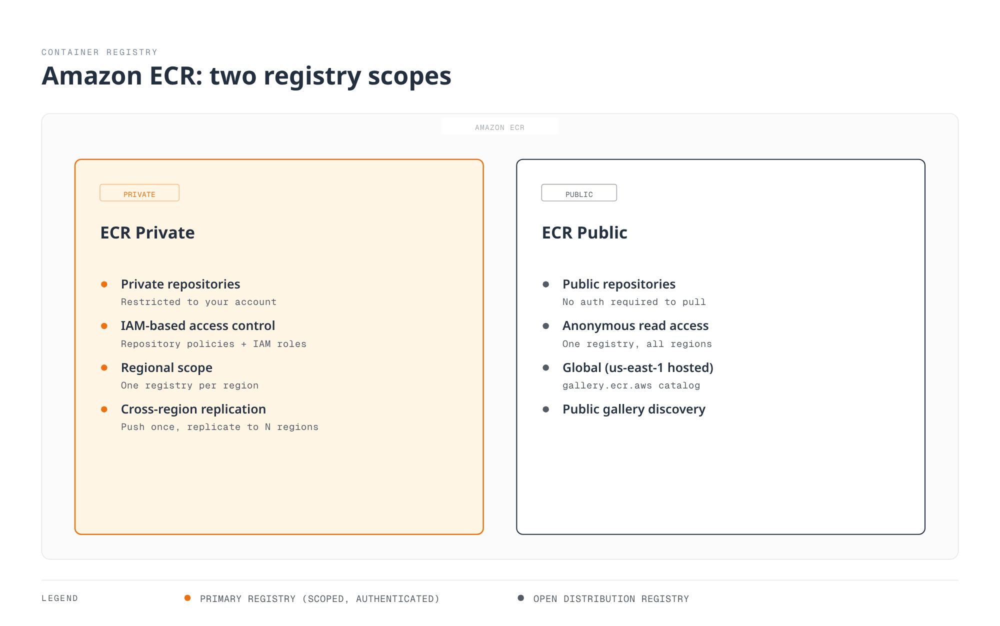
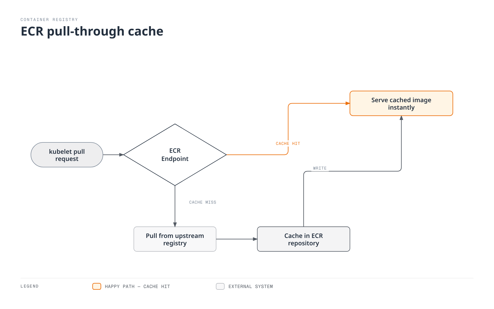

# Amazon ECR (Elastic Container Registry)

> **Last Updated**: February 25, 2026

## ECR Overview

Amazon Elastic Container Registry (ECR) is a fully managed container registry service provided by AWS. It eliminates the need to operate your own container registry infrastructure while providing deep integration with AWS services, particularly Amazon EKS.

### Architecture

ECR operates as a regional service with two distinct offerings:



**ECR Private**: For internal container images with IAM-based access control. Images are stored regionally and can be replicated across regions.

**ECR Public**: For open-source projects and public image distribution. Hosted in `us-east-1` with a public gallery at `gallery.ecr.aws`.

### Pricing

| Component | Price |
|-----------|-------|
| **Storage** | $0.10 per GB-month |
| **Data Transfer (same region)** | Free |
| **Data Transfer (cross-region)** | $0.02 per GB |
| **Data Transfer (to internet)** | $0.09 per GB (first 10TB) |
| **Data Transfer (ECR Public egress)** | Free (first 500GB/month, then standard rates) |
| **Basic Scanning** | Free |
| **Enhanced Scanning** | Amazon Inspector pricing applies |

### Regional Service Considerations

ECR is a regional service. Key implications:

- Images pushed to `us-east-1` are not automatically available in `eu-west-1`
- Cross-region pulls incur data transfer charges
- Use replication for multi-region deployments
- VPC endpoints are region-specific

## Repository Creation and Configuration

### AWS CLI

```bash
# Create a basic repository
aws ecr create-repository \
  --repository-name myapp \
  --region us-east-1

# Create repository with all recommended settings
aws ecr create-repository \
  --repository-name myapp \
  --image-tag-mutability IMMUTABLE \
  --image-scanning-configuration scanOnPush=true \
  --encryption-configuration encryptionType=KMS,kmsKey=alias/ecr-key \
  --tags Key=Environment,Value=production Key=Team,Value=platform \
  --region us-east-1
```

### AWS CDK (TypeScript)

```typescript
import * as cdk from 'aws-cdk-lib';
import * as ecr from 'aws-cdk-lib/aws-ecr';
import * as kms from 'aws-cdk-lib/aws-kms';
import { Construct } from 'constructs';

export class EcrStack extends cdk.Stack {
  constructor(scope: Construct, id: string, props?: cdk.StackProps) {
    super(scope, id, props);

    // KMS key for encryption
    const ecrKey = new kms.Key(this, 'EcrKey', {
      description: 'KMS key for ECR encryption',
      enableKeyRotation: true,
      alias: 'ecr-key',
    });

    // ECR Repository
    const repository = new ecr.Repository(this, 'MyAppRepo', {
      repositoryName: 'myapp',
      imageScanOnPush: true,
      imageTagMutability: ecr.TagMutability.IMMUTABLE,
      encryption: ecr.RepositoryEncryption.KMS,
      encryptionKey: ecrKey,
      lifecycleRules: [
        {
          rulePriority: 1,
          description: 'Keep last 100 production images',
          tagStatus: ecr.TagStatus.TAGGED,
          tagPatternList: ['v*'],
          maxImageCount: 100,
        },
        {
          rulePriority: 2,
          description: 'Expire untagged images after 3 days',
          tagStatus: ecr.TagStatus.UNTAGGED,
          maxImageAge: cdk.Duration.days(3),
        },
      ],
    });

    // Output repository URI
    new cdk.CfnOutput(this, 'RepositoryUri', {
      value: repository.repositoryUri,
      description: 'ECR Repository URI',
    });
  }
}
```

### Repository Settings

#### Image Tag Mutability

| Setting | Description | Use Case |
|---------|-------------|----------|
| `MUTABLE` (default) | Tags can be overwritten | Development, CI builds |
| `IMMUTABLE` | Tags cannot be overwritten | Production, compliance |

```bash
# Update existing repository to immutable
aws ecr put-image-tag-mutability \
  --repository-name myapp \
  --image-tag-mutability IMMUTABLE
```

#### Encryption Options

| Type | Description | Cost |
|------|-------------|------|
| `AES256` (default) | AWS-managed encryption | Free |
| `KMS` | Customer-managed KMS key | KMS key charges |

Benefits of KMS encryption:
- Audit key usage via CloudTrail
- Fine-grained access control
- Key rotation support
- Cross-account key sharing

#### Scan on Push

| Scan Type | Description | Cost |
|-----------|-------------|------|
| Basic Scanning | CVE scanning using Clair database | Free |
| Enhanced Scanning | Amazon Inspector with continuous monitoring | Inspector pricing |

```bash
# Enable enhanced scanning (account-level)
aws ecr put-registry-scanning-configuration \
  --scan-type ENHANCED \
  --rules '[{"repositoryFilters":[{"filter":"*","filterType":"WILDCARD"}],"scanFrequency":"CONTINUOUS_SCAN"}]'

# Check scan findings
aws ecr describe-image-scan-findings \
  --repository-name myapp \
  --image-id imageTag=v1.0.0
```

## Authentication and Access Control

### Docker Login with AWS CLI

```bash
# Standard login (uses default profile)
aws ecr get-login-password --region us-east-1 | \
  docker login --username AWS --password-stdin 123456789012.dkr.ecr.us-east-1.amazonaws.com

# Login with specific profile
aws ecr get-login-password --region us-east-1 --profile production | \
  docker login --username AWS --password-stdin 123456789012.dkr.ecr.us-east-1.amazonaws.com

# Login script for CI/CD
#!/bin/bash
ACCOUNT_ID=$(aws sts get-caller-identity --query Account --output text)
REGION=${AWS_REGION:-us-east-1}
aws ecr get-login-password --region $REGION | \
  docker login --username AWS --password-stdin ${ACCOUNT_ID}.dkr.ecr.${REGION}.amazonaws.com
```

### Docker Credential Helper

Install and configure the ECR credential helper for automatic authentication:

```bash
# Install on Amazon Linux / RHEL
sudo yum install -y amazon-ecr-credential-helper

# Install on Ubuntu / Debian
sudo apt-get install -y amazon-ecr-credential-helper

# Install on macOS
brew install docker-credential-helper-ecr

# Configure Docker to use the helper
mkdir -p ~/.docker
cat > ~/.docker/config.json << 'EOF'
{
  "credHelpers": {
    "123456789012.dkr.ecr.us-east-1.amazonaws.com": "ecr-login",
    "public.ecr.aws": "ecr-login"
  }
}
EOF
```

### IAM Policies

#### Basic Pull Policy

```json
{
  "Version": "2012-10-17",
  "Statement": [
    {
      "Effect": "Allow",
      "Action": [
        "ecr:GetAuthorizationToken"
      ],
      "Resource": "*"
    },
    {
      "Effect": "Allow",
      "Action": [
        "ecr:BatchCheckLayerAvailability",
        "ecr:GetDownloadUrlForLayer",
        "ecr:BatchGetImage"
      ],
      "Resource": "arn:aws:ecr:us-east-1:123456789012:repository/myapp"
    }
  ]
}
```

#### Full Push/Pull Policy

```json
{
  "Version": "2012-10-17",
  "Statement": [
    {
      "Effect": "Allow",
      "Action": [
        "ecr:GetAuthorizationToken"
      ],
      "Resource": "*"
    },
    {
      "Effect": "Allow",
      "Action": [
        "ecr:BatchCheckLayerAvailability",
        "ecr:GetDownloadUrlForLayer",
        "ecr:BatchGetImage",
        "ecr:PutImage",
        "ecr:InitiateLayerUpload",
        "ecr:UploadLayerPart",
        "ecr:CompleteLayerUpload"
      ],
      "Resource": "arn:aws:ecr:us-east-1:123456789012:repository/*"
    }
  ]
}
```

#### CI/CD Pipeline Policy

```json
{
  "Version": "2012-10-17",
  "Statement": [
    {
      "Sid": "ECRAuth",
      "Effect": "Allow",
      "Action": "ecr:GetAuthorizationToken",
      "Resource": "*"
    },
    {
      "Sid": "ECRPushPull",
      "Effect": "Allow",
      "Action": [
        "ecr:BatchCheckLayerAvailability",
        "ecr:GetDownloadUrlForLayer",
        "ecr:BatchGetImage",
        "ecr:PutImage",
        "ecr:InitiateLayerUpload",
        "ecr:UploadLayerPart",
        "ecr:CompleteLayerUpload",
        "ecr:DescribeImages",
        "ecr:DescribeRepositories",
        "ecr:ListImages"
      ],
      "Resource": [
        "arn:aws:ecr:us-east-1:123456789012:repository/myapp",
        "arn:aws:ecr:us-east-1:123456789012:repository/myapp-*"
      ]
    },
    {
      "Sid": "ECRScanResults",
      "Effect": "Allow",
      "Action": [
        "ecr:DescribeImageScanFindings"
      ],
      "Resource": "*"
    }
  ]
}
```

### Cross-Account Access

#### Repository Policy (Source Account)

```json
{
  "Version": "2012-10-17",
  "Statement": [
    {
      "Sid": "AllowCrossAccountPull",
      "Effect": "Allow",
      "Principal": {
        "AWS": [
          "arn:aws:iam::111111111111:root",
          "arn:aws:iam::222222222222:root"
        ]
      },
      "Action": [
        "ecr:GetDownloadUrlForLayer",
        "ecr:BatchGetImage",
        "ecr:BatchCheckLayerAvailability"
      ]
    },
    {
      "Sid": "AllowCrossAccountPush",
      "Effect": "Allow",
      "Principal": {
        "AWS": "arn:aws:iam::333333333333:role/ci-cd-role"
      },
      "Action": [
        "ecr:GetDownloadUrlForLayer",
        "ecr:BatchGetImage",
        "ecr:BatchCheckLayerAvailability",
        "ecr:PutImage",
        "ecr:InitiateLayerUpload",
        "ecr:UploadLayerPart",
        "ecr:CompleteLayerUpload"
      ]
    }
  ]
}
```

#### Target Account IAM Policy

```json
{
  "Version": "2012-10-17",
  "Statement": [
    {
      "Sid": "ECRAuth",
      "Effect": "Allow",
      "Action": "ecr:GetAuthorizationToken",
      "Resource": "*"
    },
    {
      "Sid": "CrossAccountPull",
      "Effect": "Allow",
      "Action": [
        "ecr:BatchCheckLayerAvailability",
        "ecr:GetDownloadUrlForLayer",
        "ecr:BatchGetImage"
      ],
      "Resource": "arn:aws:ecr:us-east-1:123456789012:repository/myapp"
    }
  ]
}
```

## Lifecycle Policy Deep Dive

ECR lifecycle policies automate image cleanup to optimize storage costs and maintain repository hygiene. Understanding the rule evaluation mechanics is crucial for effective policy design.

### Rule Evaluation Order

Lifecycle policies evaluate rules in **priority order** (lowest number first). Key principles:

1. Each image is evaluated against rules in priority order
2. An image matches only the **first** rule that applies to it
3. Once an image matches a rule, subsequent rules do not evaluate that image
4. Rules with the same priority are evaluated in an undefined order (avoid this)


### Selection Criteria

| Parameter | Description | Values |
|-----------|-------------|--------|
| `tagStatus` | Filter by tag presence | `tagged`, `untagged`, `any` |
| `tagPrefixList` | Match tags starting with prefixes | `["v1.", "release-"]` |
| `tagPatternList` | Match tags using wildcards/regex | `["*-dev*", "^\\d+\\.\\d+\\.\\d+$"]` |
| `countType` | How to count images | `imageCountMoreThan`, `sinceImagePushed` |
| `countUnit` | Unit for `sinceImagePushed` | `days` |
| `countNumber` | Threshold value | Integer |

### Strategy A: Separate Repositories (Recommended)

The cleanest approach is to separate production and development images into different repositories with distinct lifecycle policies.

#### Production Repository (`myapp-prod`)

```bash
aws ecr create-repository \
  --repository-name myapp-prod \
  --image-tag-mutability IMMUTABLE \
  --image-scanning-configuration scanOnPush=true
```

Lifecycle Policy - Keep last 100 SemVer releases:

```json
{
  "rules": [
    {
      "rulePriority": 1,
      "description": "Keep last 100 production releases (SemVer tags)",
      "selection": {
        "tagStatus": "tagged",
        "tagPatternList": ["^\\d+\\.\\d+\\.\\d+$"],
        "countType": "imageCountMoreThan",
        "countNumber": 100
      },
      "action": {
        "type": "expire"
      }
    },
    {
      "rulePriority": 2,
      "description": "Expire untagged images after 1 day",
      "selection": {
        "tagStatus": "untagged",
        "countType": "sinceImagePushed",
        "countUnit": "days",
        "countNumber": 1
      },
      "action": {
        "type": "expire"
      }
    }
  ]
}
```

```bash
aws ecr put-lifecycle-policy \
  --repository-name myapp-prod \
  --lifecycle-policy-text file://lifecycle-policy-prod.json
```

#### Development Repository (`myapp-dev`)

```bash
aws ecr create-repository \
  --repository-name myapp-dev \
  --image-tag-mutability MUTABLE \
  --image-scanning-configuration scanOnPush=true
```

Lifecycle Policy - Keep up to 30 images for 60 days:

```json
{
  "rules": [
    {
      "rulePriority": 1,
      "description": "Expire images older than 60 days",
      "selection": {
        "tagStatus": "any",
        "countType": "sinceImagePushed",
        "countUnit": "days",
        "countNumber": 60
      },
      "action": {
        "type": "expire"
      }
    },
    {
      "rulePriority": 2,
      "description": "Keep maximum 30 images",
      "selection": {
        "tagStatus": "any",
        "countType": "imageCountMoreThan",
        "countNumber": 30
      },
      "action": {
        "type": "expire"
      }
    }
  ]
}
```

```bash
aws ecr put-lifecycle-policy \
  --repository-name myapp-dev \
  --lifecycle-policy-text file://lifecycle-policy-dev.json
```

### Strategy B: Single Repository with Priority Rules

When separate repositories are not practical, use a single repository with carefully ordered priority rules.

```json
{
  "rules": [
    {
      "rulePriority": 1,
      "description": "Keep last 100 production SemVer images",
      "selection": {
        "tagStatus": "tagged",
        "tagPatternList": ["^\\d+\\.\\d+\\.\\d+$"],
        "countType": "imageCountMoreThan",
        "countNumber": 100
      },
      "action": {
        "type": "expire"
      }
    },
    {
      "rulePriority": 2,
      "description": "Expire dev/staging images older than 60 days",
      "selection": {
        "tagStatus": "tagged",
        "tagPatternList": ["*-dev*", "*-stage*", "*-staging*"],
        "countType": "sinceImagePushed",
        "countUnit": "days",
        "countNumber": 60
      },
      "action": {
        "type": "expire"
      }
    },
    {
      "rulePriority": 10,
      "description": "Expire untagged images after 3 days",
      "selection": {
        "tagStatus": "untagged",
        "countType": "sinceImagePushed",
        "countUnit": "days",
        "countNumber": 3
      },
      "action": {
        "type": "expire"
      }
    }
  ]
}
```

#### Critical Limitation: No OR/Union Logic

**Important**: ECR lifecycle policies cannot express OR/union logic like "keep images that are either less than 60 days old OR in the most recent 10 images."

With the above policy, Rule Priority 2 will expire ALL dev/staging images older than 60 days, even if there are only 5 dev images in the repository. ECR cannot say "expire if older than 60 days AND more than 10 images exist."

**Scenarios where the limitation matters**:

| Scenario | Dev Images | Behavior | Problem |
|----------|-----------|----------|---------|
| Active development | 50 images (3 >60 days) | Expires 3 old images | Expected ✓ |
| Slow development | 8 images (5 >60 days) | Expires 5 old images | Only 3 remain! |
| Dormant project | 10 images (all >60 days) | Expires ALL images | Zero images remain! |

If your development cadence varies and you need to guarantee a minimum number of recent images are always retained regardless of age, use Strategy C (Lambda-based).

### Strategy C: Lambda-Based Custom Lifecycle

For complex requirements like "keep maximum of 10 images OR all images less than 60 days old (whichever keeps more)", implement a Lambda function triggered by EventBridge.

#### Architecture

```
┌─────────────────┐     ┌───────────────────┐     ┌─────────────────┐
│ EventBridge     │────▶│ Lambda Function   │────▶│ ECR             │
│ (Daily Schedule)│     │ (Custom Logic)    │     │ (batch-delete)  │
└─────────────────┘     └───────────────────┘     └─────────────────┘
```

#### Lambda Function (Python)

```python
import boto3
import json
from datetime import datetime, timezone, timedelta

def lambda_handler(event, context):
    """
    Custom ECR lifecycle: Keep max(MIN_IMAGES, images < MAX_AGE_DAYS).

    This implements logic ECR lifecycle policies cannot express:
    - Always keep at least MIN_IMAGES, regardless of age
    - Delete images older than MAX_AGE_DAYS, but only if we have more than MIN_IMAGES
    """

    ecr = boto3.client('ecr')

    # Configuration
    REPOSITORY_NAME = event.get('repository_name', 'myapp-dev')
    MIN_IMAGES = event.get('min_images', 10)
    MAX_AGE_DAYS = event.get('max_age_days', 60)
    DRY_RUN = event.get('dry_run', True)

    # Get all images in repository
    images = []
    paginator = ecr.get_paginator('describe_images')
    for page in paginator.paginate(repositoryName=REPOSITORY_NAME):
        images.extend(page['imageDetails'])

    # Sort by push date (newest first)
    images.sort(key=lambda x: x['imagePushedAt'], reverse=True)

    now = datetime.now(timezone.utc)
    cutoff_date = now - timedelta(days=MAX_AGE_DAYS)

    # Determine which images to keep
    images_to_keep = []
    images_to_delete = []

    for i, image in enumerate(images):
        pushed_at = image['imagePushedAt']
        image_id = {'imageDigest': image['imageDigest']}
        tags = image.get('imageTags', ['<untagged>'])

        # Keep if: within MIN_IMAGES count OR newer than cutoff
        if i < MIN_IMAGES or pushed_at > cutoff_date:
            images_to_keep.append({
                'digest': image['imageDigest'][:12],
                'tags': tags,
                'age_days': (now - pushed_at).days,
                'reason': 'within_min_count' if i < MIN_IMAGES else 'within_max_age'
            })
        else:
            images_to_delete.append({
                'imageDigest': image['imageDigest'],
                'tags': tags,
                'age_days': (now - pushed_at).days
            })

    result = {
        'repository': REPOSITORY_NAME,
        'total_images': len(images),
        'images_to_keep': len(images_to_keep),
        'images_to_delete': len(images_to_delete),
        'dry_run': DRY_RUN,
        'configuration': {
            'min_images': MIN_IMAGES,
            'max_age_days': MAX_AGE_DAYS
        }
    }

    if images_to_delete and not DRY_RUN:
        # Batch delete (max 100 per call)
        deleted_count = 0
        for i in range(0, len(images_to_delete), 100):
            batch = [{'imageDigest': img['imageDigest']} for img in images_to_delete[i:i+100]]
            response = ecr.batch_delete_image(
                repositoryName=REPOSITORY_NAME,
                imageIds=batch
            )
            deleted_count += len(response.get('imageIds', []))
        result['deleted_count'] = deleted_count
    else:
        result['would_delete'] = [
            f"{img['tags']} ({img['age_days']} days old)"
            for img in images_to_delete[:10]  # Show first 10
        ]

    print(json.dumps(result, indent=2))
    return result
```

### Lifecycle Policy Dry Run

Always preview lifecycle policy effects before applying:

```bash
# Start a lifecycle policy preview
aws ecr start-lifecycle-policy-preview \
  --repository-name myapp \
  --lifecycle-policy-text file://lifecycle-policy.json

# Check preview results
aws ecr get-lifecycle-policy-preview \
  --repository-name myapp

# Sample output showing what would be deleted
{
    "registryId": "123456789012",
    "repositoryName": "myapp",
    "lifecyclePolicyText": "...",
    "status": "COMPLETE",
    "previewResults": [
        {
            "imageTags": ["v1.0.0"],
            "imageDigest": "sha256:abc123...",
            "imagePushedAt": "2024-01-15T10:30:00Z",
            "action": {
                "type": "EXPIRE"
            },
            "appliedRulePriority": 1
        }
    ]
}
```

## Multi-Environment Tag Strategy

### Tagging Conventions

| Tag Pattern | Description | Example | Environment |
|-------------|-------------|---------|-------------|
| `X.Y.Z` | Semantic Version (release) | `1.2.3` | Production |
| `X.Y.Z-rc.N` | Release Candidate | `1.2.3-rc.1` | Staging |
| `X.Y.Z-beta.N` | Beta Release | `1.2.3-beta.2` | Pre-production |
| `<sha>-dev` | Git SHA (development) | `abc123f-dev` | Development |
| `<sha>-staging` | Git SHA (staging) | `abc123f-staging` | Staging |
| `<branch>-<sha>` | Branch + SHA | `feature-auth-abc123f` | Feature branch |
| `latest` | Most recent build | `latest` | Never in production |

### Promotion Workflow

```
Development → Staging → Production

┌─────────────┐     ┌─────────────┐     ┌─────────────┐
│ abc123f-dev │────▶│abc123f-stage│────▶│   v1.2.3    │
└─────────────┘     └─────────────┘     └─────────────┘
       │                   │                   │
       ▼                   ▼                   ▼
   myapp-dev          myapp-staging        myapp-prod
  (Repository)        (Repository)        (Repository)
```

### CI/CD Tagging Script

```bash
#!/bin/bash
# build-and-push.sh - Example tagging strategy

set -e

ACCOUNT_ID=$(aws sts get-caller-identity --query Account --output text)
REGION=${AWS_REGION:-us-east-1}
ECR_BASE="${ACCOUNT_ID}.dkr.ecr.${REGION}.amazonaws.com"

# Login to ECR
aws ecr get-login-password --region $REGION | \
  docker login --username AWS --password-stdin $ECR_BASE

# Get version info
GIT_SHA=$(git rev-parse --short HEAD)
GIT_BRANCH=$(git rev-parse --abbrev-ref HEAD)
BUILD_DATE=$(date -u +%Y%m%d)

# Determine environment and tags
case "$GIT_BRANCH" in
  main|master)
    # Production release - requires VERSION env var
    if [ -z "$VERSION" ]; then
      echo "ERROR: VERSION environment variable required for production builds"
      exit 1
    fi
    REPO="${ECR_BASE}/myapp-prod"
    TAGS=("$VERSION" "$VERSION-${GIT_SHA}")
    ;;
  staging)
    REPO="${ECR_BASE}/myapp-staging"
    TAGS=("${GIT_SHA}-staging" "${BUILD_DATE}-staging")
    ;;
  develop)
    REPO="${ECR_BASE}/myapp-dev"
    TAGS=("${GIT_SHA}-dev" "latest-dev")
    ;;
  feature/*|bugfix/*)
    REPO="${ECR_BASE}/myapp-dev"
    BRANCH_SLUG=$(echo $GIT_BRANCH | sed 's/[^a-zA-Z0-9]/-/g')
    TAGS=("${BRANCH_SLUG}-${GIT_SHA}")
    ;;
  *)
    echo "Unknown branch: $GIT_BRANCH"
    exit 1
    ;;
esac

# Build image
docker build -t myapp:local \
  --build-arg BUILD_DATE=$BUILD_DATE \
  --build-arg GIT_SHA=$GIT_SHA \
  --build-arg VERSION=${VERSION:-$GIT_SHA} \
  .

# Tag and push
for TAG in "${TAGS[@]}"; do
  docker tag myapp:local "${REPO}:${TAG}"
  docker push "${REPO}:${TAG}"
  echo "Pushed: ${REPO}:${TAG}"
done
```

### Immutable Tags Best Practice

Enable immutable tags for production repositories to prevent accidental overwrites:

```bash
# Enable immutable tags
aws ecr put-image-tag-mutability \
  --repository-name myapp-prod \
  --image-tag-mutability IMMUTABLE

# Attempting to push existing tag will fail
docker push 123456789012.dkr.ecr.us-east-1.amazonaws.com/myapp-prod:v1.0.0
# Error: tag invalid: The image tag 'v1.0.0' already exists...
```

## EKS Integration

### IAM Roles for Service Accounts (IRSA)

IRSA is the recommended authentication method for EKS workloads accessing ECR.

```bash
# Create OIDC provider for EKS cluster (if not exists)
eksctl utils associate-iam-oidc-provider \
  --cluster my-cluster \
  --approve

# Create IAM role with ECR permissions
eksctl create iamserviceaccount \
  --name ecr-pull-sa \
  --namespace default \
  --cluster my-cluster \
  --attach-policy-arn arn:aws:iam::aws:policy/AmazonEC2ContainerRegistryReadOnly \
  --approve
```

### EKS Pod Identity (New)

EKS Pod Identity is a simpler alternative to IRSA available in EKS 1.24+.

```bash
# Install Pod Identity Agent add-on
aws eks create-addon \
  --cluster-name my-cluster \
  --addon-name eks-pod-identity-agent

# Create Pod Identity Association
aws eks create-pod-identity-association \
  --cluster-name my-cluster \
  --namespace default \
  --service-account ecr-pull-sa \
  --role-arn arn:aws:iam::123456789012:role/ecr-pull-role
```

### Using imagePullSecrets (Alternative)

For environments without IRSA/Pod Identity, use traditional image pull secrets:

```bash
# Create ECR pull secret
kubectl create secret docker-registry ecr-secret \
  --docker-server=123456789012.dkr.ecr.us-east-1.amazonaws.com \
  --docker-username=AWS \
  --docker-password=$(aws ecr get-login-password --region us-east-1)
```

**Note**: ECR tokens expire after 12 hours. Implement automatic rotation:

```yaml
# CronJob to refresh ECR secret
apiVersion: batch/v1
kind: CronJob
metadata:
  name: ecr-secret-refresh
spec:
  schedule: "0 */6 * * *"  # Every 6 hours
  jobTemplate:
    spec:
      template:
        spec:
          serviceAccountName: ecr-secret-manager
          containers:
          - name: refresh
            image: amazon/aws-cli:2.13.0
            command:
            - /bin/sh
            - -c
            - |
              TOKEN=$(aws ecr get-login-password --region us-east-1)
              kubectl delete secret ecr-secret --ignore-not-found
              kubectl create secret docker-registry ecr-secret \
                --docker-server=123456789012.dkr.ecr.us-east-1.amazonaws.com \
                --docker-username=AWS \
                --docker-password=$TOKEN
          restartPolicy: OnFailure
```

### Private VPC Endpoints

For air-gapped or security-sensitive environments, use VPC endpoints. Required endpoints:

- **ecr.api**: Interface endpoint for ECR API calls
- **ecr.dkr**: Interface endpoint for Docker registry protocol
- **s3**: Gateway endpoint for image layer storage access

```bash
# Create VPC Endpoints (AWS CLI)
aws ec2 create-vpc-endpoint \
  --vpc-id vpc-12345678 \
  --service-name com.amazonaws.us-east-1.ecr.api \
  --vpc-endpoint-type Interface \
  --subnet-ids subnet-11111111 subnet-22222222 \
  --security-group-ids sg-12345678 \
  --private-dns-enabled

aws ec2 create-vpc-endpoint \
  --vpc-id vpc-12345678 \
  --service-name com.amazonaws.us-east-1.ecr.dkr \
  --vpc-endpoint-type Interface \
  --subnet-ids subnet-11111111 subnet-22222222 \
  --security-group-ids sg-12345678 \
  --private-dns-enabled

aws ec2 create-vpc-endpoint \
  --vpc-id vpc-12345678 \
  --service-name com.amazonaws.us-east-1.s3 \
  --vpc-endpoint-type Gateway \
  --route-table-ids rtb-12345678
```

### Pull-Through Cache

ECR Pull-Through Cache reduces latency, avoids external rate limits, and removes dependencies on external registry availability.



#### Supported Upstream Registries

| Upstream Registry | ECR Prefix | Auth Required | Notes |
|---|---|---|---|
| Docker Hub | `docker-hub` | Yes (Secrets Manager) | Bypasses rate limits |
| Quay.io | `quay` | No | Red Hat / CoreOS images |
| GitHub Container Registry | `ghcr` | Yes (Secrets Manager) | GitHub Actions images |
| registry.k8s.io | `k8s` | No | Kubernetes core components |
| ECR Public | `ecr-public` | No | AWS public images |

#### Secrets Manager Setup (for authenticated registries)

```bash
# Store Docker Hub credentials
aws secretsmanager create-secret \
  --name ecr-pullthroughcache/docker-hub \
  --secret-string '{"username":"your-dockerhub-username","accessToken":"dckr_pat_xxxxx"}'

# Store GitHub Container Registry credentials
aws secretsmanager create-secret \
  --name ecr-pullthroughcache/ghcr \
  --secret-string '{"username":"your-github-username","accessToken":"ghp_xxxxx"}'
```

#### Creating Pull-Through Cache Rules

```bash
# Docker Hub cache rule
aws ecr create-pull-through-cache-rule \
  --ecr-repository-prefix docker-hub \
  --upstream-registry-url registry-1.docker.io \
  --credential-arn arn:aws:secretsmanager:us-east-1:123456789012:secret:ecr-pullthroughcache/docker-hub

# Quay.io cache rule
aws ecr create-pull-through-cache-rule \
  --ecr-repository-prefix quay \
  --upstream-registry-url quay.io

# GitHub Container Registry cache rule
aws ecr create-pull-through-cache-rule \
  --ecr-repository-prefix ghcr \
  --upstream-registry-url ghcr.io \
  --credential-arn arn:aws:secretsmanager:us-east-1:123456789012:secret:ecr-pullthroughcache/ghcr

# Kubernetes registry cache rule
aws ecr create-pull-through-cache-rule \
  --ecr-repository-prefix k8s \
  --upstream-registry-url registry.k8s.io

# ECR Public cache rule
aws ecr create-pull-through-cache-rule \
  --ecr-repository-prefix ecr-public \
  --upstream-registry-url public.ecr.aws
```

#### IAM Policy for Pull-Through Cache

```json
{
  "Version": "2012-10-17",
  "Statement": [
    {
      "Sid": "PullThroughCachePermissions",
      "Effect": "Allow",
      "Action": [
        "ecr:BatchImportUpstreamImage",
        "ecr:CreateRepository",
        "ecr:TagResource"
      ],
      "Resource": "arn:aws:ecr:us-east-1:123456789012:repository/*"
    },
    {
      "Sid": "SecretsManagerAccess",
      "Effect": "Allow",
      "Action": [
        "secretsmanager:GetSecretValue"
      ],
      "Resource": "arn:aws:secretsmanager:us-east-1:123456789012:secret:ecr-pullthroughcache/*"
    }
  ]
}
```

#### Validation

```bash
# Verify cache rules
aws ecr describe-pull-through-cache-rules

# Test pull (Docker Hub nginx)
docker pull 123456789012.dkr.ecr.us-east-1.amazonaws.com/docker-hub/library/nginx:1.25

# Verify cached repository was created
aws ecr describe-repositories \
  --repository-names docker-hub/library/nginx

# Test Kubernetes registry image
docker pull 123456789012.dkr.ecr.us-east-1.amazonaws.com/k8s/pause:3.9
```

#### Containerd Configuration (Transparent Pull-Through)

Configure containerd mirrors so pods use the cache without changing image paths:

```toml
# /etc/containerd/config.toml (EKS node configuration)
[plugins."io.containerd.grpc.v1.cri".registry.mirrors."docker.io"]
  endpoint = ["https://123456789012.dkr.ecr.us-east-1.amazonaws.com/docker-hub/"]

[plugins."io.containerd.grpc.v1.cri".registry.mirrors."quay.io"]
  endpoint = ["https://123456789012.dkr.ecr.us-east-1.amazonaws.com/quay/"]

[plugins."io.containerd.grpc.v1.cri".registry.mirrors."registry.k8s.io"]
  endpoint = ["https://123456789012.dkr.ecr.us-east-1.amazonaws.com/k8s/"]

[plugins."io.containerd.grpc.v1.cri".registry.mirrors."ghcr.io"]
  endpoint = ["https://123456789012.dkr.ecr.us-east-1.amazonaws.com/ghcr/"]
```

> **Note:** For EKS managed node groups, apply containerd configuration through Launch Template user data.

## Multi-Region Replication

### Configuration

```bash
# Enable replication in registry settings
aws ecr put-replication-configuration \
  --replication-configuration '{
    "rules": [
      {
        "destinations": [
          {
            "region": "eu-west-1",
            "registryId": "123456789012"
          },
          {
            "region": "ap-northeast-1",
            "registryId": "123456789012"
          }
        ],
        "repositoryFilters": [
          {
            "filter": "prod-",
            "filterType": "PREFIX_MATCH"
          }
        ]
      }
    ]
  }'
```

### Disaster Recovery Considerations

| Scenario | Strategy | RTO | RPO |
|----------|----------|-----|-----|
| Region failure | Cross-region replication | Minutes | Near-zero |
| Accidental deletion | Tag immutability + replication | Minutes | Zero (immutable) |
| Account compromise | Cross-account replication | Hours | Depends on sync |
| Ransomware | Air-gapped backup to S3 | Hours | Last backup |

### Cross-Region Pull Configuration

Update deployments to prefer local region:

```yaml
apiVersion: apps/v1
kind: Deployment
metadata:
  name: myapp
spec:
  template:
    spec:
      containers:
      - name: app
        # Use regional ECR endpoint based on cluster region
        image: 123456789012.dkr.ecr.${AWS_REGION}.amazonaws.com/myapp:v1.0.0
```

Using Kustomize for multi-region deployments:

```yaml
# base/kustomization.yaml
resources:
- deployment.yaml

# overlays/us-east-1/kustomization.yaml
resources:
- ../../base
images:
- name: myapp
  newName: 123456789012.dkr.ecr.us-east-1.amazonaws.com/myapp

# overlays/eu-west-1/kustomization.yaml
resources:
- ../../base
images:
- name: myapp
  newName: 123456789012.dkr.ecr.eu-west-1.amazonaws.com/myapp
```

## Monitoring and Cost Optimization

### CloudWatch Metrics

ECR emits metrics to CloudWatch for monitoring:

```bash
# Get repository metrics
aws cloudwatch get-metric-statistics \
  --namespace AWS/ECR \
  --metric-name RepositoryPullCount \
  --dimensions Name=RepositoryName,Value=myapp \
  --start-time $(date -u -d '7 days ago' +%Y-%m-%dT%H:%M:%SZ) \
  --end-time $(date -u +%Y-%m-%dT%H:%M:%SZ) \
  --period 86400 \
  --statistics Sum
```

Key metrics:

| Metric | Description |
|--------|-------------|
| `RepositoryPullCount` | Number of image pulls |
| `ImagePushCount` | Number of image pushes |
| `ImageScanFindingsSeverityCounts` | Vulnerability counts by severity |

### CloudWatch Alarms

Create alarms for critical vulnerabilities:

```bash
# Create SNS topic for alerts
aws sns create-topic --name ecr-alerts

# Create CloudWatch alarm for critical vulnerabilities
aws cloudwatch put-metric-alarm \
  --alarm-name ecr-critical-vulnerabilities \
  --alarm-description "Critical vulnerabilities detected in ECR images" \
  --metric-name ImageScanFindingsSeverityCounts \
  --namespace AWS/ECR \
  --statistic Maximum \
  --period 300 \
  --threshold 0 \
  --comparison-operator GreaterThanThreshold \
  --evaluation-periods 1 \
  --dimensions Name=RepositoryName,Value=myapp-prod Name=FindingSeverity,Value=CRITICAL \
  --alarm-actions arn:aws:sns:us-east-1:123456789012:ecr-alerts
```

### Cost Optimization Strategies

#### 1. Implement Lifecycle Policies

```bash
# Check repository size
aws ecr describe-repositories --query 'repositories[*].[repositoryName]' --output text | \
while read repo; do
  size=$(aws ecr describe-images --repository-name $repo --query 'sum(imageDetails[*].imageSizeInBytes)' --output text)
  echo "$repo: $(echo "scale=2; $size/1024/1024/1024" | bc) GB"
done
```

#### 2. Remove Untagged Images

```bash
# Find and delete untagged images
aws ecr list-images --repository-name myapp --filter tagStatus=UNTAGGED --query 'imageIds[*]' --output json > untagged.json
aws ecr batch-delete-image --repository-name myapp --image-ids file://untagged.json
```

#### 3. Audit Image Sizes

```bash
# List largest images
aws ecr describe-images --repository-name myapp \
  --query 'sort_by(imageDetails, &imageSizeInBytes)[-10:].{Tag:imageTags[0],Size:imageSizeInBytes,Pushed:imagePushedAt}' \
  --output table
```

#### 4. Optimize Image Sizes

```dockerfile
# Multi-stage build to reduce image size
FROM golang:1.21 AS builder
WORKDIR /app
COPY . .
RUN CGO_ENABLED=0 go build -o /app/server

FROM gcr.io/distroless/static-debian12
COPY --from=builder /app/server /server
ENTRYPOINT ["/server"]
```

#### 5. Cost Monitoring

Use AWS Cost Explorer to track ECR costs:

```bash
# Query ECR costs for the last month
aws ce get-cost-and-usage \
  --time-period Start=$(date -d '30 days ago' +%Y-%m-%d),End=$(date +%Y-%m-%d) \
  --granularity MONTHLY \
  --metrics "UnblendedCost" \
  --filter '{
    "Dimensions": {
      "Key": "SERVICE",
      "Values": ["Amazon EC2 Container Registry (ECR)"]
    }
  }'
```

### Automated Cleanup Script

```bash
#!/bin/bash
# ecr-cleanup.sh - Comprehensive ECR cleanup script

set -e

ACCOUNT_ID=$(aws sts get-caller-identity --query Account --output text)
REGION=${AWS_REGION:-us-east-1}
DRY_RUN=${DRY_RUN:-true}

echo "ECR Cleanup Script"
echo "=================="
echo "Account: $ACCOUNT_ID"
echo "Region: $REGION"
echo "Dry Run: $DRY_RUN"
echo ""

# Get all repositories
repos=$(aws ecr describe-repositories --query 'repositories[*].repositoryName' --output text)

total_savings=0

for repo in $repos; do
  echo "Repository: $repo"

  # Count untagged images
  untagged=$(aws ecr list-images --repository-name $repo --filter tagStatus=UNTAGGED --query 'length(imageIds)' --output text)

  if [ "$untagged" != "0" ] && [ "$untagged" != "None" ]; then
    # Get size of untagged images
    size=$(aws ecr describe-images --repository-name $repo \
      --query 'sum(imageDetails[?imageTags==`null`].imageSizeInBytes)' --output text)

    if [ "$size" != "None" ]; then
      size_gb=$(echo "scale=3; $size/1024/1024/1024" | bc)
      cost_savings=$(echo "scale=2; $size_gb * 0.10" | bc)
      total_savings=$(echo "scale=2; $total_savings + $cost_savings" | bc)

      echo "  - Untagged images: $untagged"
      echo "  - Size: ${size_gb} GB"
      echo "  - Potential monthly savings: \$${cost_savings}"

      if [ "$DRY_RUN" = "false" ]; then
        aws ecr list-images --repository-name $repo --filter tagStatus=UNTAGGED \
          --query 'imageIds' --output json > /tmp/untagged.json
        aws ecr batch-delete-image --repository-name $repo --image-ids file:///tmp/untagged.json
        echo "  - DELETED"
      fi
    fi
  else
    echo "  - No untagged images"
  fi
  echo ""
done

echo "=================="
echo "Total potential monthly savings: \$${total_savings}"
```

## Summary

Amazon ECR provides a robust, fully managed container registry that integrates seamlessly with the AWS ecosystem. Key takeaways:

### Repository Strategy

- Use **separate repositories** for production and development when possible
- Enable **immutable tags** for production repositories
- Implement **lifecycle policies** early to control costs

### Security

- Use **IRSA or Pod Identity** instead of long-lived credentials
- Enable **scan-on-push** with Enhanced Scanning for production
- Configure **VPC endpoints** for air-gapped environments
- Review scan results and block deployments of vulnerable images

### Cost Management

- Lifecycle policies are essential for cost control
- Monitor untagged images and clean up regularly
- Use pull-through cache to reduce external dependencies
- Right-size images using multi-stage builds

### High Availability

- Configure **cross-region replication** for critical images
- Test DR procedures regularly
- Use regional endpoints for reduced latency

## References

- [Amazon ECR User Guide](https://docs.aws.amazon.com/AmazonECR/latest/userguide/)
- [ECR Lifecycle Policies](https://docs.aws.amazon.com/AmazonECR/latest/userguide/LifecyclePolicies.html)
- [ECR Private Registries](https://docs.aws.amazon.com/AmazonECR/latest/userguide/Registries.html)
- [EKS Best Practices - Security](https://aws.github.io/aws-eks-best-practices/security/docs/)
- [ECR Pricing](https://aws.amazon.com/ecr/pricing/)
- [Amazon Inspector with ECR](https://docs.aws.amazon.com/inspector/latest/user/scanning-ecr.html)
