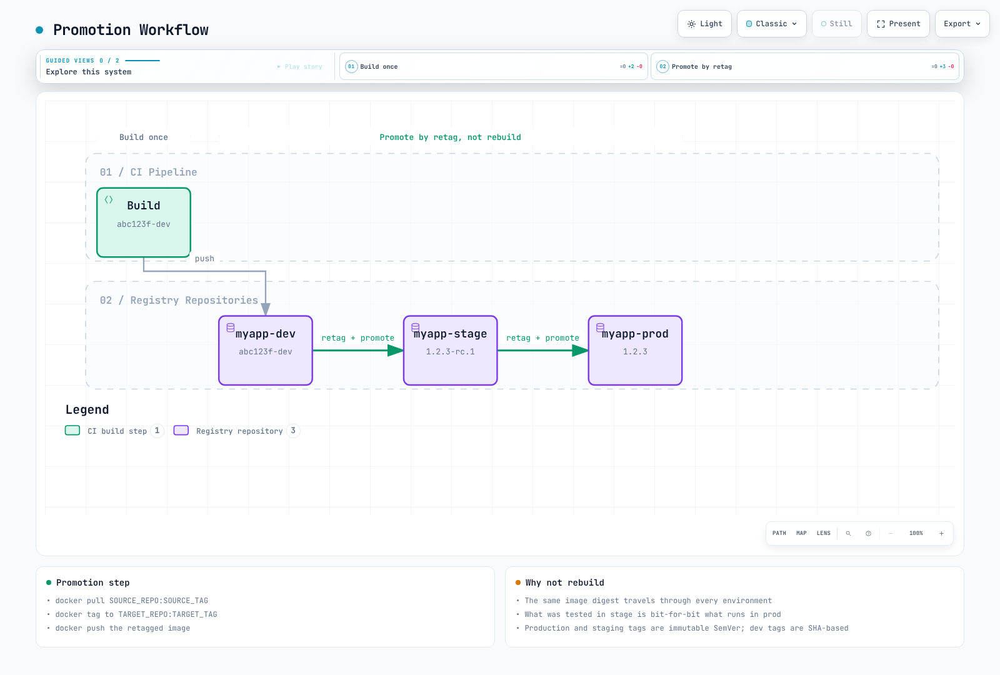

# Container Registry Best Practices

> **Last Updated**: February 25, 2026

## Introduction

This document consolidates best practices for container registry management across Docker Hub, Amazon ECR, and Harbor. These recommendations apply regardless of your chosen registry and focus on operational excellence, security, and cost optimization.

## Tag Management

### Immutable Tags

Immutable tags prevent accidental or malicious overwrites of production images.

| Registry | Configuration |
|----------|---------------|
| Docker Hub | Not supported natively |
| Amazon ECR | `image-tag-mutability: IMMUTABLE` |
| Harbor | Project setting: Content Trust |

```bash
# ECR: Enable immutable tags
aws ecr put-image-tag-mutability \
  --repository-name myapp \
  --image-tag-mutability IMMUTABLE

# Harbor: Enable content trust for project
curl -X PUT "https://harbor.example.com/api/v2.0/projects/myapp" \
  -H "Content-Type: application/json" \
  -u admin:Harbor12345 \
  -d '{"metadata": {"enable_content_trust": "true"}}'
```

### Semantic Versioning

Use SemVer (Semantic Versioning) for release images:

```
MAJOR.MINOR.PATCH[-PRERELEASE][+BUILD]

Examples:
  1.0.0           - Initial release
  1.0.1           - Patch release (bug fixes)
  1.1.0           - Minor release (new features, backward compatible)
  2.0.0           - Major release (breaking changes)
  1.0.0-rc.1      - Release candidate
  1.0.0-beta.2    - Beta release
  1.0.0+build.123 - Build metadata
```

### Tag Strategy by Environment

| Environment | Tag Pattern | Example | Mutability |
|-------------|-------------|---------|------------|
| Production | SemVer | `1.2.3` | Immutable |
| Staging | SemVer-rc | `1.2.3-rc.1` | Immutable |
| Development | SHA-based | `abc123f-dev` | Mutable |
| Feature branch | Branch-SHA | `feature-auth-abc123f` | Mutable |
| CI builds | Build number | `build-456` | Mutable |

### The `latest` Tag Anti-Pattern

**Never use `latest` in production.** Problems with `latest`:

1. **Non-deterministic**: Different nodes may pull different images
2. **No rollback path**: Cannot revert to "previous latest"
3. **Cache confusion**: `imagePullPolicy: Always` required
4. **Audit nightmare**: Cannot determine what version is running

```yaml
# BAD - Never do this in production
spec:
  containers:
  - name: app
    image: myregistry.com/myapp:latest
    imagePullPolicy: Always  # Required but expensive

# GOOD - Use specific versions
spec:
  containers:
  - name: app
    image: myregistry.com/myapp:1.2.3
    # imagePullPolicy: IfNotPresent (default, efficient)
```

When `latest` is acceptable:
- Local development
- Tutorials and examples
- Base images in Dockerfiles (pin in production)

### Promotion Workflows

Implement a promotion workflow rather than rebuilding images:



[🔍 View interactive diagram](https://www.atomai.click/kubernetes-docs/archmaps/en-container-registry-04-best-practices-10.html)

Promotion script:

```bash
#!/bin/bash
# promote-image.sh

set -e

SOURCE_REPO=$1      # e.g., myapp-dev
SOURCE_TAG=$2       # e.g., abc123f-dev
TARGET_REPO=$3      # e.g., myapp-prod
TARGET_TAG=$4       # e.g., 1.2.3

REGISTRY="123456789012.dkr.ecr.us-east-1.amazonaws.com"

# Login
aws ecr get-login-password --region us-east-1 | \
  docker login --username AWS --password-stdin $REGISTRY

# Pull, retag, push
docker pull ${REGISTRY}/${SOURCE_REPO}:${SOURCE_TAG}
docker tag ${REGISTRY}/${SOURCE_REPO}:${SOURCE_TAG} ${REGISTRY}/${TARGET_REPO}:${TARGET_TAG}
docker push ${REGISTRY}/${TARGET_REPO}:${TARGET_TAG}

echo "Promoted ${SOURCE_REPO}:${SOURCE_TAG} to ${TARGET_REPO}:${TARGET_TAG}"
```

## Image Naming Conventions

### Standard Format

```
[REGISTRY/]NAMESPACE/REPOSITORY:TAG[@DIGEST]

Examples:
  nginx:1.25                                    # Docker Hub official
  myuser/myapp:v1.0.0                          # Docker Hub user
  123456789012.dkr.ecr.us-east-1.amazonaws.com/myapp:v1.0.0  # ECR
  harbor.example.com/production/myapp:v1.0.0   # Harbor
  ghcr.io/myorg/myapp:v1.0.0                   # GitHub Container Registry
```

### Organizational Structure

```
REGISTRY/
├── NAMESPACE (organization/team/environment)/
│   ├── REPOSITORY (application name)/
│   │   ├── TAG (version)
│   │   └── TAG
│   └── REPOSITORY/
└── NAMESPACE/
```

Example ECR structure:

```
123456789012.dkr.ecr.us-east-1.amazonaws.com/
├── platform/
│   ├── nginx-ingress:v1.9.0
│   ├── cert-manager:v1.13.0
│   └── external-dns:v0.14.0
├── myapp/
│   ├── api:v2.1.0
│   ├── web:v2.1.0
│   └── worker:v2.1.0
└── tools/
    ├── kubectl:1.28
    └── helm:3.13
```

### Environment Prefixes

For single-repository strategies:

```
myapp:v1.2.3                 # Production release
myapp:v1.2.3-staging         # Staging candidate
myapp:abc123f-dev            # Development build
myapp:abc123f-feature-auth   # Feature branch
```

### Multi-Architecture Images

Use manifest lists for multi-arch support:

```bash
# Build for multiple architectures
docker buildx build \
  --platform linux/amd64,linux/arm64 \
  --tag myregistry.com/myapp:v1.0.0 \
  --push .

# Inspect manifest
docker manifest inspect myregistry.com/myapp:v1.0.0
```

Tag conventions for arch-specific images (if needed):

```
myapp:v1.0.0           # Manifest list (preferred)
myapp:v1.0.0-amd64     # AMD64-specific
myapp:v1.0.0-arm64     # ARM64-specific
```

## Registry Mirroring and Caching

### Why Mirror/Cache?

1. **Rate limit avoidance**: Docker Hub limits pulls
2. **Improved performance**: Local cache reduces latency
3. **Reliability**: No dependency on external availability
4. **Security**: Control over what images enter your environment
5. **Cost savings**: Reduce cross-region/internet transfer costs


[🔍 View interactive diagram](https://www.atomai.click/kubernetes-docs/archmaps/en-container-registry-04-best-practices-1.html)

### Pull-Through Cache Comparison

| Feature | ECR Pull-Through | Harbor Proxy | Distribution |
|---------|-----------------|--------------|--------------|
| Managed | Yes | No | No |
| Upstream support | Docker Hub, Quay, ECR Public, K8s | Any OCI | Docker Hub |
| Authentication | Secrets Manager | Built-in | Environment vars |
| Scanning | Yes (on pull) | Yes | No |
| High availability | Built-in | Self-managed | Self-managed |

### ECR Pull-Through Cache Setup

```bash
# Create upstream credentials in Secrets Manager
aws secretsmanager create-secret \
  --name ecr-pullthroughcache/docker-hub \
  --secret-string '{"username":"dockerhub-user","accessToken":"dckr_pat_xxx"}'

# Create pull-through cache rule
aws ecr create-pull-through-cache-rule \
  --ecr-repository-prefix docker-hub \
  --upstream-registry-url registry-1.docker.io \
  --credential-arn arn:aws:secretsmanager:us-east-1:123456789012:secret:ecr-pullthroughcache/docker-hub

# Usage: prefix original image path
# docker.io/library/nginx:latest -> ${ECR}/docker-hub/library/nginx:latest
# docker.io/bitnami/redis:latest -> ${ECR}/docker-hub/bitnami/redis:latest
```

### Containerd Mirror Configuration

```toml
# /etc/containerd/config.toml

# ECR Pull-Through Cache
[plugins."io.containerd.grpc.v1.cri".registry.mirrors."docker.io"]
  endpoint = ["https://123456789012.dkr.ecr.us-east-1.amazonaws.com/docker-hub/"]

# Harbor Proxy Cache
[plugins."io.containerd.grpc.v1.cri".registry.mirrors."docker.io"]
  endpoint = ["https://harbor.internal/v2/dockerhub-cache/"]

# Multiple mirrors (fallback)
[plugins."io.containerd.grpc.v1.cri".registry.mirrors."docker.io"]
  endpoint = [
    "https://harbor.internal/v2/dockerhub-cache/",
    "https://registry-1.docker.io"
  ]
```

### Harbor Proxy Cache Configuration

```bash
# 1. Create registry endpoint
curl -X POST "https://harbor.example.com/api/v2.0/registries" \
  -H "Content-Type: application/json" \
  -u admin:Harbor12345 \
  -d '{
    "name": "docker-hub",
    "type": "docker-hub",
    "url": "https://hub.docker.com",
    "credential": {
      "type": "basic",
      "access_key": "username",
      "access_secret": "password"
    }
  }'

# 2. Create proxy cache project
curl -X POST "https://harbor.example.com/api/v2.0/projects" \
  -H "Content-Type: application/json" \
  -u admin:Harbor12345 \
  -d '{
    "project_name": "dockerhub-cache",
    "registry_id": 1,
    "metadata": {"public": "true"}
  }'

# Usage: harbor.example.com/dockerhub-cache/library/nginx:latest
```

## Disaster Recovery

### Multi-Region Strategy

```
┌─────────────────────────────────────────────────────────────────┐
│                    Primary Region (us-east-1)                    │
│  ┌─────────────┐                                                │
│  │  ECR / Harbor│──────────────────┐                            │
│  └─────────────┘                   │                            │
└────────────────────────────────────┼────────────────────────────┘
                                     │ Replication
                                     ▼
┌─────────────────────────────────────────────────────────────────┐
│                    DR Region (eu-west-1)                         │
│  ┌─────────────┐                                                │
│  │  ECR / Harbor│                                                │
│  └─────────────┘                                                │
└─────────────────────────────────────────────────────────────────┘
```

### ECR Cross-Region Replication

```hcl
resource "aws_ecr_replication_configuration" "dr" {
  replication_configuration {
    rule {
      destination {
        region      = "eu-west-1"
        registry_id = data.aws_caller_identity.current.account_id
      }

      # Only replicate production images
      repository_filter {
        filter      = "prod-"
        filter_type = "PREFIX_MATCH"
      }
    }
  }
}
```

### Harbor Replication for DR

```bash
# Configure DR Harbor as endpoint
curl -X POST "https://harbor-primary.example.com/api/v2.0/registries" \
  -H "Content-Type: application/json" \
  -u admin:Harbor12345 \
  -d '{
    "name": "harbor-dr",
    "type": "harbor",
    "url": "https://harbor-dr.example.com"
  }'

# Create event-based replication
curl -X POST "https://harbor-primary.example.com/api/v2.0/replication/policies" \
  -H "Content-Type: application/json" \
  -u admin:Harbor12345 \
  -d '{
    "name": "dr-replication",
    "dest_registry": {"id": 1},
    "trigger": {"type": "event_based"},
    "enabled": true,
    "deletion": true
  }'
```

### RTO/RPO Targets

| Strategy | RTO | RPO | Cost |
|----------|-----|-----|------|
| Cross-region replication | Minutes | Near-zero | Medium |
| Periodic backup to S3 | Hours | Last backup | Low |
| Multi-registry sync | Minutes | Near-zero | High |
| No DR | Hours-Days | Unknown | None |

### Backup Procedures

```bash
#!/bin/bash
# registry-backup.sh

BACKUP_DATE=$(date +%Y%m%d-%H%M%S)
S3_BUCKET="s3://registry-backups"

# ECR: Export critical images
REPOS=$(aws ecr describe-repositories --query 'repositories[*].repositoryName' --output text)

for repo in $REPOS; do
  # Get latest 5 images per repo
  IMAGES=$(aws ecr describe-images --repository-name $repo \
    --query 'sort_by(imageDetails, &imagePushedAt)[-5:].imageTags[0]' --output text)

  for tag in $IMAGES; do
    [ "$tag" == "None" ] && continue

    IMAGE="${ACCOUNT_ID}.dkr.ecr.${REGION}.amazonaws.com/${repo}:${tag}"
    FILENAME="${repo}-${tag}.tar"

    docker pull $IMAGE
    docker save $IMAGE -o "/tmp/${FILENAME}"
    aws s3 cp "/tmp/${FILENAME}" "${S3_BUCKET}/${BACKUP_DATE}/${FILENAME}"
    rm "/tmp/${FILENAME}"
  done
done

# Harbor: Backup database
kubectl exec -n harbor harbor-database-0 -- \
  pg_dump -U postgres registry | gzip > harbor-db-${BACKUP_DATE}.sql.gz
aws s3 cp harbor-db-${BACKUP_DATE}.sql.gz ${S3_BUCKET}/${BACKUP_DATE}/
```

## Cost Optimization

### Storage Cost Comparison

| Registry | Storage | Transfer (Internet) | Transfer (Same Region) |
|----------|---------|--------------------|-----------------------|
| Docker Hub | Included | Included | Included |
| ECR | $0.10/GB-mo | $0.09/GB | Free |
| Harbor | Self-managed | Self-managed | Self-managed |

### Lifecycle Policy Essentials

Every registry should have lifecycle policies. Target savings:

| Image Type | Retention | Rationale |
|------------|-----------|-----------|
| Production releases | 50-100 versions | Rollback capability |
| Staging/RC | 30 days | Testing period |
| Development | 7-14 days | Iteration cycle |
| Untagged | 1-3 days | Build artifacts |
| Feature branches | 7 days after merge | Review period |

### ECR Cost Optimization

```bash
# Find large repositories
aws ecr describe-repositories --query 'repositories[*].repositoryName' --output text | \
while read repo; do
  SIZE=$(aws ecr describe-images --repository-name $repo \
    --query 'sum(imageDetails[*].imageSizeInBytes)' --output text)
  SIZE_GB=$(echo "scale=2; $SIZE / 1024 / 1024 / 1024" | bc)
  echo "$repo: ${SIZE_GB} GB"
done | sort -t: -k2 -rn | head -20

# Calculate monthly cost
# Total GB * $0.10 = Monthly storage cost
```

### Image Size Optimization

Reduce image sizes to lower storage and transfer costs:

```dockerfile
# BAD: Large image with unnecessary layers
FROM ubuntu:22.04
RUN apt-get update
RUN apt-get install -y python3 python3-pip
RUN pip install flask
COPY . /app

# GOOD: Optimized multi-stage build
FROM python:3.11-slim AS builder
WORKDIR /app
COPY requirements.txt .
RUN pip install --user -r requirements.txt

FROM python:3.11-slim
WORKDIR /app
COPY --from=builder /root/.local /root/.local
COPY . .
ENV PATH=/root/.local/bin:$PATH
CMD ["python", "app.py"]

# BEST: Distroless for maximum reduction
FROM python:3.11-slim AS builder
WORKDIR /app
COPY requirements.txt .
RUN pip install --target=/app/deps -r requirements.txt
COPY . .

FROM gcr.io/distroless/python3-debian12
WORKDIR /app
COPY --from=builder /app /app
ENV PYTHONPATH=/app/deps
CMD ["app.py"]
```

Size comparison:

| Base Image | Size |
|------------|------|
| ubuntu:22.04 | ~77 MB |
| python:3.11 | ~1 GB |
| python:3.11-slim | ~150 MB |
| python:3.11-alpine | ~50 MB |
| distroless/python3 | ~52 MB |

### Transfer Cost Reduction

```yaml
# Use regional endpoints to avoid cross-region transfer
# Kustomize overlay per region

# overlays/us-east-1/kustomization.yaml
images:
- name: myapp
  newName: 123456789012.dkr.ecr.us-east-1.amazonaws.com/myapp

# overlays/eu-west-1/kustomization.yaml
images:
- name: myapp
  newName: 123456789012.dkr.ecr.eu-west-1.amazonaws.com/myapp
```

## Security Checklist

### Image Scanning

| Registry | Scanner | Scan Type | Integration |
|----------|---------|-----------|-------------|
| Docker Hub | Snyk | On-demand | Paid plans |
| ECR | Clair/Inspector | On-push, continuous | Native |
| Harbor | Trivy | On-push | Built-in |

Enable scan-on-push:

```bash
# ECR
aws ecr put-image-scanning-configuration \
  --repository-name myapp \
  --image-scanning-configuration scanOnPush=true

# Harbor (project setting)
curl -X PUT "https://harbor.example.com/api/v2.0/projects/myapp" \
  -d '{"metadata": {"auto_scan": "true"}}'
```

### Admission Controllers

Block deployment of vulnerable or unsigned images:

```yaml
# Kyverno: Block critical vulnerabilities
apiVersion: kyverno.io/v1
kind: ClusterPolicy
metadata:
  name: block-vulnerable-images
spec:
  validationFailureAction: Enforce
  background: false
  rules:
  - name: check-vulnerabilities
    match:
      resources:
        kinds:
        - Pod
    verifyImages:
    - imageReferences:
      - "*"
      attestations:
      - predicateType: cosign.sigstore.dev/attestation/vuln/v1
        conditions:
        - all:
          - key: "{{ criticalCount }}"
            operator: Equals
            value: 0
          - key: "{{ highCount }}"
            operator: LessThanOrEquals
            value: 5
```

```yaml
# OPA Gatekeeper: Require approved registries
apiVersion: constraints.gatekeeper.sh/v1beta1
kind: K8sAllowedRepos
metadata:
  name: allowed-repos
spec:
  match:
    kinds:
    - apiGroups: [""]
      kinds: ["Pod"]
    namespaces:
    - production
  parameters:
    repos:
    - "123456789012.dkr.ecr.us-east-1.amazonaws.com/"
    - "harbor.internal.example.com/"
```

### Least Privilege Access

```json
// ECR: Read-only policy for Kubernetes nodes
{
  "Version": "2012-10-17",
  "Statement": [
    {
      "Effect": "Allow",
      "Action": "ecr:GetAuthorizationToken",
      "Resource": "*"
    },
    {
      "Effect": "Allow",
      "Action": [
        "ecr:BatchCheckLayerAvailability",
        "ecr:GetDownloadUrlForLayer",
        "ecr:BatchGetImage"
      ],
      "Resource": "arn:aws:ecr:*:*:repository/*"
    }
  ]
}
```

```bash
# Harbor: Robot account with minimal permissions
curl -X POST "https://harbor.example.com/api/v2.0/robots" \
  -d '{
    "name": "k8s-pull",
    "permissions": [{
      "kind": "project",
      "namespace": "*",
      "access": [
        {"resource": "repository", "action": "pull"}
      ]
    }]
  }'
```

### Network Policies

```yaml
# Restrict registry access to specific namespaces
apiVersion: networking.k8s.io/v1
kind: NetworkPolicy
metadata:
  name: allow-registry-access
  namespace: production
spec:
  podSelector: {}
  policyTypes:
  - Egress
  egress:
  # Allow ECR
  - to:
    - ipBlock:
        cidr: 0.0.0.0/0
    ports:
    - port: 443
      protocol: TCP
```

### Secrets Management

```yaml
# External Secrets Operator for registry credentials
apiVersion: external-secrets.io/v1beta1
kind: ExternalSecret
metadata:
  name: registry-credentials
spec:
  refreshInterval: 1h
  secretStoreRef:
    name: aws-secrets-manager
    kind: ClusterSecretStore
  target:
    name: registry-pull-secret
    template:
      type: kubernetes.io/dockerconfigjson
      data:
        .dockerconfigjson: |
          {
            "auths": {
              "{{ .registry }}": {
                "username": "{{ .username }}",
                "password": "{{ .password }}"
              }
            }
          }
  data:
  - secretKey: registry
    remoteRef:
      key: registry-credentials
      property: registry
  - secretKey: username
    remoteRef:
      key: registry-credentials
      property: username
  - secretKey: password
    remoteRef:
      key: registry-credentials
      property: password
```

## CI/CD Integration Patterns

### GitHub Actions with ECR

```yaml
# .github/workflows/build-push.yml
name: Build and Push to ECR

on:
  push:
    branches: [main]
    tags: ['v*']

env:
  AWS_REGION: us-east-1
  ECR_REPOSITORY: myapp

jobs:
  build:
    runs-on: ubuntu-latest
    permissions:
      id-token: write
      contents: read

    steps:
    - uses: actions/checkout@v4

    - name: Configure AWS credentials
      uses: aws-actions/configure-aws-credentials@v4
      with:
        role-to-assume: arn:aws:iam::123456789012:role/github-actions-ecr
        aws-region: ${{ env.AWS_REGION }}

    - name: Login to Amazon ECR
      id: login-ecr
      uses: aws-actions/amazon-ecr-login@v2

    - name: Build, tag, and push image
      env:
        ECR_REGISTRY: ${{ steps.login-ecr.outputs.registry }}
        IMAGE_TAG: ${{ github.sha }}
      run: |
        docker build -t $ECR_REGISTRY/$ECR_REPOSITORY:$IMAGE_TAG .
        docker push $ECR_REGISTRY/$ECR_REPOSITORY:$IMAGE_TAG

        # Tag with version if this is a release
        if [[ $GITHUB_REF == refs/tags/v* ]]; then
          VERSION=${GITHUB_REF#refs/tags/}
          docker tag $ECR_REGISTRY/$ECR_REPOSITORY:$IMAGE_TAG \
                     $ECR_REGISTRY/$ECR_REPOSITORY:$VERSION
          docker push $ECR_REGISTRY/$ECR_REPOSITORY:$VERSION
        fi

    - name: Scan image
      run: |
        aws ecr start-image-scan \
          --repository-name $ECR_REPOSITORY \
          --image-id imageTag=${{ github.sha }}

        # Wait for scan to complete
        aws ecr wait image-scan-complete \
          --repository-name $ECR_REPOSITORY \
          --image-id imageTag=${{ github.sha }}

        # Check for critical vulnerabilities
        CRITICAL=$(aws ecr describe-image-scan-findings \
          --repository-name $ECR_REPOSITORY \
          --image-id imageTag=${{ github.sha }} \
          --query 'imageScanFindings.findingSeverityCounts.CRITICAL' \
          --output text)

        if [ "$CRITICAL" != "None" ] && [ "$CRITICAL" -gt 0 ]; then
          echo "Critical vulnerabilities found: $CRITICAL"
          exit 1
        fi
```

### GitLab CI with Harbor

```yaml
# .gitlab-ci.yml
stages:
  - build
  - scan
  - push

variables:
  HARBOR_URL: harbor.example.com
  HARBOR_PROJECT: myapp
  IMAGE_NAME: $HARBOR_URL/$HARBOR_PROJECT/$CI_PROJECT_NAME

build:
  stage: build
  image: docker:24
  services:
    - docker:24-dind
  script:
    - docker build -t $IMAGE_NAME:$CI_COMMIT_SHA .
    - docker save $IMAGE_NAME:$CI_COMMIT_SHA > image.tar
  artifacts:
    paths:
      - image.tar
    expire_in: 1 hour

scan:
  stage: scan
  image: aquasec/trivy:latest
  script:
    - trivy image --input image.tar --exit-code 1 --severity CRITICAL,HIGH
  dependencies:
    - build

push:
  stage: push
  image: docker:24
  services:
    - docker:24-dind
  before_script:
    - echo $HARBOR_PASSWORD | docker login $HARBOR_URL -u $HARBOR_USERNAME --password-stdin
  script:
    - docker load < image.tar
    - docker push $IMAGE_NAME:$CI_COMMIT_SHA

    # Tag as latest for main branch
    - |
      if [ "$CI_COMMIT_BRANCH" == "main" ]; then
        docker tag $IMAGE_NAME:$CI_COMMIT_SHA $IMAGE_NAME:latest
        docker push $IMAGE_NAME:latest
      fi

    # Tag with version for tags
    - |
      if [ -n "$CI_COMMIT_TAG" ]; then
        docker tag $IMAGE_NAME:$CI_COMMIT_SHA $IMAGE_NAME:$CI_COMMIT_TAG
        docker push $IMAGE_NAME:$CI_COMMIT_TAG
      fi
  dependencies:
    - build
  rules:
    - if: $CI_COMMIT_BRANCH == "main"
    - if: $CI_COMMIT_TAG
```

### Build-Scan-Sign-Deploy Pipeline

```yaml
# Complete pipeline with security gates
name: Secure Build Pipeline

on:
  push:
    tags: ['v*']

jobs:
  build:
    runs-on: ubuntu-latest
    outputs:
      digest: ${{ steps.build.outputs.digest }}
    steps:
    - uses: actions/checkout@v4

    - name: Build and push
      id: build
      uses: docker/build-push-action@v5
      with:
        push: true
        tags: ${{ env.REGISTRY }}/${{ env.IMAGE }}:${{ github.ref_name }}

  scan:
    needs: build
    runs-on: ubuntu-latest
    steps:
    - name: Run Trivy vulnerability scanner
      uses: aquasecurity/trivy-action@master
      with:
        image-ref: ${{ env.REGISTRY }}/${{ env.IMAGE }}:${{ github.ref_name }}
        exit-code: '1'
        severity: 'CRITICAL,HIGH'

  sign:
    needs: [build, scan]
    runs-on: ubuntu-latest
    steps:
    - name: Install Cosign
      uses: sigstore/cosign-installer@v3

    - name: Sign image
      env:
        COSIGN_PRIVATE_KEY: ${{ secrets.COSIGN_PRIVATE_KEY }}
        COSIGN_PASSWORD: ${{ secrets.COSIGN_PASSWORD }}
      run: |
        cosign sign --key env://COSIGN_PRIVATE_KEY \
          ${{ env.REGISTRY }}/${{ env.IMAGE }}@${{ needs.build.outputs.digest }}

  deploy:
    needs: sign
    runs-on: ubuntu-latest
    steps:
    - name: Update Kubernetes deployment
      run: |
        kubectl set image deployment/myapp \
          app=${{ env.REGISTRY }}/${{ env.IMAGE }}:${{ github.ref_name }}
```

---

## Image Management with skopeo

[skopeo](https://github.com/containers/skopeo) is a command-line tool for inspecting, copying, and synchronizing container images between registries. It operates without a Docker daemon and requires no root privileges, making it ideal for CI/CD pipelines and air-gap scenarios.

### Installation

```bash
# RHEL/CentOS/Amazon Linux
sudo yum install -y skopeo

# Ubuntu/Debian
sudo apt-get install -y skopeo

# macOS
brew install skopeo
```

### skopeo inspect — Remote Image Inspection

Inspect image metadata without pulling the image:

```bash
# Inspect Docker Hub image
skopeo inspect docker://docker.io/library/nginx:1.25

# Inspect ECR image (requires AWS auth)
skopeo inspect docker://123456789012.dkr.ecr.us-east-1.amazonaws.com/myapp:v1.0.0

# View raw manifest
skopeo inspect --raw docker://docker.io/library/nginx:1.25 | jq .

# Inspect specific architecture
skopeo inspect --override-arch arm64 docker://docker.io/library/nginx:1.25
```

### skopeo copy — Cross-Registry Image Copy

Copy images directly between registries without pulling locally:

```bash
# Docker Hub → ECR
skopeo copy \
  docker://docker.io/library/nginx:1.25 \
  docker://123456789012.dkr.ecr.us-east-1.amazonaws.com/nginx:1.25

# ECR → Harbor
skopeo copy \
  docker://123456789012.dkr.ecr.us-east-1.amazonaws.com/myapp:v1.0.0 \
  docker://harbor.example.com/myapp/backend:v1.0.0

# Format conversion (Docker → OCI)
skopeo copy \
  docker://docker.io/library/nginx:1.25 \
  oci:nginx-oci:1.25

# Save as OCI archive
skopeo copy \
  docker://docker.io/library/nginx:1.25 \
  oci-archive:nginx-1.25.tar
```

### skopeo sync — Bulk Registry Synchronization

Synchronize multiple images at once:

```bash
# Docker Hub → ECR sync (specific image)
skopeo sync --src docker --dest docker \
  docker.io/library/nginx \
  123456789012.dkr.ecr.us-east-1.amazonaws.com/docker-hub

# YAML manifest-based sync
cat > sync-manifest.yaml << 'EOF'
docker.io:
  images:
    nginx:
      - "1.25"
      - "1.24"
    redis:
      - "7-alpine"
      - "6-alpine"
  images-by-tag-regex:
    busybox:
      - "^1\\.3[5-6]"
EOF

skopeo sync --src yaml --dest docker \
  sync-manifest.yaml \
  123456789012.dkr.ecr.us-east-1.amazonaws.com/mirror
```

### Air-Gap Image Transfer

skopeo excels at transferring images to disconnected environments:

```bash
# Step 1: Export images to tar on connected environment
skopeo copy docker://nginx:1.25 oci-archive:nginx-1.25.tar
skopeo copy docker://redis:7-alpine oci-archive:redis-7.tar
skopeo copy docker://registry.k8s.io/pause:3.9 oci-archive:pause-3.9.tar

# Step 2: Transfer via USB/secure file transfer to air-gapped environment

# Step 3: Import into Harbor on air-gapped environment
skopeo copy oci-archive:nginx-1.25.tar \
  docker://harbor.internal/library/nginx:1.25
skopeo copy oci-archive:redis-7.tar \
  docker://harbor.internal/library/redis:7-alpine
skopeo copy oci-archive:pause-3.9.tar \
  docker://harbor.internal/k8s/pause:3.9
```

> **Tip:** Unlike `docker save/load`, skopeo operates without a Docker daemon, making it usable on air-gapped servers where Docker is not installed.

### Tool Comparison

| Capability | skopeo | docker | crane | ctr |
|---|---|---|---|---|
| **Daemon Required** | No | Yes | No | Yes (containerd) |
| **Root Required** | No | Yes (default) | No | Yes |
| **Remote Inspect** | Yes | No (pull needed) | Yes | No |
| **Cross-registry Copy** | Yes | pull+tag+push | Yes | No |
| **Bulk Sync** | Yes (sync) | No | No | No |
| **OCI Support** | Full | Partial | Full | Full |
| **Air-gap Transfer** | oci-archive | docker save | - | export |
| **Multi-arch** | Yes | Limited | Yes | No |
| **CI/CD Friendly** | High | Medium | High | Low |

---

## Summary

### Key Takeaways

1. **Tag Management**
   - Use immutable tags for production
   - Follow SemVer for releases
   - Never use `latest` in production
   - Implement promotion workflows

2. **Naming Conventions**
   - Establish consistent namespace structure
   - Use environment prefixes for single-repo strategies
   - Support multi-architecture images

3. **Mirroring and Caching**
   - Implement pull-through caching to avoid rate limits
   - Mirror critical external images
   - Configure containerd mirrors for transparent caching

4. **Disaster Recovery**
   - Enable cross-region replication
   - Define and test RTO/RPO targets
   - Automate backup procedures

5. **Cost Optimization**
   - Implement lifecycle policies everywhere
   - Optimize image sizes with multi-stage builds
   - Use regional endpoints to reduce transfer costs

6. **Security**
   - Enable scan-on-push
   - Implement admission controllers
   - Follow least privilege principles
   - Use network policies

7. **CI/CD Integration**
   - Automate build-scan-sign-deploy pipelines
   - Use OIDC for cloud authentication
   - Implement security gates

### Quick Reference Matrix

| Practice | Docker Hub | ECR | Harbor |
|----------|------------|-----|--------|
| Immutable tags | N/A | `IMMUTABLE` | Content Trust |
| Lifecycle policies | API cleanup | Native | Tag retention |
| Vulnerability scanning | Snyk (paid) | Basic/Enhanced | Trivy |
| Image signing | Content Trust | Signer | Cosign/Notation |
| Replication | N/A | Cross-region | Push/Pull |
| Pull-through cache | N/A | Native | Proxy project |

### Checklist for New Deployments

- [ ] Repository naming convention documented
- [ ] Tag strategy defined and enforced
- [ ] Lifecycle policies configured
- [ ] Vulnerability scanning enabled
- [ ] Image signing implemented
- [ ] DR replication configured
- [ ] Access controls (RBAC/IAM) configured
- [ ] CI/CD pipeline integrated
- [ ] Monitoring and alerting set up
- [ ] Cost monitoring enabled
- [ ] Backup procedures tested
