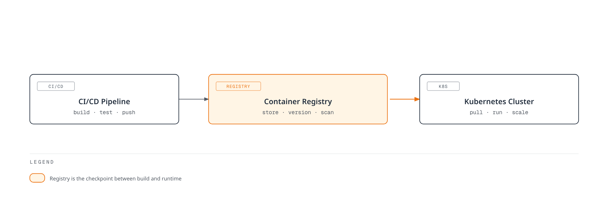

# Container Registry

> **Last Updated**: February 25, 2026

## Introduction

Container registries are fundamental infrastructure components in the Kubernetes ecosystem, serving as centralized repositories for storing, managing, and distributing container images. They act as the bridge between your CI/CD pipelines and Kubernetes clusters, enabling reliable and secure image delivery to your workloads.

A container registry provides:

- **Image Storage**: Persistent storage for container images with versioning through tags
- **Access Control**: Authentication and authorization mechanisms to control who can push/pull images
- **Security Scanning**: Vulnerability detection in container images before deployment
- **Distribution**: Efficient image layer caching and distribution to container runtimes
- **Lifecycle Management**: Automated cleanup and retention policies for storage optimization

## Registry Comparison

| Feature | Docker Hub | Amazon ECR | Harbor |
|---------|------------|------------|--------|
| **Type** | SaaS (Public Cloud) | AWS Managed Service | Self-Hosted (CNCF) |
| **Pricing Model** | Free tier + Paid plans | Pay-per-use (storage + transfer) | Infrastructure cost only |
| **Private Repositories** | Limited (Free: 1, Pro: unlimited) | Unlimited | Unlimited |
| **Public Repositories** | Unlimited | ECR Public (free) | Supported |
| **Storage Pricing** | Included in plan | $0.10/GB-month | Self-managed |
| **Data Transfer** | Rate limited | $0.09/GB (to internet) | Self-managed |
| **Vulnerability Scanning** | Paid plans only | Basic (free) / Enhanced (Inspector) | Trivy (built-in, free) |
| **Image Signing** | Docker Content Trust | Signer (preview) | Cosign/Notation |
| **Replication** | Not available | Cross-region replication | Pull/Push replication |
| **RBAC** | Organization-level | IAM policies | Project-level roles |
| **Air-Gap Support** | No | VPC endpoints | Full offline support |
| **Rate Limits** | Yes (100-5000 pulls/day) | No hard limits | No limits |
| **Integration** | Universal | AWS native (EKS, IAM) | Kubernetes native |
| **Compliance** | SOC 2, ISO 27001 | SOC, PCI, HIPAA, FedRAMP | Self-managed compliance |

## Detailed Comparison

### Docker Hub

**Best For**: Open-source projects, development environments, teams needing quick setup

**Pros**:
- Largest public image library (Official Images, Verified Publishers)
- Zero infrastructure management
- Simple Docker CLI integration
- Automated builds from GitHub/GitLab

**Cons**:
- Rate limits on free tier (100 pulls/6 hours for anonymous, 200 for authenticated)
- Limited private repository storage on free plans
- No native AWS/Kubernetes integration
- Potential supply chain security concerns with public images

**Pricing**:
| Plan | Price | Private Repos | Parallel Builds | Rate Limit |
|------|-------|---------------|-----------------|------------|
| Free | $0 | 1 | 1 | 200 pulls/6h |
| Pro | $5/month | Unlimited | 5 | 5,000 pulls/day |
| Team | $9/user/month | Unlimited | 15 | 50,000 pulls/day |
| Business | $24/user/month | Unlimited | Unlimited | Unlimited |

### Amazon ECR

**Best For**: AWS-native workloads, EKS clusters, enterprises requiring compliance

**Pros**:
- Seamless EKS integration (IAM, IRSA, Pod Identity)
- No rate limits within AWS
- Cross-region replication
- Enhanced scanning with Amazon Inspector
- VPC endpoints for air-gap scenarios
- Pay-per-use pricing (no upfront commitment)

**Cons**:
- AWS vendor lock-in
- Costs can accumulate with large image libraries
- Complex lifecycle policy syntax
- Cross-account access requires careful IAM configuration

**Pricing**:
- Storage: $0.10 per GB-month
- Data Transfer: Free within same region, $0.09/GB to internet
- Enhanced Scanning: Amazon Inspector pricing applies

### Harbor

**Best For**: On-premises, air-gap environments, multi-cloud, compliance-heavy industries

**Pros**:
- Full control over data and infrastructure
- No vendor lock-in
- Rich feature set (replication, scanning, signing, RBAC)
- CNCF graduated project with strong community
- Ideal for regulated industries (finance, healthcare, government)

**Cons**:
- Operational overhead (deployment, upgrades, backups)
- Requires infrastructure investment
- Learning curve for administration
- High availability setup complexity

**Pricing**: No license cost. Infrastructure costs depend on your deployment:
- Kubernetes cluster resources (CPU, memory, storage)
- Persistent storage (databases, registry storage)
- Network/load balancer costs

## Selection Criteria

Choose your container registry based on these factors:

### 1. Infrastructure Environment

| Environment | Recommended Registry |
|-------------|---------------------|
| AWS-native (EKS) | Amazon ECR |
| Multi-cloud / Hybrid | Harbor |
| Development / Open Source | Docker Hub |
| Air-gapped / Disconnected | Harbor |
| Edge / IoT | Harbor (with replication) |

### 2. Security and Compliance Requirements

- **FedRAMP / HIPAA / PCI-DSS with AWS**: Amazon ECR
- **Data Sovereignty / On-premises mandate**: Harbor
- **Basic security with minimal overhead**: Docker Hub (Business plan)

### 3. Team Size and Budget

- **Small team, limited budget**: Docker Hub Free/Pro
- **Growing team with AWS**: Amazon ECR (pay-per-use)
- **Enterprise with dedicated platform team**: Harbor

### 4. Operational Preferences

- **Fully managed, zero ops**: Docker Hub or Amazon ECR
- **Full control, customization**: Harbor

## Section Contents

This section covers container registry concepts and implementation in depth:

1. [Docker Hub](01-docker-hub.md) - Public registry usage, rate limits, and Kubernetes integration
2. [Amazon ECR](02-amazon-ecr.md) - AWS-native registry with lifecycle policies and EKS integration
3. [Harbor](03-harbor.md) - Self-hosted enterprise registry with CNCF graduation
4. [Best Practices](04-best-practices.md) - Cross-registry strategies for security, cost, and operations

## Quick Start Decision Tree

## Summary

Container registries are critical infrastructure that directly impact your deployment reliability, security posture, and operational costs. While Docker Hub offers the easiest entry point, Amazon ECR provides the tightest AWS integration, and Harbor delivers maximum control and flexibility for complex enterprise requirements.

The following documents in this section will provide detailed implementation guidance for each registry option, helping you make the most of your chosen solution.
