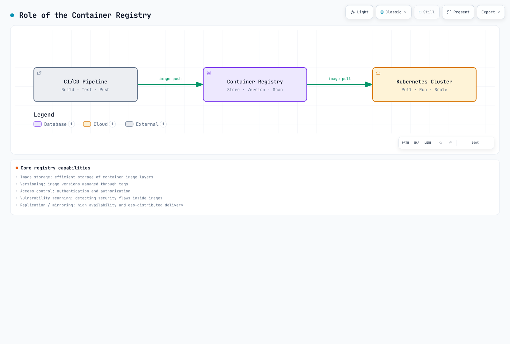

# Container Registry

> **Last Updated**: September 11, 2026

## Introduction

Container registries are fundamental infrastructure components in the Kubernetes ecosystem, serving as centralized repositories for storing, managing, and distributing container images. They act as the bridge between your CI/CD pipelines and Kubernetes clusters, enabling reliable and secure image delivery to your workloads.

A container registry provides:

- **Image Storage**: Persistent storage for container images with versioning through tags
- **Access Control**: Authentication and authorization mechanisms to control who can push/pull images
- **Security Scanning**: Vulnerability detection in container images before deployment
- **Distribution**: Efficient image layer caching and distribution to container runtimes
- **Lifecycle Management**: Automated cleanup and retention policies for storage optimization

[🔍 View interactive diagram](https://www.atomai.click/kubernetes-docs/archmaps/en-container-registry-readme-0.html)

## Registry Comparison

| Feature | Docker Hub | Amazon ECR | Harbor |
|---------|------------|------------|--------|
| **Type** | SaaS (Public Cloud) | AWS Managed Service | Self-Hosted (CNCF) |
| **Pricing Model** | Personal + paid subscriptions | Usage-based | Infrastructure, operations and backups |
| **Private Repositories** | Personal: 1; paid-plan allowances | Service quotas apply | Operator-configured quotas |
| **Public Repositories** | Available under plan policies | ECR Public with free allowances and usage charges | Supported |
| **Storage Pricing** | Plan-dependent | Region/storage-class pricing | Self-managed |
| **Data Transfer** | Usage and fair-use policies | Destination/region-dependent charges | Self-managed |
| **Vulnerability Scanning** | Docker Scout plan allowances | Basic / Enhanced (Inspector) | Trivy integration |
| **Image Signing** | DCT or separate OCI signing tools | AWS Signer managed/manual signing | Cosign/Notation |
| **Replication** | Not available | Cross-region replication | Pull/Push replication |
| **RBAC** | Organization-level | IAM policies | Project-level roles |
| **Fully Disconnected Operation** | Requires access to Hub | Requires AWS connectivity; VPC endpoints provide private access | Import images, scanner databases and installation dependencies |
| **Rate Limits** | Account-specific pull and fair-use policies | Per-API service quotas | Operator limits and infrastructure capacity |
| **Integration** | Universal | AWS native (EKS, IAM) | Kubernetes native |
| **Compliance** | Check the service's current attestations and scope | Check AWS service/region eligibility and your controls | Operator is responsible for controls and evidence |

ECR has [service quotas](https://docs.aws.amazon.com/AmazonECR/latest/userguide/service-quotas.html), including request-rate and repository limits. [AWS Signer integration](https://docs.aws.amazon.com/AmazonECR/latest/userguide/image-signing.html) is supported; storing signatures and enforcing verification during deployment are separate configurations. Check Docker Hub's [current usage policy](https://docs.docker.com/docker-hub/usage/) and response headers rather than treating a historical pull limit as universal.

## Detailed Comparison

### Docker Hub

**Best For**: Open-source projects, development environments, teams needing quick setup

**Pros**:
- Largest public image library (Official Images, Verified Publishers)
- Zero infrastructure management
- Simple Docker CLI integration
- Build-and-push automation through external CI such as GitHub Actions/GitLab CI; native Hub Automated Builds is deprecated

**Cons**:
- Account-specific pull limits and fair-use/abuse controls
- Limited private repository storage on free plans
- No native AWS/Kubernetes integration
- Potential supply chain security concerns with public images

**Pricing**: Compare users, monthly versus annual billing, and included Scout/build usage using the [current pricing page](https://www.docker.com/pricing/). Historical $5 Pro/$9 Team prices and daily pull allowances are not a current pricing baseline.

### Amazon ECR

**Best For**: AWS-native workloads, EKS clusters, enterprises requiring compliance

**Pros**:
- EKS node and Fargate execution-role integration; workload IRSA/Pod Identity permissions are separate from image-pull credentials
- IAM-based access and adjustable API service quotas
- Cross-region replication
- Enhanced scanning with Amazon Inspector
- VPC endpoints for private AWS connectivity, which is not a fully disconnected air gap
- Pay-per-use pricing (no upfront commitment)

**Cons**:
- AWS vendor lock-in
- Costs can accumulate with large image libraries
- Complex lifecycle policy syntax
- Cross-account access requires careful IAM configuration

**Pricing**: Multiply stored data by the applicable regional/storage-class rate, then account for transfer, Inspector, AWS Signer and VPC endpoint charges. At the official example's $0.10/GB-month rate, 100GB costs $10/month **for storage alone**. Same-region transfers to supported AWS compute services differ from internet or cross-region traffic; consult [ECR pricing](https://aws.amazon.com/ecr/pricing/) for the actual path.

### Harbor

**Best For**: On-premises, air-gap environments, multi-cloud, compliance-heavy industries

**Pros**:
- Full control over data and infrastructure
- No vendor lock-in
- Rich feature set (replication, scanning, signing, RBAC)
- CNCF graduated project with strong community
- Ideal for regulated industries (finance, healthcare, government)

**Cons**:
- Operational overhead (deployment, upgrades, backups)
- Requires infrastructure investment
- Learning curve for administration
- High availability setup complexity

**Pricing**: No license cost. Infrastructure costs depend on your deployment:
- Kubernetes cluster resources (CPU, memory, storage)
- Persistent storage (databases, registry storage)
- Network/load balancer costs

## Selection Criteria

Choose your container registry based on these factors:

### 1. Infrastructure Environment

| Environment | Recommended Registry |
|-------------|---------------------|
| AWS-native (EKS) | Amazon ECR |
| Multi-cloud / Hybrid | Harbor |
| Development / Open Source | Docker Hub |
| Air-gapped / Disconnected | Harbor |
| Edge / IoT | Harbor (with replication) |

### 2. Security and Compliance Requirements

Compare access control, credential lifetime, vulnerability scanning, digest pinning, signature verification, network boundaries and recovery procedures. A product is not automatically more secure because it is self-hosted or uses a higher subscription tier. Service compliance eligibility also does not make a workload compliant without its required controls.

- **AWS requirements**: Check ECR eligibility for the specific region and compliance scope.
- **Data sovereignty or disconnected operation**: Harbor provides deployment control, with patching, backup and evidence collection owned by the operator.
- **Managed collaboration**: Compare Docker Hub's actual plan capabilities against the team's required controls.

### 3. Team Size and Budget

- **Small team, limited budget**: Docker Hub Free/Pro
- **Growing team with AWS**: Amazon ECR (pay-per-use)
- **Enterprise with dedicated platform team**: Harbor

### 4. Operational Preferences

- **Fully managed, zero ops**: Docker Hub or Amazon ECR
- **Full control, customization**: Harbor

## Section Contents

This section covers container registry concepts and implementation in depth:

1. [Docker Hub](01-docker-hub.md) - Public registry usage, rate limits, and Kubernetes integration
2. [Amazon ECR](02-amazon-ecr.md) - AWS-native registry with lifecycle policies and EKS integration
3. [Harbor](03-harbor.md) - Self-hosted enterprise registry with CNCF graduation
4. [Best Practices](04-best-practices.md) - Cross-registry strategies for security, cost, and operations

## Quick Start Decision Tree

[🔍 View interactive diagram](https://www.atomai.click/kubernetes-docs/archmaps/en-container-registry-readme-1.html)

## Summary

Container registries are critical infrastructure that directly impact your deployment reliability, security posture, and operational costs. While Docker Hub offers the easiest entry point, Amazon ECR provides the tightest AWS integration, and Harbor delivers maximum control and flexibility for complex enterprise requirements.

The following documents in this section will provide detailed implementation guidance for each registry option, helping you make the most of your chosen solution.
