# Cluster Architecture

> **Supported Versions**: Kubernetes 1.35, 1.36, 1.37
> **Last Updated**: September 9, 2026

The version header refers to upstream Kubernetes. As of September 11, 2026, EKS standard support covers 1.34–1.36; check the [EKS lifecycle](https://docs.aws.amazon.com/eks/latest/userguide/kubernetes-versions.html) before selecting a version. Component commands below illustrate self-managed clusters; EKS manages its control plane. Image tags and infrastructure IDs are examples: select compatible, maintained images and replace placeholders before use.

## Lab Environment Setup

To practice the concepts in this document, you need the following tools and environment:

### Required Tools
- kubectl within one minor version of the API server
- A working Kubernetes cluster (EKS, minikube, kind, etc.)

### Local Development Environment Setup

```bash
# Install minikube (for local development)
curl -LO https://storage.googleapis.com/minikube/releases/latest/minikube-linux-amd64
sudo install minikube-linux-amd64 /usr/local/bin/minikube

# Start cluster
minikube start

# Check cluster status
kubectl cluster-info

# Check control plane components
kubectl get pods -n kube-system
```

## Cluster Architecture Overview

> **Core Concept**: A Kubernetes cluster consists of the control plane and worker nodes, each composed of multiple components that perform specific roles.

A Kubernetes cluster consists of a set of nodes (virtual or physical machines) for running containerized applications. The cluster is broadly divided into the control plane and worker nodes.

### Cluster Architecture Diagram


[🔍 View interactive diagram](https://www.atomai.click/kubernetes-docs/archmaps/en-core-01-cluster-architecture-0.html)

**Control Plane Components**:
- **kube-apiserver**: Frontend that exposes the Kubernetes API
- **etcd**: Key-value store that stores Kubernetes API state
- **kube-scheduler**: Selects nodes to run newly created pods
- **kube-controller-manager**: Runs controllers that manage cluster state
- **cloud-controller-manager**: Interacts with cloud provider APIs

**Worker Node Components**:
- **kubelet**: Agent running on each node, manages container execution
- **kube-proxy**: Maintains network rules and performs connection forwarding
- **Container Runtime**: Runs containers (containerd, CRI-O, etc.)

## Control Plane Components

The control plane acts as the "brain" of the Kubernetes cluster, managing and controlling the overall state of the cluster. Control plane components typically run on dedicated machines and can be replicated to multiple instances for high availability.

### Control Plane Component Details

| Component | Main Functions | Communication Targets | High Availability Configuration |
|-----------|---------------|----------------------|--------------------------------|
| **kube-apiserver** | - Provides Kubernetes API<br>- Authentication and authorization<br>- API request processing | - All components<br>- etcd | Horizontal scaling with multiple instances |
| **etcd** | - Stores cluster data<br>- Distributed key-value store<br>- Ensures consistency | - kube-apiserver | Multi-node cluster |
| **kube-scheduler** | - Pod placement decisions<br>- Evaluates node resources<br>- Applies affinity/anti-affinity | - kube-apiserver | Active-standby configuration |
| **kube-controller-manager** | - Node controller<br>- Replication controller<br>- Endpoint controller<br>- Service account controller | - kube-apiserver | Active-standby configuration |
| **cloud-controller-manager** | - Cloud provider integration<br>- Node lifecycle<br>- Routing and load balancing | - kube-apiserver<br>- Cloud API | Active-standby configuration |

### Control Plane Communication Flow

1. User or controller sends request to kube-apiserver
2. kube-apiserver performs authentication, authorization, and admission
3. kube-apiserver reads/writes data from/to etcd
4. Controllers and scheduler watch cluster state through kube-apiserver
5. kubelet reports node status to kube-apiserver

### kube-apiserver

kube-apiserver is the frontend of the control plane that exposes the Kubernetes API. All internal and external requests are processed through this API server.

**Main Functions**:
- Provides REST API
- Authentication and authorization
- Request validation and processing
- Communication with etcd
- Horizontally scalable (can scale to multiple instances)

**Main Flags and Configuration Options**:
```bash
# Basic configuration example
kube-apiserver \
  --advertise-address=192.168.1.10 \
  --allow-privileged=true \
  --authorization-mode=Node,RBAC \
  --client-ca-file=/etc/kubernetes/pki/ca.crt \
  --enable-admission-plugins=NodeRestriction \
  --enable-bootstrap-token-auth=true \
  --etcd-servers=https://127.0.0.1:2379 \
  --etcd-cafile=/etc/kubernetes/pki/etcd/ca.crt \
  --etcd-certfile=/etc/kubernetes/pki/apiserver-etcd-client.crt \
  --etcd-keyfile=/etc/kubernetes/pki/apiserver-etcd-client.key \
  --kubelet-client-certificate=/etc/kubernetes/pki/apiserver-kubelet-client.crt \
  --kubelet-client-key=/etc/kubernetes/pki/apiserver-kubelet-client.key \
  --service-account-key-file=/etc/kubernetes/pki/sa.pub \
  --service-account-signing-key-file=/etc/kubernetes/pki/sa.key \
  --service-account-issuer=https://kubernetes.default.svc.cluster.local \
  --service-cluster-ip-range=10.96.0.0/12 \
  --tls-cert-file=/etc/kubernetes/pki/apiserver.crt \
  --tls-private-key-file=/etc/kubernetes/pki/apiserver.key
```

**API Server Security**:
- Secure communication through TLS certificates
- Supports various authentication methods (X.509 certificates, service account tokens, OIDC, webhooks, etc.)
- Permission management through RBAC (Role-Based Access Control)
- Request validation and modification through admission controllers

### etcd

etcd is a consistent, highly available key-value store that stores Kubernetes API state. It acts as Kubernetes' "source of truth."

**Key Features**:
- Distributed system
- Strong consistency (uses Raft consensus algorithm)
- High availability (can be configured with multiple nodes)
- Secure data storage
- Watch functionality to monitor changes

**etcd Cluster Configuration**:
```bash
# etcd cluster configuration example (3 nodes)
etcd \
  --name etcd-1 \
  --initial-advertise-peer-urls https://192.168.1.11:2380 \
  --listen-peer-urls https://192.168.1.11:2380 \
  --listen-client-urls https://192.168.1.11:2379,https://127.0.0.1:2379 \
  --advertise-client-urls https://192.168.1.11:2379 \
  --initial-cluster-token etcd-cluster \
  --initial-cluster etcd-1=https://192.168.1.11:2380,etcd-2=https://192.168.1.12:2380,etcd-3=https://192.168.1.13:2380 \
  --initial-cluster-state new \
  --data-dir=/var/lib/etcd \
  --cert-file=/etc/kubernetes/pki/etcd/server.crt \
  --key-file=/etc/kubernetes/pki/etcd/server.key \
  --trusted-ca-file=/etc/kubernetes/pki/etcd/ca.crt \
  --client-cert-auth=true \
  --peer-cert-file=/etc/kubernetes/pki/etcd/peer.crt \
  --peer-key-file=/etc/kubernetes/pki/etcd/peer.key \
  --peer-trusted-ca-file=/etc/kubernetes/pki/etcd/ca.crt \
  --peer-client-cert-auth=true
```

**etcd Backup and Recovery**:
```bash
# etcd backup
ETCDCTL_API=3 etcdctl snapshot save snapshot.db \
  --endpoints=https://127.0.0.1:2379 \
  --cacert=/etc/kubernetes/pki/etcd/ca.crt \
  --cert=/etc/kubernetes/pki/etcd/server.crt \
  --key=/etc/kubernetes/pki/etcd/server.key

# etcd recovery
etcdutl snapshot restore snapshot.db \
  --bump-revision=1000000000 --mark-compacted \
  --data-dir=/var/lib/etcd-restore \
  --name=etcd-1 \
  --initial-cluster=etcd-1=https://192.168.1.11:2380 \
  --initial-cluster-token=etcd-cluster \
  --initial-advertise-peer-urls=https://192.168.1.11:2380
```

**etcd Performance Optimization**:
- Disk I/O optimization (SSD recommended)
- Proper memory allocation
- Regular compaction and defragmentation
- Appropriate number of etcd nodes based on cluster size (typically 3 or 5)

#### July 2026 Update: etcd v3.7.0 Released

On July 8, 2026, SIG etcd released etcd v3.7.0. Highlights:

- **RangeStream**: streams large range results in chunks instead of buffering the whole response in memory (a long-requested feature)
- **Performance improvements**: optimized keys-only range requests, faster and more reliable leases
- Removes the last remnants of the legacy v2store and completes a major protobuf overhaul
- Ships with updated core dependencies bbolt v1.5.0 and raft v3.7.0

See the [official announcement](https://kubernetes.io/blog/2026/07/08/announcing-etcd-3.7/) and the [etcd v3.7 changelog](https://github.com/etcd-io/etcd/blob/main/CHANGELOG/CHANGELOG-3.7.md) for details.

### kube-scheduler

kube-scheduler is the control plane component that selects nodes to run newly created pods.

**Scheduling Process**:
1. **Filtering**: Identifying nodes that can run the pod
   - Resource requirements (CPU, memory)
   - Node selectors, node affinity
   - Taints and tolerations
   - Volume constraints

2. **Scoring**: Assigning scores to suitable nodes
   - Resource utilization
   - Pod inter-affinity/anti-affinity
   - Data locality
   - Load balancing across nodes

3. **Binding**: Assigning the pod to the optimal node

**Scheduler Configuration**:
```bash
# Basic configuration example
kube-scheduler \
  --kubeconfig=/etc/kubernetes/scheduler.conf \
  --leader-elect=true \
  --v=2
```

**Scheduler Profiles and Plugins**:
- Default scheduler profiles
- Custom scheduler profiles
- Scheduler extension points (filter, score, bind, etc.)
- Multiple scheduler support

**Scheduling Policy**:
```yaml
# Scheduling policy example
apiVersion: kubescheduler.config.k8s.io/v1
kind: KubeSchedulerConfiguration
profiles:
- schedulerName: default-scheduler
  pluginConfig:
  - name: NodeResourcesFit
    args:
      scoringStrategy:
        type: MostAllocated
        resources:
        - name: cpu
          weight: 1
        - name: memory
          weight: 1
```

### kube-controller-manager

kube-controller-manager is the control plane component that runs multiple controller processes. Each controller manages a specific aspect of the cluster.

**Main Controllers**:
- **Node Controller**: Monitors and responds to node status
- **Replication Controller**: Maintains pod replica count
- **EndpointSlice Controller**: Tracks Service backends in EndpointSlices
- **Service Account & Token Controllers**: Create default ServiceAccounts and maintain explicitly requested legacy token Secrets; current Pods use short-lived TokenRequest tokens
- **Job Controller**: Manages one-time tasks
- **CronJob Controller**: Manages scheduled tasks
- **DaemonSet Controller**: Ensures specific pods run on all nodes
- **StatefulSet Controller**: Manages stateful applications
- **PV Controller**: Manages persistent volumes
- **Namespace Controller**: Manages namespace lifecycle
- **Garbage Collector**: Cleans up orphaned objects

**Controller Manager Configuration**:
```bash
# Basic configuration example
kube-controller-manager \
  --kubeconfig=/etc/kubernetes/controller-manager.conf \
  --leader-elect=true \
  --use-service-account-credentials=true \
  --root-ca-file=/etc/kubernetes/pki/ca.crt \
  --service-account-private-key-file=/etc/kubernetes/pki/sa.key \
  --cluster-signing-cert-file=/etc/kubernetes/pki/ca.crt \
  --cluster-signing-key-file=/etc/kubernetes/pki/ca.key \
  --controllers=*,bootstrapsigner,tokencleaner
```

**Controller Operation**:
1. Controllers continuously watch cluster state through the API server
2. Detect differences between current and desired state
3. Perform operations to reconcile the difference
4. Report state changes to the API server

### cloud-controller-manager

cloud-controller-manager is the control plane component that contains cloud-specific control logic. This allows separation of Kubernetes core from cloud provider APIs.

**Main Controllers**:
- **Node Controller**: Checks node status through cloud provider API
- **Route Controller**: Configures routes in cloud environments
- **Service Controller**: Creates, updates, and deletes cloud load balancers

Cloud storage provisioning and attachment use CSI controllers; kubelet and CSI node plugins handle mounts. These are not cloud-controller-manager responsibilities.

**Cloud Provider Implementations**:
- AWS Cloud Controller Manager
- Azure Cloud Controller Manager
- GCP Cloud Controller Manager
- OpenStack Cloud Controller Manager
- vSphere Cloud Controller Manager

**Cloud Controller Manager Configuration**:
```bash
# AWS Cloud Controller Manager example
cloud-controller-manager \
  --cloud-provider=aws \
  --cloud-config=/etc/kubernetes/cloud-config \
  --kubeconfig=/etc/kubernetes/cloud-controller-manager.conf \
  --leader-elect=true
```

**Cloud Controller Manager Benefits**:
- Separation of cloud provider-specific code from Kubernetes core
- Cloud providers can develop their own features independently
- Add cloud features without changing Kubernetes core

## Node Components

Nodes are worker machines in the Kubernetes cluster that run containerized applications. Each node is managed by the control plane and consists of multiple components.

### kubelet

kubelet is an agent running on each node that manages containers within pods. kubelet receives PodSpecs through various mechanisms and ensures containers run healthily according to those specs.

**Main Functions**:
- Runs containers according to PodSpec
- Monitors and reports container status
- Manages container lifecycle
- Manages volume mounts
- Reports node status
- Performs container health checks

**kubelet Configuration**:
```bash
# Basic configuration example
kubelet \
  --kubeconfig=/etc/kubernetes/kubelet.conf \
  --config=/var/lib/kubelet/config.yaml \
  --container-runtime-endpoint=unix:///run/containerd/containerd.sock
```

**kubelet Configuration File Example**:
```yaml
# /var/lib/kubelet/config.yaml
apiVersion: kubelet.config.k8s.io/v1beta1
kind: KubeletConfiguration
address: 0.0.0.0
authentication:
  anonymous:
    enabled: false
  webhook:
    cacheTTL: 2m0s
    enabled: true
  x509:
    clientCAFile: /etc/kubernetes/pki/ca.crt
authorization:
  mode: Webhook
  webhook:
    cacheAuthorizedTTL: 5m0s
    cacheUnauthorizedTTL: 30s
cgroupDriver: systemd
clusterDomain: cluster.local
cpuManagerPolicy: none
evictionHard:
  memory.available: 100Mi
  nodefs.available: 10%
  nodefs.inodesFree: 5%
failSwapOn: true
healthzBindAddress: 127.0.0.1
healthzPort: 10248
```

**Static Pods**: The manifest below is a fragment, not a complete control-plane installation; it also needs host networking, certificates, mounts, and the full API-server configuration.
kubelet can run static pods that it manages directly without going through the API server. This is primarily used to run control plane components.

```yaml
# /etc/kubernetes/manifests/kube-apiserver.yaml
apiVersion: v1
kind: Pod
metadata:
  name: kube-apiserver
  namespace: kube-system
spec:
  containers:
  - name: kube-apiserver
    image: registry.k8s.io/kube-apiserver:v1.37.0
    command:
    - kube-apiserver
    - --advertise-address=192.168.1.10
    # ... additional flags
```

### kube-proxy

kube-proxy is a network proxy running on each node that implements the Kubernetes Service concept. It maintains network rules on nodes and performs connection forwarding.

**Main Functions**:
- Maintains network rules for service IPs and ports
- Connection forwarding
- Implements load balancing
- Supports service discovery

**Operating Modes**:
1. **iptables**: Default Linux mode; installs kernel packet-processing rules
2. **nftables**: Stable since v1.33; check kernel and CNI compatibility
3. **IPVS**: Legacy Linux mode, deprecated since v1.35; migrate to a supported alternative
4. **kernelspace**: Windows mode

The old `userspace` mode was removed. Some network implementations replace kube-proxy entirely.

**kube-proxy Configuration**:
```bash
# Basic configuration example
kube-proxy \
  --config=/var/lib/kube-proxy/config.conf \
  --hostname-override=node1
```

**kube-proxy Configuration File Example**:
```yaml
# /var/lib/kube-proxy/config.conf
apiVersion: kubeproxy.config.k8s.io/v1alpha1
kind: KubeProxyConfiguration
bindAddress: 0.0.0.0
clientConnection:
  acceptContentTypes: ""
  burst: 10
  contentType: application/vnd.kubernetes.protobuf
  kubeconfig: /var/lib/kube-proxy/kubeconfig.conf
  qps: 5
clusterCIDR: 10.244.0.0/16
configSyncPeriod: 15m0s
conntrack:
  maxPerCore: 32768
  min: 131072
  tcpCloseWaitTimeout: 1h0m0s
  tcpEstablishedTimeout: 24h0m0s
enableProfiling: false
healthzBindAddress: 0.0.0.0:10256
hostnameOverride: node1
iptables:
  masqueradeAll: false
  masqueradeBit: 14
  minSyncPeriod: 0s
  syncPeriod: 30s
ipvs:
  excludeCIDRs: null
  minSyncPeriod: 0s
  scheduler: ""
  syncPeriod: 30s
mode: "iptables"
```

**IPVS vs iptables Mode Comparison**:

| Characteristic | iptables Mode | IPVS Mode |
|----------------|---------------|-----------|
| Performance | Performance degradation with many services | Better performance in large clusters |
| Load Balancing Algorithms | Random backend selection by default | Various algorithms supported (rr, lc, dh, sh, sed, nq) |
| Implementation | Network packet filtering chains | Hash table based |
| Kernel Requirements | Default kernel modules | IPVS kernel module required |

### Container Runtime

Container runtime is software that runs containers. Kubernetes supports various container runtimes through the Container Runtime Interface (CRI).

**Main Container Runtimes**:
1. **containerd**: Lightweight container runtime (currently most widely used)
2. **CRI-O**: Lightweight runtime specifically designed for Kubernetes
3. **Docker Engine**: Requires an external CRI adapter such as cri-dockerd; the built-in dockershim was removed in v1.24. Docker-built OCI images still work with containerd/CRI-O.

**Container Runtime Layer Structure**:

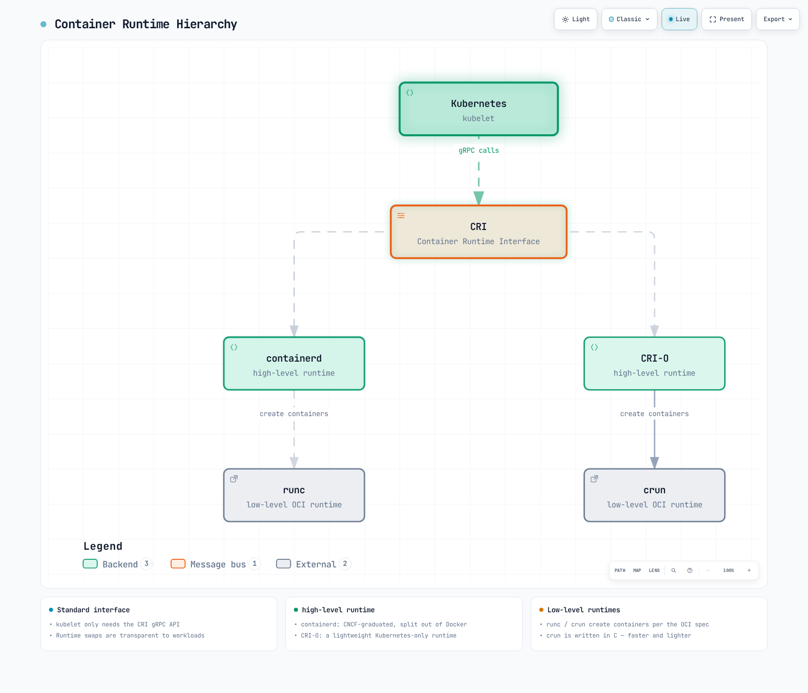

[🔍 View interactive diagram](https://www.atomai.click/kubernetes-docs/archmaps/en-core-01-cluster-architecture-1.html)

**containerd 1.x Configuration Example** (2.x uses different plugin IDs; generate defaults for the installed release):
```toml
# /etc/containerd/config.toml
version = 2

[plugins]
  [plugins."io.containerd.grpc.v1.cri"]
    sandbox_image = "registry.k8s.io/pause:3.10"
    [plugins."io.containerd.grpc.v1.cri".containerd]
      default_runtime_name = "runc"
      [plugins."io.containerd.grpc.v1.cri".containerd.runtimes]
        [plugins."io.containerd.grpc.v1.cri".containerd.runtimes.runc]
          runtime_type = "io.containerd.runc.v2"
          [plugins."io.containerd.grpc.v1.cri".containerd.runtimes.runc.options]
            SystemdCgroup = true
```

**CRI-O Configuration Example**:
```toml
# /etc/crio/crio.conf
[crio]
root = "/var/lib/containers/storage"
runroot = "/var/run/containers/storage"
storage_driver = "overlay"
storage_option = ["overlay.mountopt=nodev"]

[crio.runtime]
default_runtime = "runc"
conmon = "/usr/bin/conmon"
conmon_cgroup = "pod"
cgroup_manager = "systemd"

[crio.image]
pause_image = "registry.k8s.io/pause:3.10"
```

### Add-on Components

Add-ons are additional components that extend the functionality of Kubernetes clusters. Some important add-ons include:

1. **CNI Network Plugins**: Implements pod networking
   - Calico, Cilium, Flannel, etc.

2. **DNS**: Provides DNS service within the cluster
   - CoreDNS (default)

3. **Dashboard**: Provides web-based UI
   - Headlamp (Kubernetes Dashboard is archived)

4. **Ingress Controller**: Manages HTTP/HTTPS routing
   - Traefik, HAProxy, etc.

5. **Metrics Server**: Collects resource usage metrics
   - Metrics Server

6. **Logging and Monitoring**: Log collection and monitoring
   - Prometheus, Grafana, Elasticsearch, Fluentd, Kibana, etc.

**CoreDNS Configuration Example**:
```yaml
apiVersion: v1
kind: ConfigMap
metadata:
  name: coredns
  namespace: kube-system
data:
  Corefile: |
    .:53 {
        errors
        health {
            lameduck 5s
        }
        ready
        kubernetes cluster.local in-addr.arpa ip6.arpa {
            pods insecure
            fallthrough in-addr.arpa ip6.arpa
            ttl 30
        }
        prometheus :9153
        forward . /etc/resolv.conf {
            max_concurrent 1000
        }
        cache 30
        loop
        reload
        loadbalance
    }
```

**Calico CNI Configuration Example**:
```yaml
apiVersion: v1
kind: ConfigMap
metadata:
  name: calico-config
  namespace: kube-system
data:
  calico_backend: "bird"
  cni_network_config: |-
    {
      "name": "k8s-pod-network",
      "cniVersion": "0.3.1",
      "plugins": [
        {
          "type": "calico",
          "log_level": "info",
          "datastore_type": "kubernetes",
          "nodename": "__KUBERNETES_NODE_NAME__",
          "mtu": __CNI_MTU__,
          "ipam": {
            "type": "calico-ipam"
          },
          "policy": {
            "type": "k8s"
          },
          "kubernetes": {
            "kubeconfig": "__KUBECONFIG_FILEPATH__"
          }
        },
        {
          "type": "portmap",
          "snat": true,
          "capabilities": {"portMappings": true}
        }
      ]
    }
```

## Cluster Communication Paths

Communication between various components occurs within a Kubernetes cluster. Understanding these communication paths is important for cluster design, security, and troubleshooting.

### Control Plane Internal Communication

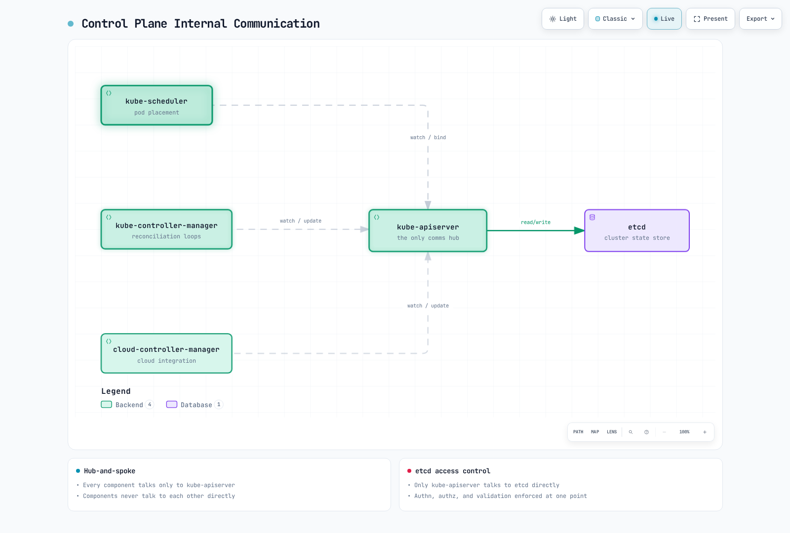

[🔍 View interactive diagram](https://www.atomai.click/kubernetes-docs/archmaps/en-core-01-cluster-architecture-2.html)

Communication between control plane components is as follows:

1. **kube-apiserver and etcd**: kube-apiserver communicates with etcd to store and retrieve cluster state.
   - Protocol: gRPC
   - Port: 2379/TCP
   - Security: TLS certificate-based authentication

2. **kube-scheduler and kube-apiserver**: kube-scheduler communicates with kube-apiserver for pod scheduling.
   - Protocol: HTTPS
   - Port: 6443/TCP (kube-apiserver)
   - Security: TLS certificate-based authentication

3. **kube-controller-manager and kube-apiserver**: Controllers communicate with kube-apiserver to watch and modify cluster state.
   - Protocol: HTTPS
   - Port: 6443/TCP (kube-apiserver)
   - Security: TLS certificate-based authentication

4. **cloud-controller-manager and kube-apiserver**: Cloud controller communicates with kube-apiserver to watch cluster state and manage cloud resources.
   - Protocol: HTTPS
   - Port: 6443/TCP (kube-apiserver)
   - Security: TLS certificate-based authentication

### Control Plane and Node Communication

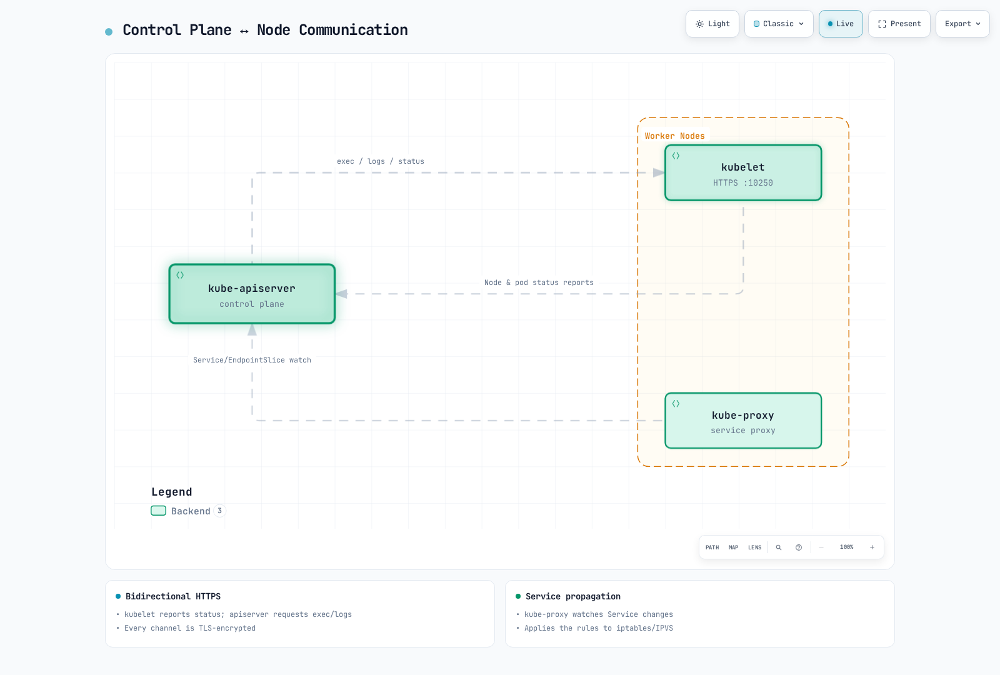

[🔍 View interactive diagram](https://www.atomai.click/kubernetes-docs/archmaps/en-core-01-cluster-architecture-3.html)

Communication between control plane and nodes is as follows:

1. **kube-apiserver → kubelet**: The API server calls the kubelet API for logs, exec/attach, and port forwarding.
   - Protocol: HTTPS
   - Port: 10250/TCP (kubelet)
   - Security: TLS certificate-based authentication

2. **kubelet and kube-apiserver**: kubelet communicates with kube-apiserver to watch assigned PodSpecs, register the node, and report node/Pod status and events.
   - Protocol: HTTPS
   - Port: 6443/TCP (kube-apiserver)
   - Security: TLS certificate-based authentication

3. **kube-proxy and kube-apiserver**: kube-proxy communicates with kube-apiserver to retrieve service information.
   - Protocol: HTTPS
   - Port: 6443/TCP (kube-apiserver)
   - Security: TLS certificate-based authentication

### Inter-Node Communication

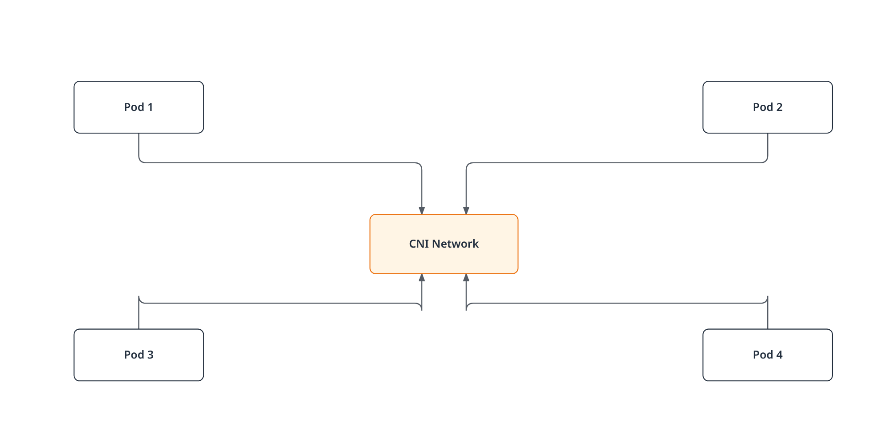

[🔍 View interactive diagram](https://www.atomai.click/kubernetes-docs/archmaps/en-core-01-cluster-architecture-4.html)

Inter-node communication is as follows:

1. **Pod-to-Pod Communication**: Pods communicate with each other through the network provided by CNI plugins.
   - Protocol: Depends on application (TCP, UDP, etc.)
   - Port: Depends on application
   - Security: Can be controlled through network policies

2. **Cross-Node Pod Communication**: Communication between pods on different nodes is handled by the CNI plugin.
   - Protocol: Depends on application (TCP, UDP, etc.)
   - Port: Depends on application
   - Security: Can be controlled through network policies

### External Communication

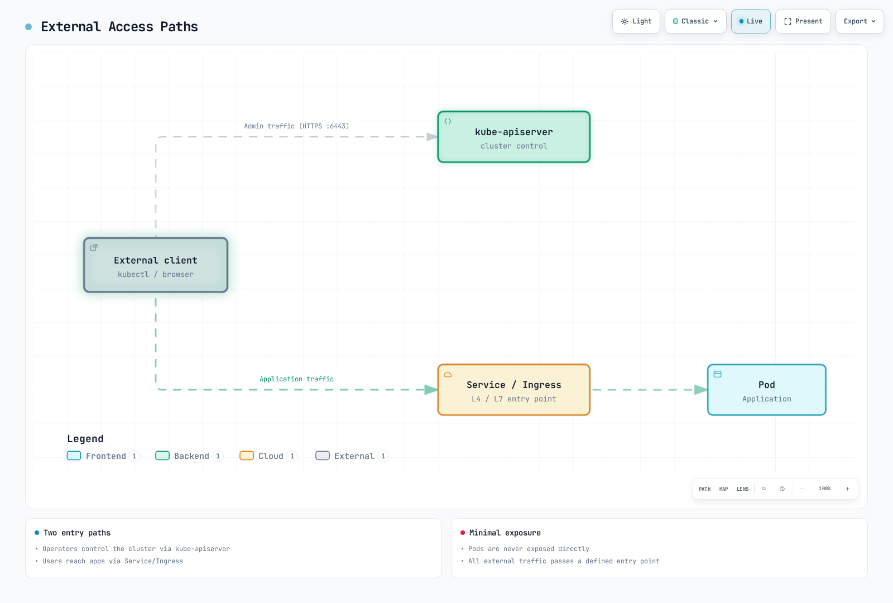

[🔍 View interactive diagram](https://www.atomai.click/kubernetes-docs/archmaps/en-core-01-cluster-architecture-5.html)

Communication with external entities is as follows:

1. **Client and kube-apiserver**: Users and external systems interact with the cluster through kube-apiserver.
   - Protocol: HTTPS
   - Port: 6443/TCP (kube-apiserver)
   - Security: TLS certificates, tokens, user authentication, etc.

2. **External Traffic and Services**: External traffic accesses applications within the cluster through NodePort, LoadBalancer services, or Ingress.
   - Protocol: HTTP, HTTPS, TCP, UDP, etc.
   - Port: Depends on service configuration
   - Security: Depends on ingress controller and service configuration

### Communication Security

Security for communication within a Kubernetes cluster is implemented through the following methods:

1. **TLS Certificates**: All communication between control plane components is encrypted with TLS certificates.
2. **Authentication and Authorization**: All requests to the API server go through authentication and authorization processes.
3. **Network Policies**: Pod-to-pod communication can be restricted through network policies.
4. **Encrypted Secrets**: Secrets stored in etcd can be encrypted.

**API Data Encryption at Rest Example** (configure the API server with `--encryption-provider-config`; rewrite existing Secrets to encrypt them):
```yaml
apiVersion: apiserver.config.k8s.io/v1
kind: EncryptionConfiguration
resources:
  - resources:
    - secrets
    providers:
    - aescbc:
        keys:
        - name: key1
          secret: <base64-encoded-key>
    - identity: {}
```

### High Availability Cluster Configuration

High availability (HA) Kubernetes clusters are designed to eliminate single points of failure and continue operation without service interruption.

### Control Plane High Availability

High availability of the control plane is implemented through the following methods:

1. **Multiple Control Plane Nodes**: Typically deploy 3 or 5 control plane nodes for redundancy
2. **etcd Cluster**: Deploy cluster composed of multiple etcd instances (typically 3 or 5)
3. **Load Balancer**: Place load balancer in front of API servers to distribute traffic

**High Availability Control Plane Architecture**:

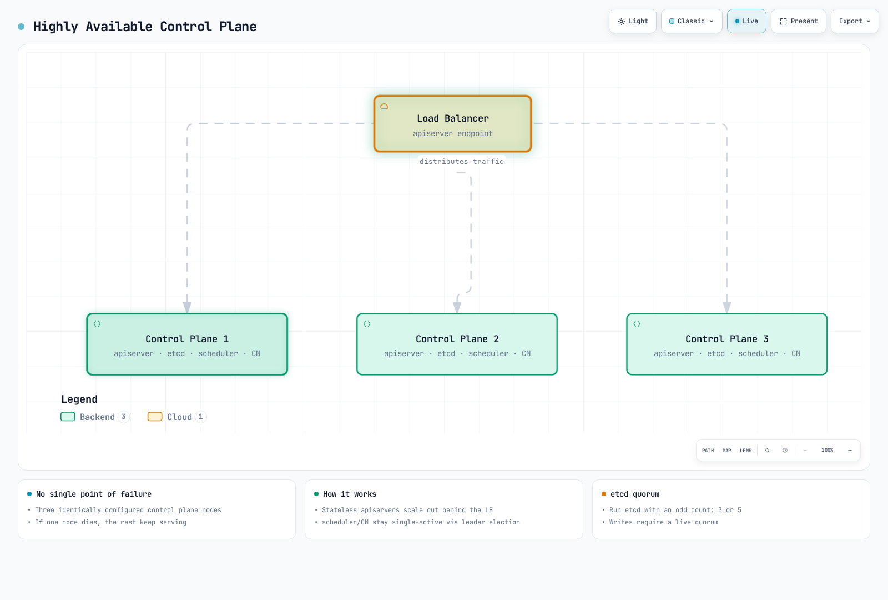

[🔍 View interactive diagram](https://www.atomai.click/kubernetes-docs/archmaps/en-core-01-cluster-architecture-6.html)

**etcd Cluster Configuration**:

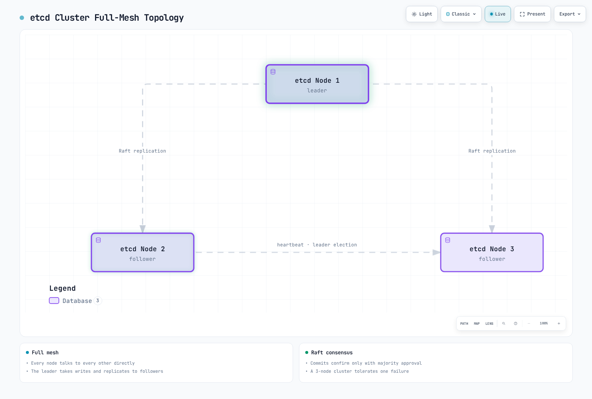

[🔍 View interactive diagram](https://www.atomai.click/kubernetes-docs/archmaps/en-core-01-cluster-architecture-7.html)

### Worker Node High Availability

High availability of worker nodes is implemented through the following methods:

1. **Multiple Worker Nodes**: Distribute workloads across multiple worker nodes
2. **Automatic Node Recovery**: Utilize cloud provider's automatic recovery features
3. **Auto Scaling**: Automatic node scaling through cluster autoscaler
4. **Multiple Availability Zones**: Deploy nodes across multiple availability zones

**Worker Node Distributed Deployment**:

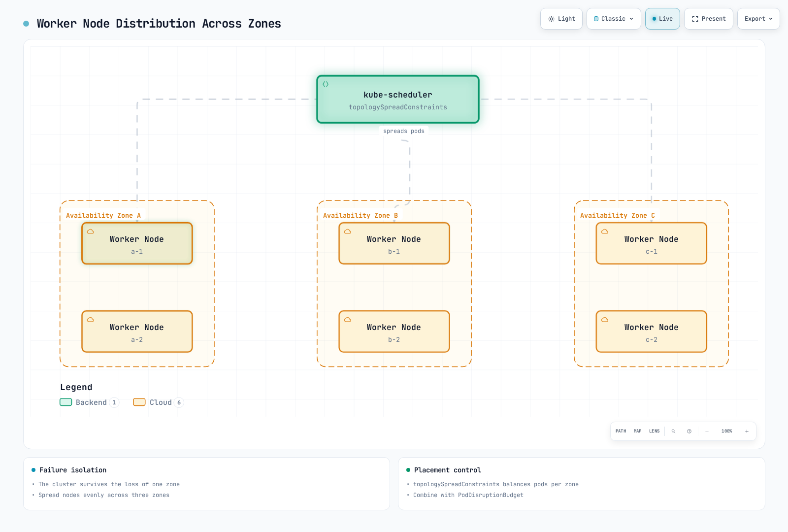

[🔍 View interactive diagram](https://www.atomai.click/kubernetes-docs/archmaps/en-core-01-cluster-architecture-8.html)

### Application High Availability

High availability of applications is implemented through the following methods:

1. **ReplicaSet/Deployment**: Run multiple pod replicas
2. **Pod Distribution Rules**: Distribute pods across multiple nodes through pod anti-affinity
3. **PodDisruptionBudget**: Ensure minimum availability during planned disruptions
4. **Service and Load Balancing**: Distribute traffic across multiple pods

**Pod Anti-Affinity Example**:
```yaml
apiVersion: apps/v1
kind: Deployment
metadata:
  name: web-server
spec:
  replicas: 3
  selector:
    matchLabels:
      app: web-server
  template:
    metadata:
      labels:
        app: web-server
    spec:
      affinity:
        podAntiAffinity:
          requiredDuringSchedulingIgnoredDuringExecution:
          - labelSelector:
              matchExpressions:
              - key: app
                operator: In
                values:
                - web-server
            topologyKey: "kubernetes.io/hostname"
      containers:
      - name: web-server
        image: nginx:1.30.4
```

**PodDisruptionBudget Example**:
```yaml
apiVersion: policy/v1
kind: PodDisruptionBudget
metadata:
  name: web-server-pdb
spec:
  minAvailable: 2
  selector:
    matchLabels:
      app: web-server
```

### Disaster Recovery Strategy

Disaster recovery strategies for Kubernetes clusters are implemented through the following methods:

1. **etcd Backup and Recovery**: Establish regular etcd data backup and recovery procedures
2. **Multi-Region Deployment**: Deploy clusters across multiple regions
3. **Cluster Federation**: Manage multiple clusters in federation
4. **Continuous Backup**: Continuous backup of application data

**etcd Backup Script Example**:
```bash
#!/bin/bash
ETCDCTL_API=3 etcdctl snapshot save /backup/etcd-snapshot-$(date +%Y%m%d-%H%M%S).db \
  --endpoints=https://127.0.0.1:2379 \
  --cacert=/etc/kubernetes/pki/etcd/ca.crt \
  --cert=/etc/kubernetes/pki/etcd/server.crt \
  --key=/etc/kubernetes/pki/etcd/server.key
```

**etcd recovery procedure (self-managed clusters)**:

1. Validate the snapshot with `etcdutl snapshot status`. Restore into a new data directory with a compatible `etcdutl`, as shown above.
2. Before switching data directories, stop all API server instances and the affected etcd processes using the cluster's runbook. Stopping kubelet alone does not stop existing static Pod containers.
3. For a multi-member recovery, restore the same snapshot on every member with a unique name/peer URL and the same full `--initial-cluster` membership. The single-member example above is not an HA recovery recipe.
4. Use `--bump-revision` and `--mark-compacted` for Kubernetes watch caches; choose the bump to exceed revisions since the snapshot (the shown value is an example).
5. Update the etcd static Pod's hostPath to the restored directory, restart etcd, verify quorum/health, then restart API servers and controllers. Keep the original data and backup until verification finishes.

Follow the [etcd recovery guide](https://etcd.io/docs/v3.6/op-guide/recovery/). EKS users do not operate or restore the managed control plane's etcd directly.

## Cluster Networking

Kubernetes networking enables communication between pods, services, and the outside world. The Kubernetes networking model assumes that every pod has a unique IP address and can communicate with each other without NAT.

### Networking Model

The Kubernetes networking model has the following requirements:

1. **Pod-to-Pod Communication**: All pods must be able to communicate with all other pods without NAT
2. **Node-to-Pod Communication**: Node agents must be able to communicate with Pods on that node
3. **Pod-to-External Communication**: External connectivity depends on routing, NAT where needed, and security/egress policy; it is not a requirement that every Pod reach the internet

### CNI (Container Network Interface)

CNI is a standard interface for implementing networking in Kubernetes. There are various CNI plugins, each with different features and performance characteristics.

**Main CNI Plugins**:

1. **Calico**: BGP-based networking, network policy support
   - Features: High performance, network policies, encryption, eBPF support
   - Use cases: Large clusters, security-focused environments

2. **Cilium**: eBPF-based networking and security
   - Features: L3-L7 security policies, high performance, observability
   - Use cases: Microservices, security-focused environments

3. **Flannel**: Simple overlay network
   - Features: Simple setup, lightweight
   - Use cases: Small clusters, development environments

4. **Weave Net (historical)**: The project was archived in June 2024; evaluate maintained alternatives for new deployments.

**CNI Configuration Example (Calico)**:
```yaml
apiVersion: v1
kind: ConfigMap
metadata:
  name: calico-config
  namespace: kube-system
data:
  calico_backend: "bird"
  cni_network_config: |-
    {
      "name": "k8s-pod-network",
      "cniVersion": "0.3.1",
      "plugins": [
        {
          "type": "calico",
          "log_level": "info",
          "datastore_type": "kubernetes",
          "nodename": "__KUBERNETES_NODE_NAME__",
          "mtu": __CNI_MTU__,
          "ipam": {
            "type": "calico-ipam"
          },
          "policy": {
            "type": "k8s"
          },
          "kubernetes": {
            "kubeconfig": "__KUBECONFIG_FILEPATH__"
          }
        },
        {
          "type": "portmap",
          "snat": true,
          "capabilities": {"portMappings": true}
        }
      ]
    }
```

### Service Networking

Kubernetes Services provide stable endpoints for a set of pods. Services have several types including ClusterIP, NodePort, LoadBalancer, and ExternalName.

**Service Networking Components**:

1. **ClusterIP**: Virtual IP accessible only within the cluster
2. **kube-proxy**: Routes traffic to service IPs to pods
3. **CoreDNS**: DNS service for service discovery

**Service Networking Flow**:
```
Client -> kernel rules programmed by kube-proxy (ClusterIP DNAT) -> Pod
```

**Service Example**:
```yaml
apiVersion: v1
kind: Service
metadata:
  name: my-service
spec:
  selector:
    app: my-app
  ports:
  - port: 80
    targetPort: 8080
  type: ClusterIP
```

### Ingress Networking

Ingress manages HTTP and HTTPS routing from outside the cluster to services inside the cluster. Ingress controllers implement ingress resources.

**Main Ingress Controllers**:
1. **Maintained Ingress/Gateway controllers**: Check controller lifecycle and Gateway API support
2. **AWS Load Balancer Controller**: Provisions ALBs for Ingress
3. **Traefik**: Cloud-native edge router
4. **HAProxy Ingress**: HAProxy-based ingress controller

**Ingress Networking Flow**:
```
Client -> Ingress Controller -> Service -> Pod
```

Community ingress-nginx retired in March 2026; see the [retirement notice](https://kubernetes.io/blog/2025/11/11/ingress-nginx-retirement/). This example requires an installed Traefik controller with an IngressClass named `traefik`; `/app` is forwarded unchanged.

**Ingress Example**:
```yaml
apiVersion: networking.k8s.io/v1
kind: Ingress
metadata:
  name: my-ingress
spec:
  ingressClassName: traefik
  rules:
  - host: example.com
    http:
      paths:
      - path: /app
        pathType: Prefix
        backend:
          service:
            name: my-service
            port:
              number: 80
```

### Network Policies

Network policies provide a way to control communication between pods. By default, all pods can communicate with each other, but network policies can restrict this.

**Network Policy Example**:
```yaml
apiVersion: networking.k8s.io/v1
kind: NetworkPolicy
metadata:
  name: db-network-policy
spec:
  podSelector:
    matchLabels:
      role: db
  policyTypes:
  - Ingress
  - Egress
  ingress:
  - from:
    - podSelector:
        matchLabels:
          role: frontend
    ports:
    - protocol: TCP
      port: 3306
  egress:
  - to:
    - podSelector:
        matchLabels:
          role: monitoring
    ports:
    - protocol: TCP
      port: 9090
```

### Network Troubleshooting

Common tools and commands for troubleshooting Kubernetes networking issues:

1. **ping, traceroute**: Basic network connectivity testing
2. **tcpdump**: Network packet capture and analysis
3. **netstat, ss**: Check network connection status
4. **nslookup, dig**: DNS lookup testing
5. **kubectl exec**: Execute network commands within pods

**Network Debugging Example**:
```bash
# Test network connectivity within a pod
kubectl exec -it <pod-name> -- ping <target-ip>

# Test DNS lookup within a pod
kubectl exec -it <pod-name> -- nslookup <service-name>

# Capture network packets within a pod
kubectl exec -it <pod-name> -- tcpdump -i eth0 -n

# Check service endpoints
kubectl get endpointslices -l kubernetes.io/service-name=<service-name>
```

## Cluster Storage

Kubernetes storage provides data persistence for containerized applications. Kubernetes provides various storage options and abstractions to help applications use storage efficiently.

### Storage Architecture

Kubernetes storage architecture consists of the following components:

1. **Volumes**: Directories that can be mounted to containers within pods
2. **Persistent Volumes (PV)**: Storage resources in the cluster
3. **Persistent Volume Claims (PVC)**: User storage requests
4. **Storage Classes**: Defines "classes" or types of storage
5. **CSI (Container Storage Interface)**: Standard interface with storage systems

**Storage Architecture Flow**:

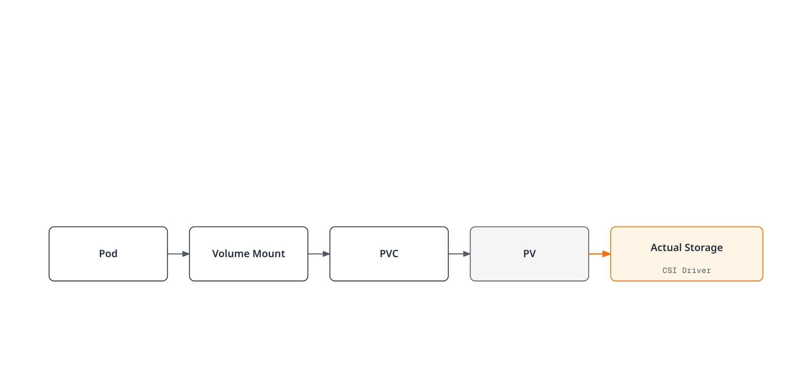

[🔍 View interactive diagram](https://www.atomai.click/kubernetes-docs/archmaps/en-core-01-cluster-architecture-9.html)

### Volume Types

Kubernetes supports various types of volumes:

1. **Ephemeral Volumes**:
   - **emptyDir**: Starts as an empty directory and is deleted when the pod is deleted
   - **configMap**: Mounts ConfigMap as a volume
   - **secret**: Mounts Secret as a volume
   - **downwardAPI**: Exposes pod and container information as files

2. **Persistent Volumes**:
   - **Cloud block storage via CSI**: AWS EBS, Azure Disk, and GCE Persistent Disk; their legacy in-tree implementations have been removed
   - **nfs**: NFS volumes
   - **csi**: Volumes through CSI drivers

**Volume Example**:
```yaml
apiVersion: v1
kind: Pod
metadata:
  name: test-pd
spec:
  containers:
  - name: test-container
    image: nginx
    volumeMounts:
    - mountPath: /test-pd
      name: test-volume
  volumes:
  - name: test-volume
    persistentVolumeClaim:
      claimName: test-pvc
```

### Persistent Volumes and Claims

Persistent Volumes (PV) are storage resources in the cluster that are provisioned by administrators or dynamically provisioned through storage classes. Persistent Volume Claims (PVC) are user storage requests.

Install the EBS CSI driver with IAM permissions first. For the static PV below, replace the volume ID and zone with an existing EBS volume and its actual zone. EBS cannot mount on Fargate; EKS Auto Mode uses `ebs.csi.eks.amazonaws.com` instead.

**Persistent Volume Example**:
```yaml
apiVersion: v1
kind: PersistentVolume
metadata:
  name: pv-example
spec:
  capacity:
    storage: 10Gi
  accessModes:
    - ReadWriteOnce
  persistentVolumeReclaimPolicy: Retain
  storageClassName: standard
  csi:
    driver: ebs.csi.aws.com
    volumeHandle: vol-0123456789abcdef0
    fsType: ext4
  nodeAffinity:
    required:
      nodeSelectorTerms:
      - matchExpressions:
        - key: topology.kubernetes.io/zone
          operator: In
          values: [ap-northeast-2a]
```

**Persistent Volume Claim Example**:
```yaml
apiVersion: v1
kind: PersistentVolumeClaim
metadata:
  name: pvc-example
spec:
  accessModes:
    - ReadWriteOnce
  resources:
    requests:
      storage: 5Gi
  storageClassName: standard
```

### Storage Classes

Storage classes describe the "classes" of storage that administrators provide. Storage classes allow dynamic provisioning of PVs when PVCs are requested.

**Storage Class Example**:
```yaml
apiVersion: storage.k8s.io/v1
kind: StorageClass
metadata:
  name: standard
provisioner: ebs.csi.aws.com
parameters:
  type: gp3
  csi.storage.k8s.io/fstype: ext4
  encrypted: "true"
reclaimPolicy: Delete
allowVolumeExpansion: true
volumeBindingMode: WaitForFirstConsumer
```

### CSI (Container Storage Interface)

CSI provides a standard interface between Kubernetes and storage systems. Through CSI, storage providers can develop their own storage drivers without modifying Kubernetes code.

**CSI Architecture**:

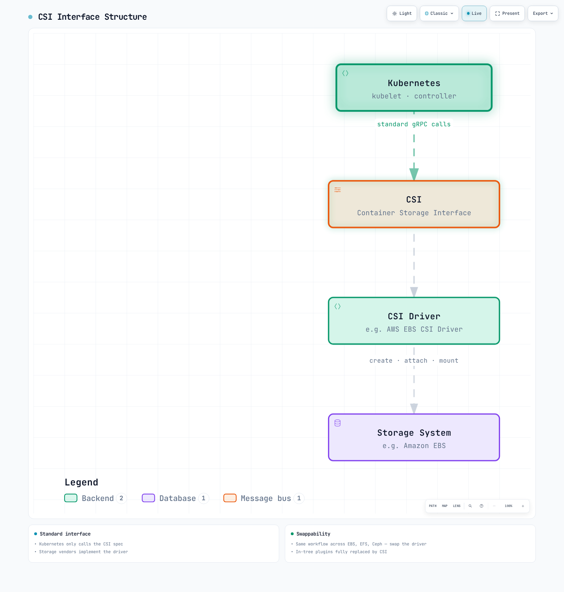

[🔍 View interactive diagram](https://www.atomai.click/kubernetes-docs/archmaps/en-core-01-cluster-architecture-10.html)

**CSI Driver Deployment Example**:
```yaml
apiVersion: storage.k8s.io/v1
kind: StorageClass
metadata:
  name: ebs-sc
provisioner: ebs.csi.aws.com
parameters:
  type: gp3
  csi.storage.k8s.io/fstype: ext4
  encrypted: "true"
volumeBindingMode: WaitForFirstConsumer
```

### Storage Best Practices

Best practices for using Kubernetes storage:

1. **Choose Appropriate Storage Type**: Select storage type that matches workload characteristics
2. **Use Dynamic Provisioning**: Utilize dynamic provisioning through storage classes
3. **Choose Appropriate Access Modes**: Select access modes that match workload requirements
4. **Set Resource Requests and Limits**: Request appropriate storage capacity
5. **Establish Backup and Recovery Strategy**: Prepare backup and recovery strategies for critical data
6. **Monitor Storage**: Monitor storage usage and performance

## Cluster Scalability

Kubernetes cluster scalability refers to the cluster's ability to handle increasing loads and requirements. Scalability can be implemented through horizontal scaling (scale out) and vertical scaling (scale up).

### Cluster Scale Limits

The upstream [large-cluster guidance](https://kubernetes.io/docs/setup/best-practices/cluster-large/) describes a tested support envelope: 5,000 nodes, 150,000 total Pods, 300,000 total containers, and 110 Pods per node. These criteria apply together; they are not universal hard API limits. There is no general 20-containers-per-Pod limit. Service capacity also depends on the address range and data plane. Cloud networking limits and quotas may be lower.

### Horizontal Scaling

Horizontal scaling increases cluster capacity by adding more nodes.

**Node Auto Scaling**:
The Kubernetes Cluster Autoscaler automatically adjusts the number of nodes based on workload requirements.

```yaml
# AWS Auto Scaling Group tags example
tags:
  k8s.io/cluster-autoscaler/enabled: "true"
  k8s.io/cluster-autoscaler/my-cluster: "owned"
```

**Cluster Autoscaler Deployment fragment (v1.36 cluster example)**: Select a patched release matching the cluster minor version. Supply the ServiceAccount, Kubernetes RBAC, and a dedicated IAM role; this fragment is not a complete installation.
```yaml
apiVersion: apps/v1
kind: Deployment
metadata:
  name: cluster-autoscaler
  namespace: kube-system
spec:
  replicas: 1
  selector:
    matchLabels:
      app: cluster-autoscaler
  template:
    metadata:
      labels:
        app: cluster-autoscaler
    spec:
      containers:
      - name: cluster-autoscaler
        image: registry.k8s.io/autoscaling/cluster-autoscaler:v1.36.0
        command:
        - ./cluster-autoscaler
        - --cloud-provider=aws
        - --nodes=2:10:my-asg-group
        - --scale-down-unneeded-time=10m
```

**Karpenter**:
Karpenter is a new node auto-scaling tool developed by AWS that provides faster and more efficient node provisioning.

```yaml
apiVersion: karpenter.sh/v1
kind: NodePool
metadata:
  name: default
spec:
  template:
    spec:
      requirements:
        - key: karpenter.sh/capacity-type
          operator: In
          values: ["spot", "on-demand"]
      nodeClassRef:
        group: karpenter.k8s.aws
        kind: EC2NodeClass
        name: default-class
  limits:
    cpu: 1000
    memory: 1000Gi
---
apiVersion: karpenter.k8s.aws/v1
kind: EC2NodeClass
metadata:
  name: default-class
spec:
  role: KarpenterNodeRole-my-cluster
  amiSelectorTerms:
    - alias: al2023@latest
  subnetSelectorTerms:
    - tags:
        karpenter.sh/discovery: my-cluster
  securityGroupSelectorTerms:
    - tags:
        karpenter.sh/discovery: my-cluster
```

### Vertical Scaling

Vertical workload scaling adjusts Pod CPU/memory requests. VPA does not resize the underlying node; additional node capacity must be provisioned separately.

**Vertical Pod Autoscaler (VPA)**:
VPA automatically adjusts CPU and memory requests for pods.

```yaml
apiVersion: autoscaling.k8s.io/v1
kind: VerticalPodAutoscaler
metadata:
  name: my-app-vpa
spec:
  targetRef:
    apiVersion: "apps/v1"
    kind: Deployment
    name: my-app
  updatePolicy:
    updateMode: "Recreate"
  resourcePolicy:
    containerPolicies:
    - containerName: '*'
      minAllowed:
        cpu: 100m
        memory: 50Mi
      maxAllowed:
        cpu: 1
        memory: 500Mi
```

### Application Scaling

Application-level scaling is implemented by adjusting the number of pod replicas.

**Horizontal Pod Autoscaler (HPA)**:
HPA automatically adjusts the number of pod replicas based on CPU utilization or custom metrics.

```yaml
apiVersion: autoscaling/v2
kind: HorizontalPodAutoscaler
metadata:
  name: my-app-hpa
spec:
  scaleTargetRef:
    apiVersion: apps/v1
    kind: Deployment
    name: my-app
  minReplicas: 2
  maxReplicas: 10
  metrics:
  - type: Resource
    resource:
      name: cpu
      target:
        type: Utilization
        averageUtilization: 80
```

**KEDA (Kubernetes Event-driven Autoscaling)**:
KEDA provides event-driven autoscaling, enabling scaling based on various event sources.

```yaml
apiVersion: keda.sh/v1alpha1
kind: ScaledObject
metadata:
  name: my-app-scaledobject
spec:
  scaleTargetRef:
    name: my-app
  minReplicaCount: 0
  maxReplicaCount: 10
  triggers:
  - type: kafka
    metadata:
      bootstrapServers: kafka.svc:9092
      consumerGroup: my-group
      topic: my-topic
      lagThreshold: "10"
```

### Scalability Best Practices

Best practices for Kubernetes cluster scalability:

1. **Set Resource Requests and Limits**: Set appropriate resource requests and limits for all pods
2. **Node Pool Strategy**: Configure multiple node pools for different workload characteristics
3. **Configure Auto Scaling**: Properly configure Cluster Autoscaler, HPA, VPA
4. **Efficient Pod Placement**: Utilize node affinity, pod affinity/anti-affinity
5. **Cluster Monitoring**: Continuously monitor resource usage and performance
6. **Load Testing**: Regular load testing to validate scaling strategies

## Cluster Security

Kubernetes cluster security must be implemented at multiple layers. This includes authentication, authorization, network policies, pod security, and more.

### Authentication

Methods for authenticating access to the Kubernetes API server:

1. **X.509 Certificates**: Authentication using TLS client certificates
2. **Service Account Tokens**: Tokens for API server access within pods
3. **OpenID Connect (OIDC)**: Authentication through external identity providers
4. **Webhook Token Authentication**: Authentication through external authentication services
5. **Authentication Proxy**: Authentication through authentication proxies

**kubeconfig Example**:
```yaml
apiVersion: v1
kind: Config
clusters:
- name: my-cluster
  cluster:
    certificate-authority-data: <CA-DATA>
    server: https://api.my-cluster.example.com
users:
- name: admin
  user:
    client-certificate-data: <CERT-DATA>
    client-key-data: <KEY-DATA>
contexts:
- name: my-context
  context:
    cluster: my-cluster
    user: admin
current-context: my-context
```

### Authorization

Methods for controlling actions of authenticated users:

1. **RBAC (Role-Based Access Control)**: Role-based access control
2. **ABAC (Attribute-Based Access Control)**: Attribute-based access control
3. **Node Authorization**: Special authorization for nodes
4. **Webhook Authorization**: Authorization through external services

**RBAC Example**:
```yaml
# Role definition
apiVersion: rbac.authorization.k8s.io/v1
kind: Role
metadata:
  namespace: default
  name: pod-reader
rules:
- apiGroups: [""]
  resources: ["pods"]
  verbs: ["get", "watch", "list"]
---
# Role binding
apiVersion: rbac.authorization.k8s.io/v1
kind: RoleBinding
metadata:
  name: read-pods
  namespace: default
subjects:
- kind: User
  name: jane
  apiGroup: rbac.authorization.k8s.io
roleRef:
  kind: Role
  name: pod-reader
  apiGroup: rbac.authorization.k8s.io
```

### Network Security

Methods for protecting network traffic within the cluster:

1. **Network Policies**: Control pod-to-pod communication
2. **Encrypted Communication**: Communication encryption through TLS
3. **Service Mesh**: Advanced network security through Istio, Linkerd, etc.

**Network Policy Example**:
```yaml
apiVersion: networking.k8s.io/v1
kind: NetworkPolicy
metadata:
  name: default-deny-all
spec:
  podSelector: {}
  policyTypes:
  - Ingress
  - Egress
```

### Pod Security

Security implementation at the pod level:

1. **Pod Security Context**: Security settings at pod and container level
2. **Pod Security Standards**: Defines pod security requirements
3. **seccomp Profiles**: System call restrictions
4. **AppArmor/SELinux**: Mandatory access control

**Pod Security Context Example**:
```yaml
apiVersion: v1
kind: Pod
metadata:
  name: security-context-pod
spec:
  securityContext:
    runAsUser: 1000
    runAsGroup: 3000
    fsGroup: 2000
  containers:
  - name: app
    image: myapp:1.0
    securityContext:
      allowPrivilegeEscalation: false
      capabilities:
        drop:
        - ALL
```

### Secret Management

Methods for securely managing sensitive information:

1. **Kubernetes Secrets**: Use basic secret resources
2. **Encrypted etcd**: Encrypt secrets stored in etcd
3. **External Secret Management**: Utilize HashiCorp Vault, AWS Secrets Manager, etc.

**Encrypted etcd Configuration Example**:
```yaml
apiVersion: apiserver.config.k8s.io/v1
kind: EncryptionConfiguration
resources:
  - resources:
    - secrets
    providers:
    - aescbc:
        keys:
        - name: key1
          secret: <base64-encoded-key>
    - identity: {}
```

### Security Best Practices

Best practices for Kubernetes cluster security:

1. **Principle of Least Privilege**: Grant only the minimum necessary privileges
2. **Regular Updates**: Regularly update cluster and components
3. **Network Isolation**: Restrict pod-to-pod communication through network policies
4. **Image Security**: Use only trusted images, implement vulnerability scanning
5. **Audit Logging**: Enable audit logs for cluster activity
6. **Security Benchmarks**: Comply with security standards like CIS benchmarks

## Cluster Upgrades

Kubernetes cluster upgrades are necessary to apply new features, security patches, and bug fixes. Upgrades must be carefully planned and executed.

### August 2026 Update: Kubernetes v1.37 "Garhwal" Released

[Kubernetes v1.37 "Garhwal"](https://kubernetes.io/blog/2026/08/26/kubernetes-v1-37-release/) was released on schedule on August 26, 2026. The release consists of 67 enhancements: 16 graduated to Stable, 23 graduated to Beta, and the rest entered as Alpha. Highlights:

- **Pod certificates and ClusterTrustBundles graduate to Stable**: the PodCertificate feature, which automatically issues and rotates X.509 certificates for workloads as an alternative to service account tokens, and the ClusterTrustBundle resource for distributing trust anchors are now standard features ([detailed post](https://kubernetes.io/blog/2026/08/28/kubernetes-v1-37-pod-certificates-and-cluster-trust-bundles/))
- **Metrics API (metrics.k8s.io) goes GA**: the resource metrics API used by `kubectl top` and the HPA has graduated to stable ([detailed post](https://kubernetes.io/blog/2026/08/27/kubernetes-v1-37-metrics-api-ga/))
- Also **Stable**: several DRA (Dynamic Resource Allocation) features, resilient watchcache initialization, and more / **Beta**: HPA scale-to-zero, manifest-based admission control configuration, and more / **Alpha**: pod-level checkpoint and restore, and more
- **Deprecations**: kube-dns and `kubectl run --filename/-f` are deprecated; `ipvs` was already deprecated in v1.35, and static Pods can no longer reference Secrets or ConfigMaps. The removal of cgroup v1 support also continues to progress.

Before upgrading, be sure to review the deprecations and removals in the [official release notes](https://github.com/kubernetes/kubernetes/blob/master/CHANGELOG/CHANGELOG-1.37.md).

### Upgrade Strategies

Strategies for Kubernetes cluster upgrades:

1. **Blue/Green Upgrade**: Create a new version cluster separately and migrate workloads
2. **In-Place Upgrade**: Directly upgrade the existing cluster
3. **Canary Upgrade**: Upgrade only some nodes first for validation

### Upgrade Order

Typical order for Kubernetes cluster upgrades:

1. **Control Plane Upgrade**: kube-apiserver, kube-controller-manager, kube-scheduler, etcd
2. **DNS and CNI Upgrade**: CoreDNS, CNI plugins, and other major add-ons
3. **Worker Node Upgrade**: Sequential upgrade of worker nodes

**kubeadm upgrade sequence**:

Follow the [version-specific kubeadm upgrade guide](https://kubernetes.io/docs/tasks/administer-cluster/kubeadm/kubeadm-upgrade/) and configure the target minor's `pkgs.k8s.io` package repository. Upgrade only one minor at a time.

1. Back up etcd and verify add-on compatibility. Upgrade `kubeadm` on the first control plane node, run `kubeadm upgrade plan`, then `kubeadm upgrade apply <target-version>`.
2. On additional control plane nodes, upgrade `kubeadm` and run `kubeadm upgrade node`.
3. Drain each node before upgrading its kubelet; upgrade the kubelet/kubectl packages to the chosen patch, reload systemd, restart kubelet, verify readiness, and uncordon.
4. On workers, upgrade `kubeadm`, run `kubeadm upgrade node`, then perform the drain/kubelet/uncordon sequence. Keep kubelet no newer than the API server.

### Upgrade Considerations

Considerations when upgrading Kubernetes clusters:

1. **API Changes**: Check API changes in new versions
2. **Feature Gates**: Check new feature gates and default value changes
3. **Dependencies**: Check compatibility of dependent components like CNI, CSI
4. **Downtime**: Plan for expected downtime during upgrades
5. **Rollback Plan**: Establish rollback plan in case of issues

### Upgrade Best Practices

Best practices for Kubernetes cluster upgrades:

1. **Test in Test Environment First**: Validate in test environment before production upgrade
2. **Gradual Upgrade**: Upgrade one minor version at a time
3. **Backup**: Backup etcd data before upgrade
4. **Documentation**: Document upgrade procedures and results
5. **Monitoring**: Monitor cluster status during and after upgrade
6. **Upgrade Window**: Perform upgrades during low-traffic periods

## Amazon EKS Cluster Architecture

Amazon EKS (Elastic Kubernetes Service) is a managed Kubernetes service provided by AWS. EKS provides all the basic Kubernetes features while adding integration with AWS services and management convenience.

### EKS Architecture Overview

EKS clusters consist of the following components:

1. **EKS Control Plane**: Kubernetes control plane managed by AWS
2. **EKS Nodes**: Worker nodes managed by users (EC2 instances)
3. **EKS Managed Node Groups**: Node groups managed by AWS
4. **EKS Fargate Profiles**: Serverless container execution environment
5. **VPC and Subnets**: VPC and subnets for cluster networking

**EKS Architecture Diagram**:

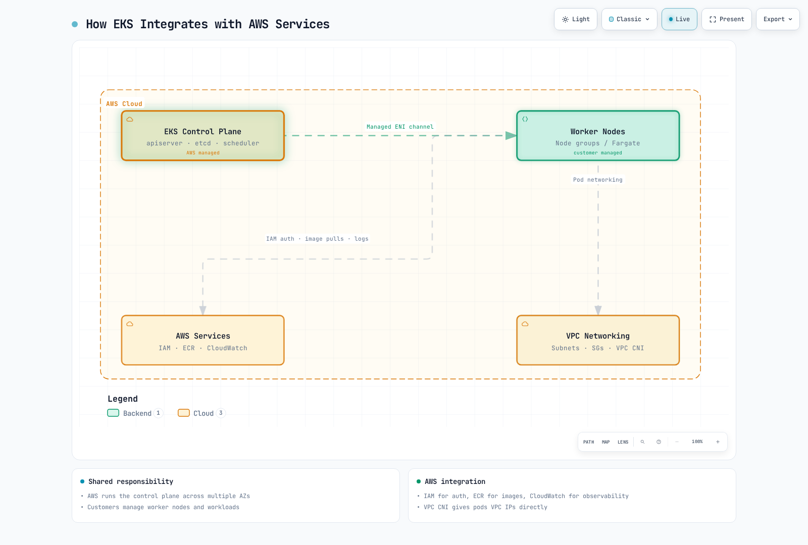

[🔍 View interactive diagram](https://www.atomai.click/kubernetes-docs/archmaps/en-core-01-cluster-architecture-11.html)

### EKS Control Plane

The EKS control plane is managed by AWS and provides high availability across multiple availability zones.

**Key Features**:
1. **Managed Service**: AWS manages control plane maintenance and upgrades
2. **High Availability**: Deployed across multiple availability zones
3. **Auto Scaling**: Automatically scales based on load
4. **Security**: Integrated with AWS security services

### EKS Node Types

EKS supports various types of nodes:

1. **Self-Managed Nodes**: Users directly manage EC2 instances
2. **Managed Node Groups**: AWS manages node lifecycle
3. **Fargate**: Serverless container execution environment
4. **EKS Auto Mode**: AWS manages compute and integrated infrastructure
5. **EKS Hybrid Nodes**: Customer-managed on-premises nodes

Bottlerocket is a node operating system, not a separate compute management type.

**Managed Node Group Example**:
```yaml
apiVersion: eksctl.io/v1alpha5
kind: ClusterConfig
metadata:
  name: my-cluster
  region: ap-northeast-2
managedNodeGroups:
  - name: ng-1
    instanceType: m5.large
    desiredCapacity: 3
    minSize: 2
    maxSize: 5
    volumeSize: 80
    privateNetworking: true
    labels:
      role: worker
    tags:
      nodegroup-role: worker
```

### EKS Networking

EKS networking is based on Amazon VPC and includes the following components:

1. **VPC CNI Plugin**: Integration with AWS VPC networking
2. **Security Groups**: Network security at node and pod level
3. **Load Balancer Integration**: Integration with ELB, ALB, NLB
4. **VPC Endpoints**: Private communication with AWS services

**VPC CNI add-on configuration example** (JSON configuration values, not a ConfigMap):

```json
{
  "enableNetworkPolicy": "true",
  "env": {
    "WARM_IP_TARGET": "5",
    "MINIMUM_IP_TARGET": "10"
  }
}
```

Merge these values with the installed add-on's configuration and validate its schema before updating it. Pod ENI support uses the `ENABLE_POD_ENI` environment variable and additionally requires compatible nodes, IAM permissions, and a SecurityGroupPolicy; a ConfigMap key alone does not enable it. See the [network policy setup](https://docs.aws.amazon.com/eks/latest/userguide/cni-network-policy-configure.html).

### EKS Storage

EKS integrates with various AWS storage services:

1. **EBS CSI Driver**: Amazon EBS volume management
2. **EFS CSI Driver**: Amazon EFS file system management
3. **FSx for Lustre CSI Driver**: FSx for Lustre file system management
4. **S3**: Object storage

**EBS CSI Driver Example**:
```yaml
apiVersion: storage.k8s.io/v1
kind: StorageClass
metadata:
  name: ebs-sc
provisioner: ebs.csi.aws.com
parameters:
  type: gp3
  encrypted: "true"
volumeBindingMode: WaitForFirstConsumer
```

### EKS Security

EKS integrates with AWS security services to provide strong security:

1. **IAM Integration**: Integration of AWS IAM and Kubernetes RBAC
2. **VPC Security**: VPC security groups and network ACLs
3. **AWS KMS**: KMS integration for secret encryption
4. **AWS WAF**: Web application firewall integration
5. **AWS Shield**: DDoS protection

**IAM Role Service Account Example**:
```yaml
apiVersion: v1
kind: ServiceAccount
metadata:
  name: s3-reader
  namespace: default
  annotations:
    eks.amazonaws.com/role-arn: arn:aws:iam::123456789012:role/s3-reader-role
```

### EKS Monitoring and Logging

EKS integrates with AWS monitoring and logging services:

1. **CloudWatch Container Insights**: Container monitoring
2. **CloudWatch Logs**: Log collection and analysis
3. **X-Ray**: Distributed tracing
4. **Prometheus and Grafana**: Open source monitoring tool integration

**CloudWatch Container Insights Example**:
```yaml
apiVersion: v1
kind: Namespace
metadata:
  name: amazon-cloudwatch
---
apiVersion: apps/v1
kind: DaemonSet
metadata:
  name: cloudwatch-agent
  namespace: amazon-cloudwatch
spec:
  selector:
    matchLabels:
      name: cloudwatch-agent
  template:
    metadata:
      labels:
        name: cloudwatch-agent
    spec:
      containers:
      - name: cloudwatch-agent
        image: amazon/cloudwatch-agent:1.247347.6b250880
        # ... additional configuration
```

### EKS Cost Optimization

Methods to optimize EKS cluster costs:

1. **Spot Instances**: Utilize cost-effective Spot instances
2. **Fargate**: Reduce idle resource costs with serverless container execution
3. **Auto Scaling**: Resource optimization through cluster autoscaler
4. **Graviton Processors**: Utilize ARM-based Graviton instances
5. **Resource Request Optimization**: Set appropriate resource requests and limits

**Spot Instance Node Group Example**:
```yaml
apiVersion: eksctl.io/v1alpha5
kind: ClusterConfig
metadata:
  name: my-cluster
  region: ap-northeast-2
managedNodeGroups:
  - name: spot-ng
    instanceTypes: ["m5.large", "m5a.large", "m5d.large", "m5ad.large"]
    spot: true
    desiredCapacity: 3
    minSize: 2
    maxSize: 10
```

## Learn More

To deepen your understanding of the cluster architecture covered in this document, refer to the following topics:

- [Kubernetes Introduction](../basics/04-kubernetes-introduction.md) - Basic concepts and history of Kubernetes
- [Pods and Workloads](./02-pods-and-workloads.md) - Managing workloads running in the cluster
- [Services and Networking](./03-services-networking.md) - Networking configuration within the cluster
- [Scheduling, Preemption, and Eviction](./08-scheduling-preemption-eviction.md) - How pods are placed on nodes
- [Cluster Administration](./09-cluster-administration.md) - Cluster operation and management
- [EKS Introduction](../eks/01-eks-introduction.md) - Amazon EKS service overview
- [EKS Cluster Creation](../eks/02-eks-cluster-creation-part1.md) - How to create EKS clusters

### Hands-on and Advanced Learning

- [Kubernetes Official Tutorials](https://kubernetes.io/docs/tutorials/) - Learning through hands-on practice
- [Kubernetes The Hard Way](https://github.com/kelseyhightower/kubernetes-the-hard-way) - Building a Kubernetes cluster manually
- [Cilium Networking](../networking/cilium/01-introduction.md) - Advanced networking and security features

## Conclusion

In this document, we have examined the architecture of Kubernetes clusters, the main components, and how they work together. We also covered important aspects such as cluster networking, storage, scalability, security, and upgrades, as well as the architecture of Amazon EKS clusters.

Understanding Kubernetes cluster architecture is the foundation for effective cluster design, deployment, and operation. With this knowledge, you can build stable, scalable, and security-enhanced Kubernetes environments.

## Quiz

To test what you learned in this chapter, try the [Cluster Architecture Quiz](../quizzes/core/01-cluster-architecture-quiz.md).

## References

- [Kubernetes Official Documentation](https://kubernetes.io/docs/)
- [Amazon EKS Documentation](https://docs.aws.amazon.com/eks/)
- [Kubernetes The Hard Way](https://github.com/kelseyhightower/kubernetes-the-hard-way)
- [Kubernetes Patterns](https://www.oreilly.com/library/view/kubernetes-patterns/9781492050278/)
- [Kubernetes Up & Running](https://www.oreilly.com/library/view/kubernetes-up-and/9781492046523/)
- [Kubernetes Best Practices](https://www.oreilly.com/library/view/kubernetes-best-practices/9781492056461/)
