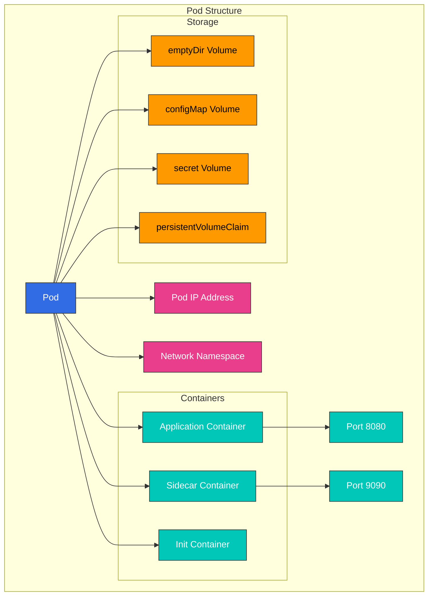

# Kubernetes Pods and Workloads

> **Supported Versions**: Kubernetes 1.32, 1.33, 1.34
> **Last Updated**: November 24, 2025

This document provides a detailed explanation of Pods, the basic execution unit in Kubernetes, and the various workload resources that manage them. Starting from the concept of Pods, we'll cover the characteristics and use cases of various workload resources including Deployments, StatefulSets, DaemonSets, and more.

## Lab Environment Setup

To follow the examples in this document, you'll need the following tools and environment:

### Required Tools
- kubectl v1.34 or higher
- A working Kubernetes cluster (EKS, minikube, kind, etc.)

### Deploy Example Application

```bash
# Create namespace
kubectl create namespace workloads-demo

# Create a simple deployment
kubectl -n workloads-demo apply -f - <<EOF
apiVersion: apps/v1
kind: Deployment
metadata:
  name: nginx-deployment
  labels:
    app: nginx
spec:
  replicas: 3
  selector:
    matchLabels:
      app: nginx
  template:
    metadata:
      labels:
        app: nginx
    spec:
      containers:
      - name: nginx
        image: nginx:1.21
        ports:
        - containerPort: 80
        resources:
          requests:
            memory: "64Mi"
            cpu: "100m"
          limits:
            memory: "128Mi"
            cpu: "200m"
EOF

# Check deployment status
kubectl -n workloads-demo get deployments,pods
```

## Table of Contents
- [Pod Concepts](#pod-concepts)
- [Pod Lifecycle](#pod-lifecycle)
- [Pod Design Patterns](#pod-design-patterns)
- [Workload Resources Overview](#workload-resources-overview)
- [ReplicaSet](#replicaset)
- [Deployment](#deployment)
- [StatefulSet](#statefulset)
- [DaemonSet](#daemonset)
- [Jobs and CronJobs](#jobs-and-cronjobs)
- [Resource Management](#resource-management)
- [Pod Disruption Budget](#pod-disruption-budget)
- [Horizontal Pod Autoscaling](#horizontal-pod-autoscaling)
- [Vertical Pod Autoscaling](#vertical-pod-autoscaling)
- [Workload Best Practices](#workload-best-practices)
- [Amazon EKS Workload Considerations](#amazon-eks-workload-considerations)

## Pod Concepts

> **Key Concept**: A Pod is the smallest deployable computing unit in Kubernetes, consisting of one or more container groups that share storage and network.

A Pod is the smallest deployable computing unit in Kubernetes. A Pod is a group of one or more containers that share storage and network and are scheduled together.

### Pod Characteristics

1. **Shared Context**: All containers within a Pod share the same network namespace, IPC namespace, and UTS namespace.
2. **Same Node**: All containers in a Pod always run on the same node.
3. **Unique IP Address**: Each Pod has a unique IP address within the cluster.
4. **Ephemeral**: Pods are fundamentally ephemeral and can be replaced by new Pods in case of failure.
5. **Atomic Unit**: Pods are the atomic unit of deployment, scheduling, and replication.

### Pod Structure

A Pod consists of the following components:

1. **Containers**: One or more containers running within the Pod
2. **Volumes**: Storage shared by containers within the Pod
3. **Network**: IP address and ports assigned to the Pod
4. **Container Spec**: Container image, environment variables, resource requirements, etc.



### Pod Example

```yaml
apiVersion: v1
kind: Pod
metadata:
  name: multi-container-pod
  labels:
    app: web
spec:
  containers:
  - name: web
    image: nginx:1.21
    ports:
    - containerPort: 80
    volumeMounts:
    - name: shared-data
      mountPath: /usr/share/nginx/html
  - name: content-updater
    image: alpine
    command: ["/bin/sh", "-c"]
    args:
    - while true; do
        echo "Current time: $(date)" > /content/index.html;
        sleep 10;
      done
    volumeMounts:
    - name: shared-data
      mountPath: /content
  volumes:
  - name: shared-data
    emptyDir: {}
```
    Pod --> IP[IP Address: 10.244.0.1]

    %% Style definitions
```

### Practical Example: Web Application Pod

The following is an example of a Pod containing a web application and sidecar container:

```yaml
apiVersion: v1
kind: Pod
metadata:
  name: web-app
  labels:
    app: web
    environment: production
spec:
  containers:
  - name: web-application
    image: nginx:1.21
    ports:
    - containerPort: 80
    resources:
      requests:
        memory: "128Mi"
        cpu: "100m"
      limits:
        memory: "256Mi"
        cpu: "500m"
  - name: log-collector
    image: fluentd:v1.14
    volumeMounts:
    - name: log-volume
      mountPath: /var/log/nginx
    resources:
      requests:
        memory: "64Mi"
        cpu: "50m"
      limits:
        memory: "128Mi"
        cpu: "100m"
  volumes:
  - name: log-volume
    emptyDir: {}
```

This example demonstrates the following real-world scenario:
- Running Nginx web server as the main container
- Running Fluentd log collector as a sidecar container
- Sharing log volume between two containers
- Setting resource requests and limits for each container

This configuration is suitable for running closely connected containers while separating functionality such as logging, monitoring, and proxying in microservice architectures.
    classDef k8sComponent fill:#326CE5,stroke:#333,stroke-width:1px,color:white;
    classDef userApp fill:#00C7B7,stroke:#333,stroke-width:1px,color:white;
    classDef dataStore fill:#3B48CC,stroke:#333,stroke-width:1px,color:white;
    classDef default fill:#f9f9f9,stroke:#333,stroke-width:1px,color:black;

    %% Apply classes
    class Pod default;
    class Container1,Container2 userApp;
    class Volume dataStore;
    class IP default;
```

### Pod Definition

Pods are defined using manifest files in YAML or JSON format. Here's a basic Pod definition example:

```yaml
apiVersion: v1
kind: Pod
metadata:
  name: nginx-pod
  labels:
    app: nginx
spec:
  containers:
  - name: nginx
    image: nginx:1.21
    ports:
    - containerPort: 80
    resources:
      requests:
        memory: "64Mi"
        cpu: "250m"
      limits:
        memory: "128Mi"
        cpu: "500m"
```

### Single Container vs Multi-Container Pods

**Single Container Pods**:
- Most common use case
- Contains only one application container
- Simple and intuitive structure

**Multi-Container Pods**:
- Contains multiple tightly coupled containers
- Local communication between containers possible (localhost)
- Data sharing through shared volumes
- Scaled and placed together

### Multi-Container Pod Patterns

1. **Sidecar Pattern**: Auxiliary container that extends the functionality of the main container
   - Examples: log collector, file synchronization, proxy

```yaml
apiVersion: v1
kind: Pod
metadata:
  name: web-with-sidecar
spec:
  containers:
  - name: web
    image: nginx:1.21
  - name: log-collector
    image: fluentd:v1.14
    volumeMounts:
    - name: logs
      mountPath: /var/log/nginx
  volumes:
  - name: logs
    emptyDir: {}
```

2. **Ambassador Pattern**: Container that acts as a proxy to external services
   - Examples: database proxy, service mesh sidecar

```yaml
apiVersion: v1
kind: Pod
metadata:
  name: app-with-ambassador
spec:
  containers:
  - name: app
    image: myapp:1.0
  - name: ambassador
    image: envoy:v1.20
    ports:
    - containerPort: 9901
```

3. **Adapter Pattern**: Container that standardizes the output of the main container
   - Examples: log format conversion, metrics conversion

```yaml
apiVersion: v1
kind: Pod
metadata:
  name: app-with-adapter
spec:
  containers:
  - name: app
    image: myapp:1.0
  - name: adapter
    image: adapter:1.0
    volumeMounts:
    - name: app-logs
      mountPath: /var/log/app
  volumes:
  - name: app-logs
    emptyDir: {}
```

4. **Init Container Pattern**: Container that runs before the main container starts
   - Examples: configuration file creation, database migration, permission setup

```yaml
apiVersion: v1
kind: Pod
metadata:
  name: app-with-init
spec:
  initContainers:
  - name: init-db
    image: busybox:1.34
    command: ['sh', '-c', 'until nslookup db; do echo waiting for db; sleep 2; done;']
  containers:
  - name: app
    image: myapp:1.0
```

### Pod Networking

Containers within a Pod have the following networking characteristics:

1. **Same IP Address**: All containers within a Pod share the same IP address.
2. **Port Sharing**: Containers within a Pod share the port space, so they cannot use the same port.
3. **Localhost Communication**: Containers within a Pod can communicate with each other via localhost.
4. **Inter-Pod Communication**: Each Pod has a unique IP address and can communicate directly with other Pods.

### Pod Storage

Pods can use various types of volumes to store and share data:

1. **emptyDir**: Temporary volume created when the Pod is created and deleted when the Pod is deleted
2. **hostPath**: Volume mounted from the host node's file system to the Pod
3. **persistentVolumeClaim**: Volume requesting persistent storage
4. **configMap**: ConfigMap mounted as a volume
5. **secret**: Secret mounted as a volume
6. **projected**: Multiple volume sources mapped to the same directory

```yaml
apiVersion: v1
kind: Pod
metadata:
  name: pod-with-volumes
spec:
  containers:
  - name: app
    image: myapp:1.0
    volumeMounts:
    - name: data
      mountPath: /data
    - name: config
      mountPath: /etc/config
  volumes:
  - name: data
    emptyDir: {}
  - name: config
    configMap:
      name: app-config
```

## Pod Lifecycle

Pods go through various lifecycle stages from creation to termination. Understanding this lifecycle is important for ensuring application stability and availability.

### Pod Phases

Pods go through the following phases:

1. **Pending**: The Pod has been accepted by the cluster, but one or more containers have not yet been set up
2. **Running**: The Pod has been bound to a node, all containers have been created, and at least one container is running or starting/restarting
3. **Succeeded**: All containers in the Pod have terminated successfully and will not be restarted
4. **Failed**: All containers in the Pod have terminated, and at least one container has terminated in failure
5. **Unknown**: The state of the Pod could not be obtained for some reason

### Container States

Each container within a Pod can have the following states:

1. **Waiting**: State before the container is running (downloading image, waiting for dependencies, etc.)
2. **Running**: Container is running without issues
3. **Terminated**: Container has completed execution or failed for some reason

### Pod Conditions

Pods indicate their state more specifically through the following conditions:

1. **PodScheduled**: Whether the Pod has been scheduled to a node
2. **ContainersReady**: Whether all containers in the Pod are ready
3. **Initialized**: Whether all init containers have successfully completed
4. **Ready**: Whether the Pod can handle requests and can be added to the load balancing pool of services

### Container Probes

Kubernetes provides the following probes to check container status:

1. **livenessProbe**: Checks if the container is alive; restarts the container on failure
2. **readinessProbe**: Checks if the container is ready to handle requests; excludes from service traffic on failure
3. **startupProbe**: Checks if the application within the container has started; disables other probes until successful

```yaml
apiVersion: v1
kind: Pod
metadata:
  name: pod-with-probes
spec:
  containers:
  - name: app
    image: myapp:1.0
    ports:
    - containerPort: 8080
    livenessProbe:
      httpGet:
        path: /healthz
        port: 8080
      initialDelaySeconds: 30
      periodSeconds: 10
      timeoutSeconds: 5
      failureThreshold: 3
    readinessProbe:
      httpGet:
        path: /ready
        port: 8080
      initialDelaySeconds: 5
      periodSeconds: 5
    startupProbe:
      httpGet:
        path: /startup
        port: 8080
      failureThreshold: 30
      periodSeconds: 10
```

### Pod Termination Process

When a Pod is terminated, the following process occurs:

1. **Deletion Request to API Server**: User or controller requests Pod deletion
2. **Termination Period Starts**: Default termination period (30 seconds) is set
3. **API Update**: API server updates the Pod's deletion timestamp
4. **Removal from Service**: Endpoint controller removes the Pod from service endpoints
5. **SIGTERM Signal**: kubelet sends SIGTERM signal to containers
6. **Graceful Shutdown Wait**: Time is provided for applications to shut down gracefully
7. **SIGKILL Signal**: If containers don't terminate after the termination period, SIGKILL signal is sent
8. **Resource Cleanup**: kubelet cleans up Pod resources

### Init Containers

Init containers are special containers that run before the app containers in a Pod start:

1. **Sequential Execution**: Init containers run one at a time in the order they are defined
2. **Prerequisite**: Each init container starts only after the previous container has successfully completed
3. **Restart on Failure**: If an init container fails, it restarts according to the Pod's restart policy
4. **Purpose**: Setup before app container starts, dependency verification, permission setup, etc.

```yaml
apiVersion: v1
kind: Pod
metadata:
  name: init-pod
spec:
  initContainers:
  - name: init-myservice
    image: busybox:1.34
    command: ['sh', '-c', 'until nslookup myservice; do echo waiting for myservice; sleep 2; done;']
  - name: init-mydb
    image: busybox:1.34
    command: ['sh', '-c', 'until nslookup mydb; do echo waiting for mydb; sleep 2; done;']
  containers:
  - name: app
    image: myapp:1.0
```

### Pod Disruption

Pod disruptions can be divided into voluntary or involuntary disruptions:

1. **Voluntary Disruptions**: Disruptions by cluster administrators or automation tools
   - Node draining
   - Deployment updates
   - Pod deletion

2. **Involuntary Disruptions**: Disruptions due to hardware failures, kernel panics, network partitions, etc.

PodDisruptionBudget can ensure minimum availability during voluntary disruptions.

## Pod Design Patterns

There are several patterns and best practices to consider when designing Pods. Understanding and applying these patterns can improve application stability, scalability, and maintainability.

### Single Responsibility Principle

Pods should follow the Single Responsibility Principle:

1. **One Primary Function**: Each Pod should be responsible for one primary function or process
2. **Independent Scaling**: Design so that each function can scale independently
3. **Separate Lifecycle**: Design so that each function can have its own lifecycle

### Pod Templates

Pod templates are specifications used to create Pods in workload resources (Deployments, StatefulSets, etc.):

```yaml
apiVersion: apps/v1
kind: Deployment
metadata:
  name: nginx-deployment
spec:
  replicas: 3
  selector:
    matchLabels:
      app: nginx
  template:  # Pod template starts
    metadata:
      labels:
        app: nginx
    spec:
      containers:
      - name: nginx
        image: nginx:1.21
        ports:
        - containerPort: 80
  # Pod template ends
```

### Pod Affinity and Anti-Affinity

Pod affinity and anti-affinity are rules that control which nodes Pods are scheduled on:

1. **Pod Affinity**: Schedule on the same node or topology domain as specific Pods
2. **Pod Anti-Affinity**: Schedule on a different node or topology domain than specific Pods

```yaml
apiVersion: v1
kind: Pod
metadata:
  name: web-pod
spec:
  affinity:
    podAffinity:
      requiredDuringSchedulingIgnoredDuringExecution:
      - labelSelector:
          matchExpressions:
          - key: app
            operator: In
            values:
            - cache
        topologyKey: "kubernetes.io/hostname"
    podAntiAffinity:
      preferredDuringSchedulingIgnoredDuringExecution:
      - weight: 100
        podAffinityTerm:
          labelSelector:
            matchExpressions:
            - key: app
              operator: In
              values:
              - web
          topologyKey: "kubernetes.io/hostname"
  containers:
  - name: web
    image: nginx:1.21
```

### Node Affinity

Node affinity is a rule that restricts Pods to be scheduled on specific nodes:

```yaml
apiVersion: v1
kind: Pod
metadata:
  name: gpu-pod
spec:
  affinity:
    nodeAffinity:
      requiredDuringSchedulingIgnoredDuringExecution:
        nodeSelectorTerms:
        - matchExpressions:
          - key: gpu
            operator: In
            values:
            - "true"
  containers:
  - name: gpu-container
    image: gpu-app:1.0
```

### Taints and Tolerations

Taints are applied to nodes to prevent certain Pods from being scheduled, and tolerations are applied to Pods to allow scheduling on nodes with taints:

```yaml
# Apply taint to node
kubectl taint nodes node1 key=value:NoSchedule

# Apply toleration to Pod
apiVersion: v1
kind: Pod
metadata:
  name: tolerant-pod
spec:
  tolerations:
  - key: "key"
    operator: "Equal"
    value: "value"
    effect: "NoSchedule"
  containers:
  - name: app
    image: myapp:1.0
```

### Resource Requests and Limits

Setting resource requests and limits for containers in Pods is important for efficient cluster resource usage and ensuring stability:

```yaml
apiVersion: v1
kind: Pod
metadata:
  name: resource-pod
spec:
  containers:
  - name: app
    image: myapp:1.0
    resources:
      requests:
        memory: "64Mi"
        cpu: "250m"
      limits:
        memory: "128Mi"
        cpu: "500m"
```

### Pod Security Context

Security context defines security settings at the Pod or container level:

```yaml
apiVersion: v1
kind: Pod
metadata:
  name: security-pod
spec:
  securityContext:
    runAsUser: 1000
    runAsGroup: 3000
    fsGroup: 2000
  containers:
  - name: app
    image: myapp:1.0
    securityContext:
      allowPrivilegeEscalation: false
      capabilities:
        drop:
        - ALL
```

### Pod Priority and Preemption

Pod priority and preemption determine which Pods are scheduled and which are preempted when cluster resources are insufficient:

```yaml
# Priority class definition
apiVersion: scheduling.k8s.io/v1
kind: PriorityClass
metadata:
  name: high-priority
value: 1000000
globalDefault: false
description: "This priority class should be used for critical pods only."

# Pod using priority class
apiVersion: v1
kind: Pod
metadata:
  name: high-priority-pod
spec:
  priorityClassName: high-priority
  containers:
  - name: app
    image: myapp:1.0
```

## Workload Resources Overview

Kubernetes provides various workload resources to manage Pods. Each workload resource is designed for specific use cases and requirements.

### Workload Resource Types

The main workload resources in Kubernetes are:

1. **ReplicaSet**: Maintains a specified number of Pod replicas
2. **Deployment**: Manages ReplicaSets to provide declarative updates
3. **StatefulSet**: Resource for applications requiring state persistence
4. **DaemonSet**: Runs a copy of a Pod on all nodes
5. **Job**: One-time tasks that terminate after completion
6. **CronJob**: Runs Jobs periodically on a schedule

### Workload Resource Selection Criteria

Criteria for selecting the appropriate workload resource:

1. **State Persistence**: Whether the application needs to maintain state
2. **Execution Pattern**: Whether it runs continuously, one-time, or periodically
3. **Deployment Requirements**: Requirements for rolling updates, blue/green deployments, etc.
4. **Node Coverage**: Whether it needs to run on all nodes
5. **Scalability Requirements**: Whether horizontal scaling is needed

## ReplicaSet

A ReplicaSet ensures that a specified number of Pod replicas are always running. If Pods fail or are deleted, the ReplicaSet automatically creates replacement Pods.

### Main Features of ReplicaSet

1. **Maintain Pod Replicas**: Maintains the specified number of Pod replicas
2. **Pod Selection**: Identifies Pods to manage through label selectors
3. **Pod Creation**: Creates new Pods when necessary
4. **Pod Deletion**: Deletes excess Pods

### ReplicaSet Definition

```yaml
apiVersion: apps/v1
kind: ReplicaSet
metadata:
  name: frontend
  labels:
    app: guestbook
    tier: frontend
spec:
  replicas: 3
  selector:
    matchLabels:
      tier: frontend
  template:
    metadata:
      labels:
        tier: frontend
    spec:
      containers:
      - name: php-redis
        image: gcr.io/google_samples/gb-frontend:v3
        resources:
          requests:
            cpu: 100m
            memory: 100Mi
        ports:
        - containerPort: 80
```

### ReplicaSet Operation

1. **Label Selector Matching**: ReplicaSet identifies Pods matching the label selector
2. **Check Current State**: Verifies the number of currently running Pods
3. **Compare with Desired State**: Compares current Pod count with desired replica count
4. **Adjustment Actions**: Creates or deletes Pods as needed

### ReplicaSet vs Replication Controller

ReplicaSet is the successor to Replication Controller and provides more powerful label selectors:

1. **Replication Controller**: Supports only equality-based selectors (e.g., app=nginx)
2. **ReplicaSet**: Supports set-based selectors (e.g., app in (nginx, apache))

### ReplicaSet Use Cases

ReplicaSets are generally used indirectly through Deployments rather than directly. However, they can be used directly in the following cases:

1. **Simple Replication**: When simply maintaining Pod replicas
2. **Custom Updates**: When custom update mechanisms are needed
3. **Legacy Support**: Supporting legacy applications

## Deployment

A Deployment manages ReplicaSets to provide declarative updates for Pods. Deployments manage rolling updates, rollbacks, scaling, and more for applications.

### Main Features of Deployment

1. **Declarative Updates**: Declare the desired state and Deployment changes current state to desired state
2. **Rolling Updates**: Update applications without downtime
3. **Rollback**: Easy rollback to previous versions
4. **Scaling**: Adjust the number of application replicas
5. **Deployment History**: Maintain records of previous deployment versions

### Deployment Definition

```yaml
apiVersion: apps/v1
kind: Deployment
metadata:
  name: nginx-deployment
  labels:
    app: nginx
spec:
  replicas: 3
  selector:
    matchLabels:
      app: nginx
  strategy:
    type: RollingUpdate
    rollingUpdate:
      maxSurge: 1
      maxUnavailable: 0
  template:
    metadata:
      labels:
        app: nginx
    spec:
      containers:
      - name: nginx
        image: nginx:1.21
        ports:
        - containerPort: 80
        resources:
          requests:
            cpu: 100m
            memory: 100Mi
          limits:
            cpu: 200m
            memory: 200Mi
        livenessProbe:
          httpGet:
            path: /
            port: 80
          initialDelaySeconds: 30
          periodSeconds: 10
        readinessProbe:
          httpGet:
            path: /
            port: 80
          initialDelaySeconds: 5
          periodSeconds: 5
```

### Deployment Update Strategies

Deployments provide two update strategies:

1. **RollingUpdate**: Gradually updates Pods for deployment without downtime (default)
   - **maxSurge**: Maximum number of Pods that can be created above the desired Pod count
   - **maxUnavailable**: Maximum number of Pods unavailable during update

2. **Recreate**: Deletes all existing Pods before creating new Pods (causes temporary downtime)

### Deployment Rollback

Deployments support rollback to previous versions:

```bash
# Check deployment history
kubectl rollout history deployment/nginx-deployment

# Check details of specific version
kubectl rollout history deployment/nginx-deployment --revision=2

# Rollback to previous version
kubectl rollout undo deployment/nginx-deployment

# Rollback to specific version
kubectl rollout undo deployment/nginx-deployment --to-revision=2
```

### Deployment Scaling

Deployments can be easily scaled:

```bash
# Imperative scaling
kubectl scale deployment/nginx-deployment --replicas=5

# Declarative scaling (after modifying YAML file)
kubectl apply -f deployment.yaml
```

### Deployment Pause and Resume

Deployment rollouts can be paused and resumed:

```bash
# Pause rollout
kubectl rollout pause deployment/nginx-deployment

# Apply multiple changes
kubectl set image deployment/nginx-deployment nginx=nginx:1.22
kubectl set resources deployment/nginx-deployment -c=nginx --limits=cpu=200m,memory=256Mi

# Resume rollout
kubectl rollout resume deployment/nginx-deployment
```

### Deployment Status

Deployments can have the following statuses:

1. **Progressing**: New ReplicaSet is being created or scaling up/down
2. **Complete**: All replicas have been updated and are available
3. **Failed**: Error occurred during deployment (e.g., image pull failure, insufficient resources)

## StatefulSet

StatefulSet is a workload resource for applications that require state persistence. It assigns unique identifiers to each Pod and provides stable network identifiers and persistent storage.

### Main Features of StatefulSet

1. **Stable and Unique Network Identifiers**: Pod names and hostnames are maintained even after restarts
2. **Stable and Persistent Storage**: Access to the same storage even when Pods are rescheduled
3. **Sequential Deployment and Scaling**: Pods are created, updated, and deleted in order
4. **Sequential Automatic Rolling Updates**: Pods are updated in order

### StatefulSet Definition

```yaml
apiVersion: apps/v1
kind: StatefulSet
metadata:
  name: web
spec:
  selector:
    matchLabels:
      app: nginx
  serviceName: "nginx"
  replicas: 3
  updateStrategy:
    type: RollingUpdate
  podManagementPolicy: OrderedReady
  template:
    metadata:
      labels:
        app: nginx
    spec:
      containers:
      - name: nginx
        image: nginx:1.21
        ports:
        - containerPort: 80
          name: web
        volumeMounts:
        - name: www
          mountPath: /usr/share/nginx/html
  volumeClaimTemplates:
  - metadata:
      name: www
    spec:
      accessModes: [ "ReadWriteOnce" ]
      storageClassName: "standard"
      resources:
        requests:
          storage: 1Gi
```

### StatefulSet Pod Identifiers

StatefulSet assigns unique identifiers to Pods in the following format:
```
<StatefulSet name>-<ordinal index>
```

For example, a `web` StatefulSet creates Pods like `web-0`, `web-1`, `web-2`.

### StatefulSet Headless Service

StatefulSets are typically used with a headless service (clusterIP: None). This creates DNS records for each Pod:

```yaml
apiVersion: v1
kind: Service
metadata:
  name: nginx
  labels:
    app: nginx
spec:
  ports:
  - port: 80
    name: web
  clusterIP: None
  selector:
    app: nginx
```

With this, each Pod has a DNS name in the following format:
```
<Pod name>.<service name>.<namespace>.svc.cluster.local
```

Example: `web-0.nginx.default.svc.cluster.local`

### StatefulSet Storage

StatefulSets use `volumeClaimTemplates` to automatically create Persistent Volume Claims (PVCs) for each Pod. These PVCs are maintained even when Pods are rescheduled.

### StatefulSet Update Strategies

StatefulSets provide two update strategies:

1. **RollingUpdate**: Updates Pods in order (default)
2. **OnDelete**: Updates only when Pods are deleted

### Pod Management Policy

StatefulSets provide two Pod management policies:

1. **OrderedReady**: Creates and terminates Pods in order (default)
2. **Parallel**: Creates and terminates Pods in parallel

### StatefulSet Use Cases

StatefulSets are suitable for the following applications:

1. **Databases**: MySQL, PostgreSQL, MongoDB, etc.
2. **Distributed Systems**: Kafka, ZooKeeper, Elasticsearch, etc.
3. **Message Queues**: RabbitMQ, etc.
4. **Other Stateful Applications**: File servers, session stores, etc.

### StatefulSet Example: MySQL Replication

```yaml
apiVersion: v1
kind: Service
metadata:
  name: mysql
  labels:
    app: mysql
spec:
  ports:
  - port: 3306
    name: mysql
  clusterIP: None
  selector:
    app: mysql
---
apiVersion: apps/v1
kind: StatefulSet
metadata:
  name: mysql
spec:
  selector:
    matchLabels:
      app: mysql
  serviceName: mysql
  replicas: 3
  template:
    metadata:
      labels:
        app: mysql
    spec:
      initContainers:
      - name: init-mysql
        image: mysql:5.7
        command:
        - bash
        - "-c"
        - |
          set -ex
          # Generate server ID based on Pod index
          [[ `hostname` =~ -([0-9]+)$ ]] || exit 1
          ordinal=${BASH_REMATCH[1]}
          echo [mysqld] > /mnt/conf.d/server-id.cnf
          echo server-id=$((100 + $ordinal)) >> /mnt/conf.d/server-id.cnf
          # Master or slave configuration
          if [[ $ordinal -eq 0 ]]; then
            echo [mysqld] > /mnt/conf.d/master.cnf
            echo log-bin=mysql-bin >> /mnt/conf.d/master.cnf
          else
            echo [mysqld] > /mnt/conf.d/slave.cnf
            echo super-read-only >> /mnt/conf.d/slave.cnf
          fi
        volumeMounts:
        - name: conf
          mountPath: /mnt/conf.d
      - name: clone-mysql
        image: gcr.io/google-samples/xtrabackup:1.0
        command:
        - bash
        - "-c"
        - |
          set -ex
          # Only perform replication if not the first Pod
          [[ `hostname` =~ -([0-9]+)$ ]] || exit 1
          ordinal=${BASH_REMATCH[1]}
          if [[ $ordinal -eq 0 ]]; then
            exit 0
          fi
          # Replicate data from previous Pod
          ncat --recv-only mysql-$(($ordinal-1)).mysql 3307 | xbstream -x -C /var/lib/mysql
          # Prepare backup
          xtrabackup --prepare --target-dir=/var/lib/mysql
        volumeMounts:
        - name: data
          mountPath: /var/lib/mysql
          subPath: mysql
        - name: conf
          mountPath: /etc/mysql/conf.d
      containers:
      - name: mysql
        image: mysql:5.7
        env:
        - name: MYSQL_ROOT_PASSWORD
          valueFrom:
            secretKeyRef:
              name: mysql-secret
              key: password
        ports:
        - name: mysql
          containerPort: 3306
        volumeMounts:
        - name: data
          mountPath: /var/lib/mysql
          subPath: mysql
        - name: conf
          mountPath: /etc/mysql/conf.d
        resources:
          requests:
            cpu: 500m
            memory: 1Gi
        livenessProbe:
          exec:
            command: ["mysqladmin", "ping"]
          initialDelaySeconds: 30
          periodSeconds: 10
          timeoutSeconds: 5
        readinessProbe:
          exec:
            command: ["mysql", "-h", "127.0.0.1", "-e", "SELECT 1"]
          initialDelaySeconds: 5
          periodSeconds: 2
          timeoutSeconds: 1
      - name: xtrabackup
        image: gcr.io/google-samples/xtrabackup:1.0
        ports:
        - name: xtrabackup
          containerPort: 3307
        command:
        - bash
        - "-c"
        - |
          set -ex
          cd /var/lib/mysql
          # Start slave
          if [[ -f xtrabackup_slave_info ]]; then
            cat xtrabackup_slave_info | sed -E 's/;$//g' > change_master_to.sql
            mysql -h 127.0.0.1 -e "$(cat change_master_to.sql); RESET SLAVE; START SLAVE;"
          # If replicated from master
          elif [[ -f xtrabackup_binlog_info ]]; then
            [[ `hostname` =~ -([0-9]+)$ ]] || exit 1
            ordinal=${BASH_REMATCH[1]}
            [[ $ordinal -eq 0 ]] && exit 0
            master_host=mysql-0.mysql
            master_log_file=$(cat xtrabackup_binlog_info | awk '{print $1}')
            master_log_pos=$(cat xtrabackup_binlog_info | awk '{print $2}')
            mysql -h 127.0.0.1 -e "CHANGE MASTER TO MASTER_HOST='$master_host', MASTER_USER='root', MASTER_PASSWORD='$MYSQL_ROOT_PASSWORD', MASTER_LOG_FILE='$master_log_file', MASTER_LOG_POS=$master_log_pos; RESET SLAVE; START SLAVE;"
          fi
          # Start backup server
          exec ncat --listen --keep-open --send-only --max-conns=1 3307 -c "xtrabackup --backup --slave-info --stream=xbstream --host=127.0.0.1"
        volumeMounts:
        - name: data
          mountPath: /var/lib/mysql
          subPath: mysql
        - name: conf
          mountPath: /etc/mysql/conf.d
        resources:
          requests:
            cpu: 100m
            memory: 100Mi
      volumes:
      - name: conf
        emptyDir: {}
  volumeClaimTemplates:
  - metadata:
      name: data
    spec:
      accessModes: ["ReadWriteOnce"]
      storageClassName: standard
      resources:
        requests:
          storage: 10Gi
```

## DaemonSet

A DaemonSet ensures that a copy of a Pod runs on all nodes (or specific nodes). When a node is added to the cluster, Pods are automatically added, and when a node is removed, Pods are also removed.

### Main Features of DaemonSet

1. **Run on All Nodes**: Run Pods on all nodes in the cluster
2. **Node Selection**: Can run only on specific nodes through node selectors
3. **Automatic Deployment**: Automatically deploy Pods when new nodes are added
4. **Automatic Cleanup**: Automatically clean up Pods when nodes are removed

### DaemonSet Definition

```yaml
apiVersion: apps/v1
kind: DaemonSet
metadata:
  name: fluentd-elasticsearch
  namespace: kube-system
  labels:
    k8s-app: fluentd-logging
spec:
  selector:
    matchLabels:
      name: fluentd-elasticsearch
  updateStrategy:
    type: RollingUpdate
    rollingUpdate:
      maxUnavailable: 1
  template:
    metadata:
      labels:
        name: fluentd-elasticsearch
    spec:
      tolerations:
      - key: node-role.kubernetes.io/master
        effect: NoSchedule
      containers:
      - name: fluentd-elasticsearch
        image: quay.io/fluentd_elasticsearch/fluentd:v2.5.2
        resources:
          limits:
            memory: 200Mi
          requests:
            cpu: 100m
            memory: 200Mi
        volumeMounts:
        - name: varlog
          mountPath: /var/log
        - name: varlibdockercontainers
          mountPath: /var/lib/docker/containers
          readOnly: true
      terminationGracePeriodSeconds: 30
      volumes:
      - name: varlog
        hostPath:
          path: /var/log
      - name: varlibdockercontainers
        hostPath:
          path: /var/lib/docker/containers
```

### DaemonSet Update Strategies

DaemonSets provide two update strategies:

1. **RollingUpdate**: Updates Pods sequentially (default)
   - **maxUnavailable**: Maximum number of Pods unavailable during update

2. **OnDelete**: Updates only when Pods are deleted

### DaemonSet Node Selection

DaemonSets can be configured to run only on specific nodes:

```yaml
spec:
  template:
    spec:
      nodeSelector:
        disk: ssd
```

### DaemonSet Taint Tolerations

DaemonSets can set tolerations to run on nodes with taints:

```yaml
spec:
  template:
    spec:
      tolerations:
      - key: node-role.kubernetes.io/master
        effect: NoSchedule
```

### DaemonSet Use Cases

DaemonSets are used for the following purposes:

1. **Log Collectors**: Fluentd, Logstash, etc.
2. **Monitoring Agents**: Prometheus Node Exporter, Datadog Agent, etc.
3. **Network Plugins**: Calico, Cilium, Weave Net, etc.
4. **Storage Daemons**: Ceph, GlusterFS, etc.
5. **Security Agents**: Falco, Sysdig, etc.

### DaemonSet Example: Prometheus Node Exporter

```yaml
apiVersion: apps/v1
kind: DaemonSet
metadata:
  name: node-exporter
  namespace: monitoring
  labels:
    app: node-exporter
spec:
  selector:
    matchLabels:
      app: node-exporter
  template:
    metadata:
      labels:
        app: node-exporter
    spec:
      hostNetwork: true
      hostPID: true
      containers:
      - name: node-exporter
        image: prom/node-exporter:v1.3.1
        args:
        - --path.procfs=/host/proc
        - --path.sysfs=/host/sys
        - --path.rootfs=/host/root
        - --web.listen-address=:9100
        ports:
        - containerPort: 9100
          protocol: TCP
          name: http
        resources:
          limits:
            cpu: 250m
            memory: 180Mi
          requests:
            cpu: 102m
            memory: 180Mi
        volumeMounts:
        - name: proc
          mountPath: /host/proc
          readOnly: true
        - name: sys
          mountPath: /host/sys
          readOnly: true
        - name: root
          mountPath: /host/root
          readOnly: true
      tolerations:
      - operator: "Exists"
      volumes:
      - name: proc
        hostPath:
          path: /proc
      - name: sys
        hostPath:
          path: /sys
      - name: root
        hostPath:
          path: /
```

## Jobs and CronJobs

Jobs and CronJobs are workload resources for running one-time or periodic tasks.

### Job

A Job creates one or more Pods and continues execution until a specified number of Pods successfully terminate.

#### Main Features of Job

1. **Completion Guarantee**: Runs until specified number of Pods complete successfully
2. **Parallel Execution**: Can run multiple Pods in parallel
3. **Retry**: Automatic retry of failed Pods
4. **Cleanup After Completion**: Optional cleanup of Pods after job completion

#### Job Definition

```yaml
apiVersion: batch/v1
kind: Job
metadata:
  name: pi
spec:
  completions: 5      # Number of Pods that must successfully complete
  parallelism: 2      # Number of Pods to run in parallel
  backoffLimit: 4     # Number of retries on failure
  activeDeadlineSeconds: 100  # Job time limit (seconds)
  ttlSecondsAfterFinished: 100  # Deletion time after completion (seconds)
  template:
    spec:
      containers:
      - name: pi
        image: perl:5.34
        command: ["perl", "-Mbignum=bpi", "-wle", "print bpi(2000)"]
        resources:
          requests:
            cpu: 100m
            memory: 50Mi
          limits:
            cpu: 100m
            memory: 100Mi
      restartPolicy: Never  # or OnFailure
```

#### Job Completion Modes

Jobs provide two completion modes:

1. **NonIndexed**: Standard job mode where the job completes when the specified number of Pods successfully complete
2. **Indexed**: Each Pod is assigned an index starting from 0, performing tasks for specific index ranges

```yaml
apiVersion: batch/v1
kind: Job
metadata:
  name: indexed-job
spec:
  completions: 5
  parallelism: 3
  completionMode: Indexed  # Enable Indexed mode
  template:
    spec:
      containers:
      - name: worker
        image: busybox:1.34
        command: ["sh", "-c", "echo Processing item ${JOB_COMPLETION_INDEX}"]
      restartPolicy: Never
```

#### Job Use Cases

Jobs are used for the following purposes:

1. **Batch Processing**: Data processing, ETL tasks
2. **Computation Tasks**: Scientific calculations, rendering
3. **Database Migrations**: Schema updates
4. **One-time Administrative Tasks**: Backups, cleanup tasks

### CronJob

CronJobs run Jobs periodically according to a specified schedule. They work similarly to Linux cron jobs.

#### Main Features of CronJob

1. **Scheduled Execution**: Specify execution schedule using cron expressions
2. **Job Management**: Create Jobs according to schedule
3. **Concurrency Policy**: Define behavior when previous job is still running
4. **History Limit**: Limit history of completed jobs

#### CronJob Definition

```yaml
apiVersion: batch/v1
kind: CronJob
metadata:
  name: hello
spec:
  schedule: "*/1 * * * *"  # Run every minute
  timeZone: "America/New_York"  # Timezone (Kubernetes 1.24+)
  concurrencyPolicy: Forbid  # Allow, Forbid, Replace
  successfulJobsHistoryLimit: 3
  failedJobsHistoryLimit: 1
  startingDeadlineSeconds: 60
  jobTemplate:
    spec:
      template:
        spec:
          containers:
          - name: hello
            image: busybox:1.34
            command:
            - /bin/sh
            - -c
            - date; echo Hello from the Kubernetes cluster
          restartPolicy: OnFailure
```

#### Cron Expression

Cron expressions have the following format:
```
+------------------- minute (0 - 59)
| +----------------- hour (0 - 23)
| | +--------------- day of month (1 - 31)
| | | +------------- month (1 - 12)
| | | | +----------- day of week (0 - 6) (Sunday to Saturday; 7 is also Sunday)
| | | | |
| | | | |
* * * * *
```

Common cron expression examples:
- `*/5 * * * *`: Every 5 minutes
- `0 * * * *`: Every hour at the top of the hour
- `0 0 * * *`: Every day at midnight
- `0 0 * * 0`: Every Sunday at midnight
- `0 0 1 * *`: 1st of every month at midnight
- `0 0 1 1 *`: January 1st at midnight every year

#### Concurrency Policy

CronJobs provide three concurrency policies:

1. **Allow**: Multiple Jobs can run simultaneously (default)
2. **Forbid**: Skip new Job if previous Job is still running
3. **Replace**: Replace previous Job with new Job if still running

#### CronJob Use Cases

CronJobs are used for the following purposes:

1. **Regular Backups**: Database backups, snapshot creation
2. **Data Synchronization**: Periodic data synchronization
3. **Report Generation**: Daily/weekly/monthly report generation
4. **Cleanup Tasks**: Temporary file cleanup, log rotation
5. **Notifications and Monitoring**: Status checks, alert sending

#### CronJob Example: Database Backup

```yaml
apiVersion: batch/v1
kind: CronJob
metadata:
  name: database-backup
spec:
  schedule: "0 2 * * *"  # Run daily at 02:00
  concurrencyPolicy: Forbid
  successfulJobsHistoryLimit: 3
  failedJobsHistoryLimit: 1
  jobTemplate:
    spec:
      template:
        spec:
          containers:
          - name: backup
            image: postgres:14
            env:
            - name: PGHOST
              value: postgres-service
            - name: PGUSER
              valueFrom:
                secretKeyRef:
                  name: postgres-secret
                  key: username
            - name: PGPASSWORD
              valueFrom:
                secretKeyRef:
                  name: postgres-secret
                  key: password
            command:
            - /bin/sh
            - -c
            - |
              pg_dump -Fc > /backup/db-$(date +%Y%m%d-%H%M%S).dump
              find /backup -type f -mtime +7 -delete  # Delete backups older than 7 days
            volumeMounts:
            - name: backup-volume
              mountPath: /backup
          restartPolicy: OnFailure
          volumes:
          - name: backup-volume
            persistentVolumeClaim:
              claimName: backup-pvc
```

## Conclusion

This document covered Pods, the basic building block of Kubernetes, and various workload resources. Starting from the concept of Pods, we explored the characteristics and use cases of various workload resources including Deployments, StatefulSets, DaemonSets, Jobs, and CronJobs. Each of these resources has unique purposes and features, and using them appropriately enables efficient application deployment and management.

## Quiz

To test what you learned in this chapter, try the [Pods and Workloads Quiz](../quizzes/core/02-pods-and-workloads-quiz.md).
