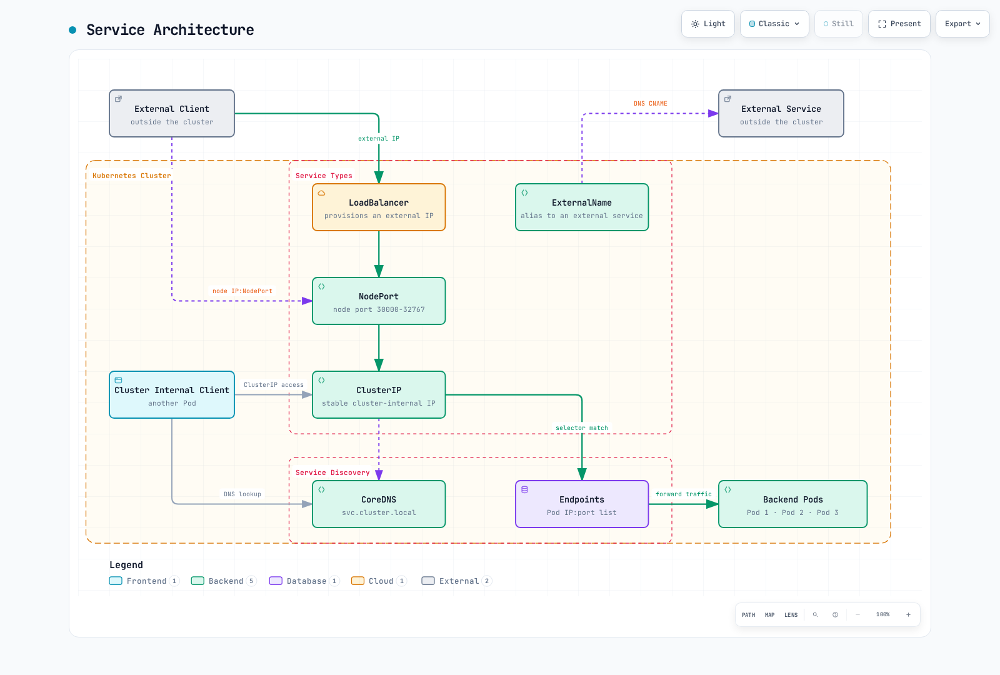
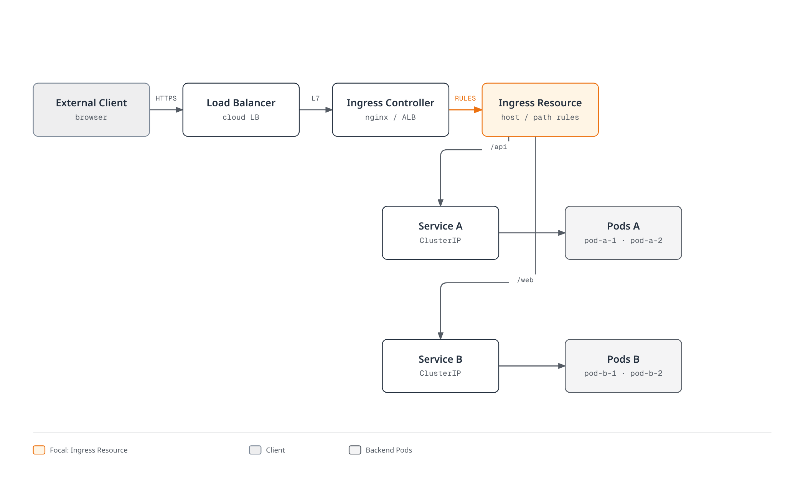
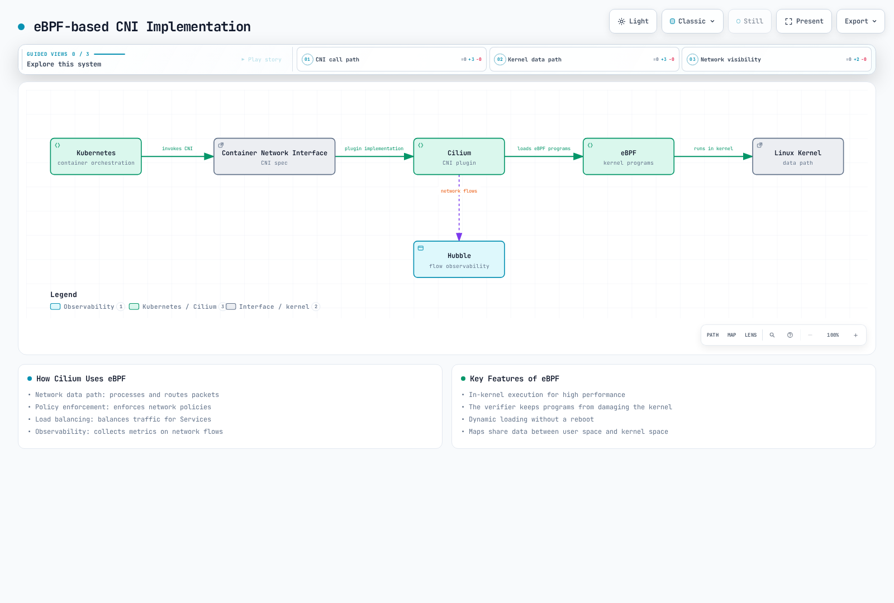

# Services and Networking

> **Supported Versions**: Kubernetes 1.35, 1.36, 1.37
> **Last Updated**: February 23, 2026

In Kubernetes, a Service is an abstraction layer that provides a single access point for a set of Pods. In this chapter, we'll explore Kubernetes networking concepts in detail, including various service types, Ingress, network policies, and more.

## Lab Environment Setup

To follow the examples in this document, you'll need the following tools and environment:

### Required Tools
- kubectl within one minor version of the API server
- A working Kubernetes cluster (EKS, minikube, kind, etc.)

### Deploy Example Application

```bash
# Create namespace
kubectl create namespace networking-demo

# Deploy a simple application
kubectl -n networking-demo apply -f - <<EOF
apiVersion: apps/v1
kind: Deployment
metadata:
  name: web-app
  labels:
    app: web
spec:
  replicas: 3
  selector:
    matchLabels:
      app: web
  template:
    metadata:
      labels:
        app: web
    spec:
      containers:
      - name: nginx
        image: nginx:1.30.4
        ports:
        - containerPort: 80
---
apiVersion: v1
kind: Service
metadata:
  name: web-service
spec:
  selector:
    app: web
  ports:
  - port: 80
    targetPort: 80
  type: ClusterIP
EOF

# Verify services
kubectl -n networking-demo get svc,pods
```

## Table of Contents

1. [Service Types](#service-types)
2. [Ingress](#ingress)
3. [Endpoints](#endpoints)
4. [Service Discovery](#service-discovery)
5. [CoreDNS](#coredns)
6. [Network Policies](#network-policies)
7. [Service Mesh](#service-mesh)
8. [CNI (Container Network Interface)](#cnicontainer-network-interface)
9. [Cilium](#cilium)
   - [Introduction to Cilium](#introduction-to-cilium)
   - [eBPF Technology](#ebpf-technology)
   - [Cilium Networking Model](#cilium-networking-model)
   - [Cilium Network Policies](#cilium-network-policies)
   - [Network Visibility with Hubble](#network-visibility-with-hubble)
   - [Configuring Cilium on Amazon EKS](#configuring-cilium-on-amazon-eks)

## Service Types

> **Key Concept**: Kubernetes Services provide stable network endpoints for a set of Pods and control internal and external access through various types.

Kubernetes provides various types of services to support multiple ways of exposing applications.

### Service Architecture



[🔍 View interactive diagram](https://www.atomai.click/kubernetes-docs/archmaps/en-core-03-services-networking-0.html)

### Service Type Comparison

| Service Type | Access Scope | External IP | Use Case | Features |
|-------------|-------------|-------------|----------|----------|
| **ClusterIP** | Cluster Internal | No | Internal microservice communication | Default service type, accessible only within cluster |
| **NodePort** | Cluster External | No | Development and test environments | Access through specific port (30000-32767) on all nodes |
| **LoadBalancer** | Cluster External | Yes | Production external services | Provisions cloud provider load balancer |
| **ExternalName** | Cluster Internal | No | Internal alias for external services | Redirection via DNS CNAME record |
| **Headless** | Cluster Internal | No | When direct Pod IP access is needed | Special service without ClusterIP |

### ClusterIP

ClusterIP is the most basic service type, providing a fixed IP address accessible only within the cluster.

```yaml
apiVersion: v1
kind: Service
metadata:
  name: my-service
spec:
  selector:
    app: MyApp
  ports:
  - protocol: TCP
    port: 80
    targetPort: 9376
  type: ClusterIP  # Default, can be omitted
```

### NodePort

NodePort services allow access to the service through a specific port on all nodes.

```yaml
apiVersion: v1
kind: Service
metadata:
  name: my-service
spec:
  selector:
    app: MyApp
  ports:
  - protocol: TCP
    port: 80        # Port used within cluster
    targetPort: 9376 # Pod's port
    nodePort: 30007  # Port exposed on nodes (30000-32767)
  type: NodePort
```

### LoadBalancer

LoadBalancer services provision a load balancer from the cloud provider to expose the service externally.

```yaml
apiVersion: v1
kind: Service
metadata:
  name: my-service
  annotations:
    service.beta.kubernetes.io/aws-load-balancer-type: external
    service.beta.kubernetes.io/aws-load-balancer-nlb-target-type: ip
    service.beta.kubernetes.io/aws-load-balancer-scheme: internet-facing
spec:
  selector:
    app: MyApp
  ports:
  - port: 80
    targetPort: 9376
  type: LoadBalancer
```

This example requires the AWS Load Balancer Controller, its IAM permissions, suitable subnets, and routable Pod IPs. It provisions an internet-facing NLB. Internal load balancers are also possible; AWS may return a DNS hostname rather than an IP. EKS Auto Mode uses a separate controller/class and configuration.

### ExternalName

ExternalName services provide an alias for external services.

```yaml
apiVersion: v1
kind: Service
metadata:
  name: my-service
spec:
  type: ExternalName
  externalName: my.database.example.com
```

This service maps the DNS name `my-service` to `my.database.example.com`.

### Headless Service

A headless service is a service without a cluster IP that creates DNS records for each Pod.

```yaml
apiVersion: v1
kind: Service
metadata:
  name: my-service
spec:
  clusterIP: None  # Headless service
  selector:
    app: MyApp
  ports:
  - port: 80
    targetPort: 9376
```

This service does not allocate a cluster IP and creates DNS records for each Pod.

### External IP

`externalIPs` exposes this Service at administrator-managed IPs already routed to the nodes; it does not allocate addresses or select an external backend. It is deprecated since v1.36. Prefer a supported load balancer or Gateway implementation for new configurations. The documentation-only address below must be replaced with an address you control.

```yaml
apiVersion: v1
kind: Service
metadata:
  name: my-service
spec:
  selector:
    app: MyApp
  ports:
  - port: 80
    targetPort: 9376
  externalIPs:
  - 198.51.100.32
```

## Ingress

Ingress is an API object that exposes HTTP and HTTPS routes from outside the cluster to services within the cluster. Ingress provides load balancing, SSL termination, and name-based virtual hosting.



[🔍 View interactive diagram](https://www.atomai.click/kubernetes-docs/archmaps/en-core-03-services-networking-1.html)

### Ingress Controller

To use Ingress resources, an Ingress controller must be running in the cluster. There are various Ingress controllers:

- AWS Load Balancer Controller
- GCE Ingress Controller
- Traefik
- HAProxy
- Istio Ingress

Community ingress-nginx retired in March 2026 ([notice](https://kubernetes.io/blog/2025/11/11/ingress-nginx-retirement/)). The generic examples below assume an installed Traefik controller and `traefik` IngressClass. Ingress is a configuration API, not a packet-processing hop; the controller configures the actual proxy/load balancer.

### Basic Ingress

```yaml
apiVersion: networking.k8s.io/v1
kind: Ingress
metadata:
  name: minimal-ingress
spec:
  ingressClassName: traefik  # Ingress controller class to use
  rules:
  - host: example.com
    http:
      paths:
      - path: /
        pathType: Prefix
        backend:
          service:
            name: example-service
            port:
              number: 80
```

This Ingress routes all requests to the `example.com` host to `example-service:80`.

### Path-Based Routing

```yaml
apiVersion: networking.k8s.io/v1
kind: Ingress
metadata:
  name: path-based-ingress
spec:
  ingressClassName: traefik
  rules:
  - host: example.com
    http:
      paths:
      - path: /api
        pathType: Prefix
        backend:
          service:
            name: api-service
            port:
              number: 80
      - path: /web
        pathType: Prefix
        backend:
          service:
            name: web-service
            port:
              number: 80
```

This Ingress routes requests starting with `example.com/api` to `api-service` and requests starting with `example.com/web` to `web-service`.

### Name-Based Virtual Hosting

```yaml
apiVersion: networking.k8s.io/v1
kind: Ingress
metadata:
  name: name-based-ingress
spec:
  ingressClassName: traefik
  rules:
  - host: foo.example.com
    http:
      paths:
      - path: /
        pathType: Prefix
        backend:
          service:
            name: foo-service
            port:
              number: 80
  - host: bar.example.com
    http:
      paths:
      - path: /
        pathType: Prefix
        backend:
          service:
            name: bar-service
            port:
              number: 80
```

This Ingress routes requests to `foo.example.com` to `foo-service` and requests to `bar.example.com` to `bar-service`.

### TLS Configuration

```yaml
apiVersion: networking.k8s.io/v1
kind: Ingress
metadata:
  name: tls-ingress
spec:
  ingressClassName: traefik
  tls:
  - hosts:
    - example.com
    secretName: example-tls
  rules:
  - host: example.com
    http:
      paths:
      - path: /
        pathType: Prefix
        backend:
          service:
            name: example-service
            port:
              number: 80
```

This Ingress terminates HTTPS connections to `example.com` using the TLS certificate stored in the `example-tls` secret.

TLS secret creation:

```bash
kubectl create secret tls example-tls --cert=path/to/cert.crt --key=path/to/key.key
```

### AWS Load Balancer Controller

On AWS EKS, you can use the AWS Load Balancer Controller to provision Application Load Balancers.

```yaml
apiVersion: networking.k8s.io/v1
kind: Ingress
metadata:
  name: alb-ingress
  annotations:
    alb.ingress.kubernetes.io/scheme: internet-facing
    alb.ingress.kubernetes.io/target-type: ip
    alb.ingress.kubernetes.io/listen-ports: '[{"HTTP": 80}, {"HTTPS": 443}]'
    alb.ingress.kubernetes.io/ssl-redirect: "443"
    alb.ingress.kubernetes.io/certificate-arn: arn:aws:acm:region:account-id:certificate/certificate-id
spec:
  ingressClassName: alb
  rules:
  - host: example.com
    http:
      paths:
      - path: /
        pathType: Prefix
        backend:
          service:
            name: example-service
            port:
              number: 80
```

This Ingress uses AWS ALB to handle requests to `example.com`.

## Endpoints

The legacy `v1/Endpoints` API is deprecated since v1.33. Use `discovery.k8s.io/v1` EndpointSlices for new integrations. These objects describe backends; traffic does not pass through API objects.

Endpoints are resources that store the IP addresses and ports of Pods that a service points to. When there are Pods matching the service's selector, Kubernetes automatically creates and manages the Endpoints object.

```yaml
apiVersion: v1
kind: Endpoints
metadata:
  name: my-service
subsets:
- addresses:
  - ip: 192.168.1.1
  ports:
  - port: 9376
```

For manual backends, create a Service named `my-service` **without a selector** and matching ports; otherwise the controller can overwrite the backend data. Prefer a manually managed EndpointSlice as below.

### EndpointSlice

EndpointSlice is a scalable alternative to Endpoints that provides better performance in large clusters.

```yaml
apiVersion: discovery.k8s.io/v1
kind: EndpointSlice
metadata:
  name: my-service-abc
  labels:
    kubernetes.io/service-name: my-service
    endpointslice.kubernetes.io/managed-by: docs.example.com
addressType: IPv4
ports:
- name: ""
  protocol: TCP
  port: 9376
endpoints:
- addresses:
  - "10.1.2.3"
  conditions:
    ready: true
  hostname: pod-1
  nodeName: node-1
  zone: us-west-2a
```

## Service Discovery

Kubernetes provides two main service discovery methods:

1. **Environment Variables**: Kubernetes injects environment variables for active services into Pods when they are created.
2. **DNS**: Kubernetes provides DNS records for services through the cluster DNS server.

### Environment Variables

With `enableServiceLinks: true`, kubelet adds variables for Services with ClusterIPs already present in the Pod's namespace when its containers start. These variables do not update dynamically; DNS is preferable for later-created Services. For example, if there's a service called `my-service`, the following environment variables are created:

```
MY_SERVICE_SERVICE_HOST=10.0.0.11
MY_SERVICE_SERVICE_PORT=80
```

### DNS

Kubernetes DNS creates DNS records for services. Pods can access services using the service name.

- Regular service: `my-service.my-namespace.svc.cluster.local`
- Pod of headless service: `pod-name.my-service.my-namespace.svc.cluster.local`

## CoreDNS

CoreDNS is a flexible and extensible DNS server used as the DNS server for Kubernetes clusters.

### CoreDNS Configuration

CoreDNS is configured through a ConfigMap:

```yaml
apiVersion: v1
kind: ConfigMap
metadata:
  name: coredns
  namespace: kube-system
data:
  Corefile: |
    .:53 {
        errors
        health {
            lameduck 5s
        }
        ready
        kubernetes cluster.local in-addr.arpa ip6.arpa {
            pods insecure
            fallthrough in-addr.arpa ip6.arpa
            ttl 30
        }
        prometheus :9153
        forward . /etc/resolv.conf
        cache 30
        loop
        reload
        loadbalance
    }
```

This configuration provides the following features:

- `errors`: Error logging
- `health`: Health check endpoint
- `ready`: Readiness check endpoint
- `kubernetes`: DNS records for Kubernetes services and Pods
- `prometheus`: Prometheus metrics exposure
- `forward`: Forward external DNS queries
- `cache`: DNS response caching
- `loop`: Loop detection
- `reload`: Auto-reload on configuration file changes
- `loadbalance`: Load balancing

### DNS Policy

A Pod's DNS policy can be configured through the `dnsPolicy` field:

- `ClusterFirst`: Default, uses Kubernetes DNS server first and forwards to upstream nameservers if no match is found.
- `Default`: Inherits DNS settings from the node where the Pod is running.
- `ClusterFirstWithHostNet`: Recommended policy for Pods with `hostNetwork: true`.
- `None`: All DNS settings must be provided through the `dnsConfig` field.

```yaml
apiVersion: v1
kind: Pod
metadata:
  name: custom-dns
spec:
  containers:
  - name: nginx
    image: nginx
  dnsPolicy: "None"
  dnsConfig:
    nameservers:
    - 1.1.1.1
    - 8.8.8.8
    searches:
    - ns1.svc.cluster.local
    - my.dns.search.suffix
    options:
    - name: ndots
      value: "2"
    - name: edns0
```

## Network Policies

Network policies provide a way to control communication between Pods. To use network policies, the network plugin must support them (e.g., Calico, Cilium).


[🔍 View interactive diagram](https://www.atomai.click/kubernetes-docs/archmaps/en-core-03-services-networking-2.html)

### Basic Network Policy

```yaml
apiVersion: networking.k8s.io/v1
kind: NetworkPolicy
metadata:
  name: default-deny-ingress
spec:
  podSelector: {}  # Applies to all Pods
  policyTypes:
  - Ingress
```

This policy isolates ingress to Pods in its own namespace. Standard NetworkPolicies are additive: traffic allowed by another policy remains allowed. The plugin must enforce policies; source egress and destination ingress must both allow a connection. Node traffic has documented exceptions.

### Allow Ingress to Specific Pods

```yaml
apiVersion: networking.k8s.io/v1
kind: NetworkPolicy
metadata:
  name: allow-nginx-ingress
spec:
  podSelector:
    matchLabels:
      app: nginx
  policyTypes:
  - Ingress
  ingress:
  - from:
    - podSelector:
        matchLabels:
          access: allowed
    ports:
    - protocol: TCP
      port: 80
```

This network policy allows ingress traffic on TCP port 80 from Pods with the `access: allowed` label to Pods with the `app: nginx` label.

### Namespace-Based Policy

```yaml
apiVersion: networking.k8s.io/v1
kind: NetworkPolicy
metadata:
  name: allow-from-prod-namespace
spec:
  podSelector:
    matchLabels:
      app: db
  policyTypes:
  - Ingress
  ingress:
  - from:
    - namespaceSelector:
        matchLabels:
          purpose: production
```

This network policy allows ingress traffic from all Pods in namespaces with the `purpose: production` label to Pods with the `app: db` label.

### Egress Policy

```yaml
apiVersion: networking.k8s.io/v1
kind: NetworkPolicy
metadata:
  name: limit-egress
spec:
  podSelector:
    matchLabels:
      app: frontend
  policyTypes:
  - Egress
  egress:
  - to:
    - podSelector:
        matchLabels:
          app: api
    ports:
    - protocol: TCP
      port: 8080
  - to:
    - namespaceSelector:
        matchLabels:
          purpose: monitoring
```

This network policy allows egress traffic from Pods with the `app: frontend` label to TCP port 8080 on Pods with the `app: api` label and to all Pods in namespaces with the `purpose: monitoring` label.

The egress example also blocks DNS unless another policy permits it. Add TCP/UDP 53 access to the cluster DNS endpoints when applications use Service names; account for NodeLocal DNS if installed.

### CIDR-Based Policy

```yaml
apiVersion: networking.k8s.io/v1
kind: NetworkPolicy
metadata:
  name: allow-external-traffic
spec:
  podSelector:
    matchLabels:
      app: web
  policyTypes:
  - Ingress
  ingress:
  - from:
    - ipBlock:
        cidr: 192.168.1.0/24
        except:
        - 192.168.1.1/32
```

This network policy allows ingress traffic from the `192.168.1.0/24` CIDR block (excluding 192.168.1.1) to Pods with the `app: web` label.

## Service Mesh

A service mesh is an infrastructure layer that manages communication between microservices. Service meshes provide features such as service discovery, load balancing, encryption, authentication, authorization, and observability.


[🔍 View interactive diagram](https://www.atomai.click/kubernetes-docs/archmaps/en-core-03-services-networking-3.html)

### Istio

Istio is one of the popular service mesh implementations. The diagram shows Istio sidecar mode, which injects Envoy into enrolled Pods. Istio also offers ambient mode with a different data plane.

#### Istio Virtual Service

```yaml
apiVersion: networking.istio.io/v1
kind: VirtualService
metadata:
  name: reviews
spec:
  hosts:
  - reviews
  http:
  - match:
    - headers:
        end-user:
          exact: jason
    route:
    - destination:
        host: reviews
        subset: v2
  - route:
    - destination:
        host: reviews
        subset: v1
```

This VirtualService routes requests with the `end-user: jason` header to the `v2` subset of the `reviews` service and all other requests to the `v1` subset.

#### Istio Destination Rule

```yaml
apiVersion: networking.istio.io/v1
kind: DestinationRule
metadata:
  name: reviews
spec:
  host: reviews
  trafficPolicy:
    loadBalancer:
      simple: RANDOM
  subsets:
  - name: v1
    labels:
      version: v1
  - name: v2
    labels:
      version: v2
    trafficPolicy:
      loadBalancer:
        simple: ROUND_ROBIN
```

This DestinationRule defines two subsets (`v1` and `v2`) for the `reviews` service and sets load balancing policies for each subset.

### Linkerd

Linkerd is a lightweight service mesh characterized by simple installation and use.

#### Linkerd Service Profile

This is a legacy example. Since Linkerd 2.16, Gateway API types supersede ServiceProfiles; they remain for compatibility. See the [current reference](https://linkerd.io/2-edge/reference/service-profiles/).

```yaml
apiVersion: linkerd.io/v1alpha2
kind: ServiceProfile
metadata:
  name: nginx.default.svc.cluster.local
  namespace: default
spec:
  routes:
  - name: GET /
    condition:
      method: GET
      pathRegex: /
    responseClasses:
    - condition:
        status:
          min: 500
          max: 599
      isFailure: true
  retryBudget:
    retryRatio: 0.2
    minRetriesPerSecond: 10
    ttl: 10s
```

This ServiceProfile defines routes and retry policies for the `nginx` service.

## CNI(Container Network Interface)

CNI plugins configure Pod network interfaces and IP addressing. NetworkPolicy enforcement is optional and depends on the plugin.

## Cilium



[🔍 View interactive diagram](https://www.atomai.click/kubernetes-docs/archmaps/en-core-03-services-networking-4.html)

[Cilium Details](../networking/cilium/README.md)

### Introduction to Cilium

Cilium is open-source software that leverages the powerful eBPF technology in the Linux kernel to provide network connectivity, security, and observability for containerized applications. Its current Kubernetes integration provides networking, security, and observability through a CNI plugin and controllers.

#### Key Features

- **eBPF-based**: Provides high-performance networking and security features through a programmable data path within the kernel
- **API-aware Networking**: Supports API-aware network security policies at L3-L7 layers
- **Kubernetes Integration**: Provides a Kubernetes CNI (Container Network Interface) implementation
- **Distributed Load Balancing**: Distributed load balancing for efficient service-to-service communication
- **Network Visibility**: Network flow monitoring and troubleshooting through Hubble
- **Multi-cluster Support**: Support for cross-cluster networking and security policies

#### Cilium's Differentiating Points

Cilium provides several unique advantages compared to other CNI solutions.

**Technical Differentiation**:
- **eBPF Utilization**: High performance and flexibility through programmable data path within the kernel
- **API-aware Networking**: Network policy support up to L7 layer
- **XDP (eXpress Data Path)**: Packet processing performance optimization
- **Kube-proxy Replacement**: More efficient service load balancing
- **Hubble Integration**: Powerful network observability tool

**Benefits by Use Case**:
- **Microservice Architecture**: Fine-grained network policies and observability
- **Multi-cluster Deployment**: Seamless networking across clusters
- **Security-focused Environment**: Robust network security policies
- **High-performance Requirements**: Optimized data path
- **Service Mesh Integration**: Integration with service meshes like Istio

### eBPF Technology

eBPF (extended Berkeley Packet Filter) is a technology that allows programs to run safely within the Linux kernel. Cilium uses eBPF to implement networking, security, and observability features.

#### Key Features of eBPF

1. **In-kernel Execution**: eBPF programs execute directly within the kernel, providing high performance.
2. **Safety**: The verifier checks program safety constraints before loading; this is not a guarantee against kernel bugs or incorrect policy logic.
3. **Dynamic Loading**: eBPF programs can be loaded and unloaded without rebooting the kernel.
4. **Maps**: eBPF maps are used to store data and share data between user space and kernel space.

#### eBPF Usage in Cilium

Cilium uses eBPF in the following ways:

1. **Network Data Path**: eBPF programs process and route network packets.
2. **Policy Enforcement**: eBPF programs enforce network policies.
3. **Load Balancing**: eBPF programs perform load balancing for services.
4. **Observability**: eBPF programs collect metrics on network flows.

#### eBPF vs Traditional Networking Approaches

| Feature | eBPF | Traditional Approach (iptables) |
|---------|------|--------------------------------|
| Performance | Very High | Medium |
| Scalability | Very High | Limited |
| Programmability | High | Limited |
| Observability | High | Limited |
| Implementation Complexity | High | Medium |

### Cilium Networking Model

Cilium supports various networking models that can be configured to match different environments and requirements.

#### Overlay Networking

Cilium implements overlay networking by default using VXLAN, but also supports other encapsulation protocols like Geneve.

**How it works**:
1. Packets are created at the source node.
2. Cilium encapsulates the packet by wrapping the original packet with encapsulation headers.
3. The encapsulated packet is transmitted to the destination node through the physical network.
4. At the destination node, Cilium decapsulates the packet to extract the original packet.
5. The extracted packet is delivered to the destination container.

**Advantages**:
- Compatibility with existing network infrastructure
- Network topology independence
- Pod addressing independent of the underlay; connected clusters still need a compatible, non-overlapping address plan

**Disadvantages**:
- Performance impact due to encapsulation overhead
- Reduced MTU size
- Additional CPU usage

#### Native Routing

Native routing uses direct routing without encapsulation. In this mode, the underlying network infrastructure must be able to route Pod IP addresses.

**How it works**:
1. Each node advertises the CIDR block of Pods running on that node.
2. Routing tables are configured to route each Pod CIDR block to the corresponding node.
3. Packets are routed directly to the destination node without encapsulation.

**Advantages**:
- No encapsulation overhead
- Improved network performance
- Lower CPU usage

**Disadvantages**:
- Dependency on underlying network infrastructure
- Network topology constraints
- IP address management complexity

#### Routing Mode Selection

Select encapsulation or native routing explicitly for the deployment. Do not assume that failed native routes automatically fall back to a tunnel; configure routing and any migration according to the chosen Cilium version.

#### AWS ENI Mode

On AWS EKS, Cilium can leverage AWS Elastic Network Interfaces (ENIs) to assign native VPC IP addresses to Pods.

**Key Features**:
- Assigns VPC native IP addresses to Pods
- VPC native networking without overlay network
- AWS security groups and network policy integration
- Improved network performance

### Cilium Network Policies

Cilium extends Kubernetes network policies to provide fine-grained network security policies at L3-L7 layers.

#### L3/L4 Policies

Cilium supports standard Kubernetes network policies to define policies based on IP addresses, ports, and protocols.

```yaml
apiVersion: "cilium.io/v2"
kind: CiliumNetworkPolicy
metadata:
  name: "l3-l4-policy"
spec:
  endpointSelector:
    matchLabels:
      app: myapp
  ingress:
  - fromEndpoints:
    - matchLabels:
        app: frontend
    toPorts:
    - ports:
      - port: "80"
        protocol: TCP
```

This policy allows ingress traffic on TCP port 80 from Pods with the `app: frontend` label to Pods with the `app: myapp` label.

#### L7 Policies

Cilium supports L7 policies, such as HTTP rules, using a userspace Envoy proxy in conjunction with eBPF. L7 inspection is not performed entirely inside the kernel; check protocol and encryption limitations for the installed version.

```yaml
apiVersion: "cilium.io/v2"
kind: CiliumNetworkPolicy
metadata:
  name: "l7-policy"
spec:
  endpointSelector:
    matchLabels:
      app: myapp
  ingress:
  - fromEndpoints:
    - matchLabels:
        app: frontend
    toPorts:
    - ports:
      - port: "80"
        protocol: TCP
      rules:
        http:
        - method: "GET"
          path: "/api/v1/products"
```

This policy allows only HTTP GET requests to the `/api/v1/products` path from Pods with the `app: frontend` label to Pods with the `app: myapp` label.

#### Cluster-wide Policies

Cilium supports cluster-wide network policies to define policies that apply to all Pods.

```yaml
apiVersion: "cilium.io/v2"
kind: CiliumClusterwideNetworkPolicy
metadata:
  name: "cluster-wide-policy"
spec:
  endpointSelector:
    matchLabels: {}  # Applies to all Pods
  ingress:
  - fromEndpoints:
    - matchLabels:
        io.kubernetes.pod.namespace: kube-system
```

This policy allows ingress traffic from Pods in the `kube-system` namespace to all Pods.

### Network Visibility with Hubble

Hubble is Cilium's observability layer that uses eBPF to monitor network flows and troubleshoot issues.

#### Key Features of Hubble

1. **Network Flow Monitoring**: Monitor Pod-to-Pod communication in real-time.
2. **Service Dependency Mapping**: Visualize service-to-service dependencies.
3. **Security Observation**: Detect network policy violations.
4. **Performance Analysis**: Analyze network latency and throughput.
5. **Troubleshooting**: Diagnose network connectivity issues.

#### Hubble Architecture

Hubble consists of the following components:

1. **Hubble Server**: Server embedded in the Cilium agent that collects network flow data.
2. **Hubble Relay**: Aggregates data from multiple Hubble Servers.
3. **Hubble UI**: Web interface for visualizing network flows.
4. **Hubble CLI**: Command-line tool for querying network flows.

#### Hubble Usage Examples

```bash
# Install Hubble CLI
curl -L --remote-name-all https://github.com/cilium/hubble/releases/latest/download/hubble-linux-amd64.tar.gz
sudo tar xzvfC hubble-linux-amd64.tar.gz /usr/local/bin
rm hubble-linux-amd64.tar.gz

# Enable Hubble
cilium hubble enable

# Run in a separate terminal and keep it open
cilium hubble port-forward

# Observe network flows
hubble observe

# Observe HTTP requests
hubble observe --protocol http

# Observe network flows for specific Pod
hubble observe --pod default/myapp-pod

# Observe network policy violations
hubble observe --verdict DROPPED
```

### Configuring Cilium on Amazon EKS

There are various ways to configure Cilium on Amazon EKS. Here we'll look at some common configuration methods.

#### Choose the CNI Mode Before Installation

Use a disposable EKS test cluster and select a Cilium release compatible with its Kubernetes version. Follow the [official EKS installation guide](https://docs.cilium.io/en/stable/installation/k8s-install-helm/); the following are Helm **values fragments**, not complete installation or migration commands.

For **AWS VPC CNI chaining**, retain `aws-node` as IPAM and use:

```yaml
cni:
  chainingMode: aws-cni
  exclusive: false
enableIPv4Masquerade: false
routingMode: native
```

Existing Pods must be recreated through a controlled rollout for the new CNI chain to apply. Review chaining feature limitations before enabling L7 policy or kube-proxy replacement.

For **Cilium ENI IPAM**, Cilium owns ENIs instead of VPC CNI:

```yaml
eni:
  enabled: true
ipam:
  mode: eni
routingMode: native
```

This mode requires EC2 API permissions and preventing `aws-node` from managing the same nodes, following the official migration/install procedure. Do not apply it over a running VPC CNI installation without those steps. EKS Auto Mode and Fargate manage their networking separately.

Validate after installation with `cilium status --wait` and the connectivity test in the isolated test cluster. Pin the chart version and preserve the reviewed values for upgrades.

#### Enable Hubble

```bash
# Enable Hubble
cilium hubble enable --ui

# Access Hubble UI
kubectl port-forward -n kube-system svc/hubble-ui 12000:80
```

#### Cilium Network Policy Example

```yaml
apiVersion: "cilium.io/v2"
kind: CiliumNetworkPolicy
metadata:
  name: "eks-app-policy"
spec:
  endpointSelector:
    matchLabels:
      app: api
  ingress:
  - fromEndpoints:
    - matchLabels:
        app: frontend
    toPorts:
    - ports:
      - port: "8080"
        protocol: TCP
      rules:
        http:
        - method: "GET"
          path: "/api/v1/.*"
  egress:
  - toEndpoints:
    - matchLabels:
        app: database
    toPorts:
    - ports:
      - port: "3306"
        protocol: TCP
```

This policy allows only HTTP GET requests to the `/api/v1/` path from Pods with the `app: frontend` label to Pods with the `app: api` label, and allows egress traffic on TCP port 3306 from Pods with the `app: api` label to Pods with the `app: database` label.

#### Cilium Optimization on EKS

1. **Node Group Configuration**:
   - Select instance types that provide sufficient ENIs and IP addresses
   - Configure appropriate maximum Pod count

2. **Performance Optimization**:
   - Use direct routing mode
   - Enable XDP acceleration
   - Enable BBR congestion control algorithm

3. **Monitoring and Logging**:
   - Enable Hubble
   - Prometheus metrics collection
   - Integration with CloudWatch

## Conclusion

In this chapter, we learned about Kubernetes services and networking. Services provide stable endpoints for a set of Pods, and Ingress routes external traffic to services within the cluster. Network policies control communication between Pods, and service meshes manage service-to-service communication in microservice architectures. We also explored how to implement advanced networking features through CNI and Cilium.

Understanding and utilizing Kubernetes networking features enables you to build secure and scalable applications.

In the next chapter, we'll learn about Kubernetes storage options.

## References

- [Kubernetes Official Documentation - Services](https://kubernetes.io/docs/concepts/services-networking/service/)
- [Kubernetes Official Documentation - Ingress](https://kubernetes.io/docs/concepts/services-networking/ingress/)
- [Kubernetes Official Documentation - Network Policies](https://kubernetes.io/docs/concepts/services-networking/network-policies/)
- [Kubernetes Official Documentation - DNS for Services and Pods](https://kubernetes.io/docs/concepts/services-networking/dns-pod-service/)
- [Istio Official Documentation](https://istio.io/latest/docs/)
- [Linkerd Official Documentation](https://linkerd.io/2-edge/overview/)
- [Cilium Official Documentation](https://docs.cilium.io/)
- [CNI Official Documentation](https://github.com/containernetworking/cni)

## Quiz

To test what you learned in this chapter, try the [Services and Networking Quiz](../quizzes/core/03-services-networking-quiz.md).
