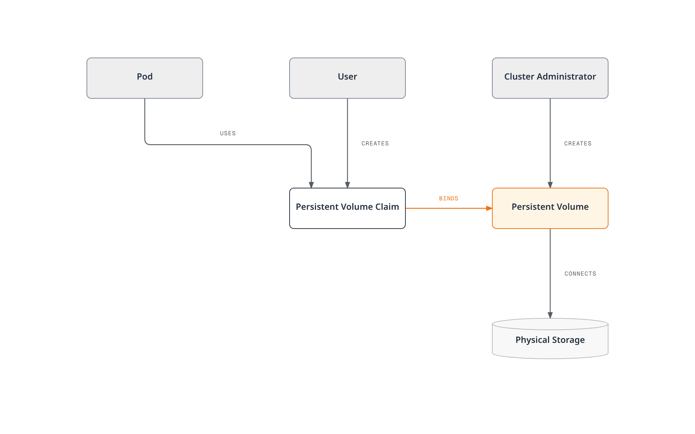
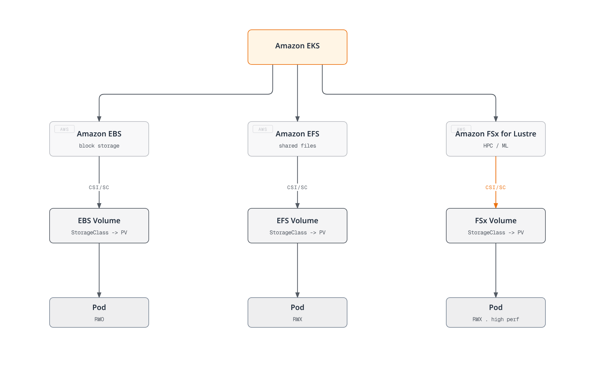

# Storage

> **Supported Versions**: Kubernetes 1.35, 1.36, 1.37
> **Last Updated**: February 19, 2026

In Kubernetes, storage is an important part of storing and managing data for containerized applications. In this chapter, we'll explore Kubernetes storage concepts in detail, including Volumes, Persistent Volumes, Persistent Volume Claims, and Storage Classes.

## Lab Environment Setup

To follow the examples in this document, you'll need the following tools and environment:

### Required Tools
- kubectl within one minor version of the API server
- A working Kubernetes cluster (EKS, minikube, kind, etc.)
- Storage provisioner (EBS CSI driver for EKS)

The first example requires a default StorageClass; otherwise set `storageClassName` to an installed class. EKS EBS examples below use the standard EBS CSI driver on EC2 nodes with IAM permissions; Auto Mode uses `ebs.csi.eks.amazonaws.com`. EBS cannot mount on Fargate or Hybrid Nodes. Treat later manifests as independent examples with their stated prerequisites.

### Storage Example Setup

```bash
# Create namespace
kubectl create namespace storage-demo

# Create a simple PVC and Pod
kubectl -n storage-demo apply -f - <<'EOF'
apiVersion: v1
kind: PersistentVolumeClaim
metadata:
  name: data-pvc
spec:
  accessModes:
    - ReadWriteOnce
  resources:
    requests:
      storage: 1Gi
---
apiVersion: v1
kind: Pod
metadata:
  name: data-pod
spec:
  containers:
  - name: data-container
    image: busybox
    command: ["sh", "-c", "while true; do echo $(date) >> /data/output.txt; sleep 5; done"]
    volumeMounts:
    - name: data-volume
      mountPath: /data
  volumes:
  - name: data-volume
    persistentVolumeClaim:
      claimName: data-pvc
EOF

# Check storage resources
kubectl -n storage-demo get pvc,pod
```

## Table of Contents

1. [Volumes](#volumes)
2. [Persistent Volumes](#persistent-volumes)
3. [Persistent Volume Claims](#persistent-volume-claims)
4. [Storage Classes](#storage-classes)
5. [Dynamic Provisioning](#dynamic-provisioning)
6. [Volume Snapshots](#volume-snapshots)
7. [Volume Expansion](#volume-expansion)
8. [Projected Volumes](#projected-volumes)
9. [Generic Ephemeral Volumes](#generic-ephemeral-volumes)
10. [Block Volume Mode](#block-volume-mode)
11. [Volume Cloning](#volume-cloning)
12. [Storage ResourceQuota](#storage-resourcequota)
13. [Storage Options in EKS](#storage-options-in-eks)

## Volumes

> **Key Concept**: Kubernetes Volumes are directories where containers within a Pod can store and share data, maintaining data regardless of container restarts.

Kubernetes Volumes are directories where containers within a Pod can store and share data. A Pod's mount exists for that Pod, but backend data retention depends on the volume type. emptyDir data is removed with the Pod; persistent storage can outlive it.

### Kubernetes Storage Architecture


[🔍 View interactive diagram](https://www.atomai.click/kubernetes-docs/archmaps/en-core-04-storage-0.html)

### Why Volumes Are Needed

1. **Data Persistence on Container Restart**: When a container restarts, its filesystem is reset, but using volumes allows data to persist.
2. **Data Sharing Between Containers**: Multiple containers in the same Pod can share data through volumes.

### Main Volume Type Comparison

| Volume Type | Lifecycle | Data Persistence | Use Case | Features |
|------------|----------|-----------------|----------|----------|
| **emptyDir** | Pod | Temporary | Temporary data, cache, checkpoints | Data deleted when Pod is deleted |
| **hostPath** | Node | Node-level | Node filesystem access, monitoring | Security risk - use with caution |
| **configMap** | Configuration | Configuration data | Application configuration | Mount configuration data as volume |
| **secret** | Configuration | Sensitive data | Certificates, passwords | Mount sensitive data as volume |
| **persistentVolumeClaim** | Cluster | Permanent | Databases, file storage | Data persists after Pod restart and rescheduling |

### emptyDir

An `emptyDir` volume is created when a Pod is assigned to a node and persists while the Pod runs on that node. When the Pod is removed from the node, the data in `emptyDir` is permanently deleted.

```yaml
apiVersion: v1
kind: Pod
metadata:
  name: test-pd
spec:
  containers:
  - image: nginx
    name: test-container
    volumeMounts:
    - mountPath: /cache
      name: cache-volume
  volumes:
  - name: cache-volume
    emptyDir: {}
```

### hostPath

A `hostPath` volume mounts a file or directory from the node's filesystem to the Pod. This is useful for Pods that need access to the node's filesystem, but should be used with caution due to security risks.

```yaml
apiVersion: v1
kind: Pod
metadata:
  name: test-hostpath
spec:
  containers:
  - image: nginx
    name: test-container
    volumeMounts:
    - mountPath: /test-pd
      name: test-volume
  volumes:
  - name: test-volume
    hostPath:
      path: /data
      type: Directory  # DirectoryOrCreate, Directory, FileOrCreate, File, Socket, CharDevice, BlockDevice
```

```yaml
apiVersion: v1
kind: Pod
metadata:
  name: test-pd
spec:
  containers:
  - image: nginx
    name: test-container
    volumeMounts:
    - mountPath: /test-pd
      name: test-volume
  volumes:
  - name: test-volume
    hostPath:
      path: /data
      type: Directory
```

#### configMap

A `configMap` volume mounts ConfigMap data to a Pod. ConfigMaps are used to store configuration data in key-value pairs.

```yaml
apiVersion: v1
kind: Pod
metadata:
  name: configmap-pod
spec:
  containers:
  - name: test
    image: busybox
    volumeMounts:
    - name: config-vol
      mountPath: /etc/config
  volumes:
  - name: config-vol
    configMap:
      name: log-config
      items:
      - key: log_level
        path: log_level
```

#### secret

A `secret` volume mounts Secret data to a Pod. Secrets are used to store sensitive information such as passwords, tokens, and keys.

```yaml
apiVersion: v1
kind: Pod
metadata:
  name: secret-pod
spec:
  containers:
  - name: test
    image: busybox
    volumeMounts:
    - name: secret-vol
      mountPath: /etc/secret
      readOnly: true
  volumes:
  - name: secret-vol
    secret:
      secretName: mysecret
      items:
      - key: username
        path: my-username
```

#### nfs

An `nfs` volume mounts an existing NFS (Network File System) share to a Pod.

```yaml
apiVersion: v1
kind: Pod
metadata:
  name: nfs-pod
spec:
  containers:
  - name: test
    image: busybox
    volumeMounts:
    - name: nfs-vol
      mountPath: /mnt/nfs
  volumes:
  - name: nfs-vol
    nfs:
      server: nfs-server.example.com
      path: /share
```

#### persistentVolumeClaim

A `persistentVolumeClaim` volume mounts a PersistentVolumeClaim to a Pod. This is one of the most commonly used volume types.

```yaml
apiVersion: v1
kind: Pod
metadata:
  name: pvc-pod
spec:
  containers:
  - name: test
    image: busybox
    volumeMounts:
    - name: pvc-vol
      mountPath: /mnt/pvc
  volumes:
  - name: pvc-vol
    persistentVolumeClaim:
      claimName: my-pvc
```

#### CSI (Container Storage Interface)

CSI volumes provide a standard interface between Kubernetes and external storage systems. Using CSI, storage vendors can develop their own storage drivers without modifying Kubernetes code.

```yaml
apiVersion: v1
kind: Pod
metadata:
  name: csi-pod
spec:
  containers:
  - name: test
    image: busybox
    volumeMounts:
    - name: csi-vol
      mountPath: /mnt/csi
  volumes:
  - name: csi-vol
    csi:
      driver: csi-driver.example.com
      volumeAttributes:
        foo: bar
      nodePublishSecretRef:
        name: csi-secret
```

## Persistent Volumes

A Persistent Volume (PV) is cluster storage provisioned by an administrator or dynamically provisioned using a Storage Class. PVs have a lifecycle independent of Pods, and PVs are retained even when Pods are deleted.



[🔍 View interactive diagram](https://www.atomai.click/kubernetes-docs/archmaps/en-core-04-storage-1.html)

### PV Creation

```yaml
apiVersion: v1
kind: PersistentVolume
metadata:
  name: pv0001
  labels:
    release: stable
    environment: dev
spec:
  capacity:
    storage: 10Gi
  volumeMode: Filesystem
  accessModes:
    - ReadWriteOnce
  persistentVolumeReclaimPolicy: Retain
  storageClassName: slow
  mountOptions:
    - hard
    - nfsvers=4.1
  nfs:
    path: /tmp
    server: 172.17.0.2
```

### PV Access Modes

PVs support the following access modes:

- **ReadWriteOnce (RWO)**: Volume can be mounted as read-write by a single node.
- **ReadOnlyMany (ROX)**: Volume can be mounted as read-only by multiple nodes.
- **ReadWriteMany (RWX)**: Volume can be mounted as read-write by multiple nodes.
- **ReadWriteOncePod (RWOP)**: Volume can be mounted as read-write by a single Pod (CSI only; stable since v1.29).

RWO restricts writable mounting to one **node**, not one Pod: multiple Pods on that node can share the volume. RWOP enforces a single Pod with a supporting CSI driver. Access modes are not a substitute for filesystem permissions.

### PV Reclaim Policies

PVs can have the following reclaim policies:

- **Retain**: When PVC is deleted, PV and data are retained. Administrator must manually clean up.
- **Delete**: When PVC is deleted, PV and external storage assets are automatically deleted.
- **Recycle**: When PVC is deleted, data in PV is deleted and PV becomes available again (deprecated).

### PV Status

PVs can have the following statuses:

- **Available**: Resource available that is not yet bound to a claim.
- **Bound**: Bound to a claim.
- **Released**: Claim has been deleted, but resource has not yet been reclaimed by the cluster.
- **Failed**: Automatic reclamation failed.

## Persistent Volume Claims

A Persistent Volume Claim (PVC) is a user's storage request. PVCs are similar to PVs, but PVCs are how users request storage while PVs are how administrators provide storage.

### PVC Creation

```yaml
apiVersion: v1
kind: PersistentVolumeClaim
metadata:
  name: myclaim
spec:
  accessModes:
    - ReadWriteOnce
  volumeMode: Filesystem
  resources:
    requests:
      storage: 8Gi
  storageClassName: slow
  selector:
    matchLabels:
      release: "stable"
    matchExpressions:
      - {key: environment, operator: In, values: [dev]}
```

### PVC and PV Binding

When a PVC is created, Kubernetes finds and binds a PV that meets the PVC's requirements (storage size, access modes, storage class, selector, etc.). Without a matching PV, a suitable StorageClass can dynamically provision one. A PVC with a non-empty selector (as above) cannot be dynamically provisioned, so it remains Pending without a matching static PV. WaitForFirstConsumer also intentionally delays binding until scheduling.

### Using PVC

PVCs can be used as volumes in Pods:

```yaml
apiVersion: v1
kind: Pod
metadata:
  name: mypod
spec:
  containers:
    - name: myfrontend
      image: nginx
      volumeMounts:
      - mountPath: "/var/www/html"
        name: mypd
  volumes:
    - name: mypd
      persistentVolumeClaim:
        claimName: myclaim
```

## Storage Classes

Storage Classes describe the "classes" of storage provided by administrators. Storage Classes are used to dynamically provision PVs.


[🔍 View interactive diagram](https://www.atomai.click/kubernetes-docs/archmaps/en-core-04-storage-2.html)

### Storage Class Creation

```yaml
apiVersion: storage.k8s.io/v1
kind: StorageClass
metadata:
  name: standard
provisioner: ebs.csi.aws.com
parameters:
  type: gp3
  csi.storage.k8s.io/fstype: ext4
reclaimPolicy: Delete
allowVolumeExpansion: true
volumeBindingMode: WaitForFirstConsumer
```

This example creates a storage class that provisions AWS EBS gp3 volumes.

### Provisioners

Storage classes specify a provisioner used to provision volumes. Current CSI provisioners include:

- `ebs.csi.aws.com`: AWS EBS
- `efs.csi.aws.com`: AWS EFS
- `fsx.csi.aws.com`: FSx for Lustre
- `pd.csi.storage.gke.io`: Google Persistent Disk
- `disk.csi.azure.com` / `file.csi.azure.com`: Azure Disk/File
- `nfs.csi.k8s.io`: NFS CSI driver (requires an existing NFS server)

Legacy in-tree cloud plugins have been removed or migrated. Install the appropriate CSI driver; Kubernetes has no built-in `kubernetes.io/nfs` dynamic provisioner.

### Volume Binding Modes

Storage classes support the following volume binding modes:

- **Immediate**: Default, volumes are provisioned immediately when PVC is created.
- **WaitForFirstConsumer**: Delays volume provisioning until a Pod tries to use the PVC. This is useful to ensure volumes are provisioned in the same zone as Pods.

### Default Storage Class

A default storage class can be set for the cluster. If no storage class is specified in a PVC, the default storage class is used.

```yaml
apiVersion: storage.k8s.io/v1
kind: StorageClass
metadata:
  name: standard
  annotations:
    storageclass.kubernetes.io/is-default-class: "true"
provisioner: ebs.csi.aws.com
parameters:
  type: gp3
  encrypted: "true"
volumeBindingMode: WaitForFirstConsumer
```

## Dynamic Provisioning

Dynamic provisioning is a feature that automatically creates PVs when PVCs are created. This allows users to request storage when needed without administrators pre-creating PVs.

### Dynamic Provisioning Example

1. Create Storage Class:

```yaml
apiVersion: storage.k8s.io/v1
kind: StorageClass
metadata:
  name: fast
provisioner: ebs.csi.aws.com
parameters:
  type: gp3
  iops: "3000"
  encrypted: "true"
allowVolumeExpansion: true
volumeBindingMode: WaitForFirstConsumer
```

2. Create PVC:

```yaml
apiVersion: v1
kind: PersistentVolumeClaim
metadata:
  name: myclaim
spec:
  accessModes:
    - ReadWriteOnce
  resources:
    requests:
      storage: 100Gi
  storageClassName: fast
```

3. Use PVC in Pod:

```yaml
apiVersion: v1
kind: Pod
metadata:
  name: mypod
spec:
  containers:
    - name: myfrontend
      image: nginx
      volumeMounts:
      - mountPath: "/var/www/html"
        name: mypd
  volumes:
    - name: mypd
      persistentVolumeClaim:
        claimName: myclaim
```

## Volume Snapshots

Kubernetes supports volume snapshots to create point-in-time copies of PVs. This is useful for backup and restore scenarios.


[🔍 View interactive diagram](https://www.atomai.click/kubernetes-docs/archmaps/en-core-04-storage-3.html)

Install snapshot CRDs, the snapshot controller, and a CSI driver with snapshot support. The following uses EBS; the source PVC and restore StorageClass must use that driver. Wait for `readyToUse: true`, and request at least the snapshot's restore size. A storage snapshot alone does not guarantee database consistency; quiesce writes or use database-aware backups.

### Volume Snapshot Class

```yaml
apiVersion: snapshot.storage.k8s.io/v1
kind: VolumeSnapshotClass
metadata:
  name: ebs-snapclass
driver: ebs.csi.aws.com
deletionPolicy: Delete
```

### Create Volume Snapshot

```yaml
apiVersion: snapshot.storage.k8s.io/v1
kind: VolumeSnapshot
metadata:
  name: new-snapshot
spec:
  volumeSnapshotClassName: ebs-snapclass
  source:
    persistentVolumeClaimName: myclaim
```

### Create PVC from Snapshot

```yaml
apiVersion: v1
kind: PersistentVolumeClaim
metadata:
  name: restore-pvc
spec:
  storageClassName: standard
  dataSource:
    name: new-snapshot
    kind: VolumeSnapshot
    apiGroup: snapshot.storage.k8s.io
  accessModes:
    - ReadWriteOnce
  resources:
    requests:
      storage: 100Gi
```

## Volume Expansion

Kubernetes supports the ability to expand the size of PVCs. For this, `allowVolumeExpansion: true` must be set in the storage class.


[🔍 View interactive diagram](https://www.atomai.click/kubernetes-docs/archmaps/en-core-04-storage-4.html)

### PVC Expansion

For an existing 100Gi PVC on an expansion-capable EBS StorageClass, change only the requested size:

```bash
kubectl patch pvc myclaim --type merge -p '{"spec":{"resources":{"requests":{"storage":"120Gi"}}}}'
```

Use the PVC's namespace and existing StorageClass. The driver and filesystem must support expansion; shrinking is not supported. Do not change the bound PVC's class or edit PV capacity directly to simulate resizing.

## Projected Volumes

Projected volumes allow you to combine multiple volume sources into a single volume mount. This is useful when you need to expose secrets, configMaps, downwardAPI, and serviceAccountToken together in a single directory.

### Supported Sources

- **secret**: Mount secret data
- **configMap**: Mount configuration data
- **downwardAPI**: Expose pod and container metadata
- **serviceAccountToken**: Mount service account tokens with configurable expiration

### Projected Volume Example

```yaml
apiVersion: v1
kind: Pod
metadata:
  name: projected-volume-pod
spec:
  containers:
  - name: app
    image: busybox
    command: ["sh", "-c", "ls -la /etc/projected && sleep 3600"]
    volumeMounts:
    - name: all-in-one
      mountPath: /etc/projected
      readOnly: true
  volumes:
  - name: all-in-one
    projected:
      sources:
      - secret:
          name: db-credentials
          items:
          - key: username
            path: db/username
          - key: password
            path: db/password
      - configMap:
          name: app-config
          items:
          - key: config.yaml
            path: config/app.yaml
      - downwardAPI:
          items:
          - path: labels
            fieldRef:
              fieldPath: metadata.labels
          - path: cpu-request
            resourceFieldRef:
              containerName: app
              resource: requests.cpu
      - serviceAccountToken:
          path: token
          expirationSeconds: 3600
          audience: api
```

This configuration creates a single volume at `/etc/projected` containing:
- `/etc/projected/db/username` and `/etc/projected/db/password` from the secret
- `/etc/projected/config/app.yaml` from the configMap
- `/etc/projected/labels` and `/etc/projected/cpu-request` from downwardAPI
- `/etc/projected/token` with an auto-rotating service account token

### Service Account Token Projection

Service account token projection provides tokens with bounded lifetime and audience:

```yaml
apiVersion: v1
kind: Pod
metadata:
  name: token-projected-pod
spec:
  serviceAccountName: my-service-account
  containers:
  - name: app
    image: myapp:latest
    volumeMounts:
    - name: token
      mountPath: /var/run/secrets/tokens
  volumes:
  - name: token
    projected:
      sources:
      - serviceAccountToken:
          path: api-token
          expirationSeconds: 7200  # 2 hours
          audience: my-api-service
```

Projected tokens rotate; applications must reread the file. An explicit `audience` must match the intended verifier and is not automatically valid for Kubernetes API access.

## Generic Ephemeral Volumes

Generic ephemeral volumes provide PVC-like storage that is tied to the pod's lifecycle. Unlike emptyDir, they use the full power of PVCs and StorageClasses, including dynamic provisioning.

### Differences from emptyDir

| Feature | emptyDir | Generic Ephemeral Volume |
|---------|----------|--------------------------|
| **Storage backend** | Node local storage or memory | Any CSI driver |
| **Provisioning** | Automatic, simple | Uses StorageClass, dynamic provisioning |
| **Size limits** | sizeLimit (soft) | Full PVC capacity management |
| **Snapshots** | Not supported | Supported (if CSI driver supports) |
| **Storage features** | Basic | Full CSI features (encryption, IOPS, etc.) |
| **Persistence** | Lost when Pod is deleted | PVC deleted with Pod; backend follows reclaim policy |

### Generic Ephemeral Volume Example

```yaml
apiVersion: v1
kind: Pod
metadata:
  name: ephemeral-volume-pod
spec:
  containers:
  - name: app
    image: busybox
    command: ["sh", "-c", "dd if=/dev/zero of=/scratch/data bs=1M count=100 && sleep 3600"]
    volumeMounts:
    - name: scratch
      mountPath: /scratch
  volumes:
  - name: scratch
    ephemeral:
      volumeClaimTemplate:
        metadata:
          labels:
            type: scratch-storage
        spec:
          accessModes:
          - ReadWriteOnce
          storageClassName: fast-ssd
          resources:
            requests:
              storage: 10Gi
```

### Use Cases

1. **CI/CD pipelines**: Temporary build artifacts with guaranteed storage capacity
2. **Data processing**: Scratch space with specific performance requirements
3. **Testing**: Temporary databases or caches with CSI features
4. **Machine learning**: Temporary model checkpoints with high-performance storage

### Deployment with Generic Ephemeral Volumes

```yaml
apiVersion: apps/v1
kind: Deployment
metadata:
  name: ml-training
spec:
  replicas: 3
  selector:
    matchLabels:
      app: ml-training
  template:
    metadata:
      labels:
        app: ml-training
    spec:
      containers:
      - name: trainer
        image: ml-trainer:latest
        volumeMounts:
        - name: checkpoint-storage
          mountPath: /checkpoints
      volumes:
      - name: checkpoint-storage
        ephemeral:
          volumeClaimTemplate:
            spec:
              accessModes:
              - ReadWriteOnce
              storageClassName: high-iops
              resources:
                requests:
                  storage: 50Gi
```

Generic ephemeral PVCs are owned by their Pod and garbage-collected with it. Underlying data deletion follows the PV reclaim policy: `Retain` leaves storage for manual cleanup. Export checkpoints that must survive Pod loss to durable storage.

## Block Volume Mode

Kubernetes supports raw block volumes in addition to filesystem volumes. Block volumes present storage as a raw block device without a filesystem, useful for applications that manage their own data layout.

### Filesystem vs Block Mode

| Aspect | Filesystem (default) | Block |
|--------|---------------------|-------|
| **volumeMode** | `Filesystem` | `Block` |
| **Mount type** | Mounted as directory | Exposed as device file |
| **Filesystem** | ext4, xfs, etc. | None (raw) |
| **Access in pod** | `/mnt/data/` | `/dev/xvda` |
| **Use case** | General applications | Databases, specialized apps |

### Block Volume PV and PVC

```yaml
# PersistentVolume with Block mode
apiVersion: v1
kind: PersistentVolume
metadata:
  name: block-pv
spec:
  capacity:
    storage: 100Gi
  volumeMode: Block
  accessModes:
  - ReadWriteOnce
  persistentVolumeReclaimPolicy: Retain
  storageClassName: block-storage
  csi:
    driver: ebs.csi.aws.com
    volumeHandle: vol-0123456789abcdef0
  nodeAffinity:
    required:
      nodeSelectorTerms:
      - matchExpressions:
        - key: topology.kubernetes.io/zone
          operator: In
          values: [us-west-2a]
---
# PersistentVolumeClaim for Block volume
apiVersion: v1
kind: PersistentVolumeClaim
metadata:
  name: block-pvc
spec:
  volumeMode: Block
  accessModes:
  - ReadWriteOnce
  storageClassName: block-storage
  resources:
    requests:
      storage: 100Gi
```

### Using Block Volumes in Pods

```yaml
apiVersion: v1
kind: Pod
metadata:
  name: block-volume-pod
spec:
  containers:
  - name: database
    image: custom-database:latest
    volumeDevices:
    - name: data
      devicePath: /dev/xvda
  volumes:
  - name: data
    persistentVolumeClaim:
      claimName: block-pvc
```

Note: Block volumes use `volumeDevices` and `devicePath` instead of `volumeMounts` and `mountPath`.

### Use Cases for Block Volumes

1. **Specialized storage engines**: Only software explicitly designed for raw block devices; ordinary MySQL/PostgreSQL data directories require a filesystem
2. **Custom filesystems**: Applications using specialized filesystems like ZFS or LVM
3. **High-performance storage**: Applications requiring direct I/O without filesystem overhead
4. **Storage virtualization**: Software-defined storage solutions

Replace the static EBS volume ID and nodeAffinity zone with the actual volume and its Availability Zone. The `custom-database` image is a placeholder for software that supports raw block devices.

## Volume Cloning

Volume cloning creates a new PVC with the contents of an existing PVC. This is useful for creating test environments, duplicating data, or migrating workloads.

### Prerequisites

EBS CSI supports PVC cloning from v1.51.0 ([versioned example](https://github.com/kubernetes-sigs/aws-ebs-csi-driver/blob/v1.66.0/examples/kubernetes/clone/README.md)); verify the installed driver and IAM permissions. FSx for Lustre CSI does not advertise `CLONE_VOLUME`; do not infer EFS support either. `kubectl get csidriver` does not expose CSI RPC capabilities.

- CSI driver must support volume cloning
- Source and destination PVCs must be in the same namespace
- Different StorageClasses are allowed when supported by the driver; the source must be bound and available (not in use)
- Source and destination must have the same volumeMode

### PVC Cloning Example

```yaml
# Source PVC (existing)
apiVersion: v1
kind: PersistentVolumeClaim
metadata:
  name: source-pvc
  namespace: production
spec:
  accessModes:
  - ReadWriteOnce
  storageClassName: ebs-sc
  resources:
    requests:
      storage: 100Gi
---
# Clone PVC using dataSource
apiVersion: v1
kind: PersistentVolumeClaim
metadata:
  name: cloned-pvc
  namespace: production
spec:
  accessModes:
  - ReadWriteOnce
  storageClassName: ebs-sc
  resources:
    requests:
      storage: 100Gi  # Must be >= source size
  dataSource:
    kind: PersistentVolumeClaim
    name: source-pvc
```

### Cloning vs Snapshots

| Feature | Volume Cloning | Volume Snapshots |
|---------|---------------|------------------|
| **Result** | New PVC with data | Snapshot object |
| **Use case** | Duplicate an available source volume | Point-in-time backup |
| **Performance** | Driver/backend dependent | Driver/backend dependent |
| **Cross-namespace** | No | No |
| **Storage overhead** | Backend dependent | Backend dependent |

### Clone for Testing

Create a bound, consistent `staging-source-pvc` in `staging` first. A `dataSource` cannot directly reference a PVC in `production`. The clone must already contain a compatible PostgreSQL data directory; this is not an initialization example.

```yaml
apiVersion: v1
kind: PersistentVolumeClaim
metadata:
  name: test-db-clone
  namespace: staging
spec:
  accessModes:
  - ReadWriteOnce
  storageClassName: ebs-sc
  resources:
    requests:
      storage: 100Gi
  dataSource:
    kind: PersistentVolumeClaim
    name: staging-source-pvc
---
apiVersion: v1
kind: Pod
metadata:
  name: test-database
  namespace: staging
spec:
  containers:
  - name: postgres
    image: postgres:15
    volumeMounts:
    - name: data
      mountPath: /var/lib/postgresql/data
  volumes:
  - name: data
    persistentVolumeClaim:
      claimName: test-db-clone
```

## Storage ResourceQuota

ResourceQuota can limit storage consumption within a namespace, including the number of PVCs and total storage capacity.

### Storage-Related Quota Fields

| Field | Description |
|-------|-------------|
| **persistentvolumeclaims** | Total number of PVCs allowed |
| **requests.storage** | Total storage capacity across all PVCs |
| **\<storage-class\>.storageclass.storage.k8s.io/requests.storage** | Storage capacity for specific StorageClass |
| **\<storage-class\>.storageclass.storage.k8s.io/persistentvolumeclaims** | PVC count for specific StorageClass |

### ResourceQuota Example

```yaml
apiVersion: v1
kind: ResourceQuota
metadata:
  name: storage-quota
  namespace: team-a
spec:
  hard:
    # Total limits
    persistentvolumeclaims: "10"
    requests.storage: "500Gi"

    # Per-StorageClass limits
    ebs-sc.storageclass.storage.k8s.io/requests.storage: "200Gi"
    ebs-sc.storageclass.storage.k8s.io/persistentvolumeclaims: "5"

    efs-sc.storageclass.storage.k8s.io/requests.storage: "300Gi"
    efs-sc.storageclass.storage.k8s.io/persistentvolumeclaims: "5"
```

### Checking ResourceQuota Status

```bash
# View quota status
kubectl get resourcequota storage-quota -n team-a -o yaml

# Example output
status:
  hard:
    persistentvolumeclaims: "10"
    requests.storage: "500Gi"
  used:
    persistentvolumeclaims: "3"
    requests.storage: "150Gi"
```

### LimitRange for Storage

LimitRange can enforce minimum and maximum PVC storage requests; it does not default a missing PVC request:

```yaml
apiVersion: v1
kind: LimitRange
metadata:
  name: storage-limits
  namespace: team-a
spec:
  limits:
  - type: PersistentVolumeClaim
    min:
      storage: 1Gi
    max:
      storage: 100Gi
```

This ensures:
- Minimum PVC size is 1Gi
- Maximum PVC size is 100Gi
- Every PVC must explicitly request storage; there is no PVC defaulting from LimitRange

## Storage Options in EKS

Various storage options are available in Amazon EKS. Each option has different use cases and performance characteristics, so it's important to choose the appropriate storage for your application's requirements.



[🔍 View interactive diagram](https://www.atomai.click/kubernetes-docs/archmaps/en-core-04-storage-5.html)

### Amazon EBS

Amazon EBS (Elastic Block Store) provides block storage volumes that can be attached to EC2 instances. In EKS, you can use the EBS CSI driver to mount EBS volumes to Kubernetes Pods.

#### EBS CSI Driver Installation

Follow the [EKS driver installation guide](https://docs.aws.amazon.com/eks/latest/userguide/ebs-csi.html), selecting a compatible add-on/driver version and configuring its IAM role and node prerequisites before creating PVCs. A StorageClass alone does not install the driver.

#### EBS Storage Class

```yaml
apiVersion: storage.k8s.io/v1
kind: StorageClass
metadata:
  name: ebs-sc
provisioner: ebs.csi.aws.com
parameters:
  type: gp3
  csi.storage.k8s.io/fstype: ext4
  encrypted: "true"
volumeBindingMode: WaitForFirstConsumer
```

#### EBS Volume Types

Amazon EBS offers various volume types:

1. **gp3**: General-purpose SSD volumes suitable for most workloads. Provides a baseline of 3,000 IOPS and 125 MiB/s; current regional volume limits reach 80,000 IOPS and 2,000 MiB/s, subject to capacity/IOPS ratios and instance limits. Outposts has lower limits ([AWS specifications](https://docs.aws.amazon.com/ebs/latest/userguide/general-purpose.html)).

2. **io2**: High-performance SSD volumes suitable for workloads requiring high IOPS. Current io2 Block Express supports up to 1,000 IOPS/GiB and 256,000 IOPS on suitable Nitro instances, subject to instance and volume limits ([AWS specifications](https://docs.aws.amazon.com/ebs/latest/userguide/provisioned-iops.html)).

3. **st1**: Throughput-optimized HDD volumes suitable for throughput-intensive workloads like big data, data warehouses, and log processing.

4. **sc1**: Cold HDD volumes suitable for infrequently accessed data.

#### EBS Storage Class Example (gp3)

```yaml
apiVersion: storage.k8s.io/v1
kind: StorageClass
metadata:
  name: ebs-gp3
provisioner: ebs.csi.aws.com
parameters:
  type: gp3
  iops: "3000"
  throughput: "125"
  encrypted: "true"
  kmsKeyId: "arn:aws:kms:us-west-2:111122223333:key/1234abcd-12ab-34cd-56ef-1234567890ab"
volumeBindingMode: WaitForFirstConsumer
```

#### EBS Storage Class Example (io2)

```yaml
apiVersion: storage.k8s.io/v1
kind: StorageClass
metadata:
  name: ebs-io2
provisioner: ebs.csi.aws.com
parameters:
  type: io2
  iops: "10000"
  encrypted: "true"
volumeBindingMode: WaitForFirstConsumer
```

### Amazon EFS

Amazon EFS (Elastic File System) provides scalable file storage that can be accessed simultaneously by multiple EC2 instances. EFS supports the ReadWriteMany access mode, making it useful when multiple Pods need to share the same volume.

#### EFS CSI Driver Installation

Follow the [EKS driver installation guide](https://docs.aws.amazon.com/eks/latest/userguide/efs-csi.html), selecting a compatible add-on/driver version and configuring its IAM role and node prerequisites before creating PVCs. A StorageClass alone does not install the driver.

#### Create EFS File System

To create an EFS file system, you can use AWS Management Console, AWS CLI, or AWS CloudFormation.

AWS CLI example:

```bash
# Create EFS file system
aws efs create-file-system \
  --creation-token eks-efs \
  --performance-mode generalPurpose \
  --encrypted \
  --throughput-mode bursting \
  --tags Key=Name,Value=EKS-EFS

# Store file system ID
FS_ID=$(aws efs describe-file-systems \
  --creation-token eks-efs \
  --query "FileSystems[0].FileSystemId" \
  --output text)

# Create one mount target per Availability Zone
aws efs create-mount-target \
  --file-system-id "$FS_ID" \
  --subnet-id subnet-0eabfaa81fb22bcaf \
  --security-groups sg-068000ccf82dfba88
```

#### EFS Storage Class

```yaml
apiVersion: storage.k8s.io/v1
kind: StorageClass
metadata:
  name: efs-sc
provisioner: efs.csi.aws.com
parameters:
  provisioningMode: efs-ap
  fileSystemId: fs-1234abcd
  directoryPerms: "700"
```

#### EFS Access Point with PV and PVC

```yaml
# Persistent Volume
apiVersion: v1
kind: PersistentVolume
metadata:
  name: efs-pv
spec:
  capacity:
    storage: 5Gi
  volumeMode: Filesystem
  accessModes:
    - ReadWriteMany
  persistentVolumeReclaimPolicy: Retain
  storageClassName: efs-sc
  csi:
    driver: efs.csi.aws.com
    volumeHandle: fs-1234abcd::fsap-0123456789abcdef
---
# Persistent Volume Claim
apiVersion: v1
kind: PersistentVolumeClaim
metadata:
  name: efs-pvc
spec:
  accessModes:
    - ReadWriteMany
  storageClassName: efs-sc
  resources:
    requests:
      storage: 5Gi
```

Replace filesystem/access-point IDs and allow NFS TCP 2049 from the client security group to the mount targets. Dynamic provisioning creates access points on an existing filesystem, not the filesystem itself. EFS PVC capacity is a binding value, not a per-PVC quota; EFS grows elastically. Fargate supports static EFS provisioning only.

#### EFS Performance Modes

EFS offers two performance modes:

1. **General Purpose**: Default mode recommended for most file system workloads. Provides low latency.

2. **Max I/O**: Previous-generation mode with higher per-operation latency; AWS recommends General Purpose for new workloads. Max I/O is incompatible with Elastic throughput.

#### EFS Throughput Modes

EFS offers three throughput modes:

1. **Bursting**: Base throughput is allocated based on file system size, with burst credits providing temporarily higher throughput.

2. **Provisioned**: Provides specified throughput regardless of file system size.

3. **Elastic**: Automatically scales throughput up and down based on workload.

### Amazon FSx for Lustre

Amazon FSx for Lustre provides high-performance file systems for high-performance computing workloads. FSx for Lustre is suitable for large-scale data processing, machine learning, and analytics workloads.

#### FSx for Lustre CSI Driver Installation

Follow the [EKS driver installation guide](https://docs.aws.amazon.com/eks/latest/userguide/fsx-csi-create.html), selecting a compatible add-on/driver version and configuring its IAM role and node prerequisites before creating PVCs. A StorageClass alone does not install the driver.

#### Create FSx for Lustre File System

AWS CLI example:

```bash
aws fsx create-file-system \
  --file-system-type LUSTRE \
  --storage-capacity 1200 \
  --subnet-ids subnet-0eabfaa81fb22bcaf \
  --lustre-configuration DeploymentType=SCRATCH_2
```

#### FSx for Lustre Storage Class

```yaml
apiVersion: storage.k8s.io/v1
kind: StorageClass
metadata:
  name: fsx-sc
provisioner: fsx.csi.aws.com
parameters:
  subnetId: subnet-0eabfaa81fb22bcaf
  securityGroupIds: sg-068000ccf82dfba88
  deploymentType: SCRATCH_2
  dataCompressionType: "NONE"
  weeklyMaintenanceStartTime: "7:09:00"
```

#### FSx for Lustre Deployment Types

FSx for Lustre distinguishes scratch and persistent storage:

- **SCRATCH_1 / SCRATCH_2**: Temporary storage without data replication. Failed file servers are not replaced, and affected data can be lost; SCRATCH_2 does not automatically recover that data.
- **PERSISTENT_1 / PERSISTENT_2**: Replicated storage with automatic component replacement. Supported storage classes, capacity increments, throughput options, and Regions differ by deployment type.

Scratch has a 200 MBps/TiB baseline and can burst up to six times that rate. `PerUnitStorageThroughput` is for persistent SSD/HDD configurations, not SCRATCH_2. Persistent SSD options include 50/100/200 MBps/TiB for PERSISTENT_1 and 125/250/500/1000 for PERSISTENT_2. Intelligent-Tiering uses different capacity/throughput configuration. Consult the [deployment specifications](https://docs.aws.amazon.com/fsx/latest/LustreGuide/using-fsx-lustre.html) and API before selecting a size.

### FSx for Lustre Configuration for vLLM Workloads

Large-scale AI model workloads like vLLM (an LLM inference and serving engine) require storage with high throughput and low latency. FSx for Lustre is an ideal solution that meets these requirements.

#### FSx for Lustre Storage Class for vLLM

```yaml
apiVersion: storage.k8s.io/v1
kind: StorageClass
metadata:
  name: fsx-lustre-vllm
provisioner: fsx.csi.aws.com
parameters:
  subnetId: subnet-0eabfaa81fb22bcaf
  securityGroupIds: sg-068000ccf82dfba88
  deploymentType: PERSISTENT_1
  perUnitStorageThroughput: "200"
  dataCompressionType: "NONE"
reclaimPolicy: Retain
volumeBindingMode: Immediate
```

The FSx CSI driver derives capacity from the PVC request, not a `storageCapacity` StorageClass parameter. Replace subnet/security-group IDs, install a compatible Lustre client/CSI driver, and ensure the requested capacity is valid for the selected deployment type. The inference image below is a placeholder that must provide the model-serving command.

#### PVC for vLLM Workloads

```yaml
apiVersion: v1
kind: PersistentVolumeClaim
metadata:
  name: vllm-model-storage
spec:
  accessModes:
    - ReadWriteMany
  resources:
    requests:
      storage: 4800Gi
  storageClassName: fsx-lustre-vllm
```

#### vLLM Deployment Example

```yaml
apiVersion: apps/v1
kind: Deployment
metadata:
  name: vllm-inference
spec:
  replicas: 1
  selector:
    matchLabels:
      app: vllm-inference
  template:
    metadata:
      labels:
        app: vllm-inference
    spec:
      nodeSelector:
        node.kubernetes.io/instance-type: g5.12xlarge
      containers:
      - name: vllm
        image: vllm-inference:latest
        resources:
          limits:
            nvidia.com/gpu: 4
          requests:
            nvidia.com/gpu: 4
            memory: "64Gi"
            cpu: "32"
        volumeMounts:
        - name: model-storage
          mountPath: /models
      volumes:
      - name: model-storage
        persistentVolumeClaim:
          claimName: vllm-model-storage
```

#### vLLM Performance Optimization Tips

1. **Select Appropriate Throughput**: For vLLM workloads, it's recommended to choose throughput based on measured model-loading concurrency and dataset access.

2. **Optimize Storage Capacity**: Allocate sufficient storage capacity considering model size and dataset size.

3. **Network Optimization**: Ensure FSx for Lustre file system and EKS nodes are in the same availability zone.

4. **Instance Type Selection**: Use GPU instances (e.g., g5.12xlarge) to optimize vLLM workload performance.

5. **Memory Configuration**: Allocate sufficient memory based on model size.

6. **File System Mount Options**: Use appropriate mount options for optimal performance.

   ```bash
   mount -t lustre -o noatime,flock fs-1234abcd.fsx.us-west-2.amazonaws.com@tcp:/fsx /mnt/fsx
   ```

### Storage Option Comparison

| Storage Option | Access Mode | Use Case | Performance | Cost | Scalability |
|---------------|-------------|----------|-------------|------|-------------|
| Amazon EBS | ReadWriteOnce | Block storage mounted on one node | Medium-High | Medium | Limited (Single Node) |
| Amazon EFS | ReadWriteMany | File storage shared by multiple Pods | Medium | Medium-High | High (Multiple Nodes) |
| Amazon FSx for Lustre | ReadWriteMany | HPC, ML, Analytics | Very High | High | Very High (Parallel Access) |

### EKS Storage Selection Guide

1. **When block storage mounted on one node is needed**: Amazon EBS
   - Databases
   - Stateful applications
   - Workloads running on single node

2. **When file storage shared by multiple Pods is needed**: Amazon EFS
   - Web server content
   - Shared configuration files
   - Medium-scale data processing

3. **When high-performance file storage is needed**: Amazon FSx for Lustre
   - Large-scale data processing
   - Machine learning and AI workloads (vLLM, etc.)
   - High-performance computing (HPC)
   - Big data analytics

## Conclusion

In this chapter, we learned about Kubernetes storage concepts. Volumes provide a way for containers within a Pod to store and share data, and Persistent Volumes and Persistent Volume Claims provide storage with a lifecycle independent of Pods. Storage Classes enable users to request storage when needed through dynamic provisioning.

In EKS, various storage options are available including Amazon EBS, Amazon EFS, and Amazon FSx for Lustre, each with different use cases and performance characteristics. For large-scale AI model workloads like vLLM, FSx for Lustre with its high throughput and low latency is an ideal choice. FSx for Lustre is a parallel file system that allows data access from multiple nodes simultaneously, making it suitable for large-scale model training and inference tasks.

It's important to choose the appropriate storage option for your application's requirements. Choose Amazon EBS when block storage mounted on one node is needed, Amazon EFS when file storage shared by multiple Pods is needed, and Amazon FSx for Lustre when high-performance file storage is needed.

In the next chapter, we'll learn about Kubernetes configuration and secrets.

## Quiz

To test what you learned in this chapter, try the [Storage Quiz](../quizzes/core/04-storage-quiz.md).

## References

- [Kubernetes Official Documentation - Volumes](https://kubernetes.io/docs/concepts/storage/volumes/)
- [Kubernetes Official Documentation - Persistent Volumes](https://kubernetes.io/docs/concepts/storage/persistent-volumes/)
- [Kubernetes Official Documentation - Storage Classes](https://kubernetes.io/docs/concepts/storage/storage-classes/)
- [Kubernetes Official Documentation - Volume Snapshots](https://kubernetes.io/docs/concepts/storage/volume-snapshots/)
- [AWS EBS CSI Driver](https://github.com/kubernetes-sigs/aws-ebs-csi-driver)
- [AWS EFS CSI Driver](https://github.com/kubernetes-sigs/aws-efs-csi-driver)
- [AWS FSx for Lustre CSI Driver](https://github.com/kubernetes-sigs/aws-fsx-csi-driver)
- [AWS Blog - Scaling your LLM inference workloads: Multi-node deployment with TensorRT-LLM and Triton on Amazon EKS](https://aws.amazon.com/ko/blogs/hpc/scaling-your-llm-inference-workloads-multi-node-deployment-with-tensorrt-llm-and-triton-on-amazon-eks/)
- [AWS Workshop - GenAI FSx EKS](https://catalog.workshops.aws/genaifsxeks/en-US/200-module2-genai/210-deploy)
