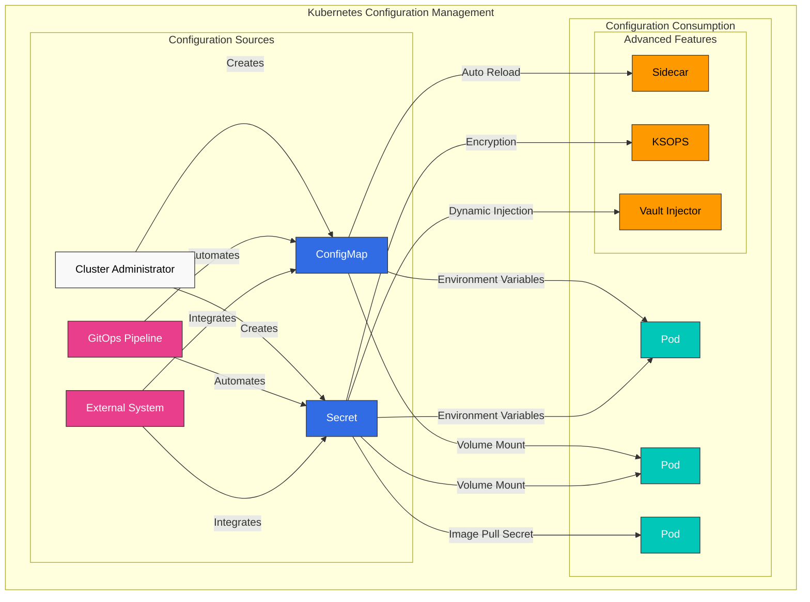
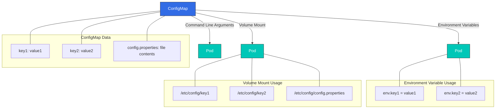
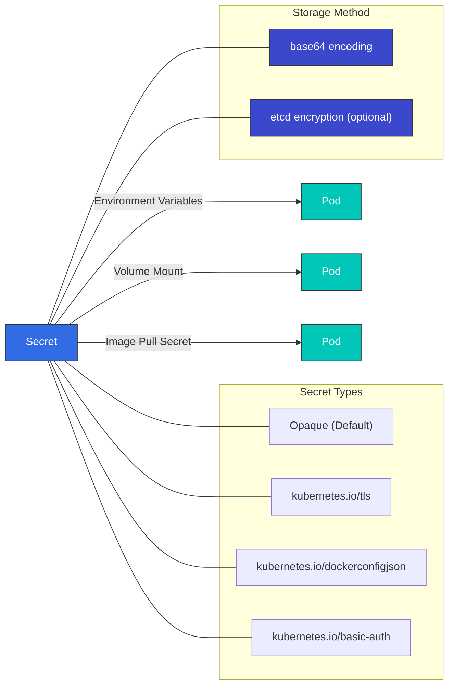
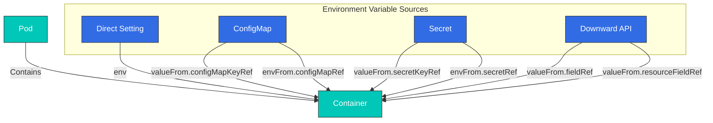
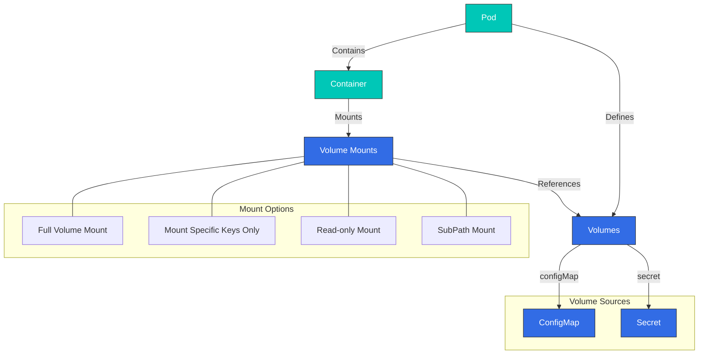
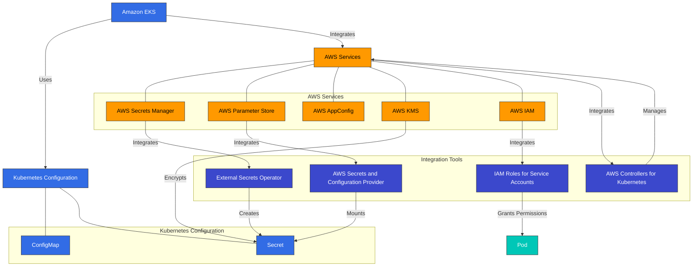

# Configuration and Secrets

> **Supported Versions**: Kubernetes 1.32, 1.33, 1.34
> **Last Updated**: February 22, 2026

In Kubernetes, configuration management is an important part of managing application settings separately from code. In this chapter, we'll explore Kubernetes configuration management methods in detail, including ConfigMaps, Secrets, environment variables, and mounting configuration through volumes.

## Lab Environment Setup

To follow the examples in this document, you'll need the following tools and environment:

### Required Tools
- kubectl v1.34 or higher
- A working Kubernetes cluster (EKS, minikube, kind, etc.)

### Configuration Example Setup

```bash
# Create namespace
kubectl create namespace config-demo

# Create ConfigMap
kubectl -n config-demo create configmap app-config \
  --from-literal=APP_ENV=production \
  --from-literal=APP_DEBUG=false \
  --from-literal=APP_PORT=8080

# Create Secret
kubectl -n config-demo create secret generic app-secrets \
  --from-literal=DB_USER=admin \
  --from-literal=DB_PASSWORD=s3cr3t \
  --from-literal=API_KEY=abcdef123456

# Create Pod using ConfigMap and Secret
kubectl -n config-demo apply -f - <<EOF
apiVersion: v1
kind: Pod
metadata:
  name: config-test-pod
spec:
  containers:
  - name: test-container
    image: busybox
    command: ["sh", "-c", "env | sort && sleep 3600"]
    env:
    - name: APP_ENV
      valueFrom:
        configMapKeyRef:
          name: app-config
          key: APP_ENV
    - name: DB_PASSWORD
      valueFrom:
        secretKeyRef:
          name: app-secrets
          key: DB_PASSWORD
  restartPolicy: Never
EOF

# Check Pod logs
kubectl -n config-demo logs config-test-pod
```

## Configuration Management at a Glance



## Table of Contents

1. [ConfigMap](#configmap)
2. [Secret](#secret)
3. [Environment Variables](#environment-variables)
4. [Mounting Configuration Through Volumes](#mounting-configuration-through-volumes)
5. [Configuration Best Practices](#configuration-best-practices)
6. [External Configuration Management Tools](#external-configuration-management-tools)

## ConfigMap

> **Key Concept**: ConfigMaps store configuration data in key-value pairs, separating application code from configuration.

ConfigMaps are API objects that store configuration data in key-value pairs. Using ConfigMaps allows you to separate configuration data from container images, making applications more portable.

### ConfigMap vs Secret Comparison

| Feature | ConfigMap | Secret |
|---------|-----------|--------|
| **Purpose** | General configuration data | Sensitive configuration data |
| **Storage Format** | Plain text | Base64 encoded (default) |
| **Size Limit** | 1MB | 1MB |
| **Encryption** | None by default | etcd encryption support |
| **Volume Type** | configMap | secret |
| **Use Cases** | Environment variables, config files | Passwords, tokens, certificates |
| **Auto Update** | Possible delay when volume mounted | Possible delay when volume mounted |

### ConfigMap Creation Methods

ConfigMaps can be created in various ways:

1. **Imperative creation**:

```bash
# Create from literal values
kubectl create configmap my-config --from-literal=key1=value1 --from-literal=key2=value2

# Create from file
kubectl create configmap my-config --from-file=config.properties

# Create from directory
kubectl create configmap my-config --from-file=config-dir/
```

2. **Declarative creation**:

```yaml
apiVersion: v1
kind: ConfigMap
metadata:
  name: my-config
data:
  # Simple key-value pairs
  database.host: "mysql"
  database.port: "3306"

  # File-like configuration
  config.yaml: |
    server:
      port: 8080
    logging:
      level: INFO
    features:
      enabled: true
```

### ConfigMap Usage Methods

ConfigMaps can be used in the following ways:

1. **Use as environment variables**:

```yaml
apiVersion: v1
kind: Pod
metadata:
  name: config-env-pod
spec:
  containers:
  - name: app
    image: nginx
    env:
    # Single key-value reference
    - name: DB_HOST
      valueFrom:
        configMapKeyRef:
          name: my-config
          key: database.host
    # All key-value references
    envFrom:
    - configMapRef:
        name: my-config
```



### ConfigMap Creation

ConfigMaps can be created in various ways:

#### Imperative

```bash
# Create from literal values
kubectl create configmap my-config --from-literal=key1=value1 --from-literal=key2=value2

# Create from file
kubectl create configmap my-config --from-file=config.properties

# Create from directory
kubectl create configmap my-config --from-file=config-dir/
```

#### Declarative

```yaml
apiVersion: v1
kind: ConfigMap
metadata:
  name: my-config
data:
  # Simple key-value pairs
  key1: value1
  key2: value2
  # File-like configuration
  config.properties: |
    property1=value1
    property2=value2
  # JSON configuration
  config.json: |
    {
      "property1": "value1",
      "property2": "value2"
    }
```

### ConfigMap Usage

ConfigMaps can be used in Pods in the following ways:

#### Use as Environment Variables

```yaml
apiVersion: v1
kind: Pod
metadata:
  name: configmap-pod
spec:
  containers:
  - name: test-container
    image: busybox
    command: [ "/bin/sh", "-c", "env" ]
    env:
    # Use single key-value pair
    - name: SPECIAL_KEY
      valueFrom:
        configMapKeyRef:
          name: my-config
          key: key1
    # Use all key-value pairs as environment variables
    envFrom:
    - configMapRef:
        name: my-config
  restartPolicy: Never
```

#### Mount as Volume

```yaml
apiVersion: v1
kind: Pod
metadata:
  name: configmap-pod
spec:
  containers:
  - name: test-container
    image: busybox
    command: [ "/bin/sh", "-c", "ls /etc/config/" ]
    volumeMounts:
    - name: config-volume
      mountPath: /etc/config
  volumes:
  - name: config-volume
    configMap:
      name: my-config
  restartPolicy: Never
```

#### Mount Only Specific Keys

```yaml
apiVersion: v1
kind: Pod
metadata:
  name: configmap-pod
spec:
  containers:
  - name: test-container
    image: busybox
    command: [ "/bin/sh", "-c", "cat /etc/config/key1" ]
    volumeMounts:
    - name: config-volume
      mountPath: /etc/config
  volumes:
  - name: config-volume
    configMap:
      name: my-config
      items:
      - key: key1
        path: key1
  restartPolicy: Never
```

### ConfigMap Updates

When a ConfigMap is updated, the contents of the ConfigMap mounted as a volume are automatically updated. However, ConfigMaps used as environment variables require a Pod restart to be updated.

```bash
kubectl edit configmap my-config
```

Or

```yaml
apiVersion: v1
kind: ConfigMap
metadata:
  name: my-config
data:
  key1: updated-value1
  key2: value2
```

```bash
kubectl apply -f updated-configmap.yaml
```

## Secret

Secrets are API objects that store sensitive information such as passwords, OAuth tokens, and SSH keys. Secrets are similar to ConfigMaps but provide additional security features for storing sensitive data.



### Secret Types

Kubernetes provides various types of secrets:

- **Opaque**: Default type, stores arbitrary user-defined data.
- **kubernetes.io/service-account-token**: Stores service account tokens.
- **kubernetes.io/dockercfg**: Stores serialized form of `.dockercfg` file.
- **kubernetes.io/dockerconfigjson**: Stores serialized form of `.docker/config.json` file.
- **kubernetes.io/basic-auth**: Stores credentials for basic authentication.
- **kubernetes.io/ssh-auth**: Stores credentials for SSH authentication.
- **kubernetes.io/tls**: Stores TLS certificates and keys.
- **bootstrap.kubernetes.io/token**: Stores bootstrap token data.

### Secret Creation

Secrets can be created in various ways:

#### Imperative

```bash
# Create from literal values
kubectl create secret generic my-secret --from-literal=username=admin --from-literal=password=secret

# Create from files
kubectl create secret generic my-secret --from-file=username.txt --from-file=password.txt

# Create TLS secret
kubectl create secret tls my-tls-secret --cert=path/to/cert.crt --key=path/to/key.key

# Create Docker registry secret
kubectl create secret docker-registry my-registry-secret \
  --docker-server=DOCKER_REGISTRY_SERVER \
  --docker-username=DOCKER_USER \
  --docker-password=DOCKER_PASSWORD \
  --docker-email=DOCKER_EMAIL
```

#### Declarative

```yaml
apiVersion: v1
kind: Secret
metadata:
  name: my-secret
type: Opaque
data:
  # base64 encoded values
  username: YWRtaW4=  # admin
  password: c2VjcmV0  # secret
```

Or you can use the `stringData` field to provide unencoded values:

```yaml
apiVersion: v1
kind: Secret
metadata:
  name: my-secret
type: Opaque
stringData:
  # Unencoded values
  username: admin
  password: secret
```

### Secret Usage

Secrets can be used in Pods in the following ways:

#### Use as Environment Variables

```yaml
apiVersion: v1
kind: Pod
metadata:
  name: secret-pod
spec:
  containers:
  - name: test-container
    image: busybox
    command: [ "/bin/sh", "-c", "env" ]
    env:
    # Use single key-value pair
    - name: USERNAME
      valueFrom:
        secretKeyRef:
          name: my-secret
          key: username
    # Use all key-value pairs as environment variables
    envFrom:
    - secretRef:
        name: my-secret
  restartPolicy: Never
```

#### Mount as Volume

```yaml
apiVersion: v1
kind: Pod
metadata:
  name: secret-pod
spec:
  containers:
  - name: test-container
    image: busybox
    command: [ "/bin/sh", "-c", "ls /etc/secret/" ]
    volumeMounts:
    - name: secret-volume
      mountPath: /etc/secret
  volumes:
  - name: secret-volume
    secret:
      secretName: my-secret
  restartPolicy: Never
```

#### Image Pull Secrets

```yaml
apiVersion: v1
kind: Pod
metadata:
  name: private-image-pod
spec:
  containers:
  - name: private-image-container
    image: private-registry.example.com/my-app:v1
  imagePullSecrets:
  - name: my-registry-secret
```

### Secret Security Considerations

Secrets are base64 encoded by default, but this is not encryption. To enhance secret security, consider the following methods:

1. **etcd Encryption**: Encrypt secrets stored in etcd.
2. **RBAC**: Restrict access to secrets.
3. **Network Policies**: Limit Pods that can access secrets.
4. **External Secret Management Tools**: Use external secret management tools like AWS Secrets Manager, HashiCorp Vault, etc.

#### etcd Encryption Configuration

```yaml
apiVersion: apiserver.config.k8s.io/v1
kind: EncryptionConfiguration
resources:
  - resources:
    - secrets
    providers:
    - aescbc:
        keys:
        - name: key1
          secret: <base64 encoded key>
    - identity: {}
```

## Environment Variables

Environment variables are a simple way to pass configuration information to containers. Kubernetes provides several ways to set environment variables.



### Direct Setting

```yaml
apiVersion: v1
kind: Pod
metadata:
  name: env-pod
spec:
  containers:
  - name: test-container
    image: busybox
    command: [ "/bin/sh", "-c", "env" ]
    env:
    - name: ENVIRONMENT
      value: "production"
    - name: LOG_LEVEL
      value: "INFO"
  restartPolicy: Never
```

### Setting from ConfigMap

```yaml
apiVersion: v1
kind: Pod
metadata:
  name: env-pod
spec:
  containers:
  - name: test-container
    image: busybox
    command: [ "/bin/sh", "-c", "env" ]
    env:
    - name: ENVIRONMENT
      valueFrom:
        configMapKeyRef:
          name: my-config
          key: environment
  restartPolicy: Never
```

### Setting from Secret

```yaml
apiVersion: v1
kind: Pod
metadata:
  name: env-pod
spec:
  containers:
  - name: test-container
    image: busybox
    command: [ "/bin/sh", "-c", "env" ]
    env:
    - name: DATABASE_PASSWORD
      valueFrom:
        secretKeyRef:
          name: my-secret
          key: password
  restartPolicy: Never
```

### Setting through Downward API

The Downward API allows you to expose Pod and container information as environment variables.

```yaml
apiVersion: v1
kind: Pod
metadata:
  name: downward-api-pod
  labels:
    app: myapp
spec:
  containers:
  - name: test-container
    image: busybox
    command: [ "/bin/sh", "-c", "env" ]
    env:
    - name: POD_NAME
      valueFrom:
        fieldRef:
          fieldPath: metadata.name
    - name: POD_NAMESPACE
      valueFrom:
        fieldRef:
          fieldPath: metadata.namespace
    - name: POD_IP
      valueFrom:
        fieldRef:
          fieldPath: status.podIP
    - name: NODE_NAME
      valueFrom:
        fieldRef:
          fieldPath: spec.nodeName
    - name: CONTAINER_CPU_REQUEST
      valueFrom:
        resourceFieldRef:
          containerName: test-container
          resource: requests.cpu
  restartPolicy: Never
```

## Mounting Configuration Through Volumes

Mounting configuration files to containers through volumes provides a more flexible configuration management method than environment variables.



### ConfigMap Volume

```yaml
apiVersion: v1
kind: Pod
metadata:
  name: configmap-volume-pod
spec:
  containers:
  - name: test-container
    image: busybox
    command: [ "/bin/sh", "-c", "ls -la /etc/config" ]
    volumeMounts:
    - name: config-volume
      mountPath: /etc/config
  volumes:
  - name: config-volume
    configMap:
      name: my-config
  restartPolicy: Never
```

### Secret Volume

```yaml
apiVersion: v1
kind: Pod
metadata:
  name: secret-volume-pod
spec:
  containers:
  - name: test-container
    image: busybox
    command: [ "/bin/sh", "-c", "ls -la /etc/secret" ]
    volumeMounts:
    - name: secret-volume
      mountPath: /etc/secret
  volumes:
  - name: secret-volume
    secret:
      secretName: my-secret
  restartPolicy: Never
```

### Specific File Mount

```yaml
apiVersion: v1
kind: Pod
metadata:
  name: specific-file-pod
spec:
  containers:
  - name: test-container
    image: busybox
    command: [ "/bin/sh", "-c", "cat /etc/config/config.properties" ]
    volumeMounts:
    - name: config-volume
      mountPath: /etc/config
  volumes:
  - name: config-volume
    configMap:
      name: my-config
      items:
      - key: config.properties
        path: config.properties
  restartPolicy: Never
```

### Read-only Mount

```yaml
apiVersion: v1
kind: Pod
metadata:
  name: readonly-mount-pod
spec:
  containers:
  - name: test-container
    image: busybox
    command: [ "/bin/sh", "-c", "ls -la /etc/config" ]
    volumeMounts:
    - name: config-volume
      mountPath: /etc/config
      readOnly: true
  volumes:
  - name: config-volume
    configMap:
      name: my-config
  restartPolicy: Never
```

### SubPath Mount

```yaml
apiVersion: v1
kind: Pod
metadata:
  name: subpath-mount-pod
spec:
  containers:
  - name: test-container
    image: busybox
    command: [ "/bin/sh", "-c", "cat /etc/nginx/nginx.conf" ]
    volumeMounts:
    - name: config-volume
      mountPath: /etc/nginx/nginx.conf
      subPath: nginx.conf
  volumes:
  - name: config-volume
    configMap:
      name: my-config
  restartPolicy: Never
```

## Configuration Best Practices

Consider the following best practices when managing configuration in Kubernetes:

### 1. Separate Configuration from Code

Manage application code and configuration separately. This eliminates the need to rebuild the application when changing configuration.

### 2. Environment-Specific Configuration Management

Manage configuration separately for different environments such as development, testing, and production. You can use namespaces to separate environments and use different ConfigMaps and Secrets for each environment.

```yaml
apiVersion: v1
kind: ConfigMap
metadata:
  name: my-config
  namespace: development
data:
  environment: development
  log_level: DEBUG
---
apiVersion: v1
kind: ConfigMap
metadata:
  name: my-config
  namespace: production
data:
  environment: production
  log_level: INFO
```

### 3. Use Secrets for Sensitive Information

Always use Secrets to store sensitive information such as passwords, API keys, and certificates. Use ConfigMaps only for non-sensitive configuration data.

### 4. Maintain Immutability

When changing configuration, create a new version rather than modifying the existing one. This makes rollbacks easier and allows tracking of configuration change history.

```yaml
apiVersion: v1
kind: ConfigMap
metadata:
  name: my-config-v1
data:
  # Configuration data
---
apiVersion: v1
kind: ConfigMap
metadata:
  name: my-config-v2
data:
  # Updated configuration data
```

### 5. Restart Pods on Configuration Changes

Configuration used as environment variables requires a Pod restart to be updated. Use Deployments to perform rolling updates.

```bash
kubectl rollout restart deployment/my-deployment
```

### 6. Validate Configuration

Validate configuration before applying it. Invalid configuration can cause application failures.

### 7. Document Configuration

Document configuration options and their effects. This helps team members understand and manage configuration.

## Configuration Management in Amazon EKS

In Amazon EKS, you can use AWS's various services in addition to Kubernetes' basic configuration management features to manage configuration and secrets. This section covers various ways to manage configuration in EKS and integration with AWS services.



### AWS Secrets Manager Integration

AWS Secrets Manager is a service that allows you to securely store and manage database credentials, API keys, and other secret information. In EKS, you can use External Secrets Operator or AWS Secrets and Configuration Provider (ASCP) to synchronize secrets from AWS Secrets Manager to Kubernetes secrets.

#### External Secrets Operator Installation

```bash
# Install External Secrets Operator using Helm
helm repo add external-secrets https://charts.external-secrets.io
helm install external-secrets external-secrets/external-secrets \
  --namespace external-secrets \
  --create-namespace
```

#### Create SecretStore

```yaml
apiVersion: external-secrets.io/v1beta1
kind: SecretStore
metadata:
  name: aws-secretsmanager
  namespace: my-namespace
spec:
  provider:
    aws:
      service: SecretsManager
      region: us-west-2
      auth:
        jwt:
          serviceAccountRef:
            name: my-serviceaccount
```

#### Create ExternalSecret

```yaml
apiVersion: external-secrets.io/v1beta1
kind: ExternalSecret
metadata:
  name: database-credentials
  namespace: my-namespace
spec:
  refreshInterval: 1h
  secretStoreRef:
    name: aws-secretsmanager
    kind: SecretStore
  target:
    name: db-credentials
  data:
  - secretKey: username
    remoteRef:
      key: prod/db/credentials
      property: username
  - secretKey: password
    remoteRef:
      key: prod/db/credentials
      property: password
```

#### IRSA (IAM Roles for Service Accounts) Setup

External Secrets Operator needs appropriate IAM permissions to access AWS Secrets Manager. You can use IRSA to associate IAM roles with Kubernetes service accounts.

```bash
# Create OIDC provider
eksctl utils associate-iam-oidc-provider \
  --cluster my-cluster \
  --approve

# Create IAM role and service account
eksctl create iamserviceaccount \
  --cluster my-cluster \
  --namespace my-namespace \
  --name my-serviceaccount \
  --attach-policy-arn arn:aws:iam::aws:policy/SecretsManagerReadWrite \
  --approve
```

### Using AWS Parameter Store

AWS Systems Manager Parameter Store is a service that allows you to hierarchically store and manage configuration data and secret values. Parameter Store is less expensive than Secrets Manager and is suitable for storing simple configuration values.

#### ASCP (AWS Secrets and Configuration Provider) Installation

```bash
# Install ASCP
helm repo add secrets-store-csi-driver https://kubernetes-sigs.github.io/secrets-store-csi-driver/charts
helm install csi-secrets-store secrets-store-csi-driver/secrets-store-csi-driver \
  --namespace kube-system

# Install AWS provider
kubectl apply -f https://raw.githubusercontent.com/aws/secrets-store-csi-driver-provider-aws/main/deployment/aws-provider-installer.yaml
```

#### Create SecretProviderClass

```yaml
apiVersion: secrets-store.csi.x-k8s.io/v1
kind: SecretProviderClass
metadata:
  name: aws-parameters
  namespace: my-namespace
spec:
  provider: aws
  parameters:
    objects: |
      - objectName: /my-app/config/log-level
        objectType: ssmparameter
      - objectName: /my-app/config/environment
        objectType: ssmparameter
```

#### Using Parameter Store Values in Pods

```yaml
apiVersion: v1
kind: Pod
metadata:
  name: parameter-store-pod
  namespace: my-namespace
spec:
  containers:
  - name: app
    image: my-app:latest
    volumeMounts:
    - name: parameters-store-volume
      mountPath: "/mnt/parameters"
      readOnly: true
  volumes:
  - name: parameters-store-volume
    csi:
      driver: secrets-store.csi.k8s.io
      readOnly: true
      volumeAttributes:
        secretProviderClass: aws-parameters
```

### Dynamic Configuration with AWS AppConfig

AWS AppConfig is a service that manages and deploys application configuration. Using AppConfig allows you to dynamically update configuration without redeploying applications.

#### AppConfig Agent Sidecar Pattern

```yaml
apiVersion: apps/v1
kind: Deployment
metadata:
  name: my-app
  namespace: my-namespace
spec:
  replicas: 3
  selector:
    matchLabels:
      app: my-app
  template:
    metadata:
      labels:
        app: my-app
    spec:
      containers:
      - name: app
        image: my-app:latest
        env:
        - name: CONFIG_PATH
          value: /config/config.json
        volumeMounts:
        - name: config-volume
          mountPath: /config
      - name: appconfig-agent
        image: public.ecr.aws/aws-appconfig/aws-appconfig-agent:2.0
        env:
        - name: AWS_APPCONFIG_EXTENSION_POLL_INTERVAL_SECONDS
          value: "45"
        - name: AWS_APPCONFIG_EXTENSION_POLL_TIMEOUT_SECONDS
          value: "15"
        - name: AWS_APPCONFIG_EXTENSION_HTTP_PORT
          value: "2772"
        - name: AWS_APPCONFIG_EXTENSION_PREFETCH_LIST
          value: '{"Applications":[{"ApplicationId":"MyApp","Environments":[{"EnvironmentId":"Production","Configurations":[{"ConfigurationProfileId":"MyConfig","VersionNumber":null}]}]}]}'
        volumeMounts:
        - name: config-volume
          mountPath: /config
      volumes:
      - name: config-volume
        emptyDir: {}
```

### Configuration with EKS Fargate Profiles

Using EKS Fargate allows you to run Kubernetes Pods without managing nodes. You can configure the Pod execution environment using Fargate profiles.

```yaml
apiVersion: eks.amazonaws.com/v1beta1
kind: FargateProfile
metadata:
  name: my-profile
  namespace: my-namespace
spec:
  clusterName: my-cluster
  podExecutionRoleArn: arn:aws:iam::123456789012:role/my-pod-execution-role
  selectors:
  - namespace: my-namespace
    labels:
      environment: production
  subnets:
  - subnet-1234567890abcdef0
  - subnet-0abcdef1234567890
```

### Secret Encryption with AWS KMS

Kubernetes secrets are base64 encoded by default, which is not encryption. You can use AWS KMS (Key Management Service) to encrypt secrets in your EKS cluster.

#### Create KMS Key

```bash
# Create KMS key
aws kms create-key --description "EKS Secret Encryption Key"

# Store key ID
KEY_ID=$(aws kms create-key --query KeyMetadata.KeyId --output text)

# Create key alias
aws kms create-alias --alias-name alias/eks-secrets --target-key-id $KEY_ID
```

#### Apply Encryption Configuration to EKS Cluster

```bash
# Apply encryption configuration
aws eks update-cluster-config \
  --name my-cluster \
  --encryption-config '[{"resources":["secrets"],"provider":{"keyArn":"arn:aws:kms:us-west-2:123456789012:key/'$KEY_ID'"}}]'
```

### Secret Access Control with AWS IAM

Using IRSA (IAM Roles for Service Accounts) to associate IAM roles with Kubernetes service accounts allows Pods to securely access AWS services.

#### Create Service Account

```yaml
apiVersion: v1
kind: ServiceAccount
metadata:
  name: my-service-account
  namespace: my-namespace
  annotations:
    eks.amazonaws.com/role-arn: arn:aws:iam::123456789012:role/my-iam-role
```

#### Using Service Account in Pods

```yaml
apiVersion: v1
kind: Pod
metadata:
  name: my-pod
  namespace: my-namespace
spec:
  serviceAccountName: my-service-account
  containers:
  - name: app
    image: my-app:latest
```

### EKS Configuration Best Practices

Consider the following best practices when managing configuration in EKS:

1. **Use IRSA**: Always use IRSA to grant minimum permissions to Pods when accessing AWS services.

2. **Encrypt Secrets**: Use KMS to encrypt secrets in your EKS cluster.

3. **External Secret Management**: Use external secret management services like AWS Secrets Manager or Parameter Store to manage sensitive information.

4. **Configuration Version Management**: Use AWS AppConfig or Parameter Store to manage configuration versions.

5. **Environment-Specific Configuration Separation**: Manage configuration separately for development, testing, and production environments. Use Kubernetes namespaces and AWS resource tags.

6. **Minimize IAM Policies**: Follow the principle of least privilege when accessing AWS services.

7. **Configuration Automation**: Use tools like AWS CloudFormation, AWS CDK, or Terraform to automate configuration management.

### EKS Configuration Management Tools

Let's look at tools that help manage configuration in EKS:

#### AWS Controllers for Kubernetes (ACK)

ACK is a tool that allows you to manage AWS resources from Kubernetes. Using ACK, you can create and manage AWS resources through Kubernetes manifests.

```yaml
apiVersion: secretsmanager.services.k8s.aws/v1alpha1
kind: Secret
metadata:
  name: my-secret
spec:
  name: my-secret
  description: "My secret created via ACK"
  forceDeleteWithoutRecovery: true
  generateSecretString:
    excludeCharacters: "\"@/\\"
    excludePunctuation: true
    includeSpace: false
    passwordLength: 16
```

#### eksctl

eksctl is a command-line tool for creating and managing EKS clusters. You can use eksctl to manage cluster configuration.

```yaml
# cluster.yaml
apiVersion: eksctl.io/v1alpha5
kind: ClusterConfig
metadata:
  name: my-cluster
  region: us-west-2
secretsEncryption:
  keyARN: arn:aws:kms:us-west-2:123456789012:key/1234abcd-12ab-34cd-56ef-1234567890ab
```

```bash
eksctl create cluster -f cluster.yaml
```

#### AWS CDK

AWS CDK (Cloud Development Kit) is a tool for defining AWS resources using programming languages. You can use CDK to define EKS clusters and related resources.

```typescript
import * as cdk from 'aws-cdk-lib';
import * as eks from 'aws-cdk-lib/aws-eks';
import * as iam from 'aws-cdk-lib/aws-iam';

const app = new cdk.App();
const stack = new cdk.Stack(app, 'EksStack');

// Create EKS cluster
const cluster = new eks.Cluster(stack, 'Cluster', {
  version: eks.KubernetesVersion.V1_21,
  secretsEncryptionKey: new kms.Key(stack, 'Key'),
});

// Create service account
const serviceAccount = cluster.addServiceAccount('ServiceAccount', {
  name: 'my-service-account',
  namespace: 'my-namespace',
});

// Attach IAM policy
serviceAccount.role.addManagedPolicy(
  iam.ManagedPolicy.fromAwsManagedPolicyName('SecretsManagerReadWrite')
);
```

## Conclusion

In this chapter, we learned about Kubernetes configuration management methods. ConfigMaps and Secrets provide basic ways to manage application configuration, and you can pass this configuration to containers through environment variables and volumes. We also covered configuration management best practices and external configuration management tools.

In Amazon EKS environments, you can achieve more powerful and secure configuration management by using AWS services alongside Kubernetes' basic configuration management features. You can securely manage secrets by integrating services like AWS Secrets Manager, Parameter Store, KMS, and IAM, and grant minimum permissions to Pods through IRSA. Additionally, you can dynamically update configuration without redeploying applications using AWS AppConfig.

Effective configuration management is important for improving the maintainability, scalability, and security of Kubernetes applications. It's important to choose the appropriate configuration management strategy for your application's requirements and follow best practices. In EKS environments, you can build more powerful configuration management solutions through integration with AWS services.

In the next chapter, we'll learn about Kubernetes security.

## Quiz

To test what you learned in this chapter, try the [Configuration and Secrets Quiz](../quizzes/core/05-configuration-secrets-quiz.md).

## References

- [Kubernetes Official Documentation - ConfigMaps](https://kubernetes.io/docs/concepts/configuration/configmap/)
- [Kubernetes Official Documentation - Secrets](https://kubernetes.io/docs/concepts/configuration/secret/)
- [Kubernetes Official Documentation - Environment Variables](https://kubernetes.io/docs/tasks/inject-data-application/define-environment-variable-container/)
- [Kubernetes Official Documentation - Configure a Pod to Use a ConfigMap](https://kubernetes.io/docs/tasks/configure-pod-container/configure-pod-configmap/)
- [Kubernetes Official Documentation - Distribute Credentials Securely Using Secrets](https://kubernetes.io/docs/tasks/inject-data-application/distribute-credentials-secure/)
- [Helm Official Documentation](https://helm.sh/docs/)
- [Kustomize Official Documentation](https://kustomize.io/)
- [External Secrets Operator Official Documentation](https://external-secrets.io/latest/)
- [AWS Secrets Manager Official Documentation](https://docs.aws.amazon.com/secretsmanager/latest/userguide/intro.html)
- [AWS Systems Manager Parameter Store Official Documentation](https://docs.aws.amazon.com/systems-manager/latest/userguide/systems-manager-parameter-store.html)
- [AWS AppConfig Official Documentation](https://docs.aws.amazon.com/appconfig/latest/userguide/what-is-appconfig.html)
- [EKS Official Documentation - IRSA](https://docs.aws.amazon.com/eks/latest/userguide/iam-roles-for-service-accounts.html)
- [EKS Official Documentation - Secrets Encryption](https://docs.aws.amazon.com/eks/latest/userguide/enable-kms.html)
- [AWS Controllers for Kubernetes (ACK) Official Documentation](https://aws-controllers-k8s.github.io/community/)
