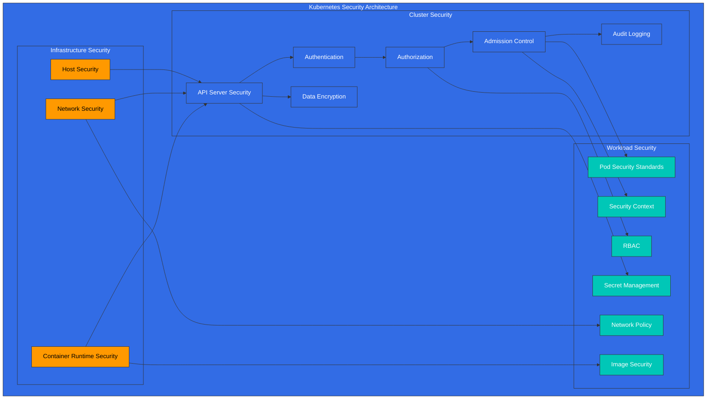
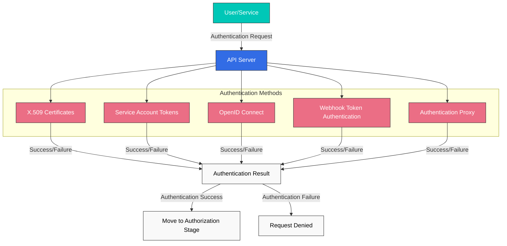
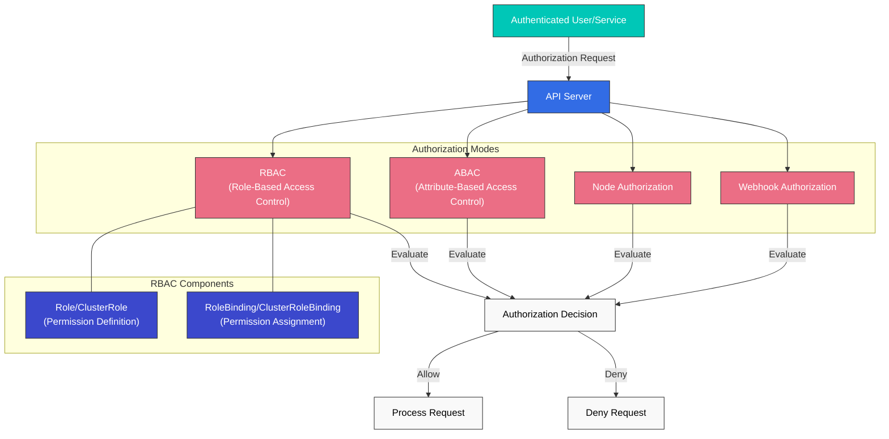
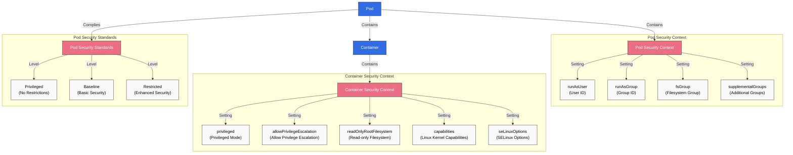
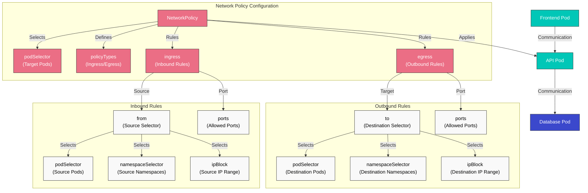
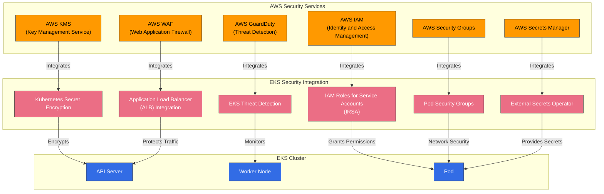

# Kubernetes Security

> **Supported Versions**: Kubernetes 1.32, 1.33, 1.34
> **Last Updated**: November 24, 2025

In Kubernetes, security is a key element for protecting clusters and applications. In this chapter, we'll explore Kubernetes security concepts, authentication and authorization mechanisms, network policies, security contexts, and how to enhance security in Amazon EKS.

## Lab Environment Setup

To follow the examples in this document, you'll need the following tools and environment:

### Required Tools
- kubectl v1.34 or higher
- A working Kubernetes cluster (EKS, minikube, kind, etc.)
- OpenSSL (for certificate creation)

### Security Example Setup

```bash
# Create namespace
kubectl create namespace security-demo

# Create service account
kubectl -n security-demo create serviceaccount demo-sa

# Create role
kubectl -n security-demo apply -f - <<EOF
apiVersion: rbac.authorization.k8s.io/v1
kind: Role
metadata:
  name: pod-reader
rules:
- apiGroups: [""]
  resources: ["pods"]
  verbs: ["get", "watch", "list"]
EOF

# Create role binding
kubectl -n security-demo apply -f - <<EOF
apiVersion: rbac.authorization.k8s.io/v1
kind: RoleBinding
metadata:
  name: read-pods
subjects:
- kind: ServiceAccount
  name: demo-sa
  namespace: security-demo
roleRef:
  kind: Role
  name: pod-reader
  apiGroup: rbac.authorization.k8s.io
EOF

# Create Pod with security context
kubectl -n security-demo apply -f - <<EOF
apiVersion: v1
kind: Pod
metadata:
  name: security-context-demo
spec:
  serviceAccountName: demo-sa
  securityContext:
    runAsUser: 1000
    runAsGroup: 3000
    fsGroup: 2000
  containers:
  - name: sec-ctx-demo
    image: busybox
    command: ["sh", "-c", "sleep 3600"]
    securityContext:
      allowPrivilegeEscalation: false
      readOnlyRootFilesystem: true
EOF
```

## Kubernetes Security Architecture



## Table of Contents
1. [Security Overview](#security-overview)
2. [Authentication](#authentication)
3. [Authorization](#authorization)
4. [Security Context](#security-context)
5. [Network Policy](#network-policy)
6. [Secret Management](#secret-management)
7. [Image Security](#image-security)
8. [Pod Security Standards](#pod-security-standards)
9. [Audit Logging](#audit-logging)
10. [EKS Security Best Practices](#eks-security-best-practices)

## Security Overview

> **Key Concept**: Kubernetes security follows a Defense in Depth approach, providing multiple security mechanisms at the infrastructure, cluster, and workload levels.

Kubernetes security consists of the following main areas:

### Security Area Comparison

| Security Area | Main Components | Responsible Party | Security Mechanisms |
|--------------|-----------------|-------------------|---------------------|
| **Infrastructure Security** | Host OS, Container Runtime, Network | Cluster Administrator | Firewall, OS hardening, Container runtime security |
| **Cluster Security** | API Server, etcd, kubelet | Cluster Administrator | Authentication, Authorization, Admission Control, Encryption |
| **Workload Security** | Pods, Containers, Services | Application Developer | Security Context, Network Policy, RBAC |

### Security Principles

1. **Principle of Least Privilege**: Grant only the minimum necessary permissions
2. **Defense in Depth**: Defense through multiple security layers
3. **Default Deny**: Deny everything not explicitly allowed
4. **Security Hardening**: Apply stronger security settings than defaults
5. **Continuous Monitoring**: Detect and respond to security events

## Authentication

Authentication is the process of verifying who a user or service account is. Kubernetes supports various authentication methods:

### Authentication Methods

1. **X.509 Certificates**: Authentication using TLS client certificates
2. **Service Account Tokens**: Service account authentication using JWT tokens
3. **OpenID Connect (OIDC)**: Authentication through external identity providers
4. **Webhook Token Authentication**: Authentication through external authentication services
5. **Authentication Proxy**: Authentication through a proxy

### Service Account Example

```yaml
apiVersion: v1
kind: ServiceAccount
metadata:
  name: my-service-account
  namespace: default
---
apiVersion: v1
kind: Secret
metadata:
  name: my-service-account-token
  annotations:
    kubernetes.io/service-account.name: my-service-account
type: kubernetes.io/service-account-token
```

## Authentication

To access the Kubernetes API server, you must go through an authentication process. Kubernetes supports various authentication methods:



### X.509 Certificates

Kubernetes uses TLS certificates to authenticate clients. This is mainly used for internal cluster communication and administrator authentication.

```bash
# Example kubeconfig setup for certificate-based authentication
kubectl config set-credentials admin --client-certificate=admin.crt --client-key=admin.key
```

### Service Account Tokens

Service accounts are accounts used by processes running in Pods to communicate with the API server. Each service account has an automatically generated token that is automatically mounted to Pods.

```yaml
apiVersion: v1
kind: ServiceAccount
metadata:
  name: my-service-account
  namespace: default
```

```yaml
apiVersion: v1
kind: Pod
metadata:
  name: my-pod
spec:
  serviceAccountName: my-service-account
  containers:
  - name: my-container
    image: nginx:1.19
```

### OpenID Connect (OIDC)

Supports authentication through external identity providers (e.g., AWS IAM, Google, Azure AD). This is useful for implementing Single Sign-On (SSO) in enterprise environments.

```bash
# Example kubeconfig setup using OIDC
kubectl config set-credentials oidc-user \
  --auth-provider=oidc \
  --auth-provider-arg=idp-issuer-url=https://accounts.google.com \
  --auth-provider-arg=client-id=<CLIENT_ID> \
  --auth-provider-arg=client-secret=<CLIENT_SECRET>
```

### Webhook Token Authentication

A method that validates tokens through an external authentication service. The API server forwards tokens to an external service, which validates the token and returns user information.

### Authentication Proxy

A method where an authentication proxy is placed in front of the API server to handle user authentication. The proxy includes authenticated user information in HTTP headers and forwards them to the API server.

## Authorization

If authentication is the process of verifying "who you are," authorization is the process of determining "what you can do." Kubernetes supports various authorization modes:



### RBAC (Role-Based Access Control)

RBAC is the most widely used authorization mechanism in Kubernetes. Through Roles and RoleBindings, you grant specific permissions to users or service accounts for certain resources.

#### Role and ClusterRole

Roles define permissions within a namespace, and ClusterRoles define permissions that apply to the entire cluster.

```yaml
# Namespace Role example
apiVersion: rbac.authorization.k8s.io/v1
kind: Role
metadata:
  namespace: default
  name: pod-reader
rules:
- apiGroups: [""]
  resources: ["pods"]
  verbs: ["get", "watch", "list"]
```

```yaml
# Cluster-wide ClusterRole example
apiVersion: rbac.authorization.k8s.io/v1
kind: ClusterRole
metadata:
  name: secret-reader
rules:
- apiGroups: [""]
  resources: ["secrets"]
  verbs: ["get", "watch", "list"]
```

#### RoleBinding and ClusterRoleBinding

RoleBinding binds a Role or ClusterRole to users, groups, or service accounts in a specific namespace. ClusterRoleBinding binds a ClusterRole to users, groups, or service accounts across the entire cluster.

```yaml
# RoleBinding example
apiVersion: rbac.authorization.k8s.io/v1
kind: RoleBinding
metadata:
  name: read-pods
  namespace: default
subjects:
- kind: User
  name: jane
  apiGroup: rbac.authorization.k8s.io
roleRef:
  kind: Role
  name: pod-reader
  apiGroup: rbac.authorization.k8s.io
```

```yaml
# ClusterRoleBinding example
apiVersion: rbac.authorization.k8s.io/v1
kind: ClusterRoleBinding
metadata:
  name: read-secrets-global
subjects:
- kind: Group
  name: manager
  apiGroup: rbac.authorization.k8s.io
roleRef:
  kind: ClusterRole
  name: secret-reader
  apiGroup: rbac.authorization.k8s.io
```

### ABAC (Attribute-Based Access Control)

ABAC is a method of granting permissions based on user attributes, resource attributes, environment attributes, etc. In Kubernetes, policies are defined through JSON files. It's less commonly used than RBAC due to management complexity, despite being more flexible.

### Node Authorization

Node authorization is a special authorization mode used when kubelets access the API server. Kubelets can only access resources related to the nodes they are running on (Pods, node status, etc.).

### Webhook Authorization

A method where authorization decisions are made through an external service. The API server forwards authorization requests to an external service, which decides whether to allow or deny the request.

## Security Context

Security context defines security settings at the Pod or container level. This allows fine-grained control over privileges, access control, capabilities, and more.



### Pod Security Context

```yaml
apiVersion: v1
kind: Pod
metadata:
  name: security-context-pod
spec:
  securityContext:
    runAsUser: 1000
    runAsGroup: 3000
    fsGroup: 2000
  containers:
  - name: security-context-container
    image: nginx:1.19
    securityContext:
      allowPrivilegeEscalation: false
      capabilities:
        drop:
        - ALL
      readOnlyRootFilesystem: true
```

In the example above:
- `runAsUser`: User ID under which the container process runs
- `runAsGroup`: Group ID under which the container process runs
- `fsGroup`: Group ID used when accessing volumes
- `allowPrivilegeEscalation`: Whether a process can gain more privileges than its parent process
- `capabilities`: Add or remove Linux kernel capabilities
- `readOnlyRootFilesystem`: Mount root filesystem as read-only

### Pod Security Standards

Starting from Kubernetes 1.25, Pod Security Policy was replaced by Pod Security Standards. Pod Security Standards define three policy levels:

1. **Privileged**: No restrictions, all privileges allowed
2. **Baseline**: Blocks known privilege escalation paths
3. **Restricted**: Strongly hardened security policy

```yaml
# Example applying Pod Security Standards to namespace
apiVersion: v1
kind: Namespace
metadata:
  name: my-namespace
  labels:
    pod-security.kubernetes.io/enforce: restricted
    pod-security.kubernetes.io/audit: restricted
    pod-security.kubernetes.io/warn: restricted
```

## Network Policy

Network policies provide a way to control communication between Pods. By default, all Pods in a Kubernetes cluster can communicate with each other, but this can be restricted using network policies.



```yaml
apiVersion: networking.k8s.io/v1
kind: NetworkPolicy
metadata:
  name: api-allow
  namespace: default
spec:
  podSelector:
    matchLabels:
      app: api
  policyTypes:
  - Ingress
  - Egress
  ingress:
  - from:
    - podSelector:
        matchLabels:
          app: frontend
    ports:
    - protocol: TCP
      port: 8080
  egress:
  - to:
    - podSelector:
        matchLabels:
          app: database
    ports:
    - protocol: TCP
      port: 5432
```

In the example above:
- Defines a network policy for Pods with the `api` label
- Allows only inbound traffic on port 8080 from Pods with the `frontend` label
- Allows only outbound traffic to port 5432 on Pods with the `database` label

To use network policies, the cluster's network plugin must support network policies. CNI plugins like Calico, Cilium, and Antrea support network policies.

## Secret Management

Kubernetes Secrets are used to store and manage sensitive information such as passwords, API keys, and certificates. However, by default, secrets are only base64 encoded, not encrypted. Therefore, additional security measures are needed.

### Secret Encryption

To encrypt secrets stored in etcd, you need to configure the API server's encryption configuration:

```yaml
apiVersion: apiserver.config.k8s.io/v1
kind: EncryptionConfiguration
resources:
  - resources:
      - secrets
    providers:
      - aescbc:
          keys:
            - name: key1
              secret: <base64-encoded-key>
      - identity: {}
```

### External Secret Management

For more secure secret management, you can use external secret management systems:

- HashiCorp Vault
- AWS Secrets Manager
- Azure Key Vault
- Google Secret Manager
- External Secrets Operator

## Image Security

Container image security is an important part of Kubernetes security.

### Image Vulnerability Scanning

Scan container images for vulnerabilities to identify and resolve known security issues:

- Trivy
- Clair
- Anchore
- AWS ECR Scan
- Docker Hub Scan

### Image Signing and Verification

Verify the origin and integrity of images through image signing:

- Notary
- Cosign
- Portieris
- AWS Signer
- Connaisseur

### Image Policies

Restrict pulling images only from trusted registries through image policies:

```yaml
apiVersion: admission.k8s.io/v1
kind: AdmissionConfiguration
plugins:
- name: ImagePolicyWebhook
  configuration:
    imagePolicy:
      kubeConfigFile: /path/to/kubeconfig
      allowTTL: 50
      denyTTL: 50
      retryBackoff: 500
      defaultAllow: false
```

## Audit

Kubernetes auditing provides a mechanism to record and analyze events occurring in the cluster.

### Audit Policy

Audit policies define which events to record:

```yaml
apiVersion: audit.k8s.io/v1
kind: Policy
rules:
- level: Metadata
  resources:
  - group: ""
    resources: ["pods"]
- level: Request
  resources:
  - group: ""
    resources: ["secrets"]
- level: None
  users: ["system:kube-proxy"]
  resources:
  - group: ""
    resources: ["endpoints", "services"]
```

Audit levels:
- `None`: Don't record events
- `Metadata`: Record only request metadata (user, time, resource, etc.)
- `Request`: Record request metadata and request body
- `RequestResponse`: Record request metadata, request body, and response body

### Audit Log Backends

Audit logs can be stored in various backends:
- File
- Webhook
- Dynamic backends (e.g., Elasticsearch, Loki)

## Amazon EKS Security Enhancement

Amazon EKS can enhance security by integrating with AWS security services in addition to Kubernetes' basic security features.



### IAM Roles and Service Accounts (IRSA)

Using IRSA (IAM Roles for Service Accounts), you can associate IAM roles with Kubernetes service accounts to securely access AWS services.

```bash
# Create OIDC provider
eksctl utils associate-iam-oidc-provider --cluster my-cluster --approve

# Create IAM role and associate with service account
eksctl create iamserviceaccount \
  --name my-service-account \
  --namespace default \
  --cluster my-cluster \
  --attach-policy-arn arn:aws:iam::aws:policy/AmazonS3ReadOnlyAccess \
  --approve
```

### Secret Encryption with AWS KMS

You can use AWS KMS to encrypt Kubernetes secrets in your EKS cluster.

```bash
# Create KMS key
aws kms create-key --description "EKS Secret Encryption Key"

# Specify KMS key when creating EKS cluster
eksctl create cluster --name my-cluster --encryption-provider-key-arn arn:aws:kms:region:account-id:key/key-id
```

### AWS Security Groups

Apply AWS security groups to EKS cluster nodes and Pods to control network traffic.

```bash
# Create security group
aws ec2 create-security-group --group-name eks-cluster-sg --description "EKS Cluster Security Group"

# Add inbound rule
aws ec2 authorize-security-group-ingress \
  --group-id sg-12345 \
  --protocol tcp \
  --port 443 \
  --cidr 10.0.0.0/16
```

### AWS WAF

Place AWS WAF (Web Application Firewall) in front of EKS clusters to protect web applications.

```bash
# Create WAF Web ACL
aws wafv2 create-web-acl \
  --name eks-web-acl \
  --scope REGIONAL \
  --default-action Allow={} \
  --visibility-config SampledRequestsEnabled=true,CloudWatchMetricsEnabled=true,MetricName=eks-web-acl
```

### AWS GuardDuty

Use AWS GuardDuty to detect and respond to security threats in EKS clusters.

```bash
# Enable GuardDuty
aws guardduty create-detector --enable

# Enable EKS protection
aws guardduty update-detector \
  --detector-id 12abc34d567e8fa901bc2d34e56789f0 \
  --features '[{"Name": "EKS_RUNTIME_MONITORING", "Status": "ENABLED"}]'
```

## Security Best Practices

Here are best practices for enhancing the security of Kubernetes clusters and workloads.

### Cluster Security

1. **Keep Versions Up to Date**: Keep Kubernetes and all components up to date to patch known vulnerabilities.
2. **Restrict API Server Access**: Restrict access to the API server and allow public access only when necessary.
3. **etcd Encryption**: Encrypt data stored in etcd to protect sensitive information.
4. **Enable Audit Logging**: Enable audit logging to monitor and analyze cluster activity.
5. **Implement Network Policies**: Implement network policies to restrict Pod-to-Pod communication.

### Workload Security

1. **Principle of Least Privilege**: Grant only the minimum necessary permissions to Pods and containers.
2. **Non-root User**: Run containers as non-root users.
3. **Read-only Filesystem**: Mount container root filesystems as read-only when possible.
4. **Resource Limits**: Set CPU and memory resource limits to prevent DoS attacks.
5. **Configure Security Context**: Properly configure Pod and container security contexts.

### Image Security

1. **Minimal Base Images**: Use base images with minimal packages.
2. **Image Vulnerability Scanning**: Regularly scan container images for vulnerabilities.
3. **Image Signing and Verification**: Verify the origin and integrity of images through image signing.
4. **Trusted Registries**: Pull images only from trusted registries.
5. **Use Latest Images**: Regularly update images to patch known vulnerabilities.

### Secret Management

1. **External Secret Management**: Use external secret management systems to securely manage secrets.
2. **Secret Encryption**: Encrypt secrets stored in etcd.
3. **Secret Rotation**: Regularly rotate secrets to enhance security.
4. **Minimum Privilege Access**: Restrict access to secrets to only the necessary Pods.
5. **Use Volumes Instead of Environment Variables**: Mount secrets through volumes instead of environment variables.

## Conclusion

Kubernetes security must be implemented at multiple layers, considering security in all areas including cluster infrastructure, Kubernetes components, and application workloads. Along with Kubernetes' basic security features like authentication, authorization, network policies, and security contexts, you can enhance cluster and workload security through additional security measures like image security, secret management, and audit logging.

When using Amazon EKS, you can further enhance security by integrating with various AWS security services. Services like IAM Roles and Service Accounts (IRSA), secret encryption with AWS KMS, AWS Security Groups, AWS WAF, and AWS GuardDuty can be used to improve EKS cluster security.

Security is an ongoing process, so it's important to maintain the security posture of clusters and workloads through regular security assessments and updates.

## Quiz

To test what you learned in this chapter, try the [Security Quiz](../quizzes/core/06-security-quiz.md).

## References

- [Kubernetes Official Documentation - Security](https://kubernetes.io/docs/concepts/security/)
- [Kubernetes Official Documentation - Authentication](https://kubernetes.io/docs/reference/access-authn-authz/authentication/)
- [Kubernetes Official Documentation - Authorization](https://kubernetes.io/docs/reference/access-authn-authz/authorization/)
- [Kubernetes Official Documentation - RBAC](https://kubernetes.io/docs/reference/access-authn-authz/rbac/)
- [Kubernetes Official Documentation - Network Policies](https://kubernetes.io/docs/concepts/services-networking/network-policies/)
- [Kubernetes Official Documentation - Security Context](https://kubernetes.io/docs/tasks/configure-pod-container/security-context/)
- [Kubernetes Official Documentation - Pod Security Standards](https://kubernetes.io/docs/concepts/security/pod-security-standards/)
- [Kubernetes Official Documentation - Secrets](https://kubernetes.io/docs/concepts/configuration/secret/)
- [Kubernetes Official Documentation - Audit](https://kubernetes.io/docs/tasks/debug-application-cluster/audit/)
- [Amazon EKS Official Documentation - Security](https://docs.aws.amazon.com/eks/latest/userguide/security.html)
- [Amazon EKS Official Documentation - IAM Roles for Service Accounts](https://docs.aws.amazon.com/eks/latest/userguide/iam-roles-for-service-accounts.html)
- [Amazon EKS Official Documentation - Secret Encryption](https://docs.aws.amazon.com/eks/latest/userguide/enable-kms.html)
- [AWS Security Blog - EKS Security Best Practices](https://aws.amazon.com/blogs/containers/amazon-eks-security-best-practices/)
